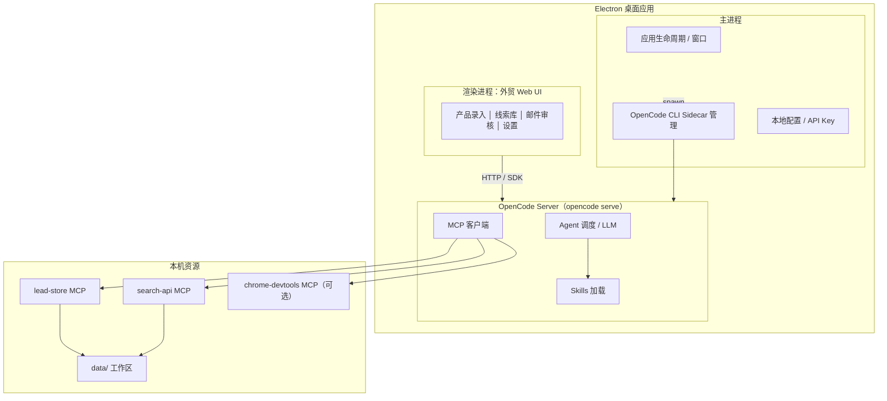

# 08 - 产品架构决策：Electron + OpenCode CLI

> **决策日期**：2026-07-12  
> **状态**：已确认  
> **替代方案**：纯 Web SaaS、Cursor 绑定、自研独立 Agent 引擎（暂不采用）

---

## 1. 决策摘要

**产品形态**：桌面应用（Electron）+ 内嵌 OpenCode CLI（Sidecar Server）+ 自研外贸业务 Web UI。

业务用户通过**安装一个桌面 App** 完成全流程，无需安装 Cursor、无需手动配置 MCP、无需在 IDE 里对话。

---

## 2. 为什么选择这个方案

| 考量 | Electron + OpenCode CLI |
|------|-------------------------|
| 学习成本 | 用户只见按钮和表单，不见 MCP/Skill |
| 与 Phase 1 复用 | Skills、MCP、`data/` 约定可直接沿用 |
| 智能体引擎 | 复用 OpenCode 成熟的 Agent + MCP 调度，不自研 |
| 数据与隐私 | 默认本地 `data/`，API Key 存本机 |
| 探索能力 | 本机可接 chrome-devtools-mcp、Playwright |
| 产品化 | 单安装包，类似 OpenCode Desktop 模式 |
| 开源生态 | OpenCode 可自托管、可定制，不绑 Cursor 商业 IDE |

---

## 3. 目标架构



### 3.1 各层职责

| 层 | 职责 | 技术 |
|----|------|------|
| **外贸 Web UI** | 产品录入、探索触发、线索展示、邮件审核 | React/Vite/Solid（待定），跑在 Electron Renderer |
| **Electron 主进程** | 启动/停止 OpenCode、读写配置、系统对话框、自动更新 | Electron Main |
| **OpenCode CLI** | Agent 循环、LLM 调用、MCP 连接、Skill 执行 | `opencode serve`（Sidecar 子进程） |
| **MCP 服务** | lead-store、search-api 等确定性工具 | Phase 1 已有 `mcp-servers/` |
| **Skills** | 业务流程编排说明 | Phase 1 已有 `skills/` |
| **data/** | 画像、线索、邮件持久化 | JSON 文件（Phase 2 可迁 SQLite） |

### 3.2 与 OpenCode Desktop 的关系

OpenCode 官方桌面版也是：**Electron + 内嵌 CLI Server + Web UI**。

本项目的差异在于：

- **UI 不是通用编程界面**，而是外贸获客专用控制台
- **Skills 是领域工作流**（extract-product-profile、discover-leads 等）
- **MCP 是外贸工具链**（lead-store、search-api）

引擎用 OpenCode，产品是自研 UI。

---

## 4. 运行时序（典型操作）

### 4.1 应用启动

```
1. 用户双击 App
2. Electron Main 启动 opencode serve（指定 port、workspace、MCP 配置）
3. 等待 Server 就绪
4. Renderer 加载 Web UI，连接 http://127.0.0.1:{port}
5. UI 显示「就绪」
```

### 4.2 用户点击「提取产品画像」

```
1. UI 收集网站 URL
2. UI → OpenCode API：创建 Session / 发送 Prompt（或调用预置 Skill 触发语）
3. OpenCode Agent 执行 extract-product-profile Skill
4. Agent 调用 lead-store、chrome-devtools MCP
5. 结果写入 data/products/{id}/profile.json
6. UI 轮询或订阅事件，读取 profile 展示（经 lead-store API 或直接读 data/）
```

### 4.3 用户点击「开始 R1 探索」

```
1. UI 触发 discover-leads Skill（带 product_id、max_queries）
2. OpenCode 编排：search-api → chrome-devtools → lead-store
3. UI 展示进度（queries_executed、leads_found）
4. 完成后跳转线索库页
```

---

## 5. 后端在哪里？客户端还是服务端？

**结论：Phase 2 后端在客户端（本机）。**

| 组件 | 运行位置 |
|------|---------|
| OpenCode Server | 本机（Electron Sidecar） |
| lead-store / search-api | 本机（MCP 子进程） |
| chrome-devtools | 本机（用户 Chrome） |
| LLM API | 云端（OpenAI / Anthropic 等，由 OpenCode 配置） |
| Tavily | 云端（Key 存本机配置） |
| 外贸 Web UI | Electron 渲染进程（本质本地） |

**不是**纯浏览器 SaaS；**是**本地 Desktop + 云端 LLM/搜索 API。

未来若做多租户 SaaS，可再增加**远程 OpenCode Server** 模式，与本地模式并存。

---

## 6. 项目目录规划（Phase 2 新增）

```
foreign-trade-customer-search/
├── mcp-servers/          # 不变
├── skills/               # 不变
├── data/                 # 运行时工作区（App 可配置路径）
├── docs/
├── desktop/              # 新增：Electron 应用
│   ├── package.json
│   ├── electron/
│   │   ├── main.ts       # 主进程：Sidecar、配置
│   │   └── preload.ts
│   ├── src/              # 外贸 Web UI
│   │   ├── pages/
│   │   └── api/          # 封装 OpenCode HTTP / lead-store 调用
│   └── resources/
│       └── opencode-cli/ # 打包的 opencode 二进制（按平台）
└── config/
    └── opencode/         # OpenCode MCP 配置模板
        └── mcp.json
```

---

## 7. OpenCode 集成要点

### 7.1 Sidecar 启动参数（示例）

```bash
opencode serve \
  --port 4096 \
  --workspace /path/to/workspace
```

工作区（workspace）指向含 `data/`、`config/`、`skills/` 的项目根目录。

### 7.2 MCP 配置

OpenCode 读取 workspace 下的 MCP 配置，指向：

- `mcp-servers/lead-store/dist/index.js`
- `mcp-servers/search-api/dist/index.js`
- `user-chrome-devtools`（本机已安装的 MCP，或 App 引导安装）

### 7.3 Skills 加载

将 `skills/` 同步或链接至 OpenCode 可识别的 Skills 目录（具体路径依 OpenCode 版本配置而定）。

### 7.4 UI 与 Agent 的协作方式

| 方式 | 说明 |
|------|------|
| **A. Prompt 触发 Skill** | UI 发送固定触发语，如「请对 prod_xxx 执行 R1 探索」 |
| **B. OpenCode API 直接调 Tool** | 若 OpenCode 暴露 MCP 代理 API，UI 绕过对话直接调 lead-store |
| **C. 混合** | 展示/列表用 B（读 data）；执行流程用 A（Agent 编排） |

Phase 2 MVP 推荐 **C**：列表与表单直接读 `lead-store`；「一键探索」等长流程走 Agent + Skill。

---

## 8. Phase 2 实施阶段（修订）

### 2.0 桌面壳 + OpenCode 集成（P0，新增）

| # | 任务 | 说明 |
|---|------|------|
| 2.0.1 | 初始化 `desktop/` Electron 项目 | Vite + React 或 Solid |
| 2.0.2 | Main 进程：Sidecar 启停 opencode serve | 参考 OpenCode Desktop |
| 2.0.3 | 打包/捆绑 opencode CLI（win/mac） | 或安装时检测 + 引导 |
| 2.0.4 | OpenCode MCP 配置模板 | lead-store、search-api |
| 2.0.5 | Skills 同步至 OpenCode 可加载路径 | 复用 sync-skills 脚本 |

### 2.1 外贸 Web UI（P0）

| # | 任务 | 说明 |
|---|------|------|
| 2.1.1 | 产品录入页 | URL → 触发 extract-product-profile |
| 2.1.2 | 产品画像页 | 展示/编辑 profile |
| 2.1.3 | 探索页 | 一键 R1 + 进度 |
| 2.1.4 | 线索库页 | scored.json 表格 |
| 2.1.5 | 邮件审核页 | draft 编辑 + 通过 |
| 2.1.6 | 设置页 | Tavily Key、LLM Provider |

### 2.2 引擎增强（P1，原 Phase 2）

- email-sender、scheduler、R2/R3 探索、SQLite 等（见 [04-实施计划.md](04-实施计划.md)）

---

## 9. 风险与应对

| 风险 | 应对 |
|------|------|
| OpenCode 版本升级 breaking change | 锁定 CLI 版本；抽象 UI 与 Server 的 API 层 |
| Sidecar 启动失败 | Main 进程健康检查 + 用户可读错误提示 |
| 安装包体积大 | 分平台打包；CLI 按需下载 |
| chrome-devtools 依赖用户 Chrome | 探索页检测环境；Phase 2 备选 Playwright MCP |
| Windows 防火墙拦截本地端口 | 固定 localhost + 文档说明 |

---

## 10. 明确不做的（本阶段）

- 不做纯浏览器 SaaS（无本地 Server）
- 不要求用户安装 Cursor
- 不自研完整 Agent 引擎（复用 OpenCode）
- 不在 Phase 2 做移动端

---

## 11. 相关文档

- [Phase 1 复盘](retrospective/phase-1.md)
- [04-实施计划.md](04-实施计划.md)
- [02-系统架构.md](02-系统架构.md)（待更新 Electron 层）
