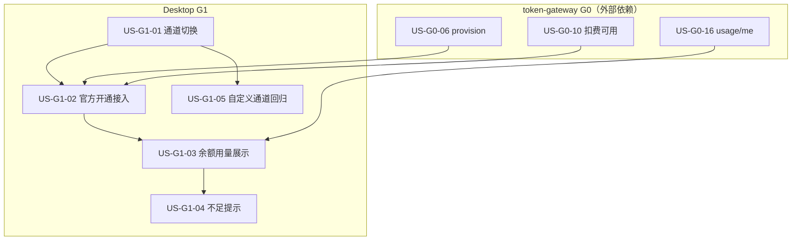

# 12 - 官方模型通道用户故事（Desktop）

> **文档类型**：消费方用户故事  
> **对接规格**：[11-官方模型通道对接.md](./11-官方模型通道对接.md)  
> **网关故事**：[token-gateway/docs/02-用户故事.md](../token-gateway/docs/02-用户故事.md)（G0/G2）  
> **实施**：[04-实施计划.md](./04-实施计划.md) Phase G1

---

## 1. 说明

本文件只含 **桌面端对接** 故事（原 US-G1-*）。网关服务端故事已迁至 `token-gateway/docs/02-用户故事.md`。

| 字段 | 含义 |
|------|------|
| 依赖 | 含桌面故事 ID，或网关故事 `US-G0-*`（见网关文档） |

### 依赖总览



---

## 2. 用户故事

### US-G1-01　官方 / 自定义通道切换

**作为** 终端用户，**我想** 在设置里选择官方通道或自定义通道，**以便** 按需使用网关或自备 Key。

| 项 | 内容 |
|----|------|
| 优先级 | Must |
| 依赖 | —（UI 可先行；联调依赖 G0） |
| 验收要点 | 两种模式可切换并持久化；文案清晰 |
| 映射 | FR-DESKTOP-01 |

---

### US-G1-02　官方通道开通并写入网关凭证

**作为** 已 UC 登录的用户，**我想** 以 `name=ftcs-desktop` provision 并配置 OpenCode `baseURL` + `sk-`，**以便** 无需自备 DeepSeek Key 跑业务。

| 项 | 内容 |
|----|------|
| 优先级 | Must |
| 依赖 | US-G0-06，US-G0-10，US-G1-01 |
| 验收要点 | 未登录引导登录；成功后官方通道可用；AT-08 |
| 映射 | FR-DESKTOP-02；S1 |

---

### US-G1-03　设置页展示余额与今日用量

**作为** 终端用户，**我想** 看到余额（元）与今日输入/输出 Token，**以便** 感知消耗。

| 项 | 内容 |
|----|------|
| 优先级 | Must |
| 依赖 | US-G0-16，US-G1-02 |
| 验收要点 | 调用 usage/me；厘→元展示正确；AT-D-02 |
| 映射 | FR-DESKTOP-04 |

---

### US-G1-04　余额不足提示与充值引导

**作为** 终端用户，**我想** 在余额不足时看到明确提示与联系运营说明，**以便** 知道如何继续使用。

| 项 | 内容 |
|----|------|
| 优先级 | Should |
| 依赖 | US-G1-03 |
| 验收要点 | 可读错误/横幅；无在线支付入口；AT-D-03 |
| 映射 | FR-DESKTOP-05 |

---

### US-G1-05　自定义通道行为回归

**作为** 终端用户，**我想** 自定义通道仍使用我自己的上游 Key，**以便** 不被强制走网关。

| 项 | 内容 |
|----|------|
| 优先级 | Must |
| 依赖 | US-G1-01 |
| 验收要点 | 不调用网关计费；行为与现网一致；AT-09 |
| 映射 | FR-DESKTOP-03 |

---

## 3. 建议顺序

```
US-G1-01 ─┬─► US-G1-02 ─► US-G1-03 ─► US-G1-04
          └─► US-G1-05
```

前提：网关至少完成 provision、扣费主路径、usage/me（US-G0-06 / 10 / 16）。

---

## 4. 对照 Phase G1

| 任务 | 故事 |
|------|------|
| G1.1 通道切换 | US-G1-01 |
| G1.2 官方开通 | US-G1-02 |
| G1.3 余额用量 | US-G1-03 |
| G1.4 不足提示 | US-G1-04 |
| （回归）自定义通道 | US-G1-05 |
