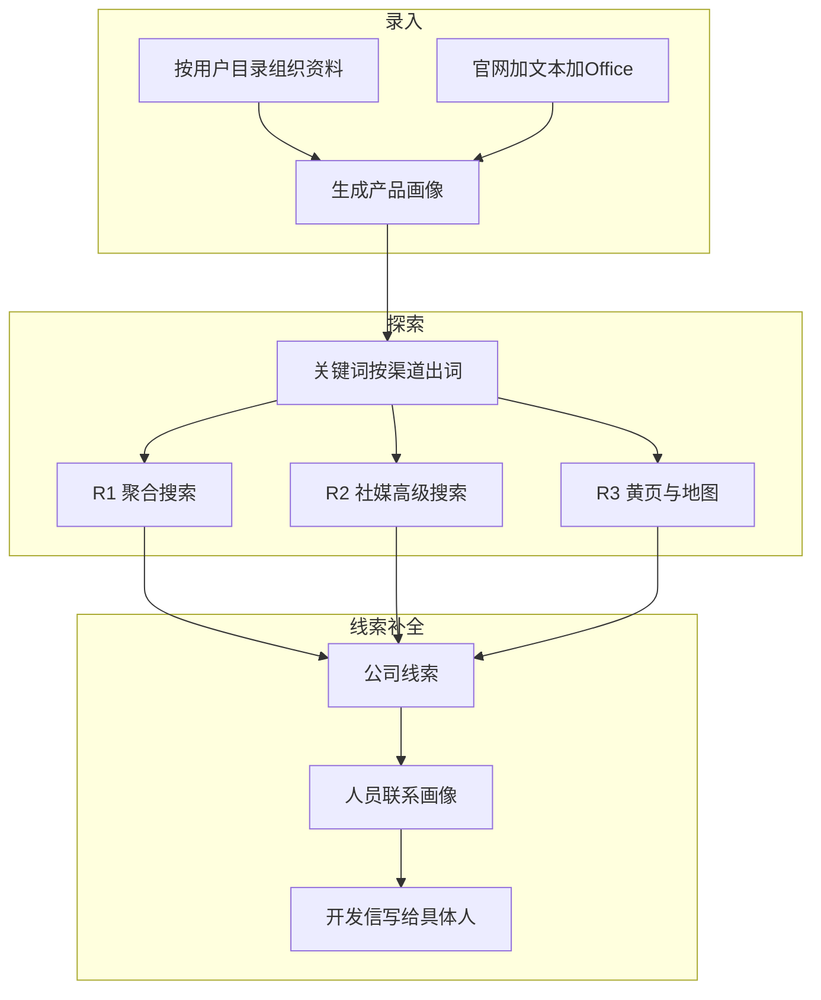

# 17 - 下一阶段规划：业务效率工具

> **文档类型**：阶段规划（尚未拆用户故事 / 详细设计）  
> **状态**：草案，2026-08-17 对齐  
> **基线**：桌面端约 v0.4.1，MVP 主路径已可跑通  
> **下一步**：按本文件三条主线拆用户故事与详细设计；通过后再改 [04-实施计划.md](04-实施计划.md) 任务清单

本文是 MVP 之后的**方向文档**。不替代 04 的执行勾选，也不在此刻改 01 / 02 的旧轮次表。拆解完成后再回写那些权威文档。

---

## 1. 一句话目标

把产品从「能跑通的极客玩具」做成**外贸业务员能用的效率工具**：

- **录入**：按自己的目录放下多家公司、多个产品，用官网 + 文本 / Office 生成画像  
- **探索**：轮次表示不同获客渠道，而不只是同一搜索框里更深的词  
- **线索**：从「公司官网邮箱」补到「这家公司里该找谁」

发信、定时复搜、海关贸易数据仍有价值，**不是本阶段主线**。旧计划中的「R2 贸易数据 / R3 竞品反查 / 2.4 发信 / scheduler」搁置，轮次定义以本文为准。

---

## 2. MVP 已交付（规划起点）

桌面应用已能跑通：

```
录入（偏官网）→ 画像 → 关键词 → R1 探索 → 线索 → 开发信草稿
```

同时可用：官方 / 自定义模型通道、官方搜索通道、设置页余额与充值跳转、产品官网与安装引导。

[04-实施计划.md](04-实施计划.md) 中 Phase G 等清单可能落后于代码，规划本阶段时以**实际已交付能力**为准，不要被过期 backlog 牵着走。

---

## 3. 三条主线



R2、R3、人员搜索的**实现可行性**待需求评审与详细设计确认。本文件先锁定语义，避免继续按旧定义做海关 / 竞品反查。

---

## 4. 录入：按目录管理资料并生成画像

### 4.1 现状缺口

资料库已有建目录、上传文件、勾选生成的界面壳，但业务语义未立住。

| 缺口 | 现状 |
|------|------|
| 网站进不了用户目录 | 网站写在 `data/library/websites/`，保存时不使用当前文件夹 |
| 目录不是候选单元 | 文件夹不能勾选；生成时遇到目录会跳过 |
| 文件生成画像未成立 | 可导入 PDF/Word/Excel，Skill 却把 special 格式整批停止 |
| 侧栏与资料夹脱节 | 生成后的产品仍是扁平 `prod_*` 列表；本阶段不强行改成公司树 |

### 4.2 做成什么样

- 用户按自己的习惯建目录（例如 `某公司/地板`、`某公司/墙板`、`另一家工厂`），**不强制**公司 / 产品实体数据模型。  
- 每个目录里既能放官网，也能放说明书、报价表、产品目录。  
- 勾选若干网站、文件，或勾选整个文件夹，生成一份可编辑画像。  
- 输入：**官网、txt/md/csv/json，以及常见 Office（pdf / docx / xlsx，xls 尽量兼容）**。  
- 官网 + 文件同时选时，信息合并进同一份画像。

### 4.3 产品决策（暂定）

**资料库改成一棵树。** 网站书签放进当前文件夹，例如：

`data/library/files/绿森塑木/户外地板/www.example.com.md`

已有 `data/library/websites/` 迁移到 `files/` 根目录。录入页只保留一套文件管理器：新建目录、上传 / 粘贴 / 拖入、在当前目录保存网站。

**勾选规则：**

| 勾选对象 | 含义 |
|----------|------|
| 文件 / 网站书签 | 该条进入候选 |
| 文件夹 | 该目录下一层的文件 + 网站（不自动吞掉子产品目录） |
| 点「生成画像」 | 一份画像 = 当前候选集合的并集 |

多家公司、多个产品靠**分目录整理、分次生成**。一次勾选多个产品文件夹时，先拦截并提示只选一个（按文件夹批量生成可作为后续增强）。

生成仍复制快照到 `data/products/{id}/inputs/`，文件夹路径写入 `_sources.json` / `source_inputs`。

**Office 在生成前抽成文本。** 不另做 Agent 必须记得调用的 file-parser MCP。复制到 `inputs/` 时：

- 文本原样复制  
- pdf / docx / xlsx（xls）抽出侧车文本，原件保留  
- 单文件失败可跳过，不毁掉整次生成  
- Skill 读抽出文本，删除「遇到 special 就整批停止」

### 4.4 录入本阶段不做

- 图片 OCR、老格式 `.doc`（解析成本高则提示转换）  
- 把用户目录映射成数据库 Company / Product 实体  
- 侧栏产品列表改成与资料夹一一对应的树  
- 审核后一键发信、定时复搜（原 R4）

---

## 5. 探索与关键词：重定 R1 / R2 / R3

### 5.1 现状

探索页只执行 **R1**（聚合搜索 + 打开页面判断）。关键词扩展仍按旧文档给 query 打上 R1–R4（约 60/20/15/5），那些 R2/R3 只是更深的检索词，**仍走同一条聚合搜索管道**。

### 5.2 废弃的旧定义

| 轮次 | 旧含义 | 本阶段态度 |
|------|--------|------------|
| R2 | 贸易数据 / 海关 / 展会名单 | 不再作为现行目标 |
| R3 | 竞品客户反查、LinkedIn API、采购公告 | 不再作为现行目标 |
| R4 | 定时复搜高产出词 | 本阶段不排 |

### 5.3 新定义（暂定，评审后确认可行性）

| 轮次 | 业务含义 | 暂定做法 |
|------|----------|----------|
| **R1** | 广撒网 | 维持现状：聚合搜索引擎关键字匹配 |
| **R2** | 社交与站点限定 | 搜索引擎高级搜索（如 `site:`），针对 Facebook、领英等社媒内容 |
| **R3** | 本地 / 名录渠道 | 地区黄页浏览；以及 Google 地图 + 行业搜索（两条先挂在 R3） |
| **R4** | — | 定时复搜仍搁置 |

R3 有两条候选通道。评审时再决定：同轮两条，还是拆成 R3 / R4。在此之前产品**不承诺**两条都能点。

**轮次 = 渠道。** 关键词扩展不再把 R2/R3 当成同一搜索框里更深的句子：

- R1：普通产品 / 场景 / 买家 / 地理检索词  
- R2：带高级语法的查询骨架（站点名单评审时定）  
- R3：黄页浏览目标、地图行业查询；未通过评审的通道先不出词  

探索 UI 今日已有 R2/R3/R4 筛选，但只能跑 R1。改文案后，未就绪轮次标明「规划中」。

### 5.4 评审必须回答（详细设计再答）

- R2：现有搜索是否支持 `site:` 等语法；社媒结果能否打开、判断；登录墙与平台条款  
- R3 黄页：先做哪些国家 / 站点；用搜索找黄页页，还是按目录浏览  
- R3 地图：地图自动化、配额与条款；与黄页是否重复线索  
- 多轮线索如何写入 `raw/{round}.jsonl`、评分是否按来源加权  

评审通过前**可以**先改文档语义、出词规则、探索页文案。  
**不默认开工**：贸易数据 API、LinkedIn 官方 API、采购公告爬虫、定时 R4。

---

## 6. 线索：从公司邮箱到人员联系画像

### 6.1 现状

线索 `contacts` 多半是官网上的 `sales@` / `info@`。代码允许 `linkedin` 联系类型，但没有「按这家公司去社媒找人」的步骤。开发信只能写给公司通用邮箱。

### 6.2 与 R2 的区别

| | R2 高级搜索 | 人员联系画像 |
|--|-------------|--------------|
| 输入 | 产品关键词 + 站点限定 | **已有公司线索** |
| 输出 | 新的公司级 Lead | 该公司下的**人员** |
| 目的 | 多一条获客渠道 | 提高可触达性，开发信写给人 |


### 6.3 暂定能力（评审后确认可行性）

- 对 high / 用户勾选的线索，按公司名 + 画像中的买家角色，去领英等公开结果找人。  
- 每人至少：姓名、职位 / 角色、来源 URL、匹配理由；公开邮箱有则记，不强行挖私人联系方式。  
- 写入该 Lead 的 `contacts` 或扩展的 `people[]`（Schema 在详细设计定），供线索页与开发信选用收件人。  
- **默认人工触发**（「补全联系人」），不在 R1 每条线索上自动狂搜。

### 6.4 评审必须回答

- 数据来源：公开搜索 `site:linkedin.com`，还是要登录领英（后者本阶段默认不承诺）  
- 合规：GDPR、平台条款；只收公开职业信息；用户可删除；不默认把简历原文当可转发附件存储  
- 与 R2：若结果已是个人主页，是新建公司线索并挂人，还是先归公司再补全  
- 开发信：无人员时仍用公司邮箱；有人员时默认写给匹配买家角色的那一位  

评审通过前**可以**先预留人员字段与线索页空态。  
**不默认开工**：非官方领英爬虫、付费人脉库、猜测个人邮箱。

---

## 7. 建议落地顺序

先改录入（用户每天都碰到），探索与线索以「定义正确、实现看评审」并行准备。

1. 资料树统一：网站进当前目录，迁移旧 `websites/`  
2. 验收纯文本、官网 + 文本混合生成画像  
3. Office 抽取（pdf / docx / xlsx）  
4. 文件夹可作为候选（默认一层）  
5. 探索轮次改写：文档与 UI 语义、关键词按渠道出词；通道实现等评审  
6. 人员联系画像：与 R2 拆开；模型预留；搜索与合规进评审  

用户故事与详细设计拆完后，再更新 01 输入策略、02 探索策略表、03 Schema、04 任务清单、相关 Skill。

---

## 8. 成功标准

### 8.1 录入（本阶段可验收）

- 按自定义目录放下 2 家公司、至少 2 个产品资料夹，每夹含官网 + 至少 1 个文件。  
- 仅文本、仅官网、官网 + Office 三条路径都能生成画像。  
- 勾选某个产品文件夹即可生成，不必逐个勾文件。  
- 失败时说明「哪个文件读不了」，而不是甩格式黑名单或 MCP 术语。

### 8.2 探索（定义层必达；通道实现看评审）

- 文档与 UI 不再把 R2/R3 写成海关 / 竞品反查。  
- 关键词按渠道出词，不把「同一管道的深词」伪装成新数据源。  
- 评审记录写明 R2/R3：做 / 缓做 / 不做，以及黄页与地图是否拆轮。

### 8.3 线索补全（定义层必达；搜索实现看评审）

- 产品叙事区分「找到哪家公司」和「这家公司该找谁」。  
- 评审记录写明领英等人员搜索：做 / 缓做 / 不做，以及是否仅用公开搜索。

---

## 9. 本阶段明确不做

- 审核后一键发信、定时探索（原 R4）  
- 海关 / 贸易数据 API、竞品客户反查 API、采购公告爬虫  
- 非官方领英爬虫、付费人脉库、猜测个人邮箱  
- 完整 CRM、多租户计费改造、SQLite / PostgreSQL 迁移（非本阶段前置）

---

## 10. 后续拆解约定

拆用户故事时建议按三条主线分册，避免一张表混在一起：

| 主线 | 建议故事前缀 | 优先拆 |
|------|----------------|--------|
| 录入 | US-I*（Input） | 资料树、文本路径、Office、文件夹候选 |
| 探索 | US-E*（Explore） | 轮次语义与出词；R2/R3 各通道单独评审后再出实现故事 |
| 线索补全 | US-C*（Contact） | Schema / 空态；人员搜索实现故事挂在评审通过之后 |

每条实现故事仍按现有习惯写详细设计到 `docs/design/`。

---

## 11. 相关文档

- 执行清单（旧）：[04-实施计划.md](04-实施计划.md)  
- 概述与旧成功标准：[01-项目概述.md](01-项目概述.md)  
- 探索策略旧表：[02-系统架构.md](02-系统架构.md) 第 4 节  
- 线索 Schema：[03-数据模型.md](03-数据模型.md)  
- Phase 1 复盘：[retrospective/phase-1.md](retrospective/phase-1.md)  
- 桌面形态：[08-产品架构决策-Electron-OpenCode.md](08-产品架构决策-Electron-OpenCode.md)  
