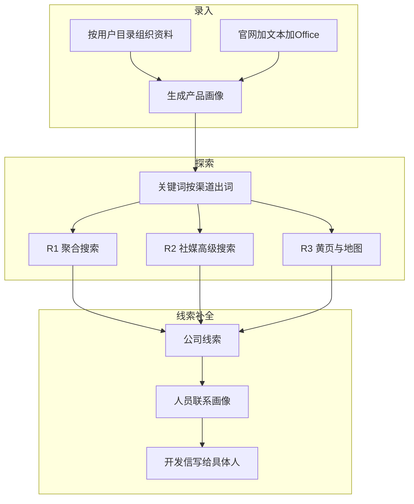
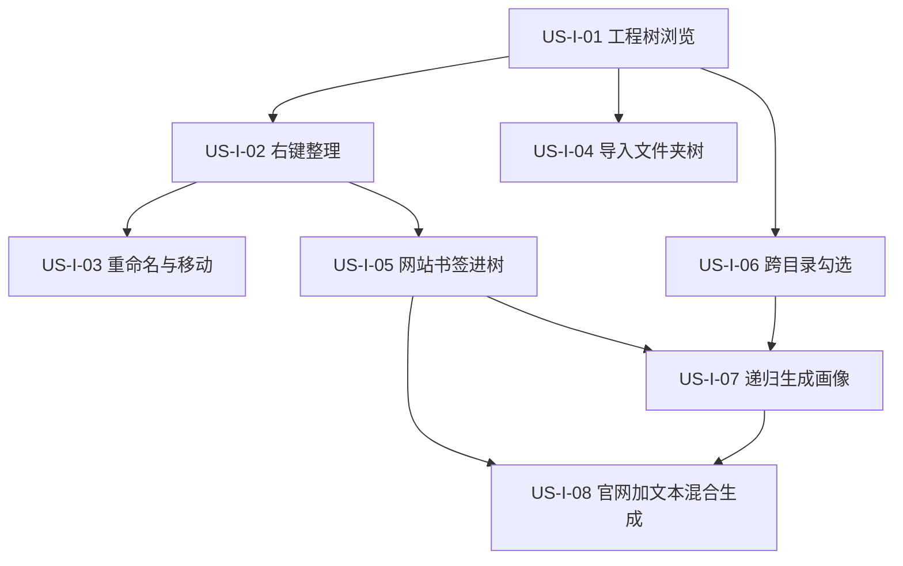

# 17 - 下一阶段规划：业务效率工具

> **文档类型**：阶段规划 + 已拆用户故事（录入 US-I）  
> **状态**：录入主线已评审并拆故事（2026-08-17）；探索 / 线索仍待评审后拆  
> **基线**：桌面端约 v0.4.1，MVP 主路径已可跑通  
> **下一步**：US-I-01 / US-I-02 / US-I-04 已落地；继续写 US-I-03 或 US-I-06 详细设计后实施；探索、线索按 §5 / §6 评审后再拆 US-E / US-C

本文是 MVP 之后的**方向文档**。不替代 04 的执行勾选，也不在此刻改 01 / 02 的旧轮次表。拆解完成后再回写那些权威文档。

---

## 1. 一句话目标

把产品从「能跑通的极客玩具」做成**外贸业务员能用的效率工具**：

- **录入**：按自己的目录放下多家公司、多个产品，用官网 + 文本 / Office 生成画像  
- **探索**：轮次表示不同获客渠道，而不只是同一搜索框里更深的词  
- **线索**：从「公司官网邮箱」补到「这家公司里该找谁」

发信、定时复搜、海关贸易数据仍有价值，**不是本阶段主线**。旧计划中的「R2 贸易数据 / R3 竞品反查 / 2.4 发信 / scheduler」搁置，轮次定义以本文为准。

---

## 2. MVP 已交付（规划起点）

桌面应用已能跑通：

```
录入（偏官网）→ 画像 → 关键词 → R1 探索 → 线索 → 开发信草稿
```

同时可用：官方 / 自定义模型通道、官方搜索通道、设置页余额与充值跳转、产品官网与安装引导。

[04-实施计划.md](04-实施计划.md) 中 Phase G 等清单可能落后于代码，规划本阶段时以**实际已交付能力**为准，不要被过期 backlog 牵着走。

---

## 3. 三条主线




R2、R3、人员搜索的**实现可行性**待需求评审与详细设计确认。本文件先锁定语义，避免继续按旧定义做海关 / 竞品反查。

---

## 4. 录入：按目录管理资料并生成画像

### 4.1 现状缺口

资料库已有建目录、上传文件、勾选生成的界面壳，但业务语义未立住。


| 缺口        | 现状                                         |
| --------- | ------------------------------------------ |
| 网站进不了用户目录 | 网站写在 `data/library/websites/`，保存时不使用当前文件夹  |
| 目录不是候选单元  | 文件夹不能勾选；生成时遇到目录会跳过                         |
| 只能进入一层    | 点进文件夹后看不到兄弟目录，切走勾选丢失                       |
| 整理入口在右上角  | 新建 / 粘贴 / 上传与「生成画像」挤在一起，不像管项目文件            |
| 文件生成画像未成立 | 可导入 PDF/Word/Excel，Skill 却把 special 格式整批停止 |
| 侧栏与资料夹脱节  | 生成后的产品仍是扁平 `prod_*` 列表；本阶段不强行改成公司树         |


### 4.2 做成什么样

- 用户按自己的习惯建目录（例如 `某公司/地板`、`某公司/墙板`、`另一家工厂`），**不强制**公司 / 产品实体数据模型。  
- 每个目录里既能放官网，也能放说明书、报价表、产品目录。  
- 录入页是 **IDE 式工程树**（展开 / 折叠，不「进入后只见当前夹」），可跨目录勾选。  
- 新建、粘贴、上传、重命名等整理操作走**右键菜单**（及拖放），顶栏主按钮只保留「生成画像」。  
- 勾选若干网站、文件，或勾选整个文件夹，生成一份可编辑画像。  
- 输入：**官网、txt/md/csv/json，以及常见 Office（pdf / docx / xlsx，xls 尽量兼容）**。  
- 官网 + 文件同时选时，信息合并进同一份画像。

### 4.3 产品决策（已评审部分如下）

**交互隐喻：开发工具的工程文件树。** 不是「打开一个文件夹看列表」，而是 Cursor / VS Code 资源管理器那种：整棵 `data/library/files` 可见，文件夹展开 / 折叠，勾选不因切目录丢失。

顶栏去掉「新建目录 / 粘贴文件 / 上传文件」。整理一律右键（空白处、文件夹、文件 / 网站书签各有菜单）；拖入树内 = 导入或移动。顶栏主操作只留 **生成画像**，旁注已选条目数。

网站书签是树节点（地球图标），与文件并列。添加网站 = 在目标文件夹上右键「保存网站」，弹对话框填 URL，写入该夹，例如：

`data/library/files/绿森塑木/户外地板/www.example.com.md`

已有 `data/library/websites/` 打开工作区时迁到 `files/` 根目录。

**勾选与生成（已评审，随工程树修订）：**


| 勾选对象      | 含义                          |
| --------- | --------------------------- |
| 文件 / 网站书签 | 该条进入候选                      |
| 文件夹       | **递归**：该夹下全部文件 + 网站书签       |
| 跨目录多选     | 允许（Ctrl / Shift，与 IDE 一致）   |
| 点「生成画像」   | 一份画像 = 候选并集（父夹 + 子项同时勾选则去重） |


粒度由勾选哪一层决定。勾选覆盖多个文件夹、或所点夹内还有子目录时，生成前确认将合并哪些路径。不再「禁止勾选多个文件夹」——工程树就是为了跨夹勾选；防误操作靠确认，不靠禁用。

**整理操作（已评审，本切片纳入）：** 重命名、移动（拖到另一夹）、从资源管理器导入整棵本地文件夹树、右键菜单覆盖新建夹 / 粘贴 / 上传 / 删除 / 保存网站。键盘习惯对齐 IDE（如 F2 重命名、Delete、Ctrl+V 贴到当前焦点夹）。

生成仍复制快照到 `data/products/{id}/inputs/`，资料路径写入 `_sources.json` / `source_inputs`。

**Office 在生成前抽成文本。** 不另做 Agent 必须记得调用的 file-parser MCP。复制到 `inputs/` 时：

- 文本原样复制  
- pdf / docx / xlsx（xls）抽出侧车文本，原件保留  
- 单文件失败可跳过，不毁掉整次生成  


- Skill 读抽出文本，删除「遇到 special 就整批停止」

### 4.4 录入本阶段不做

- 图片 OCR、老格式 `.doc`（解析成本高则提示转换）  
- 把用户目录映射成数据库 Company / Product 实体  
- 侧栏产品列表改成与资料夹一一对应的树  
- 审核后一键发信、定时复搜（原 R4）

---

## 5. 探索与关键词：重定 R1 / R2 / R3

### 5.1 现状

探索页只执行 **R1**（聚合搜索 + 打开页面判断）。关键词扩展仍按旧文档给 query 打上 R1–R4（约 60/20/15/5），那些 R2/R3 只是更深的检索词，**仍走同一条聚合搜索管道**。

### 5.2 废弃的旧定义


| 轮次  | 旧含义                      | 本阶段态度    |
| --- | ------------------------ | -------- |
| R2  | 贸易数据 / 海关 / 展会名单         | 不再作为现行目标 |
| R3  | 竞品客户反查、LinkedIn API、采购公告 | 不再作为现行目标 |
| R4  | 定时复搜高产出词                 | 本阶段不排    |


### 5.3 新定义（暂定，评审后确认可行性）


| 轮次     | 业务含义      | 暂定做法                                    |
| ------ | --------- | --------------------------------------- |
| **R1** | 广撒网       | 维持现状：聚合搜索引擎关键字匹配                        |
| **R2** | 社交与站点限定   | 搜索引擎高级搜索（如 `site:`），针对 Facebook、领英等社媒内容 |
| **R3** | 本地 / 名录渠道 | 地区黄页浏览；以及 Google 地图 + 行业搜索（两条先挂在 R3）    |
| **R4** | —         | 定时复搜仍搁置                                 |


R3 有两条候选通道。评审时再决定：同轮两条，还是拆成 R3 / R4。在此之前产品**不承诺**两条都能点。

**轮次 = 渠道。** 关键词扩展不再把 R2/R3 当成同一搜索框里更深的句子：

- R1：普通产品 / 场景 / 买家 / 地理检索词  
- R2：带高级语法的查询骨架（站点名单评审时定）  
- R3：黄页浏览目标、地图行业查询；未通过评审的通道先不出词

探索 UI 今日已有 R2/R3/R4 筛选，但只能跑 R1。改文案后，未就绪轮次标明「规划中」。

### 5.4 评审必须回答（详细设计再答）

- R2：现有搜索是否支持 `site:` 等语法；社媒结果能否打开、判断；登录墙与平台条款  
- R3 黄页：先做哪些国家 / 站点；用搜索找黄页页，还是按目录浏览  
- R3 地图：地图自动化、配额与条款；与黄页是否重复线索  
- 多轮线索如何写入 `raw/{round}.jsonl`、评分是否按来源加权

评审通过前**可以**先改文档语义、出词规则、探索页文案。  
**不默认开工**：贸易数据 API、LinkedIn 官方 API、采购公告爬虫、定时 R4。

---

## 6. 线索：从公司邮箱到人员联系画像

### 6.1 现状

线索 `contacts` 多半是官网上的 `sales@` / `info@`。代码允许 `linkedin` 联系类型，但没有「按这家公司去社媒找人」的步骤。开发信只能写给公司通用邮箱。

### 6.2 与 R2 的区别


|     | R2 高级搜索      | 人员联系画像        |
| --- | ------------ | ------------- |
| 输入  | 产品关键词 + 站点限定 | **已有公司线索**    |
| 输出  | 新的公司级 Lead   | 该公司下的**人员**   |
| 目的  | 多一条获客渠道      | 提高可触达性，开发信写给人 |


### 6.3 暂定能力（评审后确认可行性）

- 对 high / 用户勾选的线索，按公司名 + 画像中的买家角色，去领英等公开结果找人。  
- 每人至少：姓名、职位 / 角色、来源 URL、匹配理由；公开邮箱有则记，不强行挖私人联系方式。  
- 写入该 Lead 的 `contacts` 或扩展的 `people[]`（Schema 在详细设计定），供线索页与开发信选用收件人。  
- **默认人工触发**（「补全联系人」），不在 R1 每条线索上自动狂搜。

### 6.4 评审必须回答

- 数据来源：公开搜索 `site:linkedin.com`，还是要登录领英（后者本阶段默认不承诺）  
- 合规：GDPR、平台条款；只收公开职业信息；用户可删除；不默认把简历原文当可转发附件存储  
- 与 R2：若结果已是个人主页，是新建公司线索并挂人，还是先归公司再补全  
- 开发信：无人员时仍用公司邮箱；有人员时默认写给匹配买家角色的那一位

评审通过前**可以**先预留人员字段与线索页空态。  
**不默认开工**：非官方领英爬虫、付费人脉库、猜测个人邮箱。

---

## 7. 建议落地顺序

先改录入（用户每天都碰到），探索与线索以「定义正确、实现看评审」并行准备。

1. [US-I-01～08](#12-用户故事录入-us-i)：工程树、右键整理、导入、网站进夹、跨目录勾选、递归生成、官网+文本混合  
2. Office 抽取（pdf / docx / xlsx）— 待另拆 US-I  
3. 探索轮次改写：文档与 UI 语义、关键词按渠道出词；通道实现等评审后再拆 US-E  
4. 人员联系画像：与 R2 拆开；模型预留；搜索与合规进评审后再拆 US-C

用户故事与详细设计拆完后，再更新 01 输入策略、02 探索策略表、03 Schema、04 任务清单、相关 Skill。

---

## 8. 成功标准

### 8.1 录入（本阶段可验收）

- 按自定义目录放下 2 家公司、至少 2 个产品资料夹，每夹含官网 + 至少 1 个文件（对应 US-I-01～08）。  
- 仅文本、仅官网、官网 + 文本三条路径都能生成画像（US-I-08）；官网 + Office 待 Office 故事。  
- 勾选产品文件夹即可生成，不必逐个勾文件（US-I-07）。  
- 失败时说明「哪个文件读不了」，而不是甩格式黑名单或 MCP 术语。

### 8.2 探索（定义层必达；通道实现看评审）

- 文档与 UI 不再把 R2/R3 写成海关 / 竞品反查。  
- 关键词按渠道出词，不把「同一管道的深词」伪装成新数据源。  
- 评审记录写明 R2/R3：做 / 缓做 / 不做，以及黄页与地图是否拆轮。

### 8.3 线索补全（定义层必达；搜索实现看评审）

- 产品叙事区分「找到哪家公司」和「这家公司该找谁」。  
- 评审记录写明领英等人员搜索：做 / 缓做 / 不做，以及是否仅用公开搜索。

---

## 9. 本阶段明确不做

- 审核后一键发信、定时探索（原 R4）  
- 海关 / 贸易数据 API、竞品客户反查 API、采购公告爬虫  
- 非官方领英爬虫、付费人脉库、猜测个人邮箱  
- 完整 CRM、多租户计费改造、SQLite / PostgreSQL 迁移（非本阶段前置）

---

## 10. 拆解约定

| 主线 | 故事前缀 | 状态 |
|------|----------|------|
| 录入 | US-I-*（Input） | **已拆**，见 [§12](#12-用户故事录入-us-i) |
| 探索 | US-E-*（Explore） | 待 §5 通道评审后拆 |
| 线索补全 | US-C-*（Contact） | 待 §6 合规评审后拆 |

每条实现故事仍按现有习惯写详细设计到 `docs/design/`。

---

## 11. 相关文档

- 执行清单（旧）：[04-实施计划.md](04-实施计划.md)  
- 概述与旧成功标准：[01-项目概述.md](01-项目概述.md)  
- 探索策略旧表：[02-系统架构.md](02-系统架构.md) 第 4 节  
- 线索 Schema：[03-数据模型.md](03-数据模型.md)  
- Phase 1 复盘：[retrospective/phase-1.md](retrospective/phase-1.md)  
- 桌面形态：[08-产品架构决策-Electron-OpenCode.md](08-产品架构决策-Electron-OpenCode.md)

---

## 12. 用户故事：录入 US-I

本节只覆盖 **§4 已评审的「按用户目录组织资料」**（IDE 工程树、右键整理、跨目录勾选、递归生成）。不含 Office 抽取、探索轮次、人员联系画像。

故事写法对齐 [12-官方模型通道用户故事.md](12-官方模型通道用户故事.md)：独立可测、依赖写明、验收可手工走通。详细设计未写前不得开工编码。

### 12.1 依赖总览



建议实施顺序：I-01 →（I-02 ∥ I-04 ∥ I-06）→ I-03、I-05 → I-07 → I-08。

I-04 的「拖入导入」只依赖 I-01；若导入入口做在右键上，与 I-02 同迭代验收即可。

### 12.2 故事列表

#### US-I-01　以工程树浏览资料库

**作为** 外贸业务员，**我想** 在录入页看到整棵资料目录并能展开、折叠，**以便** 同时看见多家公司、多个产品夹，而不必点进一层就丢掉其它目录。

| 项 | 内容 |
|----|------|
| 优先级 | Must |
| 依赖 | — |
| 状态 | 编码已落地 |
| 详细设计 | [design/US-I-01-工程树浏览.md](design/US-I-01-工程树浏览.md) |
| 验收要点 | 见下方 |

**验收要点**

- 录入主区是树，数据根为 `data/library/files`。
- 文件夹可展开 / 折叠；展开后可见子文件夹与文件。
- 不再使用「进入当前夹、只显示一层、点上级返回」的浏览模式。
- 空库显示空态（提示可通过后续右键整理添加资料）。

**本故事不做**：右键菜单、网站书签、勾选生成规则变更。

---

#### US-I-02　用右键整理资料，顶栏只留生成画像

**作为** 用户，**我想** 用右键完成新建文件夹、粘贴、上传、删除，**以便** 顶栏只承担「生成画像」这一业务动作。

| 项 | 内容 |
|----|------|
| 优先级 | Must |
| 依赖 | US-I-01 |
| 状态 | 编码已落地 |
| 详细设计 | [design/US-I-02-右键整理.md](design/US-I-02-右键整理.md) |
| 验收要点 | 见下方 |

**验收要点**

- 顶栏不再出现「新建目录」「粘贴文件」「上传文件」；主按钮仅为「生成画像」。
- 树空白处右键：新建文件夹、粘贴、上传文件。
- 文件夹右键：新建子文件夹、粘贴到此、上传到此、删除（需确认）。
- 文件右键：删除（需确认）。
- 「保存网站」「重命名」「导入文件夹」可先占位或与 I-03 / I-04 / I-05 同迭代，但不得把整理按钮加回顶栏。

**本故事不做**：重命名 / 移动 / 网站书签的完整行为（分属 I-03、I-05）。

---

#### US-I-03　重命名与移动资料

**作为** 用户，**我想** 重命名文件夹和文件，并把资料拖到另一夹，**以便** 按自己的思维持续整理，而不是删了再上传。

| 项 | 内容 |
|----|------|
| 优先级 | Must |
| 依赖 | US-I-01，US-I-02 |
| 详细设计 | 待写 `docs/design/US-I-03-重命名与移动.md` |
| 验收要点 | 见下方 |

**验收要点**

- 选中节点后 F2 或右键「重命名」可改名并回车确认；Esc 取消。
- 将文件或文件夹拖到另一文件夹上，条目移动到目标夹下。
- 同名冲突时提示，不静默覆盖。
- 目录名 / 文件名保留中文与空格；仅拒绝 Windows 非法字符 `<>:"/\|?*`。
- 不能把资料移出 `data/library/files` 沙箱。

**本故事不做**：从资源管理器导入整棵外部分配树（I-04）。

---

#### US-I-04　导入本地文件夹树

**作为** 用户，**我想** 把电脑上已经按公司 / 产品整理好的文件夹整棵导入资料库，**以便** 不必逐个上传文件。

| 项 | 内容 |
|----|------|
| 优先级 | Must |
| 依赖 | US-I-01（拖入）；右键入口依赖 US-I-02 |
| 状态 | 编码已落地 |
| 详细设计 | [design/US-I-04-导入文件夹树.md](design/US-I-04-导入文件夹树.md) |
| 验收要点 | 见下方 |

**验收要点**

- 从资源管理器拖入一个文件夹到树上（或右键「导入文件夹」），保留相对目录结构。
- 空子文件夹也会被创建。
- 导入后树中可见对应节点；不把文件夹误判为「不是文件」而整棵跳过。
- 非法路径 / 无权限时给出可读失败原因。

**本故事不做**：导入后自动生成画像。

---

#### US-I-05　网站书签进目录并迁移旧列表

**作为** 用户，**我想** 把公司官网保存在某个资料夹里，与说明书放在一起，**以便** 按产品而不是按全局列表管理网站。

| 项 | 内容 |
|----|------|
| 优先级 | Must |
| 依赖 | US-I-01，US-I-02 |
| 详细设计 | 待写 `docs/design/US-I-05-网站书签进树.md` |
| 验收要点 | 见下方 |

**验收要点**

- 录入页不再使用全局网站 chips；`data/library/websites/` 在打开工作区时迁到 `files/` 根（重名加后缀），迁移后全局列表消失。
- 在文件夹上右键「保存网站」，对话框填写 URL，书签出现在该夹下（frontmatter `type: website`）。
- 书签在树中用地球图标，与普通文件可区分；打开动作为用系统浏览器打开该 URL。
- 同一文件夹内重复 URL 拒绝并提示；不同文件夹允许各存一份（两产品共用官网）。

**本故事不做**：生成画像规则（I-07 / I-08）。

---

#### US-I-06　跨目录勾选且不丢失

**作为** 用户，**我想** 在工程树里跨文件夹勾选文件或文件夹，**以便** 选中的资料在展开其它夹之后仍然还在。

| 项 | 内容 |
|----|------|
| 优先级 | Must |
| 依赖 | US-I-01 |
| 详细设计 | 待写 `docs/design/US-I-06-跨目录勾选.md` |
| 验收要点 | 见下方 |

**验收要点**

- 支持 Ctrl 点选、Shift 范围选；可选中不同文件夹下的节点。
- 勾选后折叠再展开该夹，勾选仍在。
- 顶栏显示「已选 N 项」（文件、网站书签、文件夹均计入节点数，文案在详细设计定）。
- 未点生成前，勾选仅表示候选，不创建 `prod_*`。

**本故事不做**：勾选文件夹的递归展开与生成确认（I-07）。本故事勾选文件夹可以先只表示「选中该节点」。

---

#### US-I-07　按勾选递归生成一份画像

**作为** 用户，**我想** 勾选一个产品夹（或若干文件 / 网站）后点「生成画像」，**以便** 不必点进夹里逐个勾文件。

| 项 | 内容 |
|----|------|
| 优先级 | Must |
| 依赖 | US-I-06；纳入网站书签时依赖 US-I-05 |
| 详细设计 | 待写 `docs/design/US-I-07-递归生成画像.md` |
| 验收要点 | 见下方 |

**验收要点**

- 仅勾选文件时：行为与现网一致，生成一个 `product_id`。
- 勾选文件夹：递归纳入该夹下全部文件与网站书签；父夹与其内子项同时勾选则候选去重。
- 勾选覆盖 ≥2 个文件夹，或所选夹内还有子目录：生成前确认，列出将合并的路径；取消则不生成。
- 确认后只产生 **一份** 画像；`inputs/_sources.json`（或 `source_inputs`）记录资料路径。
- 侧栏出现新产品；同一夹再生成一次允许得到另一个 `prod_*`（本故事不要求更新已有画像）。

**本故事不做**：Office 文本抽取；按每个勾选夹各出一份画像。

---

#### US-I-08　官网与文本资料混合生成画像

**作为** 用户，**我想** 用同一个产品夹里的官网书签和文本说明书一起生成画像，**以便** 不只能从官网拔、也不能把文件丢掉。

| 项 | 内容 |
|----|------|
| 优先级 | Must |
| 依赖 | US-I-05，US-I-07 |
| 详细设计 | 待写 `docs/design/US-I-08-官网与文本混合生成.md` |
| 验收要点 | 见下方 |

**验收要点**

- 夹内至少 1 个网站书签 + 1 个 txt/md/csv/json，勾选该夹（或同时勾选这两类节点）并生成。
- 生成的画像 `source_inputs` 同时包含 `type: website` 与 `type: file`。
- 无官网、仅文本，或无文件、仅官网，两条路径也都能生成（可与本故事同一验收清单）。
- 本故事测试夹内 **不含** 必须解析的 Office；PDF/Word/Excel 抽文本另开故事。

**本故事不做**：pdf / docx / xlsx 抽取；图片 OCR。

### 12.3 本切片明确不包含

以下评审中已记录、但 **不是** US-I-01～08 的范围：

- Office 生成前抽文本（规划 §4.3，待另拆 US-I）
- 应用侧栏改成与资料夹一一对应的树
- 从同一资料夹更新已有 `prod_*`
- 按勾选的每个文件夹各生成一份画像


