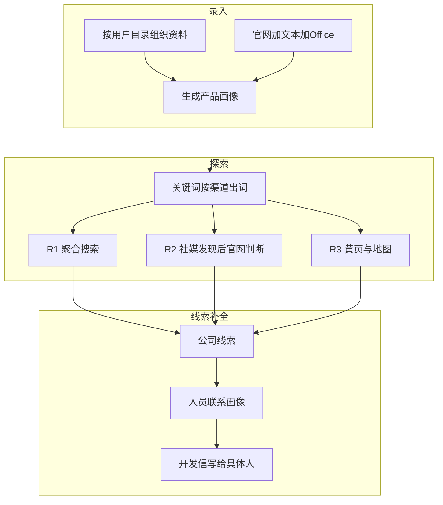
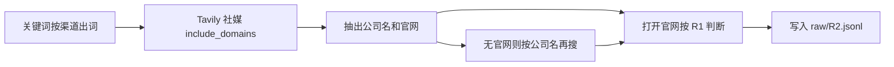
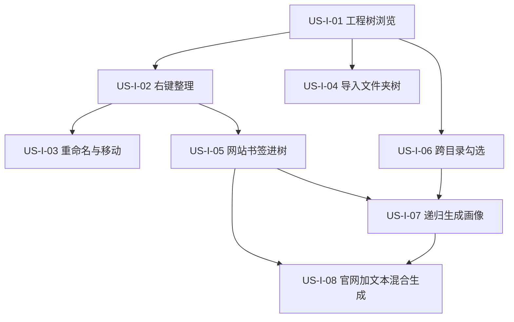
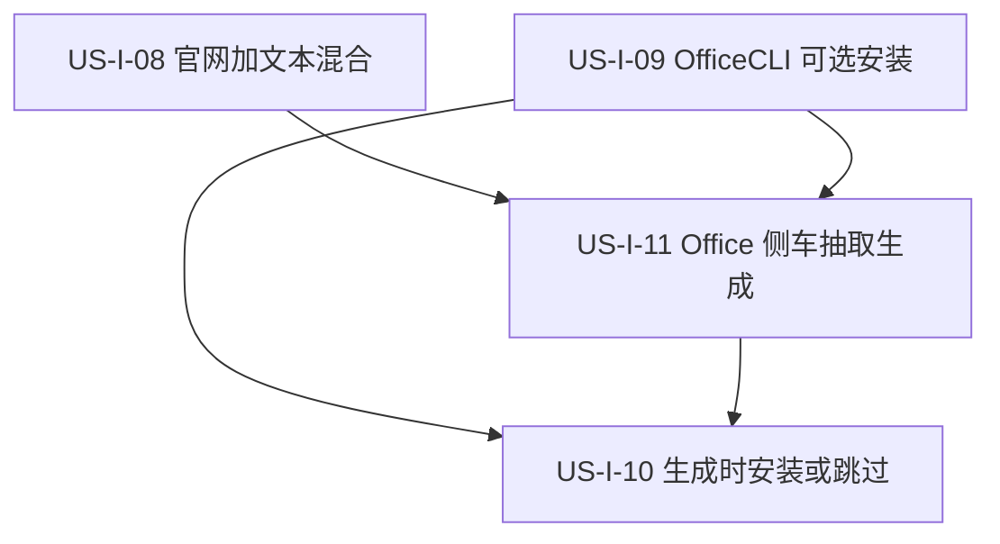
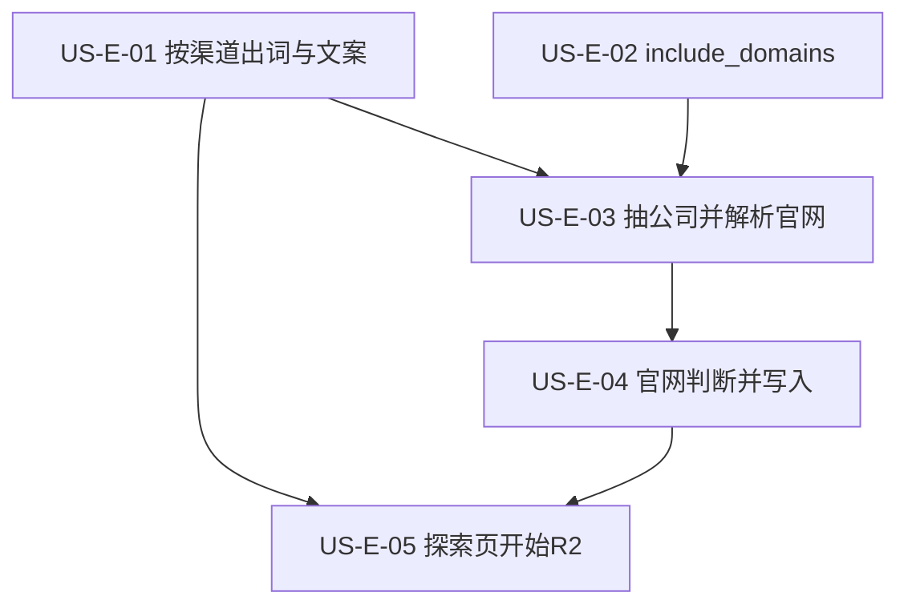

# 17 - 需求：业务效率工具

> **文档类型**：本期需求（录入 / 探索渠道 / 人员联系画像）+ 已拆用户故事（录入 US-I、探索 R2 的 US-E）  
> **状态**：录入 US-I-01～11 已落地（随桌面 **v0.5.0** 发布）；**R2 已评审并拆 US-E-01～05**（见 §5.4 / §13）；R3 / 人员联系画像仍按 §5 / §6 评审后再拆  
> **基线**：桌面端 **v0.5.0**（MVP + 资料工程树 + Office 侧车抽取）  
> **下一步**：US-E-01～05 已落地（E-02 官方路径待网关透传）；R3、人员联系画像待评审后再拆 US-C

本文是 MVP 之后**这一期**的需求说明，录入主线随 0.5.0 交付后可以不再改这份文档。不替代 04 的执行勾选，也不在此刻改 01 / 02 的旧轮次表（等 US-E 拆完、详设过后再改）。

---

## 1. 一句话目标

把产品从「能跑通的极客玩具」做成**外贸业务员能用的效率工具**：

- **录入**：按自己的目录放下多家公司、多个产品，用官网 + 文本 / Office 生成画像  
- **探索**：轮次表示不同获客渠道，而不只是同一搜索框里更深的词  
- **线索**：从「公司官网邮箱」补到「这家公司里该找谁」

发信、定时复搜、海关贸易数据仍有价值，**不是本阶段主线**。旧计划中的「R2 贸易数据 / R3 竞品反查 / 2.4 发信 / scheduler」搁置，轮次定义以本文为准。

---

## 2. MVP 已交付（规划起点）

桌面应用已能跑通：

```
录入（偏官网）→ 画像 → 关键词 → R1 探索 → 线索 → 开发信草稿
```

同时可用：官方 / 自定义模型通道、官方搜索通道、设置页余额与充值跳转、产品官网与安装引导。

[04-实施计划.md](04-实施计划.md) 中 Phase G 等清单可能落后于代码，规划本阶段时以**实际已交付能力**为准，不要被过期 backlog 牵着走。

---

## 3. 三条主线




R2 语义与管道已评审锁定（§5.4 / §5.5）；R3、人员搜索仍待评审。不要按旧定义做海关 / 竞品反查。

---

## 4. 录入：按目录管理资料并生成画像

### 4.1 现状缺口

资料库已有建目录、上传文件、勾选生成的界面壳，但业务语义未立住。


| 缺口        | 现状                                         |
| --------- | ------------------------------------------ |
| 网站进不了用户目录 | 网站写在 `data/library/websites/`，保存时不使用当前文件夹  |
| 目录不是候选单元  | 文件夹不能勾选；生成时遇到目录会跳过                         |
| 只能进入一层    | 点进文件夹后看不到兄弟目录，切走勾选丢失                       |
| 整理入口在右上角  | 新建 / 粘贴 / 上传与「生成画像」挤在一起，不像管项目文件            |
| 文件生成画像未成立 | 可导入 PDF/Word/Excel，Skill 却把 special 格式整批停止 |
| 侧栏与资料夹脱节  | 生成后的产品仍是扁平 `prod_*` 列表；本阶段不强行改成公司树         |


### 4.2 做成什么样

- 用户按自己的习惯建目录（例如 `某公司/地板`、`某公司/墙板`、`另一家工厂`），**不强制**公司 / 产品实体数据模型。  
- 每个目录里既能放官网，也能放说明书、报价表、产品目录。  
- 录入页是 **IDE 式工程树**（展开 / 折叠，不「进入后只见当前夹」），可跨目录勾选。  
- 新建、粘贴、上传、重命名等整理操作走**右键菜单**（及拖放），顶栏主按钮只保留「生成画像」。  
- 勾选若干网站、文件，或勾选整个文件夹，生成一份可编辑画像。  
- 输入：**官网、txt/md/csv/json，以及常见 Office（pdf / docx / xlsx，xls 尽量兼容）**。  
- 官网 + 文件同时选时，信息合并进同一份画像。

### 4.3 产品决策（已评审部分如下）

**交互隐喻：开发工具的工程文件树。** 不是「打开一个文件夹看列表」，而是 Cursor / VS Code 资源管理器那种：整棵 `data/library/files` 可见，文件夹展开 / 折叠，勾选不因切目录丢失。

顶栏去掉「新建目录 / 粘贴文件 / 上传文件」。整理一律右键（空白处、文件夹、文件 / 网站书签各有菜单）；拖入树内 = 导入或移动。顶栏主操作只留 **生成画像**，旁注已选条目数。

网站书签是树节点（地球图标），与文件并列。添加网站 = 在目标文件夹上右键「保存网站」，弹对话框填 URL，写入该夹，例如：

`data/library/files/绿森塑木/户外地板/www.example.com.md`

已有 `data/library/websites/` 打开工作区时迁到 `files/` 根目录。

**勾选与生成（已评审，随工程树修订）：**


| 勾选对象      | 含义                          |
| --------- | --------------------------- |
| 文件 / 网站书签 | 该条进入候选                      |
| 文件夹       | **递归**：该夹下全部文件 + 网站书签       |
| 跨目录多选     | 允许（Ctrl / Shift，与 IDE 一致）   |
| 点「生成画像」   | 一份画像 = 候选并集（父夹 + 子项同时勾选则去重） |


粒度由勾选哪一层决定。勾选覆盖多个文件夹、或所点夹内还有子目录时，生成前确认将合并哪些路径。不再「禁止勾选多个文件夹」——工程树就是为了跨夹勾选；防误操作靠确认，不靠禁用。

**整理操作（已评审，本切片纳入）：** 重命名、移动（拖到另一夹）、从资源管理器导入整棵本地文件夹树、右键菜单覆盖新建夹 / 粘贴 / 上传 / 删除 / 保存网站。键盘习惯对齐 IDE（如 F2 重命名、Delete、Ctrl+V 贴到当前焦点夹）。

生成仍复制快照到 `data/products/{id}/inputs/`，资料路径写入 `_sources.json` / `source_inputs`。

**Office 在生成前抽成文本（已预研拍板，故事见 §12.4）。** 不另做 Agent 必须记得调用的 file-parser MCP。复制到 `inputs/` 时：

- 文本原样复制  
- **docx / xlsx / pptx**：主进程用 **OfficeCLI**（`view … text`）抽出侧车 `.txt`，原件保留  
- 单文件失败可跳过，不毁掉整次生成  
- **pdf / 老 .doc**：本切片不做（见各故事「不做」）  
- Skill 读抽出文本；不再「遇到 special 就整批停止」

**OfficeCLI 分发（已拍板）：** 不打进主安装包；与 OpenCode 类似，装到应用 `userData`；引导标「可选」；录入生成遇 Office 且未装 → **安装 / 跳过 Office / 取消**；下载 **Gitee 优先 + GitHub 兜底**，同一 SHA256；装完当场 probe，不强制重启。

### 4.4 录入本阶段不做

- 图片 OCR、老格式 `.doc`（解析成本高则提示转换）  
- 把用户目录映射成数据库 Company / Product 实体  
- 侧栏产品列表改成与资料夹一一对应的树  
- 审核后一键发信、定时复搜（原 R4）

---

## 5. 探索与关键词：重定 R1 / R2 / R3

### 5.1 现状

探索页可执行 **R1**（聚合搜索 + 打开页面判断）与 **R2**（社媒发现）。**US-E-01 已落地**：扩展按渠道出词——R1 ≥60% 普通检索句；R2 为已启用社媒站点 + `site_id`（query 不含 `site:`）；不再生成 R3/R4。**US-E-02 已落地（自定义）**：`search_web` 可传 `include_domains` 并到达 Tavily，目标社媒可出现在结果里；官方路径仍待网关透传。**US-E-03+04 / US-E-05 已落地**：独立 Skill `discover-leads-r2`；探索页可点「开始 R2」。

### 5.2 废弃的旧定义


| 轮次  | 旧含义                      | 本阶段态度    |
| --- | ------------------------ | -------- |
| R2  | 贸易数据 / 海关 / 展会名单         | 不再作为现行目标 |
| R3  | 竞品客户反查、LinkedIn API、采购公告 | 不再作为现行目标 |
| R4  | 定时复搜高产出词                 | 本阶段不排    |


### 5.3 新定义（R2 已锁定；R3 仍暂定）


| 轮次     | 业务含义      | 做法 |
| ------ | --------- | ------- |
| **R1** | 广撒网       | 维持现状：Tavily 聚合搜索 + 打开页面判断 |
| **R2** | 社媒发现渠道   | Tavily `include_domains` 搜公开社媒 → 抽公司名 / 官网 → 必要时按公司名再搜官网 → **打开官网按 R1 判断** 后才写 Lead |
| **R3** | 本地 / 名录渠道 | 地区黄页浏览；以及 Google 地图 + 行业搜索（两条先挂在 R3，**未评审**） |
| **R4** | —         | 定时复搜仍搁置 |


R3 有两条候选通道。评审时再决定：同轮两条，还是拆成 R3 / R4。在此之前产品**不承诺**两条都能点。

**轮次 = 渠道。** 关键词扩展不再把 R2/R3 当成同一搜索框里更深的句子：

- R1：普通产品 / 场景 / 买家 / 地理检索词  
- R2：产品 / 买家 / 地理句；站点由配置传给搜索层的 `include_domains`，**不**把 `site:` 写进 query  
- R3：黄页浏览目标、地图行业查询；未通过评审的通道先不出词

探索 UI 今日已有 R2/R3/R4 筛选，但只能跑 R1。改文案后，未就绪轮次（R3/R4）标明「规划中」；R2 在 US-E 落地后可单独开跑。

### 5.4 R2 评审记录（2026-08-23）

对照现网 `search-api` / `discover-leads` / 去重。结论：**做（有条件）**。

**搜索仍用 Tavily，不换引擎。** 自定义通道直连；官方通道走网关 `POST /v1/search`（上游仍是 Tavily）。Key、余额、日限额、缓存与 R1 同一套。不引入 SerpAPI、Google CSE、领英官方 API、社媒站内登录搜索。

**站点限定用 `include_domains`，不是 Google 式 `site:`。** Tavily 是语义搜索，官方能力是请求参数 `include_domains` / `exclude_domains`（可带路径前缀，如 `linkedin.com/company`）。query 里写 `site:` 不保证生效。**US-E-02**：自定义 `search_web` 已把该字段传到 Tavily；官方通道桌面会带上同一字段，**点收仍依赖网关透传**。

**现网两处会处理社媒：** R1 通过 Tavily `exclude_domains` 排除 Facebook / Instagram / X / TikTok 等（直连与官方网关同一字段）；`discover-leads` 文案仍跳过「社交媒体」。R2 改传 `include_domains` 且不传 exclude，以便目标社媒出现在结果里。MCP 不再按站点黑名单二次过滤。

**不打开社媒真页。** 社媒搜索只返回 Tavily 的 `title` / `url` / `content`（短摘要），不是页面 DOM。稳定能拿到：公司名、来源 URL、公司页 vs 个人页。官网、邮箱经常没有。登录墙后的内容拿不到；用 chrome 进领英/Facebook 也救不了。社媒这一步只负责发现。

**登录墙与条款：** 只吃公开搜索结果。不登录、不存 Cookie、不走非官方爬虫、不接领英官方 API。个人主页（如 `linkedin.com/in/`）跳过，交给 §6 / US-C。

**写入 `raw/R2.jsonl`：** 仅在官网打开并判断通过之后。`source.url` 取打开过的官网页（与 R1 一致）；社媒发现 URL 写入 snippet / `match_reason`（详设再定是否加字段）。**未进官网判断就不写线索**（已认可）。因此去重可继续用官网域名，与 R1 交叉去重，不必为 facebook.com 做特例。

**评分：** 首发不加来源加权。官网判断通过的 R2 线索与 R1 同一套六维。

**站点名单：** 可配置；首发默认打开 `linkedin.com/company` 与 Facebook 公共商业主页；Instagram / X / TikTok / 论坛默认关闭、标「规划中」。关闭的站不出词、不搜。

R3 黄页 / 地图、多轮评分加权（除「首发不加」外的细则）仍待评审。

**不默认开工**：贸易数据 API、LinkedIn 官方 API、采购公告爬虫、定时 R4、打开社媒真页、把社媒 URL 当官网写 Lead。

### 5.5 R2 产品规则（已锁定）



1. **三步，缺一不写 Lead。**
   1. 社媒 Tavily（`include_domains`）：不打开社媒页；从 title / url / content 抽公司名，摘要里有官网则记下。个人页 / 看不清公司 → 丢弃该条。
   2. 解析官网：已有疑似官网则校验（不能是领英 / Facebook 自己）；没有则用公司名（可加画像中的国家 / 品类）再搜一次 Tavily，**不带社媒 include_domains**，并继续走现网社媒黑名单。同名公司拿不准 → 跳过，不猜。
   3. 有稳定官网后：chrome-devtools 打开官网，判断规则与 R1 相同。通过才 `lead_append_raw`。抽不出公司名、解析不到官网、官网打不开、打开后不是买家 → 只记跳过，不写 raw Lead。社媒摘要不能单独落线索。
2. **二次搜索成本。** 每个缺官网的候选多 1 次 `search_web`，计入同一配额 / 余额。详细设计加每词 / 每轮解析上限。
3. **官网消歧。** 二次结果优先：标题含公司名、非目录 / 新闻 / 社媒、像公司首页。目录站、黄页、另一家同名公司不采用。解析失败 = 本条结束。
4. **与 US-C。** R2 输入是产品关键词，输出是新公司；US-C 输入是已有公司，输出是人。个人主页不在 R2 建成公司线索。
5. **R2 独立 Skill，不与 R1 共用 `discover-leads`。** R1 继续只跑聚合搜索 → 打开候选 URL → 判断。R2 的发现（社媒 `include_domains`、抽公司、二次搜官网、未进官网不写线索）是另一条流程。两边只在「打开**公司官网**后的判断口径」上对齐，并共用 MCP（`search_web` / chrome-devtools / `lead_append_raw`）。禁止给 `discover-leads` 加 `rounds=R2` 分支来凑合。新 Skill 名称详设定（暂记 `discover-leads-r2`）。

### 5.6 R2 做 / 缓做 / 不做


| 态度 | 范围 |
| --- | --- |
| **做** | 独立 R2 Skill（不改 `discover-leads` 兼跑 R2）；`include_domains`（自定义 search-api + 官方网关透传）；可配置站点；默认开 1–2 站；抽公司名 / 官网；无官网则二次 Tavily；有稳定官网后按 R1 **口径**打开判断；个人页跳过；未进官网判断不写 Lead；探索页可开 R2 |
| **缓做** | 更多站点；来源加权；`include_raw_content` / `search_depth=advanced`；打开社媒真页 |
| **不做** | 登录领英 / Facebook；非官方爬虫；领英官方 API；海关 / 贸易数据（旧 R2）；R2 挖人（US-C）；把个人主页或社媒 URL 当成官网写 Lead |

---

## 6. 线索：从公司邮箱到人员联系画像

### 6.1 现状

线索 `contacts` 多半是官网上的 `sales@` / `info@`。代码允许 `linkedin` 联系类型，但没有「按这家公司去社媒找人」的步骤。开发信只能写给公司通用邮箱。

### 6.2 与 R2 的区别


|     | R2 社媒发现      | 人员联系画像        |
| --- | ------------ | ------------- |
| 输入  | 产品关键词 + 站点限定 | **已有公司线索**    |
| 输出  | 新的公司级 Lead（须官网判断通过） | 该公司下的**人员**   |
| 目的  | 多一条获客渠道      | 提高可触达性，开发信写给人 |
| 个人主页 | **跳过**，不建公司 Lead | 才是要找的对象 |


### 6.3 暂定能力（评审后确认可行性）

- 对 high / 用户勾选的线索，按公司名 + 画像中的买家角色，去领英等公开结果找人。  
- 每人至少：姓名、职位 / 角色、来源 URL、匹配理由；公开邮箱有则记，不强行挖私人联系方式。  
- 写入该 Lead 的 `contacts` 或扩展的 `people[]`（Schema 在详细设计定），供线索页与开发信选用收件人。  
- **默认人工触发**（「补全联系人」），不在 R1 每条线索上自动狂搜。

### 6.4 评审必须回答

- 数据来源：公开搜索 `site:linkedin.com`，还是要登录领英（后者本阶段默认不承诺）  
- 合规：GDPR、平台条款；只收公开职业信息；用户可删除；不默认把简历原文当可转发附件存储  
- 与 R2：R2 已拍板——个人主页跳过、不建公司 Lead；人员补全是 US-C，输入必须是已有公司。  
- 开发信：无人员时仍用公司邮箱；有人员时默认写给匹配买家角色的那一位

评审通过前**可以**先预留人员字段与线索页空态。  
**不默认开工**：非官方领英爬虫、付费人脉库、猜测个人邮箱。

---

## 7. 建议落地顺序

录入主线已交付。US-E-01～05 已落地（E-02 官方待网关）；R3 与人员联系画像仍待评审。

1. [US-I-01～08](#12-用户故事录入-us-i)：工程树、右键整理、导入、网站进夹、跨目录勾选、递归生成、官网+文本混合  
2. [US-I-09～11](#124-用户故事录入-office-us-i-0911)：OfficeCLI 可选安装、生成弹框引导、docx/xlsx/pptx 侧车抽取  
3. [US-E-01～05](#13-用户故事探索-r2-us-e)：E-01～05 已落地（E-02 官方待网关）  
4. 探索 R3、人员联系画像：与 R2 拆开；仍待 §5 / §6 评审后再拆 US-E（R3）/ US-C

用户故事与详细设计拆完后，再更新 01 输入策略、02 探索策略表、03 Schema、04 任务清单、相关 Skill。

---

## 8. 成功标准

### 8.1 录入（本阶段可验收）

- 按自定义目录放下 2 家公司、至少 2 个产品资料夹，每夹含官网 + 至少 1 个文件（对应 US-I-01～08）。  
- 仅文本、仅官网、官网 + 文本三条路径都能生成画像（US-I-08）；官网 / 文本 + **docx/xlsx/pptx** 见 US-I-09～11。  
- 勾选产品文件夹即可生成，不必逐个勾文件（US-I-07）。  
- 失败时说明「哪个文件读不了」，而不是甩格式黑名单或 MCP 术语。

### 8.2 探索（R2 已评审；R3 仍看评审）

- 文档与 UI 不再把 R2/R3 写成海关 / 竞品反查。  
- 关键词按渠道出词，不把「同一管道的深词」伪装成新数据源；R2 站点走 `include_domains`，不写进 query。  
- **R2**：做（有条件），见 §5.4 / §5.6；实现故事 US-E-01～05（§13）。验收：社媒发现 → 补官网 → 打开官网判断通过才写入 `raw/R2.jsonl`；未进官网判断不写线索。  
- **R3** 黄页与地图是否拆轮、做 / 缓做 / 不做：仍待评审。

### 8.3 线索补全（定义层必达；搜索实现看评审）

- 产品叙事区分「找到哪家公司」和「这家公司该找谁」。  
- 评审记录写明领英等人员搜索：做 / 缓做 / 不做，以及是否仅用公开搜索。

---

## 9. 本阶段明确不做

- 审核后一键发信、定时探索（原 R4）  
- 海关 / 贸易数据 API、竞品客户反查 API、采购公告爬虫  
- 非官方领英爬虫、付费人脉库、猜测个人邮箱  
- 登录领英 / Facebook、把社媒 URL 或个人主页当成官网写 Lead（R2 已评审，见 §5.6）  
- 完整 CRM、多租户计费改造、SQLite / PostgreSQL 迁移（非本阶段前置）

---

## 10. 拆解约定

| 主线 | 故事前缀 | 状态 |
|------|----------|------|
| 录入 | US-I-*（Input） | **已拆**，见 [§12](#12-用户故事录入-us-i) |
| 探索 | US-E-*（Explore） | R2 **已拆** US-E-01～05，见 [§13](#13-用户故事探索-r2-us-e)；R3 仍待评审 |
| 线索补全 | US-C-*（Contact） | 待 §6 合规评审后拆 |

每条实现故事仍按现有习惯写详细设计到 `docs/design/`。

---

## 11. 相关文档

- 执行清单（旧）：[04-实施计划.md](04-实施计划.md)  
- 概述与旧成功标准：[01-项目概述.md](01-项目概述.md)  
- 探索策略旧表：[02-系统架构.md](02-系统架构.md) 第 4 节  
- 线索 Schema：[03-数据模型.md](03-数据模型.md)  
- Phase 1 复盘：[retrospective/phase-1.md](retrospective/phase-1.md)  
- 桌面形态：[08-产品架构决策-Electron-OpenCode.md](08-产品架构决策-Electron-OpenCode.md)  
- 桌面搜索对接：[15-官方搜索通道对接.md](15-官方搜索通道对接.md)、[16-官方搜索通道用户故事.md](16-官方搜索通道用户故事.md)

---

## 12. 用户故事：录入 US-I

本节覆盖 **§4 已评审的工程树主线（US-I-01～08）** 与 **Office 支持（US-I-09～11）**。不含探索轮次、人员联系画像。

故事写法对齐 [12-官方模型通道用户故事.md](12-官方模型通道用户故事.md)：独立可测、依赖写明、验收可手工走通。详细设计未写前不得开工编码。

预研依据：[research/OfficeCLI抽取方案.md](research/OfficeCLI抽取方案.md)、[research/Office文本抽取-docx-xlsx-pptx.md](research/Office文本抽取-docx-xlsx-pptx.md)。

### 12.1 依赖总览



建议实施顺序：I-01 →（I-02 ∥ I-04 ∥ I-06）→ I-03、I-05 → I-07 → I-08。

I-04 的「拖入导入」只依赖 I-01；若导入入口做在右键上，与 I-02 同迭代验收即可。

### 12.2 故事列表

#### US-I-01　以工程树浏览资料库

**作为** 外贸业务员，**我想** 在录入页看到整棵资料目录并能展开、折叠，**以便** 同时看见多家公司、多个产品夹，而不必点进一层就丢掉其它目录。

| 项 | 内容 |
|----|------|
| 优先级 | Must |
| 依赖 | — |
| 状态 | 编码已落地 |
| 详细设计 | [design/US-I-01-工程树浏览.md](design/US-I-01-工程树浏览.md) |
| 验收要点 | 见下方 |

**验收要点**

- 录入主区是树，数据根为 `data/library/files`。
- 文件夹可展开 / 折叠；展开后可见子文件夹与文件。
- 不再使用「进入当前夹、只显示一层、点上级返回」的浏览模式。
- 空库显示空态（提示可通过后续右键整理添加资料）。

**本故事不做**：右键菜单、网站书签、勾选生成规则变更。

---

#### US-I-02　用右键整理资料，顶栏只留生成画像

**作为** 用户，**我想** 用右键完成新建文件夹、粘贴、上传、删除，**以便** 顶栏只承担「生成画像」这一业务动作。

| 项 | 内容 |
|----|------|
| 优先级 | Must |
| 依赖 | US-I-01 |
| 状态 | 编码已落地 |
| 详细设计 | [design/US-I-02-右键整理.md](design/US-I-02-右键整理.md) |
| 验收要点 | 见下方 |

**验收要点**

- 顶栏不再出现「新建目录」「粘贴文件」「上传文件」；主按钮仅为「生成画像」。
- 树空白处右键：新建文件夹、粘贴、上传文件。
- 文件夹右键：新建子文件夹、粘贴到此、上传到此、删除（需确认）。
- 文件右键：删除（需确认）。
- 「保存网站」「重命名」「导入文件夹」可先占位或与 I-03 / I-04 / I-05 同迭代，但不得把整理按钮加回顶栏。

**本故事不做**：重命名 / 移动 / 网站书签的完整行为（分属 I-03、I-05）。

---

#### US-I-03　重命名与移动资料

**作为** 用户，**我想** 重命名文件夹和文件，并把资料拖到另一夹，**以便** 按自己的思维持续整理，而不是删了再上传。

| 项 | 内容 |
|----|------|
| 优先级 | Must |
| 依赖 | US-I-01，US-I-02 |
| 状态 | 编码已落地 |
| 详细设计 | [design/US-I-03-重命名与移动.md](design/US-I-03-重命名与移动.md) |
| 验收要点 | 见下方 |

**验收要点**

- 选中节点后 F2 或右键「重命名」可改名并回车确认；Esc 取消。
- 将文件或文件夹拖到另一文件夹上，条目移动到目标夹下。
- 同名冲突时提示，不静默覆盖。
- 目录名 / 文件名保留中文与空格；仅拒绝 Windows 非法字符 `<>:"/\|?*`。
- 不能把资料移出 `data/library/files` 沙箱。

**本故事不做**：从资源管理器导入整棵外部分配树（I-04）。

---

#### US-I-04　导入本地文件夹树

**作为** 用户，**我想** 把电脑上已经按公司 / 产品整理好的文件夹整棵导入资料库，**以便** 不必逐个上传文件。

| 项 | 内容 |
|----|------|
| 优先级 | Must |
| 依赖 | US-I-01（拖入）；右键入口依赖 US-I-02 |
| 状态 | 编码已落地 |
| 详细设计 | [design/US-I-04-导入文件夹树.md](design/US-I-04-导入文件夹树.md) |
| 验收要点 | 见下方 |

**验收要点**

- 从资源管理器拖入一个文件夹到树上（或右键「导入文件夹」），保留相对目录结构。
- 空子文件夹也会被创建。
- 导入后树中可见对应节点；不把文件夹误判为「不是文件」而整棵跳过。
- 非法路径 / 无权限时给出可读失败原因。

**本故事不做**：导入后自动生成画像。

---

#### US-I-05　网站书签进目录并迁移旧列表

**作为** 用户，**我想** 把公司官网保存在某个资料夹里，与说明书放在一起，**以便** 按产品而不是按全局列表管理网站。

| 项 | 内容 |
|----|------|
| 优先级 | Must |
| 依赖 | US-I-01，US-I-02 |
| 状态 | 编码已落地 |
| 详细设计 | [design/US-I-05-网站书签进树.md](design/US-I-05-网站书签进树.md) |
| 验收要点 | 见下方 |

**验收要点**

- 录入页不再使用全局网站 chips；`data/library/websites/` 在打开工作区时迁到 `files/` 根（重名加后缀），迁移后全局列表消失。
- 在文件夹上右键「保存网站」，对话框填写 URL，书签出现在该夹下（frontmatter `type: website`）。
- 书签在树中用地球图标，与普通文件可区分；打开动作为用系统浏览器打开该 URL。
- 同一文件夹内重复 URL 拒绝并提示；不同文件夹允许各存一份（两产品共用官网）。

**本故事不做**：生成画像规则（I-07 / I-08）。

---

#### US-I-06　跨目录勾选且不丢失

**作为** 用户，**我想** 在工程树里跨文件夹勾选文件或文件夹，**以便** 选中的资料在展开其它夹之后仍然还在。

| 项 | 内容 |
|----|------|
| 优先级 | Must |
| 依赖 | US-I-01 |
| 状态 | 编码已落地 |
| 详细设计 | [design/US-I-06-跨目录勾选.md](design/US-I-06-跨目录勾选.md) |
| 验收要点 | 见下方 |

**验收要点**

- 支持 Ctrl 点选、Shift 范围选；可选中不同文件夹下的节点。
- 勾选后折叠再展开该夹，勾选仍在。
- 顶栏显示「已选 N 项」（文件、网站书签、文件夹均计入节点数，文案在详细设计定）。
- 未点生成前，勾选仅表示候选，不创建 `prod_*`。

**本故事不做**：勾选文件夹的递归展开与生成确认（I-07）。本故事勾选文件夹可以先只表示「选中该节点」。

---

#### US-I-07　按勾选递归生成一份画像

**作为** 用户，**我想** 勾选一个产品夹（或若干文件 / 网站）后点「生成画像」，**以便** 不必点进夹里逐个勾文件。

| 项 | 内容 |
|----|------|
| 优先级 | Must |
| 依赖 | US-I-06；纳入网站书签时依赖 US-I-05 |
| 状态 | 编码已落地 |
| 详细设计 | [design/US-I-07-递归生成画像.md](design/US-I-07-递归生成画像.md) |
| 验收要点 | 见下方 |

**验收要点**

- 仅勾选文件时：行为与现网一致，生成一个 `product_id`。
- 勾选文件夹：递归纳入该夹下全部文件与网站书签；父夹与其内子项同时勾选则候选去重。
- 勾选覆盖 ≥2 个文件夹，或所选夹内还有子目录：生成前确认，列出将合并的路径；取消则不生成。
- 确认后只产生 **一份** 画像；`inputs/_sources.json`（或 `source_inputs`）记录资料路径。
- 侧栏出现新产品；同一夹再生成一次允许得到另一个 `prod_*`（本故事不要求更新已有画像）。

**本故事不做**：Office 文本抽取；按每个勾选夹各出一份画像。

---

#### US-I-08　官网与文本资料混合生成画像

**作为** 用户，**我想** 用同一个产品夹里的官网书签和文本说明书一起生成画像，**以便** 不只能从官网拔、也不能把文件丢掉。

| 项 | 内容 |
|----|------|
| 优先级 | Must |
| 依赖 | US-I-05，US-I-07 |
| 状态 | 编码已落地 |
| 详细设计 | [design/US-I-08-官网与文本混合生成.md](design/US-I-08-官网与文本混合生成.md) |
| 验收要点 | 见下方 |

**验收要点**

- 夹内至少 1 个网站书签 + 1 个 txt/md/csv/json，勾选该夹（或同时勾选这两类节点）并生成。
- 生成的画像 `source_inputs` 同时包含 `type: website` 与 `type: file`。
- 无官网、仅文本，或无文件、仅官网，两条路径也都能生成（可与本故事同一验收清单）。
- 本故事测试夹内 **不含** 必须解析的 Office；PDF/Word/Excel 抽文本另开故事。

**本故事不做**：pdf / docx / xlsx 抽取；图片 OCR（Office 见 §12.4）。

### 12.3 本切片明确不包含（相对 I-01～08）

以下评审中已记录、但 **不是** US-I-01～08 的范围（Office 已迁到 §12.4）：

- ~~Office 生成前抽文本~~ → **US-I-09～11**
- 应用侧栏改成与资料夹一一对应的树
- 从同一资料夹更新已有 `prod_*`
- 按勾选的每个文件夹各生成一份画像

---

### 12.4 用户故事：录入 Office（US-I-09～11）

覆盖 **docx / xlsx / pptx** 生成前侧车抽文本，以及可选依赖 OfficeCLI 的安装与生成拦截。**不含 pdf、老 .doc、图片 OCR。**

#### 依赖总览（Office）



建议实施顺序：**I-09 → I-11 → I-10**。

- I-09 单独可测（引导安装，不必生成画像）。  
- I-11 在 OfficeCLI 已就绪时单独可测（可用 I-09 安装，或开发机 `FTCS_OFFICECLI_PATH` / 手工拷到约定目录）。  
- I-10 依赖 I-09 的安装 IPC；与 I-11 联调验收「弹框装完后继续含 Office 生成」。

运维前置（非用户故事）：在团队 Gitee 上传钉死版本的 `officecli-win-x64.exe`，与代码内 SHA256 一致。

---

#### US-I-09　可选安装 OfficeCLI（引导 / 设置）

**作为** 外贸业务员，**我想** 在首次引导或设置里按需一键安装 OfficeCLI 到本应用目录，**以便** 之后能把 Word / Excel / PPT 说明书纳入画像，又不必把约 32MB 打进主安装包。

| 项 | 内容 |
|----|------|
| 优先级 | Must |
| 依赖 | 现网引导 / env-probe / 一键安装形态（对齐 docs/09、docs/10）；无 US-I 硬依赖 |
| 状态 | 编码已落地 |
| 详细设计 | [design/US-I-09-OfficeCLI可选安装.md](design/US-I-09-OfficeCLI可选安装.md) |
| 验收要点 | 见下方 |

**验收要点**

- 引导依赖清单有 **OfficeCLI（可选）** 一行：说明仅 Word/Excel/PPT 需要；**不装也可完成引导**，不影响仅官网 / txt/md 生成。  
- 未就绪时可「一键安装」：下载钉死版本 exe → SHA256 校验 → 写入 `<userData>/officecli-runtime/`（或等价约定路径）→ 写 prefs。  
- 下载：**先 Gitee 镜像，失败再 GitHub**；两次失败有可读错误与手动下载说明（含版本 / 校验信息入口）。  
- 安装成功后 **当场 probe 变绿，不强制重启**；可点「重新检测」复核。  
- 设置（或引导入口）可再次打开并安装 / 重装。  
- 应用只使用自己目录（或 `FTCS_OFFICECLI_PATH` 兜底），**不**要求系统 PATH，**不**执行 `officecli install` 写全局。  
- 非 Windows x64：明确不支持或禁用按钮（首发范围与 OpenCode 一致即可）。

**本故事不做**：录入页生成弹框（I-10）；docx 等抽文本与画像生成（I-11）；pdf；把 exe 打进主包。

---

#### US-I-10　生成画像时对 Office 文件引导安装或跳过

**作为** 用户，**我想** 在勾选了 Office 文件却尚未安装 OfficeCLI 时，在生成确认环节被明确告知并可选择安装或跳过，**以便** 不会默默丢掉资料，也不被逼着先去翻引导页。

| 项 | 内容 |
|----|------|
| 优先级 | Must |
| 依赖 | US-I-09（安装 IPC + probe）；联调「装完含 Office」依赖 US-I-11 |
| 状态 | 编码已落地 |
| 详细设计 | [design/US-I-10-生成时Office安装或跳过.md](design/US-I-10-生成时Office安装或跳过.md) |
| 验收要点 | 见下方 |

**验收要点**

- 点「生成画像」→ 展开结果含 ≥1 个 `.docx` / `.xlsx` / `.pptx`，且 OfficeCLI **未就绪** → 出现专用弹框（在真正启动生成之前）。  
- 弹框提供：  
  - **一键安装**（进度可见；成功后可继续**含 Office** 的生成，或等价清晰的「安装成功，继续生成」）；  
  - **跳过 Office 文件，继续生成**（本次去掉 Office 路径；若仍有官网 / 文本则进入现有生成流）；  
  - **取消**（不生成）。  
- 跳过 Office 后若无可导入资料（无官网且无文本等）→ 明确错误，不建空画像。  
- OfficeCLI **已就绪** 或勾选中 **无** Office 文件 → **不**出此弹框。  
- 未点「一键安装」前 **不**静默联网下载。

**本故事不做**：侧车抽取算法本身（I-11）；引导行安装 UI 的首次交付（I-09，本故事复用其安装能力）。

---

#### US-I-11　docx / xlsx / pptx 侧车抽文本并参与生成画像

**作为** 用户，**我想** 在 OfficeCLI 已就绪时，勾选 Word / Excel / PPT（可与官网、文本混合）生成一份画像，**以便** 说明书与报价表里的产品信息进入画像，而不要求本机安装 Microsoft Office。

| 项 | 内容 |
|----|------|
| 优先级 | Must |
| 依赖 | US-I-08（混合生成 / skipped / source_inputs 补齐）；运行时 OfficeCLI 就绪（US-I-09 或 `FTCS_OFFICECLI_PATH` / 约定目录落盘） |
| 状态 | 编码已落地 |
| 详细设计 | [design/US-I-11-Office侧车抽取.md](design/US-I-11-Office侧车抽取.md) |
| 验收要点 | 见下方 |

**验收要点**

- OfficeCLI 就绪时：勾选含 `.docx` / `.xlsx` / `.pptx`（可与书签、txt/md 同夹）可成功生成一份画像。  
- `inputs/`：**原件保留** + 侧车文本（如 `说明.docx.txt`）；Prompt「输入文件」列侧车（及普通文本），**不**要求 Agent 调用 officecli。  
- 画像 `source_inputs` 含对应 `type: file`（路径约定在详细设计写清：原件或侧车，须稳定可测）。  
- 单文件抽取失败 / 空文本 / 损坏文件 → 该文件 `skipped`，有其它可导入资料则整次仍成功。  
- 中文路径、空格文件名至少各测一条（Windows）。  
- 三种扩展名各至少一条手工验收通过。  
- 与官网混合：`source_inputs` 同时有 website 与 file（沿用 I-08 补齐逻辑）。

**本故事不做**：pdf、`.doc`、图片 OCR；未装 OfficeCLI 时的安装弹框（I-10）；引导安装 UI（I-09）。未装时的行为：若 I-10 未上线，可暂沿用「不支持该格式」skipped；I-10 上线后以弹框为准。

---

### 12.5 Office 切片明确不包含

- **pdf** 抽文本（另故事）  
- 老格式 `.doc` / 依赖本机 Microsoft Office 的自动化  
- 图片 OCR  
- 将 OfficeCLI 打进 Electron 主安装包  
- 执行上游 `officecli install`（写系统 PATH / 给 Cursor 装 skill）  
- Agent 侧 file-parser MCP 作为必调步骤  

---

## 13. 用户故事：探索 R2（US-E）

本节覆盖 **§5 已评审锁定的 R2**。R2 用**独立 Skill**（暂记 `discover-leads-r2`，名称详设定），**不**给现网 `discover-leads` 加 R2 分支。不含 R3、人员联系画像（US-C）。

故事写法对齐 [12-官方模型通道用户故事.md](12-官方模型通道用户故事.md) 与 [§12](#12-用户故事录入-us-i)：独立可测、依赖写明、验收可手工走通。详细设计未写前不得开工编码。规则以 [§5.5](#55-r2-产品规则已锁定) 为准。

### 13.1 依赖总览



建议实施顺序：**E-01 ∥ E-02** → E-03 → E-04 → E-05。

- E-01 单独可测（扩展关键词 + 探索页文案，不必真搜）。  
- E-02 单独可测（自定义通道 `search_web` 带 `include_domains` 能返回领英/Facebook URL）。官方通道还依赖网关透传该字段（见 E-02）。  
- E-03 在 E-02 就绪后可测到「解析出官网或跳过」，**不写** raw Lead。  
- E-04 在已有稳定官网时单独可测（可手工给定官网 URL 走 R1 判断）。  
- E-05 联调「点开始 R2 → 有判断通过的线索进 `raw/R2.jsonl`」。

网关前置（非桌面用户故事）：官方通道 R2 要网关 `POST /v1/search` 把 `include_domains` 转到 Tavily。契约变更写在 `token-gateway` 详设；未透传则官方通道 E-02 不能点收。

Skill 前置：E-03 / E-04 共用一份详设，写入**新的** R2 Skill 正文（`discover-leads-r2`）；E-05 启动该 Skill。`discover-leads` 保持只服务 R1。详设：[design/US-E-03+04-R2-Skill抽公司与官网判断.md](design/US-E-03+04-R2-Skill抽公司与官网判断.md)。

### 13.2 故事列表

#### US-E-01　按渠道出 R2 词，未就绪轮次标规划中

**作为** 外贸业务员，**我想** 关键词里的 R2 是「去哪些社媒找公司」而不是更深的普通检索句，**以便** 探索页能预览真正的渠道词，并看清 R3/R4 还不能跑。

| 项 | 内容 |
|----|------|
| 优先级 | Must |
| 依赖 | 现网 expand-keywords / 探索页筛选；无 US-E 硬依赖 |
| 状态 | 编码已落地 |
| 详细设计 | [design/US-E-01-按渠道出词与规划中.md](design/US-E-01-按渠道出词与规划中.md) |
| 验收要点 | 见下方 |

**验收要点**

- 扩展关键词后，`round=R2` 的 query 是产品 / 买家 / 地理句，**不含** `site:` 或其它 Google 运算符。  
- R2 只为**已启用**站点出词；默认启用 `linkedin.com/company` 与 Facebook 公共商业主页；关闭的站（Instagram / X / TikTok / 论坛等）没有对应 R2 词。  
- 站点名单在**设置页「探索」**开关；关掉某站后再次扩展，不再为该站出词。  
- `round=R1` 仍是普通聚合检索词，行为与现网一致。  
- 探索页轮次筛选：R1 可用；R2 可预览已出的词；R3 / R4 标明「规划中」，文案不再写海关 / 竞品反查。  
- 本故事**不必**能点「开始 R2」（E-05）。

**本故事不做**：调用搜索、`include_domains`、写线索、R3/R4 出词与执行。

---

#### US-E-02　R2 搜索按站点限定并放行目标站

**作为** 用户，**我想** R2 的搜索只在启用的社媒站里找、并且结果不会被当成垃圾站丢掉，**以便** 后续能从公开摘要里抽出公司名。

| 项 | 内容 |
|----|------|
| 优先级 | Must |
| 依赖 | 现网 search-api（自定义直连 Tavily；官方走网关）。官方通道联调依赖网关透传 `include_domains` / `exclude_domains` |
| 状态 | 编码已落地（桌面已发字段；官方点收仍待网关透传 include 与 exclude） |
| 详细设计 | [design/US-E-02-include_domains与目标站放行.md](design/US-E-02-include_domains与目标站放行.md) |
| 验收要点 | 见下方 |

**验收要点**

- `search_web` 可传 `include_domains`（如 `linkedin.com/company`）；自定义通道该字段到达 Tavily。  
- 带 `include_domains` 时，该字段到达 Tavily / 网关，且 **不得**再附带 R1 的 `exclude_domains`（否则社媒会被排除）。  
- 不传 `include_domains` 时，R1 传 `exclude_domains`（Facebook / Google 等），由上游过滤；MCP 不再本地套站点黑名单。  
- 结果侧仍丢掉个人主页路径（如 `linkedin.com/in/`），即使域名在 include 列表里。  
- 官方通道：桌面把同一套 include / exclude 交给网关；网关未透传则本故事官方路径不算通过。  
- 本故事只验搜索结果列表，**不**打开社媒页，**不**写 Lead。

**本故事不做**：抽公司名、二次搜官网、chrome 打开任何页面、探索页「开始 R2」按钮、`include_raw_content` / `search_depth=advanced`。

---

#### US-E-03　从社媒摘要抽公司并解析稳定官网

**作为** 获客流程，**我想** 对每条社媒搜索结果抽出公司名，没有官网就再用公司名搜一次 Tavily，**以便** 后面能像 R1 一样打开真正的公司官网。

| 项 | 内容 |
|----|------|
| 优先级 | Must |
| 依赖 | US-E-01（有 R2 词）；US-E-02（社媒搜索能返回目标站）；R2 独立 Skill（E-03 起编写，不改 `discover-leads`） |
| 状态 | 编码已落地 |
| 详细设计 | [design/US-E-03+04-R2-Skill抽公司与官网判断.md](design/US-E-03+04-R2-Skill抽公司与官网判断.md)（与 E-04 同一份） |
| 验收要点 | 见下方 |

**验收要点**

- 不打开社媒真页；只根据 Tavily 的 title / url / content 抽取。  
- 个人主页、看不清公司 → 该条丢弃，不进入解析官网。  
- 摘要里已有疑似官网：校验不是领英 / Facebook 自身；通过则作为候选官网。  
- 没有官网：用公司名（可加画像中的国家 / 品类）再调一次 `search_web`，**不带**社媒 `include_domains`，并走现网社媒黑名单。计入同一配额 / 余额。  
- 二次结果消歧：标题含公司名、非目录 / 新闻 / 社媒、像公司首页才采用；同名拿不准则跳过，不猜。  
- 解析失败或达详设中的每词 / 每轮解析上限 → 该条结束，**不** `lead_append_raw`。  
- 成功时产出「公司名 + 稳定官网 URL」（可写在探索日志 / 中间结构，详设约定），供 E-04 使用。  
- 全程不调用 chrome-devtools 打开社媒。

**本故事不做**：打开官网判断、写入 `raw/R2.jsonl`、人员主页建线索（US-C）、登录社媒、把这些步骤塞进 `discover-leads`。

---

#### US-E-04　打开官网按 R1 判断，通过才写入 R2 线索

**作为** 外贸业务员，**我想** 只把「已经打开官网并判定为目标买家」的公司写进线索库，**以便** R2 线索质量和 R1 一致，而不是一堆没有官网的社媒链接。

| 项 | 内容 |
|----|------|
| 优先级 | Must |
| 依赖 | US-E-03（已有稳定官网）。判断**口径**对齐 R1 / `discover-leads` Step 2b，但实现写在 R2 Skill 里 |
| 状态 | 编码已落地 |
| 详细设计 | [design/US-E-03+04-R2-Skill抽公司与官网判断.md](design/US-E-03+04-R2-Skill抽公司与官网判断.md)（与 E-03 同一份） |
| 验收要点 | 见下方 |

**验收要点**

- 在 **R2 Skill** 内使用 chrome-devtools 打开 **E-03 给出的官网**，判断口径与 R1 相同（买家类型、目标市场、业务相关、排除明显中国出口竞品等）。不是把候选社媒 URL 丢给 `discover-leads`。  
- 判断通过才 `lead_append_raw`，写入 `data/leads/{product_id}/raw/R2.jsonl`；`round=R2`。  
- `company.website` 与 `source.url` 指向打开并判断过的官网页（与 R1 一致）；社媒发现 URL 出现在 snippet 或 `match_reason`（字段名详设定）。  
- 官网打不开、打开后不是买家 → 不写 raw Lead，只记跳过。  
- 未进入官网判断的候选（含 E-03 失败）保证不出现在 `raw/R2.jsonl`。  
- 有官网的 R2 线索与 R1 走同一套域名去重；不把 `facebook.com` / `linkedin.com` 当成公司去重键。  
- 评分不加来源加权（沿用现网六维）。

**本故事不做**：打开社媒真页；无官网也写 Lead；人员联系画像；来源加权；修改 `discover-leads` 让它兼跑 R2；改 R1 判断口径（R2 只对齐，不改 R1 Skill）。

---

#### US-E-05　在探索页开始 R2

**作为** 用户，**我想** 在探索页对当前产品执行 R2（可限制词数），**以便** 不必只会点「开始 R1」。

| 项 | 内容 |
|----|------|
| 优先级 | Must |
| 依赖 | US-E-01（有 R2 词）；联调写入依赖 US-E-04 |
| 状态 | 编码已落地 |
| 详细设计 | [design/US-E-05-探索页开始R2.md](design/US-E-05-探索页开始R2.md) |
| 验收要点 | 见下方 |

**验收要点**

- 关键词含 R2 词且未在跑任务时，可点「开始 R2」（文案详设）；无 R2 词时按钮不可用并说明原因。  
- 开始后启动 **R2 Skill**（不是给 `discover-leads` 传 `rounds: ["R2"]`）；最多词数对 R2 词生效（可与 R1 上限分开或共用，详设定，须可测）。  
- 进度 / 任务列表能区分本次是 R2；完成后可从该任务进线索库（与现网 R1 任务进线索一致）。  
- R3 / R4 仍无「开始」或标明规划中，点了不会执行。  
- 手工走通：至少 1 个启用站点的 R2 词 → 若官网判断通过，则 `raw/R2.jsonl` 有新行；若全程未通过官网判断，则文件无新 Lead（允许探索任务本身 completed）。

**本故事不做**：R3/R4 执行；改评分页；自动在 R1 之后连跑 R2（本故事是用户显式开始）；复用 `discover-leads` 当 R2 执行器。

---

### 13.3 本切片明确不包含

- 把 R2 分支写进现网 `discover-leads`（R1 / R2 不共用同一 Skill）  
- R3 黄页 / 地图  
- 打开社媒真页、登录领英 / Facebook  
- `include_raw_content` / `search_depth=advanced`  
- 来源加权评分  
- 人员联系画像（US-C）  
- 海关 / 贸易数据（旧 R2）  
- 定时 R4  
- 把个人主页或社媒 URL 当成官网写 Lead  
  

