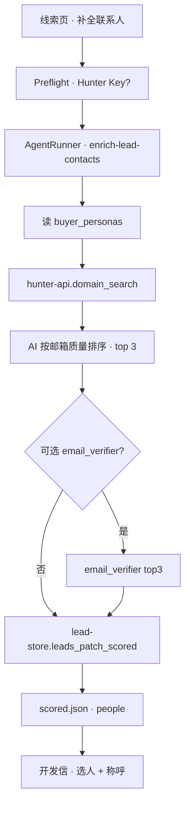
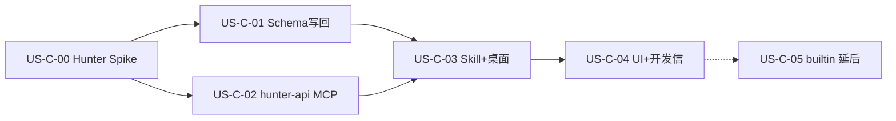

# 20 - 需求：联系人 Enrichment（Hunter 集成扩展）

> **文档类型**：本期需求 + 用户故事（**US-C**）  
> **状态**：**需求修订（2026-09-14）** — **Hunter BYOK 集成扩展**（非核心环节）；builtin 自研 **延后**；基于 Hunter MCP 实测结果优化筛选与验证策略  
> **决策记录**：[research/US-C-决策-Hunter-MVP.md](research/US-C-决策-Hunter-MVP.md)  
> **基线**：桌面端 **v0.5.3+**  
> **关联**：[17-需求-业务效率工具.md](17-需求-业务效率工具.md) §6、[03-数据模型.md](03-数据模型.md)、[04-实施计划.md](04-实施计划.md)

---

## 1. 一句话目标

在 **已有公司线索** 上，为 **已配置 Hunter API Key** 的用户，提供可选的「补全联系人」：Domain Search → AI 按邮箱质量排序 → **可选** 验邮 → 写回 `people[]`，改善开发信收件人与称呼。

**产品定位（2026-09-14 确认）**

- **Hunter 集成扩展**：对齐业务员已有 Hunter 习惯，**不是** FTCS 核心卖点，**不是** Hunter 竞品或替代品。  
- **主路径不依赖 Hunter**：画像 → 探索 → 线索 → 开发信 **无 Key 仍可跑通**（`Dear Team` + 现有 `contacts`）。  
- **合规**：用户自备 Key（BYOK），数据请求 **用户账号 → Hunter**；**不做**官方网关代调 Hunter。
- **成本可控**：邮箱验证为 **可选步骤**，默认关闭，由用户按需开启，避免无谓 credit 消耗。

---

## 2. 背景与动机

### 2.1 现状

| 环节 | 现网 | 痛点 |
|------|------|------|
| 探索 | 公司级 Lead | 多为 `sales@` / 表单 |
| 开发信 | `Dear Team` | 打开率低 |
| 业务员习惯 | **Hunter** 找采购/验邮后再写 | 产品未对接 |

### 2.2 与 R2 边界（不变）

- **输入**：已有 scored 公司线索 + 可解析官网域  
- **输出**：`people[]`，非新公司 Lead  
- **禁止**：登录 LinkedIn、非官方爬虫、把 `/in/` 建为公司 Lead  

### 2.3 产品分层（核心 vs 扩展）

```mermaid
flowchart TB
  subgraph core [FTCS 核心主路径 · 不依赖 Hunter]
    A[录入 / 画像] --> B[探索 R1/R2/R3]
    B --> C[评分去重]
    C --> D[开发信草稿]
  end
  subgraph ext [可选扩展 · Hunter BYOK]
    H[Hunter API Key]
    E[补全联系人]
    H --> E
  end
  C -.->|用户点击| E
  E -.->|people[]| D
```

| 层级 | 能力 | 无 Hunter Key |
|------|------|----------------|
| **核心** | 探索、线索、评分、开发信（Team + contacts） | ✅ 可用 |
| **扩展** | 线索页「补全联系人」、people[]、Dear FirstName | ❌ 按钮置灰 + 引导配置 Key |

| 通道 | MVP | 说明 |
|------|-----|------|
| **hunter**（BYOK） | ✅ | 设置 → **集成 / Hunter**；对齐 Places Key 交互 |
| **builtin**（自研） | ❌ 延后 | 预研证明难稳定找人；不与 Hunter 扩展并行 |

**对外表述**：*Contact enrichment powered by Hunter (optional)* — 勿宣传「内置 Hunter / 取代 Hunter」。

## 3. 已确认产品规则

| # | 规则 |
|---|------|
| **C0** | **非核心**：未配置 Hunter Key **不影响**画像/探索/评分/开发信；仅「补全联系人」不可用。 |
| **C1** | 输入：scored 线索 + `company.website` 可解析域名；无域名 **拦截本扩展**（非全局 Preflight）。 |
| **C2** | 触发：**人工**「补全联系人」；探索 / 任务编排 **不**自动跑 Hunter。 |
| **C3** | 编排：**100% Agent 本地**；**不**新增 FTCS 服务端；Hunter Key 存 userData，MCP **直连** `api.hunter.io`。支持**多 Key**（`HUNTER_API_KEYS` 逗号分隔）：按序 failover，429/401 自动切下一个（详见 [US-C-02 详设](design/US-C-02-hunter-api-MCP.md) §3.0）。注意：Hunter 额度为**账号级**，同账号多 Key 共享额度。 |
| **C4** | **MVP 主数据源**：Hunter **`domain-search`**（按线索域名）；**可选** **`email-verifier`** 对选中邮箱再验（默认关闭，用户按需开启）。 |
| **C5** | **禁止** Agent 自行 pattern 猜邮箱；Hunter 返回外 **不** 编造地址。 |
| **C6** | **验邮**：以 Hunter 返回的 `verification.status` 为准（`valid` / `invalid` / `accept_all` 等）；映射到统一 `email_status`。验证为可选步骤，默认跳过。 |
| **C7** | 写入 `people[]`；若开启验证且 `valid` 且 confidence 达阈值的个人邮箱 **同步** `contacts`；保留原公司级联系方式。 |
| **C8** | 开发信：优先 `email_status` 为 **`hunter_valid`** 的 people；若未验证或结果为空，则按邮箱质量排序（见 §6.3）选择，问候语 `Dear {FirstName}` 或 `Dear Team`。 |
| **C9** | 合规：遵守 [Hunter ToS](https://hunter.io/terms-of-service)；不存整页简历；用户可删单条 person。 |
| **C10** | `leads_score_and_dedupe` **保留** 已有 `people[]`。 |
| **C11** | 单线索配额：Domain Search **1 次**；**可选** Verifier **≤3 次**（与验证开关一致）；超配额 Skill 拒绝。 |
| **C12** | **验证开关**：Skill 提供 `verify_emails: boolean` 参数，默认 `false`；UI 提供「验证邮箱」复选框，默认不勾选。 |
| **C13** | `people[]` **无条数上限**；查出来全部存，按 §6.3 排序规则降序排列（最高优先级在前），用户自行挑选。 |

---

## 4. 端到端流程（MVP）



**可选增强（非 MVP 阻塞）**：chrome 打开线索 **官网 Contact** 合并 `info@` 到 `contacts`（**不**写入 fake people）。

---

## 5. 数据模型（草案）

### 5.1 `people[]`

```json
{
  "people": [
    {
      "id": "person_20260908_0001",
      "name": "Jane Doe",
      "title": "Procurement Manager",
      "role_match": "procurement_manager",
      "match_reason": "Hunter position 含 procurement，匹配 buyer_personas",
      "email": "jane.doe@abc-valves.de",
      "email_status": "hunter_valid",
      "confidence": 92,
      "sources": [
        {
          "type": "hunter",
          "uri": "https://hunter.io/domain-search",
          "extracted_on": "2026-09-08"
        }
      ],
      "provider": "hunter",
      "enriched_at": "2026-09-08T06:30:00Z"
    }
  ]
}
```

### 5.2 `email_status`（Hunter MVP）

| 值 | Hunter 来源 | 可作默认收件人 |
|----|-------------|----------------|
| `hunter_valid` | verifier `valid` 或 domain-search 内嵌 valid | ✅ |
| `hunter_accept_all` | `accept_all: true` | ⚠️ 展示黄标，默认不首选 |
| `hunter_invalid` | `invalid` / `disposable` | ❌ |
| `hunter_unknown` | **未验证**（默认状态）或 202 异步 | ⚠️ 展示灰标，可手动验证 |
| `hunter_unverified` | Domain Search 返回 `verification.status` 为 `null` | ⚠️ 展示灰标，可手动验证 |

> **说明**：实测 Hunter Domain Search 中约 85% 的邮箱 `verification.status` 为 `null`（未验证）。仅依赖 `hunter_valid` 会导致绝大多数线索无法自动选收件人。因此 **验证为可选步骤**，未验证的邮箱按 §6.3 排序规则参与候选，用户可在 UI 上手动触发验证。

后期 builtin 若启用，可并存 `mx_ok` 等，UI 统一徽章。

### 5.3 `contacts[]`

- Hunter **不**覆盖已有 form/phone。  
- `hunter_valid` 的个人邮箱 **追加** `contacts`（去重 by email）。

---

## 6. 技术方案摘要

### 6.1 Hunter API（MVP 核心）

| 工具 | 端点 | 用途 |
|------|------|------|
| `domain_search` | `GET /v2/domain-search?domain={eTLD+1}` | 按线索域名拉取 emails + 姓名 + 职位 + sources |
| `email_verifier` | `GET /v2/email-verifier?email=` | **可选**，对 top 候选再验（耗 0.5 credit，默认关闭） |
| `email_finder` | `GET /v2/email-finder` | **MVP 不做**（需已有姓名；Domain Search 已含） |

- 认证：`X-API-Key` 或 query `api_key`（MCP 内封装，**不出**现在 Skill 明文）。  
- 开发/单测：Hunter 文档 **`test-api-key`** 可测 REST  plumbing。  
- 实测注意：免费档 Domain Search 单次最多返回 **10 条**；`position` 字段经常为 `null`，需用 AI 综合排序（见 §6.3）。  
- 参考：[Hunter API 参考（离线）](reference/hunter-api/README.md)、[API v2](https://hunter.io/api-documentation/v2)、[agents.md](https://hunter.io/agents.md)

### 6.2 `hunter-api` MCP（US-C-02）

- 路径：`workspace/mcp-servers/hunter-api/`（对齐 `places-api` BYOK 模式）。  
- 工具：`domain_search`、`email_verifier`；可选 `account_info`（余额/配额提示）。  
- Key：桌面设置页 → userData / `.env` `HUNTER_API_KEY`；Preflight 检测。  
- 错误：`401` 引导改 Key；`402`/quota 提示充值 Hunter。

### 6.3 邮箱质量排序（Agent / Skill）

**背景**：实测 Hunter Domain Search 返回的 `position` / `department` 经常为 `null`（约 70% 样本），且免费档单次最多 10 条。因此 **不能仅按职位/部门筛选**，需综合多维度 AI 排序。

**排序维度**（按优先级）：

1. **邮箱类型**：`personal` > `generic`（`info@` / `sales@` 优先级低于个人邮箱，即使个人邮箱无职位）。
2. **置信度**：Hunter `confidence` 分数（越高越优先）。
3. **职位/部门匹配**：`position` / `department` / `seniority` 与 `buyer_personas` 匹配度（有则加权，无则跳过）。
4. **姓名完整性**：`first_name` / `last_name` 存在（可用于 `Dear FirstName`）。
5. **来源质量**：`sources` 数量、是否仍在页（`still_on_page`）。

**排序规则**：

1. 先按 **邮箱类型** 分组（personal 在前）。
2. 组内按 **置信度** 降序。
3. 同置信度按 **职位匹配度** 加权（有 position 且匹配 buyer_personas 的优先）。
4. 取综合得分最高 **≤3** 人；每人须有 Hunter `sources`。
5. `match_reason` 必填（说明排序依据，如「personal 邮箱 + confidence 84 + 含 first_name」）。

**示例**（基于实测 pantron.com）：

| 邮箱 | 类型 | confidence | 有职位 | 有姓名 | 综合排序 |
|------|------|-----------|--------|--------|----------|
| steve@pantron.com | personal | 84 | ❌ | ✅ | **1**（personal + 高置信 + 有姓名） |
| info@pantron.com | generic | 81 | ✅ support | ❌ | 2（generic 降权） |
| sales@pantron.com | generic | 78 | ✅ sales | ❌ | 3（generic 降权） |

### 6.4 现网缺口

| 缺口 | 故事 |
|------|------|
| 无 `people[]` | US-C-01 |
| 无 hunter-api MCP | US-C-02 |
| 无 Skill / Preflight / 按钮 | US-C-03 |
| 开发信只认 contacts | US-C-04 |

---

## 7. 用户故事总览



**顺序**：**C-00 → C-01 → C-02 → C-03 → C-04**

| 故事 | 标题 | MVP |
|------|------|-----|
| **US-C-00** | Hunter Spike：5 条线索 domain-search | ✅ |
| **US-C-01** | `people[]` + `leads_patch_scored` | ✅ |
| **US-C-02** | `hunter-api` MCP | ✅ |
| **US-C-03** | Skill + Preflight + 设置页 Key | ✅ |
| **US-C-04** | UI + 开发信收件人 | ✅ |
| **US-C-05** | builtin 官网补邮箱（可选） | ❌ |
| **US-C-06～08** | 批量 / 编排节点等 | ❌ |

---

## 8. US-C-00：Hunter Spike（开工门禁）

**目的**：用真实域名验证 Hunter **能否** 对典型外贸线索产出可用联系人（**替代** builtin 10 条手工 Spike）。

| 项 | 要求 |
|----|------|
| 样本 | **5 条** high 线索（含 Decodeck + 1 条品牌独特；至少 2 国） |
| 手法 | 对每条 `domain-search`（可用 `test-api-key` 试 plumbing，**至少 2 条用真实 Key**） |
| 记录 | 返回人数、≥1 个 `hunter_valid` 比例、credit 消耗、空域比例 |
| 通过线 | ≥ **60%** 线索 Domain Search **≥1 个** 可筛进 top3 的候选人；≥ **40%** 有 **`hunter_valid` 邮箱** |
| 产出 | `docs/research/联系人Enrichment-Hunter-spike.md` |

**Decodeck 预期**：可能仍偏少 — 记入「Hunter 也弱」样本，不单独否决 MVP。

---

## 9. 用户故事摘要

### US-C-01 · Schema 与写回

同前；`provider` 默认 `hunter`；扩展 `confidence`、`email_status` Hunter 枚举。

### US-C-02 · hunter-api MCP

- `domain_search({ domain, limit?, department?, seniority? })`  
- `email_verifier({ email })`  
- 单测：mock Hunter JSON；`test-api-key`  smoke。  
- **实测边界**：免费档 Domain Search 单次最多 10 条；`position` 常为 `null`；`verification.status` 约 85% 为 `null`（未验证）。

### US-C-03 · Skill 与桌面

- Skill `enrich-lead-contacts`：**仅** Hunter 路径；**参数** `verify_emails: boolean`（默认 `false`）。  
- 设置页：**集成 → Hunter API Key**（UI 对齐 Places BYOK，**独立**于官方模型/搜索通道）；支持**多个 Key**（每行一个或逗号分隔），展示各 Key 余额与状态（调 `account_info`）。  
- UI：线索页「补全联系人」按钮 + **「验证邮箱」复选框**（默认不勾选，提示「验证将消耗 0.5 credit/邮箱」）。  
- Preflight：**仅 enrich 任务**检查 Hunter Key；lead-store、profile ready。  
- 无 Key：线索页按钮置灰，文案链 Hunter 注册 + 设置页，**不**阻断探索/开发信。

### US-C-04 · UI 与开发信

- 抽屉展示 Hunter sources、confidence、验邮徽章（`hunter_valid` ✅ / `hunter_accept_all` ⚠️ / `hunter_unverified` 灰标）。  
- **验证按钮**：对 `hunter_unverified` 的邮箱提供「验证」按钮，点击后调用 `email_verifier` 并更新 `email_status`。  
- `pickPrimaryRecipient`：优先 `hunter_valid`；若无，则按 §6.3 排序取第 1 位。  
- 无 Key 时按钮灰显 + 原因。

### US-C-05 · builtin（延后）

- chrome Contact + MX 仅作 **reachability 补充**；**不** 与 Hunter people 混称为「找到联系人」。

---

## 10. 成功标准（MVP）

- [ ] Hunter Spike 归档且达 §8 通过线。  
- [ ] **无 Hunter Key** 时核心主路径（探索 → 开发信）仍可用。  
- [ ] 配置 Hunter Key 后，1 条 high 线索「补全联系人」→ `people[]` 非空。  
- [ ] ≥1 人：姓名（或邮箱前缀）+ 排序依据 `match_reason` + Hunter sources。  
- [ ] **未验证** 的邮箱可按 §6.3 排序作为收件人；**可选** 验证后 `hunter_valid` 的邮箱优先作为收件人 + `Dear {FirstName}`。  
- [ ] 无 Key / 配额用尽 → 明确错误，不 silent fail。  
- [ ] 用户可删除误识别 person。

---

## 11. 本阶段明确不做

- **builtin 自研** 作为主路径（US-C-05）  
- FTCS 官方网关 **代付** Hunter credit（可后期另评）  
- `email_finder` 批量猜邮  
- 登录 LinkedIn / 非官方爬虫  
- 批量补全、编排节点（US-C-07/08）  
- enrichment 内自动发信  

---

## 12. 工作量与风险（修订）

| 包 | 内容 | 粗估人周 |
|----|------|----------|
| C-00 Hunter Spike | 5 域名 + 报告 | 0.5 |
| C-01 Schema + patch | | 1～1.5 |
| C-02 hunter-api MCP | | 1～1.5 |
| C-03 Skill + 设置 Key | | 1 |
| C-04 UI + 开发信 | | 0.5～1 |
| **MVP 合计** | | **4～5.5** |

| 风险 | 缓解 |
|------|------|
| 用户无 Hunter 账号 | Preflight + 官网链 Hunter 注册；Spike 写清 credit 成本 |
| Domain Search 空 | UI 诚实展示；保留 contacts 回退 |
| `position` 为 null（实测约 70%） | §6.3 综合排序：邮箱类型 + 置信度 + 姓名完整性，不依赖职位 |
| `verification.status` 为 null（实测约 85%） | 验证设为可选；未验证邮箱按排序参与候选，UI 提供手动验证按钮 |
| accept_all 域 | `hunter_accept_all` 黄标，不默认发信 |
| API 配额 | 单线索 1× search + **可选** ≤3 verify；默认不验证 |

---

## 13. 相关文档

| 文档 | 关系 |
|------|------|
| [US-C-决策-Hunter-MVP.md](research/US-C-决策-Hunter-MVP.md) | 决策依据 |
| [US-C-01 详设：people Schema 与 leads_patch_scored](design/US-C-01-people-schema与leads-patch-scored.md) | 数据层（已实现，lead-store 0.5.0） |
| [US-C-02 详设：hunter-api MCP](design/US-C-02-hunter-api-MCP.md) | API 封装层（已实现，hunter-api 0.1.0） |
| [US-C-03 详设：Skill 与桌面](design/US-C-03-Skill与桌面.md) | Skill + 设置多 Key + Preflight + 线索页按钮 |
| [联系人Enrichment-spike-简明-Decodeck.md](research/联系人Enrichment-spike-简明-Decodeck.md) | builtin 难例（归档） |
| [06-MCP工具规范.md](06-MCP工具规范.md) | hunter-api 登记 |

---

## 14. 变更记录

| 日期 | 说明 |
|------|------|
| 2026-09-08 | 初稿：builtin MVP |
| 2026-09-08 | **修订**：MVP 改为 Hunter BYOK；builtin 延后；Spike 改为 Hunter domain-search |
| 2026-09-08 | **定位**：Hunter **集成扩展**、非核心；不做官方代调；无 Key 不阻断主路径 |
| 2026-09-14 | **实测修订**：基于 Hunter MCP 实测（pantron.com 样本）——①验证设为可选（默认关闭，节省 credit）；②排序规则改为综合邮箱质量（类型/置信度/姓名/职位），不依赖 `position`（实测 70% 为 null）；③`email_status` 增加 `hunter_unverified` 状态；④Spike 留到开发阶段执行 |
| 2026-09-14 | **多 Key**：C3 支持 `HUNTER_API_KEYS` 多 Key 池 + failover；设置页（US-C-03）支持配置多个 Key 并展示余额 |
| 2026-09-14 | **US-C-03 详设**：Skill `enrich-lead-contacts`、设置「集成」、Preflight、线索页按钮；C7 经 `sync_valid_to_contacts`；抽屉/开发信选人归 C-04 |
