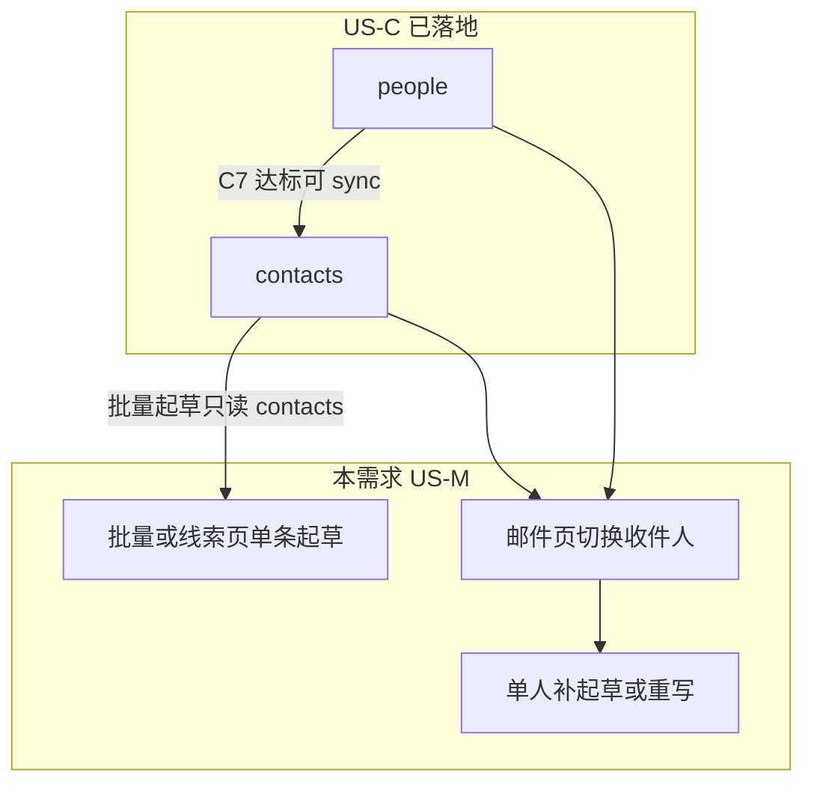
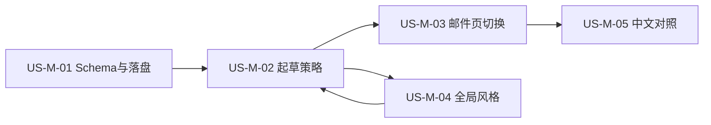

# 21 - 需求：开发信重构（多收件人 · 单风格 · 中英对照）

> **文档类型**：本期需求 + 用户故事（**US-M**，Mail / Outreach）  
> **状态**：**需求已立（2026-09-15）** — 规划中；详设与编码另开  
> **基线**：桌面端 **v0.5.4+**（联系人 Enrichment US-C-01～C-04 已落地；开发信仍为「一线索一稿 · short/professional 双变体」）  
> **对齐**：官网支持计划 `email-draft-styles`（开发信 · 多风格与中英对照）  
> **承接**：[20-需求-联系人Enrichment.md](20-需求-联系人Enrichment.md) §10「另立故事」；[US-C-04 §12](design/US-C-04-抽屉people与手工维护.md) 选人 / 称呼备忘  
> **关联**：[03-数据模型.md](03-数据模型.md)、[05-智能体技能规范.md](05-智能体技能规范.md)、[18-需求-任务编排一键跑通.md](18-需求-任务编排一键跑通.md)

---

## 1. 一句话目标

把「一线索两变体套话」升级为：**按收件人粒度的专业开发信**（**强制 1 封公司向** + **按个人邮箱 N 封个人向**，N≥0），支持邮件页在 **contacts ∪ people** 间切换审阅，全局可选行文风格，并提供 **中文对照** 便于改稿。

---

## 2. 背景与动机

### 2.1 现网痛点

| 环节 | 现网 | 痛点 |
|------|------|------|
| 起草粒度 | 一线索一份 `data/emails/{lead_id}/draft.json` | 无法按决策人分别触达 |
| 变体 | `short` + `professional` 双变体 | 业务上粗糙；审阅成本高、价值低 |
| 收件人 | `pickPrimaryEmail(contacts)` + `Dear {公司} Team` | 补全联系人（people）后仍难个性化 |
| 风格 | 无全局设置 | 无法按品牌语气统一 |
| 审阅 | 仅外文稿 | 中文业务员改稿成本高 |

### 2.2 与 Enrichment 的关系

- **批量 / 线索页「写邮件」**：每条目标线索 **始终** 生成 1 封公司向稿；并按 **`contacts`** 中的个人邮箱追加 N 封（见 E2～E4）。  
- **邮件页切换池**：更宽，为 **`contacts` ∪ `people`**（见 E5），便于对仅存在于 people、尚未进 contacts 的人 **单人补起草**（E6）。

### 2.3 拍板记录（需求梳理）

| 项 | 决定 |
|----|------|
| 公司向稿 | **强制**：每条被起草的线索 **恰好 1** 封公司向（`Dear {Company} Team`），与是否存在 `info@` / `sales@` 等通用邮箱无关 |
| 个人向稿 | **按有无个人邮箱**：`contacts` 中非通用本地部分的邮箱各 1 封；没有则 N=0 |
| 「1+N」含义 | **恒为 1** 封公司向 + **N** 封个人向（N≥0） |
| 无通用邮箱时的公司向收件人 | 优先用通用址；若无，**不**把个人邮箱兼作公司向收件人（避免与个人向重复）；`recipient.email` 可空，稳定键如 `company`（详设定 slug） |
| 中文对照 | **仅审阅对照**；外发 / 选用正文仍为原文（默认 en） |
| 行文风格 | **自由文本**（用户自述语气/偏好）；默认空=由模型按专业外贸开发信惯例发挥；**全局**（跨产品）；起草靠大模型理解该文本，**不做**预设下拉枚举 |

---

## 3. 已确认产品规则

| # | 规则 |
|---|------|
| **E0** | **兼容主路径**：无 people、甚至无 contacts 邮箱时仍可生成 **公司向**稿；无 Hunter Key **不**阻断开发信。 |
| **E1** | **单正文**：取消 short/professional 双变体与 UI 切换；每稿仅一种「专业向」正文（受全局风格调制）。删除 `selected_variant` 语义。 |
| **E2** | **批量 / 线索页单条起草**：对每条目标 scored 线索 **始终**产出公司向稿 1 封；个人向仅来自该 lead **`contacts`** 中 `type === "email"` 且判定为个人级的地址。**不**因 people 有人而自动批量起草个人向。 |
| **E3** | **公司级 vs 个人级（contacts）**：本地部分（`@` 前，小写）命中冻结通用表 → **公司级**；否则 → **个人级**。通用表初值：`info` `sales` `contact` `contacts` `admin` `support` `hello` `office` `mail` `enquiry` `inquiry` `service` `help` `team` `marketing` `business` `export` `import` `purchase` `purchasing` `buyer` `buyers`（详设可微调，变更需改冻结常量）。 |
| **E4** | **1+N 落稿（公司向强制）**：**恰好 1** 封公司向——落盘 **`data/emails/{lead_id}/draft.json`**（与现网同路径）；称呼 `Dear {CompanyName} Team`；收件人优先首选通用址，其余记 `recipient_aliases`；若无通用址，`recipient.email` 可空，**禁止**用个人邮箱顶替。个人级邮箱 → 各 1 封，落盘 **`data/emails/{lead_id}/{recipient_key}/draft.json`**；称呼优先 `people[].first_name`，否则弱解析本地部分，再否则礼貌中性称呼。合计 **1 + N（N≥0）**。 |
| **E5** | **邮件页切换池**：公司向槽（若已有稿）+ `contacts` 邮箱 ∪ `people` 邮箱（小写去重）。展示姓名/职位（people 优先）、邮箱、公司级/个人级/公司向槽、是否已有草稿。 |
| **E6** | **单人起草 / 重写**：当前选中收件人无稿 →「起草」；有稿不满意 →「重写」（**仅覆盖该收件人稿**）。允许目标邮箱 **仅在 people**（不强制 sync 进 contacts）。对公司向槽重写仍保持 Team 称呼与强制槽位语义。 |
| **E7** | **全局行文风格（自由输入）**：设置中提供多行/单行文本框，用户用自然语言描述期望语气（例：「简洁、少套话」「偏顾问、强调 OEM」「活泼但专业」）。存 `emailDraftStylePrompt`（字符串，可空）；**全局跨产品**。起草与重写时将该文本注入生成提示，由 **大模型自行理解并落地**，产品侧 **不**做正式/简洁/友好等预设枚举或下拉。空文本 → 模型按默认专业外贸开发信惯例。**改风格文案不自动重写旧稿**。长度上限详设定（建议数百字内）。 |
| **E8** | **中文对照**：对当前稿可「生成 / 刷新中文对照」；写入旁路字段（如 `subject_zh` / `body_zh`），UI 对照展示；**不**替换外发正文，**不**把中文设为选用语言（本期）。原文语言仍按现网市场规则（默认 `en`）。 |
| **E9** | **线索状态**：任一收件人稿（含强制公司向）生成成功即可将 lead `status` → `email_drafted`；全部驳回/删光后的回退细则归详设。 |
| **E10** | **编排节点** `draft-outreach-email`：语义升级为「按 E2～E4 为待起草线索批量生成多收件人稿」；Preflight / 上限（如一次 ≤50 线索）保持量级，详设重算「封数」与超时。 |

---

## 4. 数据与落盘（要点，详设细化）

### 4.1 目录约定

| 路径 | 含义 |
|------|------|
| `data/emails/{lead_id}/draft.json` | **公司向槽**（强制 1 封）。路径不变；**遗留双变体稿就地迁移**为新 Schema（见 §4.2） |
| `data/emails/{lead_id}/{recipient_key}/draft.json` | **个人向**（一人一稿）。`recipient_key` 为规范化邮箱的安全 slug/hash（详设） |
| （可选）`data/emails/{lead_id}/index.json` | 目录索引；非必须，可用目录扫描 |

| 字段演进 | 目标 |
|----------|------|
| `variants[]` short + professional | **迁移与新写**统一为顶层 `subject` + `body`；迁移只保留 **professional**（无则首项），**丢弃 short**；删除 `selected_variant` |
| `recipient.email` | 个人向必填；公司向可空（无通用址时）+ 可选 `recipient_aliases[]`；`audience: "company" \| "person"`（新写与迁移后必带） |
| 风格 / 中文 | 可选 `style_prompt` 快照、`subject_zh` / `body_zh` |

### 4.2 遗留数据迁移（Schema 就地升级）

- **做**：将既有根（及未来子目录）`draft.json` **就地改写**为新数据结构，保证磁盘形态与新写一致。  
- **不做**：把根稿搬到子目录（公司向永远留在 `{lead_id}/draft.json`）。  
- **正文选取**：只保留 `professional`；若无该变体则取 `variants[0]`；**忽略**原 `selected_variant`（即使曾选 short）。  
- **受众**：根路径迁移结果恒为 `audience: "company"`。  
- **触发**：打开工作区 / 首次 list 或 load 时惰性迁移；幂等。  
- **备份**：改写前复制为同目录 `draft.json.pre-m01`（已存在不覆盖）；有 `draft.md` 则同步 `draft.md.pre-m01`。  
- 细则见 [US-M-01](design/US-M-01-EmailDraft-schema与落盘.md) §4.5。

### 4.3 设置

- `emailDraftStylePrompt`：`string`，可空，存 **`userData/ftcs-prefs.json`**（经 Settings IPC），**本机全局 · 跨产品**；**非**枚举。长度上限 **500** Unicode 码位（详设）。  
- 细则：[US-M-04-全局行文风格.md](design/US-M-04-全局行文风格.md)。

---

## 5. 用户故事拆分（建议）

| 故事 | 标题 | MVP | 说明 |
|------|------|-----|------|
| **US-M-01** | EmailDraft 目录约定 / Schema / 读模型 / **遗留迁移** | Must | 根=公司向；子目录=个人向；双变体就地迁为单正文（professional）；详设 [US-M-01](design/US-M-01-EmailDraft-schema与落盘.md) |
| **US-M-02** | 起草策略：contacts 分类、1+N、Skill/MCP/IPC | Must | 批量 + 线索页单条；编排节点对齐 |
| **US-M-03** | 邮件页：收件人切换 + 单人起草/重写 | Must | 并集池；空态 |
| **US-M-04** | 设置：全局行文风格（自由文本） | Must | 文本框；注入 Prompt；不自动重写旧稿 → 详设 [US-M-04](design/US-M-04-全局行文风格.md) |
| **US-M-05** | 中文对照生成与展示 | Must | 旁路字段；仅审阅 |
| **US-M-06** | 通过/驳回按收件人；跳转线索增强 | Should | 可与支持计划 `email-to-lead-navigation` 合并排期 |

**建议实施顺序**：**M-01 → M-02 → M-03 → M-04 → M-05**（M-04 可与 M-02 并行接口，但生成逻辑须读风格）。

---

## 6. 界面要点（非详设）

### 6.1 线索页

- 「写邮件 / 批量起草」：按 E2～E4 为每条线索生成多稿；进度文案应用「线索数 / 预计封数」区分。  
- 列表「已写邮件」：有 **任意** 收件人稿即可点进邮件页（详设可标未完成收件人数）。

### 6.2 邮件页

- 左侧：仍可按公司/线索列队；进入某线索后 **收件人切换**（E5）。  
- 主区：单正文编辑（无 short/professional Tab）。  
- 动作：保存、通过、驳回、**为当前联系人起草/重写**、**中文对照**。  
- 无稿空态：说明「该联系人尚无开发信」+ 起草按钮。

### 6.3 设置

- 全局「开发信行文风格」：**自由输入文本框**（可附简短示例 placeholder）；说明：由模型理解并应用于之后的起草/重写，改文案不会自动重写已有稿。

---

## 7. 成功标准（MVP）

- [ ] 一线索含 `info@` + 2 个个人 contacts → 生成 **1 + 2** 封独立稿，路径按收件人/槽位区分。  
- [ ] 仅个人 contacts、无通用本地部分 → 仍有 **1 封公司向**（收件邮箱可空）+ **N 封个人向**。  
- [ ] `contacts` 无任何邮箱 → 仍生成 **1 封公司向**；个人向 N=0。  
- [ ] 邮件页可在公司向槽 + contacts∪people 间切换；people-only 无稿时可单人起草。  
- [ ] 重写只覆盖当前收件人/槽位，其他稿保留。  
- [ ] UI/Schema **无** short/professional 切换。  
- [ ] 设置中填写自定义风格文案后，新起草语气可区分于空设置；旧稿不变直至重写。  
- [ ] **无**正式/简洁/友好等预设下拉。
- [ ] 可生成中文对照且原文主体不变。  
- [ ] 无 Hunter Key 时仍可完成强制公司向 +（若有）个人向起草（E0）。  
- [ ] 任务编排「批量起草」节点行为与线索页批量一致（E10）。

---

## 8. 本阶段明确不做

- 系统内 SMTP/一键发送（支持计划另项）  
- 把中文对照设为外发正文 / 多语言正式变体库  
- 批量起草自动包含 **仅 people、未进 contacts** 的邮箱（须邮件页单人触发）  
- 改风格后后台静默重写全部旧稿  
- 恢复 short 变体；行文风格 **预设枚举下拉**（改为自由文本）  
- 把公司向根稿 **搬迁**到子目录（路径布局不变；仅做 Schema 就地升级）  
- 迁移时保留 short 变体旁路备份 
- 跟进信序列 / 定时触达（US-W-06 等）

---

## 9. 工作量与风险（粗估）

| 包 | 内容 | 粗估人周 |
|----|------|----------|
| M-01 | 目录约定 / Schema / 遗留就地迁移 / 读模型 | 1～1.5 |
| M-02 | 分类规则 + 生成器 + Skill/IPC/编排 | 1.5～2 |
| M-03 | 邮件页切换 + 单人起草 | 1～1.5 |
| M-04 | 风格设置 | 0.3～0.5 |
| M-05 | 中文对照 | 0.5～1 |
| **合计** | | **约 4.7～6.8** |

| 风险 | 缓解 |
|------|------|
| 旧稿与新结构 | **就地迁移**为统一 Schema（professional → 公司向）；路径不搬迁；幂等 + 原子写 |
| 通用本地部分误判个人 | 冻结表可配置扩展；抽屉可把邮箱 sync 进 contacts 后重写 |
| 批量封数爆炸（多联系人） | 单线索收件人上限 + 总封数上限（详设）；UI 预告 |
| 中文对照质量 | 标明「辅助审阅」；可刷新；不替代原文 |
| 编排超时 | 按封数放大 idle 超时（已有批量补全先例） |

---

## 10. 相关文档

| 文档 | 关系 |
|------|------|
| [20-需求-联系人Enrichment.md](20-需求-联系人Enrichment.md) | people/contacts 来源；原「开发信另立」验收迁入本文 |
| [US-C-04 抽屉 people 与手工维护](design/US-C-04-抽屉people与手工维护.md) §12 | 选人/称呼备忘 → 由本文承接 |
| [03-数据模型.md](03-数据模型.md) | EmailDraft 现状；实现期同步修订 |
| [draft-outreach-email Skill](../workspace/skills/draft-outreach-email/SKILL.md) | 实现期重写 |
| 支持计划 `email-draft-styles` | 产品对外条目；与本文同范围 |

**详设**：

| 故事 | 详设 |
|------|------|
| US-M-01 | [US-M-01-EmailDraft-schema与落盘.md](design/US-M-01-EmailDraft-schema与落盘.md) |
| US-M-04 | [US-M-04-全局行文风格.md](design/US-M-04-全局行文风格.md) |
| US-M-02 / 03 / 05 | 待开 |

---

## 11. 变更记录

| 日期 | 说明 |
|------|------|
| 2026-09-15 | 初稿立项：多收件人 1+N、单风格、全局行文、中文对照；拍板无通用邮箱不强制公司向、中文仅审阅 |
| 2026-09-16 | **修订**：公司向稿改为 **强制恰好 1 封**；个人向仍按个人邮箱 N≥0；无通用址时公司向 `recipient.email` 可空，不用个人邮箱顶替 |
| 2026-09-16 | **修订**：行文风格改为用户 **自由文本**（非预设下拉），由大模型理解落地 |
| 2026-09-16 | **修订**：落盘路径仍不搬迁——既有 `{lead_id}/draft.json` 即公司向；个人向落在 `{lead_id}/{recipient_key}/draft.json` |
| 2026-09-16 | UI 确认：邮件页收件人顶栏芯片；中文对照 **默认可收起**（详设归 M-03/M-05） |
| 2026-09-16 | **US-M-01 详设**落地：`docs/design/US-M-01-EmailDraft-schema与落盘.md` |
| 2026-09-16 | **修订**：遗留双变体改为 **就地迁移** 新 Schema（只保留 professional → 公司向）；不再「仅读兼容、不改磁盘」 |
| 2026-09-17 | **US-M-04 详设**落地：`docs/design/US-M-04-全局行文风格.md`（prefs 自由文本、Prompt 注入、不自动重写旧稿） |
