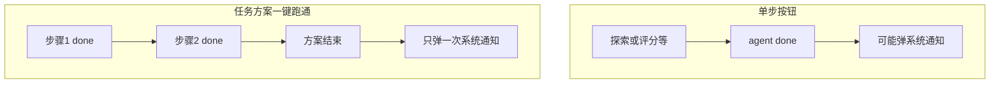
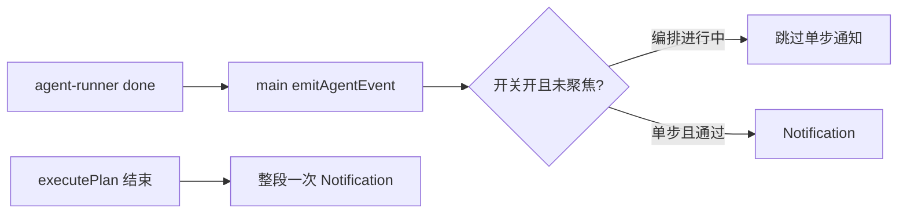
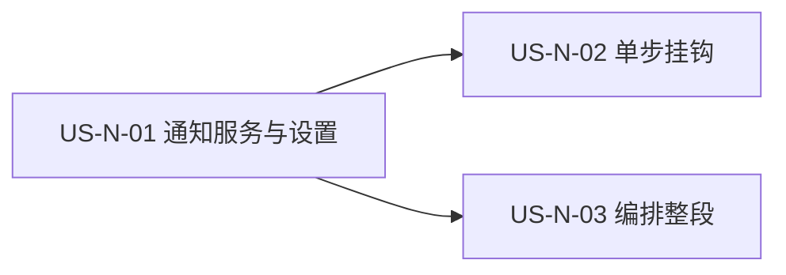

# 22 - 需求：任务完成 · Windows 通知

> **文档类型**：本期需求 + 用户故事（**US-N**，Notify）  
> **状态**：**需求已立（2026-09-20）** — 规则已拍板；详设与编码另开  
> **基线**：桌面端 **v0.5.5+**（Agent `done` 事件与任务编排一键跑通已落地）  
> **对齐**：官网支持计划 `task-done-notification`（任务完成 · Windows 通知，P0 · 开发中）  
> **承接**：[18-需求-任务编排一键跑通.md](18-需求-任务编排一键跑通.md) **R8** / US-W-03「完成推送通知」延后项  
> **关联**：[04-实施计划.md](04-实施计划.md)、[website/src/config/support-plan.ts](../website/src/config/support-plan.ts)

---

## 1. 一句话目标

Agent **长任务**（探索、评分、开发信起草等）结束后，若用户已切走或最小化窗口，则弹出 **Windows 系统通知**，提醒回来查看结果；人在盯着界面时不打扰。

---

## 2. 背景与动机

### 2.1 用户反馈

| 现象 | 痛点 |
|------|------|
| 探索 / 评分 / 批量起草等耗时长 | 通常不会一直盯着界面 |
| 仅有应用内时间线 / Toast | 切到浏览器或其它窗口后看不到 |
| 忘了回来看 | 错过结果或误以为任务还在跑 |

### 2.2 与编排的关系

- 单步：每次 Agent 长跑结束可通知（受 N1/N5 约束）。  
- 编排：中间每步也会发 `done`，但 **不得**逐步弹系统通知；仅整条方案结束弹一次（N2）。

### 2.3 拍板记录（需求梳理）

| 项 | 决定 |
|----|------|
| 何时弹 | **仅**主窗口未聚焦或已最小化（选项 A） |
| 编排 | **整段结束**通知一次（选项 A）；中间步骤不弹 |
| 成败 | 成功与失败都通知，文案区分 |
| 点击 | 聚焦主窗口；本期不强制跳业务页 |
| 开关 | 设置可关，**默认开** |

---

## 3. 已确认产品规则

| # | 规则 |
|---|------|
| **N1** | **仅未聚焦时通知**：主窗口未聚焦 **或** 已最小化时才弹 Windows 系统通知；窗口在前台且未最小化时 **不弹**。 |
| **N2** | **编排整段一次**：任务方案一键跑通（`executePlan`）只在 **整条方案结束**（全部成功，或任一步失败/中止导致链停止）通知 **一次**；中间步骤（探索→评分→…）的单步 `done` **不**弹系统通知。 |
| **N3** | **成败都通知**：成功与失败均通知；正文文案区分成功 / 失败（含编排中途失败，可带方案名与失败步骤摘要）。 |
| **N4** | **点击聚焦主窗口**：用户点击通知 → 显示并聚焦主窗口；本期 **不**强制 `router.push` 到探索 / 线索 / 邮件等业务页。 |
| **N5** | **可关闭**：设置提供「任务完成通知」开关，**默认开启**；关闭后任何路径均不弹系统通知。 |
| **N6** | **覆盖长任务**：画像生成、扩展关键词、探索（R1/R2/R3）、评分去重、批量/单条/单槽起草、补全联系人、中文对照等 **Agent 长跑**。**不覆盖**极短非 Agent 操作（如抽屉内单条「验证」邮箱）。 |
| **N7** | **非定时 / 非静默后台**：与支持计划「定时运行编排任务」解耦；本需求只解决「前台已启动任务、人切走忘回来」。应用未运行时的定时唤醒 **不做**。 |

---

## 4. 范围与非范围

### 4.1 本期做

- Windows 桌面端系统通知（Electron `Notification` / 系统 toast）。  
- 未聚焦判定、设置开关、单步挂钩、编排抑制与整段一次通知。  
- 通知失败时 **静默降级**（不阻断任务、不弹错误挡路）。

### 4.2 本期不做

| 项 | 说明 |
|----|------|
| 定时触发编排 | 见支持计划 `scheduled-tasks` / [docs/18](18-需求-任务编排一键跑通.md) US-W-06 |
| 应用未启动时的推送 | 无常驻服务、无托盘常驻要求 |
| 系统托盘图标常驻 | 非本需求 |
| 点击后路由到具体业务页 | 仅聚焦窗口（N4）；可后续增强 |
| macOS / Linux 适配 | 产品当前为 Windows；其它平台不验收 |
| 声音 / 自定义铃声 | 跟系统默认即可 |
| 应用内 Toast 替代系统通知 | 可保留现有 Toast；**不**用应用内 Toast 充当本需求交付 |

### 4.3 设置入口（产品约束）

- 位置建议：设置页 **通用** 或独立 **通知** 小节（与模型通道、集成并列清晰即可）。  
- 文案建议：标题「任务完成通知」；说明「长任务结束且窗口不在前台时，弹出 Windows 系统通知」。  
- 存储：本机全局偏好（与行文风格等同类，详定 key）；**非**按产品。

---

## 5. 现状锚点（实现约束）

| 锚点 | 说明 |
|------|------|
| 完成信号 | [`AgentEventPayload`](../desktop/electron/ipc/types.ts) `type: 'done'`（`ok` + `message`）；skill 经 `type: 'state'` |
| 编排 | [`useWorkflowExecute.executePlan`](../desktop/src/composables/useWorkflowExecute.ts) 逐步 `waitForAgentDone`；中间步也会收到 `done` → 必须 **抑制单步 OS 通知** |
| 发通知进程 | **主进程**发起（避免渲染进程生命周期/权限问题） |
| 聚焦判定 | 主窗口 `!isFocused() \|\| isMinimized()`（N1） |
| 文案 | 标题固定 **`FTCS·外贸获客智能体`**；正文 = 任务名/方案摘要 + 成功或失败信息（可复用 `message`） |
| 权限 | Windows 可能需用户允许通知；不可用或拒绝时静默跳过 |

IPC 命名、偏好 key、编排抑制 flag 的具体形态 → **US-N-01 详设**写死，本文不锁。

---

## 6. 用户故事拆分

| ID | 标题 | 优先级 | 依赖 | 说明 |
|----|------|--------|------|------|
| **US-N-01** | 主进程通知服务 + 未聚焦判定 + 设置读写 | Must | — | 封装 show；读开关；点击 focus；权限降级 |
| **US-N-02** | 单步 Agent 长任务完成/失败挂钩 | Must | N-01 | 在 `done` 路径按 N1/N5/N6 调用；编排进行中由 N-03 抑制 |
| **US-N-03** | 编排整段结束通知 | Must | N-01、编排现网 | 方案开始抑制单步；结束（成败/中止）通知一次 |

建议实现顺序：**N-01 → N-02 → N-03**（N-03 可与 N-02 同迭代，但必须有抑制标记，避免串跑时连弹）。

---

### US-N-01　通知服务与设置

**作为** 外贸业务员，**我想** 在设置里开关任务完成通知，并在系统允许时收到 Windows 通知，**以便** 按自己的习惯决定是否被提醒。

| 项 | 内容 |
|----|------|
| 优先级 | Must |
| 依赖 | — |
| 状态 | **编码已落地** → [design/US-N-01-任务完成通知服务与设置.md](design/US-N-01-任务完成通知服务与设置.md) |

**验收要点**

- 设置项默认开启；关闭后主进程不再展示任务完成类系统通知。  
- 提供可测的主进程 API/模块：入参至少含标题/正文/成败语义；内部执行 N1（调用方也可先判，但服务侧应再判一次更稳）。  
- 点击通知 → 主窗口 `show` + `focus`。  
- `Notification.isSupported() === false` 或展示失败 → 不抛到用户任务流。

详设要点：prefs `taskDoneNotificationEnabled`；模块 `showTaskDoneNotification` / `setWorkflowNotifySuppressed`；设置分类「通知」。**不**在本故事挂钩 Agent `done`（US-N-02）或编排结束（US-N-03）。

---

### US-N-02　单步 Agent 任务挂钩

**作为** 外贸业务员，**我想** 在单独跑探索/评分/起草等长任务并切到别的窗口时被提醒，**以便** 及时回来看结果。

| 项 | 内容 |
|----|------|
| 优先级 | Must |
| 依赖 | US-N-01 |
| 状态 | 待详设 |

**验收要点**

- N6 所列长任务在 `done`（`ok: true` / `false`）时，若 N1+N5 满足则弹通知。  
- 窗口保持前台聚焦时不弹。  
- 单条验邮等短操作不弹。  
- 编排执行中的单步 `done` 不弹（由 US-N-03 保证）。

---

### US-N-03　编排整段结束通知

**作为** 外贸业务员，**我想** 一键跑完整条方案后只被提醒一次，**以便** 不被中间步骤打扰，又能在整段结束时回来。

| 项 | 内容 |
|----|------|
| 优先级 | Must |
| 依赖 | US-N-01；[docs/18](18-需求-任务编排一键跑通.md) 执行器现网 |
| 状态 | 待详设 |

**验收要点**

- 标准多步方案串跑：中间步骤完成 **零** 次系统通知（即使窗口未聚焦）。  
- 全部成功结束：未聚焦时 **一次** 成功通知（文案含方案名或「任务方案已完成」类摘要）。  
- 中途失败或用户中止：未聚焦时 **一次** 失败/中止通知（可含失败步骤）。  
- 开关关闭：整段亦不通知。

---

## 7. 验收清单（需求级）

- [ ] 跑长任务且窗口在前台：不弹系统通知。  
- [ ] 跑长任务后切换到其它应用（或最小化）：任务结束后弹出系统通知。  
- [ ] 通知文案能区分成功与失败。  
- [ ] 点击通知后主窗口回到前台。  
- [ ] 设置关闭「任务完成通知」后，单步与编排均不弹。  
- [ ] 多步方案串跑：中间不弹，仅整段结束弹一次。  
- [ ] 系统通知不可用时任务仍正常完成。  
- [ ] 单条验邮等短操作不弹系统通知。

---

## 8. 非功能需求

| 项 | 要求 |
|----|------|
| **不阻断** | 通知路径异常不得导致 Agent 失败或编排中断 |
| **隐私** | 通知正文避免贴出客户邮箱全文等敏感细节（可用「开发信起草完成」等摘要；详设定稿） |
| **可测** | 未聚焦判定与编排抑制可用假窗口状态 / flag 单测；真机手工验 Windows toast |
| **文档** | 发版后更新帮助 FAQ（可选一句）与发布日志；支持计划条目随发版下线 |

---

## 9. 风险与开放问题

| # | 项 | 倾向 |
|---|-----|------|
| O1 | Windows「专注助手」可能抑制 toast | 产品无法绕过；验收注明依赖系统设置 |
| O2 | 多屏 / 窗口失焦边界 | 以 Electron 主窗口 `isFocused` / `isMinimized` 为准 |
| O3 | 画像生成是否算长任务 | **算**（纳入 N6） |
| O4 | 用户主动「中止」是否通知 | **通知一次**（失败/中止语义），避免以为仍在跑 |

---

## 10. 修订记录

| 日期 | 说明 |
|------|------|
| 2026-09-20 | 初稿：N1～N7；US-N-01～03；承接 docs/18 R8；对齐支持计划 `task-done-notification` |
| 2026-09-20 | US-N-01 详设已立并回链 |
| 2026-09-20 | US-N-01 编码落地（notify 模块 + 设置「通知」开关） |

---

## 11. 下一步（不在本文交付）

1. ~~用户确认本文后，撰写 **US-N-01** 详设~~ → 已完成：[US-N-01-任务完成通知服务与设置.md](design/US-N-01-任务完成通知服务与设置.md)。  
2. 编码 **US-N-01**；随后 US-N-02 / US-N-03 详设与编码。  
3. 随桌面发版更新 changelog，并将支持计划 `task-done-notification` 下线。
