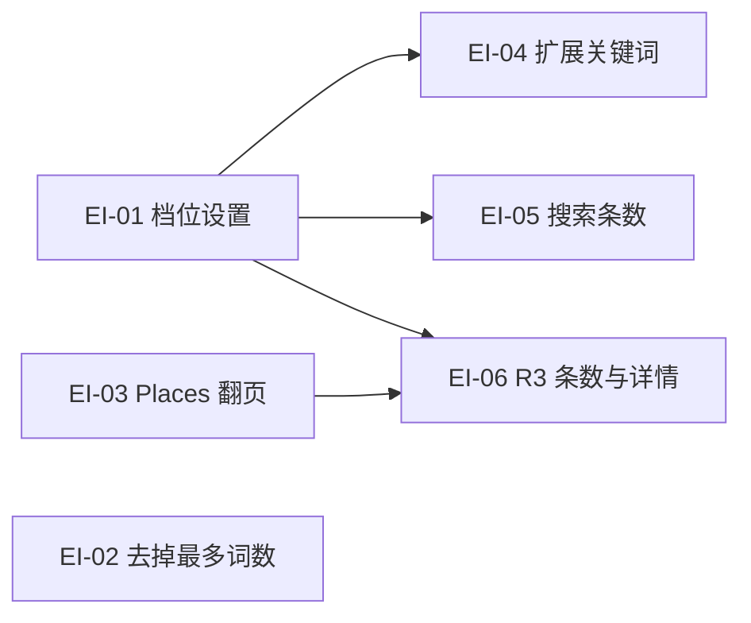

# 24 - 需求：探索强度 · 高 / 中 / 低

> **文档类型**：本期需求 + 用户故事（**US-EI**）  
> **状态**：**需求已立（2026-09-21）** — 规则已拍板；详设随各故事另开，本文不写代码  
> **对齐**：官网支持计划 `explore-intensity`（探索强度 · 高 / 中 / 低，P0）  
> **基线**：桌面端现网技能与 MCP 上限（见 §3）

---

## 1. 一句话目标

提供 **低 / 中 / 高** 三档探索强度。档位改变三类数量：**各轮关键词目标条数**、**每次搜索 API 返回多少条**、**每次 Google Places 返回多少条**。关键词不设总数上限，按 R1、每个启用社媒、R3 分别给目标，并尽可能达到；产品太简单时允许少于目标，不为凑数生成垃圾词。**中档 R1 是 40**，每个启用社媒和 R3 是 **20**（R1 低 20 / 高 60；社媒与 R3 低 10 / 高 40）。不改设置时用中档；产品简单时仍允许少于目标。

---

## 2. 背景

用户反馈：单次探索收获的线索偏少。现网把数量写死在技能说明里，不能按人调整。

数量变大之后，同一次探索会：

- 生成更多搜索词（模型更久、更贵）
- 每个词看更多搜索结果（后续打开网页、判断客户更久）
- Places 候选更多（Details 与补官网也可能更多，Google 按次计费）

所以用三档预设，而不是让每个人自己填一堆数字。

---

## 3. 现网基线（对照用）

这些是今天实际在用的数。关键词侧本期不再沿用「总数 30～50」这套算法，中档目标见 §4.1。

### 3.1 扩展关键词（`expand-keywords`）

技能要求模型生成，保存接口 **没有** 再卡死条数。

| 项 | 现在 |
|----|------|
| 搜索词总数 | **30～50**（自检至少 30；技能写 Phase 1 上限 50） |
| R1 | **不少于总数的 60%** |
| R3 地图发现词 | **6～12**（总数 ≥ 40 时至少 6） |
| R2 | 剩下的词；只给当前启用站点；**每个启用站至少 2 条** |
| R4 | 不生成 |

### 3.2 搜索 API 返回条数（`search_web.num_results`）

技能里写死 **5**。接口本身只允许 **1～10**（Tavily 与官方网关都会卡在 10）。

用到 5 的地方：

| 场景 | 现在 |
|------|------|
| R1 每个搜索词 | 5 |
| R2 每个社媒搜索词 | 5 |
| R2 补官网的二次搜索 | 5 |
| R3 缺官网时的 Tavily 补搜 | 5 |

### 3.3 Google Places 返回条数（R3）

| 项 | 现在 |
|----|------|
| 每个 R3 词 `places_text_search.pageSize` | **20** |
| 翻页 | **不做**（再要一页等于再计一次 Text Search） |
| 接口单次上限 | **20**（Google 这一次请求最多 20 条） |
| 过滤后拿去查详情的条数 | **15**（`MAX_DETAILS_PER_KEYWORD`） |

现网技能自己传 `pageSize=20` 且不翻页。多于 20 条的请求改由 MCP 内翻页，见 §4.2。

---

## 4. 关键词怎么计数（已确认）

不再设「总共 30～50」这种总数上限，也不再用「R1 占 60%、R2 吃剩余」来分配。每一档只规定三个目标：

| 目标 | 含义 |
|------|------|
| R1 | 这一档希望生成多少条广撒网搜索词 |
| R2 | **每个当前启用的社媒**希望生成多少条。两个站各有自己的目标，不是所有社媒加在一起的总数。未启用的站不出词 |
| R3 | 这一档希望生成多少条地图发现词。用更多城市/区域、更多不同搜法来凑，不把同一句改写多遍 |

目标是 **尽可能达到**，不是必须写满：

- 画像够丰富时，写到目标附近。
- 产品确实简单，再写就会重复、空泛或脱离画像时，停在更少的条数。
- 摘要里说明实际条数；低于目标时用一句话说明原因（例如品类窄、目标市场少）。
- 仍不生成 R4。质量要求不变：像真人会搜的词，不捏造画像里没有的认证、规格或竞品专名。

现网「每个启用站至少 2 条」是保底，不是目标。改成按社媒设目标后，站点一多，总词数会随启用站点数上升，这是预期行为。

### 4.1 三档目标条数（关键词已确认）

R1 与「每个启用社媒、R3」分开计数。R1 为低 **20** / 中 **40** / 高 **60**。每个启用社媒和 R3 仍是低 **10** / 中 **20** / 高 **40**。

先前写成 24 / 4 / 8，只是把现在「总数大约 40、R1 占六成、R3 约 8、剩下的均分给两个社媒」倒推出来的，不是这三轮必须不一样。

| 项 | 低 | 中 | 高 |
|----|----|----|-----|
| R1 目标 | 20 | 40 | 60 |
| R2 目标（每个启用社媒） | 10 | 20 | 40 |
| R3 目标 | 10 | 20 | 40 |
| 搜索每次返回 | 3 | 5 | 10 |
| Places 每次返回 | 10 | 20 | 40 |
| 每词详情上限 | 7 | 15 | 30 |

启用几个社媒，R2 就大约是「该社媒目标 × 站点数」。中档开 2 个站时，R2 大约 40 条，加上 R1 的 40 和 R3 的 20，一次扩展大约 100 条。仍允许少写。

高档搜索 **10** 已是接口硬顶，搜索侧不能再翻页合并。Places 高档 **40** 由 MCP 翻页凑出，见 §4.2。搜索条数低 3 / 中 5 / 高 10，四处一起变，已确认。详情上限不单独配置，见 §4.3。

### 4.2 Places：MCP 内翻页合并（已确认）

Google 单次 Text Search 最多 **20** 条。调用方（技能）只传「要多少条」，不自己翻页。

- 请求 ≤ 20：一次搜索，原样返回。
- 请求 > 20：MCP 按每页最多 20 条自动用 `nextPageToken` 翻页，合并成一份结果再返回。
- 上游没有下一页时，返回已经合并到的条数，不为凑数报错。
- 每翻一页再计 **一次** Text Search。高档 40 条 = 每个 R3 词大约 2 次搜索费用；中档 20 条仍是 1 次。
- 技能与设置不暴露页码。缓存键要带上请求条数，避免把 20 条的缓存当成 40 条。

### 4.3 详情上限（已确认）

每个 R3 词送去 `place_details` 的条数上限 = **本次 Places 实际返回条数 × 3/4**，向下取整。先按现有规则过滤，再按原顺序取到这个上限。

满页时：

| 档 | Places 返回 | 详情上限 |
|----|-------------|----------|
| 低 | 10 | 7 |
| 中 | 20 | 15 |
| 高 | 40 | 30 |

中档满页仍是现在的 15。返回不足一整页时按实际条数重算，例如只返回 12 条则上限为 9。过滤后不够上限，有多少查多少。

---

## 5. 建议写成的产品规则

| # | 规则 | 状态 |
|---|------|------|
| **I1** | 只有三档：**低 / 中 / 高**。不提供自定义数字。 | 已确认 |
| **I2** | **默认中**。没存过这个设置 = 中。中档 R1 是 **40**，每个启用社媒和 R3 是 **20**。R1 低 20 / 高 60；社媒与 R3 低 10 / 高 40。 | 已确认 |
| **I3** | 全局一份设置（本机 / 本工作区），不按产品各存一档。扩展关键词、R1/R2/R3 探索、编排和定时都读这一档。 | 已确认 |
| **I4** | 改档 **不改写** 已经生成的 `expansion.json`。下一轮「扩展关键词」才用新的词数。 | 已确认 |
| **I5** | 探索时的搜索条数、Places 条数用 **开始那一刻** 的档位，不管关键词是哪一档生成的。 | 已确认 |
| **I6** | **删掉**探索页「最多词数」。该轮已生成的词全部执行，不再另设本次跑多少个词。编排与定时同样不另设词数上限。 | 已确认 |
| **I7** | 搜索每次返回：低 **3** / 中 **5** / 高 **10**。四处一起变：R1、R2 社媒、R2 补官网、R3 补官网。 | 已确认 |
| **I8** | Places 单次仍最多 20 条。调用方要更多时，由 **places-api MCP** 自动翻页并合并返回。高档返回 **40**（两页），中档 20（一页），低档 10。 | 已确认 |
| **I9** | 关键词不设总数上限。按 R1 条数、**每个启用社媒**的 R2 条数、R3 条数分别给目标。 | 已确认 |
| **I10** | 条数是目标，尽可能达到。产品简单、再写会变成垃圾词时允许少于目标，并在摘要说明。 | 已确认 |
| **I11** | R3 用更多地理位置和更多不同关键词接近目标，不靠同义反复。 | 已确认 |
| **I12** | 每词详情上限 = 本次 Places **实际返回条数 × 3/4**，向下取整。满页时低 7、中 15、高 30。 | 已确认 |
| **I13** | 每个词补官网的次数上限 = 本次主结果**实际返回条数 × 3/4**，向下取整。R2 的主结果是社媒搜索返回；R3 的主结果是 Places 返回。只对还没有官网的条目消耗次数，摘要或详情里已有官网的不占次数。不再使用固定的每词 2 次，也不再设每轮总共 20 次。 | 已确认 |

设置放在桌面端设置里，三选一，旁边短说明：更高会多出词、每次多看结果，耗时和费用更高。

---

## 6. 范围

### 6.1 本期做

- 三档配置，默认中。
- 扩展关键词按档设置 R1 目标、每个启用社媒的 R2 目标、R3 目标；尽可能达到，允许少写。
- 探索时按档调整搜索返回条数，以及 Places 合并后的返回条数（低 10 / 中 20 / 高 40）。
- places-api MCP：请求超过 20 条时自动翻页、合并后再交给技能。
- 每词详情上限为本次 Places 实际返回条数的 3/4（向下取整）。
- 去掉探索页「最多词数」输入。开始 R1/R2/R3、编排和定时都跑该轮已有的全部词。

### 6.2 本期不做

- 自定义每一项数字。
- 按产品、按轮次各存一档。
- 改档后自动重新扩展关键词。
- 让技能自己处理 Places 翻页。
- 搜索日调用限额、官方通道余额规则。
- Hunter 联系人条数、开发信、R4。
- 官网打开不设每词、每轮次数上限。已解析出的公司官网都打开并判断是否目标客户。

---

## 7. 仍保持现网

官网打开不设每词、每轮次数上限。已解析出的公司官网都打开，再判断是否目标客户；同域名已有线索则不重复打开。

补官网次数已确认，见 I13。上限都是**本次主结果实际返回条数 × 3/4**，向下取整。只对还没有官网的条目补搜，已有官网的不占次数。不再使用每词 2 次，也不再设每轮总共 20 次。

| 场景 | 低 | 中 | 高 |
|------|----|----|-----|
| 社媒搜索返回满页 | 3 → 最多补搜 2 | 5 → 最多补搜 3 | 10 → 最多补搜 7 |
| Places 返回满页且都没有官网 | 10 → 最多补搜 7 | 20 → 最多补搜 15 | 40 → 最多补搜 30 |

中档社媒因此从现在的每词 2 次变成 3 次。Places 没有官网时与社媒同一条规则，只是分母换成这次 Places 实际返回的条数。

---

## 8. 用户故事

建议顺序：**EI-01 → EI-02 → EI-03 → EI-04 → EI-05 → EI-06**。前三个彼此不靠技能改动；EI-04 起都读 EI-01 的当前档。EI-06 还依赖 EI-03，否则高档要 40 条时技能只能自己翻页。

| ID | 标题 | 依赖 | 做完能看到什么 |
|----|------|------|----------------|
| **US-EI-01** | 探索强度设置 | — | 设置里能选低/中/高，默认中，重启还在 |
| **US-EI-02** | 去掉探索页「最多词数」 | — | 探索页没有该输入；该轮已有词全部跑 |
| **US-EI-03** | Places 超过 20 条自动翻页 | — | 调用方要 40 条时，MCP 合并两页返回 |
| **US-EI-04** | 扩展关键词按档给目标 | EI-01 | 下次扩展按 R1 / 每社媒 / R3 的目标出词，允许少写 |
| **US-EI-05** | 搜索返回条数按档 | EI-01 | 探索时搜索条数按低 3 / 中 5 / 高 10；补官网按实际返回的 3/4 |
| **US-EI-06** | R3 的 Places 条数与详情上限 | EI-01、EI-03 | 低 10 / 中 20 / 高 40；详情为实际返回的 3/4 |

各故事只改自己的验收范围。档位数字由桌面在启动任务时写进指令（与现网把 `max_queries` 写进指令相同），技能不自己读设置文件。

### US-EI-01　探索强度设置

**作为** 外贸业务员，**我想** 在设置里选择低、中、高探索强度，**以便** 以后的扩展和探索按同一档执行。

| 项 | 内容 |
|----|------|
| 优先级 | Must |
| 依赖 | — |
| 状态 | **编码已落地** → [design/US-EI-01-探索强度设置.md](design/US-EI-01-探索强度设置.md) |

**验收要点**

- 设置提供低 / 中 / 高，三选一，没有自定义数字。旁边说明更高会多出词、每次多看结果，耗时和费用更高。
- 没存过时视为中。保存后重启仍是所选档。全局一份，不按产品分开。
- 只改档、不点扩展时，已有 `expansion.json` 不变。
- 本故事不改扩展技能、搜索条数、Places、探索页「最多词数」。

### US-EI-02　去掉探索页「最多词数」

**作为** 外贸业务员，**我想** 开始某一轮探索时跑完该轮已有的词，**以便** 不用再填一个和强度无关的词数上限。

| 项 | 内容 |
|----|------|
| 优先级 | Must |
| 依赖 | — |
| 状态 | **编码已落地** → [design/US-EI-02-去掉探索页最多词数.md](design/US-EI-02-去掉探索页最多词数.md) |

**验收要点**

- 探索页不再显示「最多词数」，本机旧的词数记忆也不再生效。
- 开始 R1 / R2 / R3 时，该轮合格词全部进入本次任务。
- 编排和定时同样不另传词数上限。
- 本故事不读探索强度，也不改每个词的搜索条数或 Places 条数。

### US-EI-03　Places 超过 20 条自动翻页

**作为** 调用 places-api 的技能，**我想** 只声明要多少条地点，**以便** 超过 Google 单次 20 条时不必自己翻页。

| 项 | 内容 |
|----|------|
| 优先级 | Must |
| 依赖 | — |
| 状态 | **编码已落地** → [design/US-EI-03-Places超过20条自动翻页.md](design/US-EI-03-Places超过20条自动翻页.md) |

**验收要点**

- 请求 ≤ 20：一次 Text Search，行为与现在一致。
- 请求 > 20：MCP 按每页最多 20 条用 `nextPageToken` 翻页，合并后返回。调用方看不到页码。
- 上游没有下一页：返回已合并的条数，不为凑数失败。
- 每翻一页再计一次 Text Search。缓存按请求条数区分，20 条的缓存不能当作 40 条命中。
- 本故事不改 R3 技能里的 20 与详情 15。高档要用 40 条留到 US-EI-06。

### US-EI-04　扩展关键词按档给目标

**作为** 外贸业务员，**我想** 扩展关键词时按当前强度生成 R1、每个社媒和 R3 的目标条数，**以便** 词的数量跟我选的档一致，又不会为了凑数写出垃圾词。

| 项 | 内容 |
|----|------|
| 优先级 | Must |
| 依赖 | US-EI-01 |
| 状态 | **编码已落地** → [design/US-EI-04-扩展关键词按档.md](design/US-EI-04-扩展关键词按档.md) |

**验收要点**

- 读到的目标：R1 低 20、中 40、高 60；每个**当前启用**社媒和 R3 仍是低 10、中 20、高 40。未启用的社媒不出词。不生成 R4。不设总数上限，不再用「R1 占 60%、R2 吃剩余」。
- 尽可能达到目标。产品简单、再写会重复或空泛时可以少写，摘要说明实际条数和原因。
- R3 用更多城市/区域和不同搜法接近目标，不靠同义反复。
- 改档后不自动重跑扩展；只有用户再次扩展才用新目标。
- 本故事不改探索时的搜索条数和 Places 条数。

### US-EI-05　搜索返回条数按档

**作为** 外贸业务员，**我想** 探索时每次搜索返回的条数跟当前强度一致，**以便** 高档能多看结果、低档少看结果。

| 项 | 内容 |
|----|------|
| 优先级 | Must |
| 依赖 | US-EI-01 |
| 状态 | **编码已落地** → [design/US-EI-05-搜索返回条数按档.md](design/US-EI-05-搜索返回条数按档.md) |

**验收要点**

- 低 3、中 5、高 10。10 不超过搜索接口硬顶。
- 同一档用于四处：R1 每个搜索词、R2 每个社媒搜索、R2 补官网、R3 缺官网时的 Tavily 补搜。
- 每个词补官网的次数上限 = 本次主结果实际返回条数 × 3/4，向下取整。社媒满页时低 2、中 3、高 7；Places 满页且都没有官网时低 7、中 15、高 30。已有官网的不占次数。不再使用每词 2 次，也不再设每轮总共 20 次。
- 用任务**开始那一刻**的档，与关键词是哪一档生成的无关。
- 官网打开不设每词、每轮次数上限。已解析出的公司官网都打开并判断。
- 本故事不改 Places 返回条数和详情上限。

### US-EI-06　R3 的 Places 条数与详情上限

**作为** 外贸业务员，**我想** 地图发现按当前强度多取或少取地点，并只给其中约四分之三查详情，**以便** 高档能覆盖更多候选，又不把每一条都拿去查详情。

| 项 | 内容 |
|----|------|
| 优先级 | Must |
| 依赖 | US-EI-01、US-EI-03 |
| 状态 | **编码已落地** → [design/US-EI-06-R3-Places条数与详情上限.md](design/US-EI-06-R3-Places条数与详情上限.md) |

**验收要点**

- 每个 R3 词向 places-api 要的条数：低 10、中 20、高 40。高档由 MCP 翻页合并，技能不自己翻页。
- 详情上限 = 本次实际返回条数 × 3/4，向下取整。满页时低 7、中 15、高 30。先过滤，再按原顺序取到上限；不够就有多少查多少。
- 用任务开始那一刻的档。
- 中档且满页时，详情仍是现在的 15。

---

## 9. 修订记录

| 日期 | 说明 |
|------|------|
| 2026-09-21 | 初稿：对照现网关键词 / 搜索 / Places 上限，中档锁定现网，低高为草案，列出待确认项 |
| 2026-09-21 | 关键词改为按 R1、每个社媒、R3 设目标，不设总数上限；尽可能达到，允许少写以免垃圾词 |
| 2026-09-21 | 三轮目标统一：中档各 20，低档 10，高档 40。R2 仍按每个启用社媒计 |
| 2026-09-21 | Places 超过 20 条由 MCP 自动翻页合并；返回条数改为低 10 / 中 20 / 高 40 |
| 2026-09-21 | 详情上限定为本次 Places 实际返回条数的 3/4（向下取整）；满页为 7 / 15 / 30 |
| 2026-09-21 | 确认三档不开放自定义、全局一档、改档不重算旧词、探索用开始时的搜索/Places 条数、四个搜索场景一起变；删掉探索页「最多词数」 |
| 2026-09-21 | 拆成 US-EI-01～06；搜索 3/5/10 与官网打开、二次搜索不分级按草案冻结 |
| 2026-09-21 | 确认搜索低 3 / 中 5 / 高 10，R1、R2 社媒、R2 补官网、R3 补官网一起变 |
| 2026-09-21 | 每词补官网改为返回条数的 3/4（向下取整），取消每词 2 次和每轮 20 次；官网打开仍为每词 2、每轮 15 |
| 2026-09-22 | US-EI-01 详设已立 |
| 2026-09-22 | US-EI-01 编码落地：prefs 档位 + 即时 IPC + 设置「探索」区三选一 |
| 2026-09-29 | US-EI-02 详设已立 |
| 2026-09-29 | US-EI-02 编码落地：去掉探索页最多词数，开始时跑该轮全部合格词 |
| 2026-09-29 | US-EI-03 详设已立 |
| 2026-09-29 | US-EI-03 编码落地：places_text_search 超过 20 条时 MCP 翻页合并 |
| 2026-09-29 | US-EI-05 详设已立 |
| 2026-09-30 | US-EI-04 编码落地：扩展关键词按当前档写入 R1 / 每启用社媒 / R3 目标，允许少于目标并在摘要说明 |
| 2026-09-30 | US-EI-05 编码落地：R1/R2/R3 搜索条数按档注入；补官网按主结果实际返回的 3/4，取消每词 2 与每轮 20 |
| 2026-09-30 | 取消 R2/R3 官网打开的每词 2、每轮 15；已解析出的公司官网都打开并判断 |
| 2026-09-30 | US-EI-06 编码落地：R3 按档向 Places 要 10/20/40 条；详情为实际返回的 3/4，技能不自己翻页 |
| 2026-09-30 | R1 关键词目标改为低 20 / 中 40 / 高 60；每个启用社媒和 R3 仍为低 10 / 中 20 / 高 40 |
