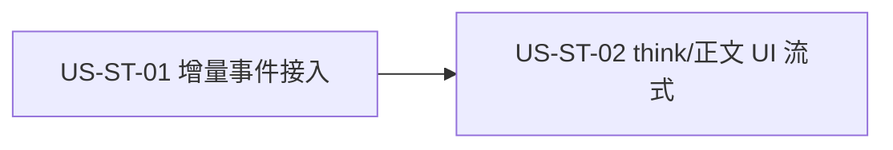

# 25 - 需求:桌面端右侧 Agent · think / 正文增量流式输出

> **文档类型**:本期需求 + 用户故事(**US-ST**,STream)  
> **状态**:**v0.5.7 已交付（2026-10-04）**  
> **基线**:桌面端 **v0.5.6+**(OpenCode 事件时间线、右侧 Agent 面板已落地)  
> **对齐**:GitHub Issue [#17](https://github.com/Pedro-MAFS/ftcs/issues/17);计划项建议 ID `agent-stream-think-reply`  
> **关联**:[08-产品架构决策-Electron-OpenCode.md](08-产品架构决策-Electron-OpenCode.md)

---

## 1. 一句话目标

右侧 Agent 的 **think** 与 **正文回复** 随 OpenCode **增量事件**逐步刷新,避免整段空白等待时像「卡死」;函数调用仍整段展示,且 **不改底层协议**。

---

## 2. 背景与动机

| 现象 | 痛点 |
|------|------|
| think / 正文按整块一次性出现 | 长任务等待时界面静止,像卡死 |
| 仅有整段函数调用块 | 可读性尚可,但缺少「还在输出」的感知 |
| 用户希望回到更早的流式体验 | 改善可读性与信任感 |

---

## 3. 已确认产品规则(马丰顺 2026-09-30)

| # | 规则 |
|---|------|
| **ST1** | **think 增量**:think 区域随 OpenCode 增量事件逐步刷新,非整段一次性出现。 |
| **ST2** | **正文增量**:Agent 正文回复同上。 |
| **ST3** | **函数调用整段**:工具/函数调用展示保持现网整段行为,本期不做增量流式。 |
| **ST4** | **不改底层协议**:不引入新的传输协议;在现有 OpenCode 事件 / 时间线衔接上恢复或接通增量路径。 |
| **ST5** | **版本**:纳入 **v0.5.7**(Milestone `v0.5.7`)。 |
| **ST6** | **整合、不删整段路径**:保留现网 think/正文的整段(chunked)处理;增量 delta 叠到同一时间线条目上渐进刷新。整段/结束事件仅作终态对齐兜底;仅有整段、无增量时行为与现网一致。函数调用仍整段(ST3)。 |

---

## 4. 范围与非范围

### 4.1 本期做

- think 增量渲染  
- 正文回复增量渲染  
- 与现有 OpenCode 事件 / 时间线衔接(复用现网事件形状,详设定稿)  
- 与现网整段路径整合(ST6):不删除 chunked 处理器

### 4.2 本期不做

| 项 | 说明 |
|----|------|
| 函数调用增量流式 | ST3 |
| 底层协议改造 | ST4 |
| 重做整个右侧 Agent UI 视觉 | 仅流式呈现 |
| 删除/替换现网整段 chunked 路径 | ST6:整合叠加,不删 |
| 非 Windows 专项适配 | 与现网一致即可 |

---

## 5. 用户故事拆分

| ID | 标题 | 优先级 | 依赖 | 说明 |
|----|------|--------|------|------|
| **US-ST-01** | 增量事件接入与时间线状态 | Must | — | 主进程/桥接层把 OpenCode think/正文增量接到现有时间线;函数调用路径不变 |
| **US-ST-02** | 右侧 think / 正文 UI 流式渲染 | Must | ST-01 | 面板随增量刷新;函数调用块仍整段 |

建议实现顺序:**ST-01 → ST-02**。

---

### US-ST-01　增量事件接入与时间线状态

**作为** 使用右侧 Agent 的业务员,**我想** 系统在模型输出过程中持续接收 think/正文增量,**以便** 界面有内容可刷新、而不必等整段结束。

| 项 | 内容 |
|----|------|
| 优先级 | Must |
| 依赖 | — |
| 状态 | **详设已确认待开发** |
| 详设 | [`docs/design/US-ST-01-增量事件接入与时间线状态.md`](design/US-ST-01-增量事件接入与时间线状态.md) |

**验收要点**

- 存在可观测的增量事件路径(或等价状态更新),覆盖 think 与正文;非整段 `done` 才首次出现全文。  
- 保留现网整段(chunked)路径;增量叠到同一时间线条目;整段/结束事件作终态对齐(ST6)。  
- 空正文的 start `updated` 仍须登记 part 类型(text / reasoning);不因此建卡、不覆盖已有正文。  
- 提前到达或类型未明时缓冲的 delta **必须回放到同一张卡**,不得在登记/终态时只删除缓冲。  
- 仅有整段、无增量时行为与现网一致。  
- 函数调用相关事件/展示路径与现网一致(整段)。  
- 不新增、不替换底层协议约定(ST4);详设写明复用的现有事件类型与字段。  
- 异常或中断时时间线状态可结束,不永久「转圈」。

**关键决策(详设锁定)**

1. **增量源**:只接 Legacy `message.part.delta`(`properties`: `sessionID`, `messageID`, `partID`, `field`, `delta`)
2. **终态源**:继续接 `message.part.updated`,整份 `part.text` 覆盖同 id 卡片(终态权威)
3. **合并**:一卡一 partID(`assistant-${partID}` / `reasoning-${partID}`);delta 追加;空 start `updated` 只登记类型;非空终态 `updated` 覆盖并在回放后清除 pending buffer(缓冲须先回放)
4. **不接**:全部 `session.next.*`、V2/Global 信封、`message.part.delta` 以外的猜字段
5. **工具**:仅 `updated`;忽略针对 tool part 的 delta(若有)

---

### US-ST-02　右侧 think / 正文 UI 流式渲染

**作为** 外贸业务员,**我想** 在右侧面板看到 think 与正文边出边显示,**以便** 确认 Agent 仍在工作并提前阅读内容。

| 项 | 内容 |
|----|------|
| 优先级 | Must |
| 依赖 | US-ST-01 |
| 状态 | **详设已确认待开发** |
| 详设 | [`docs/design/US-ST-02-右侧think正文UI流式渲染.md`](design/US-ST-02-右侧think正文UI流式渲染.md) |

**验收要点**

- think 区域随增量逐步增长/刷新,非整段闪现。  
- 正文回复同上。  
- 同一时间线条目上增量与整段路径整合展示,不出现双份 think/正文(ST6)。  
- 函数调用块仍整段出现(与现网一致)。  
- 长输出过程中用户能感知「还活着」(有持续文本变化或明确进行中态)。  
- 任务结束后最终文案与现网语义一致(无丢字、无明显乱序;允许详设定义合并规则)。

**关键决策(详设锁定)**

1. **数据源**:仅 ST-01 发出的 `timeline` 快照;渲染进程不订 SSE
2. **节流**:主进程对 **delta 触发的 flush** 做 ≤ **50ms** 合并(`scheduleFlush`);`updated` / error / removed / 任务结束 **立即 flush**
3. **流式中 reasoning**:该卡 `body` 正在增长时强制展开(或忽略 collapsed 预览),避免只看到 160 字 preview 像卡住;`updated` 终态后若超长可再折叠
4. **贴底**:保持现网 `pinToBottom`:用户未上滚时跟滚
5. **Markdown**:继续纯文本 `<pre>`(不改富渲染)
6. **进行中态**:不强制新 UI 控件;验收以文本持续变化为准

---

## 6. 验收清单(需求级)

- [ ] think 随增量刷新,非整段一次性出现。  
- [ ] 正文回复同上。  
- [ ] 现网整段路径保留并与增量整合,无双份内容(ST6)。  
- [ ] 空 start 登记类型;缓冲 delta 回放进同一张卡(不可只删缓冲)。  
- [ ] 函数调用展示仍为整段。  
- [ ] 等待过程中可感知 Agent 仍在输出。  
- [ ] 未引入协议层变更。  
- [ ] 中断 / 失败后面板状态可收敛。

---

## 7. 风险与开放问题

| # | 项 | 倾向 |
|---|-----|------|
| O1 | 现网是否曾支持流式后被关掉 | 详设对照 OpenCode 事件与右侧渲染代码确认「恢复」还是「新接通」 |
| O2 | 增量合并与 Markdown 半截渲染 | 详设规定:流式中可降级纯文本,结束再完整渲染;或逐 token 安全拼接 |
| O3 | 高性能长输出卡顿 | 节流/批量刷帧,详设定阈值 |
| ~~O4~~ | 增量 vs 整段:删路径还是整合 | **已决(2026-10-01)**:ST6 整合、不删整段 |

---

## 8. 修订记录

| 日期 | 说明 |
|------|------|
| 2026-10-01 | 初稿:ST1～ST5;US-ST-01～02;对齐 #17 与 v0.5.7 |
| 2026-10-01 | 补 ST6(整合不删整段);验收与清单同步;马丰顺确认进仓 |
| 2026-10-01 | US-ST-01/02 详设已确认待开发;添加详设文档链接与关键决策摘要 |
| 2026-10-03 | 验收补强:空 start 登记类型;缓冲须回放(对齐 #17 手测缺口) |

---

## 9. 下一步

1. ~~马丰顺确认~~ → 写入仓库 `docs/25-需求-Agent流式输出.md`,#17 回链(进行中)。  
2. ~~@FTCS 详细设计~~ → **已完成**:US-ST-01 与 US-ST-02 详设已落盘,包含 ST6 合并规则。  
3. 详设落盘后 @FTCS 开发 申请开工。  
4. 随后补 #9 / #6 的需求文档与 US 拆分。
