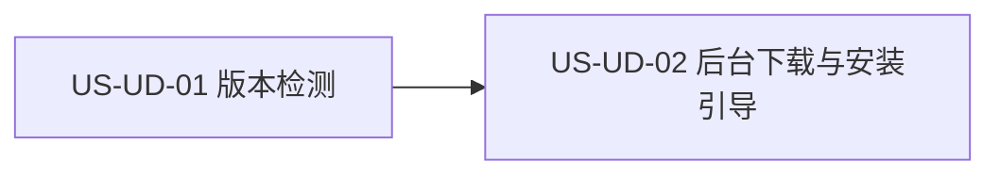

# 27 - 需求:后台检测与下载更新

> **文档类型**:本期需求 + 用户故事(**US-UD**,UpDate)  
> **状态**:**v0.5.7 需求待确认**  
> **基线**:桌面端 **v0.5.7**（现网「检查更新」提示版本并跳转下载页）  
> **对齐**:GitHub Issue [#6](https://github.com/Pedro-MAFS/ftcs/issues/6);计划项 `desktop-silent-update`;Milestone **v0.5.7**  
> **关联**:现网桌面端更新提示与官网安装包下载页

---

## 1. 一句话目标

Windows 桌面端能检测新版本并**立即后台下载**安装包，完成后明确提示用户选择「立即安装/重启」或「稍后」；不强制静默安装，不打断主流程。

---

## 2. 背景与动机

| 现象 | 痛点 |
|------|------|
| 新版本需用户自行打开官网下载安装包并重装 | 更新路径长，容易拖着不升 |
| 应用内「检查更新」只提示版本并跳转下载页 | 检测与拿到安装包是两段手工操作 |
| 下载若挡在前台或静默装完不打招呼 | 要么打断干活，要么用户失去确认权 |

马丰顺 2026-10-03 确认（项目经理范围 + 三点产品选择）：

- 检测：**启动自动检 + 保留手动「检查更新」+ 定时**（默认每 24 小时）。  
- 发现新版本：**立即后台下载**（不先问是否下载）。  
- 下载完成：主操作为 **「立即安装/重启」+「稍后」**。

---

## 3. 已确认产品规则

| # | 规则 |
|---|------|
| **UD1** | **检测时机**：启动时自动检查一次；保留现网手动「检查更新」；另有定时检查，**默认每 24 小时**。具体调度（进程内定时 / 系统任务、是否可配置）留给详设。 |
| **UD2** | **发现即下**：检测到高于当前版本的可用更新后，**立即开始后台下载**，不先弹「是否下载」。 |
| **UD3** | **完成后才问安装**：下载成功后给出**明确提示**；主操作只有 **「立即安装/重启」** 与 **「稍后」**。禁止在无用户确认时强制静默安装并替换当前进程。 |
| **UD4** | **不打断主流程**：后台下载不得阻塞探索、线索、开发信等主路径操作；进度须可感知，但不挡主界面（形态交详设）。 |
| **UD5** | **失败可恢复**：网络失败、下载中断或校验失败时，用户能重试，并看到简短错误说明（不是静默失败）。 |
| **UD6** | **同一条路径**：手动「检查更新」与启动/定时检测走同一套「检测 → 发现即后台下载 → 完成提示」。**不再以「仅跳转官网下载页」为主路径。** **官网安装包下载页/安装包必须继续可用**——应用内自动下载或提醒异常时，用户去官网下安装包升级仍可走通。详设只定「如何在失败场景露出官网入口（若露出）」，不得删掉官网升级路径。 |
| **UD7** | **版本与基线**：纳入 **v0.5.7**；需求 PR 基线 `dev-0.5.7`。不因此提前发版，也不关闭 #6。 |
| **UD8** | **平台**：仅 **Windows**。macOS 及其他非 Windows **本期不做**。 |

---

## 4. 范围与非范围

### 4.1 本期做（In Scope）

1. **版本检测**：启动自动检、手动「检查更新」、定时检（默认 24 小时）。  
2. **后台下载**：发现新版本即下载 Windows 安装包，不先征求下载同意。  
3. **完成引导**：下载完成后提示「立即安装/重启」或「稍后」。  
4. **失败与重试**：网络/下载失败有错误说明，且可再次检测或重试下载。  
5. **手动检查并入新路径**（UD6），不再以跳转官网下载页为主。  
6. **官网安装包兜底**（UD6）：官网下载页/安装包必须继续可用；应用内自动下载或提醒异常时，用户自行去官网升级仍可走通（硬约束，非详设可选项）。

### 4.2 本期不做（Out of Scope）

| 项 | 说明 |
|----|------|
| 强制静默安装且无用户确认 | UD3；下载可自动，安装必须用户点 |
| macOS / 其他非 Windows | UD8；当前产品为 Windows |
| 改官网下载页信息架构、发版流程、打 tag | 更新源如何挂到现有发布物由详设选，不在本需求改发版制度；**不删除**官网安装包升级路径（UD6） |
| 多频道灰度、强制最低版本、差分更新 | 未确认，不纳入 |
| 下载前弹窗询问是否下载 | 与 UD2 相反 |

---

## 5. 用户故事拆分

| ID | 标题 | 优先级 | 依赖 | 说明 |
|----|------|--------|------|------|
| **US-UD-01** | 版本检测（启动 / 手动 / 定时） | Must | — | 三条入口发现新版本 |
| **US-UD-02** | 后台下载与完成后安装/重启引导 | Must | US-UD-01 | 发现即下；完成后再选安装或稍后 |

建议实现顺序：**UD-01 → UD-02**（检测结果是下载的输入；可同迭代联调）。

---

### US-UD-01　版本检测（启动 / 手动 / 定时）

**作为** Windows 上的外贸业务员，**我想** 应用在启动、我手动点「检查更新」、以及大约每天一次时都能发现新版本，**以便** 不用自己记着去官网看。

| 项 | 内容 |
|----|------|
| 优先级 | Must |
| 依赖 | — |
| 状态 | **待详设** |

**验收要点**

- 启动后会自动检查是否有高于当前版本的更新（不要求用户先打开设置）。  
- 现网手动「检查更新」仍在，且走 UD6 同一路径：有更新则进入后台下载，而不是只打开官网下载页。  
- 官网安装包下载页/安装包仍可走通，不因本故事删除或阻断用户自行去官网升级（UD6）。  
- 应用保持运行时，按默认 **每 24 小时** 再检查一次（误差与是否跨重启补检由详设规定，需求只锁默认周期）。  
- 已是最新版时，手动检查有明确「已是最新」类结果；启动/定时检查**不**为此打断主流程（可不提示或仅轻量状态，详设定）。  
- 检查失败（无网、源不可用）有错误说明，且不把「检查失败」当成「已是最新」。  
- 非 Windows 不实现本故事（UD8）。

---

### US-UD-02　后台下载与完成后安装/重启引导

**作为** Windows 上的外贸业务员，**我想** 发现新版本后安装包在后台下好，再由我决定马上重启安装还是稍后，**以便** 不打断当前活，也不在我没同意时被换掉。

| 项 | 内容 |
|----|------|
| 优先级 | Must |
| 依赖 | US-UD-01 |
| 状态 | **待详设** |

**验收要点**

- 任一检测入口发现可用更新后，**立即**开始下载，不出现「是否开始下载」确认框（UD2）。  
- 下载进行中，探索 / 线索 / 开发信等主路径仍可操作；用户能感知「正在下载」（进度条、托盘或状态文案由详设选），且不遮挡主流程（UD4）。  
- 下载成功后有明确完成提示；主按钮为 **「立即安装/重启」** 与 **「稍后」**（UD3）。点「立即安装/重启」才进入安装并重启（或等价的退出后安装）；点「稍后」关闭本次强提示，**不**自动安装。  
- 不存在「下载完即静默覆盖安装、无确认」的路径。  
- 下载失败、中断或包不可用时，有简短错误说明，并提供重试（可再次检测或续/重下，续传与否由详设定）（UD5）。  
- 「稍后」之后，用户仍能再次唤起「立即安装/重启」（入口形态：托盘、设置或等价位置，**交详设给出默认方案**）；已下好的包在未被新版本替换前不应无故丢失到无法安装。  
- 手动检查与自动检查共用本下载与提示，不以跳转官网为主路径；应用内自动下载或提醒异常时，用户仍可去官网下安装包升级。详设可定失败场景是否/如何露出官网入口，但不得删掉官网升级路径（UD6）。

---

## 6. 验收清单（需求级）

- [ ] 启动自动检查新版本。  
- [ ] 手动「检查更新」仍可用，且与自动检查同一路径（发现即下，不再只跳转下载页）。  
- [ ] 官网安装包下载页/安装包仍可走通；应用内失败时用户可去官网升级（UD6 硬约束）。  
- [ ] 定时检查默认约每 24 小时一次。  
- [ ] 发现新版本后立即后台下载，下载前无「是否下载」确认。  
- [ ] 后台下载不阻断主流程，且进度或状态可感知。  
- [ ] 下载完成后提示含「立即安装/重启」与「稍后」；无用户确认不会静默安装。  
- [ ] 「稍后」后仍能再次发起安装（入口由详设落地）。  
- [ ] 网络或下载失败可重试，并有错误说明；检查失败不等于「已是最新」。  
- [ ] 仅 Windows；无 macOS / 其他平台交付。  
- [ ] 未扩大到强制最低版本、灰度频道、差分包或改发版制度。

---

## 7. 风险与开放问题

| # | 项 | 倾向 |
|---|-----|------|
| O1 | **更新源 / 频道**：`electron-updater`（或等价）对现有 GitHub Release / 官网安装包渠道，还是继续用现下载页背后的包地址 | **交详设**。需求只要求能发现「高于当前版本」的 Windows 安装包并下到本地 |
| O2 | **下载进度 UI**：应用内条、托盘、设置页状态，或组合 | **交详设**。需求只要求可感知且不挡主流程（UD4） |
| O3 | **「稍后」再唤起**：托盘菜单、设置里的「检查更新 / 安装已下载更新」，或其他 | **交详设**默认一个合理入口，须在验收时能再次点到「立即安装/重启」 |
| O4 | 定时的精确语义：从启动起 24h、墙钟、或距上次成功检查 24h；应用退出期间是否补检 | 详设默认「距上次检查约 24 小时，启动时若已过期则补检」即可，除非与 UD1 冲突 |
| O5 | 下载中再次检测到同一版本，或用户手动连点检查 | 详设避免重复并行下载；需求不另开故事 |
| O6 | 官网安装包升级路径 | **已决**：必须保留官网安装包下载页/安装包可走通（UD6）。主路径仍是检测→后台下载→提醒安装；应用内失败时用户去官网升级仍可走通。详设只定失败场景是否/如何露出官网入口，不得删掉该路径 |

---

## 8. 修订记录

| 日期 | 说明 |
|------|------|
| 2026-10-03 | 初稿：对齐 #6 与马丰顺确认的检测时机、发现即后台下载、完成后「立即安装/重启 + 稍后」；UD1～UD8；US-UD-01/02。需求 PR 基线 `dev-0.5.7`，待确认后合入 |
| 2026-10-03 | 官网安装包兜底升为硬约束（UD6/O6）：主路径仍为检测→后台下载→提醒；官网下安装包升级必须可走通，详设不得删除该路径 |

---

## 9. 下一步

1. 马丰顺确认本文后，再合入 `dev-0.5.7`（本 PR 先不合）。  
2. 合入后交接 @FTCS 详细设计：按 US-UD-01/02 写详设（含 O1～O3；O6 已决为硬约束，详设只定失败场景入口露出方式）。  
3. 详设确认后再交 @FTCS 开发实现；开工前仍按开发流程征得同意。  
4. **#6、#9、#17 在发版前不关闭**；本需求不触发打 tag / 发版。  
5. 手测通过后，再按文件把 `docs/27`（及后续详设）同步到 `main`。
