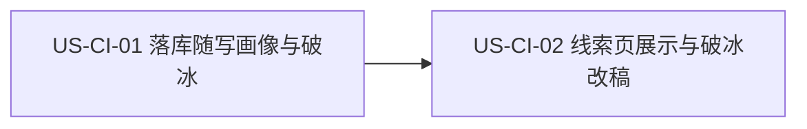

# 29 - 需求:目标公司深度画像

> **文档类型**:本期需求 + 用户故事(**US-CI**,Company Intelligence)  
> **状态**:**草稿 · 待合入 `dev-0.5.8`**  
> **基线**:桌面端 **v0.5.7+**（探索落库线索 + 线索页详情）  
> **对齐**:GitHub Issue [#3](https://github.com/Pedro-MAFS/ftcs/issues/3); Milestone **v0.5.8**  
> **关联**:支持计划 `lead-company-intelligence`；探索落库与线索页现网能力

---

## 1. 一句话目标

探索阶段每写出一条公司线索时，**随即**生成结构化企业画像与破冰话术并写入该线索；用户在线索页打开后能一眼看懂目标公司，并可改稿破冰语后保存——**不另加**「生成 / 刷新」操作。

---

## 2. 背景与动机

| 现象 | 痛点 |
|------|------|
| 拿到线索后仍要自行调研 | 难判断值不值得跟，重复检索耗时 |
| 希望打开线索即可着手联系 | 缺结构化画像与可改破冰话术 |
| 若另做「生成画像」按钮 | 增加操作；与「探索阶段顺带产出」目标不符 |

马丰顺 / 项目组 2026-10-04 确认（相对 Issue 初稿修订）：

- **生成时机**：探索阶段，**每条公司线索落库时随即写入**画像 + 破冰。  
- **不另加操作**：不提供独立「生成 / 刷新画像」入口。  
- **线索页**：展示画像；破冰语可编辑并保存。  
- **旧线索**：本版**不补**无画像旧数据；再探索落库才有。  
- **再落库**：同公司再次探索并落库时，**覆盖**画像与破冰（**含**用户已改的破冰语）。  
- **Out**：付费第三方工商数据库；代替用户发出开发信。

---

## 3. 已确认产品规则

| # | 规则 |
|---|------|
| **CI1** | **生成时机**：探索流水线中，**每条公司线索成功落库时**，随即生成并写入该线索的企业画像与破冰话术。 |
| **CI2** | **无独立生成/刷新**：线索页与探索页均**不**新增「生成画像」「刷新画像」等操作；画像产出依附探索落库。 |
| **CI3** | **画像结构**（结构化段落，本版全要）：①商业模式与体量；②主营产品与品牌；③目标市场与客户；④供应链与采购倾向；⑤行业地位与优势；⑥合作机会与跟进建议。 |
| **CI4** | **破冰话术**：落库时一并生成；线索页可编辑并**保存**到该线索。 |
| **CI5** | **线索页展示**：打开公司线索详情可见画像各段 + 破冰语；无画像时不强行补生成（见 CI7）。 |
| **CI6** | **再落库覆盖**：同公司再次经探索落库时，**覆盖**既有画像与破冰（含用户已改破冰）。 |
| **CI7** | **旧线索**：本版不对「无画像」历史线索做补生成；用户需**再探索**使该公司再次落库后才有画像。 |
| **CI8** | **失败可感知**：单条线索画像/破冰生成失败时，有明确错误或失败态提示；**不损坏**该线索其它已有字段。 |
| **CI9** | **数据源边界**：不对接付费第三方工商数据库；可用现有公开检索 / Agent / 已接入能力。不代发邮件。 |
| **CI10** | **版本**：纳入 **v0.5.8**；需求 PR 基线 **`dev-0.5.8`**。不因此关 #3；不合 `main`（发版时整支 `dev` 再合）。 |

---

## 4. 范围与非范围

### 4.1 本期做（In Scope）

1. 探索阶段公司线索落库路径上，随即写入 **六段结构化画像** + **破冰话术**。  
2. 线索页详情展示上述画像与破冰；破冰可编辑并保存。  
3. 再落库时覆盖画像与破冰（CI6）。  
4. 生成失败有提示，不损坏原线索其它数据（CI8）。

### 4.2 本期不做（Out of Scope）

| 项 | 说明 |
|----|------|
| 独立「生成 / 刷新」按钮或菜单 | CI2 |
| 为无画像旧线索打开时自动补生成 | CI7 |
| 付费第三方工商数据库对接 | CI9 |
| 代替用户发送开发信 / 邮件 | CI9；与开发信起草链路解耦 |
| 分段刷新（只刷某一段画像） | 未确认；本期整份随落库写入/覆盖 |
| 合入 `main` / 打 tag / 发版 | CI10 |

---

## 5. 用户故事拆分

| ID | 标题 | 优先级 | 依赖 | 说明 |
|----|------|--------|------|------|
| **US-CI-01** | 探索落库随写画像与破冰 | Must | 现网探索写线索 | 时机 + 字段写入 + 覆盖 + 失败 |
| **US-CI-02** | 线索页画像展示与破冰改稿 | Must | US-CI-01（有数据可看） | 展示 + 编辑保存；无独立生成 |

建议实现顺序：CI-01 → CI-02（可同 PR，但验收可分）。

---

### US-CI-01　探索落库随写画像与破冰

**作为** 外贸业务员，**我想** 在探索写出公司线索时系统就写好画像和破冰，**以便** 到线索页不用再点「生成」。

| 项 | 内容 |
|----|------|
| 优先级 | Must |
| 依赖 | 现网探索 → 公司线索落库路径 |
| 状态 | **待详设** |

**验收要点**

- 探索过程中，每条公司线索**成功落库**后，该线索带有六段画像（CI3）与破冰话术（CI1、CI4）。  
- 产品 UI **无**「生成画像 / 刷新画像」入口（CI2）。  
- 同公司再次落库时，画像与破冰被**覆盖**（含曾手改的破冰）（CI6）。  
- 本版不对历史无画像线索补写（CI7）。  
- 单条生成失败时有明确提示，线索其它字段不被破坏（CI8）。  
- 不依赖付费工商库；不代发信（CI9）。

**本故事不做**：线索页 UI（归 US-CI-02）；旧线索补生成；独立刷新。

---

### US-CI-02　线索页画像展示与破冰改稿

**作为** 外贸业务员，**我想** 在线索页打开公司线索时看到结构化画像并能改破冰语保存，**以便** 判断是否跟进并直接改稿联系话术。

| 项 | 内容 |
|----|------|
| 优先级 | Must |
| 依赖 | US-CI-01 写入的字段；现网线索详情 |
| 状态 | **待详设** |

**验收要点**

- 打开有画像的公司线索，可见 CI3 六段结构化内容与破冰语（CI5）。  
- 破冰语可编辑并保存；刷新/重进后仍为保存内容（直至再次落库覆盖）（CI4、CI6）。  
- 无画像旧线索：可正常打开线索其它信息；**不**自动补生成；无强制报错阻断（CI7）。  
- 无「生成 / 刷新」画像操作（CI2）。  
- 不提供代发邮件入口作为本需求一部分（CI9）。

**本故事不做**：探索落库写入逻辑（归 US-CI-01）；付费库；代发信。

---

## 6. 验收清单（需求级）

- [ ] 探索落库的新公司线索带六段画像 + 破冰。  
- [ ] 无独立生成/刷新画像操作。  
- [ ] 线索页可查看画像；破冰可改可存。  
- [ ] 再落库覆盖画像与破冰（含手改破冰）。  
- [ ] 旧无画像线索不补生成，再探索才有。  
- [ ] 生成失败有提示，不损坏原线索其它数据。  
- [ ] 未接付费工商库、不代发信。  
- [ ] 变更落在 `dev-0.5.8`；#3 不因本文关闭。

---

## 7. 风险与开放问题

| # | 项 | 倾向 |
|---|-----|------|
| O1 | 落库与画像生成是否同步阻塞写库，或先落库再异步填画像 | **交详设**；须满足「随即写入」与 CI8（失败不损坏其它字段） |
| O2 | 画像/破冰在线索数据模型上的字段形态（嵌套对象 vs 多字段） | **交详设**；需求只锁六段语义 + 破冰可存 |
| O3 | 生成所用模型/检索通道与现网探索 Agent 是否共用 | **交详设**；不得引入付费工商库 |
| O4 | 无画像时线索详情空态文案 | **交详设**轻量即可；不得引导「点生成」（无此操作） |

---

## 8. 修订记录

| 日期 | 说明 |
|------|------|
| 2026-10-04 | 初稿：对齐 #3；确认探索落库随写、无线索侧生成/刷新、六段画像、破冰可改、旧线索不补、再落库覆盖手改破冰；US-CI-01/02；基线 `dev-0.5.8` |

---

## 9. 下一步

1. 马丰顺确认本文后，再合入 **`dev-0.5.8`**（本 PR 先不合；Related #3，不 Closes）。  
2. 合入后交接 @FTCS 详细设计：按 US-CI-01 / US-CI-02 写详设（含 O1～O4）。  
3. 详设确认后再交 @FTCS 开发；开工前按开发流程征得同意。  
4. **#3 发版前不关闭**；本需求不触发打 tag / 发版；**不**同步 `main`（发版整支合入）。  
5. #21 仍等未决，不在本文范围。
