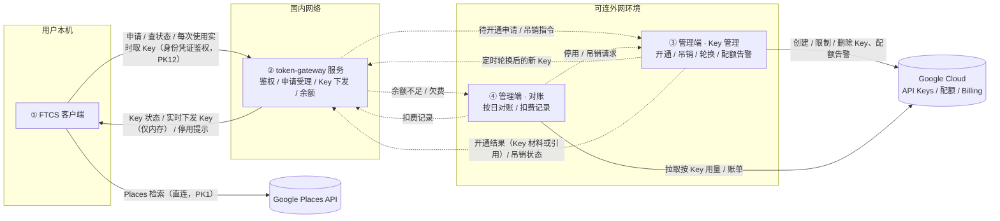
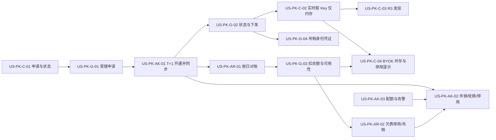

# 30 - 需求:Places 官方通道按用户下发 API Key

> **文档类型**:本期需求 + 用户故事（**US-PK**, Places Key；**按系统拆分**）  
> **状态**:**草稿 · 待合入 `dev-0.5.8`**  
> **基线**:桌面端 **v0.5.7+**（R3 探索 Places 发现 + **US-E-07** BYOK）  
> **对齐**:GitHub Issue [#21](https://github.com/Pedro-MAFS/ftcs/issues/21); Milestone **v0.5.8**  
> **关联**:原 US-E-10「Places 官方 token 网关代调」产品方向已废弃；对照 **US-E-07** BYOK 并存  
> **涉及系统**:① FTCS 客户端 ② token-gateway 服务 ③ token-gateway 管理端 · Key 管理 ④ token-gateway 管理端 · 对账（见 §4）

---

## 1. 一句话目标

为不愿自备 Google Key 的用户提供**官方 Places 通道**：在产品内申请后 **T+1** 获得一把**专属** Places API Key，由**客户端直连** Google 跑 R3 发现；官方按日与 Google 对账后扣用户官方余额——**不做**服务端代调 Places。需求按 **四个系统** 分别写清职责、范围与验收。

---

## 2. 背景与动机

| 现象 | 痛点 |
|------|------|
| 现网 R3 依赖 US-E-07 BYOK | 多数用户不会开通 Google Cloud / Places，上手成本高 |
| 曾规划「官方网关代调 Places」 | 网关仅部署国内；Google 需出境；代调带来盗刷、计费与运维复杂度 |
| 用户仍希望「点申请就能用」 | 需要零自备 Key 的官方通道，且调用可归集到个人并计费 |
| Key 开通、吊销、对账都要直接调 Google | 国内部署的 token-gateway 服务访问不了 Google，这部分须放到**可访问外网**的管理端 |

马丰顺 2026-10-09 合规与方案讨论后锁定（相对 Issue 初稿「网关代调」的修订）：

- **不做**官方服务端代调 / 中转 Google Places（不经国内网关转发 Places 请求）。  
- **官方通道**：每名用户一把 Google Places API Key；用户在产品内申请 → **T+1** 开通并下发到客户端。  
- **计费**：按日与 Google 账单/用量对账后，扣用户官方余额。  
- **并存 BYOK**：US-E-07 自备 Key 路径保留。  
- **数据用法**：Places **只作发现入口**；线索中的公司名 / 官网 / 电话 / 地址等以 **打开官网后抽取 / 核实** 的结果落库，**不把 Places 返回的商家字段原样长期存库**。  
- **Key 约束**：仅开通 Places 相关 API；项目级配额与预算告警；异常可吊销单用户 Key。  
- **系统划分**（同日补充）：需求涉及客户端、token-gateway 服务、token-gateway 管理端（Key 管理 / 对账）多个系统，需求文档**按系统分别写**；凡需直接调用 Google 的功能（开通、吊销、配额、对账）放管理端，管理端部署在**可连外网**的环境；token-gateway 服务部署国内，**不**调 Google。  
- **Out**：换非 Google 数据源、自建 POI 库（已评估，本期不做）。

---

## 3. 已确认产品规则

| # | 规则 |
|---|------|
| **PK1** | **无服务端代调**：官方服务与国内网关**不**转发、不中转 Google Places 请求；Places 调用由客户端直连 Google。管理端调 Google 仅限 Key 管理与账单/用量查询，**不**承载用户的 Places 检索请求。 |
| **PK2** | **一人一 Key**：官方通道为每名用户绑定一把专用 Google Places API Key（与他人不共用）。 |
| **PK3** | **申请与 T+1 下发**：用户在产品内发起申请；申请受理后 **T+1**（下一自然日）内开通，并将 Key 下发到该用户客户端可用状态。状态至少区分：申请中 / 已开通 / 失败（或等价文案）。 |
| **PK4** | **仅 Places**：下发的 Key 仅启用 Places 相关 API（不开放无关 Google Maps SKU）。 |
| **PK5** | **配额与防盗刷**：Google Cloud **项目级**配额与预算告警；发现滥用、盗刷或异常用量时，可**吊销**该用户官方 Key，吊销后不可继续用官方 Key 调 Places。 |
| **PK6** | **按日对账扣费**：按日拉取 / 对齐 Google 用量或账单，归集到用户后扣其**官方余额**；欠费或官方 Key 已吊销时，官方通道不可用（须可感知提示）。SKU 明细与加价规则交详设（见 O1）。 |
| **PK7** | **并存 BYOK**：US-E-07 用户自备 Key 路径保留且行为与现网一致；官方下发 Key 与 BYOK **可同时存在于同一账号**；二者并存时的选用优先级交详设（见 O4）。 |
| **PK8** | **Places 只发现**：R3 用 Places 产出候选后，须经**打开 / 核实公司官网**再抽取线索字段；落库的公司名、官网、电话、地址等以官网核实结果为准，**不得**把 Places 返回的商家详情字段原样作为长期线索资产存储。 |
| **PK9** | **网络前提**：客户端须能访问 Google Places；官方通道不解决「本机无法访问 Google」的连通问题（与 BYOK 相同前提）。 |
| **PK10** | **版本与流程**：纳入 **v0.5.8**；需求 PR 基线 **`dev-0.5.8`**；PR 正文仅 **Related #21**（不 Closes）；发版前 **#21 不关闭**；不合 `main`（发版时整支 `dev` 再合）。旧详设「US-E-10 网关代调」按本口径作废或重写，不在本文实现范围内直接改代码。 |
| **PK11** | **按系统划分职责**：凡需直接调用 Google 的能力（Key 开通 / 吊销 / 轮换 / 配额告警、账单与用量对账）只放在 **token-gateway 管理端**（部署于可连外网环境）；**token-gateway 服务**部署国内、**不**调用 Google，只负责面向客户端的鉴权、Key 状态与下发、余额扣减；**客户端**只与 token-gateway 服务和 Google Places（检索）通信，不直连管理端。 |
| **PK12** | **官方 Key 不落盘、实时获取、可轮换**（马丰顺 2026-10-10）：客户端**不**在本机持久化保存官方下发的 Places Key；每次使用时实时向 token-gateway 服务获取，Key **仅在内存**中使用、用完即弃（内存缓存时长见 O12）。官方可**定时轮换**用户 Key 以防盗刷（周期见 O13）；轮换后旧 Key 被 Google 拒绝时，客户端重新取一次 Key 再试，**仅重试一次**。客户端本地持有的、用于向 token-gateway 鉴权的**身份凭证**可被**单独吊销**——盗刷风险由此从 Key 转移到该凭证，吊销凭证即切断取 Key。取 Key 失败须**明确提示**，**不**自动回退 BYOK，**不**回到网关代调 Places（PK1）。取 Key 限频见 O14。 |

---

## 4. 系统划分与部署边界

### 4.1 系统一览

| # | 系统 | 部署网络 | 是否调 Google | 主要职责 | 本文故事前缀 |
|---|------|----------|---------------|----------|--------------|
| ① | **FTCS 客户端**（`desktop/`） | 用户本机（须能访问 Google，PK9） | 是：仅 **Places 检索**（直连） | 申请官方 Key、展示状态、每次使用时实时获取 Key（仅内存、不落盘，PK12）、用于 R3 发现、与 BYOK 并存、Places 只发现 | **US-PK-C-xx** |
| ② | **token-gateway 服务** | **国内** | **否** | 以官方账号 / 客户端身份凭证鉴权；受理申请；向客户端暴露 Key 状态并**实时下发** Key；支持吊销客户端身份凭证；扣减官方余额、对客户端暴露可用性 | **US-PK-G-xx** |
| ③ | **token-gateway 管理端 · Key 管理** | **可连外网**环境 | 是：API Keys / 项目配额与预算告警 | 每人一 Key 开通（T+1）、吊销、**定时轮换** / 停用、配额与告警处理；把结果同步给 token-gateway 服务 | **US-PK-AK-xx** |
| ④ | **token-gateway 管理端 · 对账** | 同 ③（可连外网） | 是：Billing / 用量数据 | 按日按 Key / 用户与 Google 对账，生成扣费记录并推给 token-gateway 服务扣余额；欠费 / 余额不足触发停用 / 吊销 | **US-PK-AR-xx** |

> token-gateway（服务与管理端）的**代码仓库与归属**本文不预设（可能不在 `ftcs` 仓内），见 O8。

### 4.2 数据流

说明：虚线为 token-gateway 服务与管理端之间的接口，**推 / 拉方式、鉴权方式、Key 材料存放位置**均为开放问题（O7、O9、O10），交详设定；需求只锁定「国内服务不调 Google、管理端负责所有 Google 侧操作」。客户端侧锁定：官方 Key 每次使用实时取、仅内存、不落盘；客户端只持久持有自身身份凭证（PK12）。

### 4.3 跨系统总流程（申请 → 使用 → 对账）

1. 客户端提交申请 → token-gateway 服务记录为「申请中」。  
2. 管理端 · Key 管理取得待开通申请，**T+1** 内在 Google 侧创建仅 Places 的专属 Key，结果同步给服务。  
3. 服务将状态置为「已开通 / 失败」；客户端拉取状态；**不**保存 Key。  
4. 每次跑 R3 前，客户端凭身份凭证实时向服务取 Key（仅内存、用完即弃），**直连** Google 跑 Places 发现；线索字段从官网抽取。管理端可定时轮换 Key，旧 Key 被 Google 拒绝时客户端重取一次再试（PK12）。  
5. 管理端 · 对账每日按 Key 拉 Google 用量 / 账单，生成扣费记录推给服务扣官方余额。  
6. 余额不足 / 欠费 / 异常 → 服务置官方通道不可用；必要时管理端吊销 Google 侧 Key；客户端明确提示（不自动回退 BYOK，用户可自行切换）；疑似盗刷时可单独吊销该用户客户端身份凭证（PK12）。

---

## 5. 范围与非范围（总体）

### 5.1 本期做（In Scope）

1. 客户端：官方 Key 申请入口、状态展示、实时获取 Key 且仅内存使用（不落盘）、用于 R3 发现、与 BYOK 并存及文案区分（§6）。  
2. token-gateway 服务：官方账号鉴权、申请受理、Key 状态查询与实时下发、客户端身份凭证吊销、余额扣减与可用性判定（§7）。  
3. 管理端 · Key 管理：一人一 Key、仅 Places、T+1 开通、吊销 / 定时轮换 / 停用、项目级配额与告警（§8）。  
4. 管理端 · 对账：按日按 Key / 用户与 Google 对账、生成扣费记录、欠费触发停用 / 吊销（§9）。  
5. 明确**不做**服务端代调（PK1），明确 Places 只发现（PK8）。

### 5.2 本期不做（Out of Scope）

| 项 | 说明 |
|----|------|
| 服务端 / 国内网关 / 管理端代调或中转 Google Places 检索 | PK1 |
| token-gateway 服务直接调用 Google | PK11 |
| 换非 Google 地图 / POI 数据源 | 已评估；本期不做 |
| Overture 等自建 POI 库 | 成本高；本期不做 |
| 删除或削弱 BYOK | PK7；US-E-07 保留 |
| 解决客户端无法访问 Google 的网络问题 | PK9 |
| 把 Places 商家详情字段原样长期写入线索库 | PK8 |
| BYOK 路径计费（费用由用户自担 Google 账单） | PK6、PK7 |
| 客户端持久化（落盘）保存官方 Key | PK12 |
| 取 Key 失败时自动回退 BYOK 或改走网关代调 | PK12、PK1 |
| 合入 `main` / 打 tag / 发版 / 关闭 #21 | PK10 |

---

## 6. 系统 ①：FTCS 客户端（`desktop/`）

### 6.1 In / Out

| In | Out |
|----|-----|
| 官方 Key 申请入口与状态展示 | Key 开通 / 吊销 / 对账逻辑（归管理端） |
| 每次使用时从 token-gateway 服务实时获取官方 Key，仅内存使用 | 本机持久化（落盘）保存官方 Key（PK12） |
| 持有并使用本机身份凭证向服务鉴权；凭证被吊销时可感知 | 直连管理端或直连 Google Cloud 管理接口 |
| 取 Key 失败明确提示 | 取 Key 失败自动回退 BYOK 或改走代调 |
| 用官方 Key 直连 Google 跑 R3 发现 | 经任何服务端转发 Places 检索 |
| 与 BYOK 并存、Preflight / 设置文案区分 | 改变 BYOK 现网行为 |
| Places 只发现、线索字段来自官网 | 长期存 Places 商家详情 |

### 6.2 故事一览

| ID | 标题 | 优先级 | 依赖 |
|----|------|--------|------|
| **US-PK-C-01** | 申请官方 Places Key 与状态展示 | Must | US-PK-G-01；现网官方账号登录 |
| **US-PK-C-02** | 实时获取官方 Key、仅内存使用 | Must | US-PK-G-02 |
| **US-PK-C-03** | 使用官方 Key 跑 R3 发现（只发现） | Must | US-PK-C-02；现网 R3 / Places MCP |
| **US-PK-C-04** | 与 BYOK 并存及停用提示 | Must | US-PK-C-02；US-E-07；US-PK-G-03 |

### US-PK-C-01　申请官方 Places Key 与状态展示

**作为** 外贸业务员，**我想** 在产品里申请官方 Places Key 并随时看到进度，**以便** 不用自己开通 Google Cloud 也能用探索发现。

**验收要点**

- 产品内有明确申请入口（设置或 Preflight 引导处，具体位置交详设）；以当前官方账号身份提交到 token-gateway 服务（PK3）。  
- 提交后显示「申请中」（或等价）；可见 T+1 预期说明（PK3）。  
- 状态至少区分：未申请 / 申请中 / 已开通 / 失败 / 已停用（欠费或吊销）；失败与停用有可理解原因文案，不静默（PK3、PK5、PK6）。  
- 未登录官方账号时引导登录，不提交申请。  
- **不**出现「官方代调 Places」的文案承诺（PK1）。

### US-PK-C-02　实时获取官方 Key、仅内存使用

**作为** 已开通的用户，**我想** 客户端在每次需要时自动从官方取得我的 Key、且不在本机留存，**以便** 不用手动粘贴，Key 被定时更换也不影响使用，本机也不留可被盗用的 Key。

**验收要点**

- 状态为「已开通」时，客户端在**每次使用**（如发起一次 R3 Places 发现）时凭本机身份凭证向 token-gateway 服务实时获取 Key，无需用户手工输入（PK3、PK12）。  
- 官方 Key **不落盘**：不写入配置文件、保险库、数据库、缓存文件、日志、界面或导出文件；仅在内存中使用，用完即弃；是否允许短时内存缓存及时长待确认（O12）。  
- 轮换后旧 Key 被 Google 拒绝（如鉴权 / Key 无效类错误）时，客户端重新取一次 Key 再试，**仅重试一次**；仍失败则按取 Key 失败处理（PK12）。  
- 取 Key 失败（网络、服务不可用、凭证被吊销、已停用、限频等）时**明确提示**原因，**不**自动回退 BYOK，**不**改走任何服务端代调（PK1、PK12）。  
- 本机身份凭证被吊销后，客户端提示需重新登录 / 重新授权，不静默失败（PK12）。  
- 官方 Key 与 BYOK 互不覆盖；BYOK 仍按 US-E-07 保存（PK7）。

### US-PK-C-03　使用官方 Key 跑 R3 发现（只发现）

**作为** 已开通官方通道的业务员，**我想** 用下发的 Key 在客户端直连 Google 跑探索发现，**以便** 零自备 Key 完成 Places 候选并落到经官网核实的线索。

**验收要点**

- 官方通道可用时，用户**无需**配置自备 `GOOGLE_PLACES_API_KEY` 即可走 R3 Places 发现（PK3、PK9）。  
- Places 请求由**客户端直连** Google，不经任何官方服务转发（PK1）。  
- 发现流程：Places 候选 → 打开 / 核实公司官网 → 线索字段以官网核实结果落库；**不**把 Places 商家详情原样长期写入线索（PK8）。  
- 本机无法访问 Google 时，失败可感知；不伪装为「官方已代调成功」（PK9）。  
- Preflight / 设置能表明当前使用的是官方下发 Key。  
- 每次发现使用的官方 Key 来自 US-PK-C-02 的实时获取，不读取本地持久化的官方 Key（PK12）。

### US-PK-C-04　与 BYOK 并存及停用提示

**作为** 可能同时拥有官方 Key 与自备 Key 的用户，**我想** 两条路径都能用且规则清楚，**以便** 按自己情况选择或切换。

**验收要点**

- 未申请或未开通官方通道时，BYOK 行为与现网 **US-E-07** 一致（PK7）。  
- 官方通道开通后 BYOK **不被删除**；用户仍可配置 / 使用自备 Key（PK7）。  
- 两把 Key 同时可用时有明确选用规则或切换入口；优先级交详设（O4），但不得「静默随机选用」，用户能识别当前所用 Key。  
- 官方欠费或吊销时，客户端有明确提示；若 BYOK 有效，用户可**手动**切换为 BYOK；取 Key 失败时**不**自动回退 BYOK（PK6、PK7、PK12）。  
- 设置 / Preflight 文案区分「官方下发 Key」与「自备 Key」。

---

## 7. 系统 ②：token-gateway 服务（国内部署，不调 Google）

### 7.1 In / Out

| In | Out |
|----|-----|
| 以用户官方账号 / 客户端身份凭证鉴权客户端请求；凭证可单独吊销 | 调用任何 Google API（PK11） |
| 受理申请、维护申请 / Key 状态 | 在 Google 侧创建 / 吊销 Key（归 ③） |
| 每次请求时向客户端实时下发该用户的当前有效官方 Key、暴露状态 | 转发 Places 检索（PK1） |
| 接收对账扣费记录、扣官方余额、判定官方通道可用性 | 生成对账结果（归 ④） |
| 与管理端交换申请、开通结果、吊销、扣费数据 | — |

### 7.2 故事一览

| ID | 标题 | 优先级 | 依赖 |
|----|------|--------|------|
| **US-PK-G-01** | 受理官方 Key 申请 | Must | 现网官方账号能力 |
| **US-PK-G-02** | 查询状态与实时取 Key | Must | US-PK-G-01；US-PK-AK-01 |
| **US-PK-G-03** | 扣减官方余额与通道可用性 | Must | US-PK-AR-01 |
| **US-PK-G-04** | 吊销客户端身份凭证 | Must | US-PK-G-02 |

### US-PK-G-01　受理官方 Key 申请

**作为** 官方服务，**我想** 接收已登录用户的申请并记录状态，**以便** 管理端据此开通。

**验收要点**

- 仅接受官方账号鉴权通过的请求；同一用户重复申请不产生第二把 Key（PK2）。  
- 申请落为「申请中」，带受理时间（作为 T+1 起算依据，时区交详设 O2）。  
- 待开通申请可被管理端 · Key 管理获取（推 / 拉方式交详设 O7）。  
- 本服务不调用 Google（PK11）。

### US-PK-G-02　查询状态与实时取 Key

**作为** 客户端，**我想** 查询我的官方 Key 状态，并在每次使用时实时取得当前有效 Key，**以便** 跑 R3 发现。

**验收要点**

- 客户端可查到本人状态：未申请 / 申请中 / 已开通 / 失败 / 已停用，及失败 / 停用原因（PK3）。  
- 仅「已开通」且未停用时，向**本人**下发其专属 Key；不得返回他人 Key（PK2）。  
- 提供**取 Key 接口**：每次调用实时返回本人**当前有效** Key（轮换后即返回新 Key），供客户端仅内存使用（PK12）。  
- 管理端回传的开通结果、吊销、轮换能在服务侧生效，客户端下次查询 / 取 Key 即可见（PK5、PK12）。  
- 取 Key 失败时返回可区分的原因（未开通 / 已停用 / 凭证已吊销 / 限频 / 服务异常），供客户端明确提示；取 Key 限频策略待确认（O14）。  
- Key 传输与存放满足基本保密（传输加密、不落日志明文）；Key 材料存放在服务还是管理端交详设（O9）。

### US-PK-G-03　扣减官方余额与通道可用性

**作为** 官方服务，**我想** 按对账结果扣用户官方余额并判定通道可用性，**以便** 欠费用户及时停用。

**验收要点**

- 接收管理端 · 对账产出的扣费记录并扣减对应用户官方余额；同一记录不重复扣（幂等）（PK6）。  
- 余额不足 / 欠费时，将该用户官方通道置为「已停用」并对客户端可见；同时通知管理端（触发停用 / 吊销规则见 US-PK-AR-02）（PK6）。  
- 扣费记录可追溯到用户、Key、日期与金额（PK6）。

### US-PK-G-04　吊销客户端身份凭证

**作为** 运营 / 系统，**我想** 单独吊销某用户本机持有的身份凭证，**以便** 凭证被盗时立刻切断取 Key，而不必等 Key 轮换。

**验收要点**

- 官方 Key 不落盘后，盗刷风险转移到客户端本地的身份凭证；该凭证须可**单独吊销**（按用户 / 设备粒度交详设），不影响其他用户（PK12）。  
- 凭证吊销后，持该凭证的取 Key 请求立即被拒并返回「凭证已吊销」；用户重新登录 / 授权后可获新凭证（PK12）。  
- 吊销可与 Key 轮换（US-PK-AK-02）组合使用：吊销凭证 + 轮换 Key 后，已泄露的旧 Key 与旧凭证均失效。  
- 吊销原因与时间可记录、可追溯。

---

## 8. 系统 ③：token-gateway 管理端 · Key 管理（可连外网）

### 8.1 In / Out

| In | Out |
|----|-----|
| 在 Google 侧为每名用户创建仅 Places 的专属 Key（T+1） | 承载用户 Places 检索（PK1） |
| 吊销、**定时轮换**、停用单用户 Key | 面向客户端的接口（客户端只连 ②） |
| 项目级配额与预算告警配置及处理 | 对账扣费（归 ④） |
| 把开通 / 吊销 / 轮换结果同步到 token-gateway 服务 | — |
| 运营人员操作界面或等价工具 | — |

### 8.2 故事一览

| ID | 标题 | 优先级 | 依赖 |
|----|------|--------|------|
| **US-PK-AK-01** | T+1 开通一人一 Key 并同步 | Must | US-PK-G-01 |
| **US-PK-AK-02** | 吊销 / 定时轮换 / 停用单用户 Key | Must | US-PK-AK-01 |
| **US-PK-AK-03** | 项目级配额与预算告警 | Must | — |

### US-PK-AK-01　T+1 开通一人一 Key 并同步

**作为** 运营 / 系统，**我想** 把待开通申请在 T+1 内变成 Google 侧可用的专属 Key，**以便** 用户次日可用。

**验收要点**

- 能取得 token-gateway 服务的待开通申请（O7）。  
- 为每名用户创建一把专属 Key，API 限制**仅 Places**（PK2、PK4）。  
- 受理后 **T+1** 内完成开通，并把结果（成功 / 失败 + 原因）同步回服务（PK3）；全自动或首期半自动交详设（O2），但状态必须回传。  
- 用户与 Key 的绑定关系可查、可追溯（为对账归集服务，PK6）。

### US-PK-AK-02　吊销 / 定时轮换 / 停用单用户 Key

**作为** 运营，**我想** 对异常或欠费用户单独处置其 Key，**以便** 止损且不影响他人。

**验收要点**

- 可吊销（删除或禁用）单用户 Key；吊销后该 Key 在 Google 侧不可再调 Places（PK5）。  
- 可轮换单用户 Key（新 Key 下发、旧 Key 失效），结果同步到服务（PK5）。  
- 支持按周期**定时轮换**（防盗刷，周期待确认 O13），也支持手工即时轮换；轮换后服务取 Key 接口即返回新 Key，客户端无需用户操作（PK12）。  
- 新旧 Key 切换的过渡策略（旧 Key 立即失效或短暂并存）交详设；客户端侧按「旧 Key 被拒重取一次」兜底（PK12）。  
- 处置原因（盗刷 / 欠费 / 用户注销 / 手工）可记录；结果同步到服务，客户端可感知。  
- 接收对账侧的停用 / 吊销请求并执行（US-PK-AR-02）。

### US-PK-AK-03　项目级配额与预算告警

**作为** 运营，**我想** 官方 Google 项目有配额上限和预算告警，**以便** 被盗刷时损失可控。

**验收要点**

- 官方项目配置 Places 项目级配额与预算告警（PK5）。  
- 告警触发时运营能收到并可定位到异常 Key（结合按 Key 用量），据此执行 US-PK-AK-02。  
- 告警渠道与阈值交详设。

---

## 9. 系统 ④：token-gateway 管理端 · 对账（可连外网）

### 9.1 In / Out

| In | Out |
|----|-----|
| 每日拉取 Google 按 Key 用量 / 账单 | 直接修改用户余额（扣减在 ② 执行） |
| 按 Key → 用户归集，生成扣费记录并推给服务 | BYOK 用量计费 |
| 欠费 / 余额不足触发停用或吊销 | 实时计费（本期按日） |
| 对账差异可查 | — |

### 9.2 故事一览

| ID | 标题 | 优先级 | 依赖 |
|----|------|--------|------|
| **US-PK-AR-01** | 按日对账并生成扣费记录 | Must | US-PK-AK-01 |
| **US-PK-AR-02** | 欠费 / 余额不足触发停用 / 吊销 | Must | US-PK-AR-01；US-PK-G-03；US-PK-AK-02 |

### US-PK-AR-01　按日对账并生成扣费记录

**作为** 运营 / 系统，**我想** 每日把 Google 实际用量归集到用户并生成扣费记录，**以便** 官方成本可回收、账单可解释。

**验收要点**

- 每日按 Key 拉取 Google 用量 / 账单数据，并按用户–Key 绑定归集（PK2、PK6）。  
- 生成扣费记录（用户、Key、日期、用量、金额），推送给 token-gateway 服务扣减（PK6）；SKU 映射、加价、汇率交详设（O1）。  
- 重跑同一天不重复扣费（幂等）；Google 数据延迟时的补账规则交详设。  
- 对账结果与差异可查询（运营侧）。

### US-PK-AR-02　欠费 / 余额不足触发停用 / 吊销

**作为** 运营 / 系统，**我想** 欠费用户的官方通道被及时停用，**以便** 不继续产生无法回收的费用。

**验收要点**

- 收到服务的余额不足 / 欠费通知，或对账后发现欠费时，触发停用；是否进一步在 Google 侧吊销 / 禁用 Key 及宽限期交详设（PK5、PK6）。  
- 停用 / 吊销结果同步到服务，客户端可见「已停用」与原因（PK6）。  
- 充值或恢复后的重新启用规则交详设。

---

## 10. 故事总览与实现顺序

| 系统 | 故事 |
|------|------|
| ① 客户端 | US-PK-C-01～04 |
| ② token-gateway 服务 | US-PK-G-01～04 |
| ③ 管理端 · Key 管理 | US-PK-AK-01～03 |
| ④ 管理端 · 对账 | US-PK-AR-01～02 |

建议顺序：服务与管理端之间接口先定（O7、O9、O10）→ G-01 / AK-01 / G-02（开通闭环）→ C-01～03（客户端可用）→ AR-01 / G-03 / AR-02 / AK-02～03 / G-04（计费与止损）→ C-04。各系统可分别验收。

> 旧编号对照（初稿 → 本版）：US-PK-01 → C-01 + G-01 + AK-01 + G-02 + C-02；US-PK-02 → C-03；US-PK-03 → AR-01 + G-03 + AR-02 + AK-02/03；US-PK-04 → C-04。

---

## 11. 验收清单（需求级）

- [ ] 用户可在客户端申请官方 Places Key，T+1 内开通；开通后每次使用实时向服务取 Key。（C-01、G-01、AK-01、G-02、C-02）  
- [ ] 客户端**不落盘**官方 Key（配置、保险库、数据库、日志、导出均无），仅内存使用、用完即弃。（C-02、PK12）  
- [ ] Key 轮换后旧 Key 被 Google 拒绝时，客户端重取一次再试，仅一次；取 Key 失败明确提示，不自动回退 BYOK、不走代调。（C-02、G-02、AK-02、PK12）  
- [ ] 客户端身份凭证可单独吊销，吊销后取 Key 立即被拒且客户端可感知。（G-04、PK12）  
- [ ] 一人一 Key；Key 仅 Places；可吊销 / 定时轮换 / 停用单用户 Key。（AK-01、AK-02）  
- [ ] 官方通道用户无需自备 Key 即可跑 R3 Places 发现（客户端直连 Google）。（C-03）  
- [ ] **无**服务端 / 网关 / 管理端代调 Places；token-gateway 服务不调用 Google。（PK1、PK11）  
- [ ] Places 只作发现；线索字段来自官网核实，不长期存 Places 商家详情原文。（C-03）  
- [ ] 按日按 Key / 用户对账，扣官方余额，幂等；欠费 / 吊销后官方通道停用且客户端可感知。（AR-01、G-03、AR-02、C-04）  
- [ ] 项目级配额与预算告警已配置，告警可定位异常 Key。（AK-03）  
- [ ] BYOK（US-E-07）仍可用；与官方通道并存规则可验收（含当前所用 Key 可识别）。（C-04）  
- [ ] 变更落在 `dev-0.5.8`；PR 仅 Related #21；#21 不因本文关闭；不合 `main`。

---

## 12. 风险与开放问题

| # | 项 | 倾向 |
|---|-----|------|
| O1 | Google Places 用量与账单的 **SKU 映射**、加价 / 汇率、官方余额扣费展示粒度 | **交详设**；需求已锁：按日对账后扣官方余额 |
| O2 | Key 创建是 **全自动**（API Keys API）还是 **半自动**（运营确认 + 脚本）；T+1 的起算与时区 | **交详设**；需求已锁：T+1 内开通下发；允许首期半自动，但状态对用户可感知 |
| O3 | ~~官方 Key 在客户端的存储位置与保护~~ | **已由 PK12 关闭**（2026-10-10）：官方 Key 不落盘；改为关注客户端身份凭证的本机保护方式，交详设 |
| O4 | 官方 Key 与 BYOK **同时存在**时的选用优先级与切换 UX | **交详设**；需求已锁：并存；须可识别当前通道 |
| O5 | 旧详设 `docs/design/US-E-10-Places官方网关.md` 作废 vs 改名重写 | **交详设 / 文档清理**；实现不得再按「网关代调」落地 |
| O6 | Google Maps Platform 条款与「Places 只发现、官网落库」产品路径的正式法务复核 | **上线前法务**；需求侧已按此路径约束落库（PK8），不替代法律意见 |
| O7 | 管理端与 token-gateway 服务之间的接口：**推还是拉**（申请、开通结果、吊销、扣费记录、欠费通知各走哪向）、调用频率 | **交详设**；需求只锁：数据能在两者间流转，国内服务不调 Google |
| O8 | token-gateway（服务 + 管理端）的**代码仓库与归属**：是否在 `ftcs` 仓内、由谁实现与运维 | **待马丰顺 / 项目经理确认**；本文不预设 |
| O9 | **Key 材料存放位置**：只存在管理端、由服务按需取，还是同步一份到国内服务；加密与访问控制 | **交详设**；须最小化 Key 明文暴露面 |
| O10 | 管理端与服务之间的**鉴权**（双向认证 / 签名 / 白名单等）与跨网络链路 | **交详设**；管理端主动出入站策略取决于 O7 |
| O11 | 管理端部署网络（境外云 / 可出境的内网环境等）与运维责任 | **待马丰顺确认**；需求只锁：管理端须能访问 Google，服务部署国内 |
| O12 | 官方 Key 在客户端**内存缓存时长**（每次调用都取 / 单次任务内复用 / N 分钟） | **待马丰顺确认**；需求只锁：不落盘、用完即弃 |
| O13 | 官方 Key **定时轮换周期**（如每日 / 每周）及新旧 Key 过渡期 | **待马丰顺确认** |
| O14 | **取 Key 限频**（按用户 / 凭证的频率上限、超限处理） | **待马丰顺确认**；超限须对客户端返回可区分原因 |

---

## 13. 修订记录

| 日期 | 说明 |
|------|------|
| 2026-10-09 | 初稿：对齐 #21 锁定口径——无代调、一人一 Key、申请 T+1 下发、按日对账扣费、并存 BYOK、Places 只发现官网落库；拆分 US-PK-01～04；基线 `dev-0.5.8`；开放 O1～O6 |
| 2026-10-09 | 按马丰顺意见**按系统拆分**：新增 §4 系统划分与部署边界（客户端 / token-gateway 服务〔国内、不调 Google〕/ 管理端 · Key 管理 / 管理端 · 对账〔可连外网〕）与数据流图；新增 PK11；故事改为 US-PK-C-01～04、US-PK-G-01～03、US-PK-AK-01～03、US-PK-AR-01～02，附旧编号对照；新增开放问题 O7～O11（接口推拉、仓库归属、Key 存放、鉴权、部署网络） |
| 2026-10-10 | 按马丰顺决定：新增 **PK12**——客户端**不落盘**官方 Key，每次使用实时向 token-gateway 取、仅内存用完即弃；官方可定时轮换 Key，旧 Key 被拒重取一次；客户端身份凭证可单独吊销（盗刷风险转移至凭证）；取 Key 失败明确提示，不回退 BYOK、不回到代调。US-PK-C-02 改为「实时获取官方 Key、仅内存使用」；US-PK-G-02 增取 Key 接口；新增 US-PK-G-04 吊销客户端身份凭证；US-PK-AK-02 增定时轮换；同步 §4 数据流 / 总流程、§5 范围、§10、§11 验收清单；O3 关闭；新增 O12～O14（内存缓存时长、轮换周期、取 Key 限频） |

---

## 14. 下一步

1. 马丰顺确认本文后，再合入 **`dev-0.5.8`**（本 PR 先不合；Related #21，不 Closes）。  
2. 先由马丰顺 / 项目经理定 **O8**（token-gateway 仓库与归属）与 **O11**（管理端部署网络）。  
3. 合入后交接 @FTCS 详细设计：**按系统分别出详设**（客户端 / token-gateway 服务 / 管理端 · Key 管理 / 管理端 · 对账），先定服务与管理端接口（O7、O9、O10），并作废或重写旧 US-E-10 网关代调详设。  
4. 详设确认后再交 @FTCS 开发；token-gateway 若不在 `ftcs` 仓，开发责任方另行确认；开工前按开发流程征得同意。  
5. **#21 发版前不关闭**；本需求不触发打 tag / 发版；**不**同步 `main`（发版整支合入）。  
6. #3 / #42 不在本文范围。
