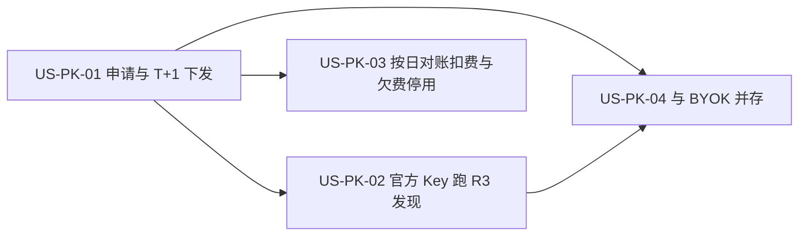

# 30 - 需求:Places 官方通道按用户下发 API Key

> **文档类型**:本期需求 + 用户故事（**US-PK**, Places Key）  
> **状态**:**草稿 · 待合入 `dev-0.5.8`**  
> **基线**:桌面端 **v0.5.7+**（R3 探索 Places 发现 + **US-E-07** BYOK）  
> **对齐**:GitHub Issue [#21](https://github.com/Pedro-MAFS/ftcs/issues/21); Milestone **v0.5.8**  
> **关联**:原 US-E-10「Places 官方 token 网关代调」产品方向已废弃；对照 **US-E-07** BYOK 并存

---

## 1. 一句话目标

为不愿自备 Google Key 的用户提供**官方 Places 通道**：在产品内申请后 **T+1** 获得一把**专属** Places API Key，由**客户端直连** Google 跑 R3 发现；官方按日与 Google 对账后扣用户官方余额——**不做**服务端代调 Places。

---

## 2. 背景与动机

| 现象 | 痛点 |
|------|------|
| 现网 R3 依赖 US-E-07 BYOK | 多数用户不会开通 Google Cloud / Places，上手成本高 |
| 曾规划「官方网关代调 Places」 | 网关仅部署国内；Google 需出境；代调带来盗刷、计费与运维复杂度 |
| 用户仍希望「点申请就能用」 | 需要零自备 Key 的官方通道，且调用可归集到个人并计费 |

马丰顺 2026-10-09 合规与方案讨论后锁定（相对 Issue 初稿「网关代调」的修订）：

- **不做**官方服务端代调 / 中转 Google Places（不经国内网关转发 Places 请求）。  
- **官方通道**：每名用户一把 Google Places API Key；用户在产品内申请 → **T+1** 开通并下发到客户端。  
- **计费**：按日与 Google 账单/用量对账后，扣用户官方余额。  
- **并存 BYOK**：US-E-07 自备 Key 路径保留。  
- **数据用法**：Places **只作发现入口**；线索中的公司名 / 官网 / 电话 / 地址等以 **打开官网后抽取 / 核实** 的结果落库，**不把 Places 返回的商家字段原样长期存库**。  
- **Key 约束**：仅开通 Places 相关 API；项目级配额与预算告警；异常可吊销单用户 Key。  
- **Out**：换非 Google 数据源、自建 POI 库（已评估，本期不做）。

---

## 3. 已确认产品规则

| # | 规则 |
|---|------|
| **PK1** | **无服务端代调**：官方服务与国内网关**不**转发、不中转 Google Places 请求；Places 调用由客户端直连 Google。 |
| **PK2** | **一人一 Key**：官方通道为每名用户绑定一把专用 Google Places API Key（与他人不共用）。 |
| **PK3** | **申请与 T+1 下发**：用户在产品内发起申请；申请受理后 **T+1**（下一自然日）内开通，并将 Key 下发到该用户客户端可用状态。状态至少区分：申请中 / 已开通 / 失败（或等价文案）。 |
| **PK4** | **仅 Places**：下发的 Key 仅启用 Places 相关 API（不开放无关 Google Maps SKU）。 |
| **PK5** | **配额与防盗刷**：Google Cloud **项目级**配额与预算告警；发现滥用、盗刷或异常用量时，可**吊销**该用户官方 Key，吊销后不可继续用官方 Key 调 Places。 |
| **PK6** | **按日对账扣费**：按日拉取 / 对齐 Google 用量或账单，归集到用户后扣其**官方余额**；欠费或官方 Key 已吊销时，官方通道不可用（须可感知提示）。SKU 明细与加价规则交详设（见 O1）。 |
| **PK7** | **并存 BYOK**：US-E-07 用户自备 Key 路径保留且行为与现网一致；官方下发 Key 与 BYOK **可同时存在于同一账号**；二者并存时的选用优先级交详设（见 O4）。 |
| **PK8** | **Places 只发现**：R3 用 Places 产出候选后，须经**打开 / 核实公司官网**再抽取线索字段；落库的公司名、官网、电话、地址等以官网核实结果为准，**不得**把 Places 返回的商家详情字段原样作为长期线索资产存储。 |
| **PK9** | **网络前提**：客户端须能访问 Google Places；官方通道不解决「本机无法访问 Google」的连通问题（与 BYOK 相同前提）。 |
| **PK10** | **版本与流程**：纳入 **v0.5.8**；需求 PR 基线 **`dev-0.5.8`**；PR 正文仅 **Related #21**（不 Closes）；发版前 **#21 不关闭**；不合 `main`（发版时整支 `dev` 再合）。旧详设「US-E-10 网关代调」按本口径作废或重写，不在本文实现范围内直接改代码。 |

---

## 4. 范围与非范围

### 4.1 本期做（In Scope）

1. 产品内官方 Places Key **申请入口**与状态展示（申请中 / 已开通 / 失败等）（PK3）。  
2. **T+1** 开通并下发一人一 Key 到客户端，使官方通道用户**无需自备 Key** 即可跑 R3 Places 发现（PK2、PK3、PK9）。  
3. Key **仅 Places**、项目级配额 / 预算告警；异常可吊销单用户 Key（PK4、PK5）。  
4. **按日对账**归集用量并扣官方余额；欠费 / 吊销后官方通道停用且提示明确（PK6）。  
5. 与 **BYOK（US-E-07）并存**；Preflight / 设置相关文案能区分官方通道与自备 Key（PK7）。  
6. R3 发现路径写清：**Places 候选 → 官网核实 → 落库自有字段**；不长期缓存 Places 商家详情作线索本体（PK8）。  
7. 明确**不做**服务端代调（PK1）。

### 4.2 本期不做（Out of Scope）

| 项 | 说明 |
|----|------|
| 服务端 / 国内网关代调或中转 Google Places | PK1 |
| 换非 Google 地图 / POI 数据源 | 已评估；本期不做 |
| Overture 等自建 POI 库 | 成本高；本期不做 |
| 删除或削弱 BYOK | PK7；US-E-07 保留 |
| 解决客户端无法访问 Google 的网络问题 | PK9 |
| 把 Places 商家详情字段原样长期写入线索库 | PK8 |
| 合入 `main` / 打 tag / 发版 / 关闭 #21 | PK10 |

---

## 5. 用户故事拆分

| ID | 标题 | 优先级 | 依赖 | 说明 |
|----|------|--------|------|------|
| **US-PK-01** | 申请官方 Places Key 与 T+1 下发 | Must | 官方账号 / 登录（现网） | 申请、状态、一人一 Key、T+1 开通下发、可吊销 |
| **US-PK-02** | 客户端使用官方 Key 跑 R3 发现 | Must | US-PK-01；现网 R3 / Places MCP | 客户端直连；只发现；官网核实后落库 |
| **US-PK-03** | 按日对账扣费与欠费 / 吊销停用 | Must | US-PK-01 | 按日对账、扣官方余额、停用可感知 |
| **US-PK-04** | 与 BYOK 并存 | Must | US-PK-01；US-E-07 | 双通道共存；切换规则详设定 |

建议实现顺序：PK-01 →（PK-02 与 PK-03 可并行）→ PK-04（可同里程碑 / 同 PR 族，验收可分）。

---

### US-PK-01　申请官方 Places Key 与 T+1 下发

**作为** 外贸业务员，**我想** 在产品里申请官方 Places Key 并在次日可用，**以便** 不用自己开通 Google Cloud 也能用探索发现。

| 项 | 内容 |
|----|------|
| 优先级 | Must |
| 依赖 | 现网用户登录 / 官方账号能力 |
| 状态 | **待详设** |

**验收要点**

- 产品内有明确申请入口；提交后进入「申请中」（或等价）状态（PK3）。  
- 申请受理后 **T+1** 内用户获得「已开通」状态，且客户端已具备可用的官方 Places Key（PK2、PK3）。  
- 每名用户对应一把专用 Key，不与其他用户共用（PK2）。  
- Key 仅开通 Places 相关 API（PK4）。  
- 开通失败时状态为失败（或等价），并有可理解提示；可再次申请的规则交详设（不得静默无反馈）。  
- 运营侧或系统可对异常用户**吊销**其官方 Key；吊销后该用户官方通道不可用（PK5）。  
- **不**出现服务端代调 Places 的设计或文案承诺（PK1）。

**本故事不做**：R3 发现链路细节（归 US-PK-02）；对账扣费（归 US-PK-03）；与 BYOK 切换 UI 细则（归 US-PK-04 / O4）。

---

### US-PK-02　客户端使用官方 Key 跑 R3 发现

**作为** 已开通官方通道的业务员，**我想** 用下发的 Key 在客户端直连 Google 跑探索发现，**以便** 零自备 Key 完成 Places 候选并落到经官网核实的线索。

| 项 | 内容 |
|----|------|
| 优先级 | Must |
| 依赖 | US-PK-01 已开通 Key；现网 R3 / Places 调用链 |
| 状态 | **待详设** |

**验收要点**

- 官方通道已开通且未欠费 / 未吊销时，用户**无需**配置自备 `GOOGLE_PLACES_API_KEY` 即可走 R3 Places 发现（PK3、PK9）。  
- Places 请求由**客户端直连** Google，不经官方服务转发 Places 载荷（PK1）。  
- 发现流程遵循：Places 候选 → 打开 / 核实公司官网 → 线索字段以官网核实结果落库；**不**把 Places 商家详情原样长期写入线索（PK8）。  
- 本机无法访问 Google 时，失败可感知；不伪装为「官方已代调成功」（PK9）。  
- Preflight / 设置文案能表明当前使用的是官方下发 Key（与 BYOK 区分见 US-PK-04）。

**本故事不做**：申请与 T+1（归 US-PK-01）；对账扣费（归 US-PK-03）；Key 落盘加密方案细节（交详设 O3）。

---

### US-PK-03　按日对账扣费与欠费 / 吊销停用

**作为** 使用官方通道的用户（及运营），**我想** 用量按人归集并按日扣官方余额，欠费或 Key 被吊销后停用，**以便** 官方成本可控、账单可解释。

| 项 | 内容 |
|----|------|
| 优先级 | Must |
| 依赖 | US-PK-01 用户–Key 绑定；官方余额能力（现网或本期最小对接） |
| 状态 | **待详设** |

**验收要点**

- 用量可按用户（及其官方 Key）归集（PK2、PK6）。  
- 按日与 Google 用量 / 账单对账后，扣减该用户官方余额（PK6）；具体 SKU 映射、汇率 / 加价、展示粒度交详设（O1）。  
- 官方余额不足（欠费）时，官方通道不可继续调 Places，并有明确提示（PK6）。  
- Key 被吊销后，官方通道不可用，并有明确提示（PK5、PK6）。  
- 项目级配额 / 预算告警存在于运营侧或 Google 项目配置要求中（PK5）；产品内是否展示用量交详设。

**本故事不做**：BYOK 路径计费（BYOK 费用由用户自担 Google 账单）；服务端代调计量（本期无代调）。

---

### US-PK-04　与 BYOK 并存

**作为** 可能同时拥有官方 Key 与自备 Key 的用户，**我想** 两条路径都还能用且规则清楚，**以便** 按自己情况选择或切换。

| 项 | 内容 |
|----|------|
| 优先级 | Must |
| 依赖 | US-PK-01；现网 US-E-07 |
| 状态 | **待详设** |

**验收要点**

- 未申请或未开通官方通道时，BYOK 行为与现网 **US-E-07** 一致（PK7）。  
- 官方通道开通后，BYOK **不被删除**；用户仍可配置 / 使用自备 Key（PK7）。  
- 当官方 Key 与 BYOK 同时可用时，产品有明确选用规则或切换入口；具体优先级（官方优先 / 用户显式选择等）交详设（O4），但验收时不得出现「静默随机选用」且用户无法理解当前用的是哪把 Key。  
- 官方欠费或吊销时，若 BYOK 仍有效，用户应能退回 / 继续用 BYOK（除非详设另有更严规则且产品明示）。  
- 设置 / Preflight 文案区分「官方下发 Key」与「自备 Key」。

**本故事不做**：强制取消 BYOK；服务端代调。

---

## 6. 验收清单（需求级）

- [ ] 用户可申请官方 Places Key，T+1 内开通并下发到客户端。  
- [ ] 一人一 Key；Key 仅 Places；可吊销。  
- [ ] 官方通道用户无需自备 Key 即可跑 R3 Places 发现（客户端直连 Google）。  
- [ ] **无**服务端 / 网关代调 Places。  
- [ ] Places 只作发现；线索字段来自官网核实，不长期存 Places 商家详情原文。  
- [ ] 用量可按用户归集；按日对账后扣官方余额；欠费 / 吊销后官方通道停用且可感知。  
- [ ] BYOK（US-E-07）仍可用；与官方通道并存规则可验收（含当前所用 Key 可识别）。  
- [ ] 变更落在 `dev-0.5.8`；PR 仅 Related #21；#21 不因本文关闭；不合 `main`。

---

## 7. 风险与开放问题

| # | 项 | 倾向 |
|---|-----|------|
| O1 | Google Places 用量与账单的 **SKU 映射**、加价 / 汇率、官方余额扣费展示粒度 | **交详设**；需求已锁：按日对账后扣官方余额 |
| O2 | Key 创建是 **全自动**（API Keys API）还是 **半自动**（运营确认 + 脚本）；T+1 的起算与时区 | **交详设**；需求已锁：T+1 内开通下发；允许首期半自动，但状态对用户可感知 |
| O3 | 官方 Key 在客户端的 **存储位置与保护**（与 BYOK 是否共用保险库、是否可导出明文） | **交详设**；须满足可用且降低随意泄露面 |
| O4 | 官方 Key 与 BYOK **同时存在**时的选用优先级与切换 UX | **交详设**；需求已锁：并存；须可识别当前通道 |
| O5 | 旧详设 `docs/design/US-E-10-Places官方网关.md` 作废 vs 改名重写 | **交详设 / 文档清理**；实现不得再按「网关代调」落地 |
| O6 | Google Maps Platform 条款与「Places 只发现、官网落库」产品路径的正式法务复核 | **上线前法务**；需求侧已按此路径约束落库（PK8），不替代法律意见 |

---

## 8. 修订记录

| 日期 | 说明 |
|------|------|
| 2026-10-09 | 初稿：对齐 #21 锁定口径——无代调、一人一 Key、申请 T+1 下发、按日对账扣费、并存 BYOK、Places 只发现官网落库；拆分 US-PK-01～04；基线 `dev-0.5.8`；开放 O1～O6 |

---

## 9. 下一步

1. 马丰顺确认本文后，再合入 **`dev-0.5.8`**（本 PR 先不合；Related #21，不 Closes）。  
2. 合入后交接 @FTCS 详细设计：按 US-PK-01～04 写详设（含 O1～O5）；作废或重写旧 US-E-10 网关代调详设。  
3. 详设确认后再交 @FTCS 开发；开工前按开发流程征得同意。  
4. **#21 发版前不关闭**；本需求不触发打 tag / 发版；**不**同步 `main`（发版整支合入）。  
5. #3 / #42 不在本文范围。
