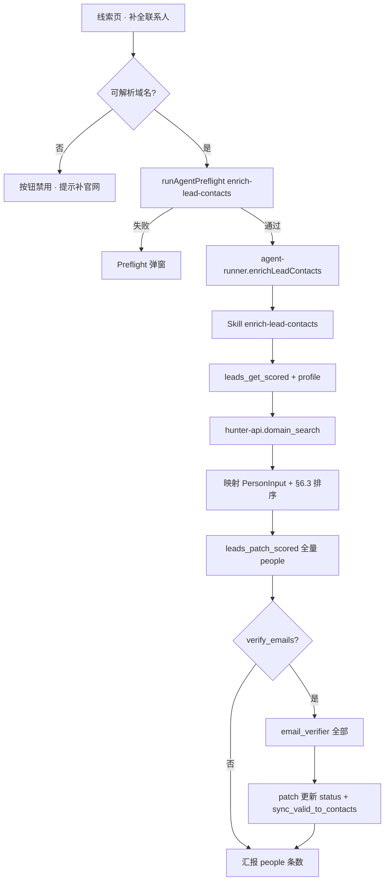

# US-C-03 详细设计：Skill 与桌面（enrich-lead-contacts）

> **用户故事**：作为已配置 Hunter API Key 的业务员，我希望在线索页点击「补全联系人」，系统按域名 Domain Search → 排序写回 `people[]`（可选验邮），且无 Key 时不阻断探索/开发信。  
> **范围**：Skill `enrich-lead-contacts`；设置页「集成 → Hunter」多 Key；线索页按钮 + 验证开关；仅 enrich 的 Preflight；`WORKSPACE_TEMPLATE_VERSION` bump；C7 同步 contacts 的最小 lead-store 扩展。  
> **依赖**：[US-C-01](US-C-01-people-schema与leads-patch-scored.md)（people[] / `leads_patch_scored`）；[US-C-02](US-C-02-hunter-api-MCP.md)（hunter-api MCP，已落地）；对齐 [US-E-07](US-E-07-Places-MCP自定义Key.md) / [US-E-09](US-E-09-探索页开始R3与Preflight.md) BYOK + Preflight 模式  
> **关联**：[20-需求-联系人Enrichment.md](../20-需求-联系人Enrichment.md) §3–§4、§9 US-C-03  
> **文档位置**：`docs/design/`

---

## 0. 相对现网（US-C-01 / C-02 之后）

| 现网 | **本期（C-03）** |
|------|------------------|
| `people[]` + `leads_patch_scored` 可写回 | Skill 编排 Domain Search → 排序 → patch |
| `hunter-api` MCP + `runtime.ts` / opencode 已接线 | 设置页写入 `.env` `HUNTER_API_KEYS`；Preflight 探测 Key + MCP |
| 线索页仅有「开发信」 | 增加「补全联系人」；验邮走设置「集成」全局开关 |
| 无「集成」设置导航 | 新增侧栏「集成」区块（Hunter BYOK，独立于官方通道） |
| 模板版本未含 enrich Skill / 老用户区可能无 hunter-api 目录 | bump `WORKSPACE_TEMPLATE_VERSION` 触发 managed 同步 |

---

## 1. 目标与非目标

### 1.1 目标

1. 用户可在设置中配置 **一个或多个** Hunter API Key；保存后 OpenCode 重启/重连即可注入 MCP。
2. 已评分线索上，人工触发「补全联系人」→ Agent 跑 Skill → `people[]` 非空（有公开邮箱时）。
3. 验邮由设置全局开关控制（**默认开启**）；开启后对本线索 **全部** 候选人调用 `email_verifier`（约 0.5 credit/封）。
4. 无 Key / 无域名 / Agent 忙：按钮置灰或 Preflight 拦截，**不**影响探索与开发信。

### 1.2 非目标（归 US-C-04 或延后）

| 不做 | 归属 |
|------|------|
| people 抽屉徽章、sources 列表、单条「验证」按钮、scored people 手工维护 | US-C-04 |
| `pickPrimaryRecipient` / 开发信优先 `hunter_valid` + `Dear FirstName` | **另立故事**（对接支持计划「开发信 · 多风格与中英对照」；原曾挂 C-04） |
| 任务编排节点 / 批量补全 | C2 / US-C-06～08 |
| Hunter 官方代调网关 | 永不做（C3） |
| builtin 补邮箱 | US-C-05 |
| Hunter HTTP 代理（undici） | 确需时另开；MVP 全局 `fetch`（同 C-02） |

**验收不依赖抽屉 UI**：Agent 跑通后读 `scored.json` 的 `people[]` 即可。

---

## 2. 已确认选型

| 项 | 决定 |
|----|------|
| **Q1 Skill 名** | `enrich-lead-contacts` |
| **Q2 入参** | `product_id`（必填）、`lead_id`（必填，**单条**）、`verify_emails`（boolean；桌面从全局设置注入，默认 `true`；Skill 对话未说明时按 `false`） |
| **Q3 写回** | `leads_patch_scored`；**全量** emails → people（§C13 无上限）；开启验证时对 **全部** 候选人调 `email_verifier` |
| **Q4 域名** | UI：无 `company.website` 可解析域名则按钮禁用（§C1）；Skill 内再解析 eTLD+1，失败则停止并说明 |
| **Q5 设置导航** | **新增**侧栏「集成」；Hunter **独立于**官方模型 / 搜索 / 探索 Places |
| **Q6 多 Key UI** | textarea，**每行一个 Key**；保存规范化为 `HUNTER_API_KEYS`（逗号分隔）；读侧兼容旧 `HUNTER_API_KEY` |
| **Q7 掩码** | `hunterApiKeysMasked` + `hunterApiKeySet`；掩码回写不覆盖；清空=清除 `HUNTER_API_KEYS` 与 `HUNTER_API_KEY` |
| **Q8 连通性** | 新 `hunter-connectivity.ts`：直调 `GET /v2/account`（不启 MCP）；多 Key 逐条报告；设置页「测试连接」 |
| **Q9 Preflight** | kind `enrich-lead-contacts`；`needsHunter` → Key 已配置 + `mcpOk('hunter-api')` + 公共 `lead-store` / agent-idle / model；**不**查 Places / search / chrome |
| **Q10 IPC** | `leads:enrich-contacts`；入参 `{ productId, leadId }`；主进程按 `HUNTER_VERIFY_EMAILS` 注入 `verifyEmails`；渲染 `ensureAgentReady` + 主进程 `gateAgentStart` 双检 |
| **Q11 按钮位置** | 对齐开发信：`LeadsView` 行操作 + `LeadDetailDrawer` 操作区；仅 **scored** 相位可点 |
| **Q12 无 Key** | 按钮 disabled + tooltip：「请先在设置 → 集成中配置 Hunter API Key」；外链 Hunter 注册；**不**阻断探索/开发信 |
| **Q13 模板版本** | **bump** `WORKSPACE_TEMPLATE_VERSION`（同步 `skills/` + 用户区首次出现 `mcp-servers/hunter-api`） |
| **Q14 合规文案** | 设置页注明：额度**账号级**，同账号多 Key 共享；请配置本人/团队合法持有的 Key；不引导刷免费号 |
| **Q15 C7 contacts 同步** | 扩展 `leads_patch_scored` 可选参数 `sync_valid_to_contacts`（默认 `false`）；Skill 仅在 `verify_emails=true` 且验邮完成后以 `true` 调用。规则见 §5.4 |
| **Q16 置信度阈值（C7）** | `confidence >= 70` 且 `email_status === hunter_valid` 且判定为 personal 邮箱（复用 lead-store `isPersonalEmail` 逻辑） |
| **Q17 工作流** | **不**加入 `workflow-nodes` / 编排自动跑（§C2） |

---

## 3. 端到端流程



---

## 4. Skill：`enrich-lead-contacts`

### 4.1 文件

`workspace/skills/enrich-lead-contacts/SKILL.md`

Frontmatter 对齐现网 Skill：

```yaml
---
name: enrich-lead-contacts
description: 对单条已评分线索用 Hunter Domain Search 补全联系人并写入 people[]；可选验邮。用户说补全联系人、enrich-lead-contacts 时使用。
phase: 2
inputs:
  - name: product_id
    type: string
    required: true
  - name: lead_id
    type: string
    required: true
  - name: verify_emails
    type: boolean
    required: false
outputs:
  - path: data/leads/{product_id}/scored.json
    schema: ScoredLead.people
---
```

### 4.2 何时使用

- 用户在线索页点击「补全联系人」，或说「补全联系人 / enrich-lead-contacts」
- 画像非必须 `ready`（读 `buyer_personas` 辅助排序即可；缺省则仅按邮箱质量排）
- **必须**已配置 Hunter Key；桌面入口须 Preflight 通过

### 4.3 前置条件

- MCP：`lead-store`、`hunter-api`
- `data/leads/{product_id}/scored.json` 存在且含 `lead_id`
- 该 lead 的 `company.website` 可解析出域名

### 4.4 冻结常量

| 常量 | 值 | 说明 |
|------|-----|------|
| `DOMAIN_SEARCH_LIMIT` | **10** | 对齐免费档上限；禁止更大以免 `pagination_error` |
| `SYNC_CONFIDENCE_MIN` | **70** | C7 同步 contacts 阈值 |

### 4.5 步骤

**Step 0 — 参数**

- 确认 `product_id`、`lead_id`；`verify_emails` 缺省按 `false`。

**Step 1 — 读线索与画像**

1. `lead-store.leads_get_scored({ product_id })`，定位 `lead_id`；不存在则停止。  
2. 可选 `product_get` 取 `buyer_personas`（用于 `role_match` / `match_reason`）。

**Step 2 — 解析域名**

- 从 `company.website` 解析 **eTLD+1**（去协议、www、路径；如 `https://www.pantron.com/about` → `pantron.com`）。  
- 失败：停止，中文说明「该线索无有效官网域名，无法 Domain Search」。

**Step 3 — Domain Search**

- 调用 `hunter-api.domain_search({ domain, limit: 10 })`。  
- 处理结构化错误：  
  - `HUNTER_NO_KEY` / `HUNTER_UNAUTHORIZED` → 引导设置 → 集成  
  - `HUNTER_QUOTA_EXCEEDED` / `HUNTER_ALL_KEYS_EXHAUSTED` → **停止**，提示充值或加 Key，**禁止**重试循环  
  - 空 `emails` → 诚实汇报「Hunter 未找到公开邮箱」，不编造  

**Step 4 — 映射 PersonInput**

对每条 email（已由 MCP 丢掉无 sources 的条目）：

| Person 字段 | 来源 |
|-------------|------|
| `name` | `first_name + last_name`；皆空则用邮箱 `@` 前本地部分 |
| `first_name` / `last_name` / `title` | Hunter 字段（可 null） |
| `role_match` | 与 `buyer_personas` 弱匹配；无则 null |
| `match_reason` | 必填：类型（personal/generic）+ confidence + 姓名/职位要点 |
| `email` | `value` |
| `email_status` | 见下表 |
| `confidence` | Hunter `confidence`（null → 0） |
| `sources` | MCP 裁剪后的 sources（≥1） |
| `provider` | `"hunter"` |

`email_status` 映射（对齐需求 §5.2 / C-01）：

| Hunter | `email_status` |
|--------|----------------|
| `verification.status === "valid"` | `hunter_valid` |
| `accept_all` 域或 status `accept_all` | `hunter_accept_all` |
| `invalid` / `disposable` | `hunter_invalid` |
| status `null` / 缺失 | `hunter_unverified` |
| 其他 / 未知 | `hunter_unknown` |

**Step 5 — 排序并全量 patch**

1. 按需求 [§6.3](../20-需求-联系人Enrichment.md) 综合排序（personal > generic → confidence → 职位/角色 → 姓名）。  
2. 调用 `leads_patch_scored({ product_id, lead_id, people: 全部按序, sync_valid_to_contacts: false })`。  
3. **禁止**只写 top3 people；全量写入（§C13）。

**Step 6 — 可选验邮**

仅当 `verify_emails === true`：

1. 对 people 中 **每一条** 调用 `hunter-api.email_verifier({ email })`。  
   - `pending: true` → 保留/写 `hunter_unknown`，继续下一条  
   - `HUNTER_CLAIMED_EMAIL` → 该邮箱标 `hunter_invalid` 或跳过，**不** failover 重试同邮箱  
   - 配额类错误 → **停止**剩余验证，已有结果仍 patch  
2. 将更新后的 people（含新 `email_status`）再次 `leads_patch_scored`，且 **`sync_valid_to_contacts: true`**（§5.4）。

**Step 7 — 汇报**

简短中文：域名、people 条数、是否验证、quota 提示；提醒打开线索查看（C-04 前可用 scored.json / Agent 输出核对）。

### 4.6 硬禁令

- **禁止** Agent 按 pattern 猜邮或编造邮箱。  
- **禁止** 对同一线索多次 `domain_search`（缓存命中除外，由 MCP 处理）。  
- **禁止** `verify_emails=false` 时调用 `email_verifier`。  
- **禁止** 配额错误后自动换线索批量烧 credit。  
- **禁止** 覆盖已有 `contacts` 中的 form/phone；仅按 §5.4 **追加**邮箱。

---

## 5. lead-store 最小扩展（C7）

### 5.1 背景

现网 `leads_patch_scored` **只写 `people[]`，不写 `contacts[]`**（C-01 冻结）。需求 §C7：开启验证且 valid 的个人邮箱应 **追加** 到 `contacts`，供现网开发信（仍读 `contacts`）在 C-04 之前也能用上。

### 5.2 API 变更

```typescript
leads_patch_scored({
  product_id,
  lead_id,
  people,
  sync_valid_to_contacts?: boolean  // 默认 false
})
```

### 5.3 `patchScoredLead` 行为

在写完并排序 `people[]` 之后，若 `sync_valid_to_contacts === true`：

对每个 person，若同时满足：

1. `email_status === "hunter_valid"`  
2. `confidence >= 70`  
3. personal 邮箱（与 `comparePersons` 同一套 prefix 判定）  

则向 `lead.contacts` **追加** `{ type: "email", value: person.email, confidence: "high" }`（按 value 小写去重；**不删除**已有 form/phone/其它 email）。

返回值增加可选字段：`contacts_appended: number`。

### 5.4 Skill 调用约定

| 调用时机 | `sync_valid_to_contacts` |
|----------|--------------------------|
| Step 5 首次全量写 people | `false` |
| Step 6 验邮后更新 | `true` |
| `verify_emails=false` | 始终 `false`（即使 Domain Search 内嵌 valid 也不同步——严格对齐 C7「若开启验证」） |

---

## 6. 设置页：集成 · Hunter

### 6.1 导航

[`SettingsView.vue`](../../desktop/src/views/SettingsView.vue) 侧栏新增：

```ts
{ id: 'integrations', label: '集成' }
```

置于「探索」与「工作区」之间（或「搜索服务」之后——实现时保持与现网区块顺序一致即可，**不得**塞进「探索」与 Places 混排）。

### 6.2 表单字段

| UI | 绑定 | 说明 |
|----|------|------|
| 多行文本 | `form.hunterApiKeys` | 每行一个 Key；展示时用掩码串（见下） |
| 显示/隐藏 | `showHunterKeys` | 对齐 Places |
| 测试连接 | `onTestHunter` | 调 IPC，不启 MCP |
| 外链 | Hunter 注册 / API Keys 页 | `PRODUCT_LINKS.hunter`（新增） |

说明文案（固定要点）：

- 可选扩展；未配置不影响探索与开发信。  
- 支持多个 Key（每行一个）；系统按顺序使用，额度用尽或无效时自动切换。  
- **Hunter 额度为账号级**：同一账号下多个 Key **共享**额度；请仅配置合法持有的 Key。  
- Domain Search 约 1 credit/次；验邮约 0.5 credit/封。**全局勾选「补全联系人时验证邮箱」**（`HUNTER_VERIFY_EMAILS`，默认开启）；线索页不再提供勾选。

### 6.3 `settings-service`

对齐 Places / Tavily：

**读 env**

- 合并 `HUNTER_API_KEYS`（逗号拆）+ `HUNTER_API_KEY`（单 Key），去重保序。  
- Snapshot：  
  - `hunterApiKeySet: boolean`  
  - `hunterApiKeysMasked: string` — 多 Key 时用换行拼接各 Key 的 `maskSecret`；0 Key 为空串  
  - 可选 `hunterApiKeyCount: number`（便于 UI 显示「已配置 N 个」）  
  - `hunterVerifyEmails: boolean` — 读 `HUNTER_VERIFY_EMAILS`，缺省 `true`

**写 `saveSettings`**

| 输入 | 行为 |
|------|------|
| `undefined` | 不改 |
| 掩码串（`isMaskedSecret` 或整段每行皆掩码） | 保留旧值 |
| 空 / 仅空白行 | `removeEnvKeys`：`HUNTER_API_KEYS`、`HUNTER_API_KEY` |
| 明文（行或逗号） | 规范化写入 `HUNTER_API_KEYS=k1,k2,...`；**删除**遗留 `HUNTER_API_KEY` 以免重复 |

保存后 `Object.assign(process.env, …)`；`SETTINGS_SAVE` 现有路径已 `runtime.restart()`，Hunter 随 `hunterEnv` 注入（C-02 已完成）。

### 6.4 连通性：`hunter-connectivity.ts`

```typescript
export interface HunterKeyTestItem {
  tail: string        // 后 4 位
  ok: boolean
  message: string
  remaining?: number | null
  resetDate?: string | null
  planName?: string | null
}

export interface HunterTestResult {
  ok: boolean           // 至少一个 Key 成功
  message: string
  keys: HunterKeyTestItem[]
}
```

- 使用 **已保存** 的 `process.env` Key 列表（与 Places 测试一致：preload **不**传明文 Key）。  
- 对每个 Key：`GET https://api.hunter.io/v2/account` + `X-API-Key`。  
- 200 → ok + remaining（`requests.credits.remaining` 优先，否则 `searches.remaining`）。  
- 401 → 该条失败「Key 无效」。  
- 网络错误 → 该条失败并提示可达性。  
- **不**要求代理（MVP）；与 hunter-api MCP 一致。

IPC：`SETTINGS_TEST_HUNTER` → `testHunterConnectivity()`；preload / `electron.d.ts` 暴露 `testHunter()`。

### 6.5 外链

[`desktop/src/config/links.ts`](../../desktop/src/config/links.ts) 增加：

```ts
hunter: 'https://hunter.io/',
hunterApiKeys: 'https://hunter.io/api-keys', // 或官方文档 Keys 页
```

`.env.example` 增加注释行：`HUNTER_API_KEYS=` / `# HUNTER_API_KEY=`（兼容说明）。

---

## 7. Preflight

### 7.1 新 kind

三处同步类型：

- [`agent-preflight.ts`](../../desktop/electron/preflight/agent-preflight.ts)  
- [`ipc/types.ts`](../../desktop/electron/ipc/types.ts)  
- [`electron.d.ts`](../../desktop/src/types/electron.d.ts)

```ts
| 'enrich-lead-contacts'
```

### 7.2 `hunter-start.ts`（对齐 `places-start.ts`）

```typescript
export function resolveHunterStart(
  settings: Pick<SettingsSnapshot, 'hunterApiKeySet'>
): { ok: boolean; detail: string } {
  if (settings.hunterApiKeySet) {
    return { ok: true, detail: 'Hunter API Key 已配置（BYOK）' }
  }
  return {
    ok: false,
    detail: '请先在设置 → 集成中配置 Hunter API Key（补全联系人需要；不影响探索/开发信）',
  }
}
```

无官方网关分支（永不代调）。

### 7.3 `runAgentPreflight` 分支

```ts
function needsHunter(kind: AgentPreflightKind): boolean {
  return kind === 'enrich-lead-contacts'
}
```

当 `needsHunter`：

1. `resolveHunterStart(settings)` → check id `'hunter'`  
2. `mcpOk(mcpServers, 'hunter-api')` → id `'mcp-hunter-api'`

**不**追加 search / chrome / places。

公共项仍检查：`agent-idle`、`opencode`、`model`、`lead-store`。

### 7.4 决策表

| Hunter Key | hunter-api MCP | enrich 结果 |
|------------|----------------|-------------|
| 无 | — | **禁止** |
| 有 | 未连接 | **禁止**（提示重连 OpenCode） |
| 有 | connected | **允许** |

R1/R2/R3/开发信 / 评分：**不**检查 Hunter。

---

## 8. agent-runner 与 IPC

### 8.1 Prompt

```typescript
function buildEnrichLeadContactsPrompt(
  productId: string,
  leadId: string,
  verifyEmails: boolean,
): string
```

要点：

- 严格按 skill `enrich-lead-contacts`  
- 传入 `product_id`、`lead_id`、`verify_emails`  
- 要求调用 `domain_search` → `leads_patch_scored`；按开关决定是否 `email_verifier`  
- 禁止猜邮；配额错误停止  

会话 title：`enrich-lead-contacts · {productId} · {leadId}`。

### 8.2 方法

```typescript
async enrichLeadContacts(options: {
  productId: string
  leadId: string
  verifyEmails?: boolean
}): Promise<…>
```

对齐 `draftEmails`：占位卡片、skill 名、流式事件。

### 8.3 IPC

| 项 | 值 |
|----|-----|
| Channel | `leads:enrich-contacts`（常量进 `IPC` 表） |
| 入参 | `{ productId: string, leadId: string }`；主进程按设置注入 `verifyEmails` |
| 主进程 | `gateAgentStart('enrich-lead-contacts')` → `runner.enrichLeadContacts(...)` |
| preload | `enrichLeadContacts(input)` |

---

## 9. 线索页 UI

### 9.1 可见性

| 条件 | 「补全联系人」 |
|------|----------------|
| 非 scored（raw / discarded） | 不显示或禁用 |
| scored 但无解析域名 | **禁用**；title：「请先填写有效官网域名」 |
| scored + 有域名 + 无 Hunter Key | **禁用**；title 链到设置 → 集成 + Hunter 注册 |
| scored + 有域名 + 有 Key | **可点**；点击前 `ensureAgentReady('enrich-lead-contacts')` |

域名解析与 Skill 同规则（前端可抽 `parseCompanyDomain(website): string | null` 小工具，主进程可不重复）。

### 9.2 验证开关

- **不在**线索页/抽屉提供勾选；改由「设置 → 集成」全局开关「补全联系人时验证邮箱」。  
- 写入 `.env` `HUNTER_VERIFY_EMAILS`（默认 `true`）；主进程 `leads:enrich-contacts` 读取后注入 Skill。  
- 旁注放在设置页：「验邮约 0.5 credit/封」。

### 9.3 交互位置

| 位置 | 行为 |
|------|------|
| `LeadsView` 行操作 | 「补全联系人」按钮 |
| `LeadDetailDrawer` | 操作区「补全联系人」；`emit('enrich', lead)` |

进行中：`enriching` 状态禁用重复点击（对齐 `drafting`）。

### 9.4 无 Key 引导（非 Preflight）

列表/抽屉禁用态文案示例：

> 补全联系人需要 Hunter API Key。前往 设置 → 集成 配置（[注册 Hunter](https://hunter.io/)）。

**不得**在禁用开发信或探索按钮时顺带禁用本扩展以外的入口。

---

## 10. 工作区模板版本

[`workspace-init.ts`](../../desktop/electron/config/workspace-init.ts)：

```ts
export const WORKSPACE_TEMPLATE_VERSION = '2026.09.14-hunter-enrich-contacts'
```

（具体字符串以实现日为准，须 **不同于** 当前 `2026.09.09-places-api-bundled-deps`。）

效果：`needsManagedSync` → 同步 `skills/`（含新 Skill）与 `mcp-servers/`（含 hunter-api 目录与 dist）。用户 `.env` / `data` **不**覆盖。

C-02 已登记 `build-mcp` / `prepare-template`；本故事发版前跑 `npm run build:mcp` 即可。

---

## 11. 错误与文案映射（桌面）

| 场景 | 用户可见 |
|------|----------|
| Preflight 无 Key | 请先在设置 → 集成中配置 Hunter API Key… |
| Preflight MCP 未连接 | OpenCode 未连接 hunter-api，请稍后重试或重启运行时 |
| Skill / MCP `HUNTER_QUOTA_EXCEEDED` | Hunter 额度已用尽（…xxxx），{date} 重置… |
| `HUNTER_ALL_KEYS_EXHAUSTED` | 所有 Key 均不可用：… |
| 无域名 | 请先填写有效官网域名 |
| Domain Search 空 | Hunter 未找到该域名下的公开邮箱 |

---

## 12. 测试与验收

### 12.1 单测 / 轻测

| 用例 | 预期 |
|------|------|
| `resolveHunterStart` 无 Key / 有 Key | 禁止 / 允许 |
| `parseCompanyDomain` | 常见 URL → eTLD+1；垃圾输入 → null |
| `saveSettings` 多行 Key | 写入 `HUNTER_API_KEYS`；清空调清除两键；掩码不覆盖 |
| `patchScoredLead(..., sync_valid_to_contacts: true)` | valid+personal+≥70 追加 contacts；generic 不追加；去重 |
| `needsHunter` 仅 enrich kind | R3/draft 不查 Hunter |

### 12.2 手工验收

| # | 步骤 | 预期 |
|---|------|------|
| P1 | 无 Key 打开线索页 | 「补全联系人」禁用；开发信仍可用 |
| P2 | 设置 → 集成填入真实 Key，测试连接 | 显示 remaining；保存后 `hunterApiKeySet` |
| P3 | 有官网的 scored 线索，不勾验证，补全 | Agent 跑通；`people[]` 非空；未调 verifier（account 验邮额度不变或仅 search +1） |
| P4 | 勾选验证再补全 | 对候选人逐条 verifier；符合条件的 email 进入 `contacts` |
| P5 | 无 website 线索 | 按钮禁用 |
| P6 | 故意耗尽 / 无效 Key | Preflight 或 Skill 明确错误，无 silent fail |
| P7 | 升级后老工作区 | 模板 bump 后出现 Skill + hunter-api |

---

## 13. 实现任务拆分（开发时）

1. lead-store：`sync_valid_to_contacts` + 单测；必要时 bump `0.5.x`  
2. settings-service + SettingsView「集成」+ hunter-connectivity + IPC + links + `.env.example`  
3. hunter-start + agent-preflight kind + 类型三处同步  
4. agent-runner prompt/方法 + main IPC + preload  
5. LeadsView / LeadDetailDrawer UI + domain helper  
6. Skill `SKILL.md`  
7. bump `WORKSPACE_TEMPLATE_VERSION`  
8. 手工 P1–P7  

---

## 14. 风险

| 风险 | 对策 |
|------|------|
| 老用户区无 hunter-api 目录 | 本故事 **必须** bump 模板版本（C-02 已记录依赖） |
| 设置「集成」与「探索」Places 并存造成困惑 | 文案强调 Hunter 仅「补全联系人」；Places 仅 R3 |
| 多 Key 被误解为叠加额度 | 设置页醒目说明账号级配额 |
| C-04 前用户看不见完整徽章/sources | Agent 汇报 + 列表 people 列；完整抽屉见 US-C-04 |
| Domain Search 空结果 | 诚实文案；保留原 contacts |

---

## 15. 验收标准（对照需求 §10）

- [ ] 无 Hunter Key 时探索 / 开发信可用；补全按钮禁用并有引导。  
- [ ] 配置 Key 后，1 条有域名的 scored 线索「补全联系人」→ `people[]` 非空（有公开邮箱时）。  
- [ ] ≥1 人含 `match_reason` + `sources`；排序符合 §6.3。  
- [ ] 默认不验证；勾选后对全部候选人验证且 C7 同步 contacts（阈值内）。  
- [ ] 无 Key / 配额用尽 → 明确错误。  
- [ ] 多 Key 可保存；测试连接逐条报告；failover 由 MCP（C-02）承担。  
- [ ] 模板版本已 bump；Skill 随工作区同步。

---

## 16. 变更记录

| 日期 | 说明 |
|------|------|
| 2026-09-14 | 初稿：Skill + 设置集成多 Key + Preflight + 线索按钮；C7 经 `sync_valid_to_contacts`；抽屉/开发信选人归 C-04 |
| 2026-09-14 | **修订**：取消验邮「最多 3 封」；开启后对全部候选人验邮 |
| 2026-09-14 | **修订**：验邮改为设置「集成」全局开关（默认开启）；线索页不再勾选 |
| 2026-09-15 | **交叉引用**：抽屉徽章/单条验证/people 手工维护见 US-C-04；`pickPrimary` / Dear FirstName 改挂开发信重构故事 |
