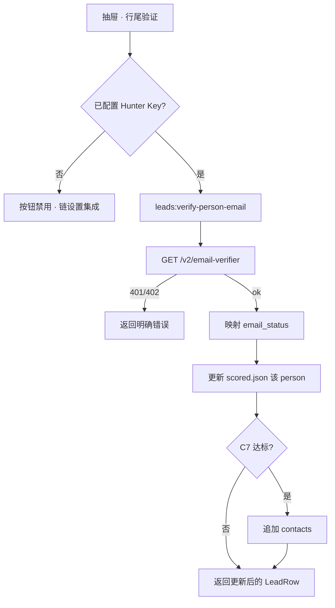
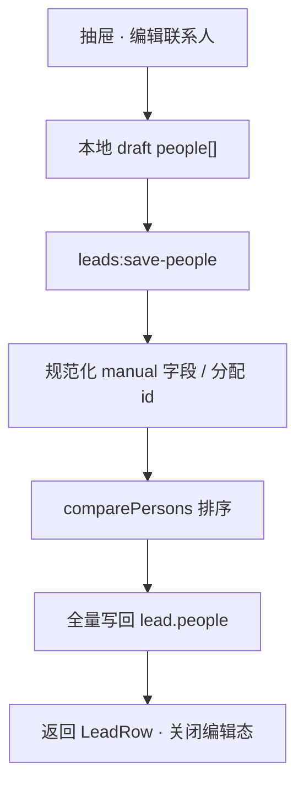

# US-C-04 详细设计：抽屉 people 增强与手工维护

> **用户故事**：作为业务员，我希望在线索抽屉中看清关键联系人的验邮状态与来源，并能单条验证或手工增删改 people，而无需再跑一轮 Agent。  
> **范围**：抽屉 people 徽章 / sources / 单条「验证」；scored 线索 people 手工增删改；DTO 投影补齐；主进程直调 Hunter verifier 与 scored 写盘。  
> **依赖**：[US-C-01](US-C-01-people-schema与leads-patch-scored.md)（people Schema / C7）；[US-C-02](US-C-02-hunter-api-MCP.md)（verifier 语义与 status 映射）；[US-C-03](US-C-03-Skill与桌面.md)（已落地补全入口、全局验邮开关、列表 people 列）。  
> **关联**：[20-需求-联系人Enrichment.md](../20-需求-联系人Enrichment.md) §5、§9 US-C-04、§10  
> **文档位置**：`docs/design/`

---

## 0. 相对现网（US-C-03 之后）

| 现网 | **本期（C-04）** |
|------|------------------|
| 线索表「关键联系人」列：首个姓名 + `+N` 悬停 | **维持**；必要时与抽屉徽章文案对齐，不重做列布局 |
| 抽屉 people 只读：姓名 / 职位 / 邮箱 / `email_status` 文本 / confidence | 徽章（✅/⚠️/灰/红）、可折叠 sources、行尾「验证」 |
| `leads-reader.parsePeople` 未投影 `sources` / `first_name` / `match_reason` / `provider` | DTO 补齐上述字段 |
| 抽屉「编辑」仅 `phase === 'raw'` → `saveRawLead` | scored 增加「编辑联系人」→ 全量写回该 lead 的 `people[]` |
| 批量验邮仅经 Skill（全局 `HUNTER_VERIFY_EMAILS`） | **单条**验邮：主进程 HTTP 调 Hunter，**不启** OpenCode / Agent |
| 开发信：`pickPrimaryEmail(contacts)` + `Dear {公司} Team` | **本期不动**；划归另立「开发信重构」故事（对齐支持计划「开发信 · 多风格与中英对照」） |

---

## 1. 目标与非目标

### 1.1 目标

1. 抽屉清晰展示每位 person 的验邮徽章、confidence、`match_reason`、Hunter/手工 sources。  
2. 对未验证邮箱一键「验证」：主进程直调 Hunter `email-verifier`，写回 `email_status`，满足 C7 时追加 `contacts`。  
3. scored 线索可在抽屉内手工 **新增 / 修改 / 删除** people，保存后列表与 JSON 一致。  
4. 无 Hunter Key 时验证按钮灰显并指向「设置 → 集成」；**不**阻断查看、手工维护与现网开发信。

### 1.2 非目标

| 不做 | 归属 |
|------|------|
| `pickPrimaryRecipient`、开发信优先 `hunter_valid`、`Dear FirstName` | **另立用户故事**（建议对接支持计划 `email-draft-styles`：多风格与中英对照，并收编选人/称呼） |
| 改 `email_draft_generate` / `email-drafter` / `draft-outreach-email` Skill | 同上 |
| 批量验邮、编排节点 | US-C-06～08 |
| 改全局 `HUNTER_VERIFY_EMAILS` 默认策略 | 已定（C-03） |
| 将 `hunter_accept_all` 自动 sync 进 contacts | 保持 C7；仅 `hunter_valid` 达标才 sync |
| raw 线索上的 people 编辑 | raw 无 Hunter people；继续只编 contacts / 公司 |
| Agent/Skill 路径做单条验证 | 明确禁止 |

---

## 2. 已确认选型（Q 表）

| 项 | 决定 |
|----|------|
| **Q1 单条验证路径** | 主进程 `fetch` Hunter `GET /v2/email-verifier`；复用设置页 Key 池（`HUNTER_API_KEYS`）；**不**起 OpenCode |
| **Q2 验证按钮可见性** | 仅 `hunter_unverified` / `hunter_unknown` 显示「验证」。**不**对 `hunter_valid` / `hunter_invalid` 显示。`hunter_accept_all` **不**显示（避免重复扣费；用户若需重验可先手工改 status 或等后续故事） |
| **Q3 验证成功后 C7** | 若结果映射为 `hunter_valid` 且 personal 且 `confidence >= 70`，按 C7 **追加** `contacts`（去重）；与 Skill 批量验邮后 `sync_valid_to_contacts` 规则一致 |
| **Q4 status 映射** | 对齐 C-02 / Skill：`valid`→`hunter_valid`；`accept_all`→`hunter_accept_all`；`invalid`/`disposable`/`webmail` 等不可投→`hunter_invalid`；异步/未知→`hunter_unknown` |
| **Q5 手工维护对象** | 仅 **scored** 的 `people[]` |
| **Q6 保存语义** | 提交的 `people` **全量替换**该 lead 的 `people[]`（删除 = 不在提交列表中）；保存后按 §6.3 `comparePersons` 重排 |
| **Q7 落盘** | 主进程直接改 `data/leads/{productId}/scored.json`（对齐 `saveRawLead`）；**不**经 Agent / MCP 强制路径 |
| **Q8 手工 Schema** | `provider: "manual"`；`email_status` 默认 `hunter_unverified`；合成 1 条 sources（见 §4）；`match_reason` 默认「用户手工录入」 |
| **Q9 person id** | 新建：`createPersonIdAllocator`；编辑：保留原 `id`；`enriched_at`：新建用 now，编辑保留原值（用户改邮箱不强制刷新，可选更新） |
| **Q10 编辑入口** | scored 抽屉独立「编辑联系人」；公司 / 来源 / contacts **只读**。raw 仍用现有「编辑」→ `saveRawLead` |
| **Q11 IPC** | `leads:verify-person-email`；`leads:save-people` |
| **Q12 lead-store Schema** | `PersonSchema.provider` 由 `literal("hunter")` 放宽为 `z.enum(["hunter", "manual"])`；MCP `leads_patch_scored` 同步接受 manual（避免后续 Agent 误删手工条） |
| **Q13 列表列** | 不重做；DTO 补齐后悬停气泡可顺带显示 status 短标（可选，非必须） |
| **Q14 开发信** | 本期零改动；需求 §10 中「优先收件人 + Dear FirstName」验收挂到开发信重构故事 |

---

## 3. 端到端流程

### 3.1 单条验证



### 3.2 手工保存 people



---

## 4. Schema 修订（相对 US-C-01）

### 4.1 `provider`

```ts
provider: z.enum(["hunter", "manual"])
```

### 4.2 手工条目约定

| 字段 | 规则 |
|------|------|
| `provider` | `"manual"` |
| `email_status` | 默认 `hunter_unverified`；用户验证后可变更为 Hunter 映射值 |
| `confidence` | 手工新建默认 `0`；验证后可用 Hunter `score`（若有）或保留原值 |
| `sources` | 恰好或至少 1 条合成源（见下） |
| `match_reason` | 默认「用户手工录入」；可改 |
| `first_name` / `last_name` / `title` / `role_match` | 可空 |
| `name` | 必填；可从邮箱前缀推导 |
| `email` | 必填；保存前 trim + 小写去重（同 lead 内 email 唯一） |

合成 source：

```json
{
  "domain": "manual",
  "uri": "urn:ftcs:manual",
  "extracted_on": "YYYY-MM-DD",
  "last_seen_on": "YYYY-MM-DD",
  "still_on_page": true
}
```

> `uri` 使用 URN，UI 不渲染为可点击外链（或显示「手工录入」）。

### 4.3 Hunter 条目

保持 C-01；编辑态允许改姓名/职位/`match_reason` 等，**默认不**允许清空 `sources`（保存时若 `provider=hunter` 且 sources 空则拒绝或保留磁盘原 sources）。

---

## 5. DTO 与 `leads-reader`

### 5.1 `LeadPersonDto`（ipc + electron.d.ts）

在现网字段上增加：

| 字段 | 类型 | 说明 |
|------|------|------|
| `firstName` | `string \| null` | |
| `lastName` | `string \| null` | |
| `matchReason` | `string` | |
| `provider` | `"hunter" \| "manual"` | 缺省当 `hunter` |
| `sources` | `LeadPersonSourceDto[]` | |
| `enrichedAt` | `string` | 可选展示 |

`LeadPersonSourceDto`：`domain` / `uri` / `extractedOn` / `lastSeenOn` / `stillOnPage`。

### 5.2 `parsePeople`

从 `scored.json` 完整投影；非法/缺邮箱条目跳过（与现逻辑一致）。

---

## 6. 主进程：单条验证

### 6.1 模块

建议路径：`desktop/electron/leads/verify-person-email.ts`

职责：

1. 读工作区 `.env` → `readHunterKeysFromEnv`；无 Key → `{ ok: false, message: "…" }`。  
2. 按序尝试 Key 调用 `https://api.hunter.io/v2/email-verifier?email=`（`X-API-Key`）；401 换下一个；402/quota 返回充值提示。  
3. 将 Hunter `data` 映射为 `email_status`（与 hunter-api MCP / Skill 表一致）。  
4. 打开 `scored.json`，按 `leadId` + `personId`（或 email）定位 person，写回 `email_status`；若响应含 score，可更新 `confidence`。  
5. 若 C7 达标，追加 `contacts`。  
6. `listLeadsSnapshot` 取更新后的 `LeadRow` 返回。

**不**复用 OpenCode MCP 进程；可与 `hunter-connectivity.ts` 共享 base URL / Key 读取，避免复制 Key 解析。

### 6.2 IPC

| 项 | 值 |
|----|-----|
| Channel | `leads:verify-person-email` |
| 入参 | `{ productId: string, leadId: string, personId: string }` |
| 出参 | `{ ok: boolean, message: string, lead?: LeadRowDto }` |

渲染进程：验证中该行按钮 loading；成功则 `emit('saved', lead)` 或专用 `person-updated`，父级刷新 snapshot / `detailLead`。

### 6.3 错误文案（固定要点）

| 情况 | 文案方向 |
|------|----------|
| 无 Key | 请先在设置 → 集成配置 Hunter API Key |
| 401 全部 Key | Key 无效，请检查设置 |
| 402 / credits | Hunter 额度不足，请到 Hunter 账户充值 |
| person 不存在 | 联系人不存在或已删除 |
| 网络失败 | 无法连接 Hunter：{reason} |

---

## 7. 主进程：保存 people

### 7.1 模块

建议路径：`desktop/electron/leads/save-scored-people.ts`

入参示意：

```ts
interface SaveScoredPeopleInput {
  productId: string
  leadId: string
  people: Array<{
    id?: string
    name: string
    firstName?: string | null
    lastName?: string | null
    title?: string | null
    roleMatch?: string | null
    matchReason?: string
    email: string
    emailStatus?: string
    confidence?: number
    provider?: "hunter" | "manual"
    sources?: LeadPersonSourceDto[]
    enrichedAt?: string
  }>
}
```

处理步骤：

1. 校验 lead 存在于 scored。  
2. 规范化每条：trim email；同 lead 内 email 小写去重（后者覆盖或拒绝——**拒绝重复并报错**更安全）。  
3. 无 `id` → `createPersonIdAllocator` 分配；`provider` 缺省：有真实 Hunter sources 则 `hunter`，否则 `manual`。  
4. `manual`：补合成 sources、默认 match_reason / email_status / confidence。  
5. `hunter`：sources 空则保留磁盘上同 id 的 sources。  
6. `comparePersons` 排序后全量赋值 `lead.people`；`updated_at = now`。  
7. **不**在纯手工保存时自动跑 C7（避免把未验证手工邮箱 sync 进 contacts）；C7 仅验证成功路径触发。  
8. 返回更新后的 `LeadRow`。

### 7.2 IPC

| 项 | 值 |
|----|-----|
| Channel | `leads:save-people` |
| 入参 | `SaveScoredPeopleInput` |
| 出参 | `{ ok: boolean, message: string, lead?: LeadRowDto }` |

### 7.3 与 MCP `leads_patch_scored` 关系

| 路径 | 用途 |
|------|------|
| Agent / Skill | 继续 `leads_patch_scored`（增量按 email merge） |
| 桌面手工 | `leads:save-people`（全量替换，支持删除） |

二者写同一文件；桌面保存后 Agent 再 patch 仍按 email merge，**不会**无故删掉未出现在 patch 入参里的手工条（C-01 增量语义）。用户若用 Skill 全量覆盖式 patch 仍可能冲掉手工条——Skill 已是「Domain Search 全量写入」；详设接受该风险，或在 Skill 中注明「保留 `provider=manual`」作为 **C-04 实现可选增强**（推荐实现：patch 合并时保留磁盘上未出现在本次 emails 中的 `provider=manual` 条目）。

**本期要求**：`leads_patch_scored` **保留**未出现在本次入参中的 `provider === "manual"` people（按 email 不在 patch 集中则留下）。写入详设为实现清单必做项。

---

## 8. 抽屉 UI

### 8.1 只读态（scored）

在现有 people 区块上增强每位：

1. **徽章**：替代纯文本 status  
   - `hunter_valid` → 成功色 + 「已验证」或 ✅  
   - `hunter_accept_all` → 警告色 + 「接受全部」或 ⚠️  
   - `hunter_unverified` / `hunter_unknown` → 灰色 + 「未验证」  
   - `hunter_invalid` → 危险色 + 「无效」  
2. **confidence**、**match_reason**（可折叠或次行）  
3. **sources**：默认折叠「来源 N」；展开列出 domain / last_seen / still_on_page；`http(s)` uri 可点外链；`urn:ftcs:manual` 显示「手工录入」  
4. **验证**按钮：见 Q2；无 Key 时 disabled + title  
5. 底部仍保留「补全联系人」（C-03）

### 8.2 编辑态（scored · 编辑联系人）

- 入口：只读底栏「编辑联系人」（与 raw「编辑」区分文案）。  
- 表单：每人一组字段——姓名、邮箱、职位、first/last、match_reason、email_status（可选下拉，默认不强制改验证态）、删除。  
- 「添加联系人」：追加空白 manual 行。  
- 保存 → `leads:save-people`；取消丢弃 draft。  
- **不可**编辑公司 / website / contacts（避免与 raw 编辑混淆）。

### 8.3 raw 抽屉

- people 区继续空态「尚未补全联系人」或隐藏。  
- 编辑行为不变。

### 8.4 组件与样式

- 主改 [`LeadDetailDrawer.vue`](../../desktop/src/components/shared/LeadDetailDrawer.vue) + [`main.css`](../../desktop/src/styles/main.css) 既有 `lead-drawer__person-*`。  
- preload / `electron.d.ts` 暴露 `verifyPersonEmail` / `saveScoredPeople`。

---

## 9. 实现清单（编码阶段）

| 层 | 改动 |
|----|------|
| lead-store | `provider` 枚举含 `manual`；`patchScoredLead` **保留**未入参的 manual people；单测 |
| desktop | `verify-person-email.ts`、`save-scored-people.ts`；IPC + preload + types |
| reader | `parsePeople` 投影 sources 等；`LeadPersonDto` 扩展 |
| UI | 抽屉徽章 / sources / 验证 / scored 编辑联系人 |
| 文档 | 本文；docs/20 §9/§13；C-03 §1.2 交叉引用 |
| 版本 | lead-store 小版本 bump（Schema 变更）；桌面无需模板 bump（无新 Skill） |

**不**改：`agent-runner` enrich、`email-drafter`、`draft-outreach-email`。

---

## 10. 验收

| # | 步骤 | 期望 |
|---|------|------|
| A1 | 有 Key，抽屉对 `hunter_unverified` 点验证 | status 更新；无 Agent 任务；列表刷新可见 |
| A2 | 验证结果为 valid + personal + conf≥70 | `contacts` 追加该 email（去重） |
| A3 | 无 Key | 「验证」disabled，title 指向设置 → 集成 |
| A4 | 402 | 明确额度错误，不 silent |
| A5 | scored「编辑联系人」：删一人、改一人、加一人后保存 | `scored.json` 与 UI 一致；新手 `provider=manual` |
| A6 | 保存含重复 email | 拒绝并提示 |
| A7 | raw「编辑」 | 行为与现网一致 |
| A8 | 「写邮件」 | 草稿逻辑与现网一致（回归未改 drafter） |
| A9 | Skill 再次 Domain Search patch | 磁盘上 manual people **仍在**（若实现 §7.3 保留规则） |

---

## 11. 风险与缓解

| 风险 | 缓解 |
|------|------|
| 主进程 verifier 与 MCP 映射不一致 | 共用同一映射表常量（可抽到共享模块或桌面复制 C-02 表并单测） |
| Skill 全量 patch 冲掉手工条 | §7.3 强制保留 `provider=manual` |
| 用户把无效邮箱标成 valid | 手工编辑可不开放任意改 status；或开放但 C7 仍要求验证路径才 sync |
| URN source 被外链打开 | UI 判断 `urn:` / `domain===manual` 不渲染 `<a href>` |

---

## 12. 另立故事（开发信重构）→ 已立项

原划出的选人 / 称呼 / 多风格与中英对照，已立需求：

- **[21-需求-开发信重构.md](../21-需求-开发信重构.md)**（US-M）

本文 **不**再实现开发信选人逻辑；交叉验收以 21 号文档为准。

---

## 13. 变更记录

| 日期 | 说明 |
|------|------|
| 2026-09-15 | 初稿：抽屉徽章/sources/主进程单条验证；scored people 手工全量保存；开发信选人划出另立故事 |
| 2026-09-15 | 开发信另立 → 已指向 docs/21-需求-开发信重构.md |
