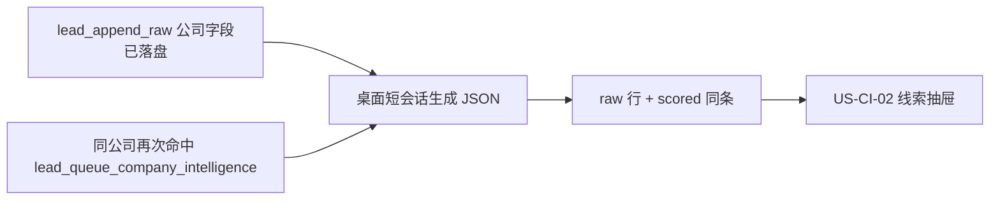
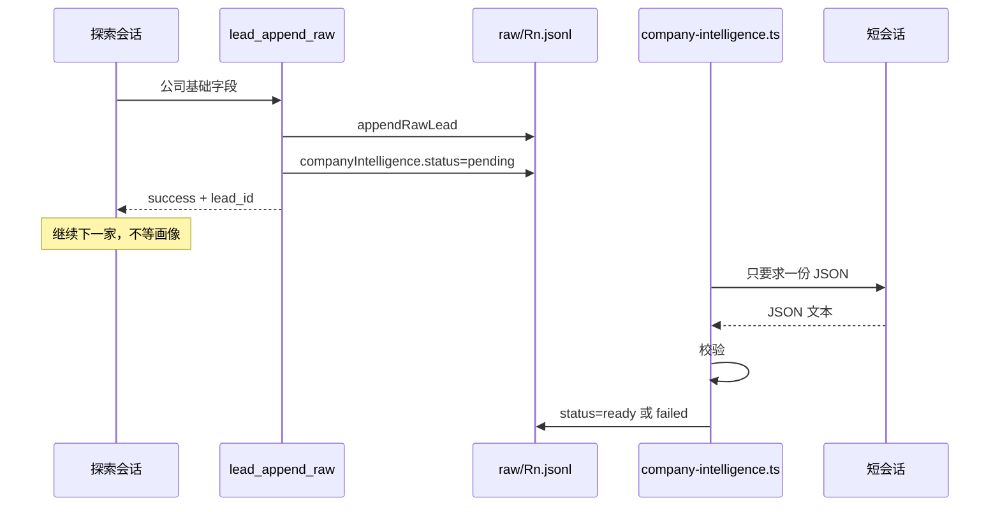

# US-CI-01 探索落库随写画像与破冰

> **用户故事**：[../29-需求-目标公司深度画像.md](../29-需求-目标公司深度画像.md) · US-CI-01 · Issue #3  
> **状态**：**待评审**（本文件只定设计；业务代码尚未按本文改动）  
> **范围**：公司线索在探索里成功落库之后，异步写入六个固定字段画像 + 破冰；校验失败只标在该线索的画像对象上  
> **依赖**：现网 `lead_append_raw` → `appendRawLead`；评分去重 `scoreAndDedupeLeads`；桌面 OpenCode `session.promptAsync`  
> **不做**：线索页完整界面（[US-CI-02](US-CI-02-线索页画像展示与破冰改稿.md)）；旧线索打开时补生成；独立「生成 / 刷新」；付费工商库；代发邮件  
> **文档位置**：`docs/design/`

数据形态以本文 §4.1 为准。展示、空态文案、破冰保存 IPC 以 US-CI-02 为准，这里不重复界面。

---

## 0. 相对现网

对照 `dev-0.5.8` 已落地的探索写线索路径（2026-10-07 读码）。

| 现网 | **本期（US-CI-01）** |
|------|----------------------|
| R1 / R2 / R3 判定为目标客户后调用 `lead-store.lead_append_raw`，`appendRawLead` 把**一行**追加到 `data/leads/{product_id}/raw/{round}.jsonl` | 这一行先按今天的公司基础字段落盘并返回成功；**然后**异步写入 `companyIntelligence` |
| `RawLead` / `ScoredLead` 没有画像、破冰、生成状态字段 | 在线索对象上增加嵌套对象 `companyIntelligence`（§4.1），六个字符串 + `icebreak` + `status` |
| 同域名已在 `lead_list_raw` 里时，技能直接跳过，不再调用 `lead_append_raw` | 新公司仍只追加一行。同公司再次被探索命中时**不追加第二条 raw**，改为给已有线索排队覆盖画像（§3.3） |
| `rawLeadToScoredLead` 只拷贝公司、分数、联系方式等固定字段；`scoreAndDedupeLeads` 另保留 `status` 与 `people` | 评分去重把 raw 上的 `companyIntelligence` 拷进 `scored.json`。评分本身不调用模型 |
| 模型调用都在桌面 `AgentRunController`：`client.session.create` + `client.session.promptAsync`。`lead-store` 进程里没有 OpenCode client | 画像用**另一条短会话**走同一套调用。不占用 `AgentRunController.running`，也不在 `lead_append_raw` 里 `await` 模型 |
| 仓库没有 `workspace/skills/lead-company-intelligence/`，也没有目标公司画像字段 | 支持计划里的这个名字**尚未落地**。本期不把自家产品画像技能拿来充当目标公司画像 |
| `extract-product-profile` 写入 `data/products/{product_id}/profile.json`（卖方自己的产品画像） | 短会话可以**只读**这份画像，用来写第⑥段「合作机会」。不改 `profile.json` |
| `email-drafter.ts` 的 `draftEmailForLead` 已标明生产路径禁用（模板拼信） | 不复用该函数 |
| `lead-scorer.ts` 是加权评分，不是模型 | 不在评分函数里生成画像 |
| 公开检索是 MCP `search-api.search_web`（Tavily）。联系人补全是 `enrich-lead-contacts` → `leads_patch_scored` 的 `people[]` | 检索只用已接入的 `search_web`（以及该线索上已有的官网事实）。不接工商库，不把邮箱 / 电话写进画像 |

现网接缝（需求优先，实现时按本节而不是按技能里的「跳过」原文）：

1. **落库成功点**是 `workspace/mcp-servers/lead-store/src/index.ts` 的工具 `lead_append_raw` 在 `appendRawLead`（`lead-storage.ts`）返回之后。工具今天就返回 `{ success, lead_id, raw_path }`。公司基础字段在这一刻已经在 jsonl 里。
2. **Zod 会丢掉未声明字段**。`appendRawLead`、`listRawLeads`、`saveScoredLeads` 都走 `RawLeadSchema` / `ScoredLeadSchema` 的 `parse`，默认剥掉未知键。字段不进 schema，下一次读或评分就会没了。
3. **线索页在评分之后看的是 scored 行**。`listLeadsSnapshot`（`desktop/electron/leads/leads-reader.ts`）对同一个 id 优先展示 `scored.json`，对应 raw 行不再单独出现。只写 jsonl、不写 scored，抽屉里会看不到。
4. **同公司再探索今天不会再次落库**。`discover-leads` / `discover-leads-r2` / `discover-leads-r3` 都要求先 `lead_list_raw`，同域名则跳过。`appendRawLead` 本身也只追加新 id（`generateLeadId`），不会按域名更新旧行。若实现仍按「跳过 = 什么都不做」，CI6（再次落库覆盖，含用户改过的破冰）和 CI7（旧线索要再探索并再次落库才有画像）都不会发生。
5. **桌面当轮提示词和技能文件是两处**。`agent-runner.ts` 的 `buildDiscoverLeadsPrompt`、`buildDiscoverLeadsR2Prompt`、`buildDiscoverLeadsR3Prompt` 会再写一遍「通过才 `lead_append_raw`」。只改 `SKILL.md` 时，提示词仍把模型往「跳过」上带。

---

## 1. 与相邻故事的分工



| 模块 | 本期 |
|------|------|
| **US-CI-01** | 落库之后的状态、生成、校验、覆盖、失败；评分去重如何把对象带进 `scored.json` |
| **US-CI-02** | 抽屉按六字段只读展示；破冰编辑保存；pending / failed / 无对象空态。不负责生成 |
| **评分去重** | 继续去重、打分、保留生命周期 `status` 和 `people`。多拷贝 `companyIntelligence`。不在这里调用模型，也不给没对象的旧线索补一份 |
| **联系人 enrichment** | 仍写 `people[]` / 既有 `contacts`。画像对象不加邮箱、电话 |
| **开发信** | 仍走 `draft-outreach-email`。画像失败不影响起草；本文不代发 |

---

## 2. 已确认选型

需求 CI1–CI12 与详设 O1–O4 已锁定，下表直接采用。

| 项 | 决定 |
|----|------|
| **O1 时序** | 先完成现网线索落库（公司名、网址、国家、描述、来源、`match_reason`、`contacts` 等先入库），再异步生成并回写画像 + 破冰。`lead_append_raw` 的成功返回不依赖模型。生成中 / 失败写在 `companyIntelligence.status`。失败只改这个对象，不回滚、不删该线索其它字段 |
| **O2 形态** | 嵌套对象 `companyIntelligence`（§4.1）。六段一一对应，另加 `icebreak`、`status`、可选 `errorMessage`、可选 `updatedAt`。不把六段拆成互不相关的顶层字段，也不把整份画像存成一段自由文本或 Markdown |
| **O3 通道** | 复用桌面已有的 OpenCode 会话（`session.create` + `session.promptAsync`）和已接入的 `search-api.search_web`。模型只负责交出**一份结构化 JSON**；主进程校验通过后才写入。没有现成的「收 JSON 再落库」函数，新增薄封装 `desktop/electron/leads/company-intelligence.ts`。不引入付费工商数据库 |
| **O4 空态** | 没有 `companyIntelligence` 的旧线索保持没有。不在打开抽屉、不在启动、不在评分时补写。空态文案属于 US-CI-02 |
| **CI2** | 探索页、线索页都不加「生成画像」「刷新画像」 |
| **CI6** | 同公司再次经探索命中并完成下面的排队写入时，整份覆盖六段 + 破冰，包含用户已改的破冰 |
| **CI7** | 本版不扫描「没有该对象」的历史线索去做补生成 |
| **CI8** | 单条失败：`status=failed` 且有 `errorMessage`。该线索的公司字段、联系人、`people`、分数、生命周期 `status` 保持原样 |
| **CI11** | 朝六段方向写短文本即可。手工样例（Rufus & Coco）的事实密度不是验收标准 |
| **CI12** | 邮箱 / 电话仍只在现有 `contacts` 与 `people` |

实现落点（由 O1–O4 推出来的接法，不是另一套产品口径）：

| 项 | 落点 |
|----|------|
| **新线索** | `appendRawLead` 成功后，同一次工具调用里再把该行的 `companyIntelligence.status` 写成 `pending`（只改磁盘，不等模型）。pending 写入若抛错，工具仍对这条线索返回已落库成功；桌面作业随后把状态写成 `failed` |
| **同公司** | 身份用现网 `getDedupeKey`（`lead-scorer.ts`）：`normalizeDomain(company.website \|\| source.url)`，否则公司名 trim 后小写，否则线索 id。`normalizeDomain` 在 `lead-id.ts`，会去掉 `www.` |
| **再次命中** | 不新增 raw 行、不新生成 `lead_*` id。技能改为调用 `lead_queue_company_intelligence`。该工具只把已有线索标成 `pending` 并立刻返回 |
| **覆盖顺序** | 再次命中时先把 `status` 置为 `pending`，生成成功后再**整对象替换**六段 + `icebreak`。成功前磁盘上可以仍留着上一份正文，界面按 pending 展示（US-CI-02），不把旧破冰当成当前稿 |
| **短会话** | 与正在进行的 R1/R2/R3 **不是同一条 session**。不把 `AgentRunController.running` 设为 true，避免探索被互斥挡住，也避免用户界面出现一次新的「生成」任务 |
| **排队** | 同一线索同时只跑一个生成。进行中又收到一次落库或再次命中，当前这次结束后再跑一轮，后一轮覆盖前一轮。全局串行一条短会话，避免和探索抢出很多并发会话 |
| **中断** | 队列在内存里。进程退出后，只把磁盘上 `status===pending` 的线索在下次启动时重新排队或标失败。没有 `companyIntelligence` 的旧线索不进入这个扫描 |

---

## 3. 流程

### 3.1 新公司：先落库，再异步回写



1. 探索会话仍按今天的步骤判断是不是目标客户。是，才调用 `lead_append_raw`。
2. `appendRawLead` 写入现有字段并返回这条 `RawLead`。这一步失败则整次工具失败，**不**留下半条画像，也**不**排队生成。
3. 追加成功后，按 id 把该行更新为带 `companyIntelligence: { status: 'pending', updatedAt }`。六段和 `icebreak` 此时可以不出现。
4. 工具对探索会话的返回与今天相同：`success`、`lead_id`、`raw_path`。可以多一个 `intelligence: "pending"`，探索汇报不必叙述六段。
5. 桌面 `startEventBridge` 看到工具 `lead_append_raw` 完成、输出里 `success===true` 且有 `lead_id`、入参里有 `product_id` 时，把这条放进队列。解析不到 id 就不猜，不改其它线索。
6. 短会话结束后由主进程校验再写入。探索会话的中止信号**不**取消已经落库的这条作业。

### 3.2 短会话读什么、禁止写什么

输入只用已经在磁盘上的事实，外加一次公开检索：

- 该线索的 `company`（name / website / country / description）、`source.snippet`、`match_reason`、`source.url`
- 只读 `lead-store.product_get` 对应的卖方产品画像，供第⑥段对照「我们卖什么」
- 信息不够时，可以调用现成的 `search-api.search_web`。需要看页面时，只打开该线索自己的 `company.website` 公开页，并遵守 `workspace/AGENTS.md` 的浏览器红线（验证码、登录墙、付费墙则停，不编造墙后的内容）

禁止：

- 再调用 `lead_append_raw` 造第二条线索
- 调用 `email_draft_save` 或任何发信工具
- 调用 Hunter / `leads_patch_scored` 去补联系人
- 把助手的 Markdown 正文、代码围栏原文、或自拟标题结构写进线索

主进程只取短会话**最后一条助手文本**，从中解析一个 JSON 对象（允许外面包一层 `` ```json `` 围栏，围栏本身不落盘）。解析不到对象即失败。

### 3.3 同公司再次命中（CI6 / CI7）

「同公司」= 上面的 `getDedupeKey` 相同。

现网技能在 `lead_list_raw` 已有该域名时跳过。本期把这一支改成：

1. 仍不调用 `lead_append_raw`（避免新 id，避免和去重、`people`、开发信草稿的 `lead_id` 打架）。
2. 本次若仍判定为目标客户，调用：

```text
lead-store.lead_queue_company_intelligence({
  product_id,
  lead_id   // lead_list_raw 里已有的那条 id
})
```

3. 工具立刻：
   - 找到该 raw 行；
   - 再找到 `scored.json` 里 **id 相同**或 **`dedupe_key` 相同**的那条（用户评分后看到的是这一条）；
   - 把这些记录的 `companyIntelligence.status` 设为 `pending`，`updatedAt` 更新为现在；
   - 不改 `company`、`contacts`、`people`、分数、生命周期 `status`；
   - 返回 `{ success, lead_id }`。
4. 桌面事件桥看到这个工具完成，走与 §3.1 相同的队列。
5. 生成成功后，用**同一个新对象**替换上述记录上的六段和 `icebreak`（用户以前改过的破冰一并被替换），`status=ready`，删掉 `errorMessage`。
6. 本次探索没有再把这家判成目标客户、因此既没有 `lead_append_raw` 也没有 `lead_queue_company_intelligence`：什么都不写。旧线索一直没有对象，就一直没有画像。

未打开官网、被技能跳过且没有调用排队工具的公司，不算「再次落库」。

### 3.4 成功、失败、中断

| 结果 | `companyIntelligence` | 其它字段 |
|------|----------------------|----------|
| 排队中 / 生成中 | `status=pending`，`updatedAt` 为 ISO 时间。六段可以先空着；覆盖任务在成功前可以暂时留着上一份正文 | 不动 |
| 校验通过 | 六段与 `icebreak` 都是非空字符串，`status=ready`，无 `errorMessage`。某段没有公开信息时写「暂无公开信息」，这算有值 | 不动 |
| 校验失败、会话失败、OpenCode 未就绪 | `status=failed`，`errorMessage` 为完整中文短句。首次生成：六段与 `icebreak` 用空字符串。再次覆盖失败：恢复进入本次 `pending` 之前的六段与破冰，同时保留 `failed` 和 `errorMessage`，避免一次失败把上一份抹掉 | 不动 |
| 进程在 `pending` 时退出 | 下次启动只处理 `status===pending` 的线索：能重跑则重跑；不能重跑则写成 `failed`，`errorMessage` 用「目标公司画像写入已中断」 | 不动。没有该对象的线索不扫描 |

`errorMessage` 示例（主进程写好再落盘，不把模型长文塞进去）：

- `目标公司画像未写入：模型输出不是规定的 JSON`
- `目标公司画像未写入：OpenCode 未就绪`
- `目标公司画像写入已中断`

单条失败不把探索运行标成 failed，不阻止 `exploration_finish`，不阻止下一条 `lead_append_raw`。

### 3.5 评分去重时怎么带上

`scoreAndDedupeLeads` 会按 raw **重建** `scored.json`。`rawLeadToScoredLead` 必须把保留下来的那条 raw 上的 `companyIntelligence` 拷进去。

同时：

- raw 上没有这个对象，但旧的 scored（同 id，或同 `dedupe_key`）有：保留 scored 上的那份。否则一次「评分去重」会把已经写好的画像清掉。
- raw 上有（含 `pending` 或更新的 `ready`）：以 raw 为准。这样再次命中已经写回 raw 的新稿，会在下次评分后仍在。
- 不在评分里把 `status` 改成 `pending`，也不调用短会话。

`toDiscardedLead` 不拷贝画像。淘汰行在线索页没有六段时，按 US-CI-02 的空态显示。跟进用的是保留下来的那条。

人工编辑 raw（`saveRawLead` → `applyEdits`）今天用 `...existing` 展开原对象，顶层 `companyIntelligence` 会留下来。实现时不要改成按字段白名单重造整行。

---

## 4. 模块与接口

### 4.1 数据形态

加在 `RawLeadSchema` 与 `ScoredLeadSchema` 上，可选。旧文件没有该键时仍能 `parse`。

```ts
companyIntelligence?: {
  businessModel: string       // ①商业模式与体量
  productsBrands: string      // ②主营产品与品牌
  targetMarket: string        // ③目标市场与客户
  supplyChain: string         // ④供应链与采购倾向
  industryPosition: string    // ⑤行业地位与优势
  collabOpportunity: string   // ⑥合作机会与跟进建议
  icebreak: string            // 破冰话术
  status: 'pending' | 'ready' | 'failed'
  errorMessage?: string
  updatedAt?: string          // ISO
}
```

实现可以用等价命名，但必须与上表一一对应。`pending` 时六段和 `icebreak` 可以缺省；`ready` 时这七个字符串都必须存在。

磁盘上不要出现 `markdown`、`body`、`profileText` 之类的整篇字段。写入前按这组键做严格校验，多出来的键整单失败，不把多余内容塞进某一段。

`ready` 的附加规则（zod 的「可选字符串」盖不住，要在写入前单独判断）：

- 七个文本字段 `trim` 之后长度都大于 0
- 「暂无公开信息」算通过
- 某一段超过 4000 字：整单失败，不截断后存成画像
- 不检查产品名、认证、零售商的条数（CI11）

### 4.2 lead-store

`patchCompanyIntelligence(root, productId, leadId, next)`（名字可等价）：

- 在 `data/leads/{product_id}/raw/R1.jsonl` … `R4.jsonl` 里按 id 改**那一行**（做法与桌面 `saveRawLead` 相同：读行、替换、整文件写回），不追加第二行
- 若 `data/leads/{product_id}/scored.json` 里有同 id，或有相同 `dedupe_key` 的线索，把同一个 `next` 写到那条上
- 用已经包含 `companyIntelligence` 的 schema `parse` 之后再 `saveScoredLeads` / 写 jsonl，避免未知键被剥掉
- 不修改 `company`、`source`、`contacts`、`people`、`score`、`score_breakdown`、`tier`、生命周期 `status`、`match_reason`

`lead_append_raw`：在现有成功路径之后调用上述函数写入 `pending`。`appendRawLead` 抛错则保持今天的工具错误，不写画像。

新工具 `lead_queue_company_intelligence`：

| 参数 | 说明 |
|------|------|
| `product_id` | 必填 |
| `lead_id` | 必填，必须是该产品 raw 里已有的 id |

找不到线索：工具 `isError`，**不**新建线索。找到了：§3.3 的 pending 更新，然后返回成功。工具内部不调用模型。

### 4.3 桌面薄封装

新文件 `desktop/electron/leads/company-intelligence.ts`：

- `enqueueCompanyIntelligence({ productId, leadId })`
- `parseCompanyIntelligencePayload(text): { ok: true, value } | { ok: false, errorMessage }`
- 串行队列、启动时处理遗留 `pending`（§3.4）
- 短会话提示词要求模型**只返回一个 JSON 对象**，键为 `businessModel`、`productsBrands`、`targetMarket`、`supplyChain`、`industryPosition`、`collabOpportunity`、`icebreak`
- 会话创建方式与 `AgentRunController` 里现有的 `client.session.create` / `client.session.promptAsync` 相同，挂在已经启动的 `OpencodeClient` 上
- 最终落盘调用 §4.2 的补丁。桌面现网不 import `lead-store` 包；若不能直接调用该函数，桌面侧按同一规则再写一份文件补丁（jsonl 按 id、`scored.json` 按 id 与 `dedupe_key`），并与 `getDedupeKey` 使用同一条域名规则。两份补丁都要能通过 §6 的样例

`startEventBridge`（`agent-runner.ts`）在工具 part 状态为完成时入队。工具名只认 `lead_append_raw` 与 `lead_queue_company_intelligence`。

三个 `buildDiscoverLeads*` 提示词各加一句执行要求：同域名已在 `lead_list_raw` 时不要再 `lead_append_raw`；本次仍是目标客户则调用 `lead_queue_company_intelligence`，`lead_id` 用已有那条。

### 4.4 技能

`workspace/skills/discover-leads/SKILL.md`、`discover-leads-r2/SKILL.md`、`discover-leads-r3/SKILL.md` 里「同域名则跳过、不写线索」改为 §3.3。判断「不是目标客户」时仍然什么都不调用。

不新增给用户点的技能入口。短会话的提示词由桌面队列发出，不要求业务员再说一次「生成画像」。

---

## 5. 文件清单

下表是**开发时预期会动**的现网文件。**本详设不改这些文件，交开发。**

| 文件 | 预期动作 |
|------|----------|
| `workspace/mcp-servers/lead-store/src/lead-types.ts` | `RawLead` / `ScoredLead` 增加可选 `companyIntelligence` |
| `workspace/mcp-servers/lead-store/src/lead-storage.ts` | `patchCompanyIntelligence`；`lead_append_raw` 所用的 pending；评分结果带上该对象 |
| `workspace/mcp-servers/lead-store/src/lead-scorer.ts` | `rawLeadToScoredLead` 拷贝 `companyIntelligence` |
| `workspace/mcp-servers/lead-store/src/index.ts` | `lead_append_raw` 成功后写 pending；新增 `lead_queue_company_intelligence` |
| `workspace/skills/discover-leads/SKILL.md` | 同域名再次命中改为排队覆盖，不追加第二条 raw |
| `workspace/skills/discover-leads-r2/SKILL.md` | 同上 |
| `workspace/skills/discover-leads-r3/SKILL.md` | 同上 |
| `desktop/electron/opencode/agent-runner.ts` | 三个探索提示词补一句；事件桥入队。不占用 `running` |
| `desktop/electron/leads/company-intelligence.ts` | **新文件**。队列、短会话、JSON 校验、回写 |

建议单测放在 `company-intelligence` 的解析函数，以及 lead-store 现有的 `lead-storage.test.ts` / `lead-scorer.test.ts`（pending 不回滚公司字段、评分后对象还在）。不强制 Vue E2E。测试文件同样不在本详设里修改。

**明确不改**：`docs/29-需求-目标公司深度画像.md`；`LeadDetailDrawer.vue` 的完整界面（US-CI-02）；`extract-product-profile`；`email-drafter.ts`；`enrich-lead-contacts`；探索页按钮。

破冰保存 IPC 由 US-CI-02 加。它可以调用本节的 `patchCompanyIntelligence`，但只替换 `icebreak` 与 `updatedAt`。

---

## 6. 验收对照

对照 `docs/29` 的 CI1、CI3、CI6、CI7、CI8、CI9、CI11、CI12，以及 US-CI-01 的验收要点。下列步骤是实现之后的手工或单测验收。**本 PR 不写代码，这里不声称已通过。**

### 6.1 建议单测

| # | 用例 | 期望 |
|---|------|------|
| T1 | 合法 JSON：七段都有字，其中一段是「暂无公开信息」 | 校验通过 |
| T2 | 整段 Markdown、缺一个键、某个值不是字符串、多一个 `markdown` 键 | 校验失败，不产生可落盘对象 |
| T3 | `appendRawLead` 成功后把补丁函数打成抛错 | jsonl 里仍有该公司基础字段；不出现半截未校验的长文 |
| T4 | 写入 `ready` 后再跑 `scoreAndDedupeLeads` | `scored.json` 同一 id 上有同一份 `companyIntelligence`；`people` 与生命周期 `status` 仍按现网保留 |
| T5 | raw 没有对象、scored 有 | 再评分后 scored 上的对象还在 |
| T6 | `getDedupeKey` 相同的第二条命中走排队工具 | 不新增 `lead_*` id；已有 scored 那条变为 `pending`，随后被整份替换 |

### 6.2 手工

| # | 需求 | 步骤 | 期望 |
|---|------|------|------|
| M1 | CI1、O1 | 跑一轮 R1（或 R2 / R3），让一家新公司被 `lead_append_raw` | 工具返回成功时，jsonl 里已有公司字段。画像可以仍是 `pending`。探索继续下一家，不因为画像还没写完而停 |
| M2 | CI3、O2、CI11 | 等该条变为 `ready`，打开 jsonl 与（评分后的）`scored.json` | 存在嵌套对象。六个键与 `icebreak` 都是字符串。没有一整块 Markdown 当画像。不按样例的事实密度判失败 |
| M3 | CI8 | 断掉模型或让短会话返回普通段落 | 该线索 `status=failed`，`errorMessage` 为中文短句。公司名、网址、`contacts`、分数仍在 |
| M4 | CI6 | 对已有画像（含手改破冰，手改步骤见 US-CI-02）的同域名公司再跑探索，并仍判为目标客户 | 不出现第二条同域名新线索。原线索先变为 `pending`，成功后六段和破冰都换成新内容，手改破冰不保留 |
| M5 | CI7 | 准备一条没有 `companyIntelligence` 的旧线索，只打开线索页、只跑评分去重、探索时不再命中它 | 对象仍不出现 |
| M6 | CI9、CI12 | 看这次改动的依赖与落盘 JSON | 没有新的工商数据供应商。画像对象里没有邮箱、电话字段。没有代发 |
| M7 | CI2 | 探索页 | 没有「生成画像」「刷新画像」 |

US-CI-02 的抽屉文案、破冰保存不在本节重复。

---

## 7. 不做什么

| 项 | 说明 |
|----|------|
| 线索页六段布局、破冰输入框、空态句子 | US-CI-02 |
| 打开旧线索、启动全库、评分去重时给「没有对象」的线索补生成 | CI7。启动扫描只处理已经是 `pending` 的行 |
| 「生成 / 刷新」按钮或菜单 | CI2。`lead_queue_company_intelligence` 只由探索会话在再次命中时调用，时间线里可能出现这个工具名，那不是给用户点的入口 |
| 把模型 Markdown 原文存进线索 | O2 / O3 |
| 按 Rufus & Coco 式密度验收 | CI11 |
| 画像里新增邮箱、电话 | CI12。联系人仍走 `enrich-lead-contacts` |
| 付费工商库、代发开发信 | CI9 |
| 分段只刷新某一段 | 成功时六段与破冰一起替换 |
| 同公司再追加一条 raw | §3.3 |
| 改 `docs/29`、在本详设 PR 里改业务代码 | 文件清单交开发 |

---

## 8. 风险

| 风险 | 缓解 |
|------|------|
| 技能继续「同域名就跳过」，再探索永远不会覆盖 | §3.3 同时改三份技能和三份 `buildDiscoverLeads*` 提示词。M4 看的是原 id 被覆盖，而不是多了一行 jsonl |
| 在 `lead_append_raw` 里等待模型，探索会话卡在工具上，落库成功被拖住 | 工具只写 `pending` 并返回。模型在桌面另一条 session |
| 短会话占用 `AgentRunController.running`，用户无法继续探索，或界面像多了一次生成任务 | 队列不走现有 `runDiscoverLeads` / `runScoreAndDedupe` 入口 |
| 第二条 session 与探索抢同一个 OpenCode | 画像队列全局串行；线索已是 `pending`，等当前探索的工具间隙或紧随其后执行。落库返回不等它 |
| 只写了 raw，评分重建 scored 时丢字段 | schema 先加上；`rawLeadToScoredLead` 必须拷贝。T4 |
| 桌面和 lead-store 各写一遍补丁，域名规则不一致 | 都以 `getDedupeKey` / `normalizeDomain` 为准，不用模糊公司名 |
| Zod `parse` 剥掉未声明键 | 任何读改写都要走更新后的 schema。T4 在评分往返之后断言字段还在 |
| 覆盖失败把用户改过的破冰删掉 | 再次覆盖失败时恢复进入 `pending` 之前的六段和破冰，只把 `status` 标为 `failed` 并写 `errorMessage` |
| 退出后永远停在「正在写入」 | 启动时只处理 `pending`，重跑或写成「目标公司画像写入已中断」。不碰没有对象的旧线索 |
| 探索时间线里出现 `lead_queue_company_intelligence`，被看成新按钮 | 工具只在再次命中时由会话调用。线索页与探索页不加按钮（M7，界面验收在 US-CI-02） |

---

## 9. 修订记录

| 日期 | 说明 |
|------|------|
| 2026-10-07 | 初稿。对齐 docs/29 的 CI1–CI12 与已锁定的 O1–O4。状态：待评审。 |
