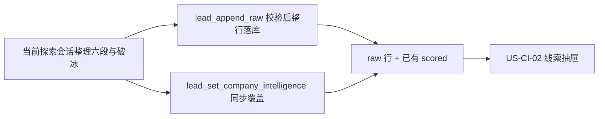
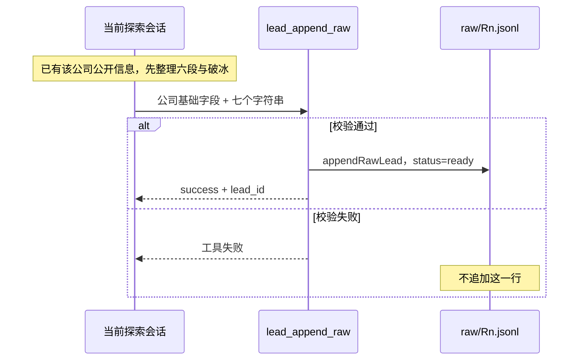

# US-CI-01 探索落库随写画像与破冰

> **用户故事**：[../29-需求-目标公司深度画像.md](../29-需求-目标公司深度画像.md) · US-CI-01 · Issue #3  
> **状态**：**待评审**（本文件只定设计；业务代码尚未按本文改动）  
> **范围**：当前探索会话里写好六段与破冰，经 MCP 与公司基础字段一次落库；同域名再次命中时同步覆盖  
> **依赖**：现网 `lead_append_raw` → `appendRawLead`；评分去重 `scoreAndDedupeLeads`；探索会话已在用的 `search-api.search_web` 与官网阅读  
> **不做**：线索页完整界面（[US-CI-02](US-CI-02-线索页画像展示与破冰改稿.md)）；旧线索打开时补生成；独立「生成 / 刷新」；付费工商库；代发邮件  
> **文档位置**：`docs/design/`

数据形态以本文 §4.1 为准。展示、空态文案、破冰保存 IPC 以 US-CI-02 为准，这里不重复界面。

画像在**当前** R1 / R2 / R3 探索会话里完成：模型先根据本轮已经看到的该公司信息整理六个字段和破冰，再调用 MCP。MCP 只做校验和落盘，不调用模型。

---

## 0. 相对现网

对照 `dev-0.5.8` 已落地的探索写线索路径（2026-10-07 读码）。

| 现网 | **本期（US-CI-01）** |
|------|----------------------|
| R1 / R2 / R3 判定为目标客户后调用 `lead-store.lead_append_raw`，`appendRawLead` 把**一行**追加到 `data/leads/{product_id}/raw/{round}.jsonl`。入参只有公司基础字段 | 同一次 `lead_append_raw` 写入公司基础字段 **和** 完整 `companyIntelligence`（六段 + `icebreak`，`status: 'ready'`）。成功返回时这一行已经齐 |
| 工具成功即表示这条线索已入库 | 校验通过才调用 `appendRawLead` 并返回成功。校验失败则工具失败，**不追加这一行** |
| `RawLead` / `ScoredLead` 没有画像、破冰、状态字段 | 在线索对象上增加嵌套对象 `companyIntelligence`（§4.1） |
| 同域名已在 `lead_list_raw` 里时，技能直接跳过，不再调用 `lead_append_raw` | 新公司仍只追加一行。同公司再次被探索命中时**不追加第二条 raw**，在当前会话里调用 `lead_set_company_intelligence` 同步覆盖（§3.3） |
| `rawLeadToScoredLead` 只拷贝公司、分数、联系方式等固定字段；`scoreAndDedupeLeads` 另保留生命周期 `status` 与 `people` | 评分去重把 raw 上的 `companyIntelligence` 拷进 `scored.json`。评分本身不调用模型 |
| 探索模型调用在桌面 `AgentRunController` 的**一条**会话里：`client.session.create` + `client.session.promptAsync`，然后按技能调 MCP | 画像沿用这条已经打开的探索会话。不另开会话 |
| 仓库没有 `workspace/skills/lead-company-intelligence/`，也没有目标公司画像字段 | 支持计划里的这个名字**尚未落地**。本期不新增该技能目录，也不把自家产品画像技能拿来充当目标公司画像 |
| `extract-product-profile` 写入 `data/products/{product_id}/profile.json`（卖方自己的产品画像） | 探索会话开头已经 `product_get` 的那份画像，只读着用来写第⑥段。不改 `profile.json` |
| `email-drafter.ts` 的 `draftEmailForLead` 已标明生产路径禁用（模板拼信） | 不复用该函数 |
| `lead-scorer.ts` 是加权评分，不是模型 | 不在评分函数里生成画像 |
| 公开检索是 MCP `search-api.search_web`（Tavily），探索判断客户时已经用过，并用 chrome 看过官网 | 六段与破冰用本轮已经拿到的这些事实。不为画像再开一轮抓取。不接工商库，不把邮箱 / 电话写进画像 |

现网接缝（需求优先，实现时按本节而不是按技能里的「跳过」原文）：

1. **落库成功点**仍是 `workspace/mcp-servers/lead-store/src/index.ts` 的 `lead_append_raw` 调到 `appendRawLead`（`lead-storage.ts`）并返回 `{ success, lead_id, raw_path }`。本期要求这次返回发生时，该行上的 `companyIntelligence.status` 已经是 `ready`。
2. **Zod 会丢掉未声明字段**。`appendRawLead`、`listRawLeads`、`saveScoredLeads` 都走 `RawLeadSchema` / `ScoredLeadSchema` 的 `parse`，默认剥掉未知键。字段不进 schema，下一次读或评分就会没了。校验必须发生在 `appendRawLead` 之前。
3. **线索页在评分之后看的是 scored 行**。`listLeadsSnapshot`（`desktop/electron/leads/leads-reader.ts`）对同一个 id 优先展示 `scored.json`，对应 raw 行不再单独出现。`rawLeadToScoredLead` 必须把对象拷进去。
4. **同公司再探索今天不会再次落库**。`discover-leads` / `discover-leads-r2` / `discover-leads-r3` 都要求先 `lead_list_raw`，同域名则跳过。`appendRawLead` 本身也只追加新 id（`generateLeadId`），不会按域名更新旧行。若实现仍按「跳过 = 什么都不做」，CI6（再次落库覆盖，含用户改过的破冰）和 CI7（旧线索要再探索并再次落库才有画像）都不会发生。
5. **桌面当轮提示词和技能文件是两处**。`agent-runner.ts` 的 `buildDiscoverLeadsPrompt`、`buildDiscoverLeadsR2Prompt`、`buildDiscoverLeadsR3Prompt` 会再写一遍「通过才 `lead_append_raw`」。只改 `SKILL.md` 时，提示词仍把模型往「跳过」上带。两处都要写明：本会话内先准备六段和破冰，再带上 `companyIntelligence` 调用工具。

---

## 1. 与相邻故事的分工



| 模块 | 本期 |
|------|------|
| **US-CI-01** | 同一次落库的字段、MCP 校验、同域名覆盖、失败时不留半条新线索；评分去重如何把对象带进 `scored.json` |
| **US-CI-02** | 抽屉按六字段只读展示；破冰编辑保存；`ready` / `failed` / 无对象。不负责生成 |
| **评分去重** | 继续去重、打分、保留生命周期 `status` 和 `people`。多拷贝 `companyIntelligence`。不在这里调用模型，也不给没对象的旧线索补一份 |
| **联系人 enrichment** | 仍写 `people[]` / 既有 `contacts`。画像对象不加邮箱、电话 |
| **开发信** | 仍走 `draft-outreach-email`。本文不代发 |

---

## 2. 已确认选型

需求 CI1–CI12 不动。O1 的实现路径于 2026-10-07 锁定为下表这一行。

| 项 | 决定 |
|----|------|
| **O1 时序** | **同一次 `lead_append_raw`** 写入公司基础字段 + 完整 `companyIntelligence`（六段 + `icebreak`，`status: 'ready'`）。模型在调用前就产出这七个字符串；MCP 严格校验。通过则整行落库并返回成功，此时字段已齐。失败则工具失败，**不落库**，不留下无画像的半条线索。生成发生在**当前探索会话**，经 MCP 落盘 |
| **O2 形态** | 嵌套对象 `companyIntelligence`（§4.1）。六段一一对应，另加 `icebreak`、`status`、可选 `errorMessage`、可选 `updatedAt`。不把六段拆成互不相关的顶层字段，也不把整份画像存成一段自由文本或 Markdown |
| **O3 通道** | 复用这条探索会话已经在用的模型，以及它已经调用过的公开检索 / 官网阅读 / `product_get`。结构化字段放在 MCP 工具参数里，由 `lead-store` 校验后再写入。不引入付费工商数据库。不新增桌面侧的另一条模型调用 |
| **O4 空态** | 没有 `companyIntelligence` 的旧线索保持没有。不在打开抽屉、不在启动、不在评分时补写。空态文案属于 US-CI-02 |
| **CI2** | 探索页、线索页都不加「生成画像」「刷新画像」 |
| **CI6** | 同公司再次经探索命中并调用 `lead_set_company_intelligence` 成功时，整份覆盖六段 + 破冰，包含用户已改的破冰，`status=ready` |
| **CI7** | 本版不扫描「没有该对象」的历史线索去做补生成。旧线索要在再次探索里被判为目标客户并走覆盖工具，才会有画像 |
| **CI8** | 新公司：校验失败只表现为工具失败，磁盘上没有这条线索，其它线索不动。已有线索的覆盖：校验失败则该条 `status=failed` 并写 `errorMessage`，六段与破冰恢复为进入本次覆盖之前的内容；公司字段、联系人、`people`、分数、生命周期 `status` 不改 |
| **CI11** | 朝六段方向写短文本即可。手工样例（Rufus & Coco）的事实密度不是验收标准 |
| **CI12** | 邮箱 / 电话仍只在现有 `contacts` 与 `people` |

实现落点：

| 项 | 落点 |
|----|------|
| **新线索** | `lead_append_raw` 的 `lead` 带上七个字符串。校验通过后 `appendRawLead` 把整行写入，对象里 `status` 为 `ready`，`updatedAt` 为 ISO 时间。成功返回里的 `lead_id` 对应该行 |
| **同公司** | 身份用现网 `getDedupeKey`（`lead-scorer.ts`）：`normalizeDomain(company.website \|\| source.url)`，否则公司名 trim 后小写，否则线索 id。`normalizeDomain` 在 `lead-id.ts`，会去掉 `www.` |
| **再次命中** | 不新增 raw 行、不新生成 `lead_*` id。当前会话调用 `lead_set_company_intelligence`。工具内部不调用模型 |
| **覆盖成功** | 校验通过后整对象替换六段 + `icebreak`，`status=ready`，去掉 `errorMessage` |
| **覆盖失败** | `status=failed`，`errorMessage` 为完整中文短句，六段与破冰恢复为调用前的正文 |
| **`pending`** | 类型里可以留着这个枚举值，避免以后读到旧值时 schema 直接崩。**本版主路径不写 `pending`。** 新线索落库成功时就是 `ready` |
| **会话** | 与正在跑的 R1 / R2 / R3 是同一条 OpenCode session（探索任务原本的那次 `session.promptAsync`）。不为画像再开一条会话，不在 `startEventBridge` 里入队，不做桌面侧串行队列，不在启动时扫描画像 |

---

## 3. 流程

### 3.1 新公司：同一次工具调用写齐



1. 探索会话仍按今天的步骤检索、打开官网、判断是不是目标客户。判断用到的摘要、页面和 `product_get` 就是写六段的材料。
2. 判为**不是**目标客户：不调用 `lead_append_raw`，也不调用覆盖工具。
3. 判为**是**，且 `lead_list_raw` 里还没有同域名：在本会话里写好七个字符串，再调用 `lead_append_raw`。某一段没有公开信息就写「暂无公开信息」。
4. MCP 先校验（§4.1）。通过才 `appendRawLead`。返回 `{ success, lead_id, raw_path }` 时，该行已含 `companyIntelligence.status === 'ready'`。
5. 校验失败：工具 `isError`，`appendRawLead` 不执行。jsonl 不增加这一行，也不写一份只有公司字段、没有画像的线索。探索会话看到工具错误后，可以改字段再调用一次；不要改成「先记下公司、画像以后再说」。
6. 这一条的失败不把整次探索运行标成 failed，不阻止 `exploration_finish`，也不阻止下一家。

`status` 由 MCP 在校验通过时写成 `ready`。模型传入别的 `status`、或漏掉七个字符串中的任何一个，都算校验失败。

### 3.2 本会话用哪些事实

六段和破冰只使用当前探索回合里已经有的内容：

- 搜索摘要、`source.snippet`、`match_reason`
- 已经打开的该公司官网公开页（遵守 `workspace/AGENTS.md`：验证码、登录墙、付费墙则停，不编造墙后的内容）
- 本回合已读的卖方 `product_get`，只用于第⑥段「合作机会」

不为画像单独再打一轮 `search_web` 或再开一遍官网。信息不够的那一段写「暂无公开信息」。

禁止把助手的 Markdown 正文、代码围栏或自拟标题结构当作工具参数以外的「画像正文」另存一份。落盘的只有 §4.1 的对象。

### 3.3 同公司再次命中（CI6 / CI7）

「同公司」= 上面的 `getDedupeKey` 相同。技能今天用 `lead_list_raw` 按官网域名判断「已有」。

本期把「已有则跳过」改成：

1. 仍不调用 `lead_append_raw`（避免新 id，避免和去重、`people`、开发信草稿的 `lead_id` 打架）。
2. 本次若仍判定为目标客户，在**当前探索会话**里先写好新的七个字符串，再调用：

```text
lead-store.lead_set_company_intelligence({
  product_id,
  lead_id,          // lead_list_raw 里已有的那条 id
  businessModel,
  productsBrands,
  targetMarket,
  supplyChain,
  industryPosition,
  collabOpportunity,
  icebreak
})
```

3. 工具内部不调用模型。它找到该 raw 行，以及 `scored.json` 里 **id 相同**或 **`dedupe_key` 相同**的那条（评分后用户看到的是这一条）。
4. 校验通过：这些记录上的 `companyIntelligence` 整份换成新的六段 + `icebreak`，`status=ready`，`updatedAt` 更新，删除 `errorMessage`。用户以前改过的破冰被换掉。`company`、`contacts`、`people`、分数、生命周期 `status` 不动。返回成功。
5. 校验失败：不采用本次入参里的正文。`status=failed`，写入 `errorMessage`，六段与 `icebreak` **恢复为这次调用之前的内容**（之前没有对象，则为空字符串）。返回工具失败，便于会话里看到原因。公司基础字段不动。
6. `lead_id` 不存在：工具失败，**不**新建线索。
7. 本次没有把这家判成目标客户：既不 `lead_append_raw`，也不 `lead_set_company_intelligence`。旧线索一直没有对象，就一直没有画像。

### 3.4 成功与失败

| 结果 | 磁盘 | 其它字段 |
|------|------|----------|
| 新公司，`lead_append_raw` 成功 | 新的一行，七个字符串都有值，`status=ready`，无 `errorMessage` | 与今天的线索字段一起写入 |
| 新公司，校验失败 | **没有**这一行 | 不产生新线索 |
| 已有线索，`lead_set_company_intelligence` 成功 | 同一 id 上六段与破冰已替换，`status=ready` | 公司字段、联系人、`people`、分数、生命周期 `status` 不动 |
| 已有线索，校验失败 | `status=failed`，`errorMessage` 为中文短句，六段与破冰是覆盖前的正文 | 同上 |

`errorMessage` 由 MCP 写成完整中文短句，例如 `目标公司画像未写入：缺少字段或不是规定的文本`。不把模型长文塞进 `errorMessage` 或某一段。

某段没有公开信息时，该段的值是「暂无公开信息」，这算有值，可以 `ready`。

### 3.5 评分去重时怎么带上

`scoreAndDedupeLeads` 会按 raw **重建** `scored.json`。`rawLeadToScoredLead` 必须把保留下来的那条 raw 上的 `companyIntelligence` 拷进去。

同时：

- raw 上没有这个对象，但旧的 scored（同 id，或同 `dedupe_key`）有：保留 scored 上的那份。否则一次「评分去重」会把已经写好的画像清掉。
- raw 上有：以 raw 为准。覆盖工具已经写回 raw 的新稿，会在下次评分后仍在。
- 评分不去改 `status`，也不调用模型。

`toDiscardedLead` 不拷贝画像。淘汰行在线索页没有六段时，按 US-CI-02 的空态显示。跟进用的是保留下来的那条。

人工编辑 raw（`saveRawLead` → `applyEdits`）今天用 `...existing` 展开原对象，顶层 `companyIntelligence` 会留下来。实现时不要改成按字段白名单重造整行。

---

## 4. 模块与接口

### 4.1 数据形态

加在 `RawLeadSchema` 与 `ScoredLeadSchema` 上，可选。旧文件没有该键时仍能 `parse`。

```ts
companyIntelligence?: {
  businessModel: string       // ①商业模式与体量
  productsBrands: string      // ②主营产品与品牌
  targetMarket: string        // ③目标市场与客户
  supplyChain: string         // ④供应链与采购倾向
  industryPosition: string    // ⑤行业地位与优势
  collabOpportunity: string   // ⑥合作机会与跟进建议
  icebreak: string            // 破冰话术
  status: 'pending' | 'ready' | 'failed'
  errorMessage?: string
  updatedAt?: string          // ISO
}
```

实现可以用等价命名，但必须与上表一一对应。`ready` 时七个字符串都必须存在。`pending` 只留给类型兼容，本版写入路径不产生它。

磁盘上不要出现 `markdown`、`body`、`profileText` 之类的整篇字段。写入前按这组键做严格校验，多出来的键整单失败，不把多余内容塞进某一段。

`ready` 的附加规则（在 `appendRawLead` / 覆盖写入之前判断）：

- 七个文本字段都是字符串，`trim` 之后长度都大于 0
- 「暂无公开信息」算通过
- 某一段超过 4000 字：整单失败，不截断后存成画像
- 不检查产品名、认证、零售商的条数（CI11）
- 新线索校验失败：不写行。覆盖校验失败：按 §3.3 恢复旧正文并标 `failed`

### 4.2 `lead_append_raw`

在现有参数上，`lead` 增加七个字符串（可包在 `companyIntelligence` 里，由 MCP 组装成 §4.1）。处理顺序：

1. 校验公司基础字段（保持今天对 `product_id`、来源 URL 等的要求）。
2. 校验七个字符串。失败则 `isError`，**不**调用 `appendRawLead`。
3. 通过后组装 `companyIntelligence`：七段用 trim 后的文本，`status: 'ready'`，`updatedAt` 为现在，不写 `errorMessage`。
4. `appendRawLead` 一次写入整行。schema 已包含该字段，避免 `parse` 把它剥掉。
5. 返回与今天相同的 `success`、`lead_id`、`raw_path`。

### 4.3 `lead_set_company_intelligence`

| 参数 | 说明 |
|------|------|
| `product_id` | 必填 |
| `lead_id` | 必填，必须是该产品 raw 里已有的 id |
| 七个字符串 | 与 §4.1 的六段 + `icebreak` 同名 |

找不到线索：`isError`，不新建。找到了：先记下当前 `companyIntelligence`（可能为空），再校验。

- 通过：`patch` 该 raw 行，以及 scored 里同 id 或同 `dedupe_key` 的那条，写入 `status=ready` 的新对象。返回成功。
- 失败：同一批记录写成 `status=failed` + `errorMessage`，六段与 `icebreak` 用调用前的值（没有则为 `''`），`updatedAt` 更新。返回 `isError`。

补丁按 id 改 jsonl 里的那一行（读行、替换、整文件写回），不追加第二行。`saveScoredLeads` 必须走已经包含 `companyIntelligence` 的 schema。

不修改 `company`、`source`、`contacts`、`people`、`score`、`score_breakdown`、`tier`、生命周期 `status`、`match_reason`。

### 4.4 提示词与技能

`workspace/skills/discover-leads/SKILL.md`、`discover-leads-r2/SKILL.md`、`discover-leads-r3/SKILL.md`，以及 `agent-runner.ts` 的 `buildDiscoverLeadsPrompt`、`buildDiscoverLeadsR2Prompt`、`buildDiscoverLeadsR3Prompt`，都写明：

- 画像在**本探索会话**内完成，不是桌面另开会话。
- 判为目标客户且域名尚未出现：先准备六段 + 破冰，再 `lead_append_raw`，参数里带上这七个字符串。
- 同域名已在 `lead_list_raw`，且本次仍是目标客户：调用 `lead_set_company_intelligence`，`lead_id` 用已有那条。不要跳过之后什么都不做，也不要再 `lead_append_raw`。
- 不是目标客户：两个工具都不调。

不新增给用户点的技能入口，不要求业务员再说一次「生成画像」。

`agent-runner.ts` 只改这三份提示词的文字。不在 `startEventBridge` 上为画像入队，不新增 `run*` 入口。

---

## 5. 文件清单

下表是**开发时预期会动**的现网文件。**本详设不改这些文件，交开发。**

| 文件 | 预期动作 |
|------|----------|
| `workspace/mcp-servers/lead-store/src/lead-types.ts` | `RawLead` / `ScoredLead` 增加可选 `companyIntelligence`；校验七个字符串的函数 |
| `workspace/mcp-servers/lead-store/src/lead-storage.ts` | 按 id 更新 raw 行与 scored 上同 id / 同 `dedupe_key` 的画像对象；评分结果带上该对象 |
| `workspace/mcp-servers/lead-store/src/lead-scorer.ts` | `rawLeadToScoredLead` 拷贝 `companyIntelligence` |
| `workspace/mcp-servers/lead-store/src/index.ts` | `lead_append_raw` 校验通过才整行落库；新增 `lead_set_company_intelligence` |
| `workspace/skills/discover-leads/SKILL.md` | 同会话先写六段再 `lead_append_raw`；同域名改为 `lead_set_company_intelligence` |
| `workspace/skills/discover-leads-r2/SKILL.md` | 同上 |
| `workspace/skills/discover-leads-r3/SKILL.md` | 同上 |
| `desktop/electron/opencode/agent-runner.ts` | 只改 `buildDiscoverLeadsPrompt` / `buildDiscoverLeadsR2Prompt` / `buildDiscoverLeadsR3Prompt` 的执行要求 |

建议单测放在 lead-store 现有的 `lead-storage.test.ts` / `lead-scorer.test.ts`（校验失败不追加行、覆盖失败恢复旧破冰、评分后对象还在）。不强制 Vue E2E。测试文件同样不在本详设里修改。

**明确不改**：`docs/29-需求-目标公司深度画像.md`；`LeadDetailDrawer.vue` 的完整界面（US-CI-02）；`extract-product-profile`；`email-drafter.ts`；`enrich-lead-contacts`；探索页按钮。不新增 `desktop/electron/leads/company-intelligence.ts`。

破冰保存 IPC 由 US-CI-02 加在桌面 `lead-writer.ts` 一侧。它只替换已有对象的 `icebreak` 与 `updatedAt`。

---

## 6. 验收对照

对照 `docs/29` 的 CI1、CI3、CI6、CI7、CI8、CI9、CI11、CI12，以及 US-CI-01 的验收要点。下列步骤是实现之后的手工或单测验收。**本 PR 不写代码，这里不声称已通过。**

### 6.1 建议单测

| # | 用例 | 期望 |
|---|------|------|
| T1 | 七段都有字，其中一段是「暂无公开信息」 | 校验通过，落盘 `status=ready` |
| T2 | 缺一个键、某个值不是字符串、多一个 `markdown` 键、某一段超过 4000 字 | 校验失败 |
| T3 | 对 `lead_append_raw` 传入 T2 那种画像 | 工具失败；对应 `raw/*.jsonl` **不**多出这一行 |
| T4 | 合法 `lead_append_raw` 后再跑 `scoreAndDedupeLeads` | `scored.json` 同一 id 上有同一份 `companyIntelligence`；`people` 与生命周期 `status` 仍按现网保留 |
| T5 | raw 没有对象、scored 有 | 再评分后 scored 上的对象还在 |
| T6 | 已有 `ready` 画像（含一句破冰）时，`lead_set_company_intelligence` 传入合法新七段 | 不新增 `lead_*` id；六段与破冰换成新值，`status=ready` |
| T7 | 同上，但新入参缺字段 | `status=failed` 且有 `errorMessage`；六段与破冰仍是调用前的内容；公司名、网址还在 |

### 6.2 手工

| # | 需求 | 步骤 | 期望 |
|---|------|------|------|
| M1 | CI1、O1 | 跑一轮 R1（或 R2 / R3），让一家新公司的 `lead_append_raw` 返回成功 | 返回当时，jsonl 该行已有公司基础字段，且 `companyIntelligence.status` 为 `ready`，七个字符串都在。不需要再等另一次任务 |
| M2 | CI3、O2、CI11 | 打开该行，以及评分后的 `scored.json` | 嵌套对象的六个键与 `icebreak` 都是字符串。没有一整块 Markdown 当画像。不按样例的事实密度判失败 |
| M3 | CI8 | 让模型对一家新公司交出缺字段的画像并调用 `lead_append_raw` | 工具失败。jsonl 没有这家新公司。已有其它线索的字段不变 |
| M4 | CI6 | 对已有画像（含手改破冰，手改步骤见 US-CI-02）的同域名公司再跑探索，并仍判为目标客户 | 不出现第二条同域名新线索。`lead_set_company_intelligence` 成功返回时，原线索六段和破冰已换成新内容，`status=ready`，手改破冰不保留 |
| M5 | CI6、CI8 | 对已有画像的公司调用覆盖工具，但七段不合法 | 工具失败。该线索 `status=failed`，`errorMessage` 为中文短句，六段和破冰仍是调用前的内容。公司名、网址、`contacts` 仍在 |
| M6 | CI7 | 准备一条没有 `companyIntelligence` 的旧线索，只打开线索页、只跑评分去重、探索时不再命中它 | 对象仍不出现 |
| M7 | CI9、CI12 | 看这次改动的依赖与落盘 JSON | 没有新的工商数据供应商。画像对象里没有邮箱、电话字段。没有代发 |
| M8 | CI2 | 探索页 | 没有「生成画像」「刷新画像」。时间线里的 `lead_set_company_intelligence` 只是再次命中时的工具名 |

US-CI-02 的抽屉文案、破冰保存不在本节重复。

---

## 7. 不做什么

| 项 | 说明 |
|----|------|
| 线索页六段布局、破冰输入框、空态句子 | US-CI-02 |
| 打开旧线索、启动、评分去重时给「没有对象」的线索补生成 | CI7 |
| 「生成 / 刷新」按钮或菜单 | CI2。`lead_set_company_intelligence` 只由当前探索会话在再次命中时调用 |
| 把模型 Markdown 原文存进线索 | O2 / O3 |
| 按 Rufus & Coco 式密度验收 | CI11 |
| 画像里新增邮箱、电话 | CI12。联系人仍走 `enrich-lead-contacts` |
| 付费工商库、代发开发信 | CI9 |
| 分段只刷新某一段 | 成功时六段与破冰一起替换 |
| 同公司再追加一条 raw | §3.3 |
| 另开探索之外的会话来写画像 | 画像在当前 R1 / R2 / R3 会话里完成 |
| 桌面队列、事件桥入队、启动时扫描 `pending`、先把无画像的行落库再异步回写 | 本版不采用。新线索要么整行 `ready`，要么不落库 |
| 新增 `desktop/electron/leads/company-intelligence.ts` | 校验与落盘在 `lead-store` |
| 主路径写入 `pending` | 枚举可保留；成功落库就是 `ready` |
| 改 `docs/29`、在本详设 PR 里改业务代码 | 文件清单交开发 |

---

## 8. 风险

| 风险 | 缓解 |
|------|------|
| 技能继续「同域名就跳过」，再探索永远不会覆盖 | §3.3 同时改三份技能和三份 `buildDiscoverLeads*`。M4 看的是原 id 被覆盖，而不是多了一行 jsonl |
| 模型先 `lead_append_raw` 只写公司、漏掉七段 | 缺字段时工具失败且不写行。提示词要求先准备字段再调用。M1 在成功返回时检查 `ready` |
| 校验失败把一家本可入库的公司丢掉 | 这是锁定行为：宁可不落库，也不留无画像的半条。会话里能看到工具错误，改完字段可以再调一次 |
| 覆盖失败把用户改过的破冰删掉 | T7 / M5：失败时恢复调用前的六段和破冰，只附加 `failed` 与 `errorMessage` |
| 只写了 raw，评分重建 scored 时丢字段 | schema 先加上；`rawLeadToScoredLead` 必须拷贝。T4 |
| 覆盖只改了 raw，抽屉仍显示旧的 scored | `lead_set_company_intelligence` 同时改同 id 与同 `dedupe_key` 的 scored 行 |
| Zod `parse` 剥掉未声明键 | 任何读改写都要走更新后的 schema。T4 在评分往返之后断言字段还在 |
| 时间线里出现 `lead_set_company_intelligence`，被看成新按钮 | 工具只在再次命中时由当前会话调用。线索页与探索页不加按钮（M8，界面验收在 US-CI-02） |
| 有人把 `pending` 当成还要等一次回写 | 本版成功返回即 `ready`。`pending` 不是主路径 |

---

## 9. 修订记录

| 日期 | 说明 |
|------|------|
| 2026-10-07 | 初稿。对齐 docs/29 的 CI1–CI12 与当时的 O1–O4。状态：待评审。 |
| 2026-10-07 | O1 改为同探索会话一次写入，去掉另开短会话。 |
