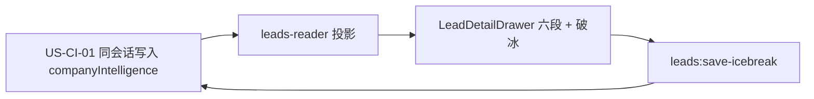

# US-CI-02 线索页画像展示与破冰改稿

> **用户故事**：[../29-需求-目标公司深度画像.md](../29-需求-目标公司深度画像.md) · US-CI-02 · Issue #3  
> **状态**：**待评审**（本文件只定设计；业务代码尚未按本文改动）  
> **范围**：线索详情按六个固定字段只读展示画像；破冰可编辑并保存；`ready` / `failed` / 无画像的展示  
> **依赖**：[US-CI-01](US-CI-01-探索落库随写画像与破冰.md) 写入的 `companyIntelligence`；现网 `LeadDetailDrawer.vue`、`listLeadsSnapshot`  
> **不做**：探索落库与生成（US-CI-01）；「生成 / 刷新」；旧线索补生成；付费工商库；代发邮件  
> **文档位置**：`docs/design/`

字段含义、谁在何时写入、再次落库如何整份覆盖，以 US-CI-01 为准。本文只规定线索页怎么读、怎么改破冰。

正常落库成功时对象已经是 `ready`。界面以 **`ready` / `failed` / 无对象** 三种为主。`pending` 不是本版主路径；若磁盘上读到，只当作异常或遗留。

---

## 0. 相对现网

对照 `dev-0.5.8` 的线索详情（2026-10-07 读码）。

| 现网 | **本期（US-CI-02）** |
|------|----------------------|
| `LeadDetailDrawer.vue` 只读区依次是：标识、公司、来源、`contacts`、`people`、匹配与评分、完整 JSON | 在「公司 company」和「来源 source」之间增加「目标公司画像」 |
| 公司简介是 `company.description` 一段；`match_reason` 是探索时的匹配说明 | 这两处保持原样。画像是另外六个字段，不用这两段代替 |
| 抽屉没有破冰输入。页脚在已评分线索上是「关闭 / 编辑联系人 / 补全联系人 / 写邮件」 | 破冰编辑放在画像区内，单独保存。页脚不增加生成类按钮，现有「写邮件」「补全联系人」仍在 |
| `phase==='raw'` 才能「编辑」公司字段，走 `saveRawLead`（`leads:save-raw`）。`phase==='scored'` 才能「编辑联系人」，走 `saveScoredPeople`（`leads:save-people`） | 这两条保存路径不承担破冰。破冰用新 IPC `leads:save-icebreak` |
| `LeadRow` / `LeadRowDto` 没有画像字段。完整对象在 `record` 里，抽屉用「展开」看 JSON | 读者把 `companyIntelligence` 投影成类型字段。界面按六个标签渲染，不把 `record` 的 JSON 当画像 |
| `listLeadsSnapshot` 对同一 id 优先用 `scored.json` 那一行 | 评分之后抽屉读到的是 scored 上的对象。US-CI-01 负责两边都写上 |
| 线索页每 8 秒 `refreshLeads`，并把打开中的抽屉换成同 id 的最新行（`LeadsView.vue`）。抽屉只在 **id 或 open** 变化时重置编辑，避免轮询用新对象引用打断编辑 | 六段和状态跟着当前 `lead` 更新。破冰框在用户已改字且未保存时，不被这 8 秒轮询盖掉 |
| 没有 `companyIntelligence` | 无对象时用固定空态句，没有按钮 |

现网接缝：

1. 抽屉的只读模板、编辑公司模板、编辑联系人模板是三套 `v-if`。画像只加在**只读**那一套。进入「编辑」或「编辑联系人」时，这节随只读区一起离开，避免和公司表单、people 表单缠在一起。
2. `saveRawLead` 的 `applyEdits` 会展开原对象。公司字段的「确认保存」不应删掉顶层 `companyIntelligence`。本故事不改那个表单的字段列表；实现公司保存时不要改成白名单重造整行（US-CI-01 已写同一约束）。
3. 轮询会替换 `detailLead`。六段若在打开时拷进本地 ref 且不再跟随 `lead`，再次覆盖之后抽屉仍停在旧正文。展示必须从当前 props 计算。
4. 淘汰行（`phase==='discarded'`）来自 `discarded.json`。US-CI-01 不把画像拷进淘汰记录。淘汰行按无画像空态显示即可。

---

## 1. 与 US-CI-01 的分工



| 模块 | 本期 |
|------|------|
| **US-CI-01** | 对象形状；新线索在 `lead_append_raw` 成功时已是 `ready`；同域名用 `lead_set_company_intelligence` 同步覆盖；覆盖失败为 `failed` 并恢复旧正文。本文不重复探索技能 |
| **US-CI-02** | 只读六段、破冰保存、`ready` / `failed` / 无对象。保存成功后的磁盘形态仍是 US-CI-01 的那个对象 |
| **线索列表** | 表格不加画像列，不加行内按钮。继续用现有 `refreshLeads` |
| **写邮件 / 补全联系人** | 页脚保持现网。它们不是画像的生成，也不是代发 |

---

## 2. 已确认选型

| 项 | 决定 |
|----|------|
| **O2 展示** | 只渲染 US-CI-01 §4.1 的六个字符串，每段一个固定标题。标题顺序固定为：①商业模式与体量 ②主营产品与品牌 ③目标市场与客户 ④供应链与采购倾向 ⑤行业地位与优势 ⑥合作机会与跟进建议。不渲染模型自拟的 Markdown |
| **O4 空态** | 无 `companyIntelligence`（含旧线索、淘汰行上没有对象）：画像区一行字「探索落库后会写入；本版不补旧线索。」其它区块（公司、来源、联系人、评分）照常。没有按钮，没有「去生成」的链接 |
| **CI2** | 抽屉、线索页工具栏、探索页都不出现「生成画像」「刷新画像」，也不用禁用按钮占位 |
| **CI4** | `status==='ready'` 时破冰可改。保存只写 `icebreak` 与 `updatedAt`。六段和 `status` 不变，直到 US-CI-01 的再次落库整份覆盖 |
| **CI5** | 有对象且 `ready`：六段只读 + 破冰可见 |
| **CI8** | `failed` 时展示 `errorMessage`。六段与破冰若仍有覆盖前的正文，照常只读（破冰按下面的表决定能否再保存）。不因此挡住关闭抽屉，也不改公司字段 |
| **CI11** | 不因某一段较短、或出现「暂无公开信息」而算界面失败 |
| **CI12** | 画像区不新增邮箱、电话输入。联系方式仍是现有 `contacts` 与 `people` 两节 |
| **主状态** | `ready`、`failed`、无对象。`pending` 本版主路径不写。读到时只显示一句「画像状态异常」，无按钮，不挡住其它区块 |
| **刷新** | 不新做推送通道。线索页已有的 8 秒轮询和探索结束时的 `refreshLeads` 会把同 id 的新内容带进抽屉 |

状态与界面：

| `companyIntelligence` | 画像区 | 破冰 |
|----------------------|--------|------|
| 无此对象 | 空态句（O4） | 不显示输入框 |
| `ready` | 六段只读。空字符串不应当出现；若某段缺失，该段显示「—」，并仍不提供生成按钮 | 多行输入框，初值为 `icebreak`。按钮「保存破冰」 |
| `failed` | 直接显示 `errorMessage`（MCP 已写成完整中文短句）。六段若有正文则只读展示，没有则各段「—」 | 仅当 `icebreak` 去空白后仍有字时可编辑并保存。保存后 `status` 仍是 `failed`，`errorMessage` 与六段不动。全空时不显示输入框 |
| `pending`（异常或遗留，本版不写） | 「画像状态异常」 | 不显示输入框 |

---

## 3. 界面

### 3.1 放在哪里

只读抽屉，「公司 company」定义列表之后、「来源 source」之前：

```text
公司 company
  name / website / country / description     ← 现网，不改

目标公司画像
  （空态 / 六段 / 失败说明 + 可能的六段；pending 仅异常一句）
  破冰话术
  [ 多行文本，仅 ready 或 failed 且已有破冰时 ]
  [ 保存破冰 ]

来源 source                                      ← 现网，不改
联系方式 contacts
关键联系人 people
匹配与评分
完整落盘数据 record
```

六段用与公司字段相同的 `dl` / `lead-drawer__field` 结构，标题用中文全称，正文用 `lead-drawer__multiline`。不要把六段拼成一个 `<pre>` 或一个 Markdown 视图。

「完整落盘数据」的展开 JSON 保持现网，供核对磁盘。它不是画像的正式展示；验收时以六个标题下的正文为准。

### 3.2 只读六段（`ready`，或 `failed` 且该段有字）

| 顺序 | 界面标题 | 字段 |
|------|----------|------|
| 1 | 商业模式与体量 | `businessModel` |
| 2 | 主营产品与品牌 | `productsBrands` |
| 3 | 目标市场与客户 | `targetMarket` |
| 4 | 供应链与采购倾向 | `supplyChain` |
| 5 | 行业地位与优势 | `industryPosition` |
| 6 | 合作机会与跟进建议 | `collabOpportunity` |

段与段之间只靠这六个标题区分。不另做折叠、不另做「复制全部画像」。

### 3.3 破冰

- 标签：「破冰话术」
- 控件：`textarea`，行数约 5。不设产品字数上限
- 「保存破冰」在请求进行中禁用，文案改为「保存中…」
- 成功：画像区内一行「已保存破冰」。重进抽屉或轮询之后仍是这次保存的文字，直到再次落库覆盖
- 失败：同一位置显示 IPC 返回的 `message`，输入内容留在框里
- 用户已改字且未保存时，`refreshLeads` 换了新的 `lead` 对象（id 不变）不得重置输入框。未改过则随 `lead.companyIntelligence.icebreak` 更新
- 只读六段始终读当前 `lead`，不跟破冰草稿绑在一起

页脚「写邮件」仍然只负责现有的开发信草稿，不读取、不提交破冰框里未保存的文字。

### 3.4 不出现的控件

画像区内以及线索页工具栏、探索页，都不要有：

- 生成画像、刷新画像、重试生成、补全画像
- 指向这些动作的链接或禁用按钮

`failed` 只展示 `errorMessage`，不提供重试。用户要更新画像，只能再探索并让该公司再次落库（US-CI-01 §3.3）。

---

## 4. 模块与 IPC

### 4.1 投影

`desktop/electron/leads/leads-reader.ts` 的 `LeadRow`，以及 `desktop/src/types/electron.d.ts` 的 `LeadRowDto`，增加可选字段，形状与 US-CI-01 §4.1 相同。

`loadRawLeads` 与 `loadScoredLeads` 从该行 JSON 的 `companyIntelligence` 读出。缺对象、或 `status` 不是 `pending` | `ready` | `failed`：投影为 `undefined`，界面走空态。不要把非法对象渲染成六段。

`loadDiscardedLeads` 不要求有这个字段。没有就是空态。

列表接口仍是现有 `leads:list` → `listLeadsSnapshot`。不新增「只拉画像」的 IPC。

### 4.2 保存破冰

新通道，放在现有线索保存旁边：

| 层 | 名称 |
|----|------|
| `desktop/electron/ipc/types.ts` | `LEADS_SAVE_ICEBREAK: 'leads:save-icebreak'` |
| `desktop/electron/main.ts` | `ipcMain.handle`，与 `LEADS_SAVE_RAW` 相邻 |
| `desktop/electron/preload.ts` | `saveLeadIcebreak` |
| `desktop/src/types/electron.d.ts` | 同名方法 |

入参：

```ts
{
  productId: string
  leadId: string
  icebreak: string
}
```

返回与 `saveRawLead` 同一风格：`{ ok: boolean, message: string, lead?: LeadRow }`。成功时 `lead` 为投影后的最新行，抽屉用它刷新本地展示。

主进程规则：

1. `productId` 或 `leadId` 为空：`ok: false`，`message` 说明缺哪个。
2. raw 与 scored 里都找不到该 id：`ok: false`，`message` 为「未找到线索」。
3. 没有 `companyIntelligence`：`ok: false`，`message` 为「这条线索还没有目标公司画像」。**不要**因此创建一个只有破冰的对象（那会变成给旧线索补写）。
4. `status==='pending'`：`ok: false`，`message` 为「画像状态异常，暂不能改破冰」。本版正常数据不会走到这里。
5. `status==='failed'` 且现有 `icebreak` 去空白后为空：`ok: false`，`message` 为「这条线索没有可保存的破冰」。
6. `status==='ready'`，或 `failed` 且已有破冰正文：`trim` 后为空则 `ok: false`，`message` 为「破冰不能为空」。否则只改 `icebreak`（保存 trim 后的文本）和 `updatedAt`（ISO）。`status`、`errorMessage`、六段保持不变。
7. 同一 id 若同时在 `raw/*.jsonl` 与 `scored.json`，两处都改。否则下次 `scoreAndDedupeLeads` 从 raw 重建时会把旧破冰拷回来（US-CI-01 §3.5）。有相同 `dedupe_key` 的 scored 行若 id 不同，也写上同一句破冰和同一个 `updatedAt`，六段仍不动。
8. 不调用模型，不改 `company`、`contacts`、`people`、分数、生命周期 `status`。

补丁放在桌面 `desktop/electron/leads/lead-writer.ts`（与 `saveRawLead` 相邻），按 id 改 jsonl 与 scored。不要走 `saveRawLead`：那条路径会提交整张公司表单。不要为这条 IPC 另建画像队列模块。

### 4.3 抽屉

`LeadDetailDrawer.vue`：

- 六段、空态、`failed`、异常 `pending` 全部由当前 `lead.companyIntelligence` 计算
- 破冰草稿用单独的 ref。`lead.id` 变化时从新线索同步（与现有 `watch` 只盯 id / open 的写法一致）
- 同 id 下，若草稿与上次同步值不同（用户改过），轮询来的新 `lead` 不覆盖草稿；没改过则把草稿更新为新的 `icebreak`
- 点击「保存破冰」调用 `window.ftcs.saveLeadIcebreak`。成功则 `emit('saved', lead)`，与公司保存一样让 `LeadsView` 走现有的保存后刷新
- `saveRawLead` / `saveScoredPeople` 的处理函数不读破冰框

样式优先用现有 `.lead-drawer__section`、`.lead-drawer__fields`、`.lead-drawer__multiline`、`.text-input` 一类。需要区分错误句时，再在 `desktop/src/styles/main.css` 加少量规则。不新做一套抽屉。

`LeadsView.vue` 不加按钮。8 秒轮询已经会换 `detailLead`，不必为画像再写一个定时器。

---

## 5. 文件清单

下表是**开发时预期会动**的现网文件。**本详设不改这些文件，交开发。**

| 文件 | 预期动作 |
|------|----------|
| `desktop/electron/leads/leads-reader.ts` | `LeadRow` 增加 `companyIntelligence`；raw / scored 投影 |
| `desktop/src/types/electron.d.ts` | `LeadRowDto` 与 `saveLeadIcebreak` |
| `desktop/src/components/shared/LeadDetailDrawer.vue` | 只读区插入画像；破冰草稿与保存 |
| `desktop/electron/ipc/types.ts` | `LEADS_SAVE_ICEBREAK` 与入参 / 结果类型 |
| `desktop/electron/main.ts` | 注册 `leads:save-icebreak` |
| `desktop/electron/preload.ts` | `saveLeadIcebreak` |
| `desktop/electron/leads/lead-writer.ts` | 只改已有对象的 `icebreak` + `updatedAt`，并写回 raw 与 scored |
| `desktop/src/styles/main.css` | **按需**。现有抽屉 class 够用则不改 |

建议把「只改破冰两字段」做成纯函数单测（给定一份 `ready` 对象和一句新破冰，输出里六段与 `status` 与输入相同）。不强制 Vue E2E。测试文件不在本详设里修改。

**明确不改**：`docs/29-需求-目标公司深度画像.md`；探索技能与 `buildDiscoverLeads*`（US-CI-01）；`extract-product-profile`；开发信起草与发信；`LeadsView.vue` 的工具栏按钮。不新增 `desktop/electron/leads/company-intelligence.ts`。

---

## 6. 验收对照

对照 `docs/29` 的 CI2、CI3、CI4、CI5、CI7、CI8、CI11、CI12，以及 US-CI-02 的验收要点。数据需先按 US-CI-01 写入。**本 PR 不写代码，这里不声称已通过。**

### 6.1 建议单测

| # | 用例 | 期望 |
|---|------|------|
| T1 | `ready` 对象上只提交新破冰 | 结果里仅 `icebreak` 与 `updatedAt` 变化；六段、`status` 与原对象一致 |
| T2 | 无 `companyIntelligence` | 保存函数拒绝，不创建对象 |
| T3 | 投影函数遇到缺少 `status` 的对象 | 当作没有画像 |

### 6.2 手工

| # | 需求 | 步骤 | 期望 |
|---|------|------|------|
| M1 | CI3、CI5 | 打开一条 `lead_append_raw` 已成功、`status=ready` 的公司线索（raw 尚未评分，以及评分后的 scored 各一次） | 六个中文标题下各有一段文字。不是单块 Markdown。公司、来源、联系人、people、评分仍在。打开时不必再等一次写入 |
| M2 | CI4 | 改破冰，点「保存破冰」，关掉再打开；等待超过 8 秒的列表刷新 | 仍是保存后的句子。六段与保存前一致 |
| M3 | CI4、CI6 | 在 M2 之后按 US-CI-01 对同一公司调用 `lead_set_company_intelligence` 并成功 | 破冰变为新写入的内容，`status` 仍为 `ready`，不再是 M2 的手改稿。保存按钮的存在不阻止这次覆盖 |
| M4 | O4、CI7 | 打开没有 `companyIntelligence` 的旧线索，以及一条淘汰行 | 公司等信息正常。画像区只有「探索落库后会写入；本版不补旧线索。」无输入框 |
| M5 | CI8 | 打开一条覆盖失败的线索：`status=failed`，`errorMessage` 有字，六段与破冰仍是失败前的正文 | 显示 `errorMessage`，六段仍在，破冰可改可存，保存后 `status` 仍是 `failed`。没有生成或重试按钮。抽屉可以关闭 |
| M6 | CI2 | 在线索页工具栏、抽屉页脚、画像区、探索页查找 | 没有「生成画像」「刷新画像」。页脚仍有现网的「写邮件」「补全联系人」（仅已评分且原本就有这些按钮时） |
| M7 | CI12 | 看画像区的字段 | 没有邮箱、电话的新输入。联系人仍在原来的两节 |
| M8 | 轮询 | `ready` 时改破冰但先不保存，等到一次列表刷新 | 输入框里仍是未保存的修改。未改过的六段随最新 `lead` 更新 |
| M9 | CI11 | 某一段正文就是「暂无公开信息」 | 该段照常显示。不出现密度不足的报错 |

M3 依赖 US-CI-01 的再次命中。两边都落地后再做这一条。

若有人手写一条 `pending` 进磁盘：画像区只有「画像状态异常」，无输入框、无按钮。这不是本版验收主路径。

---

## 7. 不做什么

| 项 | 说明 |
|----|------|
| 探索会话内如何整理六段、MCP 如何校验后落库 | US-CI-01 |
| 生成 / 刷新 / 重试按钮，含禁用占位 | CI2、O4 |
| 打开旧线索时自动补生成 | CI7。空态只有一句说明 |
| 把 `record` JSON 或 `company.description` 当成画像正文 | 六段只来自 `companyIntelligence` 的对应键 |
| 保存破冰时改六段或把 `failed` 改成 `ready` | §4.2 |
| 在画像区编辑邮箱、电话，或把破冰保存同步进 `people` | CI12 |
| 代发邮件、把未保存破冰塞进开发信草稿 | 页脚「写邮件」保持现网 |
| 表格中的画像列、导出 CSV 增加六段 | 本故事只做详情 |
| 淘汰行单独生成一份画像 | 无对象即空态 |
| 为 `pending` 做「正在写入」主界面，或据此加刷新按钮 | 本版成功落库即 `ready`。`pending` 只显示异常一句 |
| 另开探索之外的会话、桌面队列、先落库再异步回写 | 不属于本故事，也不是 US-CI-01 的路径 |
| 改 `docs/29`、在本详设 PR 里改业务代码 | 文件清单交开发 |

---

## 8. 风险

| 风险 | 缓解 |
|------|------|
| 只更新了 scored，下次评分从 raw 拷回旧破冰 | §4.2 第 7 条：同 id 的 raw 行与 scored 行一起改。M2 之后再跑一次评分去重，破冰仍是手改句 |
| 轮询把正在编辑的破冰打回已落盘的句子 | 只在 id 变化或草稿未修改时同步。M8 |
| 六段在打开时复制进本地，再次覆盖后抽屉仍是旧稿 | 六段从当前 `lead` 计算。探索结束后的 `refreshLeads` 会换上同 id 的新行 |
| 用「展开 JSON」验收画像，Markdown 混在 `record` 里也算通过 | 验收看六个标题。JSON 展开只作核对 |
| `failed` 时留一个输入框，被当成生成入口 | 仅在已有破冰正文时可编辑；旁边没有重试。M5 |
| 空态文案写成「点击生成」 | 文案固定为 O4 那一句。M4 |
| 把 `pending` 当成还要等画像写完 | 新线索以 `lead_append_raw` 成功且 `ready` 为准（US-CI-01 M1）。界面不为 `pending` 提供操作 |

---

## 9. 修订记录

| 日期 | 说明 |
|------|------|
| 2026-10-07 | 初稿。对齐 docs/29 的 CI2–CI5、CI7、CI8、CI11、CI12，以及 O2 / O4。展示依赖 US-CI-01 的数据形态。状态：待评审。 |
| 2026-10-07 | O1 改为同探索会话一次写入，去掉另开短会话。界面以 `ready` / `failed` / 无对象为主。 |
