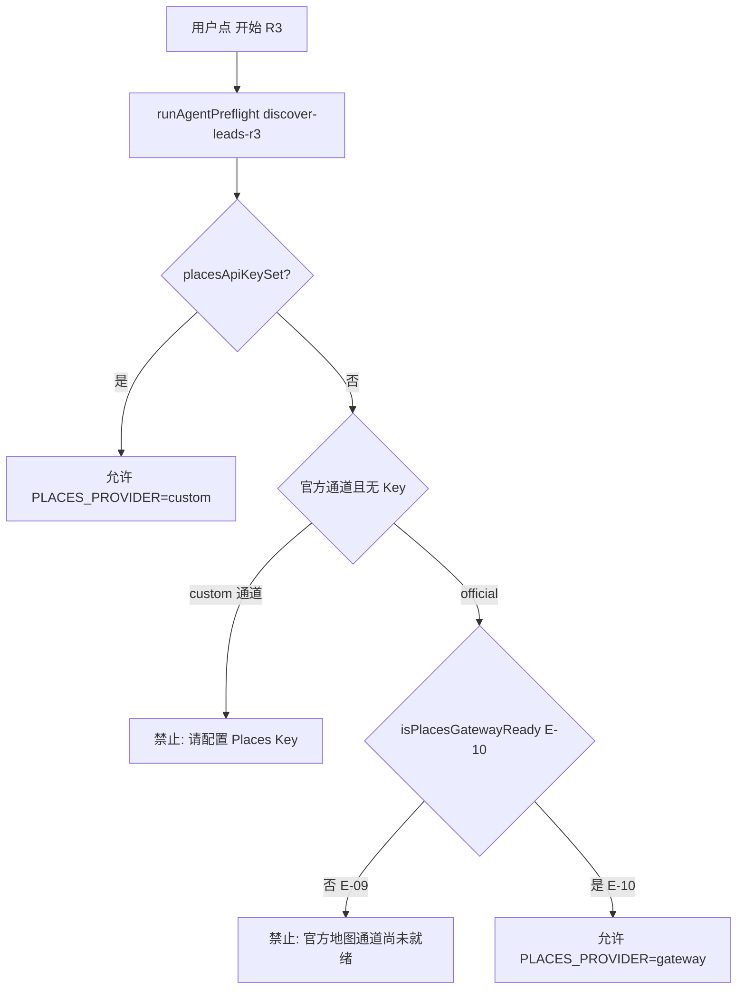

# US-E-09 探索页「开始 R3」与启动前 Preflight

> **用户故事**：[../17-需求-业务效率工具.md](../17-需求-业务效率工具.md) · US-E-09  
> **状态**：编码已落地（待手工联调验收）  
> **范围**：探索页显式「开始 R3」；桌面 **Preflight**（Places Key / 官方网关占位）；`agent-runner` 独立 R3 prompt；**不**实现 E-10 网关本身  
> **依赖**：US-E-06（R3 词预览）；US-E-07（places-api MCP + BYOK）；US-E-08（`discover-leads-r3` Skill）  
> **不做**：US-E-10 网关实现；R1/R2 结束后自动连跑 R3；改 `discover-leads-r2`；`ExplorationRun.api_usage` Places 计数字段（缓做，与 E-08 一致）  
> **文档位置**：`docs/design/`

---

## 0. 相对 E-08（Skill 已落地）

| E-08 现状 | **本期（E-09）** |
|-----------|------------------|
| Cursor / OpenCode **直调** `discover-leads-r3` | 探索页轮次下拉增加 **R3 地图发现**，按钮 **「开始 R3」** |
| 无 Preflight；无 Key 时 Skill 内报错 | 点击前 **Preflight 拦截**（与 R1/R2 同弹窗/文案模式） |
| 不改 `agent-runner` | 新增 `buildDiscoverLeadsR3Prompt` + `channel: 'r3'` |
| 任务 skill 仅直调时可见 | Agent 状态 / 占位卡片标 `discover-leads-r3` |

---

## 1. 已确认选型

| 项 | 决定 |
|----|------|
| **Q1 入口** | 与 R1/R2 共用 `ExploreStartControl`：下拉选 **R3 地图发现**，主按钮文案 **「开始 R3」**（R1/R2 仍为「开始探索」） |
| **Q2 Skill** | 独立 `discover-leads-r3`；**禁止**给 `discover-leads` 传 `rounds: ["R3"]` |
| **Q3 IPC** | `exploration:start-r3`，入参与 R2 相同（`productId`、`maxQueries`） |
| **Q4 Preflight 权威** | `desktop/electron/preflight/agent-preflight.ts` 的 `runAgentPreflight('discover-leads-r3')`；渲染进程 `ensureAgentReady` + 主进程 `gateAgentStart` **双检同一函数** |
| **Q5 Places 自定义** | `channelMode=custom` 且无 `placesApiKeySet` → **禁止**；文案：「请先在设置 → 探索中配置 Google Places API Key（仅 R3 需要）」 |
| **Q6 Places BYOK on 官方** | 与 E-07 Q9 一致：**已配 Places Key 则一律 `PLACES_PROVIDER=custom` 直连**，不要求官方网关 |
| **Q7 官方无 Key** | **禁止**；文案：R3 须 BYOK Places Key；**不提供**官方代调（[US-E-10 无限期延后](US-E-10-Places官方网关.md)） |
| **Q8 官方 gateway** | `isPlacesGatewayReady()` **恒 false**；`PLACES_PROVIDER=gateway` 不实现；MCP 占位返回 `PLACES_GATEWAY_NOT_READY` |
| **Q9 不强迫配 Key** | Preflight **仅**在 `discover-leads-r3` 触发；R1/R2/扩展/评分 **不**检查 Places |
| **Q10 MCP** | R3 Preflight 额外检查：`places-api` connected；仍检查 `lead-store`、`search-api`、`chrome-devtools` |
| **Q11 无 R3 词** | 按钮 disabled；原因：「当前没有 R3 地图发现词，请重新扩展关键词」 |
| **Q12 max_queries** | 与 R1/R2 相同：留空=该轮全部词；有上限时 `min(上限, R3 合格词数)` |
| **Q13 合格 R3 词** | `round=R3` 且无 `site_id`（与 Skill Step 1 一致） |
| **Q14 工作区模板** | 本故事 **不 bump** 模板版本（Skill 已在 E-08 bump） |

---

## 2. Preflight 决策表



| 模型通道 | Places Key | 网关 Places（E-10） | 结果 |
|----------|------------|---------------------|------|
| 自定义 | 无 | — | **禁止** |
| 自定义 | 有 | — | **允许** custom |
| 官方 | 有 | — | **允许** custom（BYOK） |
| 官方 | 无 | 未就绪 | **禁止**（E-09 默认） |
| 官方 | 无 | 就绪且余额通过 | **允许** gateway（E-10） |

---

## 3. agent-runner

### 3.1 `buildDiscoverLeadsR3Prompt`

与 [US-E-08](US-E-08-discover-leads-r3-Skill.md) Step 0～7 对齐的压缩指令；会话 title：`discover-leads-r3 · {productId}`。

### 3.2 `runDiscoverLeads` 扩展

```typescript
options?: { channel?: 'r1' | 'r2' | 'r3'; maxQueries?: number }
```

- `channel: 'r3'` → skill `discover-leads-r3`，rounds `['R3']`，roundName `R3 地图发现`
- `availableCount` = 合格 R3 词数；为 0 时抛错与 Skill 一致

---

## 4. UI 变更

| 文件 | 变更 |
|------|------|
| `ExploreStartControl.vue` | 下拉增加 R3；R3 时按钮「开始 R3」 |
| `useExploreStart.ts` | `r3QueryCount`、`canStartR3`、`startR3()`、localStorage 可记 R3 |
| `ExploreView.vue` | R3 启动占位卡片；最多词数 placeholder 含 R3 |
| `useWorkspace.ts` | pipeline / exploring 识别 `discover-leads-r3` |
| `LeadsView.vue` | 探索完成后 refresh 含 R3 |

**不改**：设置页 Places 区（E-07 已有）；R4 仍不可执行。

---

## 5. 验收用例

| # | Given | When | Then |
|---|--------|------|------|
| U1 | 有 R3 词 + 有效 Places Key + MCP 就绪 | 探索页选 R3 → 开始 R3 | Preflight 通过；Agent 跑 `discover-leads-r3`；任务列表出现 R3 运行 |
| U2 | 有 R3 词、无 Places Key、自定义通道 | 点开始 R3 | Preflight 失败；**不**创建 session |
| U3 | 有 R3 词、无 Places Key、官方通道 | 点开始 R3 | Preflight 失败；提示官方地图通道未就绪 |
| U4 | 无 R3 词 | 选 R3 | 按钮 disabled，说明重新扩展 |
| U5 | 只跑 R1/R2、无 Places Key | 开始 R1/R2 | 与现网一致，**不**检查 Places |
| U6 | U1 完成且官网判断通过 | 查 raw | `raw/R3.jsonl` 有新行 |
| U7 | 从未点 R3 | 浏览设置 | **无**强迫弹窗（Key 仍可选填） |

---

## 6. 编码任务顺序

1. `agent-preflight.ts`：`discover-leads-r3` + `resolvePlacesStart` + MCP `places-api`  
2. `agent-runner.ts`：R3 prompt + `channel: 'r3'`  
3. IPC / `main.ts` / `preload` / `electron.d.ts`  
4. `useExploreStart` + `ExploreStartControl` + `ExploreView` + `useWorkspace`  
5. 更新 expand-keywords 汇报句、Skill 去掉「尚未接入」、17/05/E-08 状态  
6. **手工 U1–U7** 联调  

---

## 7. 相关文档

- Skill：[US-E-08-discover-leads-r3-Skill.md](US-E-08-discover-leads-r3-Skill.md)  
- Places MCP：[US-E-07-Places-MCP自定义Key.md](US-E-07-Places-MCP自定义Key.md)  
- 官方网关（无限期延后）：[US-E-10-Places官方网关.md](US-E-10-Places官方网关.md)  
- 需求 §5.7 / §14：[../17-需求-业务效率工具.md](../17-需求-业务效率工具.md)
