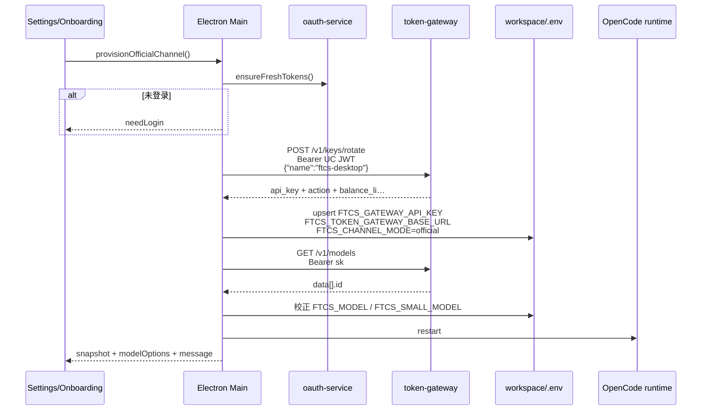

# US-G1-02 官方通道开通接入设计

> **用户故事**：[../12-官方模型通道用户故事.md](../12-官方模型通道用户故事.md) · US-G1-02  
> **状态**：编码已落地 · 开通 rotate + models 拉取；默认网关 `https://token.ai-utills.com/v1`  
> **范围**：UC 已登录 → `POST /v1/keys/rotate`（`name=ftcs-desktop`）→ 写入本机网关 `sk-` 与 baseURL → 叠 OpenCode；开通后 `GET /v1/models` 填充官方模型下拉；替换 G1-01 本机 `8088` 默认与写死 catalog 主路径  
> **需求映射**：[../11-官方模型通道对接.md](../11-官方模型通道对接.md) FR-DESKTOP-02；§4.1～4.2；AT-08 / AT-D-01  
> **依赖**：US-G0-06（rotate）、US-G0-08（sk）、US-G0-10（扣费可用）、US-G0-17（models）、US-G1-01（通道 UI / 登录引导）  
> **不做**：余额 / 今日用量 UI（G1-03）；402 文案（G1-04）；自定义通道行为改动（G1-05）；网关改接口  
> **文档位置**：`docs/design/`

---

## 0. 相对 G1-01 的增量

| G1-01（已落地） | **G1-02（本期）** |
|-----------------|-------------------|
| 官方 / 自定义二选一；未登录「去登录」 | **开通**：rotate + 写 `FTCS_GATEWAY_API_KEY` |
| `officialProvisioned` = 是否已有 gateway sk | 真正写入 sk；UI「开通官方通道 / 重置凭证」 |
| 模型下拉 = 本地 `OFFICIAL_MODEL_CATALOG` | 主路径 = `GET /v1/models`（sk） |
| OpenCode 官方 baseURL 默认 `http://127.0.0.1:8088/v1` | 默认 **`https://token.ai-utills.com/v1`**（**含** `/v1`，代码不再拼接） |

网关侧 rotate / models **已编码**；本期只做 Desktop 消费方。

---

## 1. 已确认选型

| 项 | 决定 |
|----|------|
| **Q1 Key name** | 固定 **`ftcs-desktop`**（与 OAuth `client_id` 一致）；客户端不可改 |
| **Q2 rotate 鉴权** | UC `access_token`（`Authorization: Bearer`）；主进程 `ensureFreshTokens` + 参考 inbox 的 401 刷新重试 |
| **Q3 models 鉴权** | **仅网关 sk**（与 G0-17 一致；**不能**用 UC JWT 调 models） |
| **Q4 网关 baseURL** | 环境变量 **`FTCS_TOKEN_GATEWAY_BASE_URL`**；**默认** `https://token.ai-utills.com/v1`（**须含** `/v1`；与 OpenAI 兼容 base 一致） |
| **Q4b 路径拼接** | 代码**只**做去尾 `/`，再拼相对路径（`/keys/rotate`、`/models` 等）；**不**在代码里硬编码追加 `/v1` |
| **Q5 baseURL 解析优先级** | 工作区 `.env` → 进程环境 → 代码默认 `https://token.ai-utills.com/v1`；开通成功后**写回工作区**（含 `/v1`） |
| **Q6 sk 存储** | 工作区 `.env` 键 **`FTCS_GATEWAY_API_KEY`**；明文仅本机；设置页只展示掩码 /「已开通」，**不**提供明文回显 |
| **Q7 开通触发** | **显式按钮**「开通官方通道」；**不**在登录成功后静默 rotate（避免无意重置远端已有 Key） |
| **Q8 重置** | 已开通时提供「重置网关凭证」：二次确认后同一 `rotate`；成功后旧 sk 作废并刷新 models |
| **Q9 开通后动作** | 写 `.env` → 拉 models → 校正 `FTCS_MODEL` / `FTCS_SMALL_MODEL`（不在列表则取首项）→ **重启 OpenCode** → 刷新 SettingsSnapshot |
| **Q10 模型 id 落盘** | 网关返回裸 id（如 `deepseek-v4-pro`）；落盘 **`deepseek/{id}`**（与 G1-01 习惯一致）；OpenCode prefs 再映射为 `ftcs-gateway/{id}` |
| **Q11 未开通时下拉** | 禁用模型下拉；提示「开通后从网关加载模型」；**不**调 models |
| **Q12 拉 models 失败** | 可读错误；**可**短暂保留上次成功缓存或本地兜底表仅用于展示；**禁止**静默改走自定义 / 自备 DeepSeek Key |
| **Q13 本地兜底表** | `OFFICIAL_MODEL_CATALOG` 降为 **离线兜底**；主路径与验收必须以接口为准 |
| **Q14 IPC** | 主进程封装 gateway client；渲染层不直连网关、不接触 UC refresh 细节 |

---

## 2. 目标与非目标

### 2.1 目标

1. 已登录用户可一键开通官方通道，拿到可用网关 sk。  
2. OpenCode 官方分支使用可配置网关 `/v1` + sk，能跑通画像→探索→邮件（联调依赖网关余额）。  
3. 官方模型 / 轻量模型下拉来自 `GET /v1/models`。  
4. 丢 Key / 换机：同一「重置」路径自助恢复。  
5. 未登录仍走 G1-01「去登录」；不静默失败。

### 2.2 非目标

| 不做 | 归属 |
|------|------|
| `usage/me` 余额卡片 | G1-03 |
| Chat 402 / 余额不足横幅 | G1-04 |
| 改网关 rotate / models 契约 | token-gateway |
| 多 Key name / 多设备 Key 列表 | 网关 G0-18（若有） |
| 在线充值 | 人工入账 |

---

## 3. 流程

### 3.1 开通（主路径）



### 3.2 拉模型（已开通）

```text
打开设置「模型通道」或保存前刷新：
  if channelMode!=official → 跳过
  if !sk → 清空远程 options，展示未开通
  else GET /v1/models with sk
    ok → 写入内存/快照 modelOptions；必要时校正已选 model
    401/403 → 提示凭证失效，引导「重置网关凭证」
    其它错误 → 展示 message；可选兜底 catalog + 醒目「未从网关更新」
```

### 3.3 丢 Key / 换机

与开通同一 `rotate`；UI 文案强调：**将作废本机与其它设备上同一 name 的旧 sk**。

---

## 4. 网关约定（消费方摘要）

权威设计：

- rotate：[token-gateway/docs/design/US-G0-06-按名签发重置Key设计.md](../../token-gateway/docs/design/US-G0-06-按名签发重置Key设计.md)  
- models：[token-gateway/docs/design/US-G0-17-models白名单列表设计.md](../../token-gateway/docs/design/US-G0-17-models白名单列表设计.md)

### 4.1 `POST {base}/keys/rotate`

| 项 | 值 |
|----|-----|
| URL | `{FTCS_TOKEN_GATEWAY_BASE_URL}/keys/rotate`（base **已含** `/v1`） |
| Header | `Authorization: Bearer {access_token}`，`Content-Type: application/json` |
| Body | `{"name":"ftcs-desktop"}` |
| 200 | `action`=`created`\|`rotated`，`api_key`，`prefix`，`user.balance_li` 等 |
| 典型错误 | 401 身份；400 `invalid_name`；403 `account_disabled`；409 冲突重试耗尽 |

### 4.2 `GET {base}/models`

| 项 | 值 |
|----|-----|
| Header | `Authorization: Bearer {sk-…}` |
| 200 | `{ object:"list", data:[{ id, object:"model", owned_by }] }` |
| 典型错误 | 401 无效 sk；403 key/账户禁用 |

> **注意**：`docs/01` 曾写 models「Key 或 UC」；**以实现与 G0-17 为准：仅 sk**。开通顺序必须先 rotate 再 models。

### 4.3 baseURL 形态

| 正确（配置值） | 错误 |
|----------------|------|
| `https://token.ai-utills.com/v1` | `https://token.ai-utills.com`（缺 `/v1`，会导致 `/keys/rotate` 打到错误路径） |
| `http://127.0.0.1:8088/v1`（本地联调） | `https://token.ai-utills.com/v1/chat/completions`（不要配到具体接口） |

运行时：

```text
base = trimTrailingSlash(FTCS_TOKEN_GATEWAY_BASE_URL || 'https://token.ai-utills.com/v1')
# 直接使用 base；OpenCode options.baseURL = base
# HTTP：base + '/keys/rotate'、base + '/models' …
```

解析辅助：`getTokenGatewayBaseUrl()`（与 `site-origins.ts` 同风格），**禁止**再 `+ '/v1'`。

---

## 5. Desktop 数据与配置

### 5.1 工作区 `.env`

| 键 | 写入时机 | 说明 |
|----|----------|------|
| `FTCS_CHANNEL_MODE=official` | 开通时强制 | 与 UI 一致 |
| `FTCS_GATEWAY_API_KEY` | rotate 成功 | 明文 sk；`officialProvisioned` 仍由此推导 |
| `FTCS_TOKEN_GATEWAY_BASE_URL` | 开通时写入当前解析值 | 便于 sidecar / 重启后一致 |
| `FTCS_MODEL` / `FTCS_SMALL_MODEL` | 开通后按列表校正 | `deepseek/{id}` |

自定义通道键（`FTCS_CUSTOM_API_KEY` 等）**开通时不删除**（与 G1-01 A6 一致）；仅官方分支不读它们。

### 5.2 桌面安装 / 开发环境

在 `desktop/.env.example`（及 development 如需要）补充：

```env
# Token 网关 OpenAI 兼容 base（须含 /v1）。默认 https://token.ai-utills.com/v1
# FTCS_TOKEN_GATEWAY_BASE_URL=https://token.ai-utills.com/v1
```

本地联调可设为 `http://127.0.0.1:8088/v1`。

### 5.3 类型扩展（建议）

```ts
export interface OfficialModelOption {
  id: string        // 落盘用 deepseek/{rawId} 或 UI 内再拼
  rawId: string     // 网关 data[].id
  label: string     // 可用 rawId 或映射表美化
}

export interface SettingsSnapshot {
  // …G1-01 已有
  officialProvisioned: boolean
  gatewayBaseUrl: string           // 解析后的只读展示
  gatewayKeyMasked: string         // 可选；或仅用 officialProvisioned
  modelOptions: OfficialModelOption[] | Array<{ id; label }>
  smallModelOptions: …             // 官方：与 models 同源列表（用户自选主/轻量）
  officialModelsSource: 'gateway' | 'fallback' | 'none'
  officialModelsError?: string
}

export interface ProvisionOfficialResult {
  ok: boolean
  needLogin?: boolean
  message: string
  action?: 'created' | 'rotated'
  settings: SettingsSnapshot
}
```

`SettingsSaveInput` **仍不接收** gateway sk（禁止渲染进程把明文当表单提交）；开通走独立 IPC。

---

## 6. 主进程模块设计

### 6.1 新增 `desktop/electron/gateway/`（建议）

| 文件 | 职责 |
|------|------|
| `gateway-config.ts` | `getTokenGatewayBaseUrl()` 默认 `https://token.ai-utills.com/v1`（不去拼 `/v1`） |
| `gateway-client.ts` | `rotateKey({ accessToken, name })`、`listModels({ apiKey })`；统一错误映射 |
| `official-channel-service.ts` | `provisionOfficialChannel({ confirmRotate? })`、`refreshOfficialModels()`：拼鉴权、写 env、校正模型、触发 OpenCode 重启 |

错误映射（对 UI 文案）：

| 网关 / 网络 | UI 提示方向 |
|-------------|-------------|
| needLogin / 401 UC | 引导「去登录」 |
| 403 `account_disabled` | 账户已禁用，联系运营 |
| 401 sk / models | 凭证失效，请重置网关凭证 |
| 409 | 稍后重试 |
| 网络失败 | 检查网关地址 / 网络 |
| 空 `data[]` | 开通成功但暂无可用模型，联系运营检查价目与白名单 |

### 6.2 鉴权复用

对齐 `inbox-service`：

1. `ensureFreshTokens()` 取 access  
2. 请求带 Bearer  
3. 若 401：`ensureFreshTokens({ force: true })` 后重试一次  
4. 仍 401 → `needLogin`

### 6.3 IPC（建议 channel 名）

| Channel | 方向 | 说明 |
|---------|------|------|
| `gateway:provision-official` | invoke | 开通 / 重置（入参可带 `reset: boolean` 供主进程区分文案；调用同一 rotate） |
| `gateway:refresh-official-models` | invoke | 仅刷新列表（已有 sk） |
| 现有 `settings:get` / `save` | — | snapshot 增加网关相关只读字段；save 不写 sk |

preload / `electron.d.ts` / `useAuth` 旁可增加薄封装，或 `useOfficialChannel.ts`。

### 6.4 OpenCode prefs

改动 `user-opencode-prefs.ts`：

```text
gatewayBase = getTokenGatewayBaseUrl(env)  // 默认 https://token.ai-utills.com/v1
不再硬编码 127.0.0.1:8088 为生产默认
```

有 sk + model 时继续叠 `ftcs-gateway` provider（G1-01 已有骨架）。

开通 / 重置成功后调用现有 restart OpenCode 路径（与 `saveSettings` 后重启一致）。

---

## 7. UI / 引导

### 7.1 设置 · 模型通道（官方）

| 状态 | 展示 |
|------|------|
| 未登录 | G1-01：说明 +「去登录」（不变） |
| 已登录 · 未开通 | 「未开通」+ 主按钮 **开通官方通道**；模型下拉禁用 |
| 已开通 | 「已开通」+ 掩码/前缀提示；模型下拉启用（gateway 列表）；次要按钮 **重置网关凭证**（确认框） |
| models 错误 | `active-banner` 错误文案 +「重试加载模型」 |

文案草案：

| 场景 | 文案 |
|------|------|
| 开通中 | 正在开通官方通道… |
| 开通成功 `created` | 官方通道已开通。 |
| 开通成功 `rotated` | 网关凭证已更新（旧 Key 已作废）。 |
| 重置确认 | 将重新签发网关 Key，本机及其它设备上的旧凭证立即失效。是否继续？ |
| 未开通下拉 | 开通后从网关加载可选模型 |

### 7.2 首次引导 · 步骤 2

与设置同态：登录后出现 **开通官方通道**；未开通不可「保存并继续」进入依赖模型的后续（或允许继续但 preflight 仍会拦 Agent——**建议**：官方模式下未开通时主按钮为「开通官方通道」，开通成功后再「保存并继续」）。

搜索 Key（Tavily）逻辑不变。

### 7.3 登录回来

不自动 rotate。用户点「开通」即可。若产品后续要「登录后自动开通」，需另开变更（与 Q7 冲突）。

---

## 8. Preflight

保持 G1-01 条件，文案收紧：

| 模式 | 通过 | 失败文案 |
|------|------|----------|
| official | `officialProvisioned && model` | 未登录 → 去登录；已登录未开通 → **请开通官方通道（设置 → 模型通道）**；已开通无模型 → 重试加载或联系运营 |
| custom | 不变 | — |

不在 preflight 内隐式 rotate（副作用过大）。

---

## 9. 须改动的文件（编码清单）

| 文件 | 变更 |
|------|------|
| `desktop/electron/gateway/*`（新建） | config / client / official-channel-service |
| `desktop/electron/config/site-origins.ts` 或 `gateway-config.ts` | 默认网关 baseURL |
| `desktop/electron/config/user-opencode-prefs.ts` | 默认 URL 切换；沿用 sk 叠配 |
| `desktop/electron/settings/settings-service.ts` | snapshot 扩展；不在 save 写 sk |
| `desktop/electron/main.ts` + `ipc/channels` + `preload.ts` + `src/types/electron.d.ts` | 注册 provision / refresh-models |
| `desktop/src/views/SettingsView.vue` | 开通 / 重置 / 模型源 |
| `desktop/src/components/onboarding/OnboardingOverlay.vue` | 同上 |
| `desktop/src/types/settings.ts` | 类型；catalog 标兜底 |
| `desktop/electron/preflight/agent-preflight.ts` | 文案 |
| `desktop/.env.example` | 文档化 `FTCS_TOKEN_GATEWAY_BASE_URL` |
| `docs/12` | 详细设计链接与状态 |
| （可选）`desktop/designs/ftcs-console.pen` | 开通 / 重置态若与现稿不一致再补 |

---

## 10. 验收用例

| # | Given | When | Then |
|---|--------|------|------|
| B1 | 已登录、官方、未开通 | 点「开通官方通道」 | rotate 成功；`.env` 有 sk 与 baseURL；OpenCode 可起；`officialProvisioned=true` |
| B2 | 未登录、官方 | 点开通（若露出）或仅去登录 | 不调 rotate；引导登录（AT-D-01） |
| B3 | 已开通 | 打开设置模型下拉 | 选项来自 `GET /v1/models`（非仅本地写死） |
| B4 | 已开通 | 点重置并确认 | 新 sk；旧 sk 调 models/Chat 失败；UI 仍可用 |
| B5 | 网关 base 未配置 | 开通 / 叠配 | 使用 `https://token.ai-utills.com/v1` |
| B6 | 本地联调改 env 为 `http://127.0.0.1:8088/v1` | 开通 | 请求打到本机网关 |
| B7 | models 返回空 | 开通后 | 成功开通但提示无模型；不回落自定义 Key |
| B8 | 官方已开通 | 跑画像→探索→邮件 | AT-08；网关日志可见 `ftcs-desktop` |
| B9 | 自定义通道 | 任意操作 | 不调 rotate / models（为 G1-05 铺垫） |
| B10 | 引导步骤 2 官方已登录 | 开通 → 保存并继续 | 可进入 tour；preflight 模型检查通过 |

---

## 11. 编码任务顺序

1. `gateway-config` + `gateway-client`（rotate / models + 错误映射）  
2. `official-channel-service` 写 `.env` + 校正模型 + 重启 OpenCode  
3. IPC / preload / 类型  
4. `SettingsView` 开通 / 重置 / 下拉数据源  
5. `OnboardingOverlay` 同步  
6. 默认 baseURL 替换 `127.0.0.1:8088`；`.env.example`  
7. preflight 文案；联调 AT-08  
8. 更新本故事 / 设计状态为「编码已落地」

---

## 12. 风险与注意

| 风险 | 缓解 |
|------|------|
| rotate **每次**作废旧 sk | 开通用独立按钮；重置二次确认；文案说清 |
| models 仅 sk | 严格串行：先写 sk 再拉列表 |
| 余额为 0 仍可开通 | 允许；真正 Chat 失败留给 G1-03/04 |
| 工作区切换 | provision 写入**当前** workspace `.env`；切换工作区后需重新开通或拷贝 env |
| 明文 sk 进 `.env` | 与现网自定义 Key 同级；不进日志、不进遥测、不上传 |

---

## 13. 已确认点汇总

| # | 议题 | 决定 |
|---|------|------|
| Q1 | name | 固定 `ftcs-desktop` |
| Q2 | 默认网关 | `https://token.ai-utills.com/v1`（**含** `/v1`；代码不拼接） |
| Q3 | models | 开通后 sk 拉取；废弃写死表为主路径 |
| Q4 | 开通时机 | 显式按钮，登录后不静默 rotate |
| Q5 | 重置 | 同 rotate + 确认框 |
| Q6 | 存储 | 工作区 `FTCS_GATEWAY_API_KEY` + 写回 baseURL |
| Q7 | 落盘模型 id | `deepseek/{gatewayId}` |
