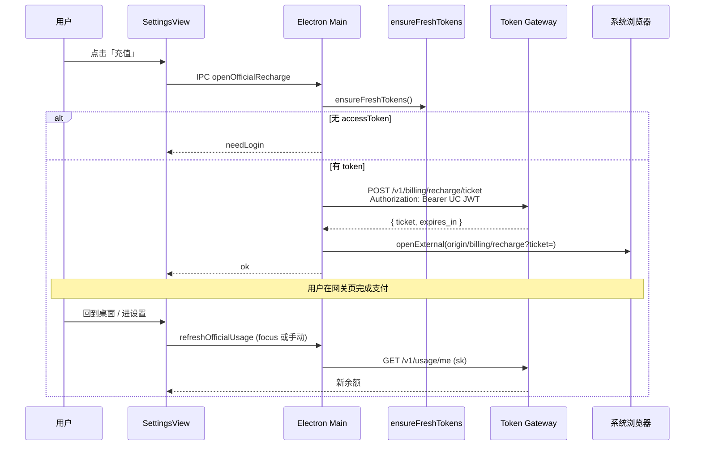

# US-G3-04 客户端跳转充值入口设计（FTCS Desktop）

> **用户故事**：[token-gateway/docs/02-用户故事.md](../../token-gateway/docs/02-用户故事.md) · US-G3-04  
> **状态**：已落地（Desktop 换票 + 外链 + focus 刷新）  
> **范围**：FTCS 桌面在「官方通道已开通」设置区提供**充值入口**：换短时 ticket → 系统浏览器打开网关充值页 → 回到桌面后刷新 `usage/me`。  
> **需求映射**：G3 执行计划 E2；衔接 G1-03 余额区；弱化原 G1-04「无在线支付」表述（见 §0）  
> **依赖**：US-G3-06（充值页）；`POST /v1/billing/recharge/ticket`（见 G3-06 §4，可由 G3-01 同交付）；US-G0-16 / G1-03（余额刷新）；UC 登录（`ensureFreshTokens`）  
> **不做**：桌面内嵌扫码/金额表单/微信支付 UI；自定义通道展示充值；未开通官方通道时展示入口  
> **交互稿**：在 `desktop/designs/ftcs-console.pen` 的 **04c** 余额区增补「充值」按钮（本故事编码前补画）  
> **文档位置**：`docs/design/`（Desktop）；网关页设计见 `token-gateway/docs/design/US-G3-06-…`

---


## 0. 边界与关系


| 文档 / 故事         | 关系                                                                     |
| --------------- | ---------------------------------------------------------------------- |
| **US-G3-06**    | 充值 **UI 与状态机**在网关；本故事只负责**打开**                                         |
| **US-G3-01～03** | prepay/回调/查单由充值页调用；桌面**不**调这些 API                                      |
| **US-G1-03**    | 余额卡片已有；本故事在同区加「充值」                                                     |
| **US-G1-04**    | 原文「无在线支付入口」→ 本故事落地后，402/不足提示可改为「去充值」（**G1-04 实现时可跟进**；本故事不强制改 Chat 横幅） |
| **其它接入方**       | 网关充值页文案保持中性；本设计仅定义 **FTCS Desktop** 一种接入方式                             |


---


## 1. 已确认选型


| 项              | 决定                                                                                                                     |
| -------------- | ---------------------------------------------------------------------------------------------------------------------- |
| **Q1 入口位置**    | 设置 → 模型通道 → **官方已开通** → 账户用量区：余额旁增加 **「充值」**（与「刷新」并列）                                                                  |
| **Q2 可见条件**    | `channelMode === 'official'` **且** `officialProvisioned` **且** 已登录 UC（有可刷新的 access token）                              |
| **Q3 打开方式**    | **系统默认浏览器** `shell.openExternal`（复用现有 `openExternal` IPC）；**不**用 Electron 内嵌 BrowserWindow 做支付（避免与合规/Cookie 纠缠；MVP 简单） |
| **Q4 鉴权链路**    | Desktop 用 **UC JWT** 调网关换 **recharge ticket** → URL 仅带 ticket；**不用** sk 换 ticket；**不**把 access_token 放进 URL            |
| **Q5 充值页 URL** | `{gatewayOrigin}/billing/recharge?ticket=…`（**注意**：页不在 `/v1` 下）                                                        |
| **Q6 返回后刷新**   | 用户切回桌面 / 再次进入设置 / 点「刷新」时拉 `usage/me`；可选：窗口 `focus` 时若距上次打开充值 < N 分钟则自动刷一次（建议做，阈值限流）                                    |
| **Q7 失败**      | 未登录 → 引导登录；换 ticket 失败 → 可读 toast；openExternal 失败 → 提示并展示可复制的 URL（无 query 的说明页或仅 origin，**勿**把 ticket 打进日志明文）          |
| **Q8 自定义通道**   | **不**显示「充值」                                                                                                            |


### 1.1 Base URL 与 Origin

现网：`FTCS_TOKEN_GATEWAY_BASE_URL` 默认 `https://token.ai-utills.com/v1`（API）。


| 用途                 | 推导                                                              |
| ------------------ | --------------------------------------------------------------- |
| Ticket / usage API | `{base}` 已含 `/v1`，如 `POST {base}/billing/recharge/ticket`       |
| 充值页                | `{origin}/billing/recharge`，`origin = base` 去掉末尾 `/v1`（及多余 `/`） |


新增工具函数（建议放 `gateway-config.ts`）：

```ts
getTokenGatewayOrigin(env?) // → https://token.ai-utills.com
buildRechargePageUrl(ticket: string, env?) // → `${origin}/billing/recharge?ticket=${encodeURIComponent(ticket)}`
```

---


## 2. 目标与非目标


### 2.1 目标

1. 官方已开通用户可从设置一键打开网关充值页并完成支付（支付发生在浏览器）。
2. 桌面侧**零**支付 UI；仅 ticket + 外链 + 余额刷新。
3. 与 G3-06 ticket 约定对齐。


### 2.2 非目标


| 不做               | 说明                                     |
| ---------------- | -------------------------------------- |
| 金额输入、二维码、我已支付    | G3-06                                  |
| 监听支付成功深链回调       | MVP 靠用户回来后刷新；不做 `ftcs://recharge-done` |
| 未开通时灰态「充值」       | 不展示入口即可                                |
| 修改网关充值页文案绑定 FTCS | 禁止                                     |


---


## 3. 流程




---


## 4. API 消费


### 4.1 换票（网关提供；本故事 Desktop 调用）

权威约定见 [US-G3-06 §4（换票存证与校验）](../../token-gateway/docs/design/US-G3-06-网关托管充值页设计.md)。摘要：

- 不透明 `rt_…`；库表 `token_recharge_tickets` **只存 hash**；TTL 默认 300s  
- Desktop 只调签发 API，**不**实现存储  
- 打开页后由网关 Set-Cookie；桌面勿依赖 query 长期有效  

```http
POST {FTCS_TOKEN_GATEWAY_BASE_URL}/billing/recharge/ticket
Authorization: Bearer {UC_access_token}
Accept: application/json
```
成功示例：

```json
{ "ticket": "rt_…", "expires_in": 300 }
```


| 错误       | Desktop 行为                                                    |
| -------- | ------------------------------------------------------------- |
| 401      | 强制 `ensureFreshTokens({ force: true })` 后重试一次；仍失败 → needLogin |
| 网络 / 5xx | toast「无法打开充值页，请稍后重试」                                          |
| 4xx 业务   | 展示 reason 短文案                                                 |


实现：`gateway-client.ts` 新增 `createRechargeTicket({ accessToken, baseUrl? })`，日志掩码 ticket。

### 4.2 打开页

```http
GET {origin}/billing/recharge?ticket={ticket}
```

仅浏览器导航；Desktop 不解析 HTML。

### 4.3 刷新余额

复用 G1-03：`refreshOfficialUsage()` → `GET …/usage/me` + sk。

---


## 5. Desktop 模块设计


### 5.1 `gateway-config.ts`

- `getTokenGatewayOrigin()`
- `buildRechargePageUrl(ticket)`


### 5.2 `gateway-client.ts`

- `createRechargeTicket(...)`


### 5.3 `official-channel-service.ts`（或 `recharge-entry-service.ts`）

```ts
openOfficialRecharge(): Promise<
  | { ok: true }
  | { ok: false; needLogin?: boolean; message: string }
>
```

步骤：fresh tokens → createRechargeTicket（401 则 force 重试）→ `shell.openExternal(url)` → 记录 `lastRechargeOpenedAt`。

### 5.4 IPC / preload


| Channel                          | 方向              | 说明     |
| -------------------------------- | --------------- | ------ |
| `gateway:open-official-recharge` | renderer → main | 触发上述流程 |
| 现有 `refreshOfficialUsage`        | 不变              | 返回后刷新  |


### 5.5 Settings UI

在 G1-03 余额行增加按钮：

```text
账户余额    ¥12.340     [充值]  [刷新]
```


| 态         | 行为                                      |
| --------- | --------------------------------------- |
| 点击充值      | loading 禁用按钮 → IPC → 成功则「已在浏览器打开充值页」轻提示 |
| needLogin | 引导去登录（与开通官方通道一致）                        |
| 自定义 / 未开通 | 不渲染「充值」                                 |


### 5.6 焦点刷新（建议 Must）

主窗口 `focus`：若 `Date.now() - lastRechargeOpenedAt < 15min`，自动 `refreshOfficialUsage()` 一次（防抖：最少间隔 10s）。

---


## 6. 安全


| 项            | 要求                                               |
| ------------ | ------------------------------------------------ |
| URL          | 仅 ticket；禁止 access_token / sk                    |
| 日志           | ticket / JWT 掩码（同 gateway-client）                |
| openExternal | 仅允许 `https:`（与现有外链校验一致）；host 应为网关 origin（可解析后比对） |
| 过期           | ticket TTL **可配**（默认 5 分钟，见 G3-06 §4.2.1）；用户拖延导致 S0 → 桌面再点一次充值 |


---


## 7. 交互稿


| 画板                                | 变更                                             |
| --------------------------------- | ---------------------------------------------- |
| `04c Workspace · 设置 · 官方已开通 · 余额` | 余额行增加 **「充值」** 次要/并列按钮                         |
| 网关五态                              | 仍用 `token-gateway-recharge.pen`；**不**在桌面稿内画支付页 |


编码前用 Pencil 改 04c；本设计评审通过后执行。

---


## 8. 文案（Desktop 侧）


| 场景   | 文案                   |
| ---- | -------------------- |
| 按钮   | 充值                   |
| 打开成功 | 已在浏览器打开充值页           |
| 未登录  | 请先登录后再充值             |
| 换票失败 | 无法打开充值页：{reason}     |
| 外链失败 | 无法打开浏览器，请检查系统默认浏览器设置 |


网关页文案仍保持「接入方应用」中性表述（G3-06），Desktop **不**要求网关写 FTCS。

---


## 9. 验收


| ID  | 步骤               | 期望                                                   |
| --- | ---------------- | ---------------------------------------------------- |
| A1  | 官方已开通 + 已登录，点充值  | 浏览器打开 `{origin}/billing/recharge?ticket=…`；桌面无二维码 UI |
| A2  | 未登录点充值           | needLogin / 引导登录；不打开页                                |
| A3  | 自定义通道            | 无「充值」按钮                                              |
| A4  | 支付完成后回桌面并 focus  | 余额自动或手动刷新可见增加（联调依赖 G3-02）                            |
| A5  | 日志               | 无完整 ticket / JWT / sk                                |
| A6  | openExternal URL | https + 网关 origin                                    |


---


## 10. 实现顺序

1. `gateway-config` origin / recharge URL
2. `createRechargeTicket` + `openOfficialRecharge` + IPC
3. Settings 04c「充值」按钮 + 文案
4. focus 自动刷新
5. 与网关 ticket + 充值页联调
6. （可选）G1-04 不足提示改为跳转同一入口

---


## 11. 开放问题


| #   | 问题                        | 默认              |
| --- | ------------------------- | --------------- |
| O1  | 内嵌 BrowserWindow vs 系统浏览器 | **系统浏览器**       |
| O2  | 深链回桌面                     | **不做**；focus 刷新 |
| O3  | G1-04 是否本迭代改文案            | **可另开**；本故事不阻塞  |


---


## 12. 编码任务清单

1. Pencil：04c 补「充值」（可选，UI 已接线）
2. ~~config + client + service + IPC~~
3. ~~SettingsView 接线~~
4. ~~focus 刷新~~
5. A1～A6 手工验收（联调网关 ticket + 充值页）

