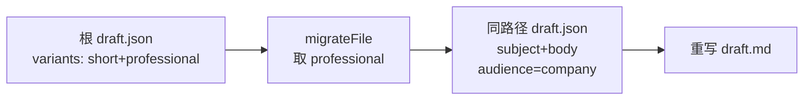
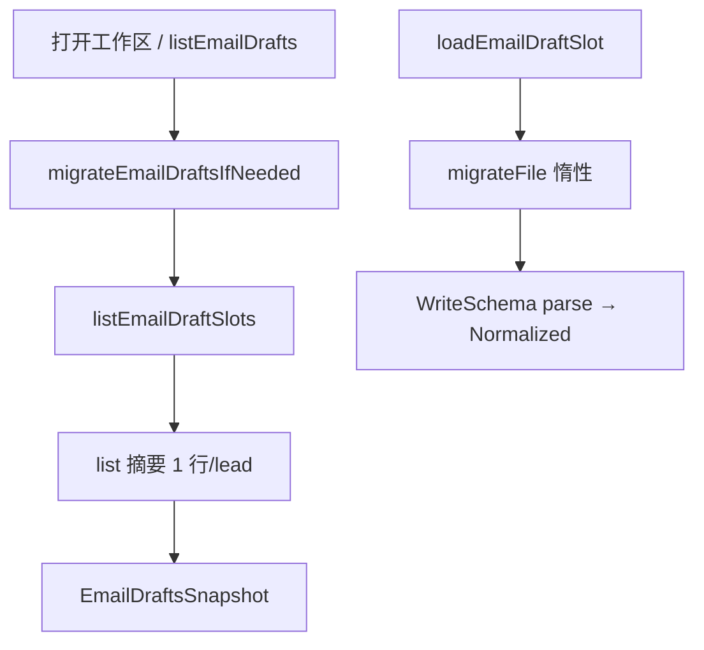
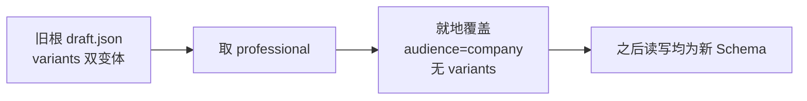

# US-M-01 详细设计：EmailDraft 目录约定 / Schema / 读模型

> **用户故事**：作为系统与后续开发信故事的基础，我需要约定「公司向 / 个人向」草稿的落盘路径与统一 Schema，并把既有双变体根稿 **就地迁移** 为新结构（只保留 professional → 公司向），保证磁盘上 `draft.json` 形态一致。  
> **范围**：路径与 `recipient_key`；Zod / 磁盘 JSON；**遗留稿迁移**；规范化读模型；lead-store 与桌面 `emails-reader` 的 list/load API；路径辅助与单测。  
> **依赖**：[21-需求-开发信重构.md](../21-需求-开发信重构.md)（E1、E4、§4）；现网 lead-store `email-types` / `email-storage`；桌面 `emails-reader` / `emails-writer`。  
> **不在本期**：起草分类与 Skill 改写（**US-M-02**）；邮件页收件人 UI（**US-M-03**）；全局风格设置读写（**US-M-04**）；中文对照生成（**US-M-05**）；按收件人通过/驳回（**US-M-06**）。  
> **文档位置**：`docs/design/`

---

## 0. 相对现网

| 现网 | **本期（M-01）** |
|------|------------------|
| 仅 `data/emails/{lead_id}/draft.json` | 根文件 = **公司向**；`{lead_id}/{recipient_key}/draft.json` = **个人向**（路径不搬迁） |
| `variants[]` short + professional；`selected_variant` | **新写与迁移后**：顶层 `subject` + `body`；**删除** `variants` / `selected_variant` |
| 遗留双变体根稿长期并存 | **就地迁移**：只保留 `professional`（无则首项）→ 公司向新 Schema，见 §4.5 |
| `recipient: { company?, email? }` | 扩展 `audience`、`recipient_aliases`、可选姓名；公司向 `email` 可空 |
| `loadEmailDraft(root, leadId)` 只读根文件 | `loadEmailDraft(root, leadId, slot)`：`company` \| `person(recipient_key)`；读前可触发惰性迁移 |
| `listEmailDrafts` / 桌面 snapshot：**一线索一行**（仅根稿） | 队列仍 **一线索一行**，附带 `companyDraft` / `personDraftCount` / `draftSlots` 摘要；可按 lead 枚举全部槽位 |
| 驳回：删整目录 `emails/{lead_id}/` | **行为暂不变**（仍整线索删）；按槽位删归 M-06。M-01 仅提供 `deleteEmailDraftSlot` 工具函数供后续用 |
| 通过：写 `selected_variant` + variants 编辑 | M-01 提供「规范化后保存单正文」写路径；桌面 approve **可暂留旧语义**，M-03/M-06 再切 UI |

---

## 1. 目标与非目标

### 1.1 目标

1. 冻结目录约定与 `recipient_key` 算法，保证同邮箱反复起草落到同一路径。  
2. 定义 **统一磁盘 Schema**（单正文 + `audience`）；新写与迁移后形态一致。  
3. **迁移遗留根稿**：双变体 → 仅 professional 正文 + `audience: "company"`，路径仍为 `{lead_id}/draft.json`。  
4. lead-store / 桌面读路径能发现个人向子目录；读/list 时对未迁移稿惰性升级。

### 1.2 非目标

| 不做 | 归属 |
|------|------|
| 把根 `draft.json` **挪到**子目录 / 改路径布局 | 明确不做（公司向永远在根） |
| 把 short 变体单独做成业务旁路文件 | 正式稿丢弃 short；迁移前整文件备份为 `draft.json.pre-m01` |
| contacts 公司级/个人级分类、1+N 生成 | US-M-02 |
| 邮件页芯片切换、单人起草 CTA | US-M-03 |
| `emailDraftStylePrompt` 设置 UI | US-M-04（Schema 可预留 `style_prompt` 快照字段） |
| 生成 `subject_zh` / `body_zh`、对照栏收起交互 | US-M-05（字段预留；收起态属前端偏好） |
| 按收件人通过/驳回、删单槽 | US-M-06 |
| 改 `draft-outreach-email` Skill 正文策略 | US-M-02 |
| `index.json` 强制落盘 | 不做；用目录扫描 |

---

## 2. 已确认选型（Q 表）

| 项 | 决定 |
|----|------|
| **Q1 公司向路径** | 固定 `data/emails/{lead_id}/draft.json`（与现网一致）；逻辑槽位 id = `"company"` |
| **Q2 个人向路径** | `data/emails/{lead_id}/{recipient_key}/draft.json`；同级可选 `draft.md` |
| **Q3 recipient_key** | 见 §3.2：由**规范化邮箱**派生可读 slug；过长则截断 + 短 hash；**禁止**用 `"company"` 作为个人 key |
| **Q4 无通用址的公司向** | 根稿仍落盘；`recipient.email` 可缺省/空串；`audience: "company"`；`recipient_key` 仍为逻辑 `"company"`（无子目录） |
| **Q5 新写正文形态** | 顶层 `subject` + `body`；**不再写入** `variants` / `selected_variant` |
| **Q6 遗留稿迁移** | **就地改写**根（及若有）子目录 `draft.json`：双变体只保留 **professional**（无则首项）→ `subject`/`body`；根稿强制 `audience: "company"`；**剥离** `variants`/`selected_variant`；路径不搬迁 |
| **Q7 迁移触发** | （1）`migrateEmailDraftsIfNeeded(root)` 可被桌面打开工作区 / 首次 `listEmailDrafts` 调用；（2）单文件 `load`/`save` 前惰性迁移该文件。幂等：已是新形态则跳过 |
| **Q8 列表粒度** | 邮件队列仍按 **lead** 一行；存在根稿或任一子稿即出现在列表（见 §6.2） |
| **Q9 待起草判定** | `listLeadsNeedingDraft`：**无公司向根稿**即待起草（与强制 1 封公司向对齐）；不因「已有个人向、无公司向」而视为已起草完成 |
| **Q10 markdown** | 迁移成功后 **重写**同目录 `draft.md`（若原先存在或 `write_markdown` 开启）；渲染只含单正文 |
| **Q11 MCP** | `emails_get` / `emails_save` / `emails_list` 增加槽位参数与返回字段；旧调用无 `recipient_key` 时默认 `"company"` |
| **Q12 中文/风格字段** | Schema **预留** `subject_zh` / `body_zh` / `style_prompt`（均可空）；本期不生成、不校验长度业务规则（长度上限在 M-04/M-05） |
| **Q13 short 与备份** | 正式稿 **丢弃** short；迁移前将原文件复制为同目录 `draft.json.pre-m01`（若已有则不覆盖）；若存在 `draft.md` 则同步 `draft.md.pre-m01`。备份仅供人工找回，产品 list/读路径 **忽略** |
| **Q14 selected_variant** | 迁移 **忽略** 用户曾选 short；一律以 professional（或首项）为准，与产品「单正文=专业向」一致 |

---

## 3. 目录与键

### 3.1 布局

```text
data/emails/
  {lead_id}/
    draft.json          # 公司向（强制槽）
    draft.md            # 可选
    {recipient_key}/
      draft.json        # 个人向
      draft.md          # 可选
```

| 逻辑槽 `slot` | 磁盘路径 |
|---------------|----------|
| `{ kind: "company" }` | `{lead_id}/draft.json` |
| `{ kind: "person", recipientKey }` | `{lead_id}/{recipientKey}/draft.json` |

**判定（路径，与 Schema 迁移无关）**：

- 路径相对 `data/emails/` 形如 `{leadId}/draft.json` → 公司向。  
- 形如 `{leadId}/{recipientKey}/draft.json` 且 `recipientKey !== "."` → 个人向。  
- **忽略**：`{leadId}` 下非目录的其它文件；子目录内无 `draft.json` 的空目录可在 list 时跳过。

### 3.2 `recipient_key` 算法

输入：邮箱字符串（个人向必填）。

```text
1. normalizeEmail(raw):
   trim → 转小写 → 拒绝空 / 不含 @ → 抛错或返回 null（调用方处理）

2. slug:
   local_at_domain = normalize 后把唯一的 "@" 换成 "_at_"
   将其余不在 [a-z0-9._+-] 的字符替换为 "_"
   合并连续 "_"；去首尾 "_"

3. 若 slug 为空或为保留字 "company"：
   改用 "p_" + sha256(normalize).slice(0, 16)

4. 若 slug.length > 80：
   slug = slug.slice(0, 64).replace(/_+$/, "") + "_" + sha256(normalize).slice(0, 8)

5. 返回 slug
```

| 规则 | 说明 |
|------|------|
| 稳定性 | 同一 normalize 邮箱 → 同一 key；大小写/首尾空格不影响 |
| 保留字 | `"company"` 仅逻辑槽，不得作为个人目录名 |
| 碰撞 | 截断+hash 后仍极低；若极端碰撞，后写覆盖同路径（同邮箱本应同稿） |
| 实现位置 | lead-store：`email-recipient-key.ts`；桌面可读同算法（复制或后续抽 shared；M-01 允许桌面复制 + 单测对齐） |

### 3.3 路径 API（lead-store `paths.ts`）

| 函数 | 行为 |
|------|------|
| `getEmailDraftPath(root, leadId)` | **保持**：公司向根路径（兼容旧调用） |
| `getEmailDraftPathForSlot(root, leadId, slot)` | company → 根；person → 子目录 |
| `getEmailDraftMarkdownPathForSlot(...)` | 同上 |
| `getEmailPersonDraftDir(root, leadId, recipientKey)` | 个人向目录 |

桌面对称：`emails-reader` / `emails-writer` 内聚相同规则，避免只改一边。

---

## 4. Schema

### 4.1 新写磁盘形态（目标）

```json
{
  "id": "email_20260916_0001",
  "lead_id": "lead_20260916_0001",
  "product_id": "prod_20260916_001",
  "created_at": "2026-09-16T08:00:00.000Z",
  "updated_at": "2026-09-16T08:00:00.000Z",
  "status": "pending_review",
  "language": "en",
  "audience": "company",
  "recipient": {
    "company": "Nordic Gear AB",
    "email": "info@nordicgear.se",
    "name": null,
    "recipient_aliases": ["sales@nordicgear.se"]
  },
  "subject": "OEM partnership inquiry — Nordic Gear AB",
  "body": "Dear Nordic Gear Team,\n\n...",
  "subject_zh": null,
  "body_zh": null,
  "style_prompt": null,
  "personalization_evidence": ["..."],
  "review": {
    "approved": null,
    "reviewer_notes": null,
    "reviewed_at": null
  }
}
```

个人向示例差异：`"audience": "person"`，`recipient.email` 必填，`recipient.name` 可为称呼用名，`recipient_aliases` 通常省略。

### 4.2 Zod 分层

| Schema | 用途 |
|--------|------|
| `EmailDraftLegacyFileSchema` | **仅迁移输入**：允许 `variants` / `selected_variant`；用于识别遗留稿 |
| `EmailDraftFileSchema` / `EmailDraftWriteSchema` | **磁盘目标与新写严格一致**：要求 `subject`+`body`+`audience`；**不得**含 `variants` / `selected_variant` |
| `EmailDraftNormalized` | 读模型：始终有 `subject`/`body`/`audience`/`slot`；由已迁移（或刚写出）文件 parse |

迁移完成后，稳态读路径 **只认新 Schema**；若仍检出遗留字段，走 §4.5 再写一遍（幂等）。

### 4.3 字段表（Normalized / 磁盘目标）

| 字段 | 类型 | 必填 | 说明 |
|------|------|------|------|
| `id` | string | ✅ | 沿用现网；新建可用 `email_{YYYYMMDD}_{seq}` 或与 lead 组合，**M-02 定 id 分配**；M-01 保存时若缺则 `email_{leadId}_{slot}` 也可接受为过渡 |
| `lead_id` | string | ✅ | |
| `product_id` | string | ✅ | |
| `created_at` | string | ✅ | ISO；迁移 / 更新时 **保留** 原值 |
| `updated_at` | string | ❌ | 迁移与保存时刷新为 now；旧稿缺省可读 `created_at` |
| `status` | enum | ✅ | `pending_review` \| `approved` \| `rejected`；迁移保留原值 |
| `language` | string | ✅ | 默认 `en`；迁移保留 |
| `audience` | `"company"` \| `"person"` | ✅ | 根路径迁移强制 `company`；子目录为 `person` |
| `recipient.company` | string? | ❌ | 公司名；迁移保留 |
| `recipient.email` | string? | 个人向✅ / 公司向可空 | 小写规范化存储（写时）；迁移保留 |
| `recipient.name` | string? | ❌ | 展示/称呼辅助 |
| `recipient.recipient_aliases` | string[]? | ❌ | 公司向其它通用址；迁移缺省不造 |
| `subject` / `body` | string | ✅ | 外发正文（迁移自 professional） |
| `subject_zh` / `body_zh` | string \| null | ❌ | M-05；迁移填 `null` |
| `style_prompt` | string \| null | ❌ | M-04 快照；迁移填 `null` |
| `personalization_evidence` | string[] | ✅ | 默认 `[]`；迁移保留 |
| `review` | object | ✅ | 同现网；迁移保留 |
| `slot` | 见 §3.1 | ✅ | **不落盘**，由路径注入 Normalized |
| `draft_path` | string | ✅ | 相对工作区路径，读模型附带 |

### 4.4 遗留 → 目标对照

| 磁盘内容（迁移前） | 迁移后 |
|--------------------|--------|
| `variants` 含 short + professional | 只取 professional 的 subject/body；删除整个 `variants` |
| 仅有 short、无 professional | 取 `[0]`（通常即 short） |
| 已有顶层 subject/body 且仍残留 variants | 以顶层为准（若顶层空则回退 variants 规则）；剥离 variants |
| `selected_variant` 任意 | **删除**；不按 short 优先 |
| 无 `audience`、根路径 | `audience: "company"` |
| 无 `audience`、个人向子目录 | `audience: "person"` |
| `review` / `status` / `created_at` / evidence | **原样保留** |
| `draft.md` | 按新正文重渲染覆盖 |

### 4.5 迁移算法（核心）

模块建议：`email-draft-migrate.ts`（lead-store）；桌面 list/load 调用同一逻辑（复制或依赖打包进主进程的 lead-store 工具——以现网依赖方式为准，M-01 允许桌面内联同算法 + 单测向量对齐）。

```text
needsMigration(raw):
  存在 variants 数组（长度≥1），或
  缺少 audience，或
  缺少非空 string 的 subject/body（且将从 variants 补）
  → true；否则 false（已是目标形态）

pickBody(raw):
  若 subject 与 body 均为非空 string → 用之
  否则从 variants 取 type===professional，否则 variants[0]
  若仍无 → 失败（记录错误，跳过该文件，不删原文件）

migrateFile(path, pathHint):
  raw = JSON.parse
  if !needsMigration(raw) return { skipped: true }
  { subject, body } = pickBody(raw)
  audience = raw.audience
    ?? (pathHint === person ? "person" : "company")
  // 根路径强制 company（即使误写 person）
  if pathHint === company: audience = "company"
  // 迁移前备份（幂等）
  if !exists(path + ".pre-m01"): copy path → path.pre-m01
  if exists(draft.md) && !exists(draft.md.pre-m01): copy draft.md → draft.md.pre-m01
  next = {
    id, lead_id, product_id, created_at,   // 保留
    updated_at: now,
    status, language,                      // 保留，缺省补默认
    audience,
    recipient: { ...raw.recipient 规范化 },
    subject, body,
    subject_zh: raw.subject_zh ?? null,
    body_zh: raw.body_zh ?? null,
    style_prompt: raw.style_prompt ?? null,
    personalization_evidence: [...],
    review: {...}
    // 明示不写 variants / selected_variant
  }
  validate WriteSchema
  atomicWrite(path, next)   // 先写 .tmp 再 rename
  可选 rewrite draft.md
  return { migrated: true, backedUp }

migrateEmailDraftsIfNeeded(root):
  扫描 data/emails/**/draft.json（根 + 一层子目录）
  逐文件 migrateFile；汇总 { migrated, skipped, failed[] }
```

**原子写**：`draft.json.tmp` → `rename` 覆盖，避免半写入。  
**并发**：同进程内 list 开头跑一遍批量迁移即可；单文件 load 再惰性兜底。  
**失败**：单文件失败不阻断其它；桌面可在日志中记 `failed` 路径；不自动删原文件。



---

## 5. 存储 API（lead-store）

### 5.1 读写

| API | 签名要点 | 说明 |
|-----|----------|------|
| `loadEmailDraft(root, leadId)` | 保持 | 等价 `loadEmailDraftSlot(..., company)`；返回 **Normalized**（或仍 parse 旧类型但内部已迁——建议直接改返回 Normalized，MCP 序列化字段对齐） |
| `loadEmailDraftSlot(root, leadId, slot)` | 新增 | 存在则 **先 migrateFile**，再按新 Schema parse → Normalized |
| `saveEmailDraftSlot(root, leadId, slot, input, opts?)` | 新增 | `EmailDraftWriteSchema`；mkdir；写 json；可选 md |
| `saveEmailDraft(...)` | 保持签名 | 委托 company 槽；**内部改为写新形态**（见 §5.4） |
| `listEmailDraftSlots(root, leadId)` | 新增 | 扫描前可对发现的文件惰性迁移；若有根稿推 company；再 `readdir` 子目录含 draft.json → person |
| `listEmailDrafts(root, productId?)` | 调整 | 入口调用 `migrateEmailDraftsIfNeeded`（或按 lead 惰性）；见 §5.2 |
| `migrateEmailDraftsIfNeeded(root)` | 新增 | §4.5 批量；返回计数 |
| `deleteEmailDraftSlot(root, leadId, slot)` | 新增 | 删对应 json/md；person 可删空目录；**不**改 lead status（status 规则 M-02/M-06） |

### 5.2 `listEmailDrafts` 聚合

对 `data/emails/*` 每个 `leadId` 目录：

1. `slots = listEmailDraftSlots`  
2. 若 slots 空 → 跳过  
3. 取 **公司向稿优先**，否则取 `created_at` 最新的一封，作为队列「代表稿」字段来源（subject 预览等）  
4. 产出摘要：

```ts
{
  lead_id,
  product_id,
  company_name,           // 自 recipient / 调用方补 scored
  has_company_draft: boolean,
  person_draft_count: number,
  draft_count: number,    // company + person
  status,                 // 代表稿 status；若多槽不一致：pending_review 优先于 approved（详：任一 pending → pending_review；否则任一 approved → approved；否则 rejected）
  newest_created_at,
  representative_path,    // 代表稿 draft_path
  slots: Array<{ slot, audience, email?, subject?, status, draft_path }>  // 可截断；全量也可只在 get-by-lead 返回
}
```

MCP `emails_list` 按此扩展；旧客户端只读 `draft_path` 时仍给公司向或代表路径。

### 5.3 保存时字段约束

`saveEmailDraftSlot` 写出对象**不得**包含：`variants`、`selected_variant`。  
`updated_at = now`；`created_at` 若文件已存在则保留。

### 5.4 与现网 `email-drafter` / `generateEmailDraftsForProduct` 的边界

M-01 **允许**暂不改模板生成器源码结构，但：

- `saveEmailDraft` / `saveEmailDraftSlot` 落盘前必须产出 **新 Schema**（若内存里仍是 variants，先 `pickBody` 再写）。  
- 这样迁移后与新写磁盘形态一致；Skill 全文改写仍归 M-02。

`validateDraftWordLimits`：改为校验 `subject`/`body` 字数（阈值可沿用 professional 上限）。

### 5.5 MCP 工具参数（增量）

| 工具 | 变更 |
|------|------|
| `emails_get` | 可选 `recipient_key`；省略 = company。返回 Normalized + `draft_path` |
| `emails_save` | 可选 `recipient_key`；body 用新 Write 字段（`subject`/`body`/`audience`…） |
| `emails_list` | 返回摘要含 `has_company_draft` / `person_draft_count` / `slots`（slots 可精简） |
| `emails_generate_drafts` | **M-02** 再改语义；M-01 若触达 save，则经新 save 写单正文 |

lead-store **小版本 bump**（Schema 变更）。

---

## 6. 桌面读模型

### 6.1 `EmailDraftRowDto` 演进（M-01 最小集）

在现网一行/线索基础上增加：

| 字段 | 类型 | 说明 |
|------|------|------|
| `audience` | `'company' \| 'person'` | 代表稿 |
| `hasCompanyDraft` | boolean | |
| `personDraftCount` | number | |
| `draftCount` | number | |
| `subject` / `body` | string | **规范化后**的代表稿正文（不再依赖 UI 选 short） |
| `subjectZh` / `bodyZh` | `string \| null` | 预留 |
| `stylePrompt` | `string \| null` | 预留 |
| `recipientAliases` | `string[]` | 可选 |
| `slots` | `EmailDraftSlotDto[]` | 该 lead 下全部槽位摘要（供 M-03；M-01 reader 即可填充） |

`EmailDraftSlotDto`：

| 字段 | 说明 |
|------|------|
| `slotKind` | `'company' \| 'person'` |
| `recipientKey` | company 时为 `'company'` |
| `email` | 可空 |
| `name` | 可空 |
| `audience` | |
| `status` | |
| `subject` | 预览 |
| `draftPath` | |
| `hasZh` | `Boolean(subject_zh \|\| body_zh)` |

**废弃**：`selectedVariant`、多元素 `variants` 作为编辑主路径。  
M-01 DTO 过渡期可将 `variants` 填 **单元素** `[{ type: 'professional', subject, body }]` 以免 EmailView 崩溃；**M-03** 改为直接绑 `subject`/`body` 后删除兼容字段。

### 6.2 `listEmailDraftsSnapshot`

- **先** `migrateEmailDraftsIfNeeded(workspaceRoot)`（或等价：仅扫当前产品相关 lead——实现可选优化，正确性优先全量 emails 扫描）。  
- 扫描逻辑对齐 §5.2。  
- `pendingHighLeadIds` / `listLeadsNeedingDraft`：仍以 **无公司向根 `draft.json`** 为准（§2 Q9）。  
- `stats.total`：线索条数（有任一槽位），不是封数；建议增加 `stats.totalDraftFiles`（封数）。

### 6.3 `loadEmailDraftsArtifact`

Agent 校验「草稿已生成」：

- 指定 `leadIds` 时：每个 lead **存在公司向根稿** 即成功（与强制公司向一致）。  
- 不要求个人向已齐（个人向可能 N=0）。

### 6.4 `emails-writer`（M-01 限度）

| 操作 | M-01 |
|------|------|
| `rejectEmailDraft` | **保持**删整目录 + lead→`new`（文档写明；M-06 再拆槽） |
| `approveEmailDraft` | 读（含惰性迁移）→ 写回新 Schema + `status=approved`；忽略 `selectedVariant`。若改动面过大可延期到 M-03，但 migrate + save 须在 M-01 就绪 |

---

## 7. 端到端





---

## 8. 实现清单（编码阶段）

| 层 | 改动 |
|----|------|
| lead-store | `email-recipient-key.ts`；`email-draft-migrate.ts`；`email-types` 目标 Schema；`paths` slot API；`email-storage` load/save/list/migrate/delete；markdown / word limit；MCP；单测（含迁移向量）；版本 bump |
| desktop | list/load 触发迁移；`emails-reader` 扫描子目录 + DTO；key 算法对齐；（可选）approve 写新 Schema |
| 文档 | 本文；[03-数据模型.md](../03-数据模型.md) §4；[21](../21-需求-开发信重构.md)；[07-目录结构约定.md](../07-目录结构约定.md) |
| **不改** | Skill 选人逻辑、EmailView 收件人 UI、设置风格、中文生成 |

---

## 9. 验收

| # | 步骤 | 期望 |
|---|------|------|
| A1 | 工作区仅有旧根 `draft.json`（short+professional） | 首次 list/load 后磁盘为新 Schema；`subject`/`body`=professional；无 `variants`；`audience=company`；路径仍为根 `draft.json` |
| A2 | 再次 list/load 同一文件 | `skipped`；内容不变（幂等） |
| A3 | 旧稿曾 `selected_variant=short` | 迁移仍取 professional（有则），不保留 short |
| A4 | 写入公司向新稿 | 路径根稿；无 variants；`audience=company` |
| A5 | 写入个人向 `erik@x.com` | `{leadId}/{recipient_key}/draft.json`；key 稳定 |
| A6 | `recipient_key` 保留字 / 异常字符 | 不生成目录名 `company`；可安全落盘 |
| A7 | 同 lead 根稿 + 2 个人向 | `hasCompanyDraft`、`personDraftCount===2`、`draftCount===3` |
| A8 | 仅有个人向、无根稿 | list 可见；`listLeadsNeedingDraft` 仍含该 lead |
| A9 | 损坏/空 variants 无法 pick | 该文件 `failed`，原文件保留；其它稿照常迁移 |
| A10 | 驳回（现网） | 仍删除整 `emails/{leadId}/` |
| A11 | 原有 `draft.md` | 迁移后与新 subject/body 一致 |

---

## 10. 风险与缓解

| 风险 | 缓解 |
|------|------|
| 迁移丢掉 short 后用户想找回 | 迁移前写 `draft.json.pre-m01`（含完整双变体）；发版说明可提示 |
| 半写入损坏 JSON | `.tmp` + `rename` 原子写 |
| 桌面与 lead-store 迁移算法漂移 | 共享用例表（输入 JSON → 输出 JSON）两边单测 |
| EmailView 仍读 variants | DTO 过渡单元素；M-03 切换 |
| 全量扫描大工作区卡顿 | list 时迁移；已迁文件 `needsMigration=false` 快速跳过；可记进程内「本 root 已全量迁过」标记 |
| 列表 status 多槽不一致 | §5.2 优先级规则 + 单测 |

---

## 11. 后续故事接口（备忘）

| 故事 | 依赖本详设 |
|------|------------|
| M-02 | `saveEmailDraftSlot`、company/person 路径、`audience`、aliases；磁盘已无双变体 |
| M-03 | `slots[]` DTO、按 slot load、空槽无文件 |
| M-04 | 写入时填 `style_prompt` 快照 |
| M-05 | 读写 `subject_zh` / `body_zh`；UI 收起态不落盘本 Schema |
| M-06 | `deleteEmailDraftSlot`；approve/reject 按 slot；全删光再回退 lead status |

---

## 12. 变更记录

| 日期 | 说明 |
|------|------|
| 2026-09-16 | 初稿：目录约定、recipient_key、Schema、读模型（当时「无整库迁移、仅读兼容」） |
| 2026-09-16 | **修订**：遗留双变体 **就地迁移** 为新 Schema；只保留 professional → 公司向；路径不搬迁；short 丢弃 |
| 2026-09-17 | **修订**：迁移前备份为 `draft.json.pre-m01`（及可选 `draft.md.pre-m01`），已存在不覆盖 |
