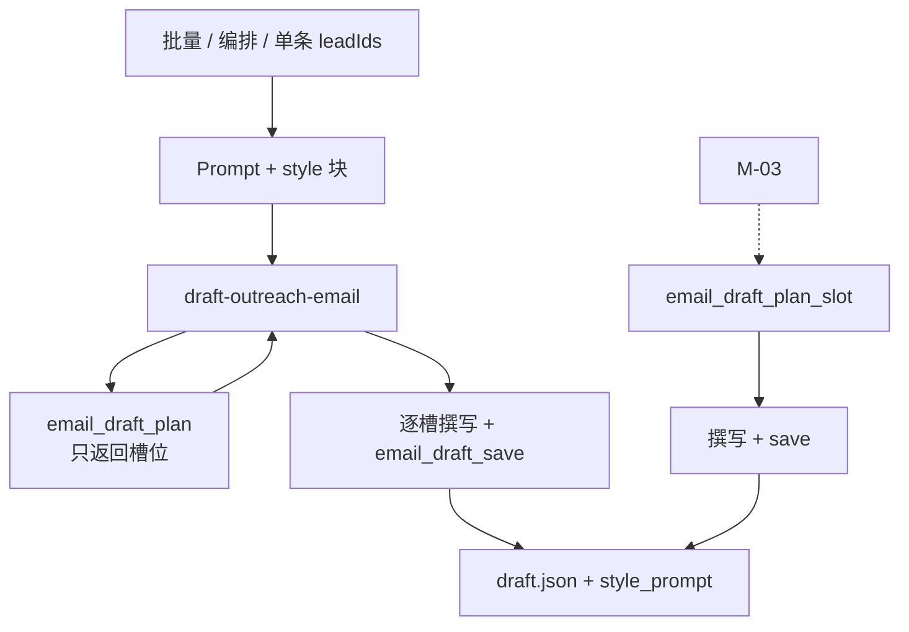
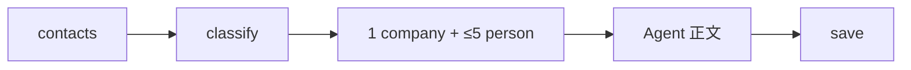

# US-M-02 详细设计：起草策略（contacts 分类 · 1+N · Skill/MCP/IPC）

> **用户故事**：作为业务员，我希望批量或线索页单条起草时，每条线索强制产出 1 封公司向稿，并按 `contacts` 中的个人邮箱追加 N 封个人向稿；正文由 Agent 按全局行文风格直接撰写并落盘。  
> **范围**：公司级/个人级邮箱分类；`planDraftSlots`；MCP **只出计划、不写套话模板**；Agent 撰写 + `email_draft_save`；单槽计划 API；Skill 与桌面 Prompt；封数上限与进度文案；`style_prompt` 落盘。  
> **依赖**：[21-需求-开发信重构.md](../21-需求-开发信重构.md) E0～E4、E7、E9、E10；[US-M-01](US-M-01-EmailDraft-schema与落盘.md)（路径 / Schema / `saveEmailDraftSlot`）；[US-M-04](US-M-04-全局行文风格.md)（Prompt 风格块；默认「专业，真诚」）；现网 `email_draft_*` / `draft-outreach-email` / `agent-runner.runDraftOutreachEmail`。  
> **不在本期**：邮件页收件人芯片与空态 UI（**US-M-03**）；中文对照（**US-M-05**）；按槽通过/驳回（**US-M-06**）；设置页风格 UI（**US-M-04** 已完成）。  
> **文档位置**：`docs/design/`

---

## 0. 相对现网

| 现网 | **本期（M-02）** |
|------|------------------|
| 代码模板生成专业向正文，再可选 Agent 润色 | **取消套话模板正文**；代码只算 **1+N 槽位计划**；**Agent 直接写** subject/body 并 `save` |
| `draftEmailForLead` + `pickPrimaryEmail` 写 1 份根稿 | 计划：**恰好 1** 公司向 + **N** 个人向；公司向禁止用个人邮箱顶替 |
| 无公司级/个人级分类 | 冻结通用本地部分表；`contacts` 邮箱分流 |
| Skill / MCP 描述 short + professional | 单正文；无 variants |
| `email_draft_generate` 写磁盘模板 | 改为（或替换为）**`email_draft_plan`**：只返回槽位，**不落盘正文** |
| 无 `style_prompt` 写入 | Agent `save` 时写入快照（参数传入，非 MCP 读 prefs） |
| 无线索页封数预告 | 文案区分 **线索数 / 预计封数** |

---

## 1. 目标与非目标

### 1.1 目标

1. 冻结 contacts 邮箱 **公司级 / 个人级** 判定与通用本地部分常量。  
2. 批量与线索页指定起草：每条目标线索按 **1+N** 由 Agent 撰写落盘（N≥0，个人向仅来自 `contacts`）。  
3. **确定性逻辑留在代码**（分类、路径、skip、cap）；**文案创造力留给模型**（遵循 M-04 风格段）。  
4. 每稿写入当时的 `style_prompt` 快照；改全局设置不回写旧稿。  
5. 为 M-03 提供 **单槽计划**（或等价）+ 既有 `save`，可仅 people 邮箱。  
6. 编排节点 `draft-outreach-email` 与线索页批量一致（E10）。

### 1.2 非目标

| 不做 | 归属 |
|------|------|
| 用代码拼装完整英文开发信模板再润色 | **明确不做**（浪费一轮、风格难落地） |
| 批量自动为 **仅 people、未进 contacts** 的邮箱写个人向 | 禁止（E2）；M-03 单人触发 |
| 邮件页收件人切换 UI | US-M-03 |
| 中文对照 | US-M-05 |
| 按收件人通过/驳回；删计划外个人向子目录 | US-M-06 |
| 改风格后扫盘重写 | 禁止（E7） |
| MCP 读 `ftcs-prefs.json` | 禁止；风格经 Prompt / save 参数 |
| 恢复 short 或风格枚举下拉 | 禁止 |

---

## 2. 已确认选型（Q 表）

| 项 | 决定 |
|----|------|
| **Q1 正文主路径** | **Agent 直接撰写**：先 `email_draft_plan`（或升级后的 plan 语义）拿到 1+N 槽位元数据 → 按槽写 subject/body → `email_draft_save`（带 `recipient_key` / `audience` / `style_prompt`）。**禁止**手写/Write 直接改 `draft.json`。**不做**代码套话模板落盘 |
| **Q2 代码仍负责** | 分类、`planDraftSlots`、recipient_key、skip/cap、路径、`language`/`evidence` 提示字段、status 更新钩子 |
| **Q3 style_prompt** | Agent `save` 时传入（来自任务 Prompt 风格段 / 默认「专业，真诚」）。省略则稿面 `null`。**不**在 MCP 读 prefs |
| **Q4 批量跳过** | 未传 `lead_ids`：已有 **公司向根稿** → 该线索不进 `plans`（`skipped: draft_already_exists`）；**不**自动补个人向 |
| **Q5 显式 lead_ids** | 计划含该线索全部计划槽；Agent **覆盖写** 计划内槽；计划外旧个人向子目录 **不删**（M-06） |
| **Q6 个人向上限** | 单线索最多 **5** 个个人级 contacts；confidence 高→低，同级邮箱序；超出进 `warnings`（`person_slots_capped`） |
| **Q7 线索上限** | 一次 ≤**50** 线索；预计封数 ≈ Σ(1+min(5,个人数)) |
| **Q8 单槽（M-03）** | MCP `email_draft_plan_slot`：返回单槽元数据（称呼建议、路径、recipient）；Agent 撰写后 `save`。允许邮箱仅在 people。本期无邮件页 UI |
| **Q9 分类表** | 冻结 `GENERIC_EMAIL_LOCAL_PARTS`（E3，§3.1）；变更改常量 + 测例 |
| **Q10 称呼** | 计划里给出 `greeting_line` 建议；Agent **应**采用（公司向 Team / 个人向 first_name→弱解析→`Hello,`），允许在不违背受众语义下微调 |
| **Q11 公司向收件人** | 计划给出 `email` + `aliases`；无通用址则 email 空；**禁止**计划把个人邮箱填进公司向 |
| **Q12 待起草** | `listLeadsNeedingDraft` = 无公司向根稿（M-01） |
| **Q13 lead status** | 该线索 **任意一槽** 首次成功 `save` 后 → `email_drafted`（save 路径内更新，与现网 save/generate 行为对齐） |
| **Q14 旧 `email_draft_generate`** | **停止写模板正文**。实现二选一（编码取改动更小者）：（A）改名为/新增 `email_draft_plan`，旧工具 deprecated 转调 plan；（B）保留工具名但语义改为只返回 plan。Skill 文档只教 plan → save |
| **Q15 遗留 `email-drafter` 模板函数** | 删除或降为测试夹具；**生产路径不得**再调用 `draftEmailForLead` 写盘 |

---

## 3. 分类与槽位计划

### 3.1 通用本地部分（冻结）

邮箱：`normalizeEmail` = trim + lower；取 `@` 前本地部分。

命中下表（精确匹配）→ **公司级**；否则 → **个人级**。

```text
info, sales, contact, contacts, admin, support, hello, office, mail,
enquiry, inquiry, service, help, team, marketing, business, export,
import, purchase, purchasing, buyer, buyers
```

实现：`email-contact-classify.ts`（`GENERIC_EMAIL_LOCAL_PARTS`、`classifyEmailAudience`、`isGenericEmail`）。

仅 `contacts[]` 且 `type === "email"`；小写去重（留 confidence 更高者）。

### 3.2 `planDraftSlots(lead)`

```ts
type PlannedCompanySlot = {
  kind: "company"
  recipient_key: "company"
  email?: string
  aliases: string[]
  greeting_line: string       // e.g. "Dear Acme Team,"
  draft_path: string          // data/emails/{id}/draft.json
  company_name?: string
}

type PlannedPersonSlot = {
  kind: "person"
  recipient_key: string
  email: string
  greeting_line: string
  display_name: string | null
  draft_path: string
}

type DraftSlotPlan = {
  lead_id: string
  product_id: string
  company: PlannedCompanySlot
  persons: PlannedPersonSlot[]
  truncated_person_count: number
  personalization_hints: string[]  // match_reason 等，供 Agent 引用，禁止编造
  language: string                 // resolveEmailLanguage
}
```

算法同前版：generic → 公司向 email/aliases；personal 取前 5 → persons；`greeting_line` 按 §3.3；`recipient_key` 用现网 `emailToRecipientKey`。

**弱解析 local-part**：含 `.`/`_`/`-` 时取首段且纯字母 ≥2 → 首字母大写；否则个人向用 `Hello,`。

### 3.3 称呼建议（写入 plan）

| 槽 | `greeting_line` |
|----|-----------------|
| 公司向 | `Dear {company.name} Team,` 或 `Dear Team,` |
| 个人向有名 | `Dear {Name},` |
| 个人向无名 | `Hello,` |

---

## 4. 落盘与 Agent 职责

### 4.1 模块拆分

| 文件 | 职责 |
|------|------|
| `email-contact-classify.ts` | 分类 |
| `email-draft-plan.ts` | `planDraftSlots`；批量 `planEmailDraftsForProduct` |
| `email-storage.ts` | plan 编排；`save` 时 status；**移除** generate 写模板正文 |
| `email-drafter.ts` | **废弃模板写盘**；可保留 `buildPersonalizationEvidence` / markdown 渲染等纯函数 |

### 4.2 `planEmailDraftsForProduct`

```text
for each target lead (selectLeadsForEmailDraft):
  if !lead_ids && has company draft → skipped
  else plans.push(planDraftSlots(lead) + paths + hints)
  if truncated → warnings
return { plans, skipped, warnings }
```

**不写**任何 `draft.json`。

### 4.3 Agent 撰写约束（Skill 固化）

- 撰写前须 `product_get`：结合卖方公司/产品/卖点/认证等；与线索 `personalization_hints` 两侧都禁止编造。  
- 每槽一封；采用 plan 的 `greeting_line`、收件人与路径语义。  
- 遵循会话内 **用户行文风格**；有明确 CTA。  
- 建议英文词数 ≤200（可 Soft）；每槽一份正文。  
- `save` 必须带：`subject`、`body`、`audience`、`recipient`（与 plan 对齐）、`style_prompt`、对应 `recipient_key`（公司向省略或 `"company"`）、建议 `write_markdown: true`。  
- 显式 lead_ids：**覆盖**计划内已有稿。

### 4.4 `style_prompt` 快照

`save` 时：`trim` 后空 → `null`，否则写入。表示「撰写时风格」，此后改设置不回写。

### 4.5 单槽 `planEmailDraftSlot`

| 输入 | 说明 |
|------|------|
| `product_id`, `lead_id` | 必填 |
| `audience` | company \| person |
| `email` | person 必填；company 可选 |
| `recipient_key` | 可选，person 可由 email 派生 |

返回单槽 plan（含 greeting、path、hints）。people-only 邮箱允许。Agent 再 `save`。

---

## 5. MCP

### 5.1 `email_draft_plan`（主工具）

| 参数 | 说明 |
|------|------|
| `product_id` | 必填 |
| `lead_ids` | 可选；省略则 status=new 按分 Top |
| `limit` | 默认 5，上限 50 |

**出参示意**：

```json
{
  "success": true,
  "product_id": "...",
  "lead_count": 2,
  "slot_count": 5,
  "skipped": [{ "lead_id": "...", "reason": "draft_already_exists" }],
  "warnings": [{ "lead_id": "...", "code": "person_slots_capped", "detail": "truncated 2" }],
  "plans": [
    {
      "lead_id": "...",
      "language": "en",
      "personalization_hints": ["..."],
      "slots": [
        {
          "audience": "company",
          "recipient_key": "company",
          "email": "info@x.com",
          "aliases": ["sales@x.com"],
          "greeting_line": "Dear Acme Team,",
          "draft_path": "data/emails/.../draft.json"
        },
        {
          "audience": "person",
          "recipient_key": "erik_at_x.com",
          "email": "erik@x.com",
          "greeting_line": "Dear Erik,",
          "draft_path": "data/emails/.../erik_at_x.com/draft.json"
        }
      ]
    }
  ]
}
```

`slot_count` = 所有待写信封数。

### 5.2 `email_draft_plan_slot`（新增，供 M-03）

见 §4.5；失败码 `EMAIL_DRAFT_PLAN_SLOT_FAILED`。

### 5.3 `email_draft_save` / `get` / `list`

- `save`：接受完整单正文稿 + 槽位；写盘；更新 `email_drafted`；可选 markdown。  
- 若调用方未传 `id`/`created_at`，服务端生成（与现网 InputSchema 一致）。  
- **禁止**再提供「无正文的模板 generate 写盘」。

### 5.4 旧 `email_draft_generate`

编码期：**不再生成模板正文**。改为转调 `plan` 并在返回中加 `deprecated: true, message: "use email_draft_plan then email_draft_save"`，或直接移除并改 Skill（优先改 Skill + 保留短别名以免旧会话崩）。

### 5.5 版本

lead-store bump；桌面 `build:mcp` / 工作区模板同步。

---

## 6. Skill 与桌面 Prompt

### 6.1 Skill `draft-outreach-email`

1. `product_get` + `leads_get_scored`。  
2. `email_draft_plan({ product_id, lead_ids, limit })`。  
3. 对 `plans[].slots[]` **每一槽**：结合画像与 hints **撰写** → `email_draft_save`（禁止 Write 落盘）。  
4. 汇报：线索数、封数、skip/warning、路径；提醒人工审核。

### 6.2 `buildDraftOutreachPrompt`

1. 注入风格块（M-04）。  
2. 要求调用 `email_draft_plan`，再对每个 slot **直接撰写并 save**（传入 `style_prompt`）。  
3. 禁止模板 generate、禁止手写 draft.json。  
4. 摘要含线索数 / 封数。

成功判定：目标线索均有 **公司向根稿**。

### 6.3 进度文案

「线索 n · 预计约 m 封」；`estimateOutreachDraftCounts`（桌面复刻分类或后续 shared）。指定重写提示覆盖计划内稿。

### 6.4 编排

节点不变；idle 超时按预计封数放大（Agent 逐封写，比模板+润色更吃回合，超时预算按封数给足）。

---

## 7. 端到端





---

## 8. 实现清单（编码阶段）

| 层 | 改动 |
|----|------|
| lead-store | classify + plan + 测例；`email_draft_plan` / `plan_slot`；save 钩子；废止模板 generate 写盘；版本 bump |
| Skill | 重写为 plan → 撰写 → save |
| desktop | Prompt；预计封数；超时；成功判定看公司向 |
| 文档 | 本文；docs/21；05 / 03 要点 |
| **不改** | EmailView 芯片；设置风格 UI；中文对照 |

---

## 9. 验收

| # | 步骤 | 期望 |
|---|------|------|
| A1 | `info@` + 2 个人 contacts | plan 含 1+2 槽；save 后三路径均有稿；公司向 email=`info@` |
| A2 | 仅个人 contacts | plan 公司向 email 空 + N 个人向；公司向未用个人邮箱 |
| A3 | 无邮箱 contacts | 仅 1 公司向槽 |
| A4 | 6 个人级 | plan 仅 5 person + warning |
| A5 | 无 lead_ids 且已有公司向 | skipped；不进 plans |
| A6 | 显式 lead_ids | Agent 覆盖计划内槽；计划外旧个人向仍在 |
| A7 | save 带 style_prompt | 快照一致 |
| A8 | 全程无模板 generate 写盘 | 磁盘正文来自 Agent save；无 variants |
| A9 | plan_slot + people-only | 可 save 个人向 |
| A10 | 无 Hunter Key | A1～A3 仍可完成 |
| A11 | 编排批量 | 与线索页同一 Skill 路径 |
| A12 | 代码路径 | 生产不再调用 `draftEmailForLead` 写盘 |

---

## 10. 风险与缓解

| 风险 | 缓解 |
|------|------|
| Agent 漏写某槽 | Skill/Prompt 要求遍历 `slots[]`；成功判定至少公司向；摘要核对 slot_count |
| 封数多、耗时长 | cap 5；线索 ≤50；idle 按封数放大；UI 预计封数 |
| 编造客户事实 | hints + 「禁止编造」；审核仍人工 |
| 称呼偏离受众 | plan 给 `greeting_line`；公司向必须 Team 语义 |
| 旧会话仍调 generate | 别名转 plan 或明确报错引导 |

---

## 11. 后续故事接口（备忘）

| 故事 | 依赖本详设 |
|------|------------|
| M-03 | `email_draft_plan_slot` + save；空态 CTA |
| M-05 | 对已有稿生成 zh |
| M-06 | 删单槽；清理计划外目录 |

---

## 12. 变更记录

| 日期 | 说明 |
|------|------|
| 2026-09-17 | 初稿：contacts 分类、1+N、当时为「模板+润色」 |
| 2026-09-17 | **修订**：取消代码套话模板；改为 **plan（代码）+ Agent 直接撰写 + save**；新增/改用 `email_draft_plan` |
| 2026-09-17 | **修订**：Skill/Prompt 明确须 `product_get`，正文结合自家画像与线索 hints |