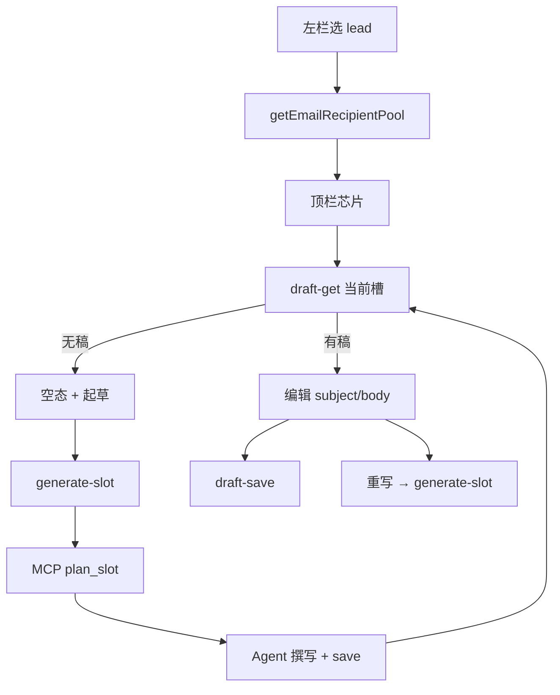

# US-M-03 详细设计：邮件页收件人切换 + 单人起草/重写

> **用户故事**：作为业务员，我希望在邮件页按收件人（公司向槽 + contacts∪people）切换审阅开发信；无稿时可单人起草，有稿时可仅重写当前收件人，且主区为单正文编辑。  
> **范围**：收件人切换池 DTO；顶栏芯片 UI；去 short/professional Tab；空态 + 单槽 Agent（`plan_slot`→撰写→`save`）；按槽读/写草稿 IPC；左栏队列与默认选中规则。  
> **依赖**：[21-需求-开发信重构.md](../21-需求-开发信重构.md) E1、E5、E6、§6.2；[US-M-01](US-M-01-EmailDraft-schema与落盘.md)（`slots[]` / 路径）；[US-M-02](US-M-02-起草策略1+N.md)（`email_draft_plan_slot` / `save` / 分类）；[US-M-04](US-M-04-全局行文风格.md)（风格 Prompt 块）；Pencil `ftcs-console.pen` · `10`/`10b`/`11 Mail` · `RecipientChips`；现网 `EmailView` / `emails-reader` / `emails-writer` / `runDraftOutreachEmail`。  
> **不在本期**：中文对照生成与展开交互（**US-M-05**，本期仅保留只读占位或隐藏入口）；按收件人通过/驳回与删单槽（**US-M-06**）；批量 1+N 策略（**US-M-02** 已完成）；设置风格 UI（**US-M-04**）。  
> **文档位置**：`docs/design/`  
> **交互参考**：`desktop/designs/ftcs-console.pen` · 邮件页收件人芯片 / 个人无稿空态；导出 `desktop/designs/exports-mail-v2/`

---

## 0. 相对现网

| 现网 | **本期（M-03）** |
|------|------------------|
| 左栏按 **有磁盘稿的 lead** 排队；无收件人维度 | 进入 lead 后 **顶栏芯片**切换收件人（E5 池） |
| short / professional 双 Tab | **单正文**编辑 `subject`/`body`（E1） |
| 仅线索级 `draftEmails(leadIds)` → 整 lead 1+N | 另增 **单槽** `draftEmailSlot`：只覆盖当前收件人 |
| 空态为「无选中草稿 / 去线索页」 | **当前收件人无稿**空态 +「为该收件人起草」 |
| `approve`/`reject` 写/删 **公司向根 / 整目录** | **暂保持 lead 级**（文案标明）；按槽审批归 M-06 |
| `list` 带 `slots[]` 但 UI 未用；reader **不读 people** | 构建 `recipientPool[]`；chips 绑定池；读盘按 `recipientKey` |
| 无独立「保存草稿」 | 增加 **按槽保存**（不改审批状态） |

---

## 1. 目标与非目标

### 1.1 目标

1. 邮件页可在 **公司向槽 + contacts∪people** 间切换；展示姓名/职位、邮箱、级别、是否已有稿。  
2. 主区单正文编辑；去掉 short/professional。  
3. 当前选中无稿 → 空态 + **起草**；有稿 → **重写**（仅该槽）+ 可编辑保存。  
4. people-only 邮箱可进池并单人起草（不强制 sync contacts）。  
5. 桌面 IPC / Agent 接通 `email_draft_plan_slot` + 单次 `save`；复用 M-04 风格块与 `product_get` 约定。

### 1.2 非目标

| 不做 | 归属 |
|------|------|
| 生成/刷新 `subject_zh`/`body_zh`、对照栏展开交互 | US-M-05（字段只读展示可选 Should） |
| 按收件人通过/驳回；驳回只删单槽 | US-M-06 |
| 改批量 `email_draft_plan` 语义 | US-M-02 已定 |
| 设置页风格 | US-M-04 |
| 把邮件页做成第二套全局风格编辑器 | 禁止 |

---

## 2. 已确认选型（Q 表）

| 项 | 决定 |
|----|------|
| **Q1 导航结构** | **两级**：左栏仍按 **lead（公司）** 排队；选中 lead 后 **顶栏芯片**切换收件人。不在左栏展开每人一行（避免与线索页重复、列表过长） |
| **Q2 左栏入队条件** | 该 lead **任意槽已有稿**，或从线索页 `?leadId=` 跳入（即使尚无稿，便于单人起草公司向/个人向）。纯 scored 无稿、未带路由的 lead **不**自动塞满左栏（避免邮件页变成第二线索表） |
| **Q3 收件人池** | 固定含 **公司向槽**一项（`recipientKey=company`）；通用级邮箱（M-02 分类表）**收束**到该芯片展示，不单独成芯片。再并 `contacts`∪`people` 中的 **个人级**邮箱（normalize 小写去重）。个人芯片带 `emailLevel: personal`；公司向槽 UI 标「公司向」 |
| **Q4 池排序** | ① 公司向槽置顶；② 有稿优先于无稿；③ 同组内 people 有姓名优先；④ 邮箱字典序 |
| **Q5 芯片文案** | 公司向：`公司向` + 可选短邮箱或「无通用邮箱」；个人：优先 `first_name`/`name`，否则邮箱 local；副标可显示职位截断。有稿/无稿用点状或 muted 区分（对齐 Pencil，不做复杂 badge 堆叠） |
| **Q6 默认选中** | 进入 lead：优先 **公司向（有稿）** → 否则第一个 **有稿**个人 → 否则 **公司向（无稿空态）**。路由可带 `?leadId=&recipientKey=`（可选；无则按上规则） |
| **Q7 单槽 Agent** | 新增桌面入口 `runDraftOutreachEmailSlot` + Prompt/轻量 Skill 段（或 Skill 增补「单槽模式」章节，**不**另起 skill 名也可）。流程：`product_get` → `email_draft_plan_slot` → 撰写 → `email_draft_save`（仅一槽）。**禁止**走整 lead `email_draft_plan` |
| **Q8 起草 vs 重写** | UI 同一主按钮：无稿文案「起草」，有稿「重写」；均覆盖当前槽。二次确认：重写时 ConfirmDialog「将覆盖该收件人当前草稿」 |
| **Q9 保存** | 新增 IPC `email:draft-save`：按 `leadId`+`recipientKey` 写 `subject`/`body`（及可选 recipient 元数据）；`status` 保持原值或仍为 `pending_review`；**不**自动 `approved`。通过按钮另议（见 Q10） |
| **Q10 通过 / 驳回** | **本期保持 lead 级**：通过 = 将 **当前正在编辑的槽** 标 `approved` 并落盘（写对应路径，不再只写根路径）；若当前是个人向，**不**改公司向文件。驳回仍 = 删整 `emails/{leadId}/` + lead→`new`，按钮旁注明「驳回整条线索的全部开发信」。按槽驳回归 M-06 |
| **Q11 编辑脏检查** | 切换芯片前若 `dirty`：Confirm「放弃未保存修改？」；保存后清 dirty |
| **Q12 中文对照** | 主区 **不**做生成；若磁盘已有 `subject_zh`/`body_zh`，可用折叠只读区展示（可选 Should）；无则不展示入口。完整交互归 M-05 |
| **Q13 style_prompt 展示** | Should：当前稿只读一行 muted「生成时风格：…」截断 80 字；不提供编辑 |
| **Q14 批量起草入口** | 邮件页保留「批量起草」= 现网整产品待起草线索（M-02）；与单槽按钮文案区分开 |
| **Q15 成功判定（单槽）** | Agent 结束后：目标 `recipientKey` 对应 `draft.json` 存在且可读即可（不要求公司向） |

---

## 3. 收件人池数据模型

### 3.1 `EmailRecipientPoolItemDto`

| 字段 | 类型 | 说明 |
|------|------|------|
| `recipientKey` | string | `company` 或 email 派生 key |
| `kind` | `'company' \| 'person'` | 公司向槽 vs 邮箱收件人 |
| `email` | string \| null | 公司向可空 |
| `displayName` | string | 芯片主文案 |
| `title` | string \| null | 职位（people） |
| `emailLevel` | `'generic' \| 'personal' \| null` | 仅 person；generic=公司级本地部分 |
| `source` | `'slot' \| 'contacts' \| 'people' \| 'both'` | 溯源；公司向用 `slot` |
| `hasDraft` | boolean | 磁盘是否有该槽 `draft.json` |
| `draftStatus` | string \| null | 有稿时的 status |

### 3.2 构建算法（桌面 `emails-reader` 或旁路 `email-recipient-pool.ts`）

输入：`leadId`、scored lead（**须含 contacts + people**）、已枚举 `slots[]`。

```text
1. 推入公司向项：recipientKey=company, kind=company,
   email=公司向稿 recipient.email 或 contacts 中首选 generic（仅展示，无稿也可空）,
   hasDraft=slots 含 company
2. 收集邮箱 map（仅个人级）：
   - contacts type=email → normalize；emailLevel=generic 则跳过（已收束到公司向）
   - people[].email → normalize；同上跳过 generic
   - 合并：displayName/title 优先 people
3. 同一 normalize 邮箱合并为一条 person 芯片（contacts∪people）。
4. 排序见 Q4
5. 返回 pool[]
```

**注意**：批量 M-02 只会为 contacts 个人级自动写稿；people-only 仅出现在池中供单人起草。

### 3.3 `listEmailDrafts` / 详情 IPC

| API | 行为 |
|-----|------|
| `listEmailDrafts` | 继续一 lead 一行 + `slots[]`；可选附带 `recipientPool`（若算力可接受）或 **按需** `getEmailRecipientPool(productId, leadId)` |
| **推荐** | 独立 `email:recipient-pool` / `getEmailRecipientPool`，选中 lead 时拉取，避免 list 过重 |
| `email:draft-get` | `{ productId, leadId, recipientKey }` → 单槽全文（subject/body/zh/style…） |
| `email:draft-save` | 按槽保存编辑（Q9） |

扩展 `loadScoredLeadMap`：**解析 `people[]`**（至少 email/first_name/name/title）。

---

## 4. UI（EmailView）

### 4.1 信息架构

```text
[顶栏] 标题 | 批量起草 | （当前槽）起草/重写 | 保存 | 通过 | 驳回
[左栏] Lead 队列（公司名 / 有稿摘要）
[右栏]
  [收件人芯片条 RecipientChips]
  [有稿] subject + body 编辑
  [无稿] 空态文案 + 主按钮起草
  [可选] style_prompt 只读；zh 只读折叠
```

对齐 Pencil：`RecipientChips`、`11 Mail · 个人无稿 · 单人起草`。

### 4.2 去掉双变体

- 删除 `VariantKey` / short·professional chips。  
- 编辑态单一 `editSubject` / `editBody`。  
- `hydrate` 从当前槽 `subject`/`body`；兼容旧 DTO 仅当无顶层字段时读 `variants[0]`（过渡一版后可删）。

### 4.3 空态文案

- 标题级：`该收件人尚无开发信`  
- 说明：公司向 →「将生成公司向开发信（Dear … Team）」；people-only →「将仅为该联系人生成一封，不会自动写入 contacts」  
- 主按钮：`为该收件人起草`

### 4.4 加载与轮询

- 选中 lead / 切换芯片 → `draft-get`；无稿则清空编辑区进空态。  
- Agent 运行中：沿用现网 timeline/状态；结束后 refresh pool + get 当前槽。  
- 8s 轮询：同槽且非 dirty 时可刷新；dirty 不覆盖。

### 4.5 从线索页进入

- `hasDrafted` /「已写邮件」：任意槽有稿即可跳转（已基本满足）。  
- `写邮件`（无线上稿）：可 `router.push({ name: 'email', query: { leadId } })` 并自动选公司向空态，或仍先跑整 lead 1+N（**现网行为保留为线索页按钮**）；邮件页内用单槽补洞。  
- 详设建议：**线索页「写邮件」保持 M-02 整 lead 1+N**；**邮件页内**用单槽补 people-only / 重写。

---

## 5. Agent 与 Skill

### 5.1 单槽 Prompt（桌面）

`buildDraftOutreachSlotPrompt({ productId, leadId, audience, email?, recipientKey? })`：

1. 注入 M-04 风格块。  
2. `product_get` → `email_draft_plan_slot` → 撰写 → `email_draft_save`（带 `style_prompt`）。  
3. 禁止 Write 落盘；禁止调用整 lead `email_draft_plan`（除非用户明确批量）。

### 5.2 Skill 文档

在 `draft-outreach-email/SKILL.md` **增加「单槽模式」章节**（同一 skill，避免技能膨胀）：当任务指明单 `lead_id`+`audience`/`email` 时走 `plan_slot`。表述只写当前行为，不写「不再…」。

### 5.3 IPC

| Channel | 入参 | 说明 |
|---------|------|------|
| `email:draft-generate` | 现网 | 批量 / 整 lead |
| `email:draft-generate-slot` | `productId, leadId, audience, email?, recipientKey?` | 单槽 Agent |
| `email:draft-get` | `leadId, recipientKey` | |
| `email:draft-save` | `leadId, recipientKey, subject, body, …` | |
| `email:recipient-pool` | `productId, leadId` | |

Preflight：与批量起草相同（模型通道等）；**不**因无 Hunter Key 拦截。

### 5.4 超时

单槽：`idleTimeout` 建议固定约 **8～12 分钟**（远小于批量封数放大）。

---

## 6. 端到端



---

## 7. 实现清单（编码阶段）

| 层 | 改动 |
|----|------|
| desktop reader | scored 读 people；`buildRecipientPool`；`loadEmailDraftSlot` 对外；封数/队列微调 |
| desktop writer | `saveEmailDraftSlot`（主进程）；approve 写 **当前槽** 路径；reject 文案 |
| IPC / preload / types | pool / get / save / generate-slot |
| agent-runner | `runDraftOutreachEmailSlot` + Prompt |
| Skill | 单槽模式章节 |
| EmailView | 芯片、单正文、空态、起草/重写/保存；去双 Tab |
| 单测 | pool 去重/排序；company 空邮箱；people-only；dirty 切换（可测纯函数） |
| 文档 | 本文；docs/21；可选 03 一句 |

**不改**：lead-store 分类常量（复用）；批量 plan；设置页。

---

## 8. 验收

| # | 步骤 | 期望 |
|---|------|------|
| A1 | lead 有公司向 + 2 个人向稿 | 芯片 ≥3；切换后正文随槽变化 |
| A2 | contacts 仅个人、公司向 email 空 | 仍有「公司向」芯片；可打开空态或已有公司向稿 |
| A3 | people-only 邮箱无稿 | 池中可见；起草后仅该 `recipient_key` 落盘 |
| A4 | 重写个人向 | 仅该子目录更新；其它槽文件 mtime/内容不变 |
| A5 | 无 short/professional Tab | 单 subject/body |
| A6 | 保存后切换再切回 | 内容保持（已落盘） |
| A7 | dirty 切换芯片 | 确认放弃或先保存 |
| A8 | 驳回 | 整 lead 邮件目录删除（与现网一致）+ 提示文案 |
| A9 | 通过（个人向选中） | 该个人向稿 `approved`；公司向文件未被改成该正文 |
| A10 | 邮件页批量起草 | 仍走 M-02 整批待起草线索 |

---

## 9. 风险与缓解

| 风险 | 缓解 |
|------|------|
| 用户以为驳回只删当前人 | 按钮文案 + Confirm 写明整线索 |
| 池与磁盘 slots 不一致 | 以磁盘 `hasDraft` 为准；起草后 refresh pool |
| 与线索页「写邮件」双路径混淆 | 线索页=1+N；邮件页=单槽；文案区分 |
| approve 只写根路径的旧 bug | M-03 改为当前槽路径 |
| 芯片过多 | 横向滚动；排序有稿优先 |

---

## 10. 后续故事接口

| 故事 | 依赖 |
|------|------|
| M-05 | 芯片下对照区；生成/刷新 zh；默认可收起 |
| M-06 | 按槽通过/驳回；驳回不删其它槽；左栏完成度 → 详设 [US-M-06](US-M-06-按收件人通过驳回与跳转线索.md) |

---

## 11. 变更记录

| 日期 | 说明 |
|------|------|
| 2026-09-17 | 初稿：E5 池与芯片、单正文、单槽起草/重写、按槽 get/save、通过写当前槽、驳回仍 lead 级 |
| 2026-09-17 | **M-06 已落地**：按槽驳回与 lead status 重算，见 [US-M-06](US-M-06-按收件人通过驳回与跳转线索.md) |
| 2026-09-17 | **M-05 已详设**：中文对照见 [US-M-05](US-M-05-中文对照生成与展示.md) |
| 2026-09-17 | 收件人池：通用级邮箱收束到公司向芯片，仅个人级展开为独立芯片 |
