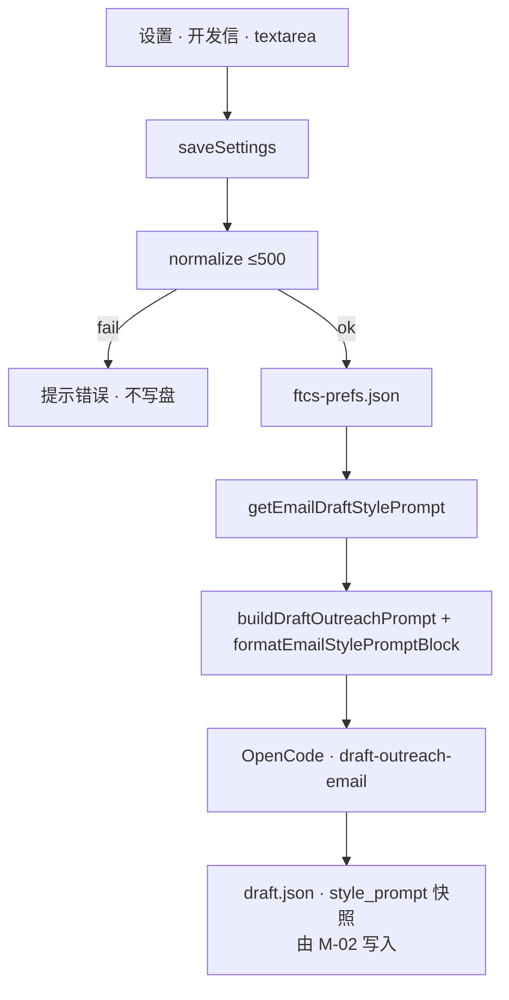
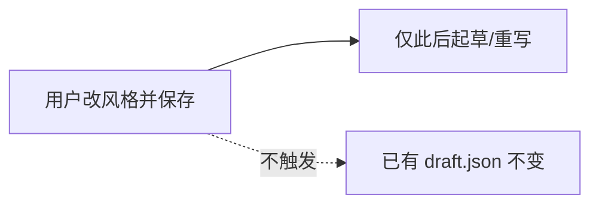

# US-M-04 详细设计：全局开发信行文风格（自由文本）

> **用户故事**：作为业务员，我希望在设置里用自然语言描述开发信语气偏好，之后批量/单条起草与重写都按该偏好生成，且改偏好不会偷偷改写已有草稿。  
> **范围**：设置页「开发信」区块 UI；`emailDraftStylePrompt` 持久化与 Settings IPC；桌面起草 Prompt 注入约定；稿件 `style_prompt` 快照契约（供 M-02 落盘）。  
> **依赖**：[21-需求-开发信重构.md](../21-需求-开发信重构.md) E7、§4.3、§6.3；[US-M-01](US-M-01-EmailDraft-schema与落盘.md)（磁盘已预留 `style_prompt`）；现网 `settings-service` / `SettingsView` / `agent-runner.buildDraftOutreachPrompt`。  
> **不在本期**：contacts 分类与 1+N 生成策略正文（**US-M-02**）；邮件页收件人 UI（**US-M-03**）；中文对照生成（**US-M-05**）；按收件人通过/驳回（**US-M-06**）。  
> **文档位置**：`docs/design/`  
> **交互参考**：`desktop/designs/ftcs-console.pen` · `12 Settings · 开发信行文风格`

---

## 0. 相对现网

| 现网 | **本期（M-04）** |
|------|------------------|
| 无行文风格设置；模板/Agent 按 Skill 默认发挥 | 设置中自由文本框；空=默认专业外贸惯例 |
| short / professional 双变体当「风格」 | **不做**枚举下拉；双变体已由 M-01 取消 |
| 起草 Prompt 不含用户语气偏好 | `buildDraftOutreachPrompt`（及后续单人重写 Prompt）注入非空风格文案 |
| 草稿无风格溯源 | 新写稿由 **M-02** 写入 `style_prompt` 快照；M-04 定字段语义与读写契约 |
| 改设置即影响未起草任务 | **仅影响之后的起草/重写**；不扫盘重写旧稿 |

---

## 1. 目标与非目标

### 1.1 目标

1. 用户可在设置中输入/清空/保存全局行文风格（自然语言）。  
2. 偏好跨产品生效；持久化可靠，重启后仍在。  
3. 桌面发起的开发信 Agent 任务能读到最新偏好并写入会话 Prompt。  
4. 明确「改文案 ≠ 重写旧稿」的产品行为与 UI 文案。

### 1.2 非目标

| 不做 | 归属 |
|------|------|
| 正式 / 简洁 / 友好等 **预设枚举** 或下拉 | 明确禁止（E7） |
| 改风格后后台批量重写全部 `draft.json` | 明确禁止 |
| 完整 1+N 起草策略、Skill 重写 | US-M-02（消费本详设的注入与快照约定） |
| 邮件页展示/编辑当前稿的 `style_prompt` | 可选 Should；默认 M-03 只读展示即可，非 M-04 Must |
| 中文对照 | US-M-05 |
| 把风格同步到官网账号 / 多机漫游 | 不做；仅本机 prefs |

---

## 2. 已确认选型（Q 表）

| 项 | 决定 |
|----|------|
| **Q1 存储位置** | **`userData/ftcs-prefs.json`** 字段 `emailDraftStylePrompt: string`（可缺省）。**不**进工作区 `.env`（长中文/多行不适合；非密钥）。仍走现网 **Settings get/save IPC** 管道暴露给 UI |
| **Q2 作用域** | **本机全局**：跨产品、跨工作区目录。换 workspace 不丢风格（品牌语气属于人，不属于单个工程） |
| **Q3 字段名** | 对外/IPC：`emailDraftStylePrompt`；磁盘稿快照：`style_prompt`（与 M-01 一致） |
| **Q4 长度上限** | **500** 个 Unicode 码位（`[...s].length`）；保存时 trim；超限拒绝保存并提示。空串合法 |
| **Q5 空值语义** | trim 后空 → 视为未配置；Prompt **不**注入风格段；模型按 Skill/默认专业外贸开发信惯例 |
| **Q6 UI 位置** | 设置侧栏新增分类 **「开发信」**（`id: outreach`），置于「集成」与「工作区」之间；单区块，无子 Tab |
| **Q7 保存交互** | 与设置页其它项一致：改文案后点页头「保存设置」一并提交；**另**在本区块提供「清空」仅清本地 form，仍须点保存才落盘（或清空后立即标 dirty——与现网 checkbox 行为对齐：改 form，保存才写） |
| **Q8 注入时机** | 桌面 `buildDraftOutreachPrompt` **本期接好**；单人「起草/重写」Prompt（M-03）复用同一 `formatEmailStylePromptBlock()`。Skill 正文策略深化归 M-02 |
| **Q9 快照** | 新生成/重写成功落盘时，将 **当时** 的全局偏好写入该稿 `style_prompt`（可空串写 `null`）。**改全局设置不回写**已有稿的 `style_prompt` |
| **Q10 敏感与日志** | 风格文案可进 Agent Prompt / 任务日志摘要（用户自述业务语气，非密钥）；**不要**写入崩溃上报以外的远程分析。日志若截断，保留前 80 字即可 |
| **Q11 迁移** | 无旧数据。缺字段 = 空 |
| **Q12 多端** | 仅 Electron 桌面；官网不配置此项 |

---

## 3. 数据模型

### 3.1 `ftcs-prefs.json`（增量）

```json
{
  "workspaceRoot": "...",
  "emailDraftStylePrompt": "简洁、少套话；偏顾问语气，强调 OEM 与交期。"
}
```

| 字段 | 类型 | 默认 | 说明 |
|------|------|------|------|
| `emailDraftStylePrompt` | `string` | 缺省或 `""` | trim 后使用；超长在 save 层拒绝 |

### 3.2 Settings IPC

**`SettingsSnapshot` 增加：**

| 字段 | 类型 | 说明 |
|------|------|------|
| `emailDraftStylePrompt` | `string` | 当前已保存值（可能为空串） |

**`SettingsSaveInput` 增加：**

| 字段 | 类型 | 说明 |
|------|------|------|
| `emailDraftStylePrompt` | `string \| undefined` | **省略**则不修改 prefs 中该键；传入则校验长度后写入（允许 `""` 清空） |

> 与 `hunterVerifyEmails` 类似：显式字段控制是否更新，避免旧客户端漏传把值清掉。本期 SettingsView 会始终传该字段。

### 3.3 草稿快照（契约，落盘由 M-02）

| 字段 | 含义 |
|------|------|
| `style_prompt` | 生成该稿时使用的全局文案快照；`null`/缺省=当时未配置。只读溯源，UI 不强制展示 |

---

## 4. 主进程 API

### 4.1 模块建议

| 符号 | 位置 | 职责 |
|------|------|------|
| `EMAIL_DRAFT_STYLE_PROMPT_MAX = 500` | `settings/email-draft-style.ts`（或 settings-service 旁） | 常量 |
| `normalizeEmailDraftStylePrompt(raw: string): { ok: true, value: string } \| { ok: false, message }` | 同上 | trim + 码位长度校验 |
| `getEmailDraftStylePrompt(): string` | 同上，读 prefs | 供 agent-runner / 日后 Skill 侧车 |
| `settings-service.getSettingsSnapshot` | 投影 prefs → snapshot |
| `settings-service.saveSettings` | 校验后 `writeUserPrefs({ emailDraftStylePrompt })` |

### 4.2 校验规则

```text
value = input.trim()
if [...value].length > 500 → 拒绝，message「行文风格不超过 500 字」
否则写入 prefs（可为空串）
```

不剥离用户换行；保存后读出保持换行（textarea）。JSON 序列化自然转义。

### 4.3 Prompt 注入块

```ts
export function formatEmailStylePromptBlock(stylePrompt?: string): string {
  const text = (stylePrompt ?? getEmailDraftStylePrompt()).trim()
  if (!text) return ''
  return [
    '## 用户行文风格偏好（必须尽量遵循）',
    '以下为用户用自然语言描述的语气/偏好，请理解并落实到 subject 与 body；不要在正文中提及「按用户设置」等元叙述。',
    '"""',
    text,
    '"""',
    '',
  ].join('\n')
}
```

`buildDraftOutreachPrompt` 在「执行要求」之前或之后插入该块（建议紧接产品/线索参数之后）。

单人重写 Prompt（M-03）同样调用；**禁止**复制粘贴两份不一致文案。

---

## 5. 端到端流程





---

## 6. UI（SettingsView）

### 6.1 信息架构

侧栏 categories 增加：

```ts
{ id: 'outreach', label: '开发信' }
```

顺序建议：`account → model → search → explore → integrations → outreach → workspace → opencode → about`。

### 6.2 区块内容（对齐 Pencil「12 Settings · 开发信行文风格」）

| 元素 | 内容 |
|------|------|
| 标题 | 开发信行文风格 |
| 副标 / mono | `emailDraftStylePrompt` |
| 说明 | 用自然语言描述期望语气。空=按专业外贸开发信惯例。**修改后不会自动重写已有草稿**，仅影响之后的起草与重写。 |
| textarea | 多行；`rows`≈5～6；placeholder 示例：「例：简洁、少套话；偏顾问语气，强调 OEM 与交期；活泼但专业，避免过度热情。」 |
| 元信息 | 「作用域：本机全局 · 跨产品」；「最多 500 字」+ 实时字数（`[...value].length`） |
| 次要操作 | 「清空」→ form 置 `''`（仍依赖页头保存） |
| 提示条 | 不做正式/简洁/友好预设；由大模型理解落地 |

样式：复用 `settings-block` / `input` / 现有 muted 提示，**不**新开设计系统。

### 6.3 加载与保存

- `getSettings` → `form.emailDraftStylePrompt = data.emailDraftStylePrompt ?? ''`  
- `saveSettings({ ..., emailDraftStylePrompt: form.emailDraftStylePrompt })`  
- 超长：主进程返回 `ok: false`；UI 展示 `result.message`（与现网保存失败一致）

### 6.4 非目标 UI

- 不在邮件页再放全局风格编辑器（避免两处真相）；邮件页若展示，只读当前稿 `style_prompt`（M-03 Should）。

---

## 7. 与 M-02 / Skill 的接口

| 消费方 | M-04 提供 | M-02 负责 |
|--------|-----------|-----------|
| 桌面批量/单条起草 | Prompt 已含风格块 | `email_draft_plan` → Agent **直接撰写** → `save`（写入 `style_prompt`） |
| `draft-outreach-email` Skill | 可读桌面注入的会话说明 | Skill：plan 后逐槽撰写；明示遵循用户风格段 |
| 代码套话模板 | — | **不做**；分类/槽位计划仍由代码 |

**M-04 验收不依赖** M-02 全部完成：只要设置能存、Prompt 在非空时含风格原文即可（可用日志/单测断言 `formatEmailStylePromptBlock`）。

---

## 8. 实现清单（编码阶段）

| 层 | 改动 |
|----|------|
| prefs | `UserPrefs.emailDraftStylePrompt?` |
| settings | normalize 常量；snapshot / save；`getEmailDraftStylePrompt` |
| agent-runner | `buildDraftOutreachPrompt` 接入 `formatEmailStylePromptBlock` |
| IPC / preload / electron.d.ts | Snapshot + SaveInput 字段 |
| UI | SettingsView 新分类 + 区块 |
| 单测 | normalize 边界（空、500、501、首尾空白）；format 空/非空 |
| 文档 | 本文；docs/21 交叉引用；可选支持计划文案已含「自由描述」则不必改 |

**不改**：lead-store Schema（已有字段）；邮件页主布局；Hunter / 模型通道。

---

## 9. 验收

| # | 步骤 | 期望 |
|---|------|------|
| A1 | 设置 → 开发信，输入风格，保存，重启应用 | 文案仍在 |
| A2 | 清空并保存 | snapshot 为空串；Prompt 无风格段 |
| A3 | 输入 501 字保存 | 失败提示；prefs 未改 |
| A4 | 配置非空后触发批量起草（或单测 Prompt 构建） | Prompt 含用户原文（或规范化后原文） |
| A5 | 改风格保存后，磁盘上旧 `draft.json` | `subject`/`body`/`style_prompt` **均不变** |
| A6 | 切换产品 / 工作区 | 风格仍在（本机 prefs） |
| A7 | UI | 无正式/简洁/友好下拉；有「不自动重写」说明 |

---

## 10. 风险与缓解

| 风险 | 缓解 |
|------|------|
| 用户以为改风格会刷新全部旧稿 | 区块说明 + E7；不做静默重写 |
| 超长 Prompt 挤占上下文 | 硬顶 500 码位 |
| prefs 与「按工作区隔离」预期不符 | Q2 写明本机全局；若未来要按工作区，可再加 workspace 级覆盖（非本期） |
| M-02 未落地时风格「看起来没生效」 | M-04 接好 Prompt；发版说明可写「完整 1+N 随开发信重构后续故事」；或与 M-02 同迭代发布 |
| 多行 JSON 转义 | 走 JSON.stringify；单测含换行 |

---

## 11. 后续故事接口（备忘）

| 故事 | 依赖本详设 |
|------|------------|
| M-02 | `getEmailDraftStylePrompt` / Prompt 块；落盘 `style_prompt` |
| M-03 | 单人起草/重写 Prompt 复用 `formatEmailStylePromptBlock`；可选只读展示快照 |
| M-05 | 无关；对照不读风格设置 |

---

## 12. 变更记录

| 日期 | 说明 |
|------|------|
| 2026-09-17 | 初稿：prefs 存全局自由文本、设置「开发信」分类、Prompt 注入与快照契约、500 码位上限 |
| 2026-09-17 | 交叉引用：M-02 改为 plan + Agent 直写（无套话模板） |
