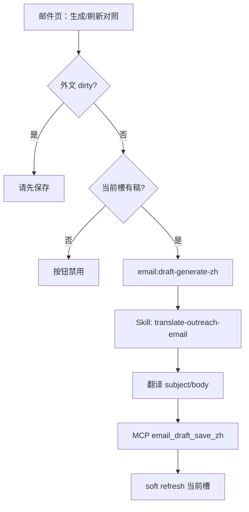

# US-M-05 详细设计：中文对照生成与展示

> **用户故事**：作为业务员，我希望对当前收件人开发信一键生成/刷新中文对照，并在邮件页折叠区对照阅读，以便改稿；外发正文仍以外文（默认 en）为准。  
> **范围**：当前槽 `subject_zh` / `body_zh` 生成与落盘；独立 Skill `translate-outreach-email`；MCP `email_draft_save_zh`；邮件页折叠对照区 UI；桌面 IPC 启动翻译任务；原文改动后的过期提示。  
> **依赖**：[21-需求-开发信重构.md](../21-需求-开发信重构.md) E8、§6.2、§8；[US-M-01](US-M-01-EmailDraft-schema与落盘.md)（字段已预留、`hasZh`）；[US-M-03](US-M-03-邮件页收件人切换.md)（芯片、单槽读写、Q12 占位）；[US-M-06](US-M-06-按收件人通过驳回与跳转线索.md)（驳回删槽时 zh 随文件删除）；现网 `EmailView` / `emails-reader` / `lead-store` / `agent-runner` / `workspace/skills`。  
> **不在本期**：把中文设为外发正文或多语言变体库；批量给整 lead 全部槽生成 zh；对照区可编辑中文并回写为选用正文；SMTP 发送；改全局风格自动刷 zh。  
> **文档位置**：`docs/design/`  
> **交互参考**：邮件页主区折叠对照（M-03 已约「默认可收起」）；文案标明「辅助审阅」。

---

## 0. 相对现网（M-03 / M-06 落地后）

| 现网 | **本期（M-05）** |
|------|------------------|
| Schema 已有 `subject_zh` / `body_zh`（多为 `null`）；slot DTO 有 `hasZh` / `subjectZh` / `bodyZh` | **生成 / 刷新**写入当前槽；UI 展示 |
| 邮件页无对照入口（或仅隐藏） | 折叠对照区 +「生成/刷新中文对照」 |
| 起草/重写/保存只动 `subject`/`body` | 对照独立；**不**替换外发字段 |
| 驳回删槽 | zh 随 `draft.json` 删除（M-06 已保证，本期无额外清理） |

---

## 1. 目标与非目标

### 1.1 目标

1. 对 **当前选中收件人槽**（有外文稿）可生成中文主题+正文对照。  
2. 已有对照时可 **刷新**（覆盖 `subject_zh`/`body_zh`）。  
3. UI **默认折叠**；展开后只读展示中文；标明辅助审阅、不替代外发。  
4. 外文 `subject`/`body` 被改写后，提示对照可能过期并引导刷新。  
5. 生成失败可重试；成功后软刷新当前槽，左栏/芯片可用 `hasZh`（Should）。

### 1.2 非目标

| 不做 | 归属 |
|------|------|
| 中文作为外发语言 / `language=zh` 切换 | §8 明确禁止 |
| 对照区可编辑并「选用中文发送」 | 本期不做 |
| 一键为整 lead 所有槽生成对照 | 可手点芯片逐个；避免费额度误触 |
| 起草时强制同步出 zh | 可选未来；本期按需生成 |
| 改 `emailDraftStylePrompt` 后批量刷 zh | 禁止（同 M-04 不自动重写） |
| 用 `email_draft_save` 整稿覆盖写 zh | **禁止**；必须走专用 `email_draft_save_zh` |
| 把翻译逻辑塞进 `draft-outreach-email` | **禁止**；另立 Skill |

---

## 2. 已确认选型（Q 表）

| 项 | 决定 |
|----|------|
| **Q1 粒度** | **仅当前槽**（`leadId` + `recipientKey`）。切换芯片后对照内容跟当前槽走。 |
| **Q2 字段** | 写磁盘 `subject_zh`、`body_zh`（string；空则 `null`）。**不**改 `subject`/`body`/`language`/`status`/`style_prompt`。 |
| **Q3 生成通道** | 桌面 IPC 启动 Agent，加载独立 Skill **`translate-outreach-email`**；Agent 读当前槽外文 → 翻译 → 调用 MCP **`email_draft_save_zh`** 落盘。主进程 **不**解析模型 JSON 代写盘。 |
| **Q4 Skill** | **另立** `workspace/skills/translate-outreach-email/SKILL.md`（`name: translate-outreach-email`）。时间线 / `agentSkill` 显示该名，与 `draft-outreach-email` 区分。 |
| **Q5 MCP** | lead-store 新增 **`email_draft_save_zh`**：只写 `subject_zh` / `body_zh` / `zh_source_hash`（hash 可由工具按当前外文计算）。**禁止**改外文与 status。缺稿返回错误。 |
| **Q6 无稿** | 当前槽无 `draft.json` → 按钮禁用；空态不展示对照入口。 |
| **Q7 脏编辑** | 外文编辑区 `dirty` 时：点生成 → toast「请先保存原文再生成对照」。 |
| **Q8 过期** | 落盘 `zh_source_hash`（外文 `subject\\nbody` 短 hash）。读盘不一致 → `zhStale`。刷新成功由 `email_draft_save_zh` 重算 hash。无 hash 旧稿：有 zh 则轻提示「建议刷新」。 |
| **Q9 重写外文** | 单槽重写成功后：**清空**该槽 zh 三字段（桌面 writer 或 MCP 侧在 `email_draft_save` 全量写外文时可选 clear；Must：桌面 `runDraftOutreachEmailSlot` 成功后 `clearEmailDraftZh`）。 |
| **Q10 UI 默认** | 对照区 **默认折叠**；展开态会话内记忆。 |
| **Q11 可编辑性** | 对照 **只读**；改观感 → 改外文保存 → 再刷新。 |
| **Q12 与审批** | 写 zh **不**改审批状态。 |
| **Q13 文案** | 「生成/刷新中文对照」；区标题含「辅助审阅，外发仍用原文」。 |
| **Q14 超时与并发** | 与其它 Agent 互斥；idle 与单槽起草同级或略短。 |
| **Q15 芯片** | Should：`hasZh` 轻提示；Must 可不改。 |
| **Q16 Agent 步骤** | Skill 规定：① 读盘（MCP `email_draft_get` 若已有，或桌面 Prompt 已嵌入外文）；② 翻译；③ **必须**调用 `email_draft_save_zh`；④ 禁止调用 `email_draft_save` / `email_draft_plan*`。 |
| **Q17 风格注入** | **不**注入 `emailDraftStylePrompt`（忠实翻译，非再创作）。 |
| **Q18 读外文来源** | Prompt **嵌入**当前槽已保存的 `subject`/`body`（及公司名、audience），减少 Agent 漏读；仍允许工具读盘核对。成功判定：目标槽 `hasZh` 为真（或 `subject_zh`/`body_zh` 非空）。 |

---

## 3. 数据模型

### 3.1 `draft.json` 增量

```json
{
  "subject": "Partnership on WPC decking",
  "body": "Dear …",
  "subject_zh": "关于塑木地板的合作意向",
  "body_zh": "尊敬的…",
  "zh_source_hash": "a1b2c3d4e5f60789",
  "language": "en"
}
```

| 字段 | 类型 | 说明 |
|------|------|------|
| `subject_zh` | `string \| null` | 中文主题；无则 `null` |
| `body_zh` | `string \| null` | 中文正文；无则 `null` |
| `zh_source_hash` | `string \| null` | 生成/刷新时外文快照 hash；M-01 迁移可缺省 |

`hasZh`（读模型）：`Boolean(subject_zh \|\| body_zh)`（与 M-01 一致）。

### 3.2 过期判定

```text
hash(now) = shortSha256(subject + "\n" + body)
stale = hasZh && (zh_source_hash == null || zh_source_hash !== hash(now))
```

DTO 可投影 `zhStale: boolean`，避免前端重复算。

### 3.3 IPC DTO

**`GenerateEmailDraftZhInput`**

| 字段 | 类型 | 说明 |
|------|------|------|
| `productId` | string | 必填 |
| `leadId` | string | 必填 |
| `recipientKey` | string | 默认 `company` |

**`GenerateEmailDraftZhResult`**

| 字段 | 类型 | 说明 |
|------|------|------|
| `ok` | boolean | |
| `message` | string | |
| `productId` / `leadId` / `recipientKey` | string? | |
| `subjectZh` / `bodyZh` | string? | 成功时回传 |

**`saveEmailDraftZh`（桌面 writer，供 clear / 单测；Agent 主路径走 MCP）**：仅写 zh 三字段。MCP 实现应与桌面路径规则一致（或 MCP 为唯一写盘实现，桌面 clear 也调同源逻辑）。

### 3.4 MCP `email_draft_save_zh`

| 参数 | 类型 | 说明 |
|------|------|------|
| `lead_id` | string | 必填 |
| `recipient_key` | string | 可选，默认公司向 `company` |
| `subject_zh` | string | 必填（可 trim；空串视为清除主题对照） |
| `body_zh` | string | 必填 |
| `product_id` | string | 可选；用于日志/校验 lead 归属 Should |

行为：

1. 定位槽路径；无 `draft.json` → `{ success: false, error: "draft_not_found" }`。  
2. 读现有稿；**只合并** `subject_zh`、`body_zh`；按当前盘上 `subject`/`body` 计算并写入 `zh_source_hash`。  
3. **不**改 `subject`/`body`/`status`/`language`/`style_prompt`/`variants`。  
4. **不**强制重写 `draft.md`（对照仅 JSON；若现网 md 含 zh 段则可另议，默认不动 md）。  
5. 返回 `{ success, lead_id, recipient_key, draft_path, subject_zh, body_zh, zh_source_hash }`。

与 `email_draft_save` 隔离：后者若收到带 zh 的整稿对象，**本期可不拒绝**，但 Skill **禁止**用它写对照，避免误覆盖外文。

槽详情 `EmailDraftSlotDetailDto` 增补：

| 字段 | 类型 |
|------|------|
| `zhStale` | `boolean`（可选，默认 false） |

---

## 4. 生成流程



### 4.1 独立 Skill：`translate-outreach-email`

路径：`workspace/skills/translate-outreach-email/SKILL.md`

| 项 | 内容 |
|----|------|
| `name` | `translate-outreach-email` |
| `description` | 将已有开发信外文稿译为中文对照（审阅用），经 `email_draft_save_zh` 落盘；不改外发正文 |
| 输入 | `product_id`、`lead_id`、`recipient_key`（桌面 Prompt 注入） |
| 输出 | 同槽 `draft.json` 的 `subject_zh` / `body_zh` |

**执行步骤（Skill 正文）：**

1. 确认会话已给出外文 `subject`/`body`（或调用只读工具核对）。  
2. 忠实译为中文主题与正文（辅助审阅；不扩写；专有名词可保留英文）。  
3. **必须**调用：

```
lead-store.email_draft_save_zh({
  lead_id,
  recipient_key,  // 个人向必填；公司向可省略或 "company"
  subject_zh,
  body_zh
})
```

4. 确认返回 `success: true`；失败则说明原因并停止。  
5. **禁止**：`email_draft_save`、`email_draft_plan`、`email_draft_plan_slot`、改 scored、撰写新开发信。

### 4.2 桌面 Prompt（`buildTranslateOutreachPrompt`）

- 加载 skill：`translate-outreach-email`。  
- 嵌入：`product_id`、`lead_id`、`recipient_key`、`audience`、公司名、已保存外文 `subject`/`body`。  
- 一句强调：必须用 `email_draft_save_zh`，不要用 `email_draft_save`。  
- **不**注入行文风格块。

### 4.3 成功判定

Agent `done` 后：目标槽 `hasZh === true`（`subject_zh` 或 `body_zh` 非空）。否则视为失败 toast（即使模型口头说完成）。

### 4.4 与单槽重写的衔接

`runDraftOutreachEmailSlot` 成功写外文后调用 `clearEmailDraftZh`（桌面）。UI 对照区回到「未生成」。

---

## 5. 邮件页 UI

### 5.1 布局

```text
[收件人芯片]
[风格快照 muted，可选]
[To | Company] [Subject]
[外文正文 textarea]
[▸ 中文对照（辅助审阅）]     ← 默认折叠
   展开后：
   - 过期条（若 zhStale）
   - 主题（只读）
   - 正文（只读 pre/textarea disabled）
   - [生成中文对照] 或 [刷新中文对照]
```

- 对照区放在 **外文正文下方**（先改外文再看对照）。  
- 顶栏不强制占按钮位；生成按钮放在折叠面板内（减少顶栏拥挤）。若顶栏已挤，**Must 以面板内按钮为准**。

### 5.2 状态

| 条件 | 折叠头 / 按钮 |
|------|----------------|
| 无稿 | 不渲染对照区 |
| 有稿无 zh | 「未生成」；按钮「生成中文对照」 |
| 有 zh 且未过期 | 「已生成」；按钮「刷新中文对照」 |
| 有 zh 且过期 | 「可能过期」警告色；按钮「刷新中文对照」 |
| 生成中 | 按钮 busy；可与全局 `generating` 对齐禁用其它 Agent 入口 |

### 5.3 交互细节

- 切换芯片：折叠态可保持「用户上次是否展开」；**内容**随槽切换。  
- 生成成功：toast 简短成功；自动 **展开** 对照区一次（便于立刻阅读）。  
- 失败：toast 错误信息；保留旧 zh（若有）。

---

## 6. 主进程与 IPC

| 项 | 说明 |
|----|------|
| IPC | `email:draft-generate-zh` → `runTranslateOutreachEmail(input)` |
| Agent | `agentSkill = 'translate-outreach-email'`；Prompt 见 §4.2 |
| MCP | lead-store `email_draft_save_zh`（Skill 写盘唯一入口） |
| Writer | 桌面 `clearEmailDraftZh`（重写后）；可选与 MCP 共用 hash/`saveZh` 实现以免双源 |
| Reader | `zhStale`；`hasZh` |
| Preflight | `gateAgentStart('draft-email')` 或新增 `'translate-email'`（文案区分即可） |
| 类型 | `AgentSkill` / workspace 映射增加 `translate-outreach-email` |

---

## 7. 实现清单（编码阶段）

| 层 | 改动 |
|----|------|
| lead-store MCP | `email_draft_save_zh` + 单测（不改外文、无稿报错、写 hash） |
| Skill | 新建 `workspace/skills/translate-outreach-email/SKILL.md`；打包进工作区模板 |
| `emails-writer` / storage | `clearEmailDraftZh`；单槽重写后 clear；可选桌面侧 `saveEmailDraftZh` 与 MCP 对齐 |
| `emails-reader` | `zhStale` |
| `agent-runner` | `runTranslateOutreachEmail` + `buildTranslateOutreachPrompt` |
| IPC / preload / types | `generateEmailDraftZh`；skill 枚举 |
| EmailView | 折叠对照区；busy；过期条；dirty 检查 |
| 文档 | 本文；docs/21；05-智能体技能规范 增补一行（若该文档列 skill 表） |

**不改**：批量 plan；风格 prefs；SMTP；`email_draft_save` 外文语义。

---

## 8. 验收

| # | 步骤 | 期望 |
|---|------|------|
| A1 | 有外文稿，首次生成 | Agent 调 `email_draft_save_zh`；写入 zh+hash；外文不变 |
| A2 | 再点刷新 | 覆盖 zh；hash 更新 |
| A3 | 改外文并保存，不刷新 | `zhStale=true`；提示过期 |
| A4 | dirty 未保存点生成 | toast 要求先保存；不启动 Agent |
| A5 | 无稿槽 | 无对照区或按钮禁用 |
| A6 | 单槽重写外文成功 | zh 被清空 |
| A7 | 通过/驳回 | 与 M-06 一致；删槽含 zh |
| A8 | 默认折叠 | 进入页为收起态 |
| A9 | Agent 互斥 | 翻译进行中其它起草入口禁用 |
| A10 | 误用 `email_draft_save` | Skill 禁止；验收看工具调用日志仅 `save_zh` |

---

## 9. 风险与缓解

| 风险 | 缓解 |
|------|------|
| 译文质量一般 | 文案「辅助审阅」；可刷新 |
| Agent 未调 MCP 口头完成 | 成功判定看盘上 `hasZh` |
| 误调 `email_draft_save` 覆盖外文 | Skill 明确禁止；工具描述强调「only zh」 |
| 外文已改对照仍旧 | hash + 过期提示；重写清空 |
| 顶栏拥挤 | 生成按钮放折叠区内 |
| 额度 | 仅当前槽按需 |

---

## 10. 后续故事接口

| 故事 / 能力 | 依赖 |
|-------------|------|
| 发送阶段 | 只用外文 `subject`/`body`；zh 永不进入发送载荷（除非未来另立「中文外发」） |
| 批量对照 | 若需要，另立 Should：选 lead 后串行刷各槽 |
| 可编辑对照 | 另立；需定义是否回写及与外发关系 |

---

## 11. 变更记录

| 日期 | 说明 |
|------|------|
| 2026-09-17 | 初稿：按槽生成/刷新 zh、折叠对照区、hash 过期、重写清空 |
| 2026-09-17 | **修订**：改独立 Skill `translate-outreach-email` + MCP `email_draft_save_zh`（弃主进程代写盘） |
| 2026-09-17 | **编码落地**：MCP save_zh、Skill、agent-runner、EmailView 折叠对照 |
