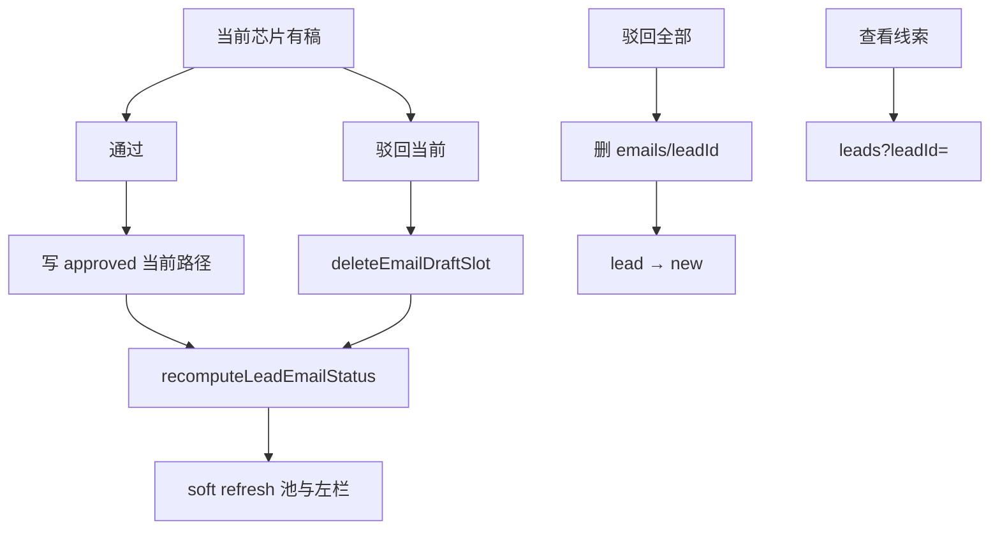

# US-M-06 详细设计：按收件人通过/驳回 + 跳转线索增强

> **用户故事**：作为业务员，我希望对开发信按收件人（槽）通过或驳回——驳回只删当前槽、不影响其它人的稿；并能从邮件页快速跳回对应线索，左栏能看出本线索审核完成度。  
> **范围**：按槽 `approve` / `reject` IPC 与落盘；删单槽后 lead `status` 回退规则；「驳回全部」次入口；邮件页按钮文案与 Confirm；左栏完成度；邮件→线索导航（`email-to-lead-navigation`）。  
> **依赖**：[21-需求-开发信重构.md](../21-需求-开发信重构.md) E9、§5 US-M-06、§6.2；[US-M-01](US-M-01-EmailDraft-schema与落盘.md)（`deleteEmailDraftSlot`、多槽 status 聚合）；[US-M-02](US-M-02-起草策略1+N.md)（`email_drafted`）；[US-M-03](US-M-03-邮件页收件人切换.md)（芯片、当前槽、M-03 已实现「通过=写当前槽」、驳回仍整 lead）；现网 `emails-writer` / `EmailView` / `LeadsView`。  
> **不在本期**：中文对照（**US-M-05**）；SMTP 发送；清理「计划外孤儿个人向目录」的批量扫盘工具（可作 Should 或后续）；改风格重写旧稿（M-04 已禁）。  
> **文档位置**：`docs/design/`  
> **交互参考**：沿用 `ftcs-console.pen` 邮件页顶栏动作区；完成度可用左栏 meta 行数字，不做复杂 badge 堆叠。

---

## 0. 相对现网（M-03 落地后）

| 现网（M-03） | **本期（M-06）** |
|--------------|------------------|
| **通过**：写 **当前槽** → `approved`，线索 → `email_approved` | 语义保留「当前槽」；澄清：有其它 `pending_review` 时 lead 是否仍升 `email_approved`（见 Q3） |
| **驳回**：删整 `emails/{leadId}/` + lead → `new`，Confirm 写明整线索 | **默认驳回 = 仅删当前槽**；另提供「驳回本线索全部开发信」 |
| 左栏仅主题/聚合 status | 展示 **已通过数 / 有稿槽数**（或待审数） |
| 线索→邮件有 `?leadId=`；邮件→线索弱 | 邮件页「查看线索」→ 线索页定位该 lead（抽屉或高亮） |
| lead-store 已有 `deleteEmailDraftSlot` | 桌面 writer/IPC 接通；删光后回退 status |

---

## 1. 目标与非目标

### 1.1 目标

1. **通过**：对当前选中收件人槽审核通过并落盘（可带未保存编辑）；不改其它槽文件内容。  
2. **驳回（默认）**：只删除当前槽 `draft.json`（及同级 `draft.md` / 空个人目录）；其它槽保留；刷新池后切到合理下一槽或空态。  
3. **驳回全部**：保留「清空本线索全部开发信 + lead→`new`」能力，文案/入口与默认驳回区分。  
4. **lead status**：与磁盘槽位一致——有稿则可 `email_drafted`；存在已通过槽可 `email_approved`；**槽全部删光** → 回退 `new`（E9）。  
5. **左栏完成度**：一眼看出该 lead 审核进度。  
6. **邮件→线索**：从当前 lead 一键跳回线索页并定位。

### 1.2 非目标

| 不做 | 归属 |
|------|------|
| 中文对照生成/展开 | US-M-05 |
| 真正发信 / SMTP | 后续阶段 |
| 批量「一键通过本线索全部槽」 | 本期不做（可手点芯片逐个通过）；避免误操作 |
| 自动删除 plan 外孤儿个人向目录（无用户触发） | Should 可选「清理无主档槽」另议；默认可手驳回 |
| 改全局风格扫盘重写 | 禁止（M-04） |

---

## 2. 已确认选型（Q 表）

| 项 | 决定 |
|----|------|
| **Q1 默认「驳回」语义** | **仅当前槽**。Confirm：「将删除「{收件人}」的开发信，其它收件人草稿保留。」危险按钮。 |
| **Q2 「驳回全部」入口** | 顶栏驳回旁 **下拉次项**，或 Confirm 内第二按钮「驳回本线索全部」。推荐：**主按钮=驳回当前**；Confirm 底部文字链/次按钮「驳回本线索全部开发信…」再二次确认。避免误触整删。 |
| **Q3 通过后 lead status** | **任一槽**变为 `approved` 即可将 lead → `email_approved`（与现网「有通过即升」一致）。其它槽可仍为 `pending_review`。不要求全部槽通过才升。 |
| **Q4 通过时未保存编辑** | 与现网一致：通过时写入当前编辑区 `subject`/`body`（等同先保存再标 approved）。 |
| **Q5 无稿槽上的通过/驳回** | **禁用**。空态只有「起草」。 |
| **Q6 删当前槽后 UI** | 刷新 list + pool；若池中仍有 **有稿** 槽 → 按 M-03 默认规则选中（公司向有稿优先…）；若仅剩无稿芯片 → 停在公司向空态；若整 lead 已无任何稿且非路由 stub → **移出左栏**（或保留 stub 仅当 `?leadId=` 仍指向）。 |
| **Q7 删光后 lead status** | `emails/{leadId}/` 下 **无任何** `draft.json`（含删空后移除空目录）→ scored lead `status` → **`new`**。若仍残留空目录，writer 应尽量 `rm` 空 `emails/{leadId}`。 |
| **Q8 删一槽后仍有其它稿时的 status** | 若剩余槽中 **任一** `approved` → 保持 `email_approved`；否则若仍有稿 → `email_drafted`；无稿 → `new`。 |
| **Q9 通过是否要求 subject 非空** | **是**（沿用现网）；空主题拒绝并通过提示。 |
| **Q10 IPC 形状** | `approve` 入参保持 `recipientKey`（M-03 已有）。`reject` 扩展：`scope: 'slot' \| 'lead'`（默认 `'slot'`）+ `recipientKey`（slot 时必填）。 |
| **Q11 桌面 vs MCP** | 审批 **仅桌面主进程**写盘（与画像/驳回一致），不经 Agent。可复用 lead-store `deleteEmailDraftSlot` 逻辑（抽共享或桌面复刻路径规则，避免双源漂移——优先桌面调用与 M-01 相同路径约定）。 |
| **Q12 左栏完成度文案** | `{approvedCount}/{draftCount} 已通过`；若 `draftCount===0` 显示「无稿」。次要：芯片点上已有有稿/无稿区分，本期可不改芯片。 |
| **Q13 邮件→线索** | 顶栏或预览区次按钮「查看线索」→ `router.push({ name: 'leads', query: { leadId } })`；线索页读取 `leadId`：**选中行 + 打开抽屉**（与现网抽屉一致）。无该 lead 时 toast。 |
| **Q14 线索→邮件增强** | Should：列表「已写邮件」旁显示 `draftCount` 或「待审 n」；Must 可仅做邮件→线索。详设将线索侧完成度标为 **Should**。 |
| **Q15 聚合 list status** | 继续 M-01 规则：任一 `pending_review` → 行 status `pending_review`；否则任一 `approved` → `approved`。左栏完成度用计数，不单靠聚合 status。 |

---

## 3. 状态机

### 3.1 单槽 `draft.status`

```text
pending_review ──通过──► approved
       │
       └──驳回(删文件)──► （槽不存在）
```

无「rejected」落盘态：驳回 = **物理删除**该槽文件（与现网整 lead 驳回哲学一致，只是粒度变细）。

### 3.2 Lead `status`（scored.json）

```text
                 任意槽 save 成功
new ──────────────────────────► email_drafted
                                      │
                    任一槽 approve      │  删光全部槽
                 ◄────────────────────┤──────────────► new
                    email_approved ◄───┘
                         │
                         │ 删光全部槽
                         └──────────────────────────► new
```

| 事件 | lead status |
|------|-------------|
| 首次任意槽落盘（M-02 save） | → `email_drafted`（已有） |
| 当前槽通过，且此前非 `email_approved` | → `email_approved` |
| 驳回当前槽后仍有其它稿 | 按 Q8 重算：`email_approved` / `email_drafted` |
| 驳回当前槽或驳回全部后无稿 | → `new` |
| 驳回全部 | 删目录 + → `new`（同现网） |

---

## 4. 写盘与 IPC

### 4.1 `approveEmailDraft`（修订说明）

M-03 已按 `recipientKey` 写当前槽。M-06 补充：

1. 写入后调用 **`recomputeLeadEmailStatus(productId, leadId)`**（统一函数，供 approve/reject 共用）。  
2. 返回值增加：`recipientKey`、`leadStatus`、`remainingDraftCount`（可选，便于 UI）。  
3. 单测：通过个人向不改公司向文件 mtime/内容；lead → `email_approved`。

### 4.2 `rejectEmailDraft`（破坏性变更）

| 入参 | 说明 |
|------|------|
| `productId` | 必填 |
| `leadId` | 必填 |
| `scope` | `'slot'`（默认）\| `'lead'` |
| `recipientKey` | `scope=slot` 时必填（`company` 或个人 key） |

**`scope=slot`**

1. 解析路径：company → `emails/{id}/draft.json`；person → `emails/{id}/{key}/draft.json`（+ md）。  
2. 删除；person 目录空则删目录。  
3. 若 `emails/{id}/` 下已无任何 `draft.json`，删除空 lead 目录。  
4. `recomputeLeadEmailStatus`。  
5. 返回 `ok`、文案「已驳回当前收件人开发信」、`remainingDraftCount`。

**`scope=lead`**

1. 行为 = 现网：`rm` 整目录 + lead → `new`。  
2. Confirm 文案必须含「全部」。

实现注意：优先复用 lead-store `deleteEmailDraftSlot` 的路径规则；桌面可 `import` 打包进主进程的共享逻辑，或在 `emails-writer` 内保持与 `resolveSlotDraftAbsPath` 一致。

### 4.3 `recomputeLeadEmailStatus`

伪代码：

```text
slots = 枚举该 lead 全部 draft.json
if slots.length === 0 → status = new
else if slots.some(s => s.status === 'approved') → email_approved
else → email_drafted
写回 scored.json（仅改该 lead.status + stats）
```

### 4.4 IPC / Preload / 类型

| Channel | 变更 |
|---------|------|
| `email:draft-approve` | 已有；返回补字段 |
| `email:draft-reject` | 入参加 `scope` / `recipientKey` |

前端 `RejectEmailDraftInput` 扩展；旧调用方若只传 `productId+leadId` → 视为 **`scope: 'lead'`** 会误伤。**破坏性**：默认改为 `slot`，邮件页必须显式传 `recipientKey`。线索页若无驳回入口则无影响。

---

## 5. UI（EmailView + LeadsView）

### 5.1 邮件页顶栏

```text
… | 保存 | 通过 | 驳回 ▾ | 查看线索 |
```

| 控件 | 行为 |
|------|------|
| **通过** | 当前槽有稿且非 busy；成功后 soft refresh；文案可保留「通过」 |
| **驳回** | 打开 Confirm（当前槽）；成功后按 Q6 选槽 |
| **驳回 ▾ / 次项** | 「驳回本线索全部…」→ 二次 Confirm → `scope=lead` |
| **查看线索** | Q13；`btn-secondary` / 文字按钮 |

驳回 Confirm 主文案示例：

> 确定驳回「Acme · Erik」的开发信吗？仅删除该收件人草稿，其它收件人保留。

全部驳回：

> 确定删除「Acme」的全部开发信吗？线索将回到未写邮件状态。

### 5.2 左栏完成度

在 `draft-list__meta` 增加：

```text
待审核 · 1/3 已通过 · high
```

或更短：`1/3 通过`。数据来自 list 行：需 DTO 增加：

| 字段 | 说明 |
|------|------|
| `approvedCount` | status===approved 的槽数 |
| `draftCount` | 已有（M-01） |
| `pendingSlotCount` | 可选：pending_review 槽数 |

`buildLeadRow` / snapshot 计算即可，不必新 IPC。

### 5.3 芯片

本期可不改。可选 Should：已通过槽点色改为 success 绿点。

### 5.4 线索页（Should）

- `query.leadId`：mount/watch 时选中 + `openDrawer`。  
- 列表「已写邮件」展示 `draftCount` 或待审（若 listEmailDrafts 已缓存于 workspace）。

Must 范围以邮件→线索 + 邮件页审批为主；线索增强标 Should，编码可同 PR 顺手做。

---

## 6. 端到端



---

## 7. 实现清单（编码阶段）

| 层 | 改动 |
|----|------|
| `emails-writer` | `reject` 支持 scope；`recomputeLeadEmailStatus`；approve 走统一重算 |
| `emails-reader` | list 行补 `approvedCount` / `pendingSlotCount` |
| IPC / preload / types | Reject 入参；Approve 返回；DTO 计数 |
| EmailView | 驳回 Confirm 双路径；查看线索；左栏完成度；去掉「整线索」误导主文案 |
| LeadsView | `?leadId=` 定位+抽屉（Should） |
| 单测 | 删个人向保留公司向；删光→new；通过个人向→email_approved；scope 默认 |
| 文档 | 本文；docs/21 详设索引；M-03 §10 可标「M-06 已详设」 |

**不改**：批量 plan/Skill；风格设置；中文对照。

---

## 8. 验收

| # | 步骤 | 期望 |
|---|------|------|
| A1 | lead 有公司向+2 个人向；驳回其中一人 | 仅该子目录删除；另两稿仍在；池刷新 |
| A2 | 驳回后 lead 仍有稿且无人 approved | status=`email_drafted` |
| A3 | 先通过公司向，再驳回一公司向？ | 公司向删掉；若个人向仍有 approved → 仍 `email_approved`；若无 approved 仅 pending → `email_drafted` |
| A4 | 驳回至槽数=0 | 无 `emails/{id}/`；lead=`new`；左栏该项消失（无路由 stub） |
| A5 | 「驳回全部」 | 整目录删；lead=`new`；二次确认文案含「全部」 |
| A6 | 通过当前个人向 | 仅该文件 approved；公司向文件未变；lead=`email_approved` |
| A7 | 无稿芯片 | 通过/驳回禁用 |
| A8 | 左栏 | 显示 `approvedCount/draftCount` |
| A9 | 查看线索 | 进入线索页并选中该 lead（Should：开抽屉） |
| A10 | 主驳回误操作 | 不会一次删光整 lead（须走全部入口） |

---

## 9. 风险与缓解

| 风险 | 缓解 |
|------|------|
| 用户习惯「驳回=清空线索」 | 主路径改当前槽；全部入口降级+强文案 |
| 桌面删槽与 lead-store 路径不一致 | 共用 `resolveSlotDraftAbsPath` / `deleteEmailDraftSlot` |
| 删槽后选中丢失乱跳 | 明确 Q6；单测 UI 状态机可选 |
| `email_approved` 但多数槽未审 | 产品接受（Q3）；完成度数字提示未完 |
| IPC 默认 scope 破坏旧客户端 | 仅桌面内部调用；同步改 EmailView |

---

## 10. 后续故事接口

| 故事 | 依赖 |
|------|------|
| M-05 | 对照区与审批并存；驳回删槽时 zh 随文件删除 |
| 发送阶段 | 仅 `approved` 槽可进入发送队列（未来） |

---

## 11. 变更记录

| 日期 | 说明 |
|------|------|
| 2026-09-17 | 初稿：按槽驳回/通过、status 重算、驳回全部次入口、左栏完成度、邮件→线索导航 |
| 2026-09-17 | **编码落地**：writer scope reject + recompute；EmailView 双确认/查看线索/完成度；LeadsView `?leadId=` 开抽屉 |
