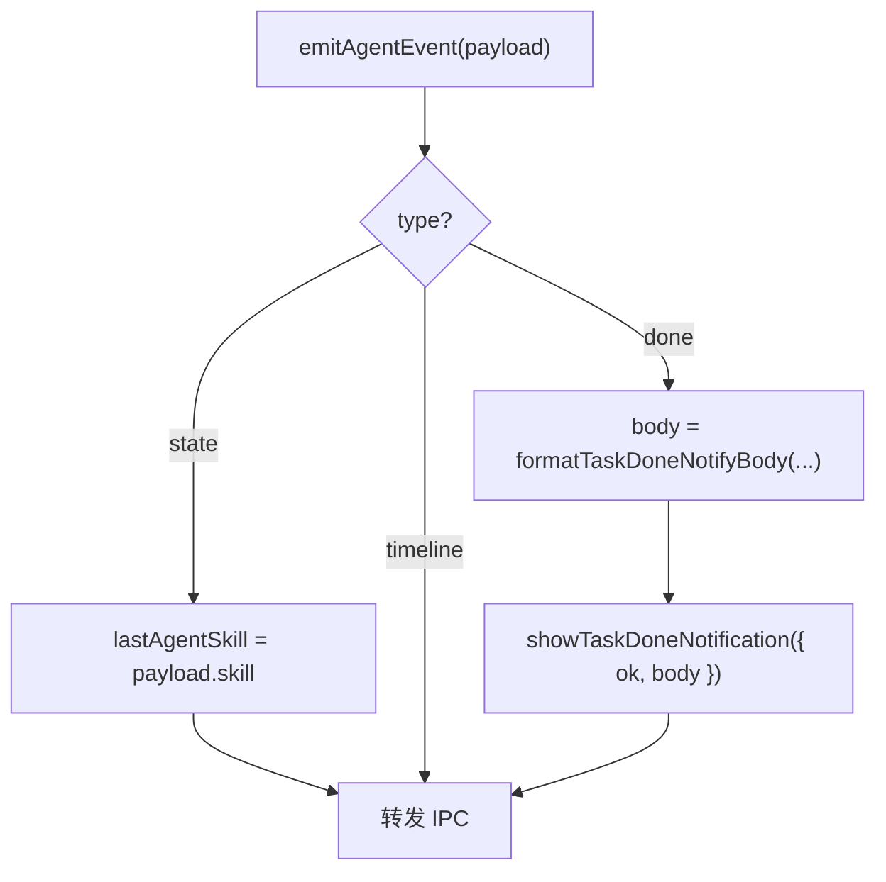

# US-N-02 详细设计：单步 Agent 任务完成通知挂钩

> **用户故事**：作为外贸业务员，我想在单独跑探索/评分/起草等长任务并切到别的窗口时被提醒，以便及时回来看结果。  
> **范围**：在主进程 `emitAgentEvent` 的 `type: 'done'` 路径调用 `showTaskDoneNotification`；按 **skill + 成败** 生成固定/半固定通知正文；不改 Agent 业务逻辑。  
> **依赖**：[22-需求-任务完成Windows通知.md](../22-需求-任务完成Windows通知.md) N1、N3～N6；[US-N-01](US-N-01-任务完成通知服务与设置.md)（`showTaskDoneNotification`、编排抑制闸门）。  
> **不在本期**：编排整段一次通知与抑制开/关调用点（**US-N-03**）；点击后路由业务页；改写各 runner 的磁盘 `message`（仅影响系统通知 body）。  
> **文档位置**：`docs/design/`

---

## 0. 相对现网 / N-01

| 现网 / N-01 | **本期（N-02）** |
|-------------|------------------|
| `emitAgentEvent` 只转发 IPC | `done` 时额外尝试系统通知 |
| `showTaskDoneNotification` 已就绪，无调用方 | 本故事成为单步调用方 |
| `done` 无 `skill` 字段 | 用最近一次 `state.skill` 记忆（见 §3） |
| 编排抑制 flag 存在但未置位 | N-02 **尊重** `isWorkflowNotifySuppressed()`；置位由 N-03 负责 |

---

## 1. 目标与非目标

### 1.1 目标

1. N6 所列长任务在单步 `done` 时，若开关开启且窗口未聚焦（且未被编排抑制），弹出系统通知。  
2. **标题**恒为 `FTCS·外贸获客智能体`（N-01）。  
3. **正文**按场景使用本文 §5 **冻结文案表**（成功 / 失败 / 中止分类清晰；不含邮箱全文、不含本机绝对路径）。  
4. 通知失败不影响 Agent 结果与 IPC。

### 1.2 非目标

| 不做 | 归属 |
|------|------|
| `executePlan` 抑制与整段通知 | US-N-03 |
| 单条验邮、设置测试连接等非 Agent 长跑 | N6 排除 |
| 修改时间线 / Toast 文案 | 仅系统通知 |
| 为 `done` 增加新 IPC 字段给渲染进程 | 可选后续；本期用主进程侧 skill 记忆即可 |

---

## 2. 已确认选型（Q 表）

| 项 | 决定 |
|----|------|
| **Q1 挂钩点** | **`main.ts` → `emitAgentEvent`**：任意来源（runner / catch）发出的 `done` 统一处理，避免漏挂 |
| **Q2 skill 来源** | 模块级 `lastAgentSkill`：每次 `payload.type === 'state'` 更新为 `payload.skill`；`done` 时读取。进程重启清空 |
| **Q3 正文策略** | **不直接原样使用** runner 的 `message`（常含路径、run id、过长错误）。用 `formatTaskDoneNotifyBody({ skill, ok, message })` 生成 §5 文案；失败原因取自 `message` **截断摘要** |
| **Q4 中止判定** | `ok === false` 且 `message` 匹配 `/中止/` → 文案走「已中止」模板；否则走「失败」模板 |
| **Q5 空 skill** | `lastAgentSkill` 为空 → 通用模板：成功「任务已完成」/ 失败「任务失败」/ 中止「任务已中止」 |
| **Q6 批量 vs 单槽起草** | 二者 skill 均为 `draft-outreach-email`。用 `message` 前缀区分：含「单槽」→ 单人起草文案；否则 → 批量起草文案。中文对照 skill 为 `translate-outreach-email`，单独映射 |
| **Q7 探索渠道** | skill `discover-leads` / `discover-leads-r2` / `discover-leads-r3` 分别对应 R1/R2/R3 文案 |
| **Q8 成功是否带数量** | **带**：能从现网 `message` 稳定解析的数量写入括号；解析失败则用无数量的成功句（§5.2） |
| **Q9 无需起草（0 条）** | 仍属 `done` + `ok: true` → **要通知**（用户可能已切走）；正文用 §5.2「暂无待起草」句 |
| **Q10 隐私** | 正文禁止出现完整邮箱、`draftPath`、工作区绝对路径；失败摘要再做一次路径脱敏（匹配盘符或 `/data/` 片段则改为「详见应用内时间线」） |

---

## 3. 挂钩流程



伪代码：

```ts
let lastAgentSkill = ''

function emitAgentEvent(sender, payload) {
  try {
    if (payload.type === 'state' && payload.skill) {
      lastAgentSkill = payload.skill
    }
    if (payload.type === 'done') {
      const body = formatTaskDoneNotifyBody({
        skill: lastAgentSkill,
        ok: payload.ok,
        message: payload.message || '',
      })
      showTaskDoneNotification({ ok: payload.ok, body })
    }
  } catch {
    // 静默：绝不阻断转发
  }
  // …现有 IPC 转发…
}
```

`showTaskDoneNotification` 内部已含：开关、编排抑制、未聚焦、`isSupported`（N-01）。

---

## 4. 模块与实现清单

| 路径 | 职责 |
|------|------|
| `desktop/electron/notify/task-done-notify-body.ts` | `formatTaskDoneNotifyBody`、skill 中文名、数量解析、失败脱敏；**纯函数可单测** |
| `desktop/electron/notify/task-done-notify-body.test.ts` | §5 全表用例 + 脱敏 + 中止判定 |
| `desktop/electron/main.ts` | `emitAgentEvent` 挂钩；可选 `resetLastAgentSkillForTests` 不必导出 |
| 单测脚本 | `package.json` `test:library` 纳入 body 测试 |

**不改**：各 `run*` 成功/失败 `message` 字符串（时间线仍用现网长文案）。

---

## 5. 通知框文案冻结表（Must）

### 5.0 公共

| 项 | 内容 |
|----|------|
| **标题** | `FTCS·外贸获客智能体`（N-01 常量，不可改） |
| **正文上限** | 模块截断 180 码位（N-01）；本表设计句均远短于上限 |
| **语气** | 短句、无产品 ID、无 run id、无路径 |

### 5.1 任务显示名（skill → 名称）

| `skill` | 显示名 `{任务}` |
|---------|----------------|
| `extract-product-profile` | 产品画像 |
| `expand-keywords` | 关键词扩展 |
| `discover-leads` | R1 广撒网 |
| `discover-leads-r2` | R2 社媒发现 |
| `discover-leads-r3` | R3 地图发现 |
| `score-and-dedupe` | 评分去重 |
| `enrich-lead-contacts` | 补全联系人 |
| `draft-outreach-email` | 开发信起草（再按 §2 Q6 细分为批量/单人） |
| `translate-outreach-email` | 中文对照 |
| （空 / 未知） | 任务 |

### 5.2 成功（`ok: true`）— 通知正文

| # | 场景 | 判定 | **通知正文（精确）** |
|---|------|------|---------------------|
| S1 | 产品画像生成成功 | skill=`extract-product-profile` | `产品画像已生成` |
| S2 | 关键词扩展成功 | skill=`expand-keywords` | 优先 `关键词扩展已完成（{n} 条搜索词）`；无法解析 n 时：`关键词扩展已完成` |
| S3 | R1 探索成功 | skill=`discover-leads` | 优先 `R1 广撒网已完成（线索 {n}）`；无法解析：`R1 广撒网已完成` |
| S4 | R2 探索成功 | skill=`discover-leads-r2` | 优先 `R2 社媒发现已完成（线索 {n}）`；无法解析：`R2 社媒发现已完成` |
| S5 | R3 探索成功 | skill=`discover-leads-r3` | 优先 `R3 地图发现已完成（线索 {n}）`；无法解析：`R3 地图发现已完成` |
| S6 | 评分去重成功 | skill=`score-and-dedupe` | 优先 `评分去重已完成（A {h} / B {m} / C {l}）`；无法解析：`评分去重已完成` |
| S7 | 批量补全联系人成功 | skill=`enrich-lead-contacts` 且 message 含「批量」 | `批量补全联系人已完成` |
| S8 | 单条补全联系人成功 | skill=`enrich-lead-contacts` 其它成功 | `补全联系人已完成` |
| S9 | 批量起草成功（有稿） | skill=`draft-outreach-email` 且 message **不含**「单槽」，且 **不含**「暂无待起草」「未指定有效」 | 优先 `开发信起草已完成（{n} 封）`；无法解析：`开发信起草已完成` |
| S10 | 批量起草：无需起草 | skill=`draft-outreach-email` 且 message 含「暂无待起草」或「未指定有效」 | `开发信：暂无待起草线索` |
| S11 | 单槽起草成功 | skill=`draft-outreach-email` 且 message 含「单槽」 | `开发信单人起草已完成` |
| S12 | 中文对照成功 | skill=`translate-outreach-email` | `中文对照已生成` |
| S13 | 未知 skill 成功 | skill 空或未登记 | `任务已完成` |

**数量解析约定（实现写死正则，单测锁）：**

| 来源 message 形态（现网） | 提取 |
|--------------------------|------|
| `关键词已扩展：… · {n} 条搜索词` | n |
| `R1/R2/R3…完成：… · 线索 {n}` 或 `…词 · 线索 {n}` | n |
| `评分去重完成：… · A {h} / B {m} / C {l}` | h,m,l |
| `邮件起草完成：{n} 封 · …` | n |

### 5.3 中止（`ok: false` 且 message 含「中止」）— 通知正文

| # | 场景 | **通知正文（精确）** |
|---|------|---------------------|
| A1 | 已知 skill | `已中止：{任务}`（`{任务}` 用 §5.1；单槽时仍用「开发信起草」或细分为「开发信单人起草」——**定稿：与成功细分一致**，message 含「单槽」→ `已中止：开发信单人起草`，否则 `已中止：开发信起草`） |
| A2 | 未知 skill | `已中止：任务` |

> 现网中止文案例：`用户中止了关键词扩展`、`用户中止了邮件起草`、`用户中止了单槽邮件起草` 等，均含「中止」。

### 5.4 失败（`ok: false` 且非中止）— 通知正文

| # | 场景 | **通知正文（精确模板）** |
|---|------|-------------------------|
| F1 | 已知 skill | `失败：{任务} · {原因}` |
| F2 | 未知 skill | `失败：任务 · {原因}` |
| F3 | 探索未完成/失败（message 已含 R1/R2/R3） | 仍用 F1；`{任务}` 来自 skill，不重复拼 round 名到任务字段 |

**`{原因}` 规则：**

1. 取 `message` trim 后全文。  
2. 若含「用户中止」已走 §5.3，不再进入本节。  
3. 脱敏：若匹配盘符路径、`draft.json`、`data/emails`、`profile.json` 等本地路径痕迹 → `{原因}` **固定为** `详见应用内时间线`。  
4. 否则取前 **40** 个 Unicode 码位，超出加 `…`。  
5. 空 message → `{原因}` = `详见应用内时间线`。

**示例（精确期望）：**

| 现网 message（节选） | 通知正文 |
|---------------------|----------|
| `等待 OpenCode 会话 idle 超时` | `失败：补全联系人 · 等待 OpenCode 会话 idle 超时`（skill=enrich…） |
| `单槽起草完成：D:\…\draft.json` 不会出现在失败；失败若带 path | `失败：开发信单人起草 · 详见应用内时间线` |
| `R1 广撒网失败：run_xxx · 已执行 3 词 · 线索 0` | `失败：R1 广撒网 · R1 广撒网失败：run_xxx · 已执行 3 词 · 线索 0` → 因含 run id 仍可展示（非路径）；若过长则截断 40 码位 |

为降低嘈杂，**探索失败原因**可再压缩：若 message 匹配 `/^(R[123][^：]*)(失败|未完成)/` → `{原因}` 只用到该前缀 +「，详见时间线」。**定稿采用简化规则：**

- 对 skill ∈ discover*：失败正文固定为  
  - `失败：R1 广撒网 · 详见应用内时间线`  
  - `失败：R2 社媒发现 · 详见应用内时间线`  
  - `失败：R3 地图发现 · 详见应用内时间线`  
  （不把 run id / 词数塞进 toast）  
- 其它 skill：按 F1 + 40 码位/`详见应用内时间线` 脱敏规则。

### 5.5 文案总表（验收对照用）

编码与手工验收以本表为准；标题始终为 `FTCS·外贸获客智能体`。

| 场景 ID | 正文 |
|---------|------|
| S1 | `产品画像已生成` |
| S2a | `关键词扩展已完成（{n} 条搜索词）` |
| S2b | `关键词扩展已完成` |
| S3a / S3b | `R1 广撒网已完成（线索 {n}）` / `R1 广撒网已完成` |
| S4a / S4b | `R2 社媒发现已完成（线索 {n}）` / `R2 社媒发现已完成` |
| S5a / S5b | `R3 地图发现已完成（线索 {n}）` / `R3 地图发现已完成` |
| S6a / S6b | `评分去重已完成（A {h} / B {m} / C {l}）` / `评分去重已完成` |
| S7 | `批量补全联系人已完成` |
| S8 | `补全联系人已完成` |
| S9a / S9b | `开发信起草已完成（{n} 封）` / `开发信起草已完成` |
| S10 | `开发信：暂无待起草线索` |
| S11 | `开发信单人起草已完成` |
| S12 | `中文对照已生成` |
| S13 | `任务已完成` |
| A1-batch | `已中止：开发信起草` |
| A1-slot | `已中止：开发信单人起草` |
| A1-other | `已中止：{任务}` |
| A2 | `已中止：任务` |
| F-discover | `失败：R1 广撒网 · 详见应用内时间线`（R2/R3 同理替换任务名） |
| F-other | `失败：{任务} · {原因}` |
| F-unknown | `失败：任务 · {原因}` |

---

## 6. 覆盖与排除（对照 N6）

| 操作 | 是否弹（满足 N1/N5 时） |
|------|------------------------|
| 生成画像 / 扩词 / R1·R2·R3 / 评分 / 补全 / 批量起草 / 单槽起草 / 中文对照 | **是** |
| 编排方案执行中的上述单步 `done` | **否**（抑制闸门；N-03） |
| 抽屉「验证」邮箱、Hunter 测试连接、保存设置 | **否**（无 Agent `done`） |
| Preflight 失败未启动 Agent | **否**（无 `done`；若 main catch 误发 `done` 则仍会走格式化——保持与现网 catch 行为一致即可） |

---

## 7. 验收

| # | 步骤 | 期望 |
|---|------|------|
| B1 | 前台聚焦跑评分至完成 | 不弹系统通知 |
| B2 | 切走窗口后评分成功 | 标题正确；正文为 S6a 或 S6b |
| B3 | 切走后用户中止扩词 | 正文 `已中止：关键词扩展` |
| B4 | 切走后 R1 失败 | 正文 `失败：R1 广撒网 · 详见应用内时间线` |
| B5 | 单槽起草成功（切走） | `开发信单人起草已完成`（不得出现路径） |
| B6 | 中文对照成功（切走） | `中文对照已生成` |
| B7 | 设置关闭通知 | 任何单步不弹 |
| B8 | 单测 | §5.5 主要 ID 有断言 |

---

## 8. 风险与缓解

| 风险 | 缓解 |
|------|------|
| `state` 未先于 `done` 到达导致 skill 空 | 现网 runner 均先 `pushState`/`state`；仍保留 S13/A2/F-unknown |
| 批量/单槽同 skill | Q6 用 message「单槽」区分；单测锁 |
| 编排未做 N-03 前串跑会连弹 | 与 N-03 同迭代发布；或 N-02 合入说明「请同版带上 N-03」 |
| 文案与时间线不一致 | 有意为之：toast 短、时间线保留详情 |

---

## 9. 与 US-N-03 的接口

- N-02 **不**调用 `setWorkflowNotifySuppressed`。  
- N-03 在 `executePlan` 期间置 `true`，期间本故事的 `show*` 全部 no-op。  
- 整段结束通知正文由 N-03 另表定义（勿复用单步 S/A/F 表冒充方案结果）。

---

## 10. 变更记录

| 日期 | 说明 |
|------|------|
| 2026-09-20 | 初稿：emitAgentEvent 挂钩、skill 记忆、§5 全场景通知正文冻结表 |
| 2026-09-20 | 编码落地：`task-done-notify-body.ts` + main 挂钩 |
