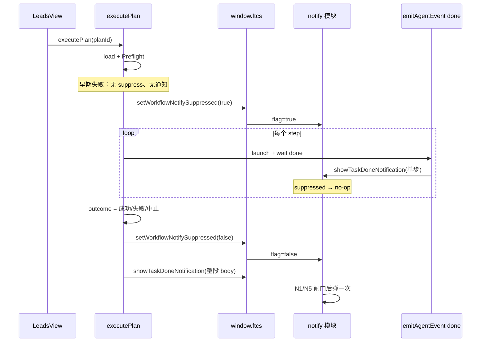

# US-N-03 详细设计：编排整段结束通知

> **用户故事**：作为外贸业务员，我想一键跑完整条方案后只被提醒一次，以便不被中间步骤打扰，又能在整段结束时回来。  
> **范围**：`executePlan` 期间打开编排抑制闸门（中间单步 `done` 不弹）；整段结束（成功 / 失败 / 中止）解除抑制并调用一次 `showTaskDoneNotification`；编排专用通知正文；渲染 → 主进程 IPC。  
> **依赖**：[22-需求-任务完成Windows通知.md](../22-需求-任务完成Windows通知.md) **N2**、N1/N3/N5；[US-N-01](US-N-01-任务完成通知服务与设置.md)（`setWorkflowNotifySuppressed` / `showTaskDoneNotification`）；[US-N-02](US-N-02-单步Agent任务完成通知.md)（单步挂钩已尊重抑制）；[US-W-03](US-W-03-顺序执行器.md) 现网 `useWorkflowExecute`。  
> **不在本期**：定时编排（W-06）；点击后路由业务页；改写应用内 `onMessage` / 时间线文案；主进程 workflow-runner。  
> **文档位置**：`docs/design/`

---

## 0. 相对现网 / N-01 / N-02

| 现网 / 前序 | **本期（N-03）** |
|-------------|------------------|
| `executePlan` 逐步 `waitForAgentDone`，每步都会 `emitAgentEvent(done)` | 跑段内 `workflowNotifySuppressed=true` → N-02 的 `show*` 全部 no-op |
| `setWorkflowNotifySuppressed` 已实现但无人调用 | 本故事为唯一置位方 |
| 整段结束只有应用内 `onMessage` | 另发 **一次** 系统通知（仍受 N1/N5） |
| 无渲染进程调通知的 IPC | 新增 suppress + show 两个 invoke |

---

## 1. 目标与非目标

### 1.1 目标

1. 多步方案串跑：中间步骤完成 **零** 次系统通知（即使窗口未聚焦）。  
2. 整段结束（全部成功，或任一步失败 / 用户中止导致链停）且 N1+N5 满足时，弹 **恰好一次** 系统通知。  
3. 正文含方案名，成败/中止可区分；失败带失败步骤显示名；**不含**邮箱全文与本机路径。  
4. 通知路径异常 **不**影响 `executePlan` 返回值与后续 UI。

### 1.2 非目标

| 不做 | 说明 |
|------|------|
| Preflight / 方案不存在 / 未选产品等「未真正开跑」失败弹系统通知 | 用户仍在点按钮上下文，不打扰；也不置抑制 |
| 把编排通知正文塞进 N-02 的 skill 表 | 另表 §5，避免与单步文案混淆 |
| `forceIgnoreSuppress` 参数 | 沿用 N-01：先解除抑制再 `show` |
| 修改 W-03 步骤语义 / Preflight | 只包一层 suppress + 结束通知 |

---

## 2. 已确认选型（Q 表）

| 项 | 决定 |
|----|------|
| **Q1 挂钩点** | **仅** `useWorkflowExecute.executePlan`（渲染进程）。不在各 `launchStep` / 主进程 runner 散落 |
| **Q2 抑制时机** | Preflight **通过**且即将 `running=true` 之后、**第一个** `launchStep` 之前：`setWorkflowNotifySuppressed(true)`。早期 return（方案不存在、无产品、已有方案在跑、Preflight 失败）**不**置位、**不**弹编排通知 |
| **Q3 解除与整段通知顺序** | `finally` 中：① 复位 UI 状态（与现网一致）；② `setWorkflowNotifySuppressed(false)`；③ 若本趟曾置位抑制且已有 `outcome`，再 `showTaskDoneNotification`。保证最后一步的单步 `done` 已在抑制期内处理完毕（`waitForAgentDone` 已 resolve），解除后不会再有该步的迟到 `show` |
| **Q4 调主进程方式** | 两个 IPC invoke（§4）：`notify:set-workflow-suppressed`、`notify:show-task-done`。渲染侧 **不**直接 `require('electron')` |
| **Q5 正文生成位置** | 渲染进程纯函数 `formatWorkflowPlanNotifyBody`（可单测）；经 IPC 只传最终 `{ ok, body }` |
| **Q6 成败语义** | 与 `WorkflowExecuteResult` 对齐：`ok: true` → 成功文案；`ok: false` 且 `message === '已中止'`（或 `isAbortError` 路径）→ 中止文案；其余 `ok: false` → 失败文案 |
| **Q7 失败步骤名** | 优先 `outcome.failedStep.label`；缺省用现网 `WORKFLOW_NODE_LABELS` / `formatWorkflowFail` 已含的步骤名解析结果；再缺省 → 不带步骤后缀 |
| **Q8 方案名** | 使用开跑时缓存的 `plan.name`（`finally` 会清掉 `currentPlanName`，故须在 `outcome` 旁保留 `planNameForNotify`） |
| **Q9 单步方案** | 仍走抑制 + 整段一次：用户只收到「方案…」文案，**不会**再收到该步的 N-02 单步文案 |
| **Q10 开关 / 未聚焦** | 仍由 `showTaskDoneNotification` 内部判定；编排侧不必重复读 prefs |
| **Q11 崩溃 / 异常** | `setSuppressed` / `show` 一律 try/catch 吞掉；`finally` 必须尽力 `setSuppressed(false)`，避免闸门卡死导致后续单步永不出通知 |
| **Q12 并发** | 现网已拒绝二次 `executePlan`；抑制 flag 为进程级单例，与「同时仅一条编排」一致 |

---

## 3. 时序



### 3.1 伪代码（`executePlan` 增量）

```ts
let outcome: WorkflowExecuteResult | null = null
let suppressArmed = false
let planNameForNotify = ''

// … 早期 return 保持原样 …

running.value = true
currentPlanName.value = plan.name
planNameForNotify = plan.name
abortController = new AbortController()
let completed = 0
let failedStep: WorkflowNodeId | undefined

try {
  await window.ftcs.setWorkflowNotifySuppressed?.(true)
  suppressArmed = true

  for (/* 现网逐步逻辑 */) { /* … */ }

  outcome = { ok: true, message: `方案「${plan.name}」已完成（${completed} 步）`, completedSteps: completed }
  options?.onMessage?.(outcome.message)
  return outcome
} catch (err) {
  // 现网 abort / fail → 赋 outcome（文案不变）
  // …
  return outcome
} finally {
  running.value = false
  currentStepIndex.value = -1
  currentStepLabel.value = ''
  currentPlanName.value = ''
  abortController = null

  if (suppressArmed) {
    try {
      await window.ftcs.setWorkflowNotifySuppressed?.(false)
      if (outcome) {
        const body = formatWorkflowPlanNotifyBody({
          planName: planNameForNotify,
          ok: outcome.ok,
          aborted: !outcome.ok && outcome.message === '已中止',
          completedSteps: outcome.completedSteps,
          failedStepLabel: outcome.ok ? undefined : outcome.failedStep?.label,
        })
        await window.ftcs.showTaskDoneNotification?.({
          ok: outcome.ok,
          body,
        })
      }
    } catch {
      // 静默
    }
  }
}
```

> **可选加固**：`setWorkflowNotifySuppressed(true)` 失败时仍继续跑方案，但 `suppressArmed` 保持 false 且打 `[ftcs:notify]` warn——宁可串跑多弹，不可因通知 IPC 挂掉整条编排。若 true 调用抛错，**不要**在 finally 里误以为曾抑制成功。定稿：**true 成功才 `suppressArmed=true`**（如上）。

---

## 4. IPC 与 preload

### 4.1 通道

| 常量 | 通道名 | 入参 | 返回 |
|------|--------|------|------|
| `IPC.NOTIFY_SET_WORKFLOW_SUPPRESSED` | `notify:set-workflow-suppressed` | `suppressed: boolean` | `void`（或 `{ ok: true }`；实现选简单 `void`） |
| `IPC.NOTIFY_SHOW_TASK_DONE` | `notify:show-task-done` | `{ ok: boolean; body: string }` | `boolean`（是否已调用 `Notification.show`；调用方忽略即可） |

### 4.2 Handler（`main.ts`）

```ts
ipcMain.handle(IPC.NOTIFY_SET_WORKFLOW_SUPPRESSED, (_e, suppressed: boolean) => {
  setWorkflowNotifySuppressed(Boolean(suppressed))
})

ipcMain.handle(IPC.NOTIFY_SHOW_TASK_DONE, (_e, input: { ok?: boolean; body?: string }) => {
  return showTaskDoneNotification({
    ok: Boolean(input?.ok),
    body: String(input?.body ?? ''),
  })
})
```

### 4.3 preload / 类型

```ts
setWorkflowNotifySuppressed: (suppressed: boolean) =>
  ipcRenderer.invoke(IPC.NOTIFY_SET_WORKFLOW_SUPPRESSED, suppressed),
showTaskDoneNotification: (input: { ok: boolean; body: string }) =>
  ipcRenderer.invoke(IPC.NOTIFY_SHOW_TASK_DONE, input),
```

`electron.d.ts` / `src/types/electron` 同步可选方法（与其它 `ftcs.*` 一致，缺省用 `?.`）。

---

## 5. 通知正文冻结表（Must）

### 5.0 公共

| 项 | 内容 |
|----|------|
| **标题** | `FTCS·外贸获客智能体`（N-01，不可改） |
| **正文上限** | 180 码位（N-01 模块截断） |
| **方案名** | 原样嵌入书名号；若空字符串 → 用「未命名方案」 |
| **隐私** | 失败正文 **只**带步骤显示名，不带 `detail` / IPC 长错误 / 路径（详情仍在应用内 `onMessage`） |

### 5.1 冻结句

| ID | 场景 | 判定 | **通知正文（精确）** |
|----|------|------|---------------------|
| **W1** | 整段成功 | `ok === true` | `任务方案「{name}」已完成（{n} 步）` |
| **W2a** | 用户中止且已完成 0 步 | `aborted` 且 `completedSteps === 0` | `任务方案「{name}」已中止` |
| **W2b** | 用户中止且已完成 ≥1 步 | `aborted` 且 `completedSteps >= 1` | `任务方案「{name}」已中止（已完成 {n} 步）` |
| **W3** | 步骤失败（有 label） | `!ok && !aborted` 且 `failedStepLabel` 非空 | `任务方案「{name}」失败：{stepLabel}` |
| **W4** | 步骤失败（无 label） | `!ok && !aborted` 且无 label | `任务方案「{name}」失败` |

其中 `{n}` = `completedSteps`；`{stepLabel}` = `failedStep.label`（与侧栏节点名一致，如「评分去重」「R1 广撒网」）。

### 5.2 `formatWorkflowPlanNotifyBody` 签名

```ts
export type WorkflowPlanNotifyInput = {
  planName: string
  ok: boolean
  aborted: boolean
  completedSteps: number
  failedStepLabel?: string
}

export function formatWorkflowPlanNotifyBody(input: WorkflowPlanNotifyInput): string
```

空 `planName` → `{name}` = `未命名方案`。`aborted` 优先于失败分支（即使误带 `failedStep`）。

### 5.3 与应用内 message 对照（有意缩短）

| 应用内（现网） | 系统通知 |
|----------------|----------|
| `方案「X」已完成（3 步）` | W1：`任务方案「X」已完成（3 步）`（前缀「任务」以区分单步） |
| `已中止` | W2a / W2b（补方案名与已完成步数） |
| `方案「X」在步骤「评分去重」失败：…长 detail` | W3：`任务方案「X」失败：评分去重` |

---

## 6. 模块与实现清单

| 路径 | 职责 |
|------|------|
| `desktop/src/utils/format-workflow-plan-notify-body.ts` | §5 纯函数 |
| `desktop/src/utils/format-workflow-plan-notify-body.test.ts` | W1～W4 + 空名 |
| `desktop/src/composables/useWorkflowExecute.ts` | §3 抑制与整段通知 |
| `desktop/src/composables/useWorkflowExecute.test.ts` | mock `ftcs`：断言中间不 show、结束 show 一次、顺序为先 unsuppress 再 show；早期 return 不调 suppress |
| `desktop/electron/ipc/types.ts` | IPC 常量 + 入参类型 |
| `desktop/electron/main.ts` | 两个 handler |
| `desktop/electron/preload.ts` | 暴露 API |
| `desktop/src/types/electron` / `electron.d.ts` | 类型 |
| `desktop/package.json` `test:library` | 纳入 body 单测（及既有 execute 测） |

**不改**：`task-done-notify-logic` 真值表；N-02 `formatTaskDoneNotifyBody`；各 Agent runner。

---

## 7. 验收

| # | 步骤 | 期望 |
|---|------|------|
| C1 | 开关开；切走窗口；执行内置多步方案至全部成功 | 中间 **0** 次系统通知；结束 **1** 次；正文 W1 |
| C2 | 同上，在第 2 步失败（或门禁失败） | 中间 0 次；结束 1 次；正文 W3（带步骤名） |
| C3 | 切走后点中止 | 结束 1 次；正文 W2a 或 W2b |
| C4 | 窗口保持前台聚焦跑完整段 | **不**弹系统通知（N1）；抑制仍生效（无中间弹） |
| C5 | 设置关闭「任务完成通知」 | 整段亦不弹 |
| C6 | Preflight 失败（未开跑） | 无 suppress 调用（或可观测无 show）；无系统通知 |
| C7 | 仅 1 步的方案成功（切走） | 仅 1 次「任务方案…」通知，**无**该步 N-02 单步文案 |
| C8 | 单测 | body 表 + executePlan mock 顺序 |

---

## 8. 风险与缓解

| 风险 | 缓解 |
|------|------|
| `finally` 未解除抑制 → 之后单步永不出通知 | Q11：只要 `suppressArmed` 必调 `false`；进程重启亦清零（N-01） |
| 解除抑制与最后一步 `done` 竞态 | 依赖 `waitForAgentDone` 已收到 `done` 后才进入下一步/结束；`emitAgentEvent` 内 `show` 同步执行 |
| 开发态 Windows 点击仍无响应 | 与 N-02 同属平台问题；本故事不扩展 toastXml；验收聚焦「是否弹出 / 次数」 |
| 方案名过长撑爆 toast | N-01 统一截断 180；方案名现网较短 |
| 测试未 mock 新 IPC 导致 undefined | `?.` 调用；单测注入 mock |

---

## 9. 与 N-01 / N-02 边界

| 故事 | 职责 |
|------|------|
| N-01 | 闸门、prefs、`show*`、`setWorkflowNotifySuppressed` 实现 |
| N-02 | 任意 `done` → 单步文案 `show*`（尊重抑制） |
| **N-03** | 置/清抑制；整段文案；唯一编排结束 `show*` 调用方 |

发版建议：**N-01～N-03 同版**；若曾单独合入 N-02，串跑会连弹，须尽快带上本故事。

---

## 10. 实现顺序（编码阶段）

1. IPC + preload + handler（可先用临时调试调通 suppress）  
2. `formatWorkflowPlanNotifyBody` + 单测  
3. `executePlan` 接线 + `useWorkflowExecute.test.ts` 断言  
4. 真机：多步成功 / 中途失败 / 中止 / 前台不弹 / 开关关闭  

---

## 11. 变更记录

| 日期 | 说明 |
|------|------|
| 2026-09-20 | 初稿：executePlan 抑制时序、IPC、W1～W4 正文冻结表、与 N-01/N-02 边界 |
