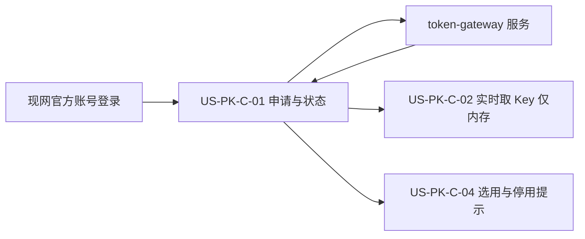
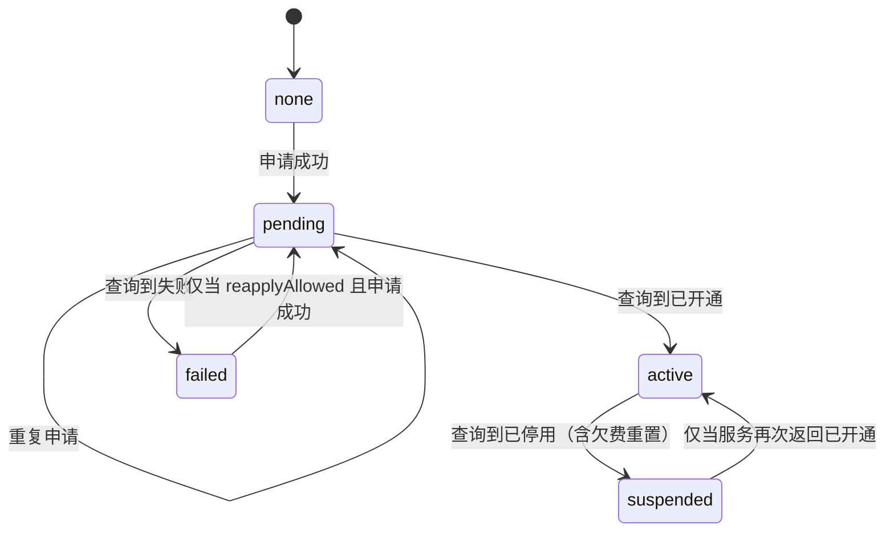
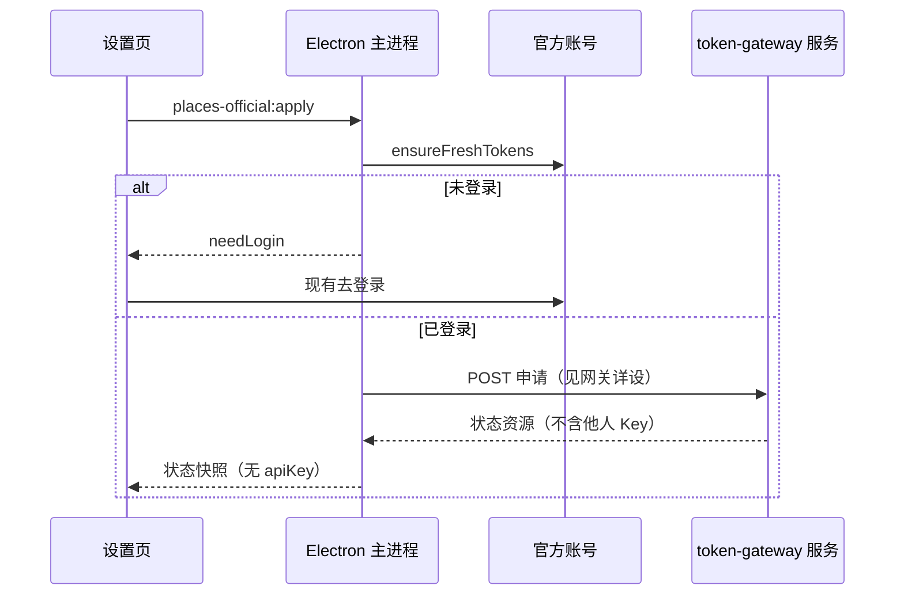

# US-PK-C-01 申请官方 Places Key 与状态展示

> **用户故事**：[../30-需求-Places官方通道按用户下发APIKey.md](../30-需求-Places官方通道按用户下发APIKey.md) · US-PK-C-01 · Issue #21  
> **状态**：**待评审**（本文件只定设计；业务代码尚未按本文改动）  
> **范围**：设置页申请官方 Places Key；展示未申请 / 申请中 / 已开通 / 失败 / 已停用；未登录只引导登录  
> **依赖**：现网官方账号登录（`auth:login`）；[US-PK-token-gateway-接口与管理端.md](US-PK-token-gateway-接口与管理端.md) 的「提交申请」「查询状态」；取 Key 见 [US-PK-C-02](US-PK-C-02-接收并安全保存官方Key.md)  
> **不做**：开通、吊销、对账（管理端）；服务端代调 Places；在探索页或引导页直接提交申请  
> **文档位置**：`docs/design/`  
> **与旧详设**：取代「官方通道没有 Places、只能等 US-E-10 代调或自己填 BYOK」这层产品口径。旧文件保留不改，替换关系见 §0.1。

申请入口与状态文案以本文为准。官方 Key 不在申请或刷新时落到本机；用时再取见 C-02，注入与选用见 C-03、C-04。服务端路径、错误码以网关详设为准，本文不另写一套 URL。

---

## 0. 相对现网

对照 `dev-0.5.8` 已落地的设置页与 R3 启动口径（2026-10-10 读码）。

| 现网 | **本期（US-PK-C-01）** |
|------|------------------------|
| 设置 → 探索 →「R3 地图发现（Google Places）」只有自备 Key 输入框，说明费用计入用户自己的 GCP | 同一区块**上方**增加官方 Places Key 状态与「申请官方 Places Key」。自备 Key 输入框保留，归 C-04 |
| 未登录官方账号时，模型通道区有「去登录」（`AUTH_LOGIN`） | 申请官方 Places Key 复用这条登录。未登录不调用申请接口 |
| `officialProvisioned` 表示本机已有模型网关 `sk`（`FTCS_GATEWAY_API_KEY`） | **不**作为能否申请 Places Key 的条件。Places 申请认的是官方账号，不是模型 sk |
| 探索页「开始 R3」仅看 `placesApiKeySet`（自备 Key 是否在 `.env`） | 按钮是否可点改由 C-04 的「当前生效 Key」决定。本故事只要求：Preflight 失败文案能区分申请中 / 失败 / 已停用，并给出打开设置的说明 |
| 文案写明「官方通道不提供 Places 代调」 | **保留**「不代调、本机直连」这一事实。删掉「因此你不能申请官方 Places」的含义。禁止出现「官方代为查询 / 代调 Places」 |

### 0.1 旧 US-E-10 在本故事里哪些作废

完整对照表在[网关详设 §0.1](US-PK-token-gateway-接口与管理端.md)。本故事只替换下面这些**用户可见口径**（旧 md **不删、不改**）：

| 旧陈述 | 本故事 |
|--------|--------|
| [US-E-10](US-E-10-Places官方网关.md)：官方 Places 若重启，也是 token-gateway **代调** | 作废。申请得到的是下发到本机的 Key，Places 仍由本机直连 Google |
| [US-E-09](US-E-09-探索页开始R3与Preflight.md) Q7：官方通道无自备 Key 时禁止 R3，并提示不提供代调 | 「不提供代调」仍然成立。「无自备 Key 就不能用 R3」在官方 Key **已开通且被选为当前通道**时不再成立。未开通时的拦截文案改成状态说明，不再写成「永远只能 BYOK」 |
| 设置页只引导用户去 Google Cloud Console 自己建 Key | 自备 Key 的帮助链接保留。另加官方申请，不把两条路径写成互相取消 |

---

## 1. 与相邻故事的分工



| 模块 | 本期 |
|------|------|
| **US-PK-C-01** | 入口、登录闸门、状态枚举、文案、申请 / 刷新 IPC、渲染层不接触 Key 明文 |
| **US-PK-C-02** | 实时获取官方 Key、仅内存使用。申请响应里没有 Key |
| **US-PK-C-03** | 用生效 Key 直连 Google；Places 只发现 |
| **US-PK-C-04** | 与 BYOK 的切换、停用后的「改用自备 Key」 |
| **引导页** | 不增加申请。现有可选 BYOK 框保持 |

---

## 2. 已确认选型

需求 PK1、PK3、PK11 不动。下面这些是详设可以定、且不依赖 O7–O11 的部分。

| 项 | 决定 |
|----|------|
| **入口** | **设置 → 探索 → R3 地图发现**区块内，放在自备 Key 输入框**上面**。探索页、方案执行前的 Preflight **不提交申请**，只展示一句状态，并写明到该设置区块操作 |
| **引导页** | `OnboardingOverlay` 不增加申请按钮，避免未登录用户在引导里打到网关 |
| **身份** | 只使用现网官方账号 access token（`ensureFreshTokens`，与 `POST /keys/rotate` 相同）。请求体**不**带 `userId`，防止替他人申请 |
| **与模型通道的关系** | 申请不读取 `channelMode`，也不要求 `officialProvisioned`。若产品最终改成「仅官方模型通道可申请」，只改 §4.1 的 `canApplyPlacesOfficialKey` 一处。默认按[待确认](US-PK-token-gateway-接口与管理端.md)里的推荐：已登录即可 |
| **状态** | 五个值：`none` 未申请、`pending` 申请中、`active` 已开通、`failed` 失败、`suspended` 已停用。欠费与吊销都仍是 `suspended`，用 `reasonCode` / `reasonMessage` 区分。**不**新增「已吊销」状态，等需求 #61 定稿再改 |
| **T+1 文案** | 优先展示服务返回的 `expectedReadyNote`。该字段为空时，用固定句：「预计在受理后的下一自然日内开通。」客户端不写死时区、不自己算截止时刻（O2 未定） |
| **再次申请** | 按钮是否出现只看响应字段 `reapplyAllowed`。政策见待确认，客户端不写死「失败一定能再申请」 |
| **代调文案** | 本区块说明句固定包含「Places 由本机直连 Google，不经 FTCS 服务器代查」。不出现「官方代调」 |
| **设置页调哪个接口** | 只调状态接口 `GET {base}/places/official-key`。该响应只有状态和说明，没有 Key。设置页、申请、点「刷新状态」都不调用取 Key `GET .../current` |
| **何时查状态** | 打开设置页一次；申请提交成功后再查一次；用户点「刷新状态」再查一次。同一次停留里不重复打。不轮询。开始 R3 **不**为刷新界面先查状态 |
| **渲染进程** | 只拿状态、原因、`reapplyAllowed`。没有 Key，也没有掩码 |

---

## 3. 状态机

状态只随服务响应变化。客户端不在本地把 `pending` 猜成 `active`。



| `reasonCode`（`suspended` / `failed`） | 用户可见含义 |
|----------------------------------------|----------------|
| `insufficient_balance` | 欠费。运行中的任务用「已欠费，请充值」（C-03 §3.1） |
| `abuse` | 已吊销（异常用量） |
| `account_closed` | 已吊销（账号注销） |
| `manual` | 已停用（运营处置） |
| `provision_failed` | 开通失败 |
| 其它或空 | 只用 `reasonMessage`；再空则用 §4.2 的兜底句 |

服务可以增加新的 `reasonCode`。客户端不认识时走兜底句，不要当成 `none`。

---

## 4. 界面

### 4.1 谁能点申请

```typescript
function canApplyPlacesOfficialKey(input: {
  loggedIn: boolean
}): boolean {
  return input.loggedIn
}
```

未登录：主按钮文案是「去登录」，调用现有 `window.ftcs.login`（`AUTH_LOGIN`），**不**调用 `places-official:apply`。

已登录且 `reapplyAllowed !== false` 且状态是 `none` 或 `failed`：主按钮「申请官方 Places Key」。  
`pending`：按钮禁用，文案「申请中」。  
`active`：不显示申请按钮，显示「刷新状态」。  
`suspended` 或 `reapplyAllowed === false`：不显示申请按钮。

`reapplyAllowed` 缺省按 `false` 处理的只有 `suspended`。`none` 在字段缺失时视为可以申请。`failed` 在字段缺失时**不**显示再次申请（避免在政策未定时空点出第二把 Key）。

### 4.2 文案

区域标题：**官方 Places Key**。

说明句（各状态都保留，放在状态行下面）：

> 不想自己开通 Google Cloud 时可以申请。开通后 Key 发到这台电脑，Places 由本机直连 Google，不经 FTCS 服务器代查。你需要能访问 Google 的网络。费用按日计入官方余额，不走你自己的 GCP 账单。

| 状态 | 状态行 | 补充（`reasonMessage` / `expectedReadyNote` 为空时） |
|------|--------|------------------------------------------------------|
| `none` | 未申请 | 无 |
| `pending` | 申请中 | 预计在受理后的下一自然日内开通。 |
| `active` | 已开通 | 官方 Places Key 已开通。每次使用时重新获取，不保存在这台电脑上。 |
| `failed` | 开通失败 | 开通未成功。请看上方原因，或稍后刷新。 |
| `suspended` + `insufficient_balance` | 已停用 | 已欠费，请充值 |
| `suspended` + 其它 | 已停用 | 这把官方 Key 已停用，不能再用来查询 Places。 |

有 `reasonMessage` 时，补充行用服务原文，不用上表兜底。  
有 `expectedReadyNote` 时，申请中的补充行用服务原文。

欠费停用时，若设置里已经有官方通道「充值」入口，加一行文字链接「去充值」，复用现网 `GATEWAY_OPEN_OFFICIAL_RECHARGE`。不新做支付页。非欠费的停用不放充值链接。

自备 Key 标题改为：**自备 Places Key**。原有「费用计入你的 GCP 结算账号」「本机直连」保留。两段标题必须同时可见，避免用户以为官方申请会清掉自备 Key。

### 4.3 探索页与 Preflight 上的一句状态

不在 `ExploreView` 放申请按钮。开始 R3 被拦住时，沿用现网 Preflight 弹层，`detail` 使用 C-04 的句子。其中与本故事相关的三句：

| 情况 | `detail` |
|------|----------|
| `pending` | 官方 Places Key 申请中，预计在受理后的下一自然日内开通。可在设置 → 探索查看。 |
| `failed` | 官方 Places Key 开通失败。请打开设置 → 探索查看原因。 |
| `suspended` | 官方 Places Key 已停用。请打开设置 → 探索查看原因。 |

这三句在「当前选择的是官方 Key、且官方通道不可用」时使用。BYOK 仍可用时的拦截或放行由 C-04 决定，本故事不在这里自动改道。

---

## 5. IPC

渲染进程不直连 token-gateway。主进程走 C-02 的客户端模块，HTTP 契约见网关详设「客户端接口」。

| IPC | 通道名 | 入参 | 成功结果 |
|-----|--------|------|----------|
| 申请 | `places-official:apply` | 无 | `{ ok: true, needLogin: false, message, settings }` |
| 刷新 | `places-official:refresh` | 无 | 同上 |

`settings` 为扩展后的 `SettingsSnapshot`（字段定义在 C-02 §4，本故事只读其中的状态字段）。

失败：

| 情况 | 结果 |
|------|------|
| 未登录 | `{ ok: false, needLogin: true, message: '请先登录', settings }` |
| 服务 `reapply_blocked` | `ok: false`，`message` 用服务 `message`，本地状态不改成 `pending` |
| 网络失败 | `ok: false`，`message` 说明暂时联系不上官方服务。**不**把已有 `pending` / `active` 改成 `failed` |

`preload.ts` 增加 `applyPlacesOfficialKey`、`refreshPlacesOfficialKey`。类型放在 `desktop/electron/ipc/types.ts` 与 `desktop/src/types/electron.d.ts`。

申请与刷新的响应里没有 `apiKey`。渲染层只更新状态。取 Key 不在这两个 IPC 里做。

---

## 6. 流程



开始 R3 时，来源若是官方，只调用取 Key（C-02），不先查状态。取 Key 失败则不启动，也不改用自备 Key。设置页上一次看到的状态可以先画出来，以 C-02 的本地状态缓存为准；真正开跑以取 Key 的结果为准。

---

## 7. 文件清单

下表是开发时预期会动的文件。**本详设不改这些文件。**

| 文件 | 预期动作 |
|------|----------|
| `desktop/src/views/SettingsView.vue` | R3 区块增加官方状态、申请、刷新、去登录；自备 Key 标题改为「自备 Places Key」 |
| `desktop/electron/ipc/types.ts` | 两个 IPC 名与结果类型 |
| `desktop/electron/preload.ts` | 暴露申请与刷新 |
| `desktop/electron/main.ts` | `ipcMain.handle` 接到 C-02 的服务函数 |
| `desktop/src/types/electron.d.ts` | 与 preload 对齐 |
| `desktop/src/types/settings.ts` | 快照上的状态字段（与 C-02 同一份类型） |

**明确不改**：`docs/30-*.md`、`docs/design/US-E-10-Places官方网关.md`、`docs/design/US-E-09-探索页开始R3与Preflight.md`、引导页申请流程、探索页上的申请按钮。

---

## 8. 验收对照

对照 `docs/30` §6 US-PK-C-01。下列步骤与 gateway 联调，前提见 [网关详设联调手测](US-PK-token-gateway-接口与管理端.md)。**本 PR 不写代码，这里不声称已通过。**

| # | 需求 | 步骤 | 期望 |
|---|------|------|------|
| M1 | 未登录不提交 | 退出账号，打开设置 → 探索 | 看到「去登录」。抓包或日志里没有申请请求 |
| M2 | 申请入口 | 登录后，状态为未申请，点申请 | 状态变为「申请中」，并看到下一自然日的说明（或服务下发的 `expectedReadyNote`） |
| M3 | 重复申请 | 申请中再点（若按钮仍在）或再次调用 IPC | 仍是申请中，不出现第二套状态 |
| M4 | 已开通 / 失败 / 已停用 | 管理端分别把同一测试账号做成这三态后，在桌面刷新 | 状态行与 §4.2 一致；失败和停用能看到原因；停用不是空白。需要管理端 |
| M5 | 欠费与吊销 | 管理端做欠费重置，以及另一次吊销 Google Key | 都显示「已停用」。欠费补充是「已欠费，请充值」，并有「去充值」；吊销没有充值链接。需要管理端 |
| M6 | 无代调承诺 | 通读该区块、Preflight 三句 | 有「本机直连 / 不经服务器代查」。没有「官方代调」「官方代为查询」 |
| M7 | 探索页 | 申请中时在探索页开始 R3 | 没有申请按钮。Preflight 失败句指向设置 → 探索 |
| M8 | 引导页 | 走一遍首次引导 | 仍只有可选的自备 Key，没有官方申请 |
| M9 | 渲染层无明文 | 打开设置、提交申请、点刷新 | 抓包只有状态接口，没有 `GET .../current`。渲染进程对象无 `apiKey` |
| M10 | 申请后再查一次 | 未申请时点申请，看随后的请求 | 先 `POST .../applications`，成功后再一次 `GET .../places/official-key`。没有取 Key |

建议单测：`canApplyPlacesOfficialKey` 在未登录时为 false；`reapplyAllowed === false` 时不把失败态画成可申请。单测不发网络。

---

## 9. 不做什么

| 项 | 说明 |
|----|------|
| 探索页、引导页提交申请 | 入口只在设置 |
| 用模型通道 `official` / `custom` 隐藏申请 | 默认不绑；若产品改口，只改 §4.1 |
| 客户端轮询直到开通 | 只在打开设置、申请成功、点「刷新状态」时查状态。跑 R3 不先查状态 |
| 客户端调用管理端或 Google Cloud 建 Key | PK11 |
| 在界面展示 Key 全文 | C-02 |
| 改 `docs/30`、改旧 US-E-10 / US-E-09 正文 | 替换关系写在本文件与网关详设 |

---

## 10. 风险

| 风险 | 缓解 |
|------|------|
| 把 `officialProvisioned` 当成申请前提，已登录但未开通模型的用户无法申请 | §4.1 只看登录；验收 M1 的反面用例是「已登录、无 sk」仍可申请 |
| 刷新失败被写成开通失败 | 网络错误不改写本地状态机；见 §5 |
| 文案又写回「等待官方代调」 | M6；`PLACES_GATEWAY_NOT_READY` 的改写在 C-03，避免两处承诺不一致 |
| O2 时区未定，客户端自己加「北京时间」 | 禁止。只用 `expectedReadyNote` 或 §4.2 的不含时区的句子 |

---

## 11. 待确认

未决项**不在本文件展开**，集中在[网关详设「待确认」](US-PK-token-gateway-接口与管理端.md)。影响本故事的只有三条，实现时保持可替换：

- 谁可以申请（推荐：已登录即可）→ 只改 `canApplyPlacesOfficialKey`
- 失败或吊销后能否再次申请 → 只看 `reapplyAllowed`
- T+1 的时区与半自动 / 全自动 → 客户端只展示 `expectedReadyNote`

---

## 12. 修订记录

| 日期 | 说明 |
|------|------|
| 2026-10-10 | 初稿：按 `docs/30` US-PK-C-01 写申请入口、五态展示与 IPC。不改业务代码，不改 `docs/30`，不删 US-E-10 |
| 2026-10-10 | Key 不落盘，改为实时获取 |
| 2026-10-10 | 取消轮换与重取，只在欠费时重置 |
| 2026-10-10 | 去掉 mock，改为与 gateway 联调验收 |
| 2026-10-11 | 设置页只查状态不取 Key |
