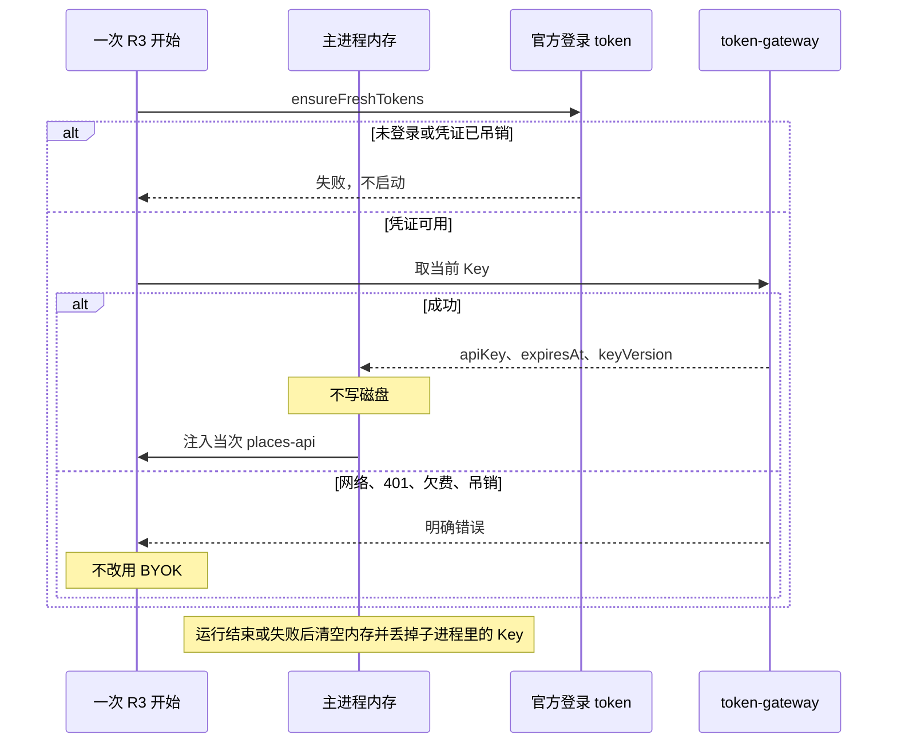

# US-PK-C-02 实时获取官方 Key、仅内存使用

> **用户故事**：[../30-需求-Places官方通道按用户下发APIKey.md](../30-需求-Places官方通道按用户下发APIKey.md) · US-PK-C-02 · Issue #21  
> **状态**：**待评审**（本文件只定设计；业务代码尚未按本文改动）  
> **范围**：R3 要用 Places 时向 token-gateway 取当前 Key；Key 只留在主进程内存；本机持久化的只有现网官方登录凭证  
> **依赖**：[US-PK-C-01](US-PK-C-01-申请官方PlacesKey与状态展示.md)；网关详设 US-PK-G-02（查询状态与实时取 Key）、US-PK-G-04（吊销客户端身份凭证）
> **不做**：把官方 Key 写入 `.env`、`FTCS_PLACES_OFFICIAL_API_KEY`、prefs、日志、钥匙串或导出文件；服务端代调 Places  
> **文档位置**：`docs/design/`

故事 ID 与需求修订稿一致：**US-PK-C-02**。文件名未改，避免已有链接失效。产品规则 **PK12**：官方 Key 不落盘。需求 **O3** 已关闭，不再讨论把官方 Key 放进 `.env` 或保险库。

本机要保护的是**身份凭证**，方案在 §4.2 定死：复用现网官方登录 token 的 `safeStorage`。内存能留多久见待确认 **O12**。本文按 O12 的推荐描述默认可替换行为，确认前不要把它写成唯一实现。

---

## 0. 相对现网

对照 `dev-0.5.8` 的凭证存放（2026-10-10 读码）。

| 现网 | **本期（US-PK-C-02）** |
|------|------------------------|
| 自备 Places Key 在工作区 `.env` 的 `GOOGLE_PLACES_API_KEY` | **仍只表示 BYOK**。官方 Key 不占用这个键，也不另造键 |
| 官方模型 sk 在 `.env` 的 `FTCS_GATEWAY_API_KEY` | 继续只给模型 / `usage/me`。**不用**它取 Places Key |
| 官方登录 token 在 `token-store.ts`：`userData/oauth-tokens.bin`，`safeStorage` 加密 access / refresh。退出登录会调 IdP `{issuer}/oauth2/revoke` 并 `clearTokenBundle()` | **这是本故事允许留在本机的身份凭证**。取 Key 走 `ensureFreshTokens()` 的 access token，与现网 `POST /keys/rotate` 相同 |
| 没有「运行前向网关要 Google API Key」的调用 | 一次 R3 开始时（或该次运行里第一次需要 Places 之前）调用取当前 Key。响应里的 `apiKey` 只进主进程内存 |

---

## 1. 与相邻故事的分工

| 模块 | 本期 |
|------|------|
| **US-PK-C-02** | 取 Key、内存持有与丢弃、身份凭证。验收与 gateway 联调，不设 mock |
| **US-PK-C-01** | 申请与状态。状态接口**不**返回 `apiKey` |
| **US-PK-C-03** | 把内存中的 Key 注入当次 `places-api`，直连 Google；Google 拒绝时再取一次 |
| **US-PK-C-04** | 选用官方还是 BYOK。取 Key 失败时不自动改成 BYOK |
| **网关详设** | HTTP。本文不另定义 URL |

---

## 2. 已确认选型

| 项 | 决定 |
|----|------|
| **官方 Key 不落盘** | 不写工作区 `.env`，不写 `FTCS_PLACES_OFFICIAL_API_KEY`，不写 `data/prefs`、`ftcs-prefs.json`、钥匙串、OpenCode 配置文件、日志和快照，也不为它新增 safeStorage 条目。现有登录 token 仍用 safeStorage，见 §4.2 |
| **何时取** | 只有实际跑 Places 时：该次 R3（或含 R3 的方案步骤）**开跑**调用一次取 Key。设置页不调用取 Key |
| **放哪** | 主进程变量。渲染进程、Preflight `detail`、设置快照都拿不到 `apiKey` |
| **何时丢掉** | 该次运行结束、失败、用户停止、退出登录、取 Key 失败，或运行中 Google 拒绝后准备去查状态时。丢掉后重启 `places-api`（或整个 OpenCode），使子进程环境里也不再留着这把 Key。不因为拒绝再取一把新 Key |
| **短时缓存（O12）** | 按 O12 推荐：同一次 R3 运行内可留到 `expiresAt` 与运行结束中较早的时刻。不跨运行。O12 若改选「每次调用都取」或「固定 N 分钟」，只改本行 |
| **身份凭证** | 复用现网官方登录 token，保护方式见 §4.2。US-PK-G-04 可单独吊销这一份凭证：旧 token 再取 Key 得 401 `credential_revoked`；用户重新登录拿到新凭证后可以再取。不自动改用 BYOK |
| **与 BYOK** | 来源是自备时不调用取 Key，继续读 `GOOGLE_PLACES_API_KEY`。两条路径不互相写入 |

---

## 3. 流程



取 Key 失败时的句子见 C-04，这里只保证主进程不会改 `FTCS_PLACES_KEY_SOURCE`，也不会把 BYOK 填进官方通道。

---

## 4. 内存与身份凭证

### 4.1 内存对象（不可序列化进快照）

```typescript
interface PlacesOfficialKeyMemory {
  apiKey: string
  expiresAt: string | null
  keyVersion: string | null
  heldForRunId: string
}
```

模块建议：`desktop/electron/gateway/places-official-key-memory.ts`。只提供 `hold`、`peek`、`clear`。`clear` 在运行结束、退出登录，以及 C-03 因 Google 拒绝而去查状态之前调用。禁止把这个对象放进 `SettingsSnapshot`。

`keyVersion` 可以出现在主进程日志里。`apiKey` 不可以，包括 `maskSecret` 全文变体以外的调试打印；日志最多记 `keyVersion` 与长度。

### 4.2 身份凭证怎么保护（O3 已关闭，这里给出本机方案）

官方 Places Key 不进任何持久化介质。向 token-gateway 证明「是这个用户」的材料，复用桌面**已经在用**的官方登录 token，不新造一把 Places 凭证，也不把 `FTCS_GATEWAY_API_KEY`（模型 sk，明文在工作区 `.env`）当作取 Key 的凭证。

| 项 | 方案 |
|----|------|
| 存什么 | 现有 `StoredTokenBundle`：`accessToken`、可选 `refreshToken`、`expiresAt` 等。没有 Google Places Key 字段 |
| 放哪 | `app.getPath('userData')/oauth-tokens.bin`（`desktop/electron/auth/token-store.ts`） |
| 怎么加密 | 调用 Electron `safeStorage`：`safeStorage.isEncryptionAvailable()` 时 `encryptString` / `decryptString`，与现网登录 token 同一条路径。不可用时现网会退回明文写入该文件；本故事不另起一套加密，避免两套登录态 |
| 怎么用 | `ensureFreshTokens()`。取 Key、申请、查状态的请求头都是 `Authorization: Bearer` + access token，与现网 `POST {base}/keys/rotate` 相同 |
| 用户退出 | 现网 `logout()`：IdP `POST {issuer}/oauth2/revoke`，然后 `clearTokenBundle()`。同时 `clear()` 内存中的 Places Key，并删除 `data/prefs/places-official-status.json` |
| 网关吊销（US-PK-G-04） | 吊销的是**这一份**登录凭证，不是 Google Key，也不是别的用户或别的设备上的登录。本机文件可能还在，但用旧 token 取 Key 得到 401 `credential_revoked`。提示「登录凭证已吊销，请重新登录」。用户走现有「去登录」拿到新 token 后可以再取。有 BYOK 时另外显示「改用自备 Key」，来源不自动改 |

渲染进程不读 `oauth-tokens.bin`，也不接收 `apiKey`。

### 4.3 状态可以落在本地，Key 不行

状态不是密钥。查状态成功后写入工作区 `data/prefs/places-official-status.json`，字段只有：

`status`、`reasonMessage`、`expectedReadyNote`、`appliedAt`、`updatedAt`、`syncedAt`。`status` 只允许 PK13 六值。

禁止写入 `apiKey`、`expiresAt`、`keyVersion`。退出登录时删掉这个文件，并 `clear()` 内存中的 Key。

| 何时覆盖这份缓存 | 打哪一个接口 |
|------------------|--------------|
| 打开设置页，一次 | 只查状态 |
| 申请提交成功之后，一次 | 只查状态 |
| 用户点「刷新状态」 | 只查状态 |
| R3 开跑 | **不**为了刷新缓存先查状态。只取 Key。若取 Key 的失败体已带 `status`（例如欠费），用该体覆盖缓存，不再多打一次状态接口 |
| 运行中 Google 拒绝后的那一次查询（C-03） | 只查状态，并覆盖缓存 |

打开设置页时先用这份文件画出上次的状态，同时仍按上表打一次状态接口，返回后覆盖。不轮询。

快照给渲染进程的字段来自该文件：`placesOfficialStatus`、`reasonMessage`、`expectedReadyNote`、`placesKeySource`。没有 `placesOfficialKeySet`，也没有官方 Key 掩码。界面用状态行表示「已开通」，不用「本机已保存 Key」。

`placesKeySource`（`official` | `byok`）是用户选的来源，不是 Key。它可以写在 `.env` 的 `FTCS_PLACES_KEY_SOURCE`（C-04）。这个键的值只有来源名字。

---

## 5. 客户端模块

`desktop/electron/gateway/places-official-key-client.ts`：

```typescript
export interface PlacesOfficialKeyMaterial {
  apiKey: string
  expiresAt: string | null
  keyVersion: string | null
}

export interface PlacesOfficialKeyClient {
  getCurrent(accessToken: string): Promise<PlacesOfficialKeyMaterial>
}
```

`getCurrent` 对应网关详设的取当前 Key。申请和查状态不走这个方法，避免设置页把 Key 读进内存。

错误映射（与 C-04 文案对齐，此处只列代码）：

| 结果 | 客户端 |
|------|--------|
| 网络失败 | `network`。不启动 R3 |
| 401 `need_login` | 去登录 |
| 401 `credential_revoked` | 凭证已吊销 |
| 200 且 `status=arrears` | 欠费。没有 `apiKey`。文案「已欠费，请充值」 |
| 200 且 `status=revoked` | 已吊销。没有 `apiKey`。文案「请联系客服」。不提供再次申请 |
| 403 + 吊销类 `reasonCode` | 官方 Key 已吊销 |
| 429 | 取 Key 过于频繁，稍后重试 |
| 200 但通道不是 `active` | 不把空 Key 当成成功 |

以上任何一条都不读取 `GOOGLE_PLACES_API_KEY` 来顶上。

---

## 6. 与 gateway 联调

马丰顺已定：gateway 与客户端同步上线，客户端不实现 mock，也不做「接口未就绪时的本地假数据」。gateway 的 §4 在联调地址上可调用之后，客户端再开工。

| 项 | 做法 |
|----|------|
| 地址 | 工作区 `.env` 的 `FTCS_TOKEN_GATEWAY_BASE_URL`。解析与现网官方通道相同：工作区 `.env` → 进程环境 → 默认 `https://token.ai-utills.com/v1`。值须已含 `/v1`；代码只去掉末尾 `/`，不再拼接 `/v1`。申请、查状态、取 Key 都接在这个 base 上。不另设 Places 专用地址 |
| 账号 | 桌面现有「去登录」（官方账号 OAuth，`ensureFreshTokens`）。测试账号由 gateway / 运营开通后交给测试人员。仓库不放账号、密码或 Key |
| 手测 | 六态、取 Key、欠费重置与恢复、已吊销、非法状态申请被拒、Google 拒绝后只查一次状态、凭证吊销后重登，见网关详设「联调手测」。本文件只核对：取到的 Key 不落盘 |

取 Key 成功后检查工作区 `.env`、`data/`、`userData`：除原有 `oauth-tokens.bin` 外，没有把本次 `apiKey` 写进任何文件。日志可以有 `keyVersion`，没有 Key 全文。

---

## 7. 文件清单

**本详设不改这些文件。**

| 文件 | 预期动作 |
|------|----------|
| `desktop/electron/gateway/places-official-key-client.ts` | 只实现 HTTP `getCurrent`。不实现 mock 客户端，不读 mock 环境变量 |
| `desktop/electron/gateway/places-official-key-memory.ts` | Key 只在内存 hold / clear，不写盘 |
| `desktop/electron/gateway/places-official-status-cache.ts` | 读写 §4.3 的状态 json。写入前断言对象里没有 `apiKey` |
| `desktop/electron/auth/oauth-service.ts` | `logout` 成功路径调用 `clear()`。不改 OAuth 文件格式 |
| `desktop/electron/settings/settings-service.ts` | **不**增加官方 Key 环境变量。`saveSettings` 继续只处理 BYOK 的 `GOOGLE_PLACES_API_KEY` |

建议单测只覆盖内存 `hold` / `clear`：`clear` 后再 `peek` 为空；快照类型里没有 `apiKey`。不发 HTTP，也不提供假 gateway。落盘与否在 §8 的联调里看。

**明确不改**：`GOOGLE_PLACES_API_KEY` 的含义；`token-store.ts` 的加密格式；`docs/30`。

---

## 8. 验收对照

| # | 步骤 | 期望 |
|---|------|------|
| M1 | 联调取 Key 成功后搜工作区与 userData | 没有 `FTCS_PLACES_OFFICIAL_API_KEY`，没有把 Key 写进 `.env`、json、钥匙串。前提见 §6 |
| M2 | 同一次运行内第二次需要 Places | 按待确认推荐：不第二次打网关，除非已过 `expiresAt` |
| M3 | 运行结束 | 内存为空；重启后的 `places-api` 环境里没有上一把官方 Key |
| M4 | 退出登录 | 内存清空。BYOK 仍在 |
| M5 | 管理端吊销当前登录凭证后再取 Key | 不启动 R3，不改来源，不用 BYOK。提示重新登录 |
| M6 | 日志 | 可有 `keyVersion`，没有 Key 全文 |

---

## 9. 不做什么

| 项 | 说明 |
|----|------|
| 用 `.env` 或 safeStorage 保存官方 Places Key | 本口径禁止 |
| 设置页为了显示「已开通」而取 Key | 用状态接口 |
| 取 Key 失败时改写 BYOK 或来源 | C-04 |
| 代调 | Places 仍由客户端直连 Google |

---

## 10. 风险

| 风险 | 缓解 |
|------|------|
| 长驻 OpenCode 把 Key 留在子进程环境里 | 运行结束必须 `clear` 并重启 `places-api`；M3 |
| 刷新状态的响应里夹带 `apiKey` 被快照保存 | 状态接口不允许该字段；快照类型里不声明它 |
| 在 gateway 未就绪时用假响应把客户端做完 | 不提供 mock。接口可联调后再开工，见 §6 与 O8 |

---

## 11. 待确认

集中在[网关详设「待确认」](US-PK-token-gateway-接口与管理端.md)。与本故事直接相关的是 **O12**（内存最长存放）和 **O14**（取 Key 限频）。O3 已关闭，本机保护方式以 §4.2 为准。

---

## 12. 修订记录

| 日期 | 说明 |
|------|------|
| 2026-10-10 | 初稿：官方 Key 与 BYOK 分键存放、失效与 mock。O3 按现网 `.env` 决定 |
| 2026-10-10 | Key 不落盘，改为实时获取 |
| 2026-10-10 | 取消轮换与重取，只在欠费时重置 |
| 2026-10-10 | 去掉 mock，改为与 gateway 联调验收 |
| 2026-10-11 | 设置页只查状态不取 Key |
| 2026-10-11 | 按 PK13 六态与已吊销对齐 |
