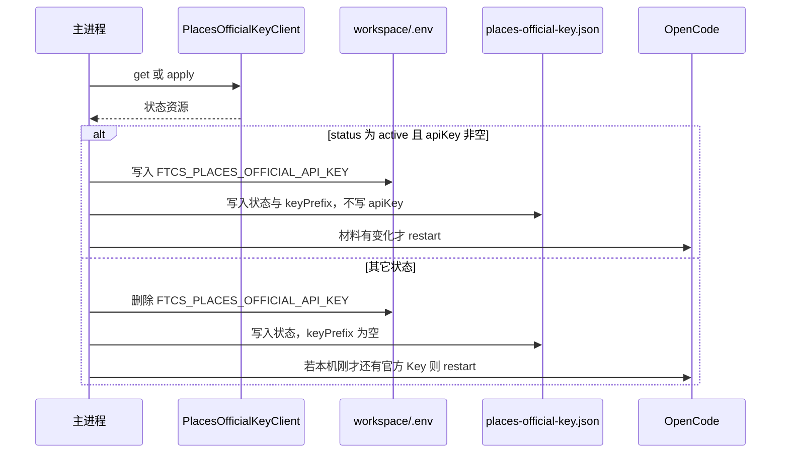

# US-PK-C-02 接收并安全保存官方 Key

> **用户故事**：[../30-需求-Places官方通道按用户下发APIKey.md](../30-需求-Places官方通道按用户下发APIKey.md) · US-PK-C-02 · Issue #21  
> **状态**：**待评审**（本文件只定设计；业务代码尚未按本文改动）  
> **范围**：已开通后自动收下官方 Key；与 BYOK 分键存放；轮换 / 吊销 / 停用 / 退出登录时更新或失效；联调前的 mock  
> **依赖**：[US-PK-C-01](US-PK-C-01-申请官方PlacesKey与状态展示.md) 的申请与刷新；网关详设里「查询状态并下发 Key」的响应形状  
> **不做**：用户手工粘贴官方 Key；把官方 Key 写进 `GOOGLE_PLACES_API_KEY`；导出明文；服务端代调  
> **文档位置**：`docs/design/`

O3（存放位置）在本文按现网 BYOK 路径定死，不进入待确认。O9（Key 材料在服务还是管理端）未定，客户端只认「查询接口在已开通时是否带回 `apiKey`」，不关心材料原本放在哪一侧。

---

## 0. 相对现网

对照 `dev-0.5.8` 的密钥存放（2026-10-10 读码）。

| 现网 | **本期（US-PK-C-02）** |
|------|------------------------|
| 自备 Places Key 在工作区 `.env` 的 `GOOGLE_PLACES_API_KEY`。设置快照只给 `placesApiKeySet` 与 `placesApiKeyMasked`（`maskSecret`，前 4 + 后 4） | **继续专供 BYOK**。保存设置时掩码占位不覆盖、留空则清除，这条行为不变 |
| 官方模型 sk 在同一 `.env` 的 `FTCS_GATEWAY_API_KEY`，界面不回显全文 | 官方 Places Key 用**另一键** `FTCS_PLACES_OFFICIAL_API_KEY`，同样只留在主进程与 `.env` |
| OAuth refresh token 走 `safeStorage`（`token-store.ts`） | 官方 Places Key **不**进 safeStorage。MCP 子进程要的是环境变量，与 BYOK、网关 sk 同一条注入路径 |
| `saveSettings` 末尾把 `PLACES_PROVIDER` 写成 `custom` | 保持。官方 Key 的到来**不**把 provider 改成 `gateway` |
| 设置保存、官方通道开通成功后会 `runtime.restart()` | 官方 Places Key 材料发生变化时同样重启 OpenCode，让 `places-api` 读到新环境 |
| 退出登录只清 OAuth | 退出登录时**额外**删掉本机官方 Places Key 与状态缓存。不删 BYOK |

---

## 1. 与相邻故事的分工

| 模块 | 本期 |
|------|------|
| **US-PK-C-02** | 响应落盘、掩码、失效、退出登录、mock 客户端、快照里哪些字段可以出主进程 |
| **US-PK-C-01** | 何时调用申请 / 刷新，以及界面文案 |
| **US-PK-C-03** | 从本文件的「当前生效 Key」注入 `places-api`，再直连 Google |
| **US-PK-C-04** | `FTCS_PLACES_KEY_SOURCE` 的取值规则。本文件只负责把这个键读出、写出，不解释优先级 |
| **网关详设** | HTTP 字段。本文件不另定义 URL |

---

## 2. 已确认选型

| 项 | 决定 |
|----|------|
| **O3 官方 Key 放哪** | 工作区 `.env` 键 `FTCS_PLACES_OFFICIAL_API_KEY`。与 BYOK 同一文件、不同键，互不覆盖 |
| **状态缓存** | 工作区 `data/prefs/places-official-key.json`。只放非秘密字段。**禁止**把 `apiKey` 写入该 json、用户 prefs、日志、Preflight `detail`、导出文件 |
| **选用记录** | `.env` 键 `FTCS_PLACES_KEY_SOURCE`，值为 `official` 或 `byok`。空表示用户还没选过。谁在何时写入见 C-04 |
| **何时写入官方 Key** | 查询或申请的响应里 `status === 'active'` 且 `apiKey` 非空。其它状态一律删除 `FTCS_PLACES_OFFICIAL_API_KEY` |
| **轮换** | 响应里的 `apiKey` 与本机不同：覆盖 `.env`，更新 `keyPrefix`，重启 OpenCode。状态仍是 `active` |
| **停用 / 失败 / 未申请 / 申请中** | 删除本机官方 Key。申请中本来就没有 Key |
| **退出登录 / 换账号** | 删除本机官方 Key 与状态 json。下一次登录后必须重新查询，禁止沿用上一账号的缓存。BYOK 不动 |
| **日志** | 对齐 `gateway-client.ts` 的 `maskSecretForLog`：最多前缀与长度。连通性测试日志同样不得打出 Key |
| **界面** | 无官方 Key 输入框，不能从设置里拷出全文。快照里的 `placesOfficialKeyMasked` 用现网 `maskSecret` |
| **mock** | 见 §6。打包后的应用忽略 mock 开关 |

---

## 3. 流程



材料「有变化」指：新增、删除、或明文与上次不同。仅 `reasonMessage` 变化不重启。

刷新网络失败：

- 不改 `.env` 里的官方 Key，不把 json 里的 `active` 改成 `failed`。
- json 增加 `lastSyncError`（短中文，无 Key）。
- 若上次状态已是 `active` 且本机仍有官方 Key，C-04 的 Preflight 可以放行，并带上 C-01 约定的那句「暂时无法确认状态，仍使用上次下发的 Key」。

---

## 4. 数据结构

### 4.1 `.env`（主进程读写，沿用 `env-file.ts`）

| 键 | 谁写 | 内容 |
|----|------|------|
| `GOOGLE_PLACES_API_KEY` | 现网设置保存 | 只表示自备 Key |
| `FTCS_PLACES_OFFICIAL_API_KEY` | 本故事 | 官方下发的 Google API Key |
| `FTCS_PLACES_KEY_SOURCE` | C-04 的切换，或本模块在 C-04 要求落盘时 | `official` \| `byok` |
| `PLACES_PROVIDER` | 现网，保持 `custom` | 不用 `gateway` 表示「已有官方 Key」 |

`saveSettings` 在更新 BYOK 时必须原样保留 `FTCS_PLACES_OFFICIAL_API_KEY` 与 `FTCS_PLACES_KEY_SOURCE`。清除 BYOK（输入框留空保存）不得删除官方 Key。

### 4.2 `data/prefs/places-official-key.json`

```json
{
  "status": "pending",
  "reasonCode": null,
  "reasonMessage": null,
  "appliedAt": "2026-10-10T02:00:00.000Z",
  "updatedAt": "2026-10-10T02:00:00.000Z",
  "expectedReadyNote": null,
  "reapplyAllowed": false,
  "keyPrefix": null,
  "syncedAt": "2026-10-10T02:00:01.000Z",
  "lastSyncError": null
}
```

`status` 枚举与 C-01 相同。文件不存在时，快照按 `none`、官方 Key 未设置处理。

### 4.3 快照（可进渲染进程）

在现网 `SettingsSnapshot` 上增加：

| 字段 | 类型 | 来源 |
|------|------|------|
| `placesOfficialStatus` | `'none' \| 'pending' \| 'active' \| 'failed' \| 'suspended'` | json |
| `placesOfficialReasonCode` | `string \| null` | json |
| `placesOfficialReasonMessage` | `string \| null` | json |
| `placesOfficialExpectedReadyNote` | `string \| null` | json |
| `placesOfficialReapplyAllowed` | `boolean` | json；缺省规则见 C-01 §4.1 |
| `placesOfficialKeySet` | `boolean` | `.env` 官方键非空 |
| `placesOfficialKeyMasked` | `string` | `maskSecret`，无 Key 时 `''` |
| `placesKeySource` | `'official' \| 'byok' \| null` | `.env` |
| `placesLastSyncError` | `string \| null` | json |

现网 `placesApiKeySet` / `placesApiKeyMasked` **仍然只反映 BYOK**。不要把官方 Key 的掩码填进这两个字段，否则探索页会把「有官方 Key」误当成「用户填过自备 Key」。

`getSettingsSnapshot` 读上述字段。不要在快照函数里打日志打印 `.env` 原文。

### 4.4 主进程模块

新建 `desktop/electron/gateway/places-official-key-client.ts`：

```typescript
export interface PlacesOfficialKeyResource {
  status: 'none' | 'pending' | 'active' | 'failed' | 'suspended'
  reasonCode: string | null
  reasonMessage: string | null
  appliedAt: string | null
  updatedAt: string | null
  expectedReadyNote: string | null
  reapplyAllowed: boolean
  apiKey: string | null
  keyPrefix: string | null
}

export interface PlacesOfficialKeyClient {
  apply(accessToken: string): Promise<PlacesOfficialKeyResource>
  get(accessToken: string): Promise<PlacesOfficialKeyResource>
}
```

- `HttpPlacesOfficialKeyClient`：按网关详设发请求。`apiKey` 只留在这个返回值里，调用方写完 `.env` 后不要再把对象传给渲染进程。
- `MockPlacesOfficialKeyClient`：§6。

新建 `desktop/electron/gateway/places-official-key-store.ts` 负责 json 与 `.env` 的增删。不要把写盘散落在 `settings-service.ts` 里，以免和 BYOK 保存缠在一起。`settings-service.ts` 只在 `getSettingsSnapshot` / `saveSettings` 两处**读取或保留**这些键。

退出登录：`oauth-service.ts` 的 `logout` 成功后调用 store 的 `clearOfficialPlacesKey()`。

---

## 5. 与 BYOK 的隔离

| 操作 | BYOK `GOOGLE_PLACES_API_KEY` | 官方 `FTCS_PLACES_OFFICIAL_API_KEY` |
|------|------------------------------|--------------------------------------|
| 用户在设置里修改自备 Key | 现网逻辑 | 不动 |
| 查询到已开通 | 不动 | 写入 |
| 查询到停用 / 吊销 / 失败 | 不动 | 删除 |
| 退出官方账号 | 不动 | 删除 |
| 用户点「改用自备 Key」 | 不动 | 不删除 Key 材料；只改 `FTCS_PLACES_KEY_SOURCE`（C-04） |

官方 Key 被停用后材料删除，但 BYOK 还在。用户可以按 C-04 改回自备 Key，无需重新粘贴。

---

## 6. 联调前 mock（对应待确认 O8）

网关仓库未定时，客户端用同一 `PlacesOfficialKeyClient` 自测，不发 HTTP。

| 项 | 决定 |
|----|------|
| 开关 | 环境变量 `FTCS_PLACES_OFFICIAL_KEY_MOCK=1`，且 `app.isPackaged === false`。打包后强制走 HTTP 客户端 |
| 夹具 | 可选 `FTCS_PLACES_OFFICIAL_KEY_MOCK_FIXTURE`，指向一个 JSON，形状就是 `PlacesOfficialKeyResource` |
| 无夹具时 | 内存状态：首次 `apply` 从 `none` 变为 `pending` 且 `apiKey: null`；再次 `apply` 仍是 `pending`。测试代码可调用**仅测试导出**的 `debugSetMockResource` 把内存改成 `active` / `failed` / `suspended` |
| 假 Key | 夹具里的示例值固定写成 `mock-places-key-not-real`。不要用真实 `AIza` 样例放进仓库 |
| 验收用途 | C-01 的五态界面、C-02 的分键落盘、C-04 的切换，都可以在没有 token-gateway 的情况下跑 |

mock 的 `get` / `apply` 不做鉴权网络，但主进程在调用前仍走 C-01 的登录闸门：未登录不进 mock，避免开发时误以为未登录也能申请。

若 O8 最终把网关放在别的仓库，ftcs 里长期保留的是这份客户端与 mock，HTTP 客户端只消费网关详设里的契约。

---

## 7. 文件清单

**本详设不改这些文件。**

| 文件 | 预期动作 |
|------|----------|
| `desktop/electron/gateway/places-official-key-client.ts` | HTTP 客户端 + mock + 资源类型 |
| `desktop/electron/gateway/places-official-key-store.ts` | `.env` 与 json 的写入、删除、退出登录清理 |
| `desktop/electron/settings/settings-service.ts` | 快照增加 §4.3；`saveSettings` 保留官方键，且继续把 `PLACES_PROVIDER` 写成 `custom` |
| `desktop/electron/auth/oauth-service.ts` | `logout` 成功后 `clearOfficialPlacesKey` |
| `desktop/electron/config/env-file.ts` | 只复用现有 `upsert` / `maskSecret`。若删除单键已有函数则复用，没有再补一个不打印值的删除 |
| `desktop/electron/ipc/types.ts`、`desktop/src/types/settings.ts` | §4.3 字段 |

建议单测放在 `places-official-key-store.test.ts`（新建）：写入官方 Key 不改 BYOK；非 `active` 会删官方键；json 里没有 `apiKey` 字样；掩码函数不返回全文。

**明确不改**：`safeStorage` 的 OAuth 文件格式；`GOOGLE_PLACES_API_KEY` 的含义；`docs/30`。

---

## 8. 验收对照

对照 `docs/30` US-PK-C-02。实现前不声称通过。

| # | 需求 | 步骤 | 期望 |
|---|------|------|------|
| M1 | 开通后自动收下 | mock 先 `pending` 再 `active` 且带 `apiKey` | `.env` 出现 `FTCS_PLACES_OFFICIAL_API_KEY`。界面无输入框。快照只有掩码 |
| M2 | 不覆盖 BYOK | 事先写好自备 Key，再收下官方 Key | `GOOGLE_PLACES_API_KEY` 仍是原来的值 |
| M3 | 停用失效 | 再刷新为 `suspended`，`apiKey: null` | 官方键被删除。BYOK 仍在。OpenCode 重启过 |
| M4 | 轮换 | 两次 `active` 的 `apiKey` 不同 | `.env` 变为新值。日志里看不到两把全文 |
| M5 | 退出登录 | 已收下官方 Key 后退出 | 官方键与 json 消失。自备 Key 还在。再用另一账号刷新，不会看到上一账号的 `keyPrefix` |
| M6 | 明文面 | 搜日志、设置界面、json、Preflight 文案 | 不出现 `mock-places-key-not-real` 或真实 Key 全文 |
| M7 | 申请中无 Key | 停在 `pending` | 官方键不存在。状态 json 的 `status` 为 `pending` |
| M8 | mock 边界 | 打包标志为真时设置 mock 环境变量 | 不走 mock |

---

## 9. 不做什么

| 项 | 说明 |
|----|------|
| 官方 Key 用 safeStorage、BYOK 仍用 `.env` | 两条路径会分叉；O3 按现网 BYOK / 网关 sk 对齐 |
| 把官方 Key 填进自备 Key 输入框再保存 | 会互相覆盖，也把明文交到渲染层 |
| `PLACES_PROVIDER=gateway` 表示官方 Key 已下发 | 那是旧代调占位，C-03 保持直连 |
| 在 ftcs 里实现 token-gateway | O8 未定。这里只有客户端与 mock |
| 渲染进程读取 `.env` | 只拿快照 |

---

## 10. 风险

| 风险 | 缓解 |
|------|------|
| `saveSettings` 整文件重写 `.env` 时丢掉新键 | M2；保存函数的保留表要包含 §4.1 的两个新键 |
| 刷新失败把可用 Key 删掉，R3 突然不可用 | §3：网络失败不删材料 |
| 吊销后的 Key 在刷新成功前仍能打 Google | 与 PK5「下次同步时失效」一致。风险写入 Preflight 提示，不假装离线立刻失效 |
| mock 夹具被打进安装包 | 仅非打包且环境变量开启；仓库夹具只用假字符串 |
| O9 若改成「响应永不带 apiKey、另走渠道」 | 客户端契约以网关详设为准：已开通且通道可用时 `apiKey` 必须出现。O9 只改变服务从哪里取出这串字符 |

---

## 11. 待确认

集中在[网关详设「待确认」](US-PK-token-gateway-接口与管理端.md)。O8 的推荐若被改成「网关就在 ftcs 仓库」，本文件的 HTTP 客户端与 mock 仍然保留，mock 继续只服务于无服务的自测。O9 不改变 §4 的落盘。

---

## 12. 修订记录

| 日期 | 说明 |
|------|------|
| 2026-10-10 | 初稿：官方 Key 与 BYOK 分键存放、失效与 mock。O3 按现网 `.env` 决定 |
