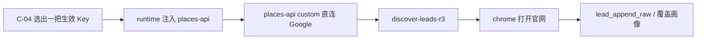

# US-PK-C-03 使用官方 Key 跑 R3 发现（只发现）

> **用户故事**：[../30-需求-Places官方通道按用户下发APIKey.md](../30-需求-Places官方通道按用户下发APIKey.md) · US-PK-C-03 · Issue #21  
> **状态**：**待评审**（本文件只定设计；业务代码尚未按本文改动）  
> **范围**：官方通道可用时，不填自备 Key 也能跑 R3；Places 请求仍由 `places-api` 直连 Google；线索字段来自官网核实  
> **依赖**：[US-PK-C-02](US-PK-C-02-接收并安全保存官方Key.md) 的本机官方 Key；[US-PK-C-04](US-PK-C-04-与BYOK并存及停用提示.md) 选出的「当前生效 Key」；现网 `discover-leads-r3`、US-E-07 FieldMask、US-E-08 管道  
> **不做**：`PLACES_PROVIDER=gateway` 代调；新的 Places SKU；把 Places 商家字段写进线索库；解决本机访问不了 Google 的问题  
> **文档位置**：`docs/design/`

---

## 0. 相对现网

对照 `dev-0.5.8` 的 R3 路径（2026-10-10 读码）。

| 现网 | **本期（US-PK-C-03）** |
|------|------------------------|
| `runtime.ts` 把 `GOOGLE_PLACES_API_KEY` 原样注入 `places-api` | 注入的仍是这个**环境变量名**（MCP 不改读键名）。值改为 C-04 选出的那一把：官方或自备。两把不要同时注入 |
| `PLACES_PROVIDER=gateway` 时 MCP 返回 `PLACES_GATEWAY_NOT_READY`，文案指向 US-E-10 | provider **保持** `custom`。若环境被误设成 `gateway`，仍返回该错误码，文案改为「Places 不经服务器代调，请使用直连」 |
| `isPlacesGatewayReady()` 恒 `false` | **保持恒 false**。官方 Key 已开通也不要把这个函数改成 true |
| `places_text_search` / `place_details` 直连 `places.googleapis.com`，FieldMask 见 `field-masks.ts` | 工具名、URL、FieldMask、24h 缓存不变。官方 Key 与 BYOK 走同一条 `custom.ts` |
| Skill 把 `source.snippet` 写成 `发现：place_id=<placeId>；<displayName>, <formattedAddress>`，`company.name` 允许直接用 `displayName` | 落库字段改为官网核实结果。snippet 不再粘贴 Places 的店名、地址、`place_id`。见 §4 |
| 本机网络失败表现为 Places HTTP / 超时 | 保持可感知。文案不得写成官方服务已代查成功 |
| Preflight 通过时 `detail` 为「Google Places API Key 已配置（直连）」 | 生效来源是官方 Key 时改为「官方下发 Key（本机直连 Google）」；来源是自备 Key 时改为「自备 Google Places API Key（本机直连）」 |

---

## 1. 与相邻故事的分工



| 模块 | 本期 |
|------|------|
| **注入** | 只把生效 Key 放进 MCP 环境。不增加网关 URL，不把 Places 请求发到 `token.ai-utills.com` |
| **MCP** | 继续直连。错误码保留，代调文案改掉 |
| **Skill 与 `buildDiscoverLeadsR3Prompt`** | 两处一起改。只改技能文件时，桌面提示词仍会要求 `place_id=` 开头 |
| **线索 schema** | `LeadCompanySchema` 不增加 Places 字段。不新增「禁写 place_id」的服务端解析器，以免误伤官网正文里的普通地址 |
| **缓存** | `data/cache` 下现网 24h Places 缓存保留，供同一次发现省调用。它不是线索资产，禁止拷进 `raw/R3.jsonl` |

---

## 2. 已确认选型

| 项 | 决定 |
|----|------|
| **无自备 Key 也能跑** | C-04 认定生效来源是官方且本机有官方 Key 时，Preflight 的 Places 项通过。用户不必填写 `GOOGLE_PLACES_API_KEY` |
| **直连** | HTTP 仍是 `custom.ts` 里的 `places.googleapis.com`。`X-Goog-Api-Key` 用注入的那一把 |
| **provider** | 成功路径的 `provider` 字段仍是 `custom`。不用 `gateway` 表示「这把 Key 来自官方」 |
| **只发现** | Places 的 `displayName`、`formattedAddress`、`types`、`businessStatus`、`websiteUri`、`placeId` 只在当次会话里用来找候选、打开官网。落库的公司名、官网、电话、地址以 **chrome 打开后的页面**为准 |
| **FieldMask** | 不改。不为了「把电话一并存进线索」去加 `nationalPhoneNumber` |
| **打不开 Google** | `places-api` 返回 `PLACES_HTTP_ERROR` 或网络错误。Skill 停止并说明本机访问 Google 失败。不重试到 token-gateway |
| **设置里如何标明来源** | 官方状态区已经写「已开通」。另外在 R3 区块加一行只读：**当前 R3 使用：官方下发 Key** 或 **当前 R3 使用：自备 Places Key**。这句话与 C-04 的生效结果一致 |

---

## 3. 注入

`desktop/electron/opencode/runtime.ts` 的 `placesEnv`：

1. 调用 C-04 的纯函数，得到 `{ source: 'official' | 'byok' | 'none', apiKey: string }`。`apiKey` 只存在于主进程。
2. `source === 'none'`：不注入 `GOOGLE_PLACES_API_KEY`。
3. 否则只注入这一把，环境变量名仍是 `GOOGLE_PLACES_API_KEY`。
4. `PLACES_PROVIDER` 固定写 `custom`，忽略 `.env` 里残留的 `gateway`。
5. 现网 `buildGoogleProxyEnvVars` 不变。官方 Key 与 BYOK 共用「Google 出站代理」设置。代理不表示、也不实现服务器代调。

`places-api` 的 `getGooglePlacesApiKey()` 继续读 `GOOGLE_PLACES_API_KEY`。不在 MCP 里增加 `FTCS_PLACES_OFFICIAL_API_KEY`，避免两把 Key 同时留在子进程环境里。

Key 从官方换成自备、或材料轮换之后，C-02 已经重启 OpenCode。注入发生在重启后的下一次会话。

---

## 4. Places 只发现（相对现网 Skill 的改动）

现网步骤 1～4（Text Search → 过滤 → Details 拿 `websiteUri` → 无官网则 Tavily → chrome 打开官网）保留。Places 响应仍然可以出现在**当次工具结果**里。下面约束的是**写入线索文件**的内容。

### 4.1 允许落库的来源

| 线索字段 | 来源 |
|----------|------|
| `company.name` | 官网页面上的公司名。页面没有清晰名称时写短说明，或留空。不用 Places `displayName` 填这个字段 |
| `company.website` / `source.url` | chrome **已经打开**的官网 URL。可以与当次 Details 的 `websiteUri` 相同，但必须是打开过的地址，不是未打开的 Places 字符串 |
| `company.country` / `description` | 官网或用户画像里已有的目标国家。不用 Places `formattedAddress` 拆国家 |
| `contacts[]` 的电话、邮箱 | 只来自官网页面或现网 Hunter。Places 响应里没有电话字段，也不要加 |
| `companyIntelligence` | 仍按 US-CI-01：材料可以包括「本轮已经知道这是 Places 候选」，正文不要粘贴地址、电话、`placeId` |
| `match_reason` | 写「经 Places 发现后，打开官网核实：…」加上官网业务证据。不要贴 `formattedAddress` |

### 4.2 `source.snippet` 改为固定过程句

写入：

```text
发现：Places 候选，经官网核实
```

不再使用：

```text
发现：place_id=<placeId>；<displayName>, <formattedAddress>
```

`source.type` 仍是现网的 `tavily_search`。不新增 `places` 枚举，避免评分与导出再认一套类型。

`lead_set_company_intelligence` 不带公司基础字段，因此同域名覆盖**不会**把 Places 字段写回去。不要为了 Places 去改这个工具的入参。

### 4.3 提示词

`agent-runner.ts` 的 `buildDiscoverLeadsR3Prompt` 第 5 步今天要求 snippet 以 `发现：place_id=` 开头。改成与 §4.2 同一句，并写明：公司名、官网、电话、地址以打开后的官网为准，不要把 Places 的店名和地址写入线索。

`workspace/skills/discover-leads-r3/SKILL.md` 的 Step 5、数据约定、错误表一起改。两处冲突时以本文为准，实现时两边写成同样的句子。

### 4.4 会话内仍可用、但不落库的 Places 字段

| 字段 | 会话内 |
|------|--------|
| `placeId` | 本 run 去重。不写入 jsonl |
| `displayName` | 过滤空名、泛称；Tavily 补官网时的查询词。不写入 `company.name` |
| `formattedAddress` | 只用于现网「地址与画像目标国家明显冲突则丢弃」。不写入线索 |
| `websiteUri` | 决定 chrome 打开哪一个 URL。打开失败则不落库 |
| `types` / `businessStatus` | 现网过滤。不写入线索 |

24h 缓存继续存这些字段。不延长 TTL，不把缓存文件合并进 `data/leads/`。

---

## 5. 失败可感知

| 情况 | 行为 |
|------|------|
| 未注入 Key | MCP `MISSING_PLACES_API_KEY`。文案：「当前没有可用的 Places Key。请打开设置 → 探索，申请官方 Places Key 或填写自备 Key。」 |
| 误设 `PLACES_PROVIDER=gateway` | `PLACES_GATEWAY_NOT_READY`。文案：「Places 不经服务器代调。请使用直连（PLACES_PROVIDER=custom），并配置官方下发 Key 或自备 Key。」 |
| HTTP 401/403 | 现网：停止并说明 Key 无效或未启用 Places API (New)。官方 Key 与自备 Key 同一句，不说成「网关拒绝代调」 |
| 超时、DNS、连接失败 | 停止该次 R3，说明本机访问 Google Places 失败。不创建「已成功」的空线索来掩盖 |
| 官网打不开或判断为否 | 现网：不调用 `lead_append_raw` |

Preflight 在发会话之前就该拦住「没有生效 Key」。MCP 错误是第二道，防止运行中 Key 被删。

---

## 6. 文件清单

**本详设不改这些文件。**

| 文件 | 预期动作 |
|------|----------|
| `desktop/electron/opencode/runtime.ts` | `placesEnv` 按 §3 注入一把 Key，provider 固定 `custom` |
| `workspace/mcp-servers/places-api/src/index.ts` | 只改 `PLACES_GATEWAY_NOT_READY` 与 `MISSING_PLACES_API_KEY` 的中文。不改工具名与 FieldMask |
| `workspace/skills/discover-leads-r3/SKILL.md` | §4 的落库句子与错误表 |
| `desktop/electron/opencode/agent-runner.ts` | `buildDiscoverLeadsR3Prompt` 与技能对齐 |
| `desktop/electron/preflight/places-start.ts` | 通过时的 `detail` 区分官方 / 自备（函数结构归 C-04） |
| `desktop/src/views/SettingsView.vue` | 「当前 R3 使用」一行 |

**明确不改**：`field-masks.ts`、`custom.ts` 的 Google URL、`lead-types.ts` 的公司字段、`isPlacesGatewayReady` 的返回值、`docs/30`、US-E-10 文件。

建议单测：

| # | 用例 | 期望 |
|---|------|------|
| T1 | 生效来源为官方 | 注入的 `GOOGLE_PLACES_API_KEY` 等于官方键，环境里没有第二把 |
| T2 | 生效来源为自备 | 注入值等于 BYOK，官方键不进 MCP 环境 |
| T3 | `.env` 里 `PLACES_PROVIDER=gateway` | 注入结果仍是 `custom` |
| T4 | 提示词字符串 | 含「经官网核实」，不含 `place_id=` |

---

## 7. 验收对照

对照 `docs/30` US-PK-C-03 与 PK1、PK8、PK9。

| # | 需求 | 步骤 | 期望 |
|---|------|------|------|
| M1 | 无自备 Key | 官方 Key 已开通且 C-04 选中官方，清空 BYOK，开始 R3 | Preflight 的 Places 项通过。`detail` 写官方下发 Key、本机直连 |
| M2 | 直连 | 抓 `places-api` 出站 | 主机是 `places.googleapis.com`。没有发往 token-gateway 的 Places 检索 |
| M3 | 只发现 | 跑通一条写进 `raw/R3.jsonl` 的线索 | `company.website` 是打开过的官网。`company.name` 不是未核实的 Places 店名。snippet 为 §4.2 那句。文件里没有 `place_id=`、没有整段 Places JSON |
| M4 | 打不开官网 | 候选没有可打开的官网 | 不新增该线索 |
| M5 | 本机不通 Google | 断开可访问 Google 的网络后开始 R3 | 失败可见。文案不是「官方已代调成功」 |
| M6 | 设置标明来源 | 打开设置 → 探索 | 能看到当前 R3 使用的是官方还是自备 |
| M7 | 代调占位 | 手工把 provider 设成 `gateway` 再调 MCP | `PLACES_GATEWAY_NOT_READY`，文案不再承诺等待 US-E-10 |
| M8 | R1/R2 | 无任何 Places Key 时开始 R1 | 与现网一样不检查 Places |

---

## 8. 不做什么

| 项 | 说明 |
|----|------|
| 实现 gateway 分支或转发 Places | PK1。`isPlacesGatewayReady` 继续返回 false |
| 为官方 Key 换一套 FieldMask 或工具名 | 与 BYOK 同一 MCP |
| 把 24h 缓存升格为线索库 | 缓存仍只服务调用 |
| 用 Places 地址填充 `company` 或 `contacts` | PK8 |
| 代用户解决墙内访问 Google | PK9。代理设置只沿用现网「本机出站代理」 |
| 改 US-E-07 / US-E-08 / US-E-10 旧文 | 行为以本文为准 |

---

## 9. 风险

| 风险 | 缓解 |
|------|------|
| 只改了 `SKILL.md`，提示词仍要求 `place_id=` | §4.3 两处同句；T4 |
| 模型仍把 `displayName` 写入 `company.name` | 提示词写明来源；M3 抽查 jsonl。不靠 schema 误杀正常地址 |
| 注入时两把 Key 都在环境里，MCP 用错 | §3 只注入生效的一把；T1、T2 |
| 把官方通道做成 `placesProvider=gateway` | 成功路径不读这个值；T3 |
| 法务事后认为 24h 缓存也过分 | 缓存不是线索。若 O6 要求缩短，再改 TTL，本期不动 |

---

## 10. 待确认

无单独产品选项。O6（上线前法务）见[网关详设「待确认」](US-PK-token-gateway-接口与管理端.md)。开发按本文 §4 落库，文案不写「合规已通过」。

---

## 11. 修订记录

| 日期 | 说明 |
|------|------|
| 2026-10-10 | 初稿：官方 Key 直连 R3，Places 只作发现入口，替换 snippet 中的 Places 商家字段 |
