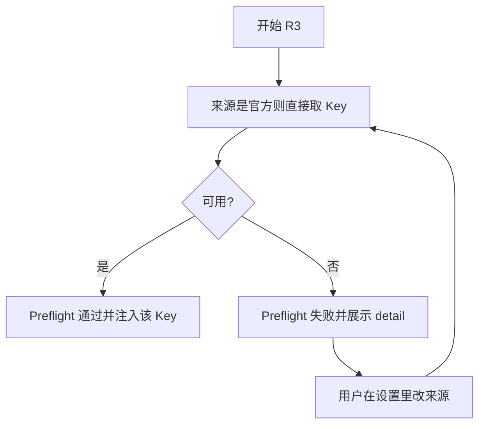

# US-PK-C-04 与 BYOK 并存及欠费 / 已吊销提示

> **用户故事**：[../30-需求-Places官方通道按用户下发APIKey.md](../30-需求-Places官方通道按用户下发APIKey.md) · US-PK-C-04 · Issue #21  
> **状态**：**待评审**（本文件只定设计；业务代码尚未按本文改动）  
> **范围**：官方 Key 与 US-E-07 自备 Key 同时存在时的选用；欠费 / 已吊销后的提示与改回 BYOK；Preflight 与「开始 R3」使用同一规则  
> **依赖**：[US-PK-C-02](US-PK-C-02-接收并安全保存官方Key.md) 的实时取 Key；现网 `resolvePlacesStart`；探索页 `useExploreStart`  
> **不做**：删除 BYOK；取 Key 失败、欠费或已吊销时自动改用 BYOK；计费 BYOK；代调
> **文档位置**：`docs/design/`

需求 O4（并存时的优先级）在本文定死，不进入待确认。

---

## 0. 相对现网

对照 `desktop/electron/preflight/places-start.ts` 与 `useExploreStart.ts`（2026-10-10）。

| 现网 | **本期（US-PK-C-04）** |
|------|------------------------|
| 只要 `placesApiKeySet`，就 `ok`，provider `custom`，文案「已配置（直连）」 | 先按 §3 算出**唯一**生效来源，再决定是否 `ok`。通过文案区分官方 / 自备（句子在 C-03） |
| 官方通道且没有自备 Key：失败，并说明官方不提供代调、请填 BYOK | 未申请或官方 Key 不可用、且没有 BYOK：仍然不能开始 R3。文案改为 C-01 的状态句，或「请申请官方 Places Key，或填写自备 Key」 |
| 官方通道**有**自备 Key：与自定义通道一样走 BYOK | **保持**，直到用户的官方 Key 变为已开通。开通后的默认见 §3，BYOK 值不被删 |
| `useExploreStart` 用 `placesApiKeySet` 决定 R3 按钮 | 改为「生效 Key 是否可用」。不要只看 BYOK，也不要只看官方状态 |
| 含 R3 的方案 Preflight 走 `resolvePlacesStart` | 继续走这一个函数。探索页按钮与 Preflight 不得各算各的 |

---

## 1. 与相邻故事的分工

| 模块 | 本期 |
|------|------|
| **US-PK-C-04** | 选用规则、切换 IPC、欠费与已吊销提示、`resolvePlacesStart` |
| **US-E-07** | 自备 Key 的输入、掩码、清除、直连。不改字段含义 |
| **US-PK-C-01** | 状态文案与申请按钮 |
| **US-PK-C-02** | 官方 Key 只在当次运行的内存里。切换来源不涉及删官方 Key 文件 |
| **US-PK-C-03** | 把本节选出的那一把注入 MCP |

---

## 2. 已确认选型

| 项 | 决定 |
|----|------|
| **O4 默认** | 用户还没有 `FTCS_PLACES_KEY_SOURCE` 时：只有自备 Key → 用自备；只有可用官方 Key → 用官方；**两把同时可用 → 用官方**，并在设置里写明当前是官方、自备 Key 仍保留。这是确定规则，不是随机 |
| **何时把默认写进 `.env`** | 只在「状态刷新为已开通、`FTCS_PLACES_KEY_SOURCE` 仍为空」时写成 `official`。写入的是来源名字，不是 Key。在此之前，只有 BYOK 的用户与现网一致 |
| **用户切换** | 设置里两把都配置过时，显示二选一。点选立即写 `FTCS_PLACES_KEY_SOURCE` 并重启 OpenCode |
| **选中的那把不可用** | **不**自动改成另一把。Preflight 失败，并给出按钮或说明去设置切换 |
| **欠费 / 已吊销 / 取 Key 失败** | 官方来源不可用时明确提示（§3.1）。若 BYOK 已填写，只提供按钮「改用自备 Key」。用户没点之前来源保持 `official`，不用自备 Key 顶上（PK12）。已吊销不能再次申请 |
| **未申请** | 不写 `official`。BYOK 行为与 US-E-07、现网 Preflight 一致 |
| **识别当前 Key** | 设置「当前 R3 使用」一行（C-03）+ Preflight `detail`。两处用同一 `source` |
| **gateway 标志** | `isPlacesGatewayReady` 继续恒为 `false`。选用官方 Key 时 `provider` 仍是 `custom` |

设置页上的六态只来自刚返回的状态接口，不读本地文件。来源是官方时，开始 R3 直接调取 Key，不看那次查询的结果，也不看任何本地状态。取 Key 失败就不能开始，也不沿用任何上一把 Key。

---

## 3. 选用规则

```typescript
type PlacesKeySource = 'official' | 'byok'

interface PlacesEffectiveKey {
  ok: boolean
  source: PlacesKeySource | 'none'
  detail: string
  /** 失败时，设置里可以执行的下一步。没有则为 null */
  offer: 'switch-to-byok' | 'switch-to-official' | 'open-settings' | 'relogin' | null
}
```

开跑时的顺序（不读 Places 状态文件，也不先查状态）：

1. `saved` = `FTCS_PLACES_KEY_SOURCE`，只接受 `official` 与 `byok`，其它字符当空。
2. `saved === 'byok'` 且自备 Key 非空：用自备 Key，不取官方 Key。
3. `saved === 'official'`，或 `saved` 为空且没有自备 Key：直接调取 Key。成功才开跑；失败用取 Key 返回的状态显示 §3.1，不改来源。
4. `saved` 为空且已有自备 Key：用自备 Key。设置页这次查到 `active` 时，可以提示改用官方，但不自动改来源。

纯函数**不写盘**。用户在设置里点选来源才写 `FTCS_PLACES_KEY_SOURCE`，值只有 `official` 或 `byok`。不写状态，不写 Key。失败分支不改来源。

`resolvePlacesStart` 改为返回上述结果里的 `ok`、`detail`、`provider: 'custom'`（只要 `ok`）。现有调用方只看 `ok` 与 `detail` 的，保持能编译。`places-start.test.ts` 里「官方通道无 Key 则要求 BYOK」的用例改为：无官方申请、无 BYOK 时失败；有 BYOK 且来源为空时仍成功且 `detail` 含「自备」。

### 3.1 `detail` 与现网测试的衔接

| 结果 | `detail` |
|------|----------|
| 用官方，取 Key 成功 | 官方下发 Key（本机直连 Google） |
| 取 Key 网络失败 | 暂时联系不上官方服务，未能获取 Places Key。请稍后重试。 |
| 401 `need_login` | 请先登录后再使用官方 Places Key。 |
| 401 `credential_revoked` | 登录凭证已吊销，不能获取官方 Places Key。请重新登录。 |
| `arrears` | 已欠费，请充值 |
| `revoked` | 请联系客服 |
| 官方 Key 已吊销 | 官方 Places Key 已吊销，不能再用来查询 Places。 |
| 429 限频（O14） | 获取官方 Places Key 过于频繁，请稍后再试。 |
| 用自备 | 自备 Google Places API Key（本机直连） |
| 来源是官方但申请中 / 开通失败 / 欠费 / 已吊销 | C-01 §4.3 的对应句。欠费与已吊销时若 BYOK 已填写，句末加上「自备 Key 仍可用，可在设置 → 探索改用自备 Key。」已吊销不提供再次申请 |
| 两边都没有 | 请在设置 → 探索申请官方 Places Key，或填写自备 Key（仅 R3 需要）。 |
| 来源是自备但自备已被清空，官方仍可用 | 当前选择的是自备 Key，但尚未填写。可在设置 → 探索改用官方下发 Key，或重新填写自备 Key。 |

自定义模型通道（`channelMode === 'custom'`）同样适用本表。不因为模型走自定义就忽略已下发的官方 Places Key。

---

## 4. 界面与 IPC

设置 → 探索 → R3 区块，在官方状态与自备输入框之间：

| 条件 | 控件 |
|------|------|
| 只有 BYOK，官方未申请或不可用 | 不显示二选一。只显示「当前 R3 使用：自备 Places Key」 |
| 只有官方可用，用户没填过 BYOK | 不显示二选一。只显示「当前 R3 使用：官方下发 Key」 |
| 状态曾查到已开通，且 BYOK 已设置 | 二选一：「官方下发 Key」「自备 Places Key」。当前项选中。官方一侧不表示本机存着 Key |
| 来源是官方且取 Key 失败、欠费或已吊销，BYOK 已设置 | 用 §3.1 的对应句子，主按钮「改用自备 Key」。身份凭证被吊销时另给「去登录」（`offer` 含 `relogin`），这不改变 Key 状态 |
| 来源是自备，官方已开通 | 主按钮「改用官方下发 Key」 |

二选一的说明句：

> 自备 Key 仍在本机。官方 Key 在每次运行时重新获取，不写在这台电脑上。R3 只用当前选中的那一种，本机直连 Google。

IPC：`places-official:set-source`，入参 `{ source: 'official' | 'byok' }`。

| 校验 | 结果 |
|------|------|
| `official` 但官方不可用 | `{ ok: false, message }`，不写 `.env` |
| `byok` 但 BYOK 为空 | `{ ok: false, message: '请先填写自备 Places Key' }` |
| 通过 | 写入 `FTCS_PLACES_KEY_SOURCE`，重启 OpenCode，返回新快照 |

「改用自备 Key」就是用户点击后 `source: 'byok'`。取 Key 失败的代码路径里禁止写这个键。没有官方 Key 文件可删。

探索页 `startR3DisabledReason`：生效 Key 不可用时，用 §3.1 的失败 `detail`，不再固定「请先配置 Google Places API Key」。R1/R2 的禁用理由不变。

---

## 5. 流程



开跑不查状态、不读本地状态。来源是官方就取 Key；取不到就失败，不改用自备 Key。

---

## 6. 文件清单

**本详设不改这些文件。**

| 文件 | 预期动作 |
|------|----------|
| `desktop/electron/preflight/places-start.ts` | §3 纯函数；`isPlacesGatewayReady` 保持 `return false` |
| `desktop/electron/preflight/places-start.test.ts` | 改写「无 Key 必须 BYOK / gateway 恒 false」，补上欠费与已吊销不自动改道 |
| `desktop/electron/preflight/agent-preflight.ts` | 继续调用 `resolvePlacesStart`，不另写一份判断 |
| `desktop/src/composables/useExploreStart.ts` | R3 是否可点改为生效 Key |
| `desktop/src/views/SettingsView.vue` | 二选一与「改用自备 Key」 |
| `desktop/electron/main.ts` | `places-official:set-source` |
| `desktop/electron/opencode/runtime.ts` | 注入时调用同一纯函数（与 C-03 同一处改动） |

建议单测（纯函数，不启 Electron）：

| # | 输入 | 期望 |
|---|------|------|
| T1 | 无官方、无 BYOK | `ok === false` |
| T2 | 无官方、有 BYOK、来源空 | `ok`，来源自备 |
| T3 | 官方可用、有 BYOK、来源空 | `ok`，来源官方 |
| T4 | 来源 `byok`，两把都可用 | `ok`，来源自备 |
| T5 | 来源 `official`，状态为 `arrears` 或 `revoked`，BYOK 可用 | `ok === false`，`offer` 含 `switch-to-byok`，来源键仍是 `official` |
| T6 | 来源 `official`，状态 `pending`，无 BYOK | `ok === false`，不把状态改成自备 |
| T7 | `isPlacesGatewayReady` 在官方已开通时 | `false` |

---

## 7. 验收对照

对照 `docs/30` US-PK-C-04、PK6、PK7。与 gateway 联调，前提见网关详设。M2 的「已开通」和 M5 的欠费、吊销凭证需要管理端。

| # | 需求 | 步骤 | 期望 |
|---|------|------|------|
| M1 | 未申请时 BYOK 与现网一致 | 不申请官方，只填自备 Key，开始 R3 | 通过。`detail` 含自备、本机直连。自备 Key 的保存 / 清除与现网一致 |
| M2 | 开通后 BYOK 还在 | 先填 BYOK，再由管理端开通官方 Key，桌面刷新 | `.env` 里自备 Key 原文还在。设置同时看得到两段标题 |
| M3 | 默认不随机 | M2 之后不点切换，看「当前 R3 使用」并开始 R3 | 显示官方下发 Key。再跑一次仍是官方 |
| M4 | 可以改回 | 点「自备 Places Key」后再开始 R3 | `detail` 改为自备。不出现官方 Key 文件。再改回官方时重新取 Key |
| M5 | 失败可感知且不回退 | 管理端分别做欠费重置、吊销登录凭证；另断一次到 gateway 的网络 | 开始 R3 失败。欠费文案是「已欠费，请充值」。有 BYOK 时出现「改用自备 Key」，但来源仍是 `official`，本次不用自备 Key 发 Places 请求 |
| M6 | 不静默改道 | M5 时不点按钮，直接再读来源 | 仍是 `official`，不会变成 `byok` |
| M7 | 点了才改回 | 在 M5 点「改用自备 Key」 | 来源变为 `byok`，R3 可以开始，走自备 Key |
| M8 | 方案里的 R3 | 高级获客或含 R3 的方案在 M5 的状态下执行 | Preflight 同样失败，文案与探索页一致 |
| M9 | 自定义模型通道 | `channelMode=custom` 且只有 BYOK | 与 M1 相同，不要求登录才能用自备 Key |

---

## 8. 不做什么

| 项 | 说明 |
|----|------|
| 欠费或已吊销后自动改用 BYOK | 必须用户点「改用自备 Key」 |
| 两把都注入 MCP，让工具自己挑 | C-03 只注入一把 |
| 删掉设置里的自备 Key 输入框 | PK7 |
| 给 BYOK 扣官方余额 | 需求明确不做 |
| 用 `placesProvider=gateway` 表示选中官方 | 旧代调标志，保持不启用 |
| 探索页上再做一套切换 | 切换只在设置 |

---

## 9. 风险

| 风险 | 缓解 |
|------|------|
| 官方刚开通就把长期使用 BYOK 的用户改到官方 | 这是「申请并开通」后的默认，设置里同时写明，且一步可以改回。未申请的用户不写来源键（T2） |
| 探索页按钮看 `placesApiKeySet`、Preflight 看官方，两处不一致 | 都改为 `resolvePlacesStart`；M8 |
| 旧测试仍期望「请填 BYOK」或「已停用」整句 | 更新 `places-start.test.ts`，欠费用「已欠费，请充值」，已吊销用「请联系客服」 |
| 切换来源忘记重启 OpenCode | `set-source` 成功路径与设置保存一样 `runtime.restart()` |

---

## 10. 待确认

O4 已在 §2、§3 决定。其它未决项见[网关详设「待确认」](US-PK-token-gateway-接口与管理端.md)。客户端只认 `arrears` 与 `revoked`，并按 §3 停止官方来源。欠费可在充值后恢复；已吊销只能客服在管理端恢复。

---

## 11. 修订记录

| 日期 | 说明 |
|------|------|
| 2026-10-10 | 初稿：并存时的默认来源、显式切换、停用后不静默改道 |
| 2026-10-10 | Key 不落盘，改为实时获取 |
| 2026-10-10 | 取消轮换与重取，只在欠费时重置 |
| 2026-10-10 | 去掉 mock，改为与 gateway 联调验收 |
| 2026-10-11 | 设置页只查状态不取 Key |
| 2026-10-11 | 按 PK13 六态与已吊销对齐 |
| 2026-10-11 | 取消状态本地缓存，增加客户端接口一览 |
