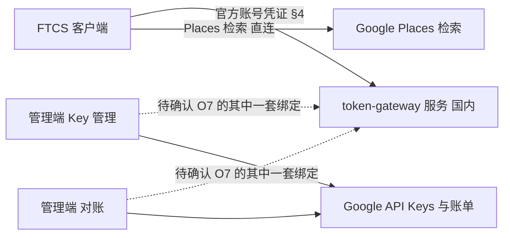
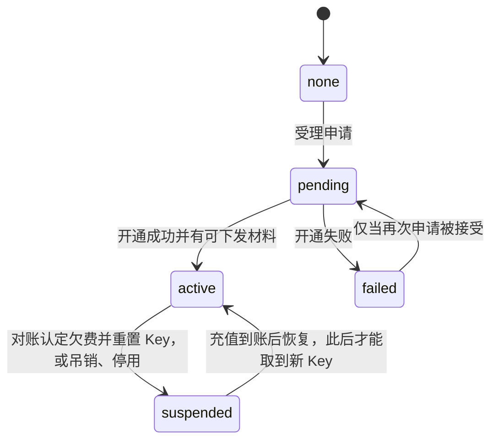
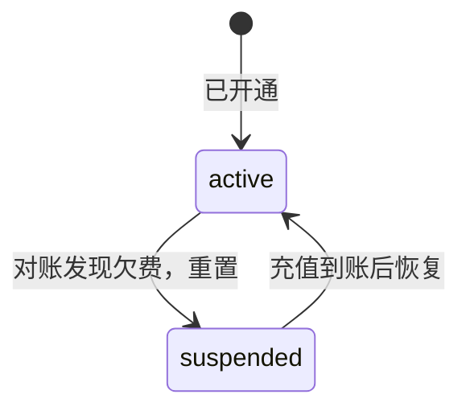
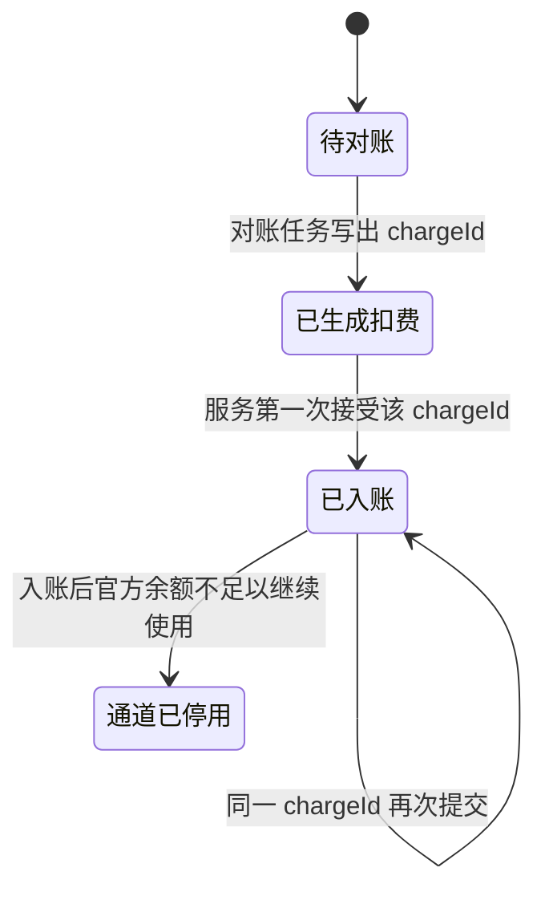

# US-PK token-gateway 接口与管理端

> **用户故事**：[../30-需求-Places官方通道按用户下发APIKey.md](../30-需求-Places官方通道按用户下发APIKey.md) · US-PK-G-01～04、US-PK-AK-01～03、US-PK-AR-01～02 · Issue #21  
> **状态**：**待评审**（只定接口与需求描述；不选框架、不写实现）  
> **范围**：客户端与国内 token-gateway 服务之间的接口；服务与管理端之间的可替换操作；管理端 Key 管理页与对账页要做什么  
> **依赖**：现网桌面官方账号 access token（与 `POST {base}/keys/rotate` 同一套，`safeStorage` 见 US-PK-C-02）；客户端实时取 Key 见 US-PK-C-02  
> **不做**：服务端代调 Google Places；token-gateway 服务调用 Google；在本文选定 O7–O11、O12–O14  
> **文档位置**：`docs/design/`  
> **与旧详设**：旧「US-E-10 网关代调」作废关系见 §0.1。旧文件保留，本 PR 不改它们。

客户端故事里的 IPC、本机文件、R3 落库不在这里重复。这里的 HTTP 是契约。O7、O9、O10、O11 未定时，服务与管理端之间同时写出两套绑定，实现时只启用产品选定的那一套。

---

## 0. 相对现网

| 现网 | **本期** |
|------|----------|
| token-gateway 为模型与官方搜索提供 `keys/rotate`、`models`、`usage/me`。桌面 base 为 `FTCS_TOKEN_GATEWAY_BASE_URL`，默认 `https://token.ai-utills.com/v1`（已含 `/v1`） | Places 官方 Key 的**客户端**路径挂在同一个 base 上，拼接规则与 `gateway-client.ts` 相同：去掉末尾 `/` 再接相对路径 |
| 没有按用户下发 Google Places Key 的接口 | 新增 §4。状态查询不带 Key；取当前 Key 每次实时返回，供客户端只放内存（PK12） |
| US-E-10 曾规划由网关转发 Places | **不新增** `/v1/places:searchText` 或任何把用户检索转到 Google 的路径 |
| 管理端（Key 开通、账单）不在 ftcs 现网桌面里 | 页面与操作见 §6、§7。代码放哪见待确认 O8 |

### 0.1 旧 US-E-10 哪些作废、哪些保留

`docs/30` PK10：旧详设按「下发 Key、客户端直连」作废或重写。本次**不删除、不改写**旧文件。实现以 `docs/30` 与本目录 US-PK 详设为准。

| 旧文件里的陈述 | 处理 |
|----------------|------|
| [US-E-10-Places官方网关.md](US-E-10-Places官方网关.md) 全文：官方通道 = token-gateway **代调** Places；重启前要先做「代访问」法务评估 | **产品方向作废**。文件留作历史。其中「不要做服务端代调」与 PK1 一致；「官方用户只能 BYOK、没有下发 Key」被 US-PK 替换 |
| [US-E-07](US-E-07-Places-MCP自定义Key.md) Q2 / 目标 4：以后只给 MCP 加 `gateway` 分支，工具名不变 | **「加 gateway 代调分支」作废**。工具名、`custom` 直连、BYOK、FieldMask 仍然有效 |
| [US-E-09](US-E-09-探索页开始R3与Preflight.md) Q7 与决策表：官方无自备 Key 则禁止 R3，文案写不提供代调 | **「不提供代调」保留**。「没有自备 Key 就永远不能 R3」在官方 Key 已开通且被选中时作废，见 US-PK-C-03 / C-04 |
| 代码占位 `PLACES_GATEWAY_NOT_READY`、`isPlacesGatewayReady() === false` | **保留占位，且继续失败**。含义从「等 E-10 开工」改为「禁止代调」。文案见 US-PK-C-03。不要把这个函数改成「官方 Key 已下发 ⇒ true」 |

O5 因此由详设关闭：旧文件保留；不改名重写进代调方案。

---

## 1. 系统边界

实线是需求已经锁定的方向（PK1、PK11）。虚线是 O7 未定的服务与管理端通道，§5 给两套绑定，不预设管理端的域名。

客户端不调用管理端，也不调用 Google 的 Key / Billing 管理接口。服务不调用 Google。

---

## 2. 状态机

### 2.1 用户的官方 Places 通道

与客户端五态一致。管理端不直接改客户端本地文件，只改服务上的这份状态；客户端下次查询能看见。

| 状态 | 取当前 Key（§4.3） |
|------|------------------------|
| `none` / `pending` / `failed` / `suspended` | 不返回 `apiKey`（4xx，带原因） |
| `active` 且凭证未吊销 | 返回本人当前有效 `apiKey` |
| 凭证已按 US-PK-G-04 吊销 | 401 `credential_revoked`，即使通道仍是 `active` |

一人一 Key（PK2）：同一官方账号在 `pending` 或 `active` 时，再次申请不创建第二条 Google Key，返回当前资源。

### 2.3 欠费重置与充值恢复

没有定时轮换，也没有管理端「立即轮换」。Key 只在 **US-PK-AR-02**（欠费 / 余额不足触发停用 / 吊销）触发 **US-PK-AK-02**（吊销 / 欠费重置 / 停用单用户 Key）时被换掉。服务不调用 Google；Google 侧停用旧 Key、建新 Key 由管理端做完，再把结果交给服务。

| 步骤 | 谁 | 结果 |
|------|----|------|
| 按日对账写出扣费，入账后余额不足 | 管理端对账 → 服务 §5.4 | 服务把该用户置为 `suspended`，`reasonCode=insufficient_balance`，清掉可下发的 Key 材料。这就是重置 |
| 同步 Google 侧 | 管理端 | 停用或删除当前这把 Google Key。不单独做「轮换」按钮 |
| 客户端查状态 §4.2 或取 Key §4.3 | 客户端 | 都只得到 `status=suspended`、`reasonCode=insufficient_balance` 和可展示的 `reasonMessage`。**没有** `apiKey` |
| 充值到账 | 管理端对账 / 恢复 | 建一把新的仅 Places Key，把材料交回服务，状态改回 `active` |
| 恢复之后的取 Key | 客户端 | §4.3 才返回新 `apiKey` 与新 `keyVersion` |

欠费期间重复查状态、重复取 Key，都仍是上述欠费体，不返回旧 Key，也不返回新 Key。

### 2.2 扣费

同一 `chargeId` 第二次及以后：HTTP 200，余额不变。补账用新的 `chargeId`，`kind = adjustment`，不覆盖旧记录。金额怎么从 Google SKU 算出来见待确认 O1，服务不重算。

---

## 3. 鉴权（分两截）

| 通道 | 本文锁定的部分 | 未定的部分 |
|------|----------------|------------|
| 客户端 → 服务 | **锁定**。官方账号 access token，`Authorization: Bearer`。与现网 rotate 相同：401 时刷新一次再试。身份以凭证为准，忽略请求体里的账号 id | 无 |
| 管理端 ↔ 服务 | 每次内部调用都必须带**服务间凭证**。未带或校验失败：401 或 403，响应体不得含 `apiKey` | 凭证是静态 Bearer、请求签名还是双向证书，见待确认 **O10**。下文只写「O10 凭证」，不写 Header 名 |
| 网络位置 | 服务部署在国内、不调用 Google（PK11） | 管理端放在哪张网上，见待确认 **O11**。接口不写死公网 DNS 或 IP 白名单 |

内部接口禁止被桌面官方账号 token 调用。客户端接口禁止被 O10 凭证调用后返回别人的 Key。

---

## 4. 客户端与运营接口

客户端路径接在现网 gateway base 之后，调用方是桌面主进程，凭证是官方登录 access token。运营路径在服务内部源站 `{service}` 上，凭证是 O10，桌面 token 调不通。

渲染进程看不到这些响应。`apiKey` 只出现在 §4.3，并且只进主进程内存（US-PK-C-02）。申请和查状态的响应**没有** `apiKey` 字段。

### 4.1 提交申请 · US-PK-G-01

| 项 | 内容 |
|----|------|
| 方法 + 路径 | `POST {base}/places/official-key/applications` |
| 触发方 | 用户在设置里点申请 |
| 鉴权 | §3 客户端凭证 |
| 幂等 | 见下表。不产生第二把 Key |

请求体：空对象 `{}`。不接受 `accountId`、不接受用户粘贴的 Key。

| 当前状态 | HTTP | 行为 |
|----------|------|------|
| `none` | 201 | 新建申请，状态变为 `pending`，记下 `appliedAt`（服务时钟，ISO-8601） |
| `pending` 或 `active` | 200 | 返回当前资源，`appliedAt` 不变 |
| `failed` 或 `suspended` | 200 或 409 | 若待确认「再次申请」允许：200，状态回到 `pending`，更新 `appliedAt`。若不允许：409，`code = reapply_blocked`，状态不变 |

响应体（201 与 200 相同形状）：

| 字段 | 类型 | 说明 |
|------|------|------|
| `status` | string | `pending` / `active` / `failed` / `suspended` / `none` |
| `reasonCode` | string \| null | 见 §2.1 与 §5.3 的原因枚举 |
| `reasonMessage` | string \| null | 给用户看的中文。客户端有则原样展示 |
| `appliedAt` | string \| null | T+1 的起算时刻。时区含义见待确认 O2，客户端不解析截止日 |
| `updatedAt` | string \| null | |
| `expectedReadyNote` | string \| null | 申请中的说明。O2 定下来之后由**服务**填好句子 |
| `reapplyAllowed` | boolean | 按再次申请政策填写 |

本接口不返回 `apiKey`、`expiresAt`、`keyVersion`。日志不记录 `Authorization`。

错误：

| HTTP | `code` | 含义 |
|------|--------|------|
| 401 | `need_login` | 凭证无效或过期 |
| 403 | `forbidden` | 账号不可用 |
| 409 | `reapply_blocked` | 当前状态不允许再申请 |
| 429 | `rate_limited` | 稍后重试 |
| 503 | `unavailable` | 服务暂不可用 |

错误体：`{ "code", "message" }`。`message` 为中文短句。

服务受理后只落自己的申请表，并让管理端能按 §5.1 取走。**本接口实现里不调用 Google。**

### 4.2 查询状态 · US-PK-G-02　查询状态与实时取 Key

| 项 | 内容 |
|----|------|
| 方法 + 路径 | `GET {base}/places/official-key` |
| 触发方 | 打开设置、点刷新；以及 R3 运行中 Google 拒绝 Key 时的那一次查询（US-PK-C-03）。不在这里取 Key |
| 鉴权 | 官方登录 access token。只返回该凭证对应的账号 |
| 幂等 | 只读 |

无请求体。未申请返回 **200**，`status = none`。不要用 404 表示未申请。

响应字段与 §4.1 的状态字段相同，仍然没有 `apiKey`。欠费时 **200**，`status=suspended`，`reasonCode=insufficient_balance`。凭证已被 US-PK-G-04 吊销时返回 401 `credential_revoked`，不要把状态伪装成 `none`。

### 4.3 取当前 Key · US-PK-G-02　查询状态与实时取 Key

| 项 | 内容 |
|----|------|
| 方法 + 路径 | `GET {base}/places/official-key/current` |
| 触发方 | 客户端在一次 R3（或含 R3 的步骤）开始时。运行中 Google 拒绝时**不**再调本接口 |
| 鉴权 | 与 §4.2 相同。只返回本人当前有效的 Key |
| 幂等 | 只读。欠费重置后、恢复之前，重复调用仍不返回 Key |
| 限频 | 见待确认 **O14**。超限 429，`code = rate_limited`。运行中的状态查询不计入本接口 |

成功 **200**：

| 字段 | 类型 | 说明 |
|------|------|------|
| `apiKey` | string | 当前有效的 Google API Key。客户端不落盘 |
| `expiresAt` | string \| null | ISO-8601。客户端内存能否留到这个时刻见 **O12**。服务可以返回 null |
| `keyVersion` | string | 非秘密。只在恢复后换成新 Key 时变化。客户端可以写进日志，不能代替 `apiKey` |

失败：

| HTTP | `code` | 何时 |
|------|--------|------|
| 401 | `need_login` | 没有凭证或凭证过期且无法刷新 |
| 401 | `credential_revoked` | 这一份登录凭证已被 §4.4 吊销 |
| 200 | （无 `code`） | **欠费**：`status=suspended`，`reasonCode=insufficient_balance`，可有 `reasonMessage`。没有 `apiKey`、`expiresAt`、`keyVersion`。与 §4.2 在欠费时的体相同 |
| 403 | `not_active` | 其它非开通状态（申请中、失败、吊销、手工停用）。体里带 `status`、`reasonCode`、`reasonMessage` |
| 429 | `rate_limited` | 超过 O14。客户端提示稍后重试，不改用 BYOK |
| 503 | `unavailable` | 服务异常 |

响应和日志都不保留 `apiKey` 的副本到访问日志。不得返回他人的 Key。

### 4.4 吊销客户端身份凭证 · US-PK-G-04　吊销客户端身份凭证

盗刷时切断「还能来取 Key 的那份登录」，不影响该用户的 Places Key，也不影响其他用户。本期没有定时轮换或手工轮换；要停掉 Google Key 时走 US-PK-AK-02 的吊销，不走本接口。

| 项 | 内容 |
|----|------|
| 方法 + 路径 | `POST {service}/internal/places/official-key/credentials/revoke` |
| 触发方 | 管理端运营 |
| 鉴权 | O10 凭证 |
| 幂等键 | `revocationId` |

| 字段 | 说明 |
|------|------|
| `revocationId` | |
| `accountId` | 官方账号，对应登录 token 的 `sub` |
| `credentialId` | 要作废的那一份凭证。见下方粒度 |
| `reasonCode` | `abuse` 或 `manual` |
| `reasonMessage` | 运营备注，不必展示给用户 |

**粒度（详设决定，不再开放）**：一份登录会话，不是整个账号的所有设备。标识从 access token 里取**刷新 access token 时不变、重新登录会变**的声明，优先 `sid`，否则 `sub` + `auth_time`。服务只存这个标识是否已吊销，不存 token 原文。同一账号在另一台电脑上的另一份登录不受影响。

吊销成功后，持该 `credentialId` 的 §4.2 / §4.3 立即 401 `credential_revoked`。用户在本机重新走现网登录后，新 token 的标识不同，可以再取 Key（通道仍须是 `active`）。重复的 `revocationId` 返回 200，不重复记一条。

管理端用户 Key 页上的按钮文案：「吊销此客户端登录凭证」。旁边另有「吊销 Google Key」，两者不要合成一个按钮。

### 4.5 客户端没有的接口

桌面不调用 §4.4 和 §5。没有轮换接口。不提供客户端上报用量。余额仍走现网 `GET {base}/usage/me`（若 O1 确认是同一官方余额）。

---

## 5. 服务与管理端的操作（O7 未定，两套绑定都有效）

每个操作的**字段、幂等、触发方**是锁定的。**方法与路径有两列**，选定 O7 之前都不要删掉另一列，也不要在代码里两套同时对生产流量启用。

| 绑定 | 含义 | 与部署的关系 |
|------|------|----------------|
| **绑定 P** | 管理端访问服务。服务不向管理端发起连接 | 若国内服务不能访问管理端所在网络，只能用这套 |
| **绑定 Q** | 服务访问管理端 | 只有 O11 允许服务出站访问管理端时才能用 |

`{service}` 表示服务的内部源站，`{admin}` 表示管理端的内部源站。两者都**不是**给桌面用的 `token.ai-utills.com/v1`。具体主机名随 O8 / O11 填写。

下文「O10 凭证」见 §3。

### 5.1 取得待开通申请 · US-PK-G-01 / US-PK-AK-01

| 项 | 内容 |
|----|------|
| 触发方 | 管理端 · Key 管理（运营打开列表，或管理端自己的定时任务） |
| 幂等 | 读。同一 `applicationId` 重复读取不改变状态 |
| 绑定 P | `GET {service}/internal/places/official-key/applications?status=pending` |
| 绑定 Q | `POST {admin}/internal/places/official-key/applications`，由服务在申请落库后推送 |

响应或推送体：数组，元素为：

| 字段 | 说明 |
|------|------|
| `applicationId` | 服务生成 |
| `accountId` | 官方账号 id，不透明字符串 |
| `appliedAt` | ISO-8601 |
| `status` | 固定 `pending` |

频率不写死。半自动时，运营打开页面即拉一次即可满足「能取到」；全自动时的周期见待确认 O2。

### 5.2 回传开通结果 · US-PK-AK-01 / US-PK-G-02

| 项 | 内容 |
|----|------|
| 触发方 | 管理端 · Key 管理（人点确认，或自动任务完成后） |
| 幂等键 | `applicationId`。重复提交成功结果不创建第二把绑定，返回已有结果 |
| 绑定 P | `POST {service}/internal/places/official-key/provision-results` |
| 绑定 Q | `GET {admin}/internal/places/official-key/provision-results?after={cursor}`，由服务来拉 |

请求或列表元素：

| 字段 | 必填 | 说明 |
|------|------|------|
| `applicationId` | 是 | |
| `accountId` | 是 | 与申请不一致则 409 `account_mismatch`，不改状态 |
| `outcome` | 是 | `success` 或 `failed` |
| `reasonCode` | 失败时 | `provision_failed` |
| `reasonMessage` | 失败时 | 用户能看懂的中文 |
| `googleKeyId` | 成功时 | Google 侧 Key 的**非秘密**标识，供对账。不是 API Key 明文 |
| `placesOnly` | 成功时 | 必须为 `true`。否则 422 `places_only_required`，服务拒绝激活 |
| `keyMaterial.mode` | 成功时 | `inline` 或 `retained_at_admin`（O9） |
| `keyMaterial.apiKey` | `inline` 时 | 可下发给本人的 Google API Key |
| `keyMaterial.materialRef` | `retained_at_admin` 时 | 服务留作引用。**永不**出现在 §4 的响应里 |

`outcome = success` 且材料按 O9 的模式齐全：服务把该用户置为 `active`。  
`outcome = failed`：置为 `failed`，不下发 Key。

成功响应：`{ "status": "active" | "failed", "applicationId" }`。重复的成功提交返回 200 与同一 `googleKeyId`。

#### 5.2.1 仅当 `mode = retained_at_admin` 时的取回

| 绑定 | 路径 |
|------|------|
| 绑定 Q | `POST {admin}/internal/places/official-key/material`，体 `{ "materialRef", "accountId" }`，响应 `{ "apiKey" }` |
| 绑定 P | **没有对应路径**。管理端拉服务时，服务无法在用户点击的路径上再去管理端取 Key |

因此：`retained_at_admin` 与「只用绑定 P」不能同时作为生产组合。文档保留这个模式，是为了 O9 未选定时契约完整；选定前不要实现成唯一方案。`inline` 与绑定 P、绑定 Q 都能配合。

取回失败：服务保持 `pending` 或已记录的失败，不要把空 Key 标成 `active`。

### 5.3 吊销 / 欠费重置 / 停用 · US-PK-AK-02　吊销 / 欠费重置 / 停用单用户 Key

与 **US-PK-AR-02**（欠费 / 余额不足触发停用 / 吊销）相连：对账认定欠费后，由 AR-02 触发本接口的 `arrears_reset`；充值入账后的恢复同样走 AR-02，再调用 `arrears_restore`。没有定时任务，也没有「立即轮换」按钮。

| 项 | 内容 |
|----|------|
| 触发方 | `revoke` / `suspend`：管理端运营。`arrears_reset` / `arrears_restore`：只由 US-PK-AR-02 |
| 幂等键 | `dispositionId` |
| 绑定 P | `POST {service}/internal/places/official-key/dispositions` |
| 绑定 Q | `GET {admin}/internal/places/official-key/dispositions?after={cursor}` |

| 字段 | 说明 |
|------|------|
| `dispositionId` | |
| `accountId` | |
| `action` | `revoke`（吊销 Google Key）、`suspend`（停用）、`arrears_reset`（欠费重置，只由 US-PK-AR-02 触发）、`arrears_restore`（充值入账后恢复，只由 US-PK-AR-02 触发） |
| `reasonCode` | `abuse` 盗刷、`insufficient_balance` 欠费、`account_closed` 用户注销、`manual` 手工、`quota` 配额 |
| `reasonMessage` | 用户可见中文 |
| `googleKeyId` | 被处置的那把 |

服务侧效果：

| `action` | 用户状态 | 取 Key |
|----------|----------|--------|
| `revoke` 或 `suspend` | `suspended` | 清除可下发材料。之后 §4.3 返回 403 `not_active`，没有 `apiKey`。`reasonCode` 用处置原因，不用 `insufficient_balance` |
| `arrears_reset` | `suspended` | `reasonCode=insufficient_balance`。旧 Key 材料作废。§4.2 与 §4.3 都只返回欠费状态，没有 `apiKey`。管理端先让这把 Key 在 Google 侧失效 |
| `arrears_restore` | `active` | 仅当充值已经入账。管理端准备好新的仅 Places Key 后，服务才接受。之后 §4.3 返回新 `apiKey` |

Google 侧「删除、禁用、新建」由管理端完成后再调用本操作。服务不调用 Google。重复的 `dispositionId` 返回 200，不第二次改状态。

未知 `action`：422 `invalid_action`。

### 5.4 提交扣费记录 · US-PK-AR-01 / US-PK-G-03

| 项 | 内容 |
|----|------|
| 触发方 | 管理端 · 对账（每日任务，以及补账） |
| 幂等键 | `chargeId` |
| 绑定 P | `POST {service}/internal/places/official-key/charges` |
| 绑定 Q | `GET {admin}/internal/places/official-key/charges?after={cursor}` |

| 字段 | 说明 |
|------|------|
| `chargeId` | 全局唯一 |
| `accountId` | |
| `googleKeyId` | 归集用的非秘密标识 |
| `usageDate` | `YYYY-MM-DD`。这一天按哪个时区切，见待确认 O2 |
| `amountMinor` | 整数，最小货币单位。**服务按这个数入账，不回推 SKU 单价** |
| `currency` | ISO 4217 |
| `kind` | `charge` 或 `adjustment` |
| `adjustsChargeId` | `adjustment` 时指向原记录 |
| `usageSummary` | 字符串或对象。服务原样留存，供运营查询。客户端接口不返回它 |

第一次接受：扣减该用户官方余额，返回 `{ "applied": true, "chargeId" }`。  
同一 `chargeId` 再来：200，`{ "applied": false, "chargeId" }`，余额不变。

入账后若官方余额已不足以继续使用官方通道：用户状态改为 `suspended`，`reasonCode = insufficient_balance`，清掉可下发材料，并产生一条 §5.5 能取到的欠费记录。管理端按 US-PK-AK-02 的 `arrears_reset` 让 Google 侧旧 Key 失效。是否允许负数见待确认里的欠费条目。`amountMinor` 的正负号：扣费为正整数表示「从余额减去」；调整若要冲回，用 `kind = adjustment` 且服务按 `amountMinor` 的符号增加或减少。选定 O1 前，实现不要在服务里再乘汇率。

找不到 `accountId` 与 `googleKeyId` 的绑定：422 `unknown_binding`，不入账。

### 5.5 欠费通知 · US-PK-G-03 / US-PK-AR-02

| 项 | 内容 |
|----|------|
| 触发方 | 服务在 §5.4 把用户置为 `suspended` 且 `reasonCode=insufficient_balance` 之后 |
| 幂等 | 同一 `accountId` + `usageDate` 重复读取不重复停用 |
| 绑定 P | `GET {service}/internal/places/official-key/unavailable?since={cursor}` |
| 绑定 Q | `POST {admin}/internal/places/official-key/unavailable` |

| 字段 | 说明 |
|------|------|
| `accountId` | |
| `reasonCode` | `insufficient_balance` |
| `usageDate` | 触发这笔的日期，可空 |
| `balanceMinor` | 入账后的整数余额，可空 |
| `currency` | 与扣费记录一致 |

管理端拿到之后**可以**再调用 §5.3 去禁用或删除 Google Key。是否立刻调用见待确认「欠费后的 Google 侧动作」。服务不因为发了通知就自己去吊销 Google 资源。

### 5.6 内部错误码（各操作共用）

| HTTP | `code` | 何时 |
|------|--------|------|
| 401 / 403 | `credential_rejected` | O10 凭证失败 |
| 404 | `not_found` | `applicationId` 或 `dispositionId` 不存在 |
| 409 | `account_mismatch` / `idempotency_conflict` | 同一幂等键对应了不同 `accountId` 或不同金额 |
| 422 | 见各节 | 字段不合法 |
| 503 | `unavailable` | |

---

## 6. 管理端 · Key 管理（页面与操作）

不指定前端框架。下列页面能调用 §5，并在页面内调用 Google（API Keys、配额、预算）。Google 的具体 REST 不在本文展开。

| 页面 | 操作 | 对应接口或外部系统 |
|------|------|--------------------|
| 待开通列表 | 查看账号、`appliedAt`。O2 未定前只展示 `appliedAt` 原文，不显示自算的「剩余小时」 | §5.1 |
| 开通 | **半自动**：运营在 Google 创建仅 Places 的 Key 后，填写 `googleKeyId` 与材料模式，提交成功或失败。**全自动**：页面只读任务结果，仍走 §5.2。两套按钮哪一个出现，等 O2 | Google API Keys；§5.2 |
| 用户 Key | 查看 `accountId`、`googleKeyId`、`keyVersion`、状态、原因、时间。没有轮换按钮，没有定时任务 | 管理端绑定表，与 §5.2、§5.3 一致 |
| 吊销登录凭证 | 「吊销此客户端登录凭证」调用 §4.4（US-PK-G-04）。不删除 Google Key | §4.4 |
| 处置 | 「吊销 Google Key」「停用」。原因必选：盗刷、注销、手工、配额。欠费重置不在这颗按钮上，只由对账页的 US-PK-AR-02 触发 | Google；§5.3 |
| 配额与告警 | 展示项目级配额与预算告警，并能从一条告警点到 `googleKeyId`。阈值与通知渠道等待确认，页面先留「告警列表 + 跳到处置」 | Google 预算 / 配额；处置走 §5.3 |

验收对应 US-PK-AK-01～03：一人一 Key、限制仅 Places（`placesOnly`）、T+1 内有结果回写（时限的日历见 O2）、吊销后服务状态变为 `suspended`、告警能定位到 Key。

---

## 7. 管理端 · 对账（页面与操作）

| 页面 | 操作 | 对应 |
|------|------|------|
| 按日任务 | 选择日期，拉取该日按 Key 的 Google 用量或账单，对照绑定表归集到 `accountId` | Google Billing / 用量。服务不拉 Google |
| 扣费记录 | 查看 §5.4 的字段。重跑同一天必须复用已发出的 `chargeId`，或只对差额新建 `adjustment` | §5.4 |
| 差异 | 列出「Google 有用量但无绑定」「有绑定但无用量」 | 只读，不自动扣这些行 |
| 欠费处置 | 看到 §5.5 的欠费用户后执行 US-PK-AK-02 的 `arrears_reset`（旧 Key 在 Google 侧失效）。充值入账后执行 `arrears_restore`。不在对账页直接改余额数字，也没有轮换按钮 | §5.3、§5.5、US-PK-AR-02 |

BYOK 用量不进入这些页面。实时扣费不做；节奏是按日。

验收对应 US-PK-AR-01～02：按日、按 Key、按用户、幂等；欠费后服务侧通道已停用且客户端查询可见；Google 侧是否删除 Key 以待确认为准，但按钮必须在。

---

## 8. 与客户端故事的衔接

| 客户端行为 | 使用的接口 |
|------------|------------|
| 申请、刷新状态 | §4.1、§4.2（响应无 `apiKey`） |
| 一次 R3 开始时取 Key | §4.3。结果只进内存。运行中 Google 拒绝时只调 §4.2，不调 §4.3 |
| R3 直连 Google | **不经过**本章任何 URL |

---

## 9. 文件与仓库

本 PR 只在 ftcs 增加这份说明，不新增服务代码。

| 若 O8 的结果是 | 契约放哪 | 客户端何时开工 |
|----------------|----------|----------------|
| 服务与管理端都在 ftcs | 仍以本文为准，代码以后另开实现 PR | gateway 的 §4 可联调之后 |
| 不在 ftcs | **本文就是契约原文**。对方仓库引用或镜像，不在 ftcs 里写网关实现 | 同上 |
| 只有一侧在 ftcs | 本文仍是唯一契约，避免两仓各写一套字段 | 同上 |

---

## 10. 验收对照

对照 `docs/30` §7～§9 与 §11。客户端与 gateway **一起联调**，不使用 mock。

### 10.1 联调前提

| 项 | 做法 |
|----|------|
| 地址 | 桌面工作区 `.env` 的 `FTCS_TOKEN_GATEWAY_BASE_URL`。与现网官方通道相同：工作区 `.env` → 进程环境 → 默认 `https://token.ai-utills.com/v1`。值须已含 `/v1`。Places 的申请、查状态、取 Key 都接在这个 base 上，不另设地址 |
| 账号 | 桌面「去登录」，走现网官方账号 OAuth。测试账号由 gateway / 运营开通后交给测试人员。仓库不放账号、密码或 Key |
| 开工 | gateway 的 §4 在上述地址可调用之后，客户端再开发并联调 |

### 10.2 联调手测

| # | 覆盖 | 步骤 | 期望 | 管理端 |
|---|------|------|------|--------|
| J1 | 未申请 | 新登录的测试账号打开设置 → 探索 | 状态「未申请」。没有官方 Key 文件 | 不需要 |
| J2 | 申请中 | 点「申请官方 Places Key」 | 「申请中」，并有下一自然日或 `expectedReadyNote`。抓包是 `POST .../applications`，响应无 `apiKey` | 不需要 |
| J3 | 已开通，取 Key | 管理端完成 T+1 开通后，桌面刷新，再开始 R3 | 「已开通」。`GET .../current` 返回 `apiKey` 与 `keyVersion`，只在内存。Places 请求发往 `places.googleapis.com`。磁盘上没有这把 Key | **需要**。US-PK-AK-01 开通并同步 |
| J4 | 失败 | 另用一个申请，管理端回传开通失败 | 「开通失败」，能看到原因。取 Key 不返回 `apiKey` | **需要**。回传失败 |
| J5 | 欠费重置 | 已开通账号由对账触发 `arrears_reset`，桌面再查状态并取 Key | 两边都是 `suspended` + `reasonCode=insufficient_balance`，没有 `apiKey`。文案「已欠费，请充值」。不改用 BYOK | **需要**。US-PK-AR-02 → US-PK-AK-02 |
| J6 | 充值恢复 | J5 之后入账并 `arrears_restore`，再取 Key | 状态回到已开通。`keyVersion` 与重置前不同。可以再跑 R3 | **需要**。同一条恢复 |
| J7 | Google 拒绝且是欠费 | R3 已持有内存中的 Key 后，管理端做欠费重置并让 Google 拒绝这把 Key | 任务失败。文案「已欠费，请充值」。这次失败只调用一次状态接口，不再调用取 Key，不重试 Places | **需要**。欠费重置，并让 Google 拒绝旧 Key |
| J8 | Google 拒绝但不是欠费 | 运行中由管理端吊销 Google Key（原因不是欠费），使 Google 返回 401/403 或配额错误 | 任务失败。文案是 Google 错误原文，不是「已欠费，请充值」。仍然只查一次状态，不取 Key，不重试 | **需要**。US-PK-AK-02 吊销，不走欠费重置 |
| J9 | 查状态本身失败 | 在 J8 的 Google 拒绝已经发生时，断开桌面到 gateway 的网络 | 任务失败。文案仍是 Google 错误。不写成欠费 | 管理端先制造拒绝；断网由测试人员做 |
| J10 | 吊销凭证 | 管理端吊销当前这份登录凭证后再取 Key；然后重新登录再取 | 旧登录得到 401 `credential_revoked`，提示重新登录，不改用 BYOK。新登录在通道仍开通时可以再取到 Key | **需要**。US-PK-G-04 |

接口级检查（G1–G4、A1–A3、R1–R2）在同一次联调里看服务和管理端，不另做客户端 mock。

对照 `docs/30` §7～§9 与 §11。下表是服务侧在联调中要看到的结果。

| # | 故事 | 期望 |
|---|------|------|
| G1 | G-01 | 无官方账号凭证的申请被拒绝。重复申请不产生第二把 Key。服务进程的出站里没有 Google |
| G2 | G-02 | `GET /places/official-key` 无 `apiKey`。`GET .../current` 在 `active` 时返回本人的 `apiKey`、`expiresAt`、`keyVersion`；停用时 403 `not_active` |
| G3 | G-03 | 同一 `chargeId` 两次，余额只减一次。不足后状态为 `suspended`，客户端 GET 可见原因 |
| A1 | AK-01 | 待开通能被取走；成功回写后状态为 `active`；`placesOnly !== true` 被拒绝 |
| A2 | AK-02 | 故事名「吊销 / 欠费重置 / 停用单用户 Key」。没有轮换接口。AR-02 触发 `arrears_reset` 后，状态与取 Key 都是 `suspended` + `insufficient_balance` 且无 Key；`arrears_restore` 之后才能取到新 Key。吊销只影响该账号 |
| G4 | G-04 | 吊销某 `credentialId` 后，旧登录 token 取 Key 为 401 `credential_revoked`。重新登录的新 token 可以再取。另一用户不受影响。Google Key 可以仍是 `active` |
| A3 | AK-03 | 项目级配额与预算告警能在管理端看到，并能打开对应 `googleKeyId` 的处置 |
| R1 | AR-01 | 按日归集后生成扣费；差异可在对账页查到；重跑不双扣 |
| R2 | AR-02 | 欠费通知能被对账页看到；停用后的客户端状态为已停用 |
| X1 | PK1 / PK11 | 全仓库接口列表里没有「代用户 searchText」；服务部署说明写明不调用 Google |

---

## 11. 不做什么

| 项 | 说明 |
|----|------|
| 选定 O7–O11 中的某一项当作已经批准 | 见 §12。契约用两套绑定和 `keyMaterial.mode` 容纳未定项 |
| 写网关或管理端代码、指定 Web 框架 | 本文只到接口与页面清单 |
| 服务代调 Places、服务调用 Google | PK1、PK11 |
| 客户端直连管理端 | PK11 |
| 在 ftcs 修改 `docs/30` 或删除 US-E-10 | PK10 的文档动作是「新详设写明替换」 |
| 规定 SKU 单价、加价、汇率数字 | O1 |

---

## 12. 待确认

下列每条都还要产品拍板。推荐只表示详设倾向，**接口按可替换方式书写，不把推荐实现成唯一路径**。O8 放在第一条。

**O3 已由 PK12 关闭**，不在下面列选项。官方 Key 不落盘。本机身份凭证的保护已在 [US-PK-C-02 §4.2](US-PK-C-02-接收并安全保存官方Key.md) 定死：复用现网官方登录 token，文件 `oauth-tokens.bin`，Electron `safeStorage.encryptString` / `decryptString`（`token-store.ts`）。不把 Places Key 放进 safeStorage，也不用 `.env` 里的模型 sk 充当这份凭证。

### O8（优先）token-gateway 服务与管理端放在哪个仓库

`docs/30` 不预设仓库，也不预设由谁运维。

| 选项 | 内容 |
|------|------|
| A | 服务和管理端都写在 ftcs 仓库里，与 `desktop/` 并列 |
| B（推荐） | 服务和管理端使用独立仓库。ftcs 只保留本文作为契约。对方仓库引用或镜像本文，不把实现代码提交进 ftcs |
| C | 只把其中一侧放进 ftcs，另一侧独立仓库 |

推荐 B，因为国内服务和可访问 Google 的管理端部署边界不同（PK11），拆仓与这个边界一致。若选 A 或 C，契约字段仍以本文为准，不另起一套 JSON。

客户端在 gateway 接口可联调后再开工。不实现 mock。联调地址与账号见 §10.1。

### O7 管理端与服务之间是推还是拉

| 选项 | 内容 |
|------|------|
| A | 只用绑定 Q：服务把申请和欠费推给管理端，再去管理端拉开通结果、处置和扣费 |
| B | 按消息分别选方向，并写死轮询秒数 |
| C（推荐） | 启用绑定 P：管理端来拉待开通与欠费，并把开通结果、处置、扣费写回服务。服务不向管理端出站 |

推荐 C，因为服务在国内，管理端要能访问 Google，往往服务不能主动连到管理端。频率留给实现：半自动可以「打开页面时拉一次」。选定前 §5 的两列路径都保留。

### O9 Key 材料放在服务还是管理端

PK12 已规定客户端不落盘。本条只决定 **§4.3 应答时，服务从哪里读出当前 Key**。两种 `keyMaterial.mode` 都留在字段表里。

| 选项 | 内容 |
|------|------|
| A | 明文只留在管理端（`retained_at_admin`）。每次取 Key 前服务再向管理端要。这与「只用绑定 P」不能同时成立，见 §5.2.1 |
| B（推荐） | 开通时，以及欠费恢复（`arrears_restore`）时，以 `inline` 把当前 Key 交给国内服务。服务用它回答 §4.3。管理端保留 Google 侧副本，以便吊销和欠费重置。客户端拿到后只放内存。静态加密算法本文不指定 |
| C | 服务和管理端都长期保存明文，且写进普通日志能读到的库表 |

推荐 B。客户端不因为本条再增加本地文件。

### O10 服务与管理端如何互相认证

| 选项 | 内容 |
|------|------|
| A | 共享静态 Bearer |
| B（推荐） | 请求签名（HMAC 或等价签名）加时间窗。签名密钥不下发到桌面 |
| C | 双向 TLS 证书 |

推荐 B。§5 只要求「O10 凭证」，不写 Header 名。选定后再把凭证映射到具体 Header 或 TLS，字段表不用改。

### O11 管理端部署在哪张网络

| 选项 | 内容 |
|------|------|
| A | 境外云，主动访问 Google，并主动访问国内服务 |
| B（推荐） | 能访问 Google 的网络（境外或可出境）。只出站访问 Google 和国内服务的内部接口。不要求国内服务出站 |
| C | 与服务同一机房，经专线出境访问 Google |

推荐 B，与 O7 的推荐（绑定 P）一致。接口里不出现具体云厂商、区域或防火墙规则。

### O12 官方 Key 在客户端内存里最长放多久

需求已锁定：不落盘、用完即弃。下面未锁定。

| 选项 | 内容 |
|------|------|
| A | 每次 Places 请求前都调用 §4.3，用完立刻丢掉内存 |
| B（推荐） | 一次 R3 运行开始时取一次。内存留到该次运行结束，或响应里的 `expiresAt`，以先到者为准。不跨运行。没有 `expiresAt` 时只留到运行结束 |
| C | 跨运行按固定 10 分钟缓存 |

推荐 B。US-PK-C-02 按这一行实现；若改选 A 或 C，只改持有时间，不改「不写磁盘」。

### O13

已取消定时轮换。与 #61 一致：本条不适用，已关闭。Key 只在 US-PK-AR-02 触发的欠费重置里更换，没有手工轮换。

### O14 取 Key 限频

| 选项 | 内容 |
|------|------|
| A | 不限频 |
| B（推荐） | 每个官方账号每小时 30 次，只计 §4.3 取当前 Key。运行中因 Google 拒绝而去查状态不计入。超出则 §4.3 返回 429 `rate_limited`。客户端提示稍后重试，不改用 BYOK |
| C | 按 `credentialId` 每分钟 10 次，超限同样 429 |

推荐 B。申请接口 §4.1 的 429 与这条分开计。

### O1 SKU、加价、汇率、扣费展示

需求已锁定：按日对账后扣官方余额。下面未锁定。

| 选项 | 内容 |
|------|------|
| A | 按 Google 账单原币原价扣，不加价、不换汇。客户端展示 SKU 明细 |
| B（推荐） | 对账侧算好 `amountMinor` 与 `currency` 再提交。服务不保存单价公式。Places 扣的是现网同一官方余额（`usage/me` 那一份），不单开钱包。客户端 Places 区不展示 SKU，只展示已停用原因；余额数字仍用现网设置页 |
| C | 单独设立 Places 钱包，与模型余额无关 |

推荐 B。补账只用 §5.4 的 `adjustment`，不改历史 `chargeId`。

### O2 全自动还是半自动，T+1 的时区

需求已锁定：受理后下一自然日内开通，且允许首期半自动。

| 选项 | 内容 |
|------|------|
| A | 首期就全自动调用 API Keys API。自然日按 UTC |
| B（推荐） | 首期半自动：运营在管理端确认后回写。自然日按 `Asia/Shanghai`。服务把说明写入 `expectedReadyNote`，客户端不写死时区 |
| C | 半自动，自然日按 UTC |

推荐 B。页面上两种按钮都已留出（§6），选定前不要删掉「全自动只读结果」那一列。

### 欠费之后 Google 侧怎么做、充值后如何恢复

需求已锁定：余额不足时官方通道对客户端不可用。宽限期与重新启用未锁定。

| 选项 | 内容 |
|------|------|
| A | 一欠费就在 Google 删除 Key。充值后用户重新申请，再走 T+1 |
| B（推荐） | 欠费立刻 `suspended` + `insufficient_balance`，并走 §2.3 / US-PK-AK-02 的 `arrears_reset`（旧 Key 失效，不下发）。不设自动宽限天数。充值入账后由 US-PK-AR-02 调用 `arrears_restore`，之后才能取到新 Key。允许余额记为负数，充值先补负 |
| C | 欠费后固定宽限一个自然日，到期再停用并删除 Google Key |

推荐 B。恢复不新造客户端 API，仍走 §5.2 / §5.3 的回写。选定前客户端只有「已停用」和「改用自备 Key」，没有「自行恢复」按钮。

### 失败或停用后，用户能否再次申请

| 选项 | 内容 |
|------|------|
| A | `failed`、`suspended` 都可以再点申请，并再创建 Google Key |
| B（推荐） | `pending` 与 `active` 重复申请只返回当前资源。`failed` 时 `reapplyAllowed = true`，再次申请回到 `pending`。`suspended` 时 `reapplyAllowed = false`，恢复只走上一题 |
| C | 任何非 `none` 状态都不允许再次申请 |

推荐 B。客户端只看 `reapplyAllowed`（US-PK-C-01）。

### 谁可以申请官方 Places Key

| 选项 | 内容 |
|------|------|
| A | 仅模型通道为官方（`FTCS_CHANNEL_MODE=official`）时可申请 |
| B（推荐） | 官方账号已登录即可，与模型通道、是否已有模型 sk 无关。自备 Key 用户不登录也能继续用 BYOK |
| C | 必须已经开通模型网关 sk |

推荐 B，与现网「Places Key 独立于模型通道」一致。客户端收口在 `canApplyPlacesOfficialKey`。

### 配额告警的渠道和阈值（US-PK-AK-03）

需求已锁定：要有项目级配额与预算告警，并能定位到 Key。

| 选项 | 内容 |
|------|------|
| A | 只使用 Google 自带的预算邮件，管理端不列告警 |
| B（推荐） | 管理端列出告警并能打开处置。邮件或 IM 渠道、金额阈值另定，本文不写具体数字和具体 IM 产品 |
| C | 在本文指定某一个 IM 与具体金额 |

推荐 B。

### O6 法务

需求已按 PK8 约束落库，并写明不替代法律意见。

| 选项 | 内容 |
|------|------|
| A | 没有书面法律意见就不开发 |
| B（推荐） | 开发按 US-PK-C-03 的「只发现」实现。书面复核与开发并行。界面不写「合规已通过」 |
| C | 本期不送法务 |

推荐 B。

---

## 13. 风险

| 风险 | 缓解 |
|------|------|
| 实现时只做了绑定 Q，国内服务却不能访问管理端 | O7 未定前两套都留在文档里；推荐绑定 P |
| `retained_at_admin` 配上绑定 P，导致永远不下发 Key | §5.2.1 写明该组合不成立 |
| 内部接口被桌面 token 调通 | §3：内部凭证与用户凭证分开，失败响应无 `apiKey` |
| 扣费公式在服务里再乘一遍汇率，与对账页不一致 | 服务只认 `amountMinor` |
| 读者仍按 US-E-10 做代调 | §0.1。代码侧 `isPlacesGatewayReady` 保持 false |

---

## 14. 修订记录

| 日期 | 说明 |
|------|------|
| 2026-10-10 | 初稿：客户端接口、可替换的服务/管理端操作、管理端页面清单、待确认（O8 优先） |
| 2026-10-10 | Key 不落盘，改为实时获取 |
| 2026-10-10 | 取消轮换与重取，只在欠费时重置 |
| 2026-10-10 | 去掉 mock，改为与 gateway 联调验收 |
