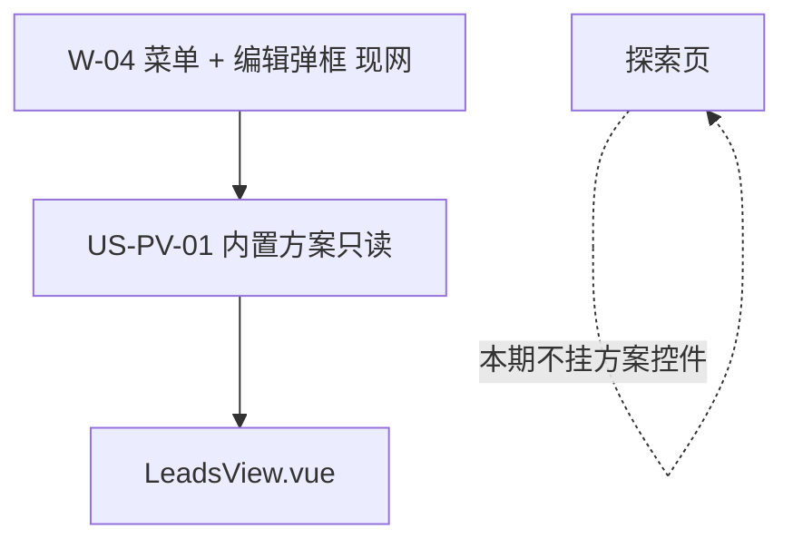
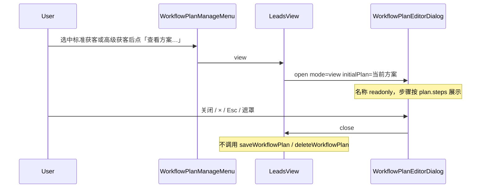

# US-PV-01 预埋标准/高级获客只读详情

> **用户故事**：[../28-需求-预埋获客任务只读查看.md](../28-需求-预埋获客任务只读查看.md) · US-PV-01 · Issue #42  
> **状态**：**待评审**（本文件只定设计；业务代码尚未按本文改动）  
> **范围**：线索页已有的 `WorkflowPlanManageMenu` 增加「查看方案…」；`WorkflowPlanEditorDialog` 增加 `mode=view`，只读打开 `builtin-standard` / `builtin-advanced`  
> **依赖**：现网 US-W-01（方案模型与预置）、US-W-02（方案控件）、US-W-04（菜单 + 编排弹框）、US-W-05（线索页已挂控件）  
> **不做**：复制为模板；技能/工具清单页；运行日志；Places/Hunter 依赖文案；改预置步骤或执行器；改自定义方案 CRUD；探索页接入（US-W-07）  
> **文档位置**：`docs/design/`  
> **与旧详设**：本故事**取代** [US-W-04 §3.3](US-W-04-方案编排弹框.md) 中「v1 不提供查看内置方案」这一句。本详设 PR **不修改**那份旧文档。

---

## 0. 相对现网

对照 `dev-0.5.8` 已落地的线索页方案控件（`LeadsView.vue` 填入 `#menu`）。

| 现网 | **本期（US-PV-01）** |
|------|----------------------|
| ⋯ 菜单三项：新建 / 编辑当前方案… / 删除当前方案… | 选中两个内置 id 时，菜单中**多一项**「查看方案…」 |
| 内置方案的编辑、删除 **disabled**，`title` 为「内置方案不可修改」「内置方案不可删除」 | **保持** disabled 与这两句 `title` |
| 自定义方案走「编辑当前方案…」打开 `mode=edit` | **不显示**「查看方案…」，编辑 / 删除行为不变 |
| `WorkflowPlanEditorDialog` 的 `mode` 只有 `create` \| `edit`；页脚「取消」「保存」 | **同一弹框**增加 `mode=view`；标题「查看方案」；页脚只有「关闭」 |
| 执行中（`isWorkflowRunning`）或 `generating` 时，⋯ **整颗按钮 disabled** | **保持**；查看不单独放行 |
| 探索页没有 `WorkflowPlanControl` / 该菜单 | **仍不挂**；不做 US-W-07 |

方案名称下拉（`WorkflowPlanControl` 的 `<select>`）**不加**双击。不把「编辑当前方案…」改成可点，也不把它改成打开只读页。

---

## 1. 与相邻故事的分工



| 模块 | 本期 |
|------|------|
| **W-01** | 不改 `builtin-plans.ts`、不改保存/删除校验、不改 `workflow-plans.json` 的写入路径 |
| **W-02 / W-05** | 线索页继续用现有 `WorkflowPlanControl` 的 `menu` 槽；不改控件对外 props |
| **W-04** | 菜单与弹框上**增量**：查看项 + `mode=view`。自定义方案的新建 / 编辑 / 删除仍走现网 |
| **W-03** | 不改执行器。只读展示的步骤必须是该方案对象上的 `steps`，与执行时读到的定义相同 |
| **W-07** | **不做**。探索页本期不挂方案控件 |

US-W-04 §3.3 写过：v1 **不提供**「查看内置方案」弹框，内置只靠 disabled 菜单项提示。该句里「不提供查看」由本故事取代：内置方案增加只读查看。编辑、删除仍然 disabled。旧详设文件留在仓库里，等另一次文档修订再改字；实现以**本文件**为准。

---

## 2. 已确认选型

| 项 | 决定 |
|----|------|
| **Q1 对象** | 只有 `builtin-standard`（标准获客）、`builtin-advanced`（高级获客）。判定用**这两个 id**，不用 `id.startsWith('builtin-')`，也不把「将来任意 `builtin: true`」都当成可查看 |
| **Q2 入口** | 现网线索页 `WorkflowPlanControl` 的 ⋯ 菜单（`WorkflowPlanManageMenu`）增加「查看方案…」。仅当当前选中 id 是上述二者时**渲染**该项（可用）。自定义方案**不渲染**这一项 |
| **Q3 内置编辑/删除** | 「编辑当前方案…」「删除当前方案…」对内置保持 disabled。`title` 仍是现网文案：「内置方案不可修改」「内置方案不可删除」 |
| **Q4 不另做入口** | 不双击方案名称或下拉；不把编辑菜单改成可编辑或改成打开只读 |
| **Q5 展示载体** | 复用 `WorkflowPlanEditorDialog`，`mode` 增加 `'view'`。不另做只读壳、不另做一套布局 |
| **Q6 标题与名称** | 标题「查看方案」。名称仍是同一行 `text-input`，属性为 **`readonly`**（不用 `disabled` 换掉这一行） |
| **Q7 步骤行** | 仍是序号 + 节点展示名。顺序等于该方案对象的 `steps`。下拉不可改。**没有**上移、下移、删除、添加步骤（不渲染这些按钮，不是禁用后仍占位） |
| **Q8 展示名** | 与现网编辑页同一目录：`desktop/src/constants/workflow-node-labels.ts` 的 `WORKFLOW_NODE_OPTIONS` / `WORKFLOW_NODE_LABELS`。见 §3.4 |
| **Q9 页脚与关闭** | 页脚只有「关闭」，没有「保存」、也没有「取消」。关闭、标题栏 ×、Esc、点遮罩都只关闭，**不写盘** |
| **Q10 不写方案** | 不调用 `saveWorkflowPlan` / `deleteWorkflowPlan`，不写工作区 `data/prefs/workflow-plans.json`，不发「已保存方案」类 `actionMessage` |
| **Q11 忙碌互斥** | `isWorkflowRunning` 或 `generating` 时，⋯ 菜单仍整体 disabled（现网 `LeadsView` 的 `workflowMenuDisabled`）。查看不例外，不为了能查看而放开整颗按钮 |
| **Q12 页面范围** | 查看项做在菜单组件里。已经挂上该菜单的页面会带上这一项；现网只有线索页。探索页不新挂控件 |
| **Q13 逻辑接缝** | 在现有 `useWorkflowPlanEditor.ts` 旁路增加纯函数：是否可查看、view 是否产生保存入参。建议单测；不强制 Vue E2E |
| **Q14 副文案** | 标题下说明行仍留在原位置。view 写「步骤按该方案的顺序执行」，不写「最多 10 步」（那是编辑态的添加上限）。不写 Places / Hunter 依赖说明 |

---

## 3. 界面

### 3.1 工具栏

线索页工具栏形态不变。变化只在 ⋯ 弹出的菜单里。

```
[ 导出 CSV ] [ 批量补全 ] [ 批量起草 ] [ 评分去重 ] [ 方案名 ▼ | ⋯ | 执行 ]
                                                              └─ menu slot
```

执行中或 `generating` 时，⋯ 按钮保持 disabled，`title` 仍为现网：执行中「方案执行中」，`generating` 时「已有任务在运行」。此时菜单面板打不开，里面的「查看方案…」也到不了。

### 3.2 管理菜单

选中 **标准获客** 或 **高级获客**，且菜单未被整颗禁用时：

| 菜单项 | 表现 |
|--------|------|
| **新建方案…** | 与现网相同，打开 `mode=create` |
| **查看方案…** | **显示且可点**，打开 `mode=view`，载入当前选中方案 |
| **编辑当前方案…** | disabled，`title`「内置方案不可修改」 |
| **删除当前方案…** | disabled，`title`「内置方案不可删除」 |

选中 **自定义方案** 时：不渲染「查看方案…」。新建 / 编辑 / 删除与现网一致（编辑、删除可点，打开编辑弹框或删除确认）。

菜单项顺序：新建方案… → （仅内置两个 id）查看方案… → 编辑当前方案… → 删除当前方案…。

点击外侧或 Esc 关掉菜单面板的行为与现网相同。点「查看方案…」先关上菜单，再打开弹框。

### 3.3 只读弹框（`mode=view`）

同一套 `workflow-plan-editor` 骨架。下面是标准获客打开后的信息结构（高级获客只是步骤更多，布局相同）。

```
┌─────────────────────────────────────────────┐
│  查看方案                              [×] │
├─────────────────────────────────────────────┤
│  步骤按该方案的顺序执行                      │
│                                             │
│  方案名称  [ 标准获客                 ] 只读 │
│                                             │
│  步骤（按顺序执行）                          │
│  ┌─────────────────────────────────────┐   │
│  │ 1. [ R1 广撒网              ▼ ]     │   │
│  │ 2. [ R2 社媒发现            ▼ ]     │   │
│  │ 3. [ 评分去重               ▼ ]     │   │
│  │ 4. [ 批量起草开发信         ▼ ]     │   │
│  └─────────────────────────────────────┘   │
│                                             │
│                                    [ 关闭 ] │
└─────────────────────────────────────────────┘
```

| 区域 | view | create / edit（现网，保持） |
|------|------|------------------------------|
| 标题 | 「查看方案」 | 「新建方案」/「编辑方案」 |
| × | **有**。现网弹框标题栏没有 ×；只在 view 补一颗，避免改自定义方案弹框的关闭控件 | 不新增 |
| 名称 | 同一行输入框，`readonly` | 可编辑，`maxlength=40` |
| 步骤下拉 | 仍用 `WORKFLOW_NODE_OPTIONS` 渲染选项，控件不可改（`disabled`） | 可改 |
| 上移 / 下移 / 删除 / 添加步骤 | **不渲染** | 保持 |
| 页脚 | 只有「关闭」 | 「取消」+「保存」 |
| 关闭 / × / Esc / 遮罩 | 关弹框，不写盘 | 现网：取消、Esc、遮罩丢弃未保存内容；`saving` 时不可关 |

名称用 `readonly` 而不是 `disabled`，以便仍是同一行、文字可选中。步骤 `<select>` 没有只读属性，用 `disabled` 禁止改选；展示文字仍是目录里的 `label`。

view 打开时用现成的 `planToEditorDraft(initialPlan)` 填名称和步骤，**不要**走 `createDefaultEditorDraft()`（那会变成新建态的默认一步 `discover-r1`）。`steps` 数组顺序即行序，不按目录顺序重排。

`onSave` 在 `mode==='view'` 时直接返回，不调用 `validateWorkflowPlanDraft`、`toSaveInput`、`saveWorkflowPlan`。关闭路径只 `emit('close')`。

### 3.4 两个内置方案的步骤（以代码为准）

来源：`desktop/electron/workflow/builtin-plans.ts` 的 `steps`，展示名来自 `WORKFLOW_NODE_LABELS`。本故事**不改**这两段预置。

**`builtin-standard` · 标准获客**

| 序号 | nodeId | 展示名 |
|------|--------|--------|
| 1 | `discover-r1` | R1 广撒网 |
| 2 | `discover-r2` | R2 社媒发现 |
| 3 | `score-and-dedupe` | 评分去重 |
| 4 | `draft-outreach-email` | 批量起草开发信 |

**`builtin-advanced` · 高级获客**

| 序号 | nodeId | 展示名 |
|------|--------|--------|
| 1 | `discover-r1` | R1 广撒网 |
| 2 | `discover-r2` | R2 社媒发现 |
| 3 | `discover-r3` | R3 地图发现 |
| 4 | `score-and-dedupe` | 评分去重 |
| 5 | `enrich-lead-contacts` | 批量补全联系人 |
| 6 | `draft-outreach-email` | 批量起草开发信 |

`docs/28` §4.3 与上述 **nodeId 顺序一致**。差异只在写法：§4.3 把高级获客前两步简写成「R1 → R2」，目录全称是「R1 广撒网」「R2 社媒发现」。只读界面用目录全称。这不是另一套步骤，**不改预置定义**。

另外，US-W-04 §5.1 的示例代码块只有 6 个节点，没有 `enrich-lead-contacts`。现网 `WORKFLOW_NODE_OPTIONS` 已有 7 项，含「批量补全联系人」。查看高级获客第 5 步必须用**现网目录**，不能照抄那份旧代码块。本 PR 不改 US-W-04。

弹框不要把上表硬编码成两套静态 HTML。行数据来自当前选中方案的 `steps`，标签用目录解析。上表是撰写时的快照，供评审和手工验收对照。

现网目录顺序（下拉选项顺序，**不是**某个方案的步骤顺序）：

| nodeId | 展示名 |
|--------|--------|
| `expand-keywords` | 扩展关键词 |
| `discover-r1` | R1 广撒网 |
| `discover-r2` | R2 社媒发现 |
| `discover-r3` | R3 地图发现 |
| `score-and-dedupe` | 评分去重 |
| `enrich-lead-contacts` | 批量补全联系人 |
| `draft-outreach-email` | 批量起草开发信 |

两个内置方案都不含 `expand-keywords`。只读页也不为此加说明文案。

---

## 4. 模块与接口

### 4.1 纯函数（建议放在 `useWorkflowPlanEditor.ts`）

`WorkflowPlanEditorMode` 扩成 `'create' | 'edit' | 'view'`。

```typescript
export function canViewBuiltinWorkflowPlan(
  planId: string | null | undefined,
): boolean
// true 仅当 planId === 'builtin-standard' || planId === 'builtin-advanced'

export function editorModeProducesSaveInput(
  mode: WorkflowPlanEditorMode,
): boolean
// view → false；create / edit → true
```

view 关闭、点遮罩、Esc、× 都不得调用 `toSaveInput`。若实现上有一条「按 mode 取保存入参」的函数，view 必须得到 `null`，而不是带 `id` / `name` / `steps` 的 `WorkflowPlanSaveInput`。

菜单和线索页用 `canViewBuiltinWorkflowPlan(selectedPlan.id)` 决定是否渲染「查看方案…」，避免在模板里再写一套 id 判断。

### 4.2 `WorkflowPlanManageMenu.vue`

在现有 props / emits 上增加：

```typescript
defineProps<{
  // …现有 compact / disabled / disabledReason / canEdit / canDelete
  canView?: boolean // 默认 false；true 才渲染「查看方案…」
}>()

defineEmits<{
  create: []
  view: []
  edit: []
  delete: []
}>()
```

`canView === false` 时该项不在 DOM 里（`v-if`），不是 disabled 菜单项。`disabled === true` 时仍只禁用触发按钮，与现网一致；不给 view 单独留一条能打开菜单的路径。

`onEdit` / `onDelete` 仍在 `!canEdit` / `!canDelete` 时直接 return。

### 4.3 `WorkflowPlanEditorDialog.vue`

```typescript
// mode: 'create' | 'edit' | 'view'
// view 时必须传入 initialPlan（当前选中的内置方案）
```

`resetForm`：`edit` 与 `view` 都走 `planToEditorDraft(initialPlan)`。只有 `create` 用默认草稿。

标题：`view` →「查看方案」。`aria-label` 与标题一致。

模板分支只隐藏编辑控件和换页脚，不复制一套 panel。

### 4.4 `LeadsView.vue` 接线

现有 `canManageSelectedPlan`（非 builtin 才可编辑/删除）**保持**。另算：

```typescript
const canViewSelectedPlan = computed(() =>
  canViewBuiltinWorkflowPlan(selectedWorkflowPlan.value?.id),
)

function openViewEditor(): void {
  if (!canViewSelectedPlan.value || !selectedWorkflowPlan.value) return
  editorMode.value = 'view'
  editorOpen.value = true
}
```

模板增量：

- 菜单增加 `:can-view="canViewSelectedPlan"`、`@view="openViewEditor"`。
- `:disabled` 仍绑定现有 `workflowMenuDisabled`（`isWorkflowRunning || generating`），不放宽。
- 弹框 `:mode` 允许 `'view'`。`:initial-plan` 在 `edit` **或** `view` 时传入 `selectedWorkflowPlan`（现网只在 `edit` 时传入）。
- `@saved` 仍只处理真正保存成功。view 不发出 `saved`。
- 关闭：`editorOpen = false`。不 `reloadPlans`，不写 `actionMessage`。

`WorkflowPlanControl.vue` **不改**（无双击、无新 props）。

### 4.5 时序



无新 IPC。查看不读、不写 `workflow-plans.json`。内置步骤来自列表里已经合入的内存方案对象（主进程 `BUILTIN_WORKFLOW_PLANS`），不是用户文件里的副本。

### 4.6 样式

优先用现有 `.workflow-plan-editor*` / `.workflow-plan-manage*`，用 `v-if` 拿掉行内按钮和「添加步骤」。

仅当 view 需要补标题栏 ×、或只读输入与可编辑输入要能区分时，才在 `desktop/src/styles/main.css` 追加少量规则（例如 `.workflow-plan-editor--view`）。不新起一套弹框皮肤，不复用 `explore-start`。

---

## 5. 文件清单

下表是**开发时预期会动**的现网文件。**本详设不改这些文件，交开发。**

| 文件 | 预期动作 |
|------|----------|
| `desktop/src/components/workflow/WorkflowPlanManageMenu.vue` | 增加「查看方案…」（`canView` 才渲染）及 `view` 事件 |
| `desktop/src/components/workflow/WorkflowPlanEditorDialog.vue` | `mode=view`：标题、只读名称、不可改步骤、无编排按钮、页脚仅「关闭」、× |
| `desktop/src/views/LeadsView.vue` | 把查看接到已有菜单和弹框；`initial-plan` 覆盖 view；不放宽菜单 disabled |
| `desktop/src/composables/useWorkflowPlanEditor.ts` | `WorkflowPlanEditorMode` 增加 `'view'`；§4.1 两个纯函数 |
| `desktop/src/styles/main.css` | **按需**。现有 class 够用则不改 |

建议单测落在已有 `desktop/src/composables/useWorkflowPlanEditor.test.ts`（不强制另开 Vue E2E）。该测试文件同样不在本详设里修改。

**明确不改**：`builtin-plans.ts`、执行器、`WorkflowPlanControl.vue`、探索页、`docs/28`、`docs/design/US-W-04-方案编排弹框.md`、自定义方案的保存/删除 IPC。

---

## 6. 验收对照

对照 `docs/28` 的 PV1–PV8，以及 US-PV-01 用户故事验收要点。下列步骤是实现之后的手工验收；**本 PR 不写代码，这里不声称已通过。**

### 6.1 建议单测（纯函数，不强制组件 E2E）

| # | 用例 | 期望 |
|---|------|------|
| T1 | `canViewBuiltinWorkflowPlan('builtin-standard')` | `true` |
| T2 | `canViewBuiltinWorkflowPlan('builtin-advanced')` | `true` |
| T3 | 用户方案 id、`''`、`null`、`undefined`、其它 `builtin-` 前缀 | `false` |
| T4 | `editorModeProducesSaveInput('view')` | `false` |
| T5 | `editorModeProducesSaveInput('create' \| 'edit')` | `true` |
| T6 | 若有「按 mode 组装保存入参」的函数 | `view` 得到 `null`，对象里没有可提交的 `name` / `steps` |

### 6.2 手工（线索页）

| # | 需求 | 步骤 | 期望 |
|---|------|------|------|
| M1 | PV1、PV2 | 下拉选「标准获客」，打开 ⋯ | 有「查看方案…」；编辑、删除为 disabled，`title` 仍说明不可改、不可删 |
| M2 | PV1、PV3、§3.4 | 点「查看方案…」 | 标题「查看方案」。名称「标准获客」且 `readonly`。四行顺序为 R1 广撒网 → R2 社媒发现 → 评分去重 → 批量起草开发信 |
| M3 | PV1、PV3、§3.4 | 改选「高级获客」再查看 | 六行：R1 广撒网 → R2 社媒发现 → R3 地图发现 → 评分去重 → 批量补全联系人 → 批量起草开发信。与标准获客可区分 |
| M4 | PV4 | 在只读弹框里尝试改名称、改下拉 | 名称不能编辑；下拉不能改选。没有上移、下移、删除、添加步骤。页脚没有「保存」 |
| M5 | PV4、PV8 | 分别用「关闭」、×、Esc、点遮罩关掉 | 弹框关闭。不出现已保存文案。工作区 `data/prefs/workflow-plans.json` 不因这次查看被创建或改写。再执行该内置方案，步骤链与查看前一致 |
| M6 | PV5 | 内置方案上点编辑、删除 | 两项仍 disabled，确认框和编辑弹框都不因此打开。只读弹框不能把方案存回去 |
| M7 | PV6 | 新建一条自定义方案，编辑步骤并保存，再删除 | 菜单里**没有**「查看方案…」。新建 / 编辑 / 删除与现网一致，仍会写、会删用户方案 |
| M8 | PV7 | 只读弹框和 ⋯ 菜单里查找复制入口 | 没有「复制为模板」「另存为自定义」 |
| M9 | Q11 | 方案执行中，以及 `generating` 时，看 ⋯ | 整颗按钮 disabled，无法打开菜单，也无法借查看绕过。结束后菜单恢复，内置方案仍能查看 |
| M10 | PV2 键盘 | 用键盘打开 ⋯（按钮可聚焦），再 Esc | 「查看方案…」是菜单里的按钮，能点到。Esc 先关菜单；弹框打开后 Esc 关弹框且不写盘 |
| M11 | 探索页 / 非 W-07 | 打开探索页 | 没有方案下拉、没有 ⋯、没有查看弹框 |

PV8 同时由「不改 `builtin-plans.ts` / 执行器」和 M5 的执行回归覆盖。PV9（版本线、不结束 #42、不合 `main`）是流程约束，不是这条界面的手工用例。

---

## 7. 不做什么

| 项 | 说明 |
|----|------|
| 复制为模板 / 另存为自定义 | 菜单和弹框都不提供 |
| 技能或工具清单页、运行日志、历史回放 | 超出「贴近编辑页的只读」 |
| Places / Hunter 依赖文案 | 高级获客查看页不追加这类说明 |
| 改 `builtin-standard` / `builtin-advanced` 的步骤、执行器、Preflight | 只展示现网定义 |
| 改自定义方案的新建、编辑、删除、校验文案、落盘 | 行为保持现网 |
| 双击方案名、把编辑项改成可编辑 | 见 Q4 |
| 执行中或 `generating` 时单独放开查看 | 见 Q11 |
| 探索页挂方案控件 | 即不做 US-W-07 |
| 新 IPC、`listWorkflowNodeDefs` | 展示名用渲染进程现有目录 |
| 改 `docs/28`、改 US-W-04 正文 | 取代关系写在本文件；旧文件另案再动 |
| 本详设 PR 里改业务代码或补单测实现 | 文件清单交开发；评审通过后再写代码 |

---

## 8. 风险

| 风险 | 缓解 |
|------|------|
| view 误走 `createDefaultEditorDraft`，看到的不是预置步骤 | `resetForm` 把 view 与 edit 一并载入 `initialPlan`；M2 / M3 对照 §3.4 |
| view 仍调用 `toSaveInput` / `saveWorkflowPlan` | `editorModeProducesSaveInput('view') === false`；`onSave` 开头返回；M5 看磁盘 |
| 用 `builtin-` 前缀判断可查看，和「只有两个 id」不一致 | `canViewBuiltinWorkflowPlan` 只认这两个 id；T3 |
| 照抄 US-W-04 §5.1 的 6 项目录，高级获客第 5 步没有「批量补全联系人」 | 展示名只读现网 `WORKFLOW_NODE_OPTIONS` |
| 为了执行中也能查看而放开整颗 ⋯ | 不改 `workflowMenuDisabled` 的条件；M9 |
| 阅读 US-W-04 §3.3 会以为仍然不能查看 | 以本文件为准；旧句本次不改文件，避免两份详设在同一次 PR 里各写各的 |
