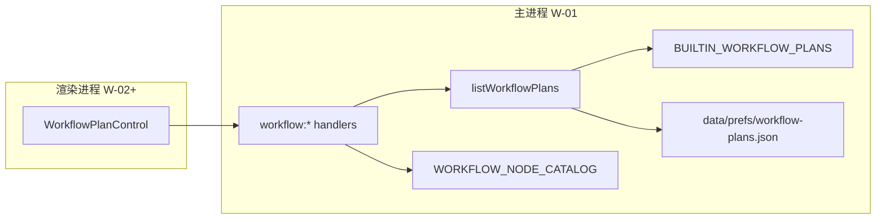

# US-W-01 方案模型、节点目录与预置持久化

> **用户故事**：[../18-需求-任务编排一键跑通.md](../18-需求-任务编排一键跑通.md) · US-W-01  
> **状态**：编码已落地（单测 T1–T10 通过）  
> **范围**：工作区内「任务方案」Schema、节点目录单源、唯一内置预置、用户方案 JSON 持久化、主进程 IPC（**无 UI、无执行器**）  
> **依赖**：无（节点映射现网 Skill / IPC 名称）  
> **不做**：方案下拉 / 执行按钮（W-02）；顺序执行（W-03）；编排弹框（W-04）；`localStorage` 执行记忆（W-02）；工作区模板 bump  
> **文档位置**：`docs/design/`

---

## 0. 相对现网

| 现网 | **本期（W-01）** |
|------|------------------|
| 无「任务方案」概念；各页独立按钮 | 主进程可读 **内置 + 用户** 方案列表；用户方案 CRUD 持久化 |
| R1/R2/R3 / 评分 / 起草能力分散 | **节点目录** 在代码中单源维护，供 W-03 映射 IPC、W-04 弹框勾选 |
| 用户偏好类似 R2 站点开关 → `data/prefs/explore-r2.json` | 用户方案 → **`data/prefs/workflow-plans.json`**（同层，工作区根下） |

无渲染进程改动；无 Preload 以外的 Vue 组件。

---

## 1. 已确认选型

| 项 | 决定 |
|----|------|
| **Q1 持久化路径** | **`{workspaceRoot}/data/prefs/workflow-plans.json`**。与 `explore-r2.json` 同属工作区用户偏好层；**不**用 `data/config/`（该层放只读登记 yaml，如 `explore-r2-sites.yaml`） |
| **Q2 内置方案存放** | 代码常量 **`BUILTIN_WORKFLOW_PLANS`**（`builtin-plans.ts`）；**不**写入 JSON 文件；`list` 时在内存 merge |
| **Q3 唯一内置** | 仅 **`builtin-standard`**（标准获客：R1 → R2 → 评分去重 → 批量起草）；**不含 R3**（与需求 §5 一致） |
| **Q4 用户方案 ID** | 前缀 **`user_`** + **8 位小写 hex**（`crypto.randomBytes(4).toString('hex')`）；保存时若 payload 带合法已有 `user_*` id 则 upsert |
| **Q5 名称唯一性** | 用户方案 **名称** trim 后 **1～40 字**；在用户方案集合内 **不区分大小写唯一**；与内置方案名 **可重名**（下拉靠 `id` 区分） |
| **Q6 步骤约束** | `steps.length` **1～10**；每步 `nodeId` 必须 ∈ `WORKFLOW_NODE_CATALOG`；**允许重复 nodeId**（v1 不禁止，如双跑 R1；W-04 UI 可提示但不拦） |
| **Q7 时间戳** | 用户方案 ISO 8601 UTC：`createdAt` 新建写入、更新保留；`updatedAt` 每次 save 刷新。内置方案 **无** 时间戳字段 |
| **Q8 损坏 / 缺文件** | 文件不存在 → 等价 `{}`；JSON 解析失败 → `console.warn` + 当空用户列表；**内置方案仍可用** |
| **Q9 列表排序** | 内置方案 **始终最前**（当前仅一条）；用户方案按 **`name` `localeCompare(..., 'zh-CN')`** |
| **Q10 IPC 返回风格** | 与 `exploration:get-r2-sites` 一致：`{ ok, message?, plans? }` / `{ ok, message?, plan? }`；业务校验失败 **不 throw**，`ok: false` + 中文 `message` |
| **Q11 工作区目录** | 首次 `save` 时 `mkdirSync` 父目录；`workspace-init` 已含 `data/prefs`，**本故事不 bump 模板版本** |
| **Q12 单测** | `workflow-plans.test.ts`：读写、merge、校验、拒绝改 builtin；`workflow-nodes.test.ts`（可选，catalog 完整性） |

---

## 2. 类型与 Schema

### 2.1 节点 ID（冻结）

```typescript
export type WorkflowNodeId =
  | 'expand-keywords'
  | 'discover-r1'
  | 'discover-r2'
  | 'discover-r3'
  | 'score-and-dedupe'
  | 'draft-outreach-email'
```

与 [18 号需求 §4](../18-需求-任务编排一键跑通.md#4-节点目录-v1) 一致；**不**纳入 `extract-product-profile`（生成画像仍走录入 / 画像页）。

### 2.2 方案 DTO

```typescript
export interface WorkflowPlanStep {
  nodeId: WorkflowNodeId
}

export interface WorkflowPlan {
  id: string
  name: string
  steps: WorkflowPlanStep[]
  /** 仅内置方案为 true；用户方案 omit 或 false */
  builtin?: boolean
  /** 仅用户方案 */
  createdAt?: string
  updatedAt?: string
}
```

### 2.3 磁盘文件 envelope

路径：`data/prefs/workflow-plans.json`

```json
{
  "version": 1,
  "plans": [
    {
      "id": "user_a1b2c3d4",
      "name": "只跑 R1",
      "steps": [{ "nodeId": "discover-r1" }],
      "createdAt": "2026-09-05T16:00:00.000Z",
      "updatedAt": "2026-09-05T16:00:00.000Z"
    }
  ]
}
```

| 字段 | 规则 |
|------|------|
| `version` | 固定 **1**；未来 breaking 变更 bump 并写迁移（v1 无迁移逻辑，非法 version 当空） |
| `plans` | 仅 **用户** 方案；**不得**含 `builtin: true` 或 `id` 以 `builtin-` 开头（读入时 **丢弃** 并 warn） |

---

## 3. 节点目录单源

**文件**：`desktop/electron/workflow/workflow-nodes.ts`

```typescript
export interface WorkflowNodeDef {
  id: WorkflowNodeId
  /** 下拉 / 弹框展示名 */
  label: string
  /** Agent 时间线 / Skill 名 */
  skill: string
  /** Preflight 种类（与 AgentPreflightKind 对齐） */
  preflightSkill: AgentPreflightKind
  /** W-03 映射：preload 方法名（文档用途，非运行时反射） */
  executeVia: 'expandKeywords' | 'startExploreR1' | 'startExploreR2' | 'startExploreR3' | 'scoreAndDedupeLeads' | 'draftEmails'
  /** IPC 通道常量名（W-03 对照） */
  ipcChannel: keyof typeof IPC
}

export const WORKFLOW_NODE_CATALOG: readonly WorkflowNodeDef[] = [ /* 见下表 */ ]

export function isWorkflowNodeId(value: string): value is WorkflowNodeId
export function getWorkflowNodeDef(nodeId: WorkflowNodeId): WorkflowNodeDef
export function listWorkflowNodeDefs(): readonly WorkflowNodeDef[]
```

### 3.1 目录表（冻结）

| id | label | skill | preflightSkill | executeVia | ipcChannel |
|----|-------|-------|----------------|------------|------------|
| `expand-keywords` | 扩展关键词 | `expand-keywords` | `expand-keywords` | `expandKeywords` | `KEYWORDS_EXPAND` |
| `discover-r1` | R1 广撒网 | `discover-leads` | `discover-leads` | `startExploreR1` | `EXPLORATION_START_R1` |
| `discover-r2` | R2 社媒发现 | `discover-leads-r2` | `discover-leads-r2` | `startExploreR2` | `EXPLORATION_START_R2` |
| `discover-r3` | R3 地图发现 | `discover-leads-r3` | `discover-leads-r3` | `startExploreR3` | `EXPLORATION_START_R3` |
| `score-and-dedupe` | 评分去重 | `score-and-dedupe` | `score-and-dedupe` | `scoreAndDedupeLeads` | `LEADS_SCORE_AND_DEDUPE` |
| `draft-outreach-email` | 批量起草开发信 | `draft-outreach-email` | `draft-email` | `draftEmails` | `EMAIL_DRAFT_GENERATE` |

> **说明**：Preflight 沿用现网口径——Skill 名与 `AgentPreflightKind` 不完全相同（如起草：`draft-outreach-email` vs `draft-email`）。W-03 Preflight 合并时以 **`preflightSkill`** 为准。

---

## 4. 内置预置

**文件**：`desktop/electron/workflow/builtin-plans.ts`

```typescript
import type { WorkflowPlan } from './workflow-plans-types'

export const BUILTIN_WORKFLOW_PLANS: readonly WorkflowPlan[] = [
  {
    id: 'builtin-standard',
    name: '标准获客',
    builtin: true,
    steps: [
      { nodeId: 'discover-r1' },
      { nodeId: 'discover-r2' },
      { nodeId: 'score-and-dedupe' },
      { nodeId: 'draft-outreach-email' },
    ],
  },
] as const

export const DEFAULT_WORKFLOW_PLAN_ID = 'builtin-standard' as const
```

| 规则 | 说明 |
|------|------|
| 不可删 | `deleteWorkflowPlan('builtin-standard')` → `ok: false` |
| 不可改 | `save` 带 `builtin-*` id 或 `builtin: true` → 拒绝 |
| 不可被文件覆盖 | 读 JSON 时丢弃任何 `builtin-*` 记录 |
| 默认选中 | W-02 用 `DEFAULT_WORKFLOW_PLAN_ID`；W-01 仅导出常量 |

---

## 5. 主进程模块

### 5.1 文件布局

```
desktop/electron/workflow/
  workflow-plans-types.ts   # WorkflowPlan、DTO、Result 类型（供 ipc/types re-export）
  workflow-nodes.ts         # §3 目录
  builtin-plans.ts          # §4 内置
  workflow-plans.ts         # 读写、校验、merge、CRUD
  workflow-plans.test.ts
  workflow-nodes.test.ts    # 可选：5 节点、builtin 步骤合法
```

### 5.2 核心 API（主进程内部）

```typescript
function userPlansFilePath(workspaceRoot: string): string

function loadUserWorkflowPlans(workspaceRoot: string): WorkflowPlan[]

function listWorkflowPlans(workspaceRoot: string): WorkflowPlan[]
// = [...BUILTIN_WORKFLOW_PLANS, ...userPlans sorted]

function getWorkflowPlanById(workspaceRoot: string, id: string): WorkflowPlan | null
// W-03 执行器用；W-01 可不暴露 IPC

function saveUserWorkflowPlan(
  workspaceRoot: string,
  input: WorkflowPlanSaveInput,
): WorkflowPlan

function deleteUserWorkflowPlan(workspaceRoot: string, id: string): void
```

### 5.3 校验与错误文案

| 场景 | `message`（示例） |
|------|-------------------|
| `id` 以 `builtin-` 开头 | `内置方案不可修改` |
| payload `builtin: true` | `不可保存为内置方案` |
| 名称为空 / 超长 | `方案名称须为 1～40 个字符` |
| 与用户方案重名 | `已存在同名方案「{name}」` |
| `steps` 为空或 >10 | `方案须包含 1～10 个步骤` |
| 非法 `nodeId` | `未知步骤：{nodeId}` |
| 删除 builtin | `内置方案不可删除` |
| 删除不存在的 user id | `方案不存在：{id}` |
| 更新时 id 不存在 | `方案不存在：{id}`（W-04 编辑路径；新建不传 id 则生成） |

### 5.4 `WorkflowPlanSaveInput`

```typescript
export interface WorkflowPlanSaveInput {
  /** 省略则新建 */
  id?: string
  name: string
  steps: WorkflowPlanStep[]
}
```

保存成功返回完整 `WorkflowPlan`（含 `createdAt` / `updatedAt`）。

---

## 6. IPC 契约

### 6.1 通道常量

在 `desktop/electron/ipc/types.ts` 的 `IPC` 对象追加：

```typescript
WORKFLOW_LIST_PLANS: 'workflow:list-plans',
WORKFLOW_SAVE_PLAN: 'workflow:save-plan',
WORKFLOW_DELETE_PLAN: 'workflow:delete-plan',
```

### 6.2 类型（`ipc/types.ts`）

```typescript
export type { WorkflowPlan, WorkflowPlanStep, WorkflowPlanSaveInput } from '../workflow/workflow-plans-types'

export interface WorkflowListPlansResult {
  ok: boolean
  plans: WorkflowPlan[]
  message?: string
}

export interface WorkflowSavePlanResult {
  ok: boolean
  plan?: WorkflowPlan
  message?: string
}

export interface WorkflowDeletePlanResult {
  ok: boolean
  message?: string
}
```

### 6.3 Handler（`main.ts`）

| 通道 | 入参 | 出参 | 行为 |
|------|------|------|------|
| `workflow:list-plans` | 无 | `WorkflowListPlansResult` | `getWorkspaceRoot()` → `listWorkflowPlans` |
| `workflow:save-plan` | `WorkflowPlanSaveInput` | `WorkflowSavePlanResult` | 校验 + 写文件 |
| `workflow:delete-plan` | `id: string` | `WorkflowDeletePlanResult` | 仅删用户方案 |

Handler 模板（与 R2 sites 一致）：

```typescript
ipcMain.handle(IPC.WORKFLOW_LIST_PLANS, () => {
  try {
    return { ok: true as const, plans: listWorkflowPlans(getWorkspaceRoot()) }
  } catch (err) {
    return { ok: false as const, plans: [], message: formatErr(err) }
  }
})
```

### 6.4 Preload（`preload.ts` + `electron.d.ts`）

```typescript
listWorkflowPlans: (): Promise<WorkflowListPlansResult>
saveWorkflowPlan: (input: WorkflowPlanSaveInput): Promise<WorkflowSavePlanResult>
deleteWorkflowPlan: (id: string): Promise<WorkflowDeletePlanResult>
```

挂载于 `window.ftcs`，命名与需求文档 **`listWorkflowPlans` / `saveWorkflowPlan` / `deleteWorkflowPlan`** 一致。

---

## 7. 数据流



---

## 8. 文件清单

| 文件 | 动作 |
|------|------|
| `desktop/electron/workflow/workflow-plans-types.ts` | **新增** DTO |
| `desktop/electron/workflow/workflow-nodes.ts` | **新增** 目录 |
| `desktop/electron/workflow/builtin-plans.ts` | **新增** 内置 |
| `desktop/electron/workflow/workflow-plans.ts` | **新增** CRUD |
| `desktop/electron/workflow/workflow-plans.test.ts` | **新增** 单测 |
| `desktop/electron/workflow/workflow-nodes.test.ts` | **新增**（可选） |
| `desktop/electron/ipc/types.ts` | IPC 常量 + Result 类型 |
| `desktop/electron/main.ts` | 注册 3 个 handler |
| `desktop/electron/preload.ts` | 暴露 3 方法 |
| `desktop/src/types/electron.d.ts` | `window.ftcs` 类型 |
| `docs/18-需求-任务编排一键跑通.md` | W-01 状态 → 详设已写 |
| `docs/04-实施计划.md` | 下一步指向 W-01 编码（若尚未更新） |

**不改动**：Vue 视图、Skill、MCP、`workspace-init` 模板版本。

---

## 9. 验收对照

### 9.1 自动化（`workflow-plans.test.ts`）

| # | 用例 | 期望 |
|---|------|------|
| T1 | 空工作区 `listWorkflowPlans` | 仅 1 条 `builtin-standard`，4 步顺序正确 |
| T2 | `save` 新建（无 id） | 生成 `user_*`；文件存在；`createdAt`/`updatedAt` 有值 |
| T3 | `save` 更新已有 user id | 名称/steps 变；`createdAt` 不变；`updatedAt` 变 |
| T4 | 重名 save | `ok: false` |
| T5 | 非法 nodeId | `ok: false` |
| T6 | `save` id=`builtin-standard` | 拒绝 |
| T7 | `delete` user 方案 | 文件内移除；list 不含 |
| T8 | `delete` `builtin-standard` | 拒绝；list 仍含 |
| T9 | JSON 含伪造 `builtin-evil` | 读入丢弃；list 仍仅官方 builtin |
| T10 | 损坏 JSON | list 仍含 builtin；用户列表为空 |

### 9.2 手工 / DevTools（编码后）

| # | 步骤 | 期望 |
|---|------|------|
| M1 | 打开工作区，DevTools 调 `ftcs.listWorkflowPlans()` | 返回 `builtin-standard` |
| M2 | `saveWorkflowPlan({ name:'仅R1', steps:[{nodeId:'discover-r1'}] })` | 成功；磁盘 JSON 有记录 |
| M3 | 重启应用后再 list | 用户方案仍在 |
| M4 | `deleteWorkflowPlan(user_xxx)` | 成功；builtin 仍在 |

### 9.3 需求 §US-W-01 验收要点映射

- [x] Schema：`id`、`name`、`steps[]`、`builtin`、时间戳 — §2  
- [x] 持久化路径冻结 — §1 Q1  
- [x] 内置 merge、不可覆盖 — §4、§5.2  
- [x] IPC 三方法 — §6  
- [x] 节点目录单源 — §3  

---

## 10. 实现顺序建议

1. `workflow-plans-types.ts` + `workflow-nodes.ts` + `builtin-plans.ts`  
2. `workflow-plans.ts` + 单测（T1–T10）  
3. `ipc/types.ts` → `main.ts` → `preload.ts` → `electron.d.ts`  
4. 手工 M1–M4  

**编码门禁**：本详设评审通过后再动业务代码。W-02 依赖本故事 IPC；W-03 依赖 `getWorkflowPlanById` + `WORKFLOW_NODE_CATALOG`。

---

## 11. 风险与后续

| 风险 | 缓解 |
|------|------|
| 用户手动编辑 JSON 写入 `builtin-*` | 读入过滤 + save/delete 拒绝 |
| 方案名与内置重名导致困惑 | W-04 下拉显示时可在内置项加「内置」后缀（UI 故事，非 W-01） |
| 步骤含 R3 但用户未配 Places | W-03 Preflight 按步拦截；W-01 不校验环境 |
| 多工作区切换 | 与现网一致：凡 IPC 均 `getWorkspaceRoot()`，方案随工作区隔离 |

**后续故事引用**：W-02 读 `listWorkflowPlans`；W-03 读 `getWorkflowPlanById` + 节点 `executeVia`；W-04 读 `listWorkflowNodeDefs` + save/delete。
