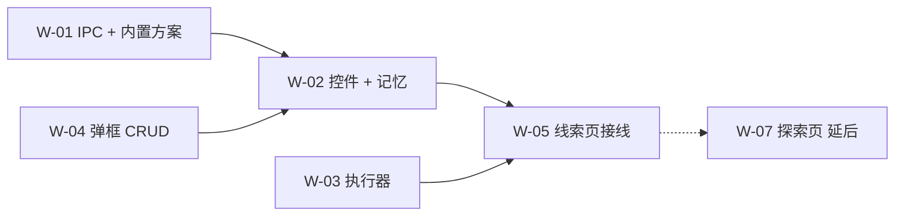
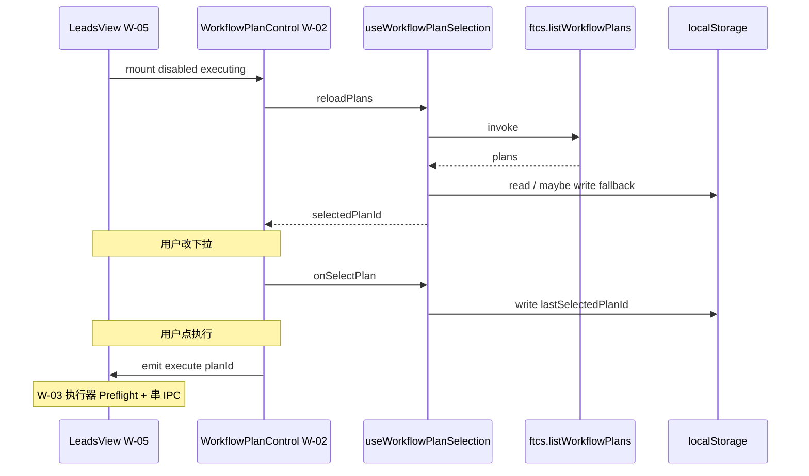

# US-W-02 方案下拉与「执行」控件

> **用户故事**：[../18-需求-任务编排一键跑通.md](../18-需求-任务编排一键跑通.md) · US-W-02  
> **状态**：编码已落地（记忆单测 T1–T5 通过）  
> **范围**：可复用 Vue 组件 `WorkflowPlanControl` + 方案列表加载 + §5.1 执行记忆 composable；**v1 仅在线索页挂载**（接线在 **US-W-05**）  
> **依赖**：US-W-01（`listWorkflowPlans` IPC）  
> **不做**：顺序执行（W-03）；弹框 CRUD（W-04）；线索页替换 `ExploreStartControl` / 空态 / 单步按钮互斥（W-05）；探索页接入（W-07）  
> **文档位置**：`docs/design/`

---

## 0. 相对现网

| 现网（线索页） | **本期（W-02）** |
|----------------|------------------|
| `ExploreStartControl`：R1/R2/R3 下拉 +「开始探索」 | 新组件：**方案名称**下拉 +「**执行**」 |
| 记忆键 `ftcs.explore.startRound`（R1/R2/R3） | 记忆键 **`ftcs.workflow.lastSelectedPlanId`**（方案 id） |
| 点击即 `useExploreStart.startExplore()` | 点击 **`emit('execute', planId)`**；真正串跑由 **W-03** 父级处理 |

| 页面 | v1 |
|------|-----|
| **线索页** | W-05 挂载 `WorkflowPlanControl`（compact） |
| **探索页** | **不改**；仍 `ExploreStartControl`（→ US-W-07） |

---

## 1. 与相邻故事的分工



| 故事 | 职责 |
|------|------|
| **W-02** | UI 壳 + 拉方案列表 + localStorage 读写 + 向父组件抛 `execute` |
| **W-03** | 父级收到 `execute` 后 Preflight + 逐步 IPC |
| **W-04** | 下拉底「新建/编辑/删除」入口与弹框；保存后调 composable `reloadPlans()` |
| **W-05** | `LeadsView` 替换控件、传 `disabled`/`executing`、接 W-03 |
| **W-07** | 探索页挂载同一组件（+ `maxQueriesLimit`） |

---

## 2. 已确认选型

| 项 | 决定 |
|----|------|
| **Q1 组件路径** | `desktop/src/components/workflow/WorkflowPlanControl.vue` |
| **Q2 逻辑 composable** | `desktop/src/composables/useWorkflowPlanSelection.ts`（列表 + 选中 + 记忆；与 UI 分离便于单测） |
| **Q3 默认方案 id** | 渲染进程常量 **`DEFAULT_WORKFLOW_PLAN_ID = 'builtin-standard'`**（与主进程 `builtin-plans.ts` 字符串一致，不跨进程 import） |
| **Q4 下拉展示** | **仅方案 `name`**；内置与用户方案同名时靠 `id` 区分，v1 **不**加「内置」后缀（W-04 可选增强） |
| **Q5 列表来源** | `window.ftcs.listWorkflowPlans()`；顺序沿用主进程（内置在前 → 用户方案 zh-CN 排序） |
| **Q6 记忆键** | `localStorage` · **`ftcs.workflow.lastSelectedPlanId`**；v1 **仅本控件挂载处写入**（线索页） |
| **Q7 记忆时机** | 用户 **更改下拉** 立即写入；**不**等执行成功；无效 id 回退 `builtin-standard` 并 **覆盖写回** storage |
| **Q8 与产品切换** | 记忆 **全局**（不按 `productId` 分）；切换侧栏产品 **不**重置选中方案 |
| **Q9 执行按钮** | 文案：**执行** / **执行中…**（`executing === true`）；探索页 US-W-07 前无「开始探索」文案 |
| **Q10 disabled 权威** | **父组件**传入 `disabled` + `disabledReason`（W-05 汇总：无产品、W-03 执行中、评分/起草 busy 等）；本组件 **不**内嵌 R1/R2 词数 Preflight |
| **Q11 样式** | 布局对齐现网 `ExploreStartControl`（select + 主按钮连体）；新 BEM 前缀 **`workflow-plan-control`**，不共用 `explore-start` class（避免探索页 CSS 耦合） |
| **Q12 compact** | 默认 **`compact: true`**（线索页工具栏）；US-W-07 探索页可 `compact: false` |
| **Q13 maxQueriesLimit** | **v1 不做**；prop 预留 `maxQueriesLimit?: number \| null`（默认 ignore，W-07 详设） |
| **Q14 W-04 入口** | v1 下拉 **仅 `<option>`**；「新建/编辑/删除」**slot 或 W-04 再包一层** —— W-02 **留 `menu` slot**（默认空），W-04 填入 |
| **Q15 单测** | `useWorkflowPlanSelection.test.ts`（记忆读写、无效回退）；不强制 Vue 组件 E2E |
| **Q16 本故事交付物** | 组件 + composable + 样式 + 单测；**LeadsView 仍用现网控件**，直至 W-05 替换 |

---

## 3. 界面

### 3.1 布局（compact · 线索页）

与现网线索页工具栏右侧控件视觉一致：

```
┌──────────────────┬─────────────┐
│ 标准获客      ▼ │  ▶ 执行     │
└──────────────────┴─────────────┘
```

| 元素 | 说明 |
|------|------|
| `<select>` | `aria-label="选择任务方案"`；`busy`/`executing` 时 disabled |
| 主按钮 | `btn-primary`；图标 `play`；`title` = 禁用时 `disabledReason`，否则 `执行方案「{name}」` |
| **slot `menu`** | 下拉与按钮之间的可选区域（W-04 放「…」或底部 optgroup 替代方案） |

### 3.2 状态

| 状态 | 下拉 | 按钮文案 | 按钮 disabled |
|------|------|----------|---------------|
| 加载方案中 | disabled | 执行 | true |
| 加载失败 | disabled 或空列表 | 执行 | true；`title` = IPC message |
| 就绪 | 可选 | 执行 | `props.disabled` |
| 执行中 | disabled | **执行中…** | true |
| 父级 busy | 可选或 disabled | 执行 / 执行中… | 由 `props.disabled` |

### 3.3 无新页面

不新增路由、弹框、Preflight 弹窗；Preflight 失败文案由 **W-03 / W-05** 写入 `actionMessage` 或 `disabledReason`。

---

## 4. 组件 API

### 4.1 `WorkflowPlanControl.vue`

```typescript
const props = withDefaults(
  defineProps<{
    /** 线索页 compact；探索页 W-07 可 false */
    compact?: boolean
    /** 父级：无产品 / 执行中 / 评分起草 busy 等 */
    disabled?: boolean
    disabledReason?: string
    /** W-03 执行器 running */
    executing?: boolean
    /** US-W-07 预留；v1 忽略 */
    maxQueriesLimit?: number | null
    /** 可选：受控选中 id（W-04 保存后同步） */
    selectedPlanId?: string
  }>(),
  {
    compact: true,
    disabled: false,
    disabledReason: '',
    executing: false,
    maxQueriesLimit: null,
  },
)

const emit = defineEmits<{
  execute: [planId: string]
  'update:selectedPlanId': [planId: string]
}>()
```

**暴露（`defineExpose`，供 W-04/W-05）**

```typescript
defineExpose({
  reloadPlans: () => Promise<void>
  selectPlanId: (id: string) => void
})
```

### 4.2 `useWorkflowPlanSelection.ts`

```typescript
export const WORKFLOW_LAST_SELECTED_PLAN_STORAGE_KEY =
  'ftcs.workflow.lastSelectedPlanId'

export const DEFAULT_WORKFLOW_PLAN_ID = 'builtin-standard' as const

export function readLastSelectedPlanId(availableIds: readonly string[]): string

export function writeLastSelectedPlanId(planId: string): void

export function resolveSelectedPlanId(
  availableIds: readonly string[],
  preferred?: string,
): string
// preferred 无效 → read storage → 仍无效 → DEFAULT + writeLastSelectedPlanId

export function useWorkflowPlanSelection(options?: {
  /** 受控选中；与 v-model 二选一 */
  selectedPlanId?: Ref<string | undefined>
}) {
  return {
    plans: Ref<WorkflowPlan[]>
    loading: Ref<boolean>
    loadError: Ref<string>
    selectedPlanId: Ref<string>
    selectedPlan: ComputedRef<WorkflowPlan | undefined>
    reloadPlans: () => Promise<void>
    onSelectPlan: (planId: string) => void
    /** W-04 删除当前方案后调用 */
    onPlanRemoved: (removedId: string) => void
  }
}
```

### 4.3 记忆规则（实现对照 §5.1）

```typescript
export function readLastSelectedPlanId(availableIds: readonly string[]): string {
  try {
    const saved = localStorage.getItem(WORKFLOW_LAST_SELECTED_PLAN_STORAGE_KEY)
    if (saved && availableIds.includes(saved)) return saved
  } catch {
    // ignore quota / private mode
  }
  return DEFAULT_WORKFLOW_PLAN_ID
}

export function writeLastSelectedPlanId(planId: string): void {
  try {
    localStorage.setItem(WORKFLOW_LAST_SELECTED_PLAN_STORAGE_KEY, planId)
  } catch {
    // ignore
  }
}

export function resolveSelectedPlanId(
  availableIds: readonly string[],
  preferred?: string,
): string {
  if (preferred && availableIds.includes(preferred)) return preferred
  const fromStorage = readLastSelectedPlanId(availableIds)
  if (availableIds.includes(fromStorage)) return fromStorage
  const fallback = availableIds.includes(DEFAULT_WORKFLOW_PLAN_ID)
    ? DEFAULT_WORKFLOW_PLAN_ID
    : availableIds[0] ?? DEFAULT_WORKFLOW_PLAN_ID
  writeLastSelectedPlanId(fallback)
  return fallback
}
```

| 时机 | 行为 |
|------|------|
| `reloadPlans` 成功 | `selectedPlanId = resolveSelectedPlanId(ids, props.selectedPlanId)` |
| 用户改 `<select>` | `onSelectPlan` → write storage → emit `update:selectedPlanId` |
| `onPlanRemoved(id)` | 若 `id === selectedPlanId` → 选 `builtin-standard`（或列表首项）并 write |
| 用户 **未点执行** 只改下拉 | **仍 write**（需求明确要求） |

---

## 5. 数据流



**W-02 不调用** `startExploreR1` / `scoreAndDedupe` 等；仅 **`emit('execute', selectedPlanId)`**。

---

## 6. 样式

**文件**：`desktop/src/styles/main.css` 追加（镜像 `.explore-start` 尺寸）：

```css
.workflow-plan-control { display: inline-flex; align-items: stretch; }
.workflow-plan-control__select { /* 同 explore-start__round 尺寸 */ }
.workflow-plan-control__run { /* 同 explore-start__run 连体圆角 */ }
.workflow-plan-control.is-compact .workflow-plan-control__select { height: 26px; … }
```

| compact | select min-width | 字号 |
|---------|------------------|------|
| false | 118px | 12px |
| true | 108px | 11px |

方案名过长：`text-overflow: ellipsis` + `max-width`（与现网 select 一致，不截断 name 字段本身）。

---

## 7. 与 W-05 的接线约定（本故事只定接口）

W-05 将如下使用（详设见 US-W-05，此处冻结 props 契约）：

```vue
<WorkflowPlanControl
  ref="workflowPlanControlRef"
  compact
  :disabled="!canExecuteWorkflow"
  :disabled-reason="workflowDisabledReason"
  :executing="isWorkflowExecuting"
  v-model:selected-plan-id="selectedWorkflowPlanId"
  @execute="onWorkflowExecute"
/>
```

| 父级 computed | v1 规则（W-05 实现，W-02 不关心细节） |
|---------------|----------------------------------------|
| `canExecuteWorkflow` | 有 `activeProductId` 且非 `generating` / 非评分起草 busy / 非已在执行 |
| `workflowDisabledReason` | 无产品 →「请先在侧栏选择产品」；busy →「已有任务在运行」；其余 Preflight 由 W-03 在点击后给出 |
| `isWorkflowExecuting` | W-03 `useWorkflowExecute().running` |
| `onWorkflowExecute` | 调 W-03 `executePlan(planId)` |

---

## 8. 与 W-04 的扩展点

| 扩展 | 方式 |
|------|------|
| 保存/删除方案后刷新列表 | 父级或弹框调 `workflowPlanControlRef.reloadPlans()` |
| 新建方案后选中 | `selectPlanId(newId)` + composable 内 write storage |
| 下拉底部入口 | **slot `menu`** 或 W-04 包装组件 `WorkflowPlanControlWithCrud.vue`（推荐后者，W-02 保持纯净） |

W-02 **不**实现 CRUD UI。

---

## 9. 与现网 storage 键共存

| 键 | 用途 | v1 写入位置 |
|----|------|-------------|
| `ftcs.explore.startRound` | R1/R2/R3 | **仅探索页** `useExploreStart` |
| `ftcs.workflow.lastSelectedPlanId` | 方案 id | **仅线索页** `WorkflowPlanControl` |

两键 **互不影响**；US-W-07 后探索页也挂载本控件，共用后者。

---

## 10. 文件清单

| 文件 | 动作 |
|------|------|
| `desktop/src/components/workflow/WorkflowPlanControl.vue` | **新增** |
| `desktop/src/composables/useWorkflowPlanSelection.ts` | **新增** |
| `desktop/src/composables/useWorkflowPlanSelection.test.ts` | **新增** |
| `desktop/src/styles/main.css` | 追加 `.workflow-plan-control*` |
| `docs/18-需求-任务编排一键跑通.md` | W-02 状态 → 详设已写 |
| `docs/design/US-W-05-页面接入与迁移.md` | 引用 W-02 props（可选同步） |

**本故事不改**：`LeadsView.vue`、`ExploreView.vue`、`ExploreStartControl.vue`（→ W-05 / W-07）。

---

## 11. 验收对照

### 11.1 自动化

| # | 用例 | 期望 |
|---|------|------|
| T1 | `readLastSelectedPlanId` 无 storage | `builtin-standard` |
| T2 | storage 有合法 id | 返回该 id |
| T3 | storage 有已删除 id | `resolveSelectedPlanId` → `builtin-standard` 并 write |
| T4 | `availableIds` 不含 builtin 仅有 user | 回退 `availableIds[0]` |
| T5 | `onPlanRemoved` 删当前选中 | 选中 builtin + storage 更新 |
| T6 | mock `listWorkflowPlans` 失败 | `loadError` 非空；组件 render 不 throw（组件测试可选） |

### 11.2 手工（W-02 单独交付 · 临时挂载或 Story）

在 **W-05 前** 可用最小页 / DevTools 临时挂组件验证：

| # | 步骤 | 期望 |
|---|------|------|
| M1 | 挂载控件，IPC 正常 | 下拉含「标准获客」 |
| M2 | 选「标准获客」刷新 | 仍选中 |
| M3 | localStorage 写入 `user_xxx` 且列表无此 id | 回退「标准获客」 |
| M4 | 点「执行」 | 父级 stub 收到 `execute('builtin-standard')` |
| M5 | `executing=true` | 按钮「执行中…」且 disabled |
| M6 | 探索页 | **仍** R1/R2/R3 控件（W-02 未替换） |

### 11.3 W-05 后回归（线索页）

| # | 期望 |
|---|------|
| R1 | 线索页工具栏为方案下拉 +「执行」 |
| R2 | 重启应用再进线索页，选中方案保持 |
| R3 | 探索页无变化 |

---

## 12. 实现顺序建议

1. `useWorkflowPlanSelection.ts` + 单测 T1–T5  
2. `main.css` 样式  
3. `WorkflowPlanControl.vue`  
4. （可选）在开发分支临时挂到 `LeadsView` 验 M1–M4，**合并前**若 W-05 未做则 revert 接线，仅留组件  

**编码门禁**：本详设评审通过；依赖 W-01 已落地 IPC。

---

## 13. 风险与后续

| 风险 | 缓解 |
|------|------|
| 方案名过长撑破工具栏 | select ellipsis + compact min-width |
| IPC 慢导致下拉闪空 | `loading` 态 disabled；不 flash 错误选中 |
| W-02 与 W-05 同 PR 过大 | 可先合 W-02 纯组件，W-05 紧跟 |
| 用户混淆两套 storage | 探索页 v1 仍 R1/R2/R3；W-07 文档说明切换 |

**后续**：W-03 消费 `execute`；W-04 消费 `reloadPlans` / `selectPlanId`；W-05 替换 `ExploreStartControl`；W-07 探索页 + `maxQueriesLimit`。
