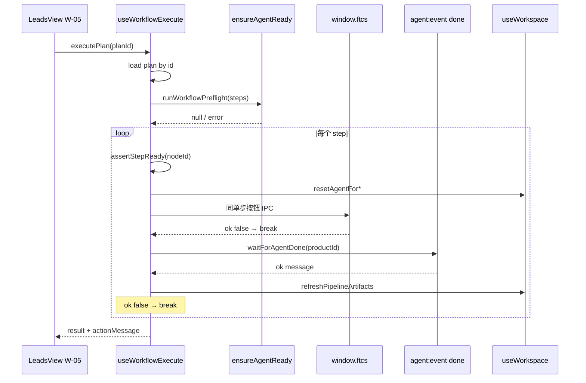

# US-W-03 顺序执行器（等价自动连点）

> **用户故事**：[../18-需求-任务编排一键跑通.md](../18-需求-任务编排一键跑通.md) · US-W-03  
> **状态**：**编码已落地**（W-05 接线后跑 M1–M5 手工验收）  
> **范围**：渲染进程 **顺序执行器** composable：整链 Preflight → 按方案逐步调用现网 IPC → **await** `agent` `done` → 刷新流水线快照  
> **依赖**：US-W-01（方案 / 节点语义）、US-W-02（`execute(planId)` 事件）；现网 `useExploreStart`、`LeadsView` score/draft、`useWorkspace` Agent 事件  
> **不做**：主进程 `workflow-runner`；编排专用 Skill；独立进度 UI；后台静默（W-06）  
> **文档位置**：`docs/design/`

---

## 0. 相对现网

| 现网 | **本期（W-03）** |
|------|------------------|
| 用户逐步点「开始探索 / 评分 / 起草」 | 一次「执行」→ 执行器 **按 steps 顺序** 代点 |
| 每步 IPC 返回后 Agent 异步跑；页面靠 `agent:event` 更新 | 执行器在 IPC `ok` 后 **`await` 下一步 `done`** 再进下一步 |
| 每步 `resetAgentFor*` 会 **清空** 时间线 | **不变**；与「上一步完成后再次手动点主按钮」一致 |
| 单步 Preflight 在点击时做 | **整链 Preflight** 在第一步 IPC 前合并检查 |

**UI 不特殊化**（需求 R4/R5）：右侧 Agent 面板、左侧流水线 **`derivePipelineSteps` 规则不改**；失败 **不**新增流水线 `failed` 态。

---

## 1. 已确认选型

| 项 | 决定 |
|----|------|
| **Q1 运行位置** | **仅渲染进程**（`desktop/src/composables/`）；不新增主进程协调器 |
| **Q2 入口 API** | `useWorkflowExecute()` → `executePlan(planId)` / `cancel()` / `runWorkflowPreflight(plan)` |
| **Q3 方案解析** | `listWorkflowPlans()` 后按 `planId` 查找；找不到 → 不启动，返回文案 |
| **Q4 等待 done** | 新工具 **`waitForAgentDone(productId, signal?)`**：订阅 `onAgentEvent`，首条 `type:'done'` 且 `productId` 匹配即 resolve |
| **Q5 IPC 失败** | 主进程返回 `ok: false` → **不** wait；直接视为该步失败 |
| **Q6 时间线** | 每步仍调现网 **`resetAgentFor*`**（含 `resetTimelineView`）；**不**做跨步时间线合并 |
| **Q7 R1/R2/R3** | **复用** `useExploreStart` 的 `startR1` / `startR2` / `startR3`（本故事扩展 export；v1 线索页 **不传** `maxQueriesLimit` → 该轮 **全部词**） |
| **Q8 扩展关键词** | 同 `ProfileView.createExploreTask`：`expandKeywords(productId)` + `resetAgentForExpandKeywords`；前置 **画像 `ready`**（见 §4.3） |
| **Q9 评分 / 起草** | 同 `LeadsView`：`scoreAndDedupeLeads` / `draftEmails({ productId })`（high 批量，不传 `leadIds`） |
| **Q10 整链 Preflight** | 对方案 steps 的 **`preflightSkill` 去重**（保序），逐个 `ensureAgentReady`；**任一项失败 → 不启动** |
| **Q11 步内门禁** | 探索步复用 `useExploreStart` 的 `canStartR*` / `startR*DisabledReason`；评分要 `raw>0`；起草要 `pendingHigh>0`；扩展要 `profile.status==='ready'` |
| **Q12 步后刷新** | 每步 `done` 后 **`await refreshPipelineArtifacts()`** + 线索页 **`refreshLeads()`**（W-05 传入或 composable 内调 workspace） |
| **Q13 失败文案** | `方案「{planName}」在步骤「{stepLabel}」失败：{detail}`；写入 `actionMessage`（W-05） |
| **Q14 中止** | `cancel()` → `abortProfile()` + `AbortSignal` 取消 wait；`running=false`；**不**自动下一步 |
| **Q15 并发** | `running` 时拒绝第二次 `executePlan`；与现网 `generating` 一致 |
| **Q16 节点展示名** | 渲染进程 **`workflow-node-labels.ts`**（与主进程 catalog **label 对齐**，不 import electron） |
| **Q17 单测** | `wait-for-agent-done.test.ts`、`useWorkflowExecute.test.ts`（mock IPC + mock done） |

---

## 2. 模块结构

```
desktop/src/
  constants/workflow-node-labels.ts   # nodeId → label（文案 / 失败提示）
  composables/
    wait-for-agent-done.ts            # 单次 done 等待
    wait-for-agent-done.test.ts
    useWorkflowExecute.ts             # 执行器主体
    useWorkflowExecute.test.ts
  composables/useExploreStart.ts      # 扩展 export startR1/R2/R3
```



---

## 3. 类型与 API

### 3.1 `useWorkflowExecute`

```typescript
export type WorkflowExecuteResult =
  | { ok: true; message: string; completedSteps: number }
  | {
      ok: false
      message: string
      failedStep?: { nodeId: WorkflowNodeId; label: string }
      completedSteps: number
    }

export function useWorkflowExecute(options?: {
  /** W-05 写入 LeadsView 横幅 */
  onMessage?: (message: string) => void
  /** 每步完成后刷新线索表 */
  refreshLeads?: () => Promise<void>
}): {
  running: Ref<boolean>
  currentStepIndex: Ref<number>
  currentStepLabel: Ref<string>
  currentPlanName: Ref<string>
  runWorkflowPreflight: (plan: WorkflowPlan) => Promise<string | null>
  executePlan: (planId: string) => Promise<WorkflowExecuteResult>
  cancel: () => Promise<void>
}
```

### 3.2 `waitForAgentDone`

```typescript
export function waitForAgentDone(
  productId: string,
  options?: { signal?: AbortSignal; timeoutMs?: number },
): Promise<{ ok: boolean; message: string }>
```

| 规则 | 说明 |
|------|------|
| 订阅 | `window.ftcs.onAgentEvent`；收到 **`type === 'done'`** 且 **`payload.productId === productId`** 时 resolve |
| 超时 | 默认 **无**（与 Agent 任务一致）；单测可传 `timeoutMs` |
| 取消 | `signal.aborted` → reject `DOMException('AbortError')`；`cancel()` 调用 `abortProfile` 后应收到 `done ok:false` 或 wait reject |
| 清理 | `finally` 中 **必须** `unsubscribe()` |

### 3.3 `runWorkflowPreflight(plan)`

```typescript
const seen = new Set<AgentPreflightKind>()
for (const step of plan.steps) {
  const kind = WORKFLOW_NODE_PREFLIGHT[step.nodeId] // 与 W-01 catalog 一致
  if (seen.has(kind)) continue
  seen.add(kind)
  const err = await ensureAgentReady(kind)
  if (err) return err
}
return null
```

| nodeId | preflightSkill |
|--------|----------------|
| `expand-keywords` | `expand-keywords` |
| `discover-r1` | `discover-leads` |
| `discover-r2` | `discover-leads-r2` |
| `discover-r3` | `discover-leads-r3` |
| `score-and-dedupe` | `score-and-dedupe` |
| `draft-outreach-email` | `draft-email` |

---

## 4. 步骤执行映射

### 4.1 总表

| nodeId | resetAgent | IPC | 步内门禁（Preflight 通过后） |
|--------|------------|-----|------------------------------|
| `expand-keywords` | `resetAgentForExpandKeywords` | `expandKeywords(productId)` | `currentProfile.status === 'ready'` |
| `discover-r1` | `resetAgentForDiscoverLeads(n, 'discover-leads')` | `useExploreStart.startR1()` 内部 IPC | `canStartR1` |
| `discover-r2` | `resetAgentForDiscoverLeads(n, 'discover-leads-r2')` | `startR2()` | `canStartR2` |
| `discover-r3` | `resetAgentForDiscoverLeads(n, 'discover-leads-r3')` | `startR3()` | `canStartR3` |
| `score-and-dedupe` | `resetAgentForScoreAndDedupe(raw)` | `scoreAndDedupeLeads(productId)` | `stats.raw > 0` |
| `draft-outreach-email` | `resetAgentForDraftEmail(pendingHigh)` | `draftEmails({ productId })` | `pendingHighLeadIds.length > 0` |

> **实现建议**：探索三步 **直接调用** `startR1/R2/R3`（其内部已含 Preflight + reset + IPC）；执行器 **不再**重复 Preflight 该步，但 **仍**在整链 Preflight 中检过。评分 / 扩展 / 起草步 **复制** `LeadsView` / `ProfileView` 启动逻辑为私有 `runStepXxx`。

### 4.2 `executePlan` 伪代码

```typescript
async function executePlan(planId: string): Promise<WorkflowExecuteResult> {
  if (running.value) return { ok: false, message: '已有方案在执行中', completedSteps: 0 }
  const plan = await loadPlan(planId)
  if (!plan) return { ok: false, message: `方案不存在：${planId}`, completedSteps: 0 }

  const preflightErr = await runWorkflowPreflight(plan)
  if (preflightErr) return { ok: false, message: preflightErr, completedSteps: 0 }

  running.value = true
  currentPlanName.value = plan.name
  const ac = new AbortController()
  abortController = ac
  let completed = 0

  try {
    for (let i = 0; i < plan.steps.length; i += 1) {
      currentStepIndex.value = i
      const step = plan.steps[i]
      currentStepLabel.value = labelFor(step.nodeId)

      const gate = assertStepReady(step.nodeId)
      if (gate) throw stepFail(plan, step, gate)

      const launch = await launchStep(step.nodeId, ac.signal)
      if (!launch.ipcOk) throw stepFail(plan, step, launch.message)

      const done = await waitForAgentDone(productId, { signal: ac.signal })
      await refreshPipelineArtifacts()
      await options?.refreshLeads?.()

      if (!done.ok) throw stepFail(plan, step, done.message)

      completed += 1
    }
    const msg = `方案「${plan.name}」已完成（${completed} 步）`
    options?.onMessage?.(msg)
    return { ok: true, message: msg, completedSteps: completed }
  } catch (err) {
    if (isAbort(err)) return { ok: false, message: '已中止', completedSteps: completed }
    const msg = formatWorkflowFail(plan.name, currentStepLabel.value, err)
    options?.onMessage?.(msg)
    return { ok: false, message: msg, failedStep: { ... }, completedSteps: completed }
  } finally {
    running.value = false
    currentStepIndex.value = -1
    abortController = null
  }
}
```

### 4.3 扩展关键词（线索页触发）

| 检查 | 文案 |
|------|------|
| 无 `activeProductId` | `请先在侧栏选择产品` |
| `currentProfile?.status !== 'ready'` | `画像未就绪，请补全必填字段后再执行` |
| IPC / done 失败 | 主进程 / Agent 原文 |

**不**检查画像页 `dirty`（线索页无编辑态）；若未来在线索页可改画像，W-05 再补。

### 4.4 失败格式

```typescript
function formatWorkflowFail(planName: string, stepLabel: string, detail: string): string {
  return `方案「${planName}」在步骤「${stepLabel}」失败：${detail}`
}
```

---

## 5. 与 `useExploreStart` 的改动

**最小扩展**（本故事）：

```typescript
return {
  // ...existing
  startR1,
  startR2,
  startR3,
}
```

`useWorkflowExecute` 内：

```typescript
const explore = useExploreStart({
  extraBusy: () => running.value,
})
```

`extraBusy` 保证执行器 running 时探索按钮逻辑与现网「已有任务在运行」一致（W-05 移除探索控件后主要供执行器内部使用）。

---

## 6. 中止与 AgentPanel

| 场景 | 行为 |
|------|------|
| 用户点 Agent 面板「中止」 | 现网 `abortProfile()` → Agent `done ok:false` → `waitForAgentDone` resolve → 执行器 **停链** |
| 程序 `cancel()` | 同上 |

**W-03 不改** `AgentPanel.vue`；W-05 可选：执行器 `running` 时保持中止按钮可用（现网已 `generating` 时可用）。

---

## 7. 文件清单

| 文件 | 动作 |
|------|------|
| `src/constants/workflow-node-labels.ts` | **新增** |
| `src/composables/wait-for-agent-done.ts` | **新增** |
| `src/composables/wait-for-agent-done.test.ts` | **新增** |
| `src/composables/useWorkflowExecute.ts` | **新增** |
| `src/composables/useWorkflowExecute.test.ts` | **新增** |
| `src/composables/useExploreStart.ts` | export `startR1/R2/R3` |
| `docs/18` / `docs/04` | W-03 状态 |

**不改**：`LeadsView.vue`（→ W-05）、`ExploreView.vue`、主进程 Skill。

---

## 8. 验收对照

### 8.1 自动化

| # | 用例 | 期望 |
|---|------|------|
| T1 | mock 连续 2 次 done | `executePlan` 调 2 次 IPC，顺序正确 |
| T2 | 第 1 步 IPC `ok:false` | 不 wait；`completedSteps=0` |
| T3 | 第 1 步 done `ok:false` | 停链；第 2 步 IPC 未调用 |
| T4 | Preflight 第 2 种 kind 失败 | 无任何 IPC |
| T5 | `cancel()` 中途 | 后续步骤不执行 |
| T6 | `waitForAgentDone` 收到别的 productId done | 忽略，继续等 |

### 8.2 手工（W-05 接线后 · `builtin-standard`）

| # | 步骤 | 期望 |
|---|------|------|
| M1 | 有 R1/R2 词、有 raw、有 high 待起草 | 四步串跑成功；时间线 **分步** 展示（每步清空再跑） |
| M2 | 故意关 R2 站点 / 无 R2 词 | Preflight 或第 2 步门禁失败；**不**跑 R1（Preflight 在 R1 前若仅 R2 词问题 → 步内门禁在 R2 步；**整链 Preflight 不含词数**） |
| M3 | R1 成功、R2 Agent 报错 | 停在 R2；不评分 |
| M4 | 执行中点中止 | 不再自动下一步 |
| M5 | 执行中 | 评分 / 起草 / 第二次执行 disabled |

> **M2 澄清**：R2 **词数**不在整链 Preflight；在 **执行到 R2 步** 时由 `canStartR2` 拦截。若方案 **仅 R1**，则不会触发 R2 词检查。需求样例「R2 Preflight 失败时不启动 R1」指 **方案含 R2 且 Places/环境 Preflight 失败** 时整链不启动——与 **R2 词表为空**（步内失败）区分。

### 8.3 内置方案步骤

`builtin-standard`：**R1 → R2 → 评分去重 → 批量起草**（无 R3、无扩展关键词）。

---

## 9. 实现顺序

1. `workflow-node-labels.ts` + `wait-for-agent-done.ts` + 单测  
2. 扩展 `useExploreStart` export  
3. `useWorkflowExecute.ts` + 单测  
4. **W-05** 接线后跑 M1–M5  

**编码门禁**：本详设评审通过；W-01 / W-02 已落地。

---

## 10. 风险

| 风险 | 缓解 |
|------|------|
| `done` 与 IPC 竞态 | 先注册 wait 再 invoke IPC |
| 评分后 `pendingHigh` 仍 0 | 起草步步内门禁失败；文案与现网单步一致 |
| 长时间串跑用户切页 | 与现网相同；`generating` 占住 Agent |
| 探索步 `startR1` 内部 again Preflight | 可接受（双重检查）；整链 Preflight 仍保留 |
