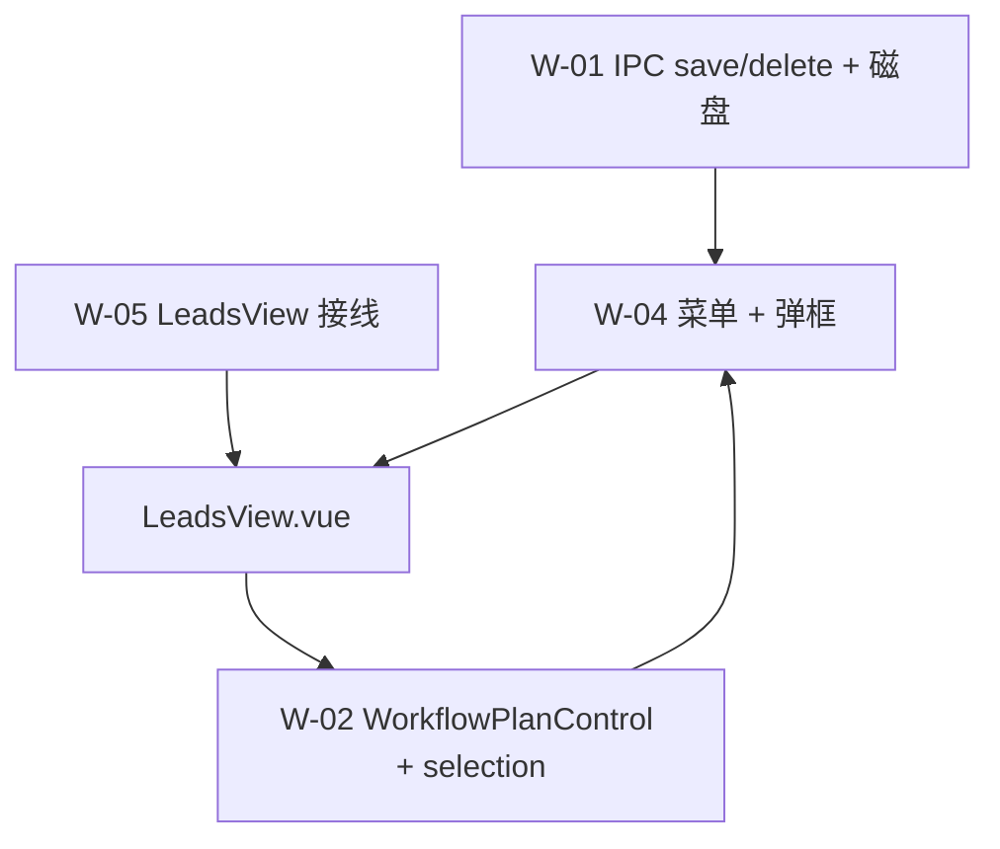
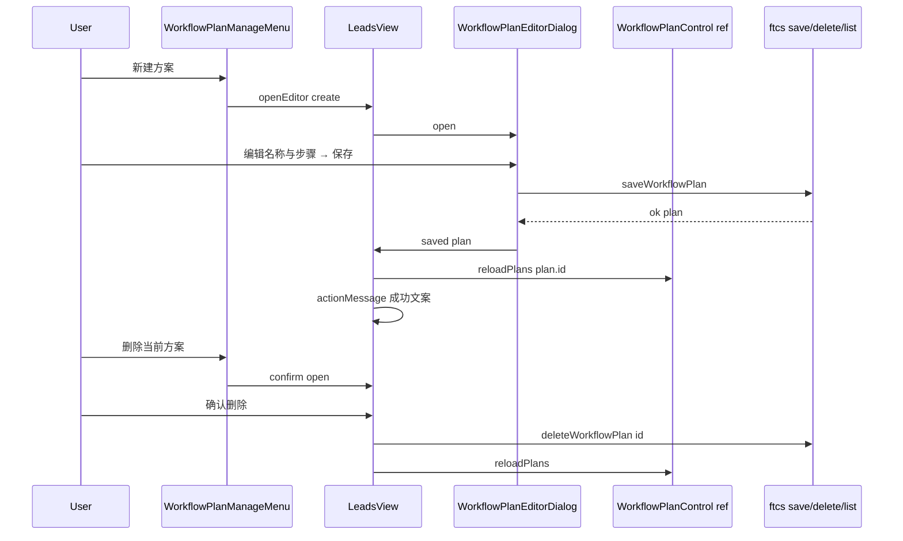

# US-W-04 方案编排弹框：新建 / 编辑 / 删除

> **用户故事**：[../18-需求-任务编排一键跑通.md](../18-需求-任务编排一键跑通.md) · US-W-04  
> **状态**：**编码已落地**（M1–M8 手工验收）  
> **范围**：线索页 `WorkflowPlanControl` **menu 槽** + 编排弹框 + 删除确认；调用 W-01 已有 `saveWorkflowPlan` / `deleteWorkflowPlan` IPC  
> **依赖**：US-W-01（持久化 + 节点目录）、US-W-02（`menu` slot / `reloadPlans` / `selectPlanId`）、US-W-05（线索页已挂载控件）  
> **不做**：导入导出；跨工作区 / 跨产品复制；探索页接入（US-W-07）；拖拽排序；`listWorkflowNodeDefs` 新 IPC（渲染进程用 `workflow-node-labels.ts`）  
> **文档位置**：`docs/design/`

---

## 0. 相对现网

| 现网（W-05 后线索页） | **本期（W-04）** |
|----------------------|------------------|
| 方案下拉 +「执行」；`menu` slot **空** | slot 内 **「⋯」管理菜单**：新建 / 编辑 / 删除 |
| 仅内置「标准获客」；`workflow-plans.json` 可能不存在 | 用户可 **保存自定义方案** → 工作区 **`data/prefs/workflow-plans.json`** 落盘 |
| 无编排 UI | 弹框编辑 **名称 + 有序步骤**（§4 节点目录） |

**探索页不改**（US-W-07 再挂同一套 menu + 弹框）。

---

## 1. 与相邻故事的分工



| 模块 | 职责 |
|------|------|
| **W-01** | `saveUserWorkflowPlan` / `deleteUserWorkflowPlan`；校验与中文 `message` |
| **W-02** | `menu` slot、`reloadPlans` / `selectPlanId` / `onPlanRemoved`（composable 已具备） |
| **W-04** | 菜单入口、弹框 UI、表单校验、保存/删除后刷新下拉 |
| **W-05** | 在 `LeadsView` 填入 `#menu`、挂弹框、`ref` 调 `reloadPlans` |
| **W-03** | **不改动**；执行器仍按 `planId` 读方案 |

---

## 2. 已确认选型

| 项 | 决定 |
|----|------|
| **Q1 挂载页面** | **仅线索页** `LeadsView.vue`（v1）；探索页 **US-W-07** 复用同一组件 |
| **Q2 入口形态** | `WorkflowPlanControl` 的 **`menu` slot** 内放 **`WorkflowPlanManageMenu.vue`**（「⋯」按钮 + 弹出菜单） |
| **Q3 新建** | 菜单「**新建方案…**」→ 打开弹框 `mode=create`，默认 1 步 `discover-r1` |
| **Q4 编辑** | 菜单「**编辑当前方案…**」→ `mode=edit`，载入 `selectedPlan`（用户方案） |
| **Q5 内置方案** | **不可编辑 / 不可删除**；对应菜单项 **disabled**，`title` 说明「内置方案不可修改」 |
| **Q6 删除** | 菜单「**删除当前方案…**」→ 复用 **`ConfirmDialog.vue`**（`danger`）；确认后 `deleteWorkflowPlan` |
| **Q7 弹框组件** | **`WorkflowPlanEditorDialog.vue`**（Teleport + backdrop，对齐 `ConfirmDialog` / `KeywordEditorDialog` 模式） |
| **Q8 步骤排序** | 每行 **上移 / 下移** 按钮；**v1 不做** drag-drop |
| **Q9 步骤上限** | **1～10** 步（与 W-01 一致）；满 10 步时「添加步骤」disabled |
| **Q10 重复 nodeId** | **允许**（W-01 不禁止）；v1 **不**弹二次确认 |
| **Q11 节点下拉数据源** | 渲染进程 **`workflow-node-labels.ts`** 导出 **`WORKFLOW_NODE_OPTIONS`**（有序 `{ id, label }[]`，与主进程 catalog 顺序一致）；**不**新增 IPC |
| **Q12 校验分层** | 弹框内 **客户端预校验**（即时反馈）+ IPC **`ok: false`** 时展示 `message`（与 W-01 文案一致） |
| **Q13 保存后选中** | `reloadPlans(savedPlan.id)` → composable **`selectPlanId` + write localStorage**（需求 §5.1） |
| **Q14 删除后选中** | `delete` 成功 → `reloadPlans()`；`resolveSelectedPlanId` 自动回退 **`builtin-standard`** 并写 storage |
| **Q15 执行中互斥** | 方案 **执行中**（`isWorkflowRunning`）或 `generating` 时：**菜单 + 弹框入口 disabled**（与「执行」按钮一致） |
| **Q16 反馈** | 保存/删除成功 → 线索页现有 **`actionMessage`** 简短文案（如「已保存方案「xxx」」）；失败 → 弹框内 `error` 或 `actionMessage` |
| **Q17 逻辑 composable** | **`useWorkflowPlanEditor.ts`**（表单 state、增删移步、客户端校验）；便于单测 |
| **Q18 单测** | `useWorkflowPlanEditor.test.ts`（步数边界、move、校验）；不强制 Vue E2E |

---

## 3. 界面

### 3.1 工具栏（变更后）

```
[ 导出 CSV ] [ 批量起草 ] [ 评分去重 ] [ 标准获客 ▼ | ⋯ | 执行 ]
                                          └─ menu slot
```

| 元素 | 说明 |
|------|------|
| `WorkflowPlanManageMenu` | `btn-secondary` 小方钮，图标 `more-horizontal` 或 `settings`；`aria-label="管理方案"` |
| 弹出菜单 | 绝对定位 panel，三项；点击外侧 / Esc 关闭 |
| compact | 高度与 `workflow-plan-control` 连体（约 26px） |

### 3.2 管理菜单项

| 菜单项 | enabled 条件 | 行为 |
|--------|--------------|------|
| **新建方案…** | 非 executing / 非 generating | 打开弹框 create |
| **编辑当前方案…** | 当前为 **用户方案**；非 busy | 打开弹框 edit |
| **删除当前方案…** | 当前为 **用户方案**；非 busy | 打开 ConfirmDialog |

### 3.3 编排弹框 `WorkflowPlanEditorDialog.vue`

```
┌─────────────────────────────────────────────┐
│  新建方案 / 编辑方案                    [×] │
├─────────────────────────────────────────────┤
│  方案名称  [________________________]       │
│                                             │
│  步骤（按顺序执行）                          │
│  ┌─────────────────────────────────────┐   │
│  │ 1. [ R1 广撒网        ▼ ]  ↑ ↓  删  │   │
│  │ 2. [ R2 社媒发现      ▼ ]  ↑ ↓  删  │   │
│  └─────────────────────────────────────┘   │
│  [ + 添加步骤 ]                             │
│                                             │
│  <error 条>                                 │
│                    [ 取消 ]  [ 保存 ]       │
└─────────────────────────────────────────────┘
```

| 字段 | 规则 |
|------|------|
| **标题** | create →「新建方案」；edit →「编辑方案」 |
| **名称** | 单行 `text-input`，`maxlength=40`，placeholder「例如：仅 R1 探索」 |
| **步骤行** | 左：序号；中：节点 `<select>`（6 项 §4）；右：上移 / 下移 / 删除 |
| **添加步骤** | 末尾追加，默认节点 `discover-r1`；≥10 步 disabled |
| **删除步** | 仅剩 1 步时 **不可删**（至少 1 步） |
| **保存** | `saving` 时 disabled，文案「保存中…」 |
| **取消 / Esc / backdrop** | 未保存则丢弃；`saving` 时不可关 |

**只读内置**：v1 **不提供**「查看内置方案」弹框；内置仅通过 disabled 菜单项提示。

---

## 4. 模块结构

```
desktop/src/
  constants/workflow-node-labels.ts     # 追加 WORKFLOW_NODE_OPTIONS
  composables/
    useWorkflowPlanEditor.ts            # 表单逻辑
    useWorkflowPlanEditor.test.ts
  components/workflow/
    WorkflowPlanManageMenu.vue          # menu slot 内容
    WorkflowPlanEditorDialog.vue        # 编排弹框
  views/LeadsView.vue                   # #menu + 弹框 state + ref reloadPlans
  styles/main.css                       # .workflow-plan-manage* / .workflow-plan-editor*
```



---

## 5. 组件与 composable API

### 5.1 `WORKFLOW_NODE_OPTIONS`（`workflow-node-labels.ts`）

```typescript
/** 弹框节点下拉；顺序与 W-01 catalog / 需求 §4 一致 */
export const WORKFLOW_NODE_OPTIONS: ReadonlyArray<{
  id: WorkflowNodeId
  label: string
}> = [
  { id: 'expand-keywords', label: '扩展关键词' },
  { id: 'discover-r1', label: 'R1 广撒网' },
  { id: 'discover-r2', label: 'R2 社媒发现' },
  { id: 'discover-r3', label: 'R3 地图发现' },
  { id: 'score-and-dedupe', label: '评分去重' },
  { id: 'draft-outreach-email', label: '批量起草开发信' },
]
```

### 5.2 `useWorkflowPlanEditor.ts`

```typescript
export type WorkflowPlanEditorMode = 'create' | 'edit'

export type WorkflowPlanEditorStepDraft = {
  key: string // 稳定行 key（ui 用）
  nodeId: WorkflowNodeId
}

export function createDefaultEditorDraft(): {
  name: string
  steps: WorkflowPlanEditorStepDraft[]
}

export function planToEditorDraft(plan: WorkflowPlan): {
  name: string
  steps: WorkflowPlanEditorStepDraft[]
}

export function validateWorkflowPlanDraft(input: {
  name: string
  steps: WorkflowPlanEditorStepDraft[]
  existingPlans?: WorkflowPlan[]
  editingId?: string
}): string | null
// null = 通过；否则中文错误（客户端）

export function moveEditorStep(
  steps: WorkflowPlanEditorStepDraft[],
  index: number,
  direction: 'up' | 'down',
): WorkflowPlanEditorStepDraft[]

export function toSaveInput(draft: {
  name: string
  steps: WorkflowPlanEditorStepDraft[]
  editingId?: string
}): WorkflowPlanSaveInput
```

**客户端校验**（与 W-01 对齐，减少无效 IPC）：

| 规则 | 文案 |
|------|------|
| 名称 trim 后为空 | `请输入方案名称` |
| 名称长度 >40 | `方案名称须为 1～40 个字符` |
| 与用户方案重名（不区分大小写，排除自身 id） | `已存在同名方案「{name}」` |
| 0 步 | `方案须包含 1～10 个步骤` |
| >10 步 | 同上 |
| 非法 nodeId | `未知步骤：{id}` |

重名检测用 **当前 `plans` 列表**（保存前刚 `list` 或父级传入）；最终以 IPC 为准。

### 5.3 `WorkflowPlanManageMenu.vue`

```typescript
defineProps<{
  compact?: boolean
  disabled?: boolean
  disabledReason?: string
  canEdit: boolean   // 当前选中为用户方案
  canDelete: boolean // 同 canEdit
}>()

defineEmits<{
  create: []
  edit: []
  delete: []
}>()
```

### 5.4 `WorkflowPlanEditorDialog.vue`

```typescript
defineProps<{
  open: boolean
  mode: WorkflowPlanEditorMode
  /** edit 时传入 */
  initialPlan?: WorkflowPlan
  /** 重名校验用 */
  existingPlans?: WorkflowPlan[]
}>()

defineEmits<{
  close: []
  saved: [plan: WorkflowPlan]
}>()
```

内部持有 draft state；`open` 变为 true 时根据 `mode` / `initialPlan` 重置表单。

### 5.5 `LeadsView.vue` 接线（增量）

```typescript
import WorkflowPlanManageMenu from '../components/workflow/WorkflowPlanManageMenu.vue'
import WorkflowPlanEditorDialog from '../components/workflow/WorkflowPlanEditorDialog.vue'

const workflowPlanRef = ref<InstanceType<typeof WorkflowPlanControl> | null>(null)

const editorOpen = ref(false)
const editorMode = ref<'create' | 'edit'>('create')
const deleteConfirmOpen = ref(false)

const canManageSelectedPlan = computed(
  () => !!workflowPlanRef.value?.selectedPlan && !workflowPlanRef.value.selectedPlan.builtin,
)
// 或从 WorkflowPlanControl expose selectedPlan — 见 §5.6

async function onPlanSaved(plan: WorkflowPlan): Promise<void> {
  editorOpen.value = false
  await workflowPlanRef.value?.reloadPlans(plan.id)
  actionMessage.value = `已保存方案「${plan.name}」`
}

async function onPlanDeleteConfirm(): Promise<void> {
  const plan = /* 当前选中用户方案 */
  const res = await window.ftcs.deleteWorkflowPlan(plan.id)
  if (!res.ok) {
    actionMessage.value = res.message ?? '删除失败'
    return
  }
  deleteConfirmOpen.value = false
  await workflowPlanRef.value?.reloadPlans()
  actionMessage.value = `已删除方案「${plan.name}」`
}
```

模板：

```vue
<WorkflowPlanControl
  ref="workflowPlanRef"
  compact
  :disabled="!canRunWorkflow"
  :disabled-reason="workflowDisabledReason"
  :executing="isWorkflowRunning"
  @execute="onWorkflowExecute"
>
  <template #menu>
    <WorkflowPlanManageMenu
      compact
      :disabled="isWorkflowRunning || generating"
      :disabled-reason="isWorkflowRunning ? '方案执行中' : '已有任务在运行'"
      :can-edit="canManageSelectedPlan"
      :can-delete="canManageSelectedPlan"
      @create="openCreateEditor"
      @edit="openEditEditor"
      @delete="deleteConfirmOpen = true"
    />
  </template>
</WorkflowPlanControl>

<WorkflowPlanEditorDialog
  :open="editorOpen"
  :mode="editorMode"
  :initial-plan="editorTargetPlan"
  :existing-plans="workflowPlansSnapshot"
  @close="editorOpen = false"
  @saved="onPlanSaved"
/>

<ConfirmDialog
  :open="deleteConfirmOpen"
  title="删除方案"
  :message="`确定删除方案「${selectedPlanName}」？此操作不可恢复。`"
  confirm-label="删除"
  danger
  :busy="deleteBusy"
  @confirm="onPlanDeleteConfirm"
  @cancel="deleteConfirmOpen = false"
/>
```

### 5.6 `WorkflowPlanControl` 小扩展（本故事）

为便于 `LeadsView` 读当前选中方案 / 方案列表（重名校验、删除文案），在 **`defineExpose`** 追加：

```typescript
defineExpose({
  reloadPlans,
  selectPlanId,
  selectedPlan,      // ComputedRef
  plans,             // Ref<WorkflowPlan[]>
})
```

**不**改 W-02 对外 props 契约；仅 expose 已有 composable 状态。

---

## 6. IPC 与磁盘（复用 W-01）

| 操作 | IPC | 成功 | 失败 |
|------|-----|------|------|
| 保存 | `saveWorkflowPlan({ id?, name, steps })` | `{ ok: true, plan }` | `{ ok: false, message }` |
| 删除 | `deleteWorkflowPlan(id)` | `{ ok: true }` | `{ ok: false, message }` |
| 刷新列表 | `listWorkflowPlans()` | 经 `reloadPlans` | 现有 W-02 行为 |

保存成功后工作区应出现 / 更新：

`{workspaceRoot}/data/prefs/workflow-plans.json`

---

## 7. 样式

**文件**：`desktop/src/styles/main.css`

| 前缀 | 用途 |
|------|------|
| `.workflow-plan-manage` | 菜单按钮 + 下拉 panel |
| `.workflow-plan-editor` | 弹框（backdrop / panel / 步骤列表 / 行内按钮） |

约定：

- 弹框宽度约 **480～520px**；步骤区 `max-height` + 滚动  
- 行内 ↑↓ 删 用 `btn-secondary` 小尺寸，与 `kw-editor` 表格操作对齐  
- **不**复用 `explore-start` class  

---

## 8. 文件清单

| 文件 | 动作 |
|------|------|
| `src/constants/workflow-node-labels.ts` | 追加 `WORKFLOW_NODE_OPTIONS` |
| `src/composables/useWorkflowPlanEditor.ts` | **新增** |
| `src/composables/useWorkflowPlanEditor.test.ts` | **新增** |
| `src/components/workflow/WorkflowPlanManageMenu.vue` | **新增** |
| `src/components/workflow/WorkflowPlanEditorDialog.vue` | **新增** |
| `src/components/workflow/WorkflowPlanControl.vue` | **小改** expose `selectedPlan` / `plans` |
| `src/views/LeadsView.vue` | **修改** menu + 弹框 + ConfirmDialog |
| `src/styles/main.css` | **追加**样式 |
| `desktop/package.json` | `test:library` 追加 editor 单测 |
| `docs/18` / `docs/04` | W-04 状态 |

**不改**：主进程 workflow 模块、W-03 执行器、探索页、`pipeline-steps.ts`。

---

## 9. 验收对照

### 9.1 自动化

| # | 用例 | 期望 |
|---|------|------|
| T1 | `validateWorkflowPlanDraft` 空名称 | 中文错误 |
| T2 | 重名（忽略 editingId） | `已存在同名方案…` |
| T3 | 0 步 / 11 步 | 步数错误 |
| T4 | `moveEditorStep` 首尾 | 边界不变 |
| T5 | `toSaveInput` create / edit | 正确 `id` 有无 |

### 9.2 手工（线索页 · Must）

| # | 步骤 | 期望 |
|---|------|------|
| M1 | 点 ⋯ → 新建 | 弹框打开；默认 1 步 R1 |
| M2 | 保存三步方案 | 下拉立即可见；`workflow-plans.json` 有记录 |
| M3 | 编辑改步骤顺序 → 保存 | 再执行时顺序与编辑一致（W-03） |
| M4 | 删除当前用户方案 | ConfirmDialog；选中回退「标准获客」 |
| M5 | 选中内置 → 编辑/删除 | 菜单项 disabled |
| M6 | 执行中 | ⋯ 菜单 disabled |
| M7 | 重启应用 | 用户方案仍在；记忆 id 仍有效（W-02） |
| M8 | 探索页 | **无** ⋯ / 弹框（E1/E2 回归） |

### 9.3 与 W-03 联调（Should）

| # | 期望 |
|---|------|
| S1 | 自建「仅 R1」单步方案 → 执行 | 只跑 R1 一步后停（或 done 后 completedSteps=1） |
| S2 | 含 `expand-keywords` 的方案 | 执行器按 W-03 走扩展步（画像 ready 时） |

---

## 10. 实现顺序

1. `WORKFLOW_NODE_OPTIONS` + `useWorkflowPlanEditor` + 单测  
2. `WorkflowPlanEditorDialog.vue` + 样式  
3. `WorkflowPlanManageMenu.vue` + 样式  
4. `WorkflowPlanControl` expose + `LeadsView` 接线  
5. 手工 M1–M8 + S1  

**编码门禁**：本详设评审通过；W-01 / W-02 / W-05 已落地。

---

## 11. 风险

| 风险 | 缓解 |
|------|------|
| 渲染 / 主进程节点 label 漂移 | `WORKFLOW_NODE_OPTIONS` 与 W-01 catalog 顺序一致；改 catalog 时同步两处 |
| 工具栏过宽 | compact 下 ⋯ 仅图标；菜单 popover 不撑开工具栏 |
| 删除后仍记得旧 id | `reloadPlans` + `resolveSelectedPlanId` 覆盖 storage |
| 用户建超长方案执行失败 | 执行器逐步失败停链（W-03）；v1 不在弹框做「流程合理性」校验 |
| 与 W-07 重复接线 | 菜单 + 弹框做成 **独立组件**，W-07 只复制 LeadsView 片段 |

---

## 12. 与 US-W-07 的后续衔接

探索页挂载时复用：

- `WorkflowPlanManageMenu` + `WorkflowPlanEditorDialog` + `ConfirmDialog`  
- 同一套 `ref.reloadPlans` / `actionMessage` 模式  
- **无** 额外持久化字段  

W-07 详设再定 `maxQueriesLimit` 与探索页 disabled 汇总规则。
