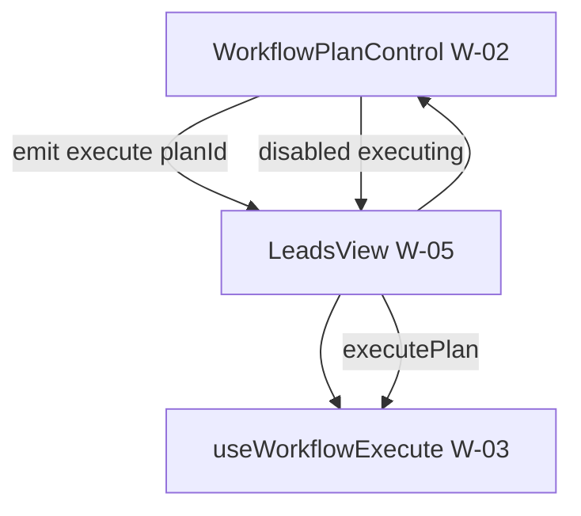

# US-W-05 线索页接入任务执行

> **用户故事**：[../18-需求-任务编排一键跑通.md](../18-需求-任务编排一键跑通.md) · US-W-05  
> **状态**：详设已写（编码门禁：本设计评审通过；**依赖 W-03 编码已完成**）  
> **范围**：`LeadsView.vue` 挂载 W-02 控件 + W-03 执行器；替换探索轮次控件；空态 / 互斥 / 横幅；**探索页不改**  
> **依赖**：US-W-02、US-W-03  
> **不做**：探索页（US-W-07）；编排 CRUD 弹框（W-04）；录入 / 邮件页 / 顶栏流水线逻辑  
> **文档位置**：`docs/design/`

---

## 0. 相对现网（线索页）

| 现网 | **本期（W-05）** |
|------|------------------|
| 工具栏右：`ExploreStartControl`（R1/R2/R3 + 开始探索） | **`WorkflowPlanControl`**（方案 + **执行**） |
| `useExploreStart` + `ftcs.explore.startRound` | **`useWorkflowExecute`** + `ftcs.workflow.lastSelectedPlanId` |
| 空态：「可在本页或探索页开始探索…」 | **「暂无线索 · 选择方案并执行」** |
| 评分 / 起草单步按钮 | **保留**；与方案执行 **互斥 disabled** |

| 页面 | v1 |
|------|-----|
| **线索页** | ✅ 本故事 |
| **探索页** | ❌ 仍 `ExploreStartControl`（US-W-07） |

---

## 1. 与 W-02 / W-03 的分工



| 模块 | 职责 |
|------|------|
| **W-02** | 下拉 + 执行按钮 UI + 方案记忆 |
| **W-03** | `executePlan` / Preflight / 串 IPC / wait done |
| **W-05** | 组装二者 + 业务 computed + 移除旧探索控件 |

---

## 2. 已确认选型

| 项 | 决定 |
|----|------|
| **Q1 替换范围** | **仅** `LeadsView.vue` 工具栏 `ExploreStartControl` → `WorkflowPlanControl` |
| **Q2 移除依赖** | 删除 `useExploreStart` import 及 `exploreRound` / `onStartExplore` / 相关 computed |
| **Q3 执行绑定** | `@execute="onWorkflowExecute"` → `executePlan(planId)` |
| **Q4 executing** | `:executing="isWorkflowRunning"` ← `useWorkflowExecute().running` |
| **Q5 disabled** | `:disabled="!canRunWorkflow"` + `:disabled-reason="workflowDisabledReason"` |
| **Q6 单步按钮** | 「评分去重」「批量起草」**保留**；`canScore` / `canBatchDraft` 增加 **`!isWorkflowRunning`** |
| **Q7 横幅** | `actionMessage` 由执行器 `onMessage` 与单步按钮 **共用**；失败格式见 W-03 §4.4 |
| **Q8 刷新** | 执行器 `refreshLeads: refreshLeads`；保留现有 `watch(agentStatus)` 刷新逻辑 |
| **Q9 副标题** | `stats.total === 0` → **`暂无线索 · 选择方案并执行`**；有数据时逻辑 **不变** |
| **Q10 流水线** | **不修改** `pipeline-steps.ts` / `derivePipelineSteps` |
| **Q11 探索页** | **零改动** |
| **Q12 产品切换** | 切换 `activeProductId` 时若 `running` → **不**自动 cancel（与现网切页一致）；可选增强：切产品时 disable 执行（v1 **不**做，与现网 generating 行为一致） |
| **Q13 W-04** | v1 下拉 **无** CRUD 入口；`menu` slot 留空 |

---

## 3. `LeadsView.vue` 改动说明

### 3.1 Script 引入

```typescript
import WorkflowPlanControl from '../components/workflow/WorkflowPlanControl.vue'
import { useWorkflowExecute } from '../composables/useWorkflowExecute'

// 删除：
// import ExploreStartControl from '...'
// import { useExploreStart } from '...'
```

### 3.2 执行器实例

```typescript
const {
  running: isWorkflowRunning,
  executePlan,
} = useWorkflowExecute({
  onMessage: (message) => {
    actionMessage.value = message
  },
  refreshLeads,
})
```

### 3.3 互斥 computed

```typescript
const canRunWorkflow = computed(() => {
  return (
    !!activeProductId.value &&
    !isWorkflowRunning.value &&
    !isScoring.value &&
    !isDrafting.value &&
    !generating.value
  )
})

const workflowDisabledReason = computed(() => {
  if (!activeProductId.value) return '请先在侧栏选择产品'
  if (isWorkflowRunning.value) return '方案执行中'
  if (generating.value || isScoring.value || isDrafting.value) {
    return '已有任务在运行'
  }
  return ''
})
```

更新 **`canScore` / `canBatchDraft`**：

```typescript
const canScore = computed(() => {
  return (
    !!activeProductId.value &&
    !isScoring.value &&
    !isDrafting.value &&
    !isWorkflowRunning.value &&
    !generating.value &&
    stats.value.raw > 0
  )
})

const canBatchDraft = computed(() => {
  return (
    !!activeProductId.value &&
    !isScoring.value &&
    !isDrafting.value &&
    !isWorkflowRunning.value &&
    !generating.value &&
    pendingHighIds.value.length > 0
  )
})
```

### 3.4 执行回调

```typescript
async function onWorkflowExecute(planId: string): Promise<void> {
  actionMessage.value = ''
  const result = await executePlan(planId)
  if (!result.ok && result.message) {
    actionMessage.value = result.message
  }
}
```

Preflight 失败 / 步内失败 / 中止：消息已在 `executePlan` 内通过 `onMessage` 或返回值写入。

### 3.5 模板替换

**删除：**

```vue
<ExploreStartControl
  compact
  :round="exploreRound"
  ...
/>
```

**改为：**

```vue
<WorkflowPlanControl
  compact
  :disabled="!canRunWorkflow"
  :disabled-reason="workflowDisabledReason"
  :executing="isWorkflowRunning"
  @execute="onWorkflowExecute"
/>
```

（v1 不用 `v-model:selected-plan-id`；W-04 后可加 `ref` 调 `reloadPlans`。）

### 3.6 副标题

```typescript
const subtitle = computed(() => {
  if (!activeProductId.value) return '请先在侧栏选择产品'
  const s = stats.value
  if (s.total === 0) return '暂无线索 · 选择方案并执行'
  // ... 现网有数据分支不变
})
```

---

## 4. 工具栏布局（变更后）

```
[ 导出 CSV ] [ 批量起草 ] [ 评分去重 ] [ 标准获客 ▼ | 执行 ]
```

- 顺序 **保持** 现网（探索控件仍在最右，只是换成方案控件）  
- `WorkflowPlanControl` 使用 W-02 **compact** 样式  

---

## 5. 与 Agent / 流水线交互

| 事件 | 行为 |
|------|------|
| 方案执行中 | `generating === true`（Agent running）；`isWorkflowRunning === true` |
| 某步 done | 执行器 `refreshPipelineArtifacts`；左侧流水线 **磁盘判定** 更新 |
| 用户中止 | `abortProfile` → 执行器停链；`actionMessage` 可显示「已中止」 |
| 切到其他页面再回 | 与现网 Agent 任务一致；执行 **不**中断 |

**不新增** 线索页专用进度条或步骤指示器。

---

## 6. 探索页（明确不改）

`ExploreView.vue`：

- 仍 `ExploreStartControl` + `useExploreStart`  
- 仍 `ftcs.explore.startRound`  
- **无** `WorkflowPlanControl`  

US-W-07 再统一。

---

## 7. 文件清单

| 文件 | 动作 |
|------|------|
| `src/views/LeadsView.vue` | **修改**（接线 + 文案 + 互斥） |
| `docs/18-需求-任务编排一键跑通.md` | W-05 状态 |
| `docs/04-实施计划.md` | 进度 |
| `docs/testdata/`（可选） | 补一条「标准获客四步」手工用例 |

**依赖 W-03 新增文件**（见 [US-W-03](US-W-03-顺序执行器.md) §7），本故事 **不重复实现**。

---

## 8. 验收对照

### 8.1 线索页（Must）

| # | 步骤 | 期望 |
|---|------|------|
| L1 | 打开线索页 | 见方案下拉，默认「标准获客」；**无** R1/R2/R3 轮次下拉 |
| L2 | 无线索空态 | 副标题「暂无线索 · 选择方案并执行」 |
| L3 | 选「标准获客」→ 执行 | 按 W-03 串 R1→R2→评分→起草（环境 / 数据满足时） |
| L4 | 执行中 | 「执行中…」；评分 / 起草 / 再次执行 disabled |
| L5 | 执行完 / 失败后 | 按钮恢复；`actionMessage` 有结果或失败说明 |
| L6 | 重启应用 | 下拉仍记住上次方案（W-02 记忆） |
| L7 | 单步「评分去重」 | 仍可用（非执行中时） |
| L8 | 单步「批量起草」 | 仍可用 |

### 8.2 探索页（Must · 回归）

| # | 期望 |
|---|------|
| E1 | 仍为 R1/R2/R3 +「开始探索 / 开始 R3」 |
| E2 | **无** 方案下拉 |

### 8.3 流水线 / Agent（Should）

| # | 期望 |
|---|------|
| P1 | 执行过程中流水线 **完成态** 仍看磁盘产物 |
| P2 | 右侧 Agent 时间线 **分步** 刷新（非编排专用 UI） |
| P3 | 第 2 步完成后左侧探索 / 线索计数 ** eventual 一致**（刷新后） |

---

## 9. 实现顺序

1. 完成 **US-W-03** 编码与单测  
2. 按 §3 改 `LeadsView.vue`  
3. 手工 L1–L8 + E1–E2  
4. 与 W-04 并行或稍后（CRUD 不影响本故事验收）

**建议提交**：W-03 可单独 commit；W-05 单独 commit；或 **W-03+W-05 同一 PR** 以便 L3 手工验收。

---

## 10. 风险

| 风险 | 缓解 |
|------|------|
| 移除 `useExploreStart` 后线索页无法单跑 R1 | 用户用 **自建单步方案**（W-04）或 **探索页** 调试 R1/R2/R3 |
| 执行器与单步按钮重复逻辑 | W-03 抽取步启动；单步按钮 **暂保留** 原实现（小范围重复可接受） |
| 四步太长用户焦虑 | 与需求 O1 一致：文案 + Agent 时间线；不做进度条 |

---

## 11. 与 W-04 的后续衔接

W-04 上线后在 `LeadsView` 增加：

```vue
<WorkflowPlanControl ref="workflowPlanRef" ...>
  <template #menu><!-- 新建 / 编辑 / 删除 --></template>
</WorkflowPlanControl>
```

保存 / 删除后调用 `workflowPlanRef.reloadPlans()`；**不在 W-05 预埋 UI**。
