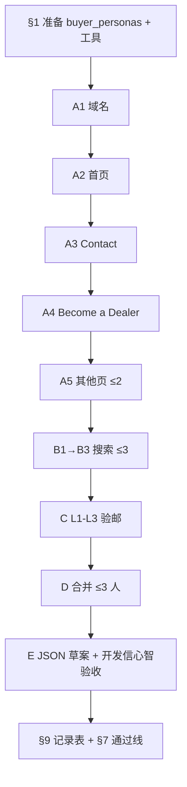

# US-C-00 预研：单条线索试跑 — Decodeck USA

> **线索 ID**：`lead_20260906_0005`  
> **用途**：US-C-00 Spike **v1 试跑**（**已暂停**）；结论见 [§11 v1 复盘](#11-v1-复盘与-v2-指向)。  
> **v2 可执行方案**：[联系人Enrichment-spike-v2-lead_20260906_0005.md](./联系人Enrichment-spike-v2-lead_20260906_0005.md) ← **请从此文档执行**  
> **v2 总纲**：[联系人Enrichment-spike-v2-方案修订.md](./联系人Enrichment-spike-v2-方案修订.md)  
> **执行人**：按 v2 修订文档操作；本文 §9 记录表保留 v1 历史。  
> **关联需求**：[20-需求-联系人Enrichment.md](../20-需求-联系人Enrichment.md)

---

## 0. 线索摘要（输入）

| 字段 | 值 |
|------|-----|
| 公司 | Decodeck USA |
| 官网 | https://www.decodeckusa.com |
| 域名 | `decodeckusa.com` |
| 国家 | US（Jacksonville, FL） |
| 档位 | high（84 分） |
| 现网 contacts | 仅表单 `https://www.decodeckusa.com/contact` |
| reachability | 60（偏低，缺可直接发信的邮箱） |
| 业务画像 | WPC 地板/墙板/藤架/围栏；**Become a Dealer** 分销计划 |
| 匹配理由 | 北美分销/承包商网络目标客户，与绿森产品线高度重叠 |

**本线索预研目标**

1. 能否在 **官网域内** 找到 ≥1 个可见邮箱并通过 L3？  
2. 能否在 **公开搜索摘要** 中找到 ≥1 名与 buyer_personas 匹配的 **具名** 候选人（可无邮箱）？  
3. 全流程是否 **未** 登录社媒、未 chrome 打开社媒 URL？

---

## 1. 开工前准备（约 5 分钟）

### 1.1 确认产品画像 `buyer_personas`

打开工作区 `data/products/{你的产品_id}/profile.json`，确认或临时记下以下角色（与绿森出口 WPC 场景一致）：

| role | 检索用词（英） | 为何匹配本线索 |
|------|----------------|----------------|
| `procurement_manager` | procurement, purchasing, sourcing | 进口/采购 WPC 原料或成品 |
| `dealer_program_manager` | dealer, distributor, partnership | 站点有 **Become a Dealer** |
| `sales_director` | sales director, business development | B2B 承包商/分销商拓展 |
| `operations_manager` | operations, logistics | 全美供材与项目交付 |

> Spike 阶段若 profile 尚未填 buyer_personas，可 **暂用上表** 作为 Agent 将来 Skill 的输入替身。

### 1.2 工具与环境

| 工具 | 用途 |
|------|------|
| **chrome-devtools MCP**（或浏览器 + 人工 snapshot） | 仅打开 `decodeckusa.com` 域内页面 |
| **search-api / Tavily**（或 FTCS 桌面探索同款搜索） | 公开搜索摘要 |
| **Node 或 `nslookup`** | L3 MX 查询（contact-enrich MCP 未建前的替身） |
| 本文 **§9 记录表** | 填每步产出 |

### 1.3 合规红线（每步自检）

- [ ] 未登录 LinkedIn / Facebook / Instagram  
- [ ] chrome **未** navigate 到 `linkedin.com`、`facebook.com`、`instagram.com` 等  
- [ ] **未** 用 `{first}.{last}@decodeckusa.com` 等 pattern 猜邮箱  
- [ ] 写入候选人的 `sources[]` 非空（官网 URL 或搜索结果的 title/url/snippet）

### 1.4 配额（对齐需求 C11）

| 资源 | 上限 |
|------|------|
| chrome 打开页数 | **≤ 5** |
| search 查询次数 | **≤ 3** |
| 最终写入候选人数 | **≤ 3** |

---

## 2. 阶段 A — 域名与官网结构（chrome，≤5 页）

### Step A1 · 解析域名（L2 基准）

```
官网 URL : https://www.decodeckusa.com
eTLD+1   : decodeckusa.com
```

后续所有邮箱验邮的 **expected_domain** 均为 `decodeckusa.com`（子域如 `mail.decodeckusa.com` 的 MX 仍算通过，但 L2 要求邮箱 `@` 右侧与官网域一致或为其子域 — MVP 简化为 **完全等于 decodeckusa.com**）。

**记录**：A1 完成 → §9 行「域名」

---

### Step A2 · 首页 snapshot（第 1 页）

**操作**

1. `navigate_page` → `https://www.decodeckusa.com`
2. `take_snapshot`（或等价可读 DOM）
3. 在 snapshot 中查找并 **列出**（不点击外链）：
   - 导航链接：Contact、About、Team、Dealer、Become a Dealer、Privacy、Imprint 等
   - 页脚：邮箱、电话、地址
   - `mailto:` 链接

**预期线索（供核对，执行时以 snapshot 为准）**

- 主导航可能有：**Contact Us**、**Apply to Become a Dealer**
- 首页未必有个人姓名

**记录**：找到的 **站内链接 URL 清单** → §9「A2 首页链接」

---

### Step A3 · Contact 页（第 2 页，高优先级）

**操作**

1. `navigate_page` → `https://www.decodeckusa.com/contact`
2. snapshot + 可选 `evaluate_script` 抽取：
   ```javascript
   () => {
     const mailtos = [...document.querySelectorAll('a[href^="mailto:"]')].map(a => a.href);
     const text = document.body.innerText;
     const emails = text.match(/[a-zA-Z0-9._%+-]+@[a-zA-Z0-9.-]+\.[a-zA-Z]{2,}/g) || [];
     return { mailtos, emails: [...new Set(emails)] };
   }
   ```

**已知公开信息（预检用，须在你本地 snapshot 中再次确认）**

- 页面可见：`info@decodeckusa.com`
- 电话：`520 664 8695`
- 地址：Jacksonville, FL
- **未见** 具名联系人

**记录**

- 邮箱列表（原文，不猜测）→ §9「A3 邮箱」
- 是否有人名/职位 → §9「A3 人名」

---

### Step A4 · Become a Dealer 页（第 3 页）

**操作**

1. `navigate_page` → `https://www.decodeckusa.com/become-a-dealer`（若 A2 链接路径不同，用 A2 发现的 URL）
2. 同样抽取 mailto / 可见邮箱 / 人名 / 职位

**目的**：该页对应 **dealer_program_manager** 角色；表单本身不算联系人，但页内可能有负责邮箱。

**记录** → §9「A4」

---

### Step A5 · 补扫剩余站内页（第 4～5 页，按需）

按 A2 链接优先级，在配额内任选 **最多 2 页**，建议顺序：

1. `/about` 或 `/about-us`（若存在）
2. `/team`（若存在）
3. `/privacy-policy` 或 footer 中的 Privacy（有时含公司联系邮箱）
4. 站点 map / sitemap（若导航有）

**若 `/about` 404**：在 §9 注明「无 About/Team 页」，**不要** 用配额去扫站外链接。

**记录** → §9「A5 其他页」

---

### 阶段 A 小结（自评）

| 检查项 | 是/否 |
|--------|-------|
| 找到 ≥1 个官网明文邮箱 | |
| 找到 ≥1 个具名 + 职位（官网） | |
| chrome 页数 ≤5 | |
| 未打开社媒域 | |

---

## 3. 阶段 B — 公开搜索（search，≤3 次）

> **只读** Tavily/搜索返回的 title、url、snippet；**不要** chrome 打开结果里的 LinkedIn 个人页。

### Step B1 · 采购 / 分销角色（第 1 次搜索）

**Query 建议**

```
"Decodeck USA" (procurement OR purchasing OR sourcing OR "dealer program" OR distributor) Jacksonville
```

**解析规则**

从每条结果的 **snippet/title** 提取：

- 人名（First Last）
- 职位关键词
- 个人 LinkedIn URL（**仅作 source 记录，不打开**）

**角色匹配**：snippet 含 procurement/purchasing/sourcing → `procurement_manager`；含 dealer/distributor/partnership → `dealer_program_manager`

**记录** → §9「B1 候选人」

---

### Step B2 · 管理层（第 2 次搜索）

**Query 建议**

```
"Decodeck USA" (CEO OR founder OR owner OR "sales director" OR "business development")
```

**记录** → §9「B2 候选人」

---

### Step B3 · LinkedIn 摘要限定（第 3 次搜索，可选）

若 B1+B2 仍 **0 人名**，再用：

```
Decodeck USA site:linkedin.com/in
```

或 search-api 的 `include_domains: ["linkedin.com"]`（若桌面搜索支持）。

**记录** → §9「B3 候选人」

---

### 阶段 B 小结

| 检查项 | 是/否 |
|--------|-------|
| ≥1 个具名候选人（来自搜索摘要） | |
| 每个候选有 match_reason | |
| 每个候选 sources 含 search 类型 | |
| 搜索次数 ≤3 | |

---

## 4. 阶段 C — 验邮（L1～L3，对阶段 A 发现的每个邮箱）

contact-enrich MCP 尚未实现时，用手工等价步骤。

### Step C1 · L1 语法

对每个邮箱 `local@decodeckusa.com`：

- 含且仅含一个 `@`
- local / domain 非空
- domain 含 `.`

**记录** → §9「C 验邮表」

---

### Step C2 · L2 域一致

```
email 域 === decodeckusa.com  → domain_match: ok
否则                          → domain_mismatch
```

> `info@decodeckusa.com` 应为 **ok**。

---

### Step C3 · L3 MX

**PowerShell（Windows）**

```powershell
nslookup -type=MX decodeckusa.com
```

**或 Node（在工作区根目录）**

```javascript
// node -e "require('dns').promises.resolveMx('decodeckusa.com').then(r=>console.log(r)).catch(e=>console.error(e))"
```

- 有 MX 记录 → `mx: ok`，综合状态 **`mx_ok`**
- 无 MX / 查询失败 → `mx_fail`

**记录** → §9「C 验邮表」

---

## 5. 阶段 D — 合并候选与 match_reason（≤3 人）

按需求 **禁止无 source 写入**。合并规则：

| 优先级 | 来源 | 写入 people 草案 |
|--------|------|------------------|
| 1 | 官网具名 + 邮箱 + mx_ok | 完整 person |
| 2 | 搜索具名 + 职位，无邮箱 | person（email 空，email_status=unknown） |
| 3 | 官网仅角色邮箱（如 info@） | **不当作 person**；合并进 `contacts` 说明即可 |

### 角色匹配示例（match_reason 写法）

```
职位/摘要含 "dealer" 且公司有 Become a Dealer 计划 → role_match: dealer_program_manager
摘要含 "procurement" / "purchasing" → role_match: procurement_manager
摘要含 "sales" + "director" → role_match: sales_director
```

### 本线索 **预期最可能结果**（假设，须实测替换）

| 类型 | 预期 |
|------|------|
| 公司邮箱 | `info@decodeckusa.com` →  likely **mx_ok** |
| 具名个人 | 官网可能 **无**；搜索 **可能 0～2 人** |
| 开发信收件人 | 若仅 info@，MVP 仍算「有 mx_ok 邮箱」但 **非个人**；需在 Spike 结论中标注「角色邮箱 vs 个人邮箱」比例 |

---

## 6. 阶段 E — 模拟写回（不落盘，仅 JSON 草案）

在本地草稿区粘贴以下结构，填实测值：

```json
{
  "lead_id": "lead_20260906_0005",
  "people": [
    {
      "id": "person_spike_001",
      "name": "<实测姓名或留空>",
      "title": "<实测职位>",
      "role_match": "<procurement_manager|dealer_program_manager|...>",
      "match_reason": "<一句话，引用 source>",
      "email": "<仅明文可见>",
      "email_status": "<syntax_ok|mx_ok|unknown|...>",
      "email_checks": {
        "syntax": "ok|fail",
        "domain_match": "ok|mismatch",
        "mx": "ok|fail|skipped"
      },
      "sources": [
        { "type": "website", "url": "https://www.decodeckusa.com/contact" },
        { "type": "search", "url": "<结果 URL>", "snippet": "<摘录>" }
      ],
      "provider": "builtin",
      "enriched_at": "<ISO8601>"
    }
  ],
  "contacts_patch": [
    {
      "type": "email",
      "value": "info@decodeckusa.com",
      "confidence": "high",
      "note": "Contact 页明文；Spike 验邮 mx_ok"
    }
  ]
}
```

**开发信模拟（心智验收）**

- 若有 `people[].email_status === 'mx_ok'` 且含 first name → 称呼 `Dear {FirstName}`
- 若仅 `info@` → 仍用 `Dear Decodeck USA Team` 或 `Dear Team`（记录为 Spike 发现：**reachability 可提升但非个人化**）

---

## 7. 本线索单条通过线（Spike 子标准）

在 US-C-00 总样本 10 条之外，本条单独验收：

| # | 标准 | 通过 |
|---|------|------|
| E1 | 阶段 A 完成，且 chrome ≤5 页 | ☐ |
| E2 | 阶段 B 完成，且 search ≤3 次 | ☐ |
| E3 | 对 **每个** 发现的邮箱完成 L1～L3 记录 | ☐ |
| E4 | ≥1 条 `people` 或明确记录「0 人」的原因 | ☐ |
| E5 | 若存在 `info@decodeckusa.com`，验邮结果为 **mx_ok** 或记录失败原因 | ☐ |
| E6 | 合规自检 §1.3 全部通过 | ☐ |

**本条对 MVP 设计的启示（完成后填写）**

- 无 Team 页时，搜索分支权重是否应提高？  
- 角色邮箱（info@）是否计入「30% mx_ok」统计？（建议在总 Spike 报告里 **分列**：个人 mx_ok vs 公司 mx_ok）  
- Become a Dealer 表单是否需要在 UI 提示「仅表单、建议走经销商话术 + 表单链接」？

---

## 8. 建议执行顺序（一览）



---

## 9. 执行记录表（请边做边填）

**执行日期**：__________  
**执行人**：__________  
**产品 profile_id**：__________

### 9.1 阶段 A — 官网

| 步骤 | 访问 URL | 发现邮箱 | 发现人名/职位 | 备注 |
|------|----------|----------|---------------|------|
| A2 首页 | | | | |
| A3 Contact | | | | |
| A4 Dealer | | | | |
| A5 页1 | | | | |
| A5 页2 | | | | |

**chrome 总页数**：____ / 5

### 9.2 阶段 B — 搜索

| 次数 | Query | 结果条数 | 提取候选人（姓名 / 职位 / URL） |
|------|-------|----------|-----------------------------------|
| B1 | | | |
| B2 | | | |
| B3 | | | |

### 9.3 阶段 C — 验邮

| 邮箱 | L1 | L2 domain | L3 MX | 最终 email_status |
|------|-----|-----------|-------|-------------------|
| | | | | |

### 9.4 阶段 D/E — 结论

| 指标 | 结果 |
|------|------|
| people 候选人数 | |
| mx_ok 邮箱数（个人） | |
| mx_ok 邮箱数（公司角色，如 info@） | |
| 最佳开发信收件人 | |
| 建议称呼 | |
| 合规问题 | 无 / 有：____ |

### 9.5 耗时与摩擦

| 项 | 分钟 |
|----|------|
| 阶段 A | |
| 阶段 B | |
| 阶段 C | |
| 合计 | |

**Agent 易错点（本次观察）**：

- 
- 

---

## 10. 完成后（v1 — 已 superseded）

~~按 v1 继续 9 条~~ → 见 v2 方案修订文档。

---

## 11. v1 复盘与 v2 指向

| 阶段 | v1 结果 |
|------|---------|
| B1 采购+Jacksonville | 0 人；招聘/政府噪声 |
| B2 管理层泛搜 | 0 人；Deckers/DecoDeck 错司 |
| B3 裸搜公司名 | 0 人；全错配 |
| 官网 | info@；无 Team；About 直链 404 |
| people[] | **0** |
| 分型（v2） | **Type-C**（S2 + B2 + Dealer 页） |

**v1 方案问题摘要**：成功标准未分层、搜索无采纳门槛、Query 易错配、样本未分型。  
**下一步**：按 [联系人Enrichment-spike-v2-方案修订.md](./联系人Enrichment-spike-v2-方案修订.md) **重跑本条**（Phase 0 → 修订 A → Type-C 仅 1 次 company 搜索）。

---

## 变更记录

| 日期 | 说明 |
|------|------|
| 2026-09-08 | 初稿 |
| 2026-09-08 | v1 暂停；追加 §11 复盘；指向 v2 方案 |
