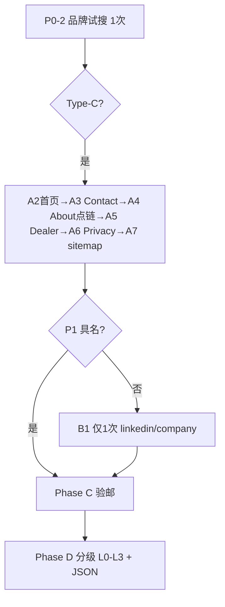

# US-C-00 预研 v2：Decodeck USA（可执行方案）

> **线索 ID**：`lead_20260906_0005`  
> **👋 先看简明版**：[联系人Enrichment-spike-简明-Decodeck.md](./联系人Enrichment-spike-简明-Decodeck.md)（4 步执行 + 1 张结果表）  
> **本文**：详细参数版（curl / MCP / 分型 / 附录），不必通读  
> **方案版本**：v2（[总纲](./联系人Enrichment-spike-v2-方案修订.md)）

---

## 0. 线索输入（冻结）

```json
{
  "id": "lead_20260906_0005",
  "company": {
    "name": "Decodeck USA",
    "website": "https://www.decodeckusa.com",
    "country": "US",
    "description": "美国佛罗里达州 Jacksonville 的 WPC 复合产品供应商…设 Become a Dealer 分销计划。"
  },
  "tier": "high",
  "score": 84,
  "reachability": 60,
  "dedupe_key": "decodeckusa.com",
  "contacts": [{ "type": "form", "value": "https://www.decodeckusa.com/contact" }]
}
```

| 常量 | 值 |
|------|-----|
| 公司全名 | **Decodeck USA** |
| 官网域 | **decodeckusa.com** |
| 地址（已知） | 6000 Powers Ave, Jacksonville, FL |
| 业务入口 | Become a Dealer · Contact 表单 |
| 买家角色（profile 替身） | `dealer_program_manager` · `sales_director` · `procurement_manager` |

**本条 v2 要验证什么**

1. Type-C 流程是否 **可执行、可记录**（不依赖 v1 那种泛搜）  
2. 官网深扫能否稳定产出 **P2**（info@）并验邮 **mx_ok**  
3. Type-C **仅 1 次** company 搜索 + 采纳门槛能否 **零错配**  
4. 最终能否 honest 分级为 **L1**（reachability 提升，非「找到联系人」）

---

## 1. 合规与工具（开工前 2 分钟）

### 1.1 红线

- [ ] 不登录 LinkedIn / Facebook / Instagram  
- [ ] chrome **仅** `decodeckusa.com` 域内页面  
- [ ] **不** chrome 打开 `linkedin.com`、`facebook.com` 等  
- [ ] **不** 猜测 `{first}.{last}@decodeckusa.com`  

### 1.2 工具

| 工具 | 用途 |
|------|------|
| chrome-devtools MCP / 浏览器 | Phase A |
| Tavily **advanced**（或 search-api + 手工 advanced） | Phase 0 探测 + Phase B |
| `nslookup -type=MX decodeckusa.com` | Phase C |

### 1.3 配额（本条 Type-C）

| 资源 | 上限 |
|------|------|
| 品牌混淆试搜（Phase 0） | 1 次（**不计** Phase B 配额） |
| Phase B 搜索 | **1 次** |
| chrome 页数 | **≤ 6**（含 sitemap 可选第 7） |

---

## 2. Phase 0 — 线索分型（≈5 分钟）

### Step P0-1 · 四维预判（执行前填写）

| 维度 | 预判 | 依据 |
|------|------|------|
| **S** 站点 | **S2** | v1：Contact 有邮箱，无 Team |
| **B** 品牌 | **B2** | Decodeck ≈ DecoDeck / Deckers |
| **G** 地理 | **有** | Jacksonville, FL + 6000 Powers Ave |
| **R** 入口 | **有** | Become a Dealer |

**预判 Type**：**Type-C** · 搜索配额 **1 次**

> 最终以 P0-2 试搜结果为准；若错配 <7/10 可上调为 Type-B（本条预期仍为 C）。

### Step P0-2 · 品牌混淆试搜（必做）

#### 调用 A — Tavily HTTP（推荐，`search_depth: advanced`）

```http
POST https://api.tavily.com/search
Content-Type: application/json
```

```json
{
  "api_key": "<你的 TAVILY_API_KEY>",
  "query": "\"Decodeck USA\"",
  "search_depth": "advanced",
  "max_results": 10,
  "include_answer": false,
  "include_raw_content": false
}
```

#### 调用 B — FTCS search-api MCP（现网仅 basic，作对照）

工具名：`search_web`

```json
{
  "query": "\"Decodeck USA\"",
  "language": "en",
  "num_results": 10
}
```

> 现网 MCP **不传** `search_depth`，固定 basic。P0 建议用 **调用 A**；若只能用 MCP，在 §8.6 记「basic 对照结果」。

#### 调用 C — curl（Windows PowerShell 一行）

```powershell
curl.exe -s -X POST "https://api.tavily.com/search" -H "Content-Type: application/json" -d "{\"api_key\":\"<TAVILY_API_KEY>\",\"query\":\"\\\"Decodeck USA\\\"\",\"search_depth\":\"advanced\",\"max_results\":10,\"include_answer\":false,\"include_raw_content\":false}"
```

**本步 query 字符串（裸文本）**

```
"Decodeck USA"
```

**计数规则**

- **错配**：title/snippet **不含** `Decodeck USA` 且主体为其他公司/产品（DecoDeck、Deckers、DECO Australia、游戏 Deco Deck 等）  
- **命中**：含 `Decodeck USA` 或 URL 为 `decodeckusa.com`

**判定**

| 错配条数 / 10 | 品牌 | Type |
|---------------|------|------|
| ≥ 7 | B2 | **Type-C**，Phase B 仅 1 次 |
| 4～6 | 边界 | Type-C，记录「边界品牌」 |
| ≤ 3 | B1 | 升为 Type-B（本条 ** unlikely**） |

**填入 §8.1**：错配 __/10 · 最终 Type __ · 搜索配额 __

---

## 3. Phase A — 官网深扫（≤6 页）

### Step A1 · 域名

```
eTLD+1     : decodeckusa.com
expected_domain（验邮 L2）: decodeckusa.com
```

### Step A2 · 首页（第 1 页）

```
URL: https://www.decodeckusa.com
```

**操作**

1. `navigate_page` → 上 URL  
2. `take_snapshot`  
3. 列出 **全部站内链接**（nav + footer），尤其：

| 关注链接 | 用途 |
|----------|------|
| Contact | A3 |
| About | A4（**从 snapshot 取 href，禁止猜路径**） |
| Become a Dealer | A5 |
| Privacy / Terms | A6 |
| Gallery / Products | 仅当 nav 无 About 且需凑页数 |

**v1 已知**：nav 显示 About，但 `/about`、`/about-us` 直链 404 → A4 必须 **点击 nav 链接** 看真实 URL。

**记录**：站内链接清单 → §8.2

### Step A3 · Contact（第 2 页）

```
URL: https://www.decodeckusa.com/contact
```

**抽取脚本（可选 evaluate_script）**

```javascript
() => {
  const mailtos = [...document.querySelectorAll('a[href^="mailto:"]')].map(a => a.href.replace(/^mailto:/i, '').split('?')[0]);
  const text = document.body.innerText;
  const emails = text.match(/[a-zA-Z0-9._%+-]+@[a-zA-Z0-9.-]+\.[a-zA-Z]{2,}/g) || [];
  return { mailtos, emails: [...new Set([...mailtos, ...emails])] };
}
```

**v1 预期（须本地再确认）**

- 邮箱：`info@decodeckusa.com`  
- 电话：`520 664 8695`  
- 地址：Jacksonville, FL（完整街道以 snapshot 为准）  
- 人名：**无** → 非 P1  

**产出级别**：若有 info@ → **P2**（角色邮箱，**不** 写入 people[]）

### Step A4 · About（第 3 页，条件执行）

- **若 A2 有 About 链接**：用 **该 href** navigate（不要猜 `/about`）  
- **若 404 或空页**：记「nav 有 About，链无效或无人名」→ 跳过  
- **若有人名+职位** → **P1** → 可 **跳过 Phase B**

### Step A5 · Become a Dealer（第 4 页）

```
URL: https://www.decodeckusa.com/become-a-dealer
```

- 抽 mailto / 可见邮箱 / 人名  
- 对应 buyer 角色：`dealer_program_manager`  
- 通常仅表单 → 记「有分销入口，无负责人员名」

### Step A6 · Privacy / Terms（第 5 页，若存在）

从 A2 footer 取 Privacy Policy / Terms URL。  
常见：`privacy@`、`legal@`、`info@`（去重）。

### Step A7 · Sitemap（第 6 页，可选）

```
URL: https://www.decodeckusa.com/sitemap.xml
```

- 查找 `/team`、`/about`、`/careers`、`/leadership` 等路径  
- 若有且未访问 → 在配额内补 1 页  

### Phase A 小结

| 检查 | 填 §8.2 |
|------|---------|
| chrome 页数 | __ / 6 |
| P1 具名 | 有 / **无** |
| P2 角色邮箱 | 有（__@decodeckusa.com）/ 无 |
| P3 仅表单 | 是 / 否 |
| 是否进入 Phase B | P1 无 → **是** |

---

## 4. Phase B — 门禁搜索（Type-C：仅 1 次）

### 前置

- [ ] Phase A **无 P1**  
- [ ] Type-C，配额 **1/1**

### Step B1 · LinkedIn 公司页确认（唯一一次搜索）

#### 调用 A — Tavily HTTP（推荐）

```http
POST https://api.tavily.com/search
Content-Type: application/json
```

```json
{
  "api_key": "<你的 TAVILY_API_KEY>",
  "query": "\"Decodeck USA\" \"decodeckusa.com\"",
  "search_depth": "advanced",
  "max_results": 5,
  "include_answer": false,
  "include_raw_content": false,
  "include_domains": ["linkedin.com/company"]
}
```

#### 调用 B — FTCS search-api MCP

```json
{
  "query": "\"Decodeck USA\" \"decodeckusa.com\"",
  "language": "en",
  "num_results": 5,
  "include_domains": ["linkedin.com/company"]
}
```

#### 调用 C — curl

```powershell
curl.exe -s -X POST "https://api.tavily.com/search" -H "Content-Type: application/json" -d "{\"api_key\":\"<TAVILY_API_KEY>\",\"query\":\"\\\"Decodeck USA\\\" \\\"decodeckusa.com\\\"\",\"search_depth\":\"advanced\",\"max_results\":5,\"include_answer\":false,\"include_raw_content\":false,\"include_domains\":[\"linkedin.com/company\"]}"
```

**本步 query 字符串（裸文本）**

```
"Decodeck USA" "decodeckusa.com"
```

**include_domains**

```
linkedin.com/company
```

**解析目标**

| 目标 | 动作 |
|------|------|
| 找到 **Decodeck USA** 公司页 | 记录 URL、snippet 中的行业/地址是否一致 |
| snippet 出现 **员工姓名** | 走 [§4.1 采纳门槛](#41-采纳门槛) |
| 无公司页 / 无员工 | 记「搜索 0 人」，**不是失败** |

**禁止**：本条 Type-C **不再做** 第 2、3 次搜索。以下 query **勿执行**（v1 已证伪）：

```
"Decodeck USA" (procurement OR purchasing OR sourcing OR "dealer program" OR distributor) Jacksonville
"Decodeck USA" (CEO OR founder OR owner OR "sales director" OR "business development")
Decodeck USA
"Decodeck USA" site:linkedin.com/in
"Decodeck USA" "6000 Powers Ave" site:linkedin.com/in
```

### 4.1 采纳门槛

每条候选人 **必须全部满足** 才写入 `people[]`：

1. title 或 snippet 含 **`Decodeck USA`** 或邮箱 `@decodeckusa.com`  
2. snippet **不含** DecoDeck®、Deckers、DECO Australia、Deco Deck 游戏等错司 marker  
3. 姓名 **First + Last**（拒绝 `Dave S.` 式单名）  
4. `sources`: `{ type: "search", url, snippet }`  
5. 邮箱：仅 snippet **明文**；否则 `email_status: unknown`

**错配条目**：记录条数但 **不采纳** → 验证 v2「Type-C 错配率 = 0」

**填入 §8.3**

---

## 5. Phase C — 验邮

对 Phase A 发现的 **每个** 明文邮箱执行（预期至少 `info@decodeckusa.com`）。

### Step C1 · L1 语法

- 一个 `@`，local/domain 非空  

### Step C2 · L2 域一致

```
@decodeckusa.com → domain_match: ok
其他域           → domain_mismatch（展示但不用作默认收件人）
```

### Step C3 · L3 MX

```powershell
nslookup -type=MX decodeckusa.com
```

| MX 结果 | email_status |
|---------|--------------|
| 有记录 | **mx_ok** |
| 无/失败 | mx_fail |

**填入 §8.4**

---

## 6. Phase D — 分级产出与 JSON 草案

### 6.1 分级规则（本条预期 **L1**）

| 等级 | 条件 | 本条预期 |
|------|------|----------|
| **L3** | ≥1 people + 个人 mx_ok |  unlikely |
| **L2** | ≥1 people，无邮箱 | unlikely |
| **L1** | 0 people，公司 mx_ok | **最可能** |
| **L0** | 仅表单 | 若 A 未发现邮箱 |

### 6.2 写回草案（填实测值）

```json
{
  "lead_id": "lead_20260906_0005",
  "spike_v2": {
    "type": "Type-C",
    "brand_collision_rate": "<P0-2 错配>/10",
    "enrichment_tier": "L1",
    "tags": ["brand-collision", "no-team-page", "company-email-only", "dealer-program"]
  },
  "people": [],
  "contacts_patch": [
    {
      "type": "email",
      "value": "info@decodeckusa.com",
      "confidence": "high",
      "note": "Contact 页明文；L1-L3 验邮结果: <mx_ok|mx_fail>"
    }
  ],
  "reachability_note": "原仅 form → 补公司邮箱；score_breakdown.reachability 应可提升",
  "outreach": {
    "best_recipient": "info@decodeckusa.com",
    "greeting": "Dear Decodeck USA Team",
    "angle": "Become a Dealer / 分销与 WPC 产品线合作（非个人采购经理话术）"
  }
}
```

> **产品含义**：UI 应展示「已补全联系渠道 · 公司邮箱」，**而非**「已找到联系人 Jane Doe」。

### 6.3 本条 v2 单条验收（E1–E6）

| # | 标准 | ☐ |
|---|------|---|
| E1 | Phase 0 完成，Type 与配额明确 | |
| E2 | Phase A ≤6 页，About 从 nav 点链 | |
| E3 | Phase B ≤1 次，Query 符合 Type-C 模板 | |
| E4 | 采纳候选错配 **0**（或未采纳任何错配） | |
| E5 | 每个明文邮箱 L1–L3 已记录 | |
| E6 | 合规红线 §1.1 全通过 | |
| E7 | `enrichment_tier` 已填 L0–L3 | |

---

## 7. 执行顺序一览



---

## 8. 执行记录表（边做边填）

**执行日期**：__________  
**执行人**：__________

### 8.1 Phase 0

| 项 | 结果 |
|----|------|
| 错配条数 / 10 | |
| 最终 B1/B2 | |
| 最终 Type | |
| Phase B 配额 | |

### 8.2 Phase A — 官网

| 步骤 | URL | 邮箱 | 人名/职位 | P1/P2/P3 |
|------|-----|------|-----------|----------|
| A2 首页 | | | | |
| A3 Contact | | | | |
| A4 About | | | | |
| A5 Dealer | | | | |
| A6 Privacy | | | | |
| A7 sitemap | | | | |

**chrome 页数**：____ / 6 · **进入 Phase B**：是 / 否

### 8.3 Phase B — 搜索（1/1）

**Query**：`"Decodeck USA" "decodeckusa.com"` · `include_domains: linkedin.com/company`

| # | title | url | 含公司全名? | 错配? | 采纳? | 姓名/职位 |
|---|-------|-----|-------------|-------|-------|-----------|
| 1 | | | | | | |
| 2 | | | | | | |

**采纳人数**：____ · **错配未采纳数**：____

### 8.4 Phase C — 验邮

| 邮箱 | L1 | L2 | L3 MX | email_status |
|------|-----|-----|-------|--------------|
| | | | | |

### 8.5 Phase D — 结论

| 项 | 结果 |
|----|------|
| enrichment_tier | L0 / L1 / L2 / L3 |
| people 数 | |
| 公司 mx_ok | |
| 个人 mx_ok | |
| reachability 变化 | 60 → 预估 __ |
| 开发信收件人 | |
| 称呼 | |
| 总耗时（分钟） | |
| 工程缺口观察 | search_depth advanced / 其他 |

### 8.6 对 MVP 的设计启示（本条）

- 
- 

---

## 9. 完成后

1. 将 **§8.5 摘要** 追加到 `docs/research/联系人Enrichment-spike.md`（#1/10，Type-C）  
2. 下一条选 **Type-A**（有 Team 页、B1 独特品牌）对比具名上限  
3. **勿** 用 v1 Query（procurement+Jacksonville、裸 CEO 搜）复跑本条

---

## 附录 A · 复制即用清单（Decodeck USA 全文）

### A.1 搜索（仅 2 次：P0 不计配额 + B1 计 1 次）

| 步骤 | query 全文 | include_domains | search_depth | max_results |
|------|------------|-----------------|--------------|-------------|
| **P0-2** | `"Decodeck USA"` | （不传） | advanced | 10 |
| **B1** | `"Decodeck USA" "decodeckusa.com"` | `["linkedin.com/company"]` | advanced | 5 |

### A.2 官网 chrome URL（按序打开）

| 步骤 | 完整 URL |
|------|----------|
| A2 | `https://www.decodeckusa.com` |
| A3 | `https://www.decodeckusa.com/contact` |
| A4 | 从 A2 snapshot 取 About 的 **真实 href**（勿用 `/about`） |
| A5 | `https://www.decodeckusa.com/become-a-dealer` |
| A6 | 从 A2 footer 取 Privacy/Terms 的 **真实 href** |
| A7 | `https://www.decodeckusa.com/sitemap.xml` |

### A.3 验邮

```powershell
nslookup -type=MX decodeckusa.com
```

待验邮箱（Phase A 预期）：

```
info@decodeckusa.com
```

L2 期望域：

```
decodeckusa.com
```

### A.4 开发信（L1 预期全文）

| 项 | 内容 |
|----|------|
| 收件人 | `info@decodeckusa.com` |
| 称呼 | `Dear Decodeck USA Team` |
| 角度 | Become a Dealer / WPC 分销与产品线合作 |

---

## 10. 相关文档

| 文档 | 关系 |
|------|------|
| [联系人Enrichment-spike-v2-方案修订.md](./联系人Enrichment-spike-v2-方案修订.md) | v2 总纲 |
| [20-需求-联系人Enrichment.md](../20-需求-联系人Enrichment.md) | US-C 需求（Spike 通过后再改） |
| [联系人Enrichment-spike-lead_20260906_0005.md](./联系人Enrichment-spike-lead_20260906_0005.md) | v1 历史 + 复盘 |

---

## 变更记录

| 日期 | 说明 |
|------|------|
| 2026-09-08 | v2 可执行方案：Decodeck USA Type-C 单条 |
| 2026-09-08 | 附录 A：query / URL / 验邮全文，去掉占位模板 |
