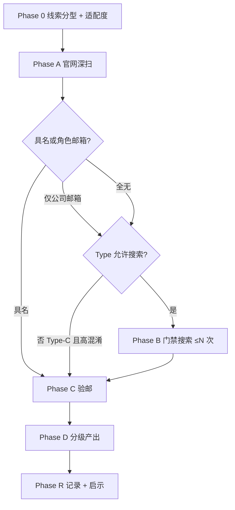

# 联系人 Enrichment 预研方案修订（v2）

> **状态**：v1 试跑 **暂停**；Decodeck USA 为 **反例样本**，结论见 [§2](#2-v1-试跑复盘-decodeck-usa)  
> **触发**：2026-09-08 首条 Spike 暴露方案设计缺陷，**先改方案再预研**，不继续按 v1 推进 US-C-01  
> **关联**：[20-需求-联系人Enrichment.md](../20-需求-联系人Enrichment.md)、[联系人Enrichment-spike-lead_20260906_0005.md](./联系人Enrichment-spike-lead_20260906_0005.md)

---

## 1. 结论：v1 方案哪里有问题

### 1.1 不是「这条线索差」，是「流程与验收设计有漏洞」

| 问题 | v1 假设 | Decodeck 暴露 |
|------|---------|---------------|
| **成功标准单一** | 50% 至少 1 人 + 30% mx_ok | 未区分 **具名个人** vs **公司角色邮箱**（info@）；后者可提升 reachability 但 **不算 people 成功** |
| **搜索 Query 无门禁** | 角色词 + 地名即可 | `Jacksonville` → 政府/招聘噪声；`Decodeck` → DecoDeck/Deckers/Dave Inc 错配 |
| **缺少采纳门槛** | 从 snippet 抽人名即候选 | **未要求** title/snippet 出现 **公司全名或官网域** |
| **搜索参数过弱** | `search_depth: basic`、裸 Query | 现网 search-api **固定 basic**；B3 未用 `include_domains` |
| **阶段顺序模糊** | 官网与搜索并列 | 应先 **穷尽官网**，再按 **线索分型** 决定搜索策略 |
| **样本选取无分层** | 任意 high 线索 | 首条即 **品牌易混淆 + 无 Team 页** → 不能代表 MVP 能力上限 |
| **About 页发现** | 猜 `/about` URL | 导航有 About 但直链 404 → 须 **从首页点链**，不能猜路径 |

### 1.2 v1 仍有效的部分（保留）

- 合规红线：不登录社媒、不 chrome 开社媒、不猜邮箱  
- 官网 chrome **仅公司域**  
- L1～L3 验邮对 **明文邮箱** 有效（info@ 可 mx_ok）  
- `sources[]` 非空才写入  
- 100% Agent 本地编排方向不变  

### 1.3 对需求文档的潜在影响（v2 预研后再改 doc 20）

以下 **暂不修改** [20-需求](../20-需求-联系人Enrichment.md)，等 v2 跑完 10 条再冻结：

- §8 通过线：分列 **具名率 / 公司 mx_ok 率 / 个人 mx_ok 率**  
- §6.2 搜索：增加 **采纳门槛**、**include_domains 策略**、**advanced 深度**（或 search-api 升级）  
- C11 配额：搜索次数可能按 **分型** 调整（非一律 3 次）  
- 新增 **Phase 0 线索适配度**（可选跳过或降级 enrichment）

---

## 2. v1 试跑复盘：Decodeck USA

**线索**：`lead_20260906_0005` · decodeckusa.com · high 84  

| 阶段 | 结果 | 标签 |
|------|------|------|
| 官网 | Contact 页 `info@decodeckusa.com`；无 Team；About 直链 404 | `company-email-only` |
| B1 采购+Jacksonville | 0 人，招聘/政府噪声 | `geo-noise` |
| B2 管理层 | 0 人，Deckers/Decker/DecoDeck 错司 | `brand-collision` |
| B3 裸搜公司名 | 0 人，全为 DecoDeck/DECO Australia | `brand-collision` |
| people[] | **0** | |
| 公司 mx_ok | info@（待验邮） | reachability 可提升，**开发信仍 Dear Team** |

**本条价值**：作为 v2 的 **Type-C 反例**（品牌易混淆 + 无人员页），**不计入 v2 通过率分子**，但计入 10 条 **分型覆盖**。

---

## 3. v2 预研目标（改什么）

v2 要回答的问题 **不再是**「能不能凑够 50% 有人」，而是：

1. **分型命中率**：哪类线索 builtin 通道能稳定产出 **具名 people**？  
2. **搜索增益**：在官网无 Team 时，**合规搜索** 的边际成功率是多少？  
3. **采纳规则**：怎样的 **硬门槛** 可将错配率压到可接受？  
4. **reachability 分层**：公司 mx_ok 是否单独产品化（不必伪装成「找到联系人」）？  
5. **工程缺口**：search-api 是否必须支持 `search_depth: advanced`？

---

## 4. v2 流程总览



---

## 5. Phase 0 — 线索分型（每条必做，5 分钟）

### 5.1 四维分型

| 维度 | 取值 | 判定方式 |
|------|------|----------|
| **S 站点结构** | S1 有 Team/Leadership | 官网 nav/footer 或 A 阶段确认 |
| | S2 无 Team，有 Contact 邮箱 | Contact/About 仅有 info@/sales@ |
| | S3 仅表单 | 无可见邮箱 |
| **B 品牌** | B1 独特（全名 ≥2 词且少见） | 人工 + 一次试搜 `"公司全名" -site:公司域` 错配率 |
| | B2 易混淆 | 与 Deck/Deco/DEC 等近音近拼 |
| **G 地理** | 有明确城市/地址 | company.description 或 Contact 页 |
| **R 角色入口** | 有 Dealer/Partner/Distributor 页 | Become a Dealer 等 |

**Decodeck 分型**：S2 + B2 + G + R → **Type-C**

### 5.2 适配度与搜索配额

| 类型 | 定义 | 搜索上限 | 预期 |
|------|------|----------|------|
| **Type-A** | S1 或 (S2 + B1) | 2 次 | 官网为主，搜索补 LinkedIn 摘要 |
| **Type-B** | S2 + B1 | 3 次 | 官网邮箱 + 搜索找人 |
| **Type-C** | B2 或 S3 | **1 次**（仅公司页/linkedin company） | **降低具名预期**；重点记 reachability |

> Type-C **禁止** 使用 procurement + 城市、裸 CEO 等泛 Query。

### 5.3 Phase 0 记录表

```markdown
| 字段 | 值 |
|------|-----|
| lead_id | |
| 类型 S / B / G / R | |
| Type-A/B/C | |
| 搜索配额 | |
| 品牌混淆试搜（1 条）错配条数/10 | |
```

**品牌混淆试搜（Phase 0 唯一允许的「探测搜索」）**

```json
{
  "query": "\"{公司全名}\"",
  "search_depth": "advanced",
  "max_results": 10
}
```

- 若 ≥7/10 结果 **不含** 公司全名且为其他实体 → 标 **B2**，降为 Type-C  
- 此条 **不计入** Phase B 搜索配额  

---

## 6. Phase A — 官网深扫（修订，≤6 页）

v1 问题：猜 URL、未从 nav 点 About、未扫 sitemap。

### 6.1 固定顺序

| 序 | 动作 | 说明 |
|----|------|------|
| A1 | 解析 eTLD+1 | 同 v1 |
| A2 | 首页 snapshot | 列出 **全部站内链接**（nav + footer） |
| A3 | Contact | mailto + 可见邮箱 + 电话 + 地址 |
| A4 | **从 A2 点进 About**（若有） | **禁止** 猜 `/about`；404 则记「nav 有但链无效」 |
| A5 | Dealer/Partner 页（若有） | 同 Decodeck become-a-dealer |
| A6 | Privacy / Terms / Imprint | 常有 legal@、info@ |
| A7 | 可选：`/sitemap.xml` 或 footer sitemap | 发现 Team/Careers 隐藏路径 |

**页数上限**：6（+1 用于 sitemap），仍属 Spike 可接受范围；正式 Skill 可保持 5。

### 6.2 官网产出分类

| 级别 | 定义 | 写入 |
|------|------|------|
| **P1** | 具名 + 职位（+ 可选邮箱） | `people[]` |
| **P2** | 角色邮箱 sales@/info@/dealer@ | `contacts_patch` + **不** fake people |
| **P3** | 仅表单/电话 | 记 reachability，不写入 people |

---

## 7. Phase B — 门禁搜索（修订）

### 7.1 前置条件

- Phase A **无 P1** 才进入（有 P1 则跳过或最多 1 次补邮箱）  
- 使用 Phase 0 分配的 **搜索配额**  
- **必须** `search_depth: advanced`（手工 Spike 用 Tavily 直调；工程侧记 search-api 缺口）  
- **必须** 对每条候选执行 [§7.3 采纳门槛](#73-采纳门槛硬规则)

### 7.2 Query 模板（按 Type，禁止裸搜公司名）

**Type-A / Type-B — 第 1 次：公司 LinkedIn 摘要**

```json
{
  "query": "\"{公司全名}\"",
  "include_domains": ["linkedin.com/company"],
  "search_depth": "advanced",
  "max_results": 5
}
```

**第 2 次：员工摘要（仅当公司页 snippet 有人名或 Type-A）**

```json
{
  "query": "\"{公司全名}\"",
  "include_domains": ["linkedin.com/in"],
  "search_depth": "advanced",
  "max_results": 10
}
```

**第 3 次（可选，Type-B only）：地址锚定**

```json
{
  "query": "\"{公司全名}\" \"{街道或城市+州}\"",
  "include_domains": ["linkedin.com/in"],
  "search_depth": "advanced",
  "max_results": 10
}
```

**Type-C — 仅 1 次：公司页确认**

```json
{
  "query": "\"{公司全名}\" \"{官网域}\"",
  "include_domains": ["linkedin.com/company"],
  "search_depth": "advanced",
  "max_results": 5
}
```

**明确禁止的 Query 模式**

- `{公司} procurement {城市}`  
- `{公司} CEO OR founder`（无 include_domains）  
- 裸 `{公司名}` 无引号、无 domain 限定  
- 任何含 `Jacksonville` / `procurement jobs` 等招聘/政府导向词  

### 7.3 采纳门槛（硬规则）

候选 **必须同时满足**：

1. **公司关联**：title 或 snippet 含 **公司全名**（或 `@decodeckusa.com` 域），**或** LinkedIn company URL 与搜索 #1 命中一致  
2. **非错司**：snippet 不含 DecoDeck®、Deckers Outdoor、无关国家主体（除非目标即该国）  
3. **具名**：人名为 First + Last（单名「Dave S.」**不采纳**）  
4. **来源**：`sources[]` 含 search 条目 url + snippet 摘录  

邮箱：仅 snippet **明文** 可见；否则 `email_status: unknown`。

### 7.4 搜索零结果 ≠ 失败

Type-C 在搜索 0 人时，若 Phase A 有 P2（info@ mx_ok），记为：

```
enrichment_tier: reachability_upgraded
people_count: 0
```

---

## 8. Phase C / D — 验邮与分级产出

### 8.1 验邮（同 v1）

L1 → L2（域一致）→ L3 MX；工具未建时 `nslookup -type=MX`。

### 8.2 分级产出（替代二元 pass/fail）

| 等级 | 条件 | UI/开发信含义 |
|------|------|---------------|
| **L3** | ≥1 people，且有个人 mx_ok | 理想：Dear FirstName |
| **L2** | ≥1 people，无邮箱 | 展示联系人，开发信仍 Team + 表单 |
| **L1** | 0 people，公司 mx_ok | reachability↑，Dear Team，**不谎称找到联系人** |
| **L0** | 仅表单/电话 | 与现网一致 |

---

## 9. v2 样本选取（10 条重新规划）

**Decodeck 保留为 #1（Type-C 反例）**，再补 9 条 **分层抽样**：

| # | 类型目标 | 数量 | 目的 |
|---|----------|------|------|
| 1 | Type-C（已有 Decodeck） | 1 | 反例、错配率 |
| 2–4 | Type-A（有 Team/About 人名） | 3 | 测官网上限 |
| 5–7 | Type-B（无 Team、品牌独特） | 3 | 测搜索增益 |
| 8–9 | Type-B 不同国家（EU/UK/DE） | 2 | 地理多样性 |
| 10 | Type-C 或 S3 仅表单 | 1 | 测降级路径 |

**选取检查清单**

- [ ] 至少 3 国  
- [ ] 至少 3 行业  
- [ ] ≥3 条 **B1 独特品牌**  
- [ ] ≥2 条 **S1 有 Team**  
- [ ] 不重复 dedupe_key  

---

## 10. v2 验收标准（替代 doc 20 §8 用于 Spike）

| 指标 | 门槛 | 说明 |
|------|------|------|
| **Type-A 具名率** | ≥ **2/3** 至少 L2 | 官网上限 |
| **Type-B 具名率** | ≥ **2/3** 至少 L2 | 含搜索 |
| **Type-C 错配率** | 采纳候选中错司 **0** | 门禁有效 |
| **全样本 L1+** | ≥ **30%** 有公司 mx_ok | reachability 价值 |
| **全样本 L3** | ≥ **20%** 个人 mx_ok | **下调** v1 的 30%（更 realistic） |
| **合规** | 100% 无社媒登录/chrome 社媒 | 不变 |

**Spike 通过 → 可进 US-C-01 的条件**：Type-A/B 具名率达标 **且** 采纳门槛可复现 **且** 记录 search-api 是否要 advanced。

---

## 11. v2 单条执行模板

复制 [联系人Enrichment-spike-lead_20260906_0005.md](./联系人Enrichment-spike-lead_20260906_0005.md) 结构，替换为：

1. **§0** 增加 Phase 0 分型表  
2. **§2** 用本文 §6 官网顺序  
3. **§3** 用本文 §7 Query 模板（按 Type 选）  
4. **§9** 增加 `enrichment_tier`（L0–L3）列  

或新建：`docs/research/联系人Enrichment-spike-v2-template.md`（可选，第二条线索起用）。

---

## 12. 建议行动顺序

1. **暂停** v1 其余 9 条试跑  
2. **你确认** 本修订（有无要改的门槛/分型）  
3. **用 v2 重跑 Decodeck**（Phase 0 + 修订 A + Type-C 仅 1 次搜索）→ 验证流程可执行  
4. 按 §9 表格选 **Type-A** 线索 1 条试跑 → 验证具名上限  
5. 凑满 10 条 → 写 `docs/research/联系人Enrichment-spike.md` 总报告  
6. **再** 回写 [20-需求](../20-需求-联系人Enrichment.md) 与 US-C-01 详设  

---

## 13. 工程 backlog（预研同步记录，不阻塞 Spike）

| 项 | 说明 |
|----|------|
| search-api `search_depth` | 现硬编码 `basic`；enrichment 需 **advanced** 或网关透传 |
| Skill 采纳门槛 | 公司名匹配逻辑需写进 `enrich-lead-contacts` |
| UI 分级 | L1 勿展示为「已找到联系人」 |
| Preflight Type-C 提示 | 「品牌易混淆，可能仅能补公司邮箱」 |

---

## 变更记录

| 日期 | 说明 |
|------|------|
| 2026-09-08 | v2 初稿：Decodeck 复盘 + 分型 + 门禁搜索 + 分级验收 |
