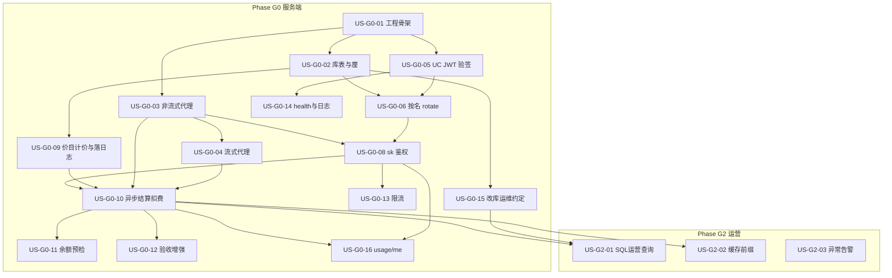

# 02 - Token 网关用户故事与依赖

> **文档类型**：用户故事拆分（网关侧）  
> **来源**：[01-需求.md](./01-需求.md)  
> **消费方桌面故事**：宿主仓库 `docs/12-官方模型通道用户故事.md`  
> **粒度**：单故事约 0.5～2 人日

---

## 1. 阅读说明

### 1.1 格式

| 字段 | 含义 |
|------|------|
| ID | `US-Gx-nn`（x=阶段，nn=序号） |
| 作为…我想…以便… | 标准用户故事句式 |
| 验收要点 | 精简 Given/When/Then；细节以需求 AT/FR 为准 |
| 优先级 | Must / Should / Could（对应需求 P0 / P1 / 后续） |
| 依赖 | 必须先完成的故事；无则写 `—` |
| 映射 | 主要 FR / 成功标准 |

### 1.2 角色缩写

| 角色 | 说明 |
|------|------|
| 终端用户 | 通过消费方客户端使用网关的人员 |
| 客户端 | 任意消费方（含桌面端） |
| 运维 | 有权直改库的人员 |
| 开发 | 实现网关的工程师 |

### 1.3 依赖总览（Mermaid）



**并行提示**：`US-G0-03` 与 `US-G0-05` 在骨架就绪后可并行；`US-G0-09` 需在 G0-04+G0-08 后落日志，算价能力可先单测，再汇合 `US-G0-10`。

**消费方对接（G1）**：见宿主仓库 `docs/12-官方模型通道用户故事.md`（依赖本文件 US-G0-06 / 10 / 16）。

---

## 2. Phase G0 — 可计费转发（服务端）

### US-G0-01　初始化 token-gateway 工程

**作为** 开发，**我想** 在仓库建立可运行的 `token-gateway/token-gateway` 服务骨架，**以便** 后续故事有统一入口与配置方式。

| 项 | 内容 |
|----|------|
| 优先级 | Must |
| 依赖 | — |
| 验收要点 | 内层工程可启动；`GET /health`；配置占位；README 有启动说明 |
| 映射 | NFR-09；Phase G0.1 |
| 详细设计 | [design/US-G0-01-工程骨架设计.md](./design/US-G0-01-工程骨架设计.md)（**待确认后再编码**） |

---

### US-G0-02　计费库表与厘单位

**作为** 运维/开发，**我想** 落库 `token_users` / `token_api_keys` / `token_price_rules` / `token_ledger_entries` / `token_request_logs`（逻辑实体见需求 §8.1），金额一律整数厘，**以便** 对账与改库运维有稳定模型。

| 项 | 内容 |
|----|------|
| 优先级 | Must |
| 依赖 | US-G0-01 |
| 验收要点 | 迁移可重复执行；`(tenant_id,user_code)`、`(user_id,name)` 唯一；无浮点金额字段；AT-13 |
| 映射 | FR-BILL-01；§8.1；OQ-06 |
| 详细设计 | [design/US-G0-02-计费库表与厘单位设计.md](./design/US-G0-02-计费库表与厘单位设计.md)（编码已落地） |

---

### US-G0-03　DeepSeek 非流式白名单代理

**作为** 客户端，**我想** 通过 OpenAI 兼容的非流式 Chat API 调用白名单内 DeepSeek 模型，**以便** 不直连上游也能完成补全。

| 项 | 内容 |
|----|------|
| 优先级 | Must |
| 依赖 | US-G0-01 |
| 验收要点 | `POST /v1/chat/completions`（`stream=false`）成功转发；非白名单 model → 4xx；上游 Key 不泄露；AT-04（模型部分） |
| 映射 | FR-PROXY-01/05/06/07 |
| 详细设计 | [design/US-G0-03-DeepSeek非流式白名单代理设计.md](./design/US-G0-03-DeepSeek非流式白名单代理设计.md)（编码已落地；HTTP 鉴权占位 401；真上游联调随 US-G0-08） |

> **联调约定**：不做临时测试 Key / 跳过鉴权。编码期以 Mock 上游单测验收代理；**与 US-G0-08（及计费相关故事）就绪后统一联调**真上游。鉴权正式实现见 US-G0-08；G0-03 对 Chat 入口占位 401，防止未鉴权裸奔。

---

### US-G0-04　流式 SSE 代理

**作为** 客户端，**我想** 使用 `stream=true` 获得 SSE 流式输出，**以便** OpenCode / 桌面端交互体验与直连上游一致。

| 项 | 内容 |
|----|------|
| 优先级 | Must |
| 依赖 | US-G0-03 |
| 验收要点 | SSE 透传至结束；可取得最终 usage（或等价结束事件）；中断可观测 |
| 映射 | FR-PROXY-02/03 |
| 详细设计 | [design/US-G0-04-流式SSE代理设计.md](./design/US-G0-04-流式SSE代理设计.md)（编码已落地；鉴权占位 401；真上游联调随 US-G0-08） |

> **联调约定**：与 G0-03 相同——无临时免鉴权；编码期 Mock 上游 SSE；真上游随 US-G0-08（及计费）统一联调。本故事不扣费，但须能解析 usage 并为 G0-10 预留结束/中断钩子。

---

### US-G0-05　作为 RS 校验用户中心 JWT

**作为** 系统，**我想** 用与用户中心相同的 OAuth `jwk-key`（HS256）校验 `access_token` 并解析 `tenant_id` / `user_code`，**以便** 不自建登录也能识别用户。

| 项 | 内容 |
|----|------|
| 优先级 | Must |
| 依赖 | US-G0-01 |
| 验收要点 | 有效 JWT 通过；过期/伪造/错误密钥拒绝；claim 映射文档化（对齐 D-01/D-02）；密钥与 AS 同源配置 |
| 映射 | §2.4；§4.3；FR-AUTH-01/10 |
| 详细设计 | [design/US-G0-05-作为RS校验用户中心JWT设计.md](./design/US-G0-05-作为RS校验用户中心JWT设计.md)（编码已落地；联调需同源 `OAUTH_JWK_KEY`） |

---

### US-G0-06　按 name 签发 / 重置 Key（rotate）

**作为** 已登录客户端，**我想** 用一个接口按 Key `name` 拿到可用的网关 sk（没有就创建，有就重置），**以便** 首次开通与丢 Key 找回共用同一路径，且多客户端互不覆盖。

| 项 | 内容 |
|----|------|
| 优先级 | Must |
| 依赖 | US-G0-02，US-G0-05 |
| 验收要点 | 仅 `POST /v1/keys/rotate` + `{name}`；无 Key→创建并返回明文；有 Key→旧失效并返回新明文；自动建账户；其他 name 不受影响；AT-11、AT-14、AT-15 |
| 映射 | FR-AUTH-02/03/04/07；FR-AUTH-08 不做 |
| 详细设计 | [design/US-G0-06-按名签发重置Key设计.md](./design/US-G0-06-按名签发重置Key设计.md)（编码已落地；联调需 JWT + MySQL + `GATEWAY_KEY_PEPPER` + `OAUTH_JWK_KEY`） |

> **原 US-G0-07**（独立 rotate）已并入本故事，编号保留空缺以免打乱后续 ID。

---

### US-G0-07　（已合并）

> **状态**：**取消 / 并入 US-G0-06**。不再单独提供「仅重置」或「provision 二次不回明文」接口。

---

### US-G0-08　Chat 使用 sk- 鉴权

**作为** 系统，**我想** 用网关 `sk-` 校验 Chat 请求并解析到 user + key，**以便** Agent 可用长期 Key 调用且禁用生效。

| 项 | 内容 |
|----|------|
| 优先级 | Must |
| 依赖 | US-G0-03，US-G0-06 |
| 验收要点 | 合法 sk 可调 Chat；非法/禁用账户或 Key → 401/403；AT-05 |
| 映射 | FR-AUTH-05/06；SEC-01 |
| 详细设计 | [design/US-G0-08-Chat使用sk鉴权设计.md](./design/US-G0-08-Chat使用sk鉴权设计.md)（编码已落地；联调需 MySQL + pepper + rotate 所得 sk） |

> 替换 G0-03 占位恒 401；仍禁止测试 Key / 免鉴权旁路。Chat 不走 UC JWT `protected-patterns`。

---

### US-G0-09　价目、两档计价与请求计量落库

**作为** 运营，**我想** 配置两档价目、具备 §7.1 算价能力，并在每次 Chat 后落 `token_request_logs`（用量/状态），**以便** 异步结算有据可依，且请求路径不算价不扣费。

| 项 | 内容 |
|----|------|
| 优先级 | Must |
| 依赖 | US-G0-02，US-G0-03/04，US-G0-08 |
| 验收要点 | 价目可读；公式符合 §7.1；缓存输入对外仍按输入档；Chat 后有日志行且金额为空；请求内未调 `quote` |
| 映射 | FR-PRICE-01～04/06；FR-METER-01/02/04；OQ-07 |
| 详细设计 | [design/US-G0-09-价目表与两档计价设计.md](./design/US-G0-09-价目表与两档计价设计.md)（编码已落地；异步扣费见 G0-10） |

> 算价能力仅供 G0-10 异步结算；Chat 只写计量日志。种子占位价上线前复核。

---

### US-G0-10　异步结算扣费与账本回填

**作为** 运营，**我想** 由异步任务对 `billing_status=pending` 的请求算价、扣余额、写流水并回填金额，**以便** 任意一笔最终可还原毛利（S2），且不阻塞 Chat。

| 项 | 内容 |
|----|------|
| 优先级 | Must |
| 依赖 | US-G0-09（日志 + `PricingService`） |
| 验收要点 | 结算后 `ledger_entries` + 日志金额完整；同一 `request_id` 幂等；AT-01/02（结算后断言） |
| 映射 | FR-BILL-03；FR-METER-03；OQ-07；S2 |
| 详细设计 | [design/US-G0-10-异步结算扣费设计.md](./design/US-G0-10-异步结算扣费设计.md)（编码已落地；ShedLock 调度互斥 + settling 观测 + 同用户合并扣减） |

> **已确认**：请求内绝不算价/扣费；写日志在 G0-09；异步结算。允许余额为负；缺价 → `settle_failed`；revenue=0 写 amount=0 的 charge。  
> **本期**：多实例安全认领；同用户多笔成功结算**合并一次余额扣减**（流水仍按请求逐笔，满足对账）。

---

### US-G0-11　余额预检与拒绝

**作为** 系统，**我想** 在余额不足时拒绝新请求，**以便** 控制坏账（S3）。

| 项 | 内容 |
|----|------|
| 优先级 | Must |
| 依赖 | US-G0-08（可读 `balance_li`；不依赖同步扣费） |
| 验收要点 | `balance_li <= 0` 拒绝；不转发上游；AT-03 |
| 映射 | FR-BILL-04；S3；OQ-07 |
| 详细设计 | [design/US-G0-11-余额预检与拒绝设计.md](./design/US-G0-11-余额预检与拒绝设计.md)（编码已落地；402 `insufficient_balance`） |

> **已确认**：仍做预检；**接受**因异步未扣完导致的额度透支（预检通过后余额可为负或消费超过余额）。  
> **设计要点**：Auth 后、Proxy 前；默认 `balance_li >= 1` 放行；不足 → **402** `insufficient_balance`；拒绝不写 `token_request_logs`。

---

### US-G0-12　失败 / 中断结算与扣费幂等（验收 / 增强）

**作为** 系统，**我想** 确认无 usage 不扣、中断有 usage 可扣、同一 `request_id` 不重复扣，**以便** 账不错不漏。

| 项 | 内容 |
|----|------|
| 优先级 | Must（验收） |
| 依赖 | US-G0-10 |
| 验收要点 | 与 G0-10 A3/A4/A2 及 AT-10 对齐；无独立编码阻塞项 |
| 映射 | FR-METER-05/06/07；§7.2 |

> **已确认（G0-10 Q6）**：MVP 规则已并入 [US-G0-10 设计](./design/US-G0-10-异步结算扣费设计.md)。本故事作**验收清单 / 后续增强**（如 `settle_failed` 运维重试、人工死信处理），不单独开一套结算实现。

---

### US-G0-13　RPM / TPM / 日限额

**作为** 运维，**我想** 对用户施加基础限流与日额度，**以便** 抑制滥用（S5）。

| 项 | 内容 |
|----|------|
| 优先级 | Must |
| 依赖 | US-G0-08 |
| 验收要点 | 超限 429；可配置；记日志；AT-06 |
| 映射 | FR-RISK-01/02/03；S5 |

---

### US-G0-14　健康检查与结构化日志

**作为** 已登录用户/运维，**我想** 在通过用户中心登录后调用 `/health`，并有可按 `request_id` 检索的日志，**以便** 确认服务存活与排障，同时避免匿名刷探活。

| 项 | 内容 |
|----|------|
| 优先级 | Must |
| 依赖 | US-G0-01，**US-G0-05**（已落地） |
| 验收要点 | 无 Token → 401；有效 UC JWT → `/health` 200；关键请求带 request_id；不含 prompt 正文；**不接受**仅 sk 调健康检查 |
| 映射 | FR-ADMIN-03/04；OQ-04 |
| 详细设计 | [design/US-G0-14-健康检查与结构化日志设计.md](./design/US-G0-14-健康检查与结构化日志设计.md)（编码已落地；联调需 UC JWT + `OAUTH_JWK_KEY`） |

---

### US-G0-15　改库运维约定（无管理端）

**作为** 运维，**我想** 有文档化的充值/禁用 SQL 约定（及可选示例），**以便** 无管理端也能安全入账。

| 项 | 内容 |
|----|------|
| 优先级 | Must |
| 依赖 | US-G0-02 |
| 验收要点 | README 写明：充值必须余额+流水同事务；Key 哈希算法；按 name 定位；AT-12 可手工执行 |
| 映射 | FR-BILL-02；§6.2；§8.3；FR-ADMIN-05 不做 |

---

### US-G0-16　查询余额与今日用量

**作为** 客户端，**我想** 用网关 Key 查询账户余额与今日用量，**以便** 设置页展示。

| 项 | 内容 |
|----|------|
| 优先级 | Must |
| 依赖 | US-G0-08，US-G0-02（查余额不依赖 G0-10） |
| 验收要点 | `GET /v1/usage/me` 返回 `balance_li`（厘）；鉴权同 Chat sk |
| 映射 | FR-BILL-05（余额）；今日用量本期不做 |
| 详细设计 | [design/US-G0-16-查询余额usage-me设计.md](./design/US-G0-16-查询余额usage-me设计.md)（编码已落地；**本期仅余额**，无 `today`） |

> **本期收窄**：只实现查余额 + 身份/当前 Key 摘要；`today` 用量汇总留后续增强。余额为 0/负仍返回 200（不做预检）。

---

### G0 可选（Should，不阻塞 G1 主路径）

| ID | 故事 | 依赖 | 说明 |
|----|------|------|------|
| US-G0-17 | `GET /v1/models` 返回白名单 | US-G0-03，US-G0-09，US-G0-08 | FR-PROXY-04；[详细设计](./design/US-G0-17-models白名单列表设计.md)（编码已落地；配置 ∩ 已定价；仅 sk） |
| US-G0-18 | `GET /v1/keys` 列出 Key 元信息 | US-G0-06 | FR-AUTH-11 |

---

## 3. Phase G2 — 运营加固

### US-G2-01　命中率 / 毛利 SQL 可查

**作为** 运维，**我想** 用 SQL（或附示例）按天查看命中率、收入、COGS、毛利，**以便** 无管理端也能盯差价（S4/OPS-01）。

| 项 | 内容 |
|----|------|
| 优先级 | Must |
| 依赖 | US-G0-10，US-G0-15 |
| 验收要点 | 示例 SQL 可跑出 AT-07 所需指标；可按 key_name 过滤 |
| 映射 | FR-ADMIN-01/02；OPS-01；S4 |

---

### US-G2-02　缓存友好前缀策略

**作为** 运营，**我想** 桌面/网关侧固定可缓存前缀约定，**以便** 提高命中率、保护毛利。

| 项 | 内容 |
|----|------|
| 优先级 | Should |
| 依赖 | US-G0-10（有真实流量数据更佳） |
| 验收要点 | 有书面约定或配置；连续同前缀请求命中率可观测改善 |
| 映射 | OPS-02 |

---

### US-G2-03　异常用量 / 低毛利告警

**作为** 运维，**我想** 在用量飙升或命中率过低时收到告警，**以便** 及时熔断或调价。

| 项 | 内容 |
|----|------|
| 优先级 | Could |
| 依赖 | US-G0-13，US-G2-01 |
| 验收要点 | 至少一种通知通道；阈值可配 |
| 映射 | FR-RISK-04/05 |

---

## 4. 明确不做（本拆分不建故事）

| 项 | 说明 |
|----|------|
| 管理端 Web / 管理 API | Out of Scope；用 US-G0-15 改库替代 |
| 自助支付 | Phase G3 |
| 多上游路由 | Phase G3 |
| Prompt 采样存储 | 禁止 |

---

## 5. 建议实现顺序（关键路径）

```
US-G0-01
  ├─► US-G0-02 ─► US-G0-09（价目+算价+写 request_logs）─┐
  ├─► US-G0-03 ─► US-G0-04 ──────────────────────────────┼─► US-G0-10（异步结算）─► US-G0-12
  │                                                     └─► US-G0-11（余额预检；可与 G0-10 并行，依赖 G0-08）
  ├─► US-G0-05 ─► US-G0-06 ─► US-G0-08 ──────────────────┘
  │        └─► US-G0-14（可与 06+ 并行）
  └─► US-G0-02 ─► US-G0-15 ─────────────────────────────────► US-G0-16 / US-G0-13（可与 11 并行）

G1（消费方仓库）→ 宿主 docs/12

G2: US-G2-01 → US-G2-02 → US-G2-03（可选）
```

**第一条可演示的垂直切片（推荐）**：

1. US-G0-01 → 02 → 05 → 06（单一 `rotate`）  
2. 并行：03 → 04；**可选并行 US-G0-14**；09 的算价/种子可先做  
3. 汇合：08 → **09（落 request_logs）** → 10（异步结算）；11 可与 10 并行  
4. 然后：16；消费方按宿主仓库 docs/12 做 G1 对接  

---

## 6. 故事 ↔ 任务对照

| Phase 任务 | 用户故事 |
|------------|----------|
| G0.1 目录初始化 | US-G0-01 |
| G0.2 DeepSeek 代理 | US-G0-03，US-G0-04 |
| G0.3 JWT + 按名 rotate（创建/重置） | US-G0-05，US-G0-06（原 07 已合并） |
| G0.4 账本表 | US-G0-02 |
| G0.5 两档计费 + COGS | US-G0-09，US-G0-10，US-G0-12 |
| G0.6 限流 + 余额预检 | US-G0-11，US-G0-13 |
| G0.7 改库运维 | US-G0-15 |
| G0.8 health + 结构化日志 | US-G0-14（依赖 G0-05；可与 provision 后并行） |
| （消费方）G1 桌面对接 | 见宿主 docs/12；依赖 US-G0-06/10/16 |
| G2.x 运营加固 | US-G2-01～03 |

---

## 7. 文档维护

- 需求变更时先改 [01-需求.md](./01-需求.md)，再同步本故事
- 宿主仓库 Phase G 勾选见 `docs/04-实施计划.md`；桌面故事见 `docs/12-官方模型通道用户故事.md`
