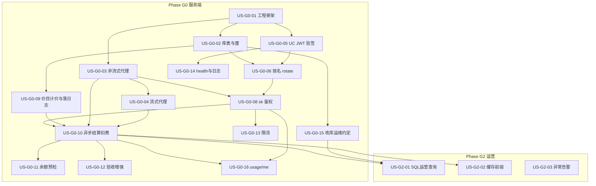
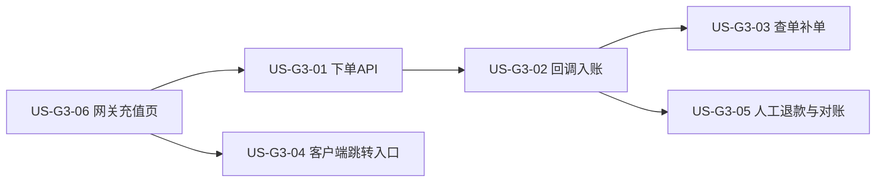
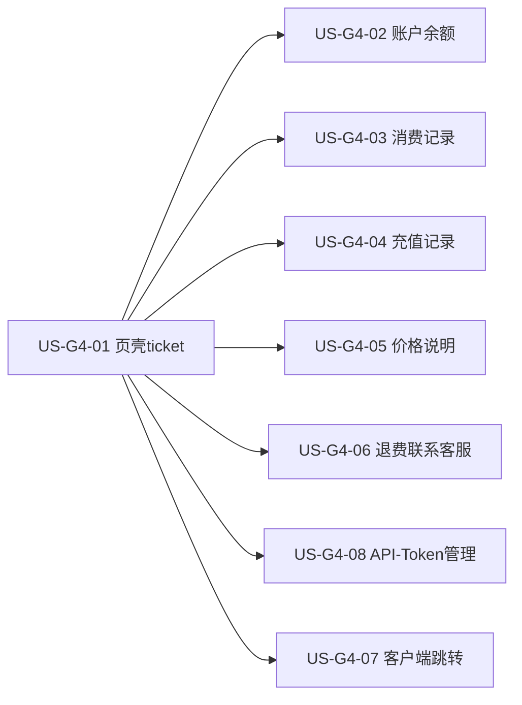
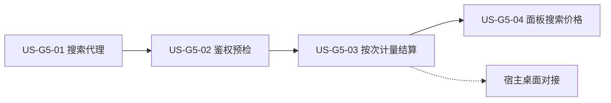

# 02 - Token 网关用户故事与依赖

> **文档类型**：用户故事拆分（网关侧）  
> **来源**：[01-需求.md](./01-需求.md)  
> **消费方桌面故事**：宿主仓库 `docs/12-官方模型通道用户故事.md`  
> **粒度**：单故事约 0.5～2 人日

---

## 1. 阅读说明

### 1.1 格式

| 字段 | 含义 |
|------|------|
| ID | `US-Gx-nn`（x=阶段，nn=序号） |
| 作为…我想…以便… | 标准用户故事句式 |
| 验收要点 | 精简 Given/When/Then；细节以需求 AT/FR 为准 |
| 优先级 | Must / Should / Could（对应需求 P0 / P1 / 后续） |
| 依赖 | 必须先完成的故事；无则写 `—` |
| 映射 | 主要 FR / 成功标准 |

### 1.2 角色缩写

| 角色 | 说明 |
|------|------|
| 终端用户 | 通过消费方客户端使用网关的人员 |
| 客户端 | 任意消费方（含桌面端） |
| 运维 | 有权直改库的人员 |
| 开发 | 实现网关的工程师 |

### 1.3 依赖总览（Mermaid）



**并行提示**：`US-G0-03` 与 `US-G0-05` 在骨架就绪后可并行；`US-G0-09` 需在 G0-04+G0-08 后落日志，算价能力可先单测，再汇合 `US-G0-10`。

**消费方对接（G1）**：见宿主仓库 `docs/12-官方模型通道用户故事.md`（依赖本文件 US-G0-06 / 10 / 16）。

---

## 2. Phase G0 — 可计费转发（服务端）

### US-G0-01　初始化 token-gateway 工程

**作为** 开发，**我想** 在仓库建立可运行的 `token-gateway/token-gateway` 服务骨架，**以便** 后续故事有统一入口与配置方式。

| 项 | 内容 |
|----|------|
| 优先级 | Must |
| 依赖 | — |
| 验收要点 | 内层工程可启动；`GET /health`；配置占位；README 有启动说明 |
| 映射 | NFR-09；Phase G0.1 |
| 详细设计 | [design/US-G0-01-工程骨架设计.md](./design/US-G0-01-工程骨架设计.md)（**待确认后再编码**） |

---

### US-G0-02　计费库表与厘单位

**作为** 运维/开发，**我想** 落库 `token_users` / `token_api_keys` / `token_price_rules` / `token_ledger_entries` / `token_request_logs`（逻辑实体见需求 §8.1），金额一律整数厘，**以便** 对账与改库运维有稳定模型。

| 项 | 内容 |
|----|------|
| 优先级 | Must |
| 依赖 | US-G0-01 |
| 验收要点 | 迁移可重复执行；`(tenant_id,user_code)`、`(user_id,name)` 唯一；无浮点金额字段；AT-13 |
| 映射 | FR-BILL-01；§8.1；OQ-06 |
| 详细设计 | [design/US-G0-02-计费库表与厘单位设计.md](./design/US-G0-02-计费库表与厘单位设计.md)（编码已落地） |

---

### US-G0-03　DeepSeek 非流式白名单代理

**作为** 客户端，**我想** 通过 OpenAI 兼容的非流式 Chat API 调用白名单内 DeepSeek 模型，**以便** 不直连上游也能完成补全。

| 项 | 内容 |
|----|------|
| 优先级 | Must |
| 依赖 | US-G0-01 |
| 验收要点 | `POST /v1/chat/completions`（`stream=false`）成功转发；非白名单 model → 4xx；上游 Key 不泄露；AT-04（模型部分） |
| 映射 | FR-PROXY-01/05/06/07 |
| 详细设计 | [design/US-G0-03-DeepSeek非流式白名单代理设计.md](./design/US-G0-03-DeepSeek非流式白名单代理设计.md)（编码已落地；HTTP 鉴权占位 401；真上游联调随 US-G0-08） |

> **联调约定**：不做临时测试 Key / 跳过鉴权。编码期以 Mock 上游单测验收代理；**与 US-G0-08（及计费相关故事）就绪后统一联调**真上游。鉴权正式实现见 US-G0-08；G0-03 对 Chat 入口占位 401，防止未鉴权裸奔。

---

### US-G0-04　流式 SSE 代理

**作为** 客户端，**我想** 使用 `stream=true` 获得 SSE 流式输出，**以便** OpenCode / 桌面端交互体验与直连上游一致。

| 项 | 内容 |
|----|------|
| 优先级 | Must |
| 依赖 | US-G0-03 |
| 验收要点 | SSE 透传至结束；可取得最终 usage（或等价结束事件）；中断可观测 |
| 映射 | FR-PROXY-02/03 |
| 详细设计 | [design/US-G0-04-流式SSE代理设计.md](./design/US-G0-04-流式SSE代理设计.md)（编码已落地；鉴权占位 401；真上游联调随 US-G0-08） |

> **联调约定**：与 G0-03 相同——无临时免鉴权；编码期 Mock 上游 SSE；真上游随 US-G0-08（及计费）统一联调。本故事不扣费，但须能解析 usage 并为 G0-10 预留结束/中断钩子。

---

### US-G0-05　作为 RS 校验用户中心 JWT

**作为** 系统，**我想** 用与用户中心相同的 OAuth `jwk-key`（HS256）校验 `access_token` 并解析 `tenant_id` / `user_code`，**以便** 不自建登录也能识别用户。

| 项 | 内容 |
|----|------|
| 优先级 | Must |
| 依赖 | US-G0-01 |
| 验收要点 | 有效 JWT 通过；过期/伪造/错误密钥拒绝；claim 映射文档化（对齐 D-01/D-02）；密钥与 AS 同源配置 |
| 映射 | §2.4；§4.3；FR-AUTH-01/10 |
| 详细设计 | [design/US-G0-05-作为RS校验用户中心JWT设计.md](./design/US-G0-05-作为RS校验用户中心JWT设计.md)（编码已落地；联调需同源 `OAUTH_JWK_KEY`） |

---

### US-G0-06　按 name 签发 / 重置 Key（rotate）

**作为** 已登录客户端，**我想** 用一个接口按 Key `name` 拿到可用的网关 sk（没有就创建，有就重置），**以便** 首次开通与丢 Key 找回共用同一路径，且多客户端互不覆盖。

| 项 | 内容 |
|----|------|
| 优先级 | Must |
| 依赖 | US-G0-02，US-G0-05 |
| 验收要点 | 仅 `POST /v1/keys/rotate` + `{name}`；无 Key→创建并返回明文；有 Key→旧失效并返回新明文；自动建账户；其他 name 不受影响；AT-11、AT-14、AT-15 |
| 映射 | FR-AUTH-02/03/04/07；FR-AUTH-08 不做 |
| 详细设计 | [design/US-G0-06-按名签发重置Key设计.md](./design/US-G0-06-按名签发重置Key设计.md)（编码已落地；联调需 JWT + MySQL + `GATEWAY_KEY_PEPPER` + `OAUTH_JWK_KEY`） |

> **原 US-G0-07**（独立 rotate）已并入本故事，编号保留空缺以免打乱后续 ID。

---

### US-G0-07　（已合并）

> **状态**：**取消 / 并入 US-G0-06**。不再单独提供「仅重置」或「provision 二次不回明文」接口。

---

### US-G0-08　Chat 使用 sk- 鉴权

**作为** 系统，**我想** 用网关 `sk-` 校验 Chat 请求并解析到 user + key，**以便** Agent 可用长期 Key 调用且禁用生效。

| 项 | 内容 |
|----|------|
| 优先级 | Must |
| 依赖 | US-G0-03，US-G0-06 |
| 验收要点 | 合法 sk 可调 Chat；非法/禁用账户或 Key → 401/403；AT-05 |
| 映射 | FR-AUTH-05/06；SEC-01 |
| 详细设计 | [design/US-G0-08-Chat使用sk鉴权设计.md](./design/US-G0-08-Chat使用sk鉴权设计.md)（编码已落地；联调需 MySQL + pepper + rotate 所得 sk） |

> 替换 G0-03 占位恒 401；仍禁止测试 Key / 免鉴权旁路。Chat 不走 UC JWT `protected-patterns`。

---

### US-G0-09　价目、两档计价与请求计量落库

**作为** 运营，**我想** 配置两档价目、具备 §7.1 算价能力，并在每次 Chat 后落 `token_request_logs`（用量/状态），**以便** 异步结算有据可依，且请求路径不算价不扣费。

| 项 | 内容 |
|----|------|
| 优先级 | Must |
| 依赖 | US-G0-02，US-G0-03/04，US-G0-08 |
| 验收要点 | 价目可读；公式符合 §7.1；缓存输入对外仍按输入档；Chat 后有日志行且金额为空；请求内未调 `quote` |
| 映射 | FR-PRICE-01～04/06；FR-METER-01/02/04；OQ-07 |
| 详细设计 | [design/US-G0-09-价目表与两档计价设计.md](./design/US-G0-09-价目表与两档计价设计.md)（编码已落地；异步扣费见 G0-10） |

> 算价能力仅供 G0-10 异步结算；Chat 只写计量日志。种子占位价上线前复核。

---

### US-G0-10　异步结算扣费与账本回填

**作为** 运营，**我想** 由异步任务对 `billing_status=pending` 的请求算价、扣余额、写流水并回填金额，**以便** 任意一笔最终可还原毛利（S2），且不阻塞 Chat。

| 项 | 内容 |
|----|------|
| 优先级 | Must |
| 依赖 | US-G0-09（日志 + `PricingService`） |
| 验收要点 | 结算后 `ledger_entries` + 日志金额完整；同一 `request_id` 幂等；AT-01/02（结算后断言） |
| 映射 | FR-BILL-03；FR-METER-03；OQ-07；S2 |
| 详细设计 | [design/US-G0-10-异步结算扣费设计.md](./design/US-G0-10-异步结算扣费设计.md)（编码已落地；ShedLock 调度互斥 + settling 观测 + 同用户合并扣减） |

> **已确认**：请求内绝不算价/扣费；写日志在 G0-09；异步结算。允许余额为负；缺价 → `settle_failed`；revenue=0 写 amount=0 的 charge。  
> **本期**：多实例安全认领；同用户多笔成功结算**合并一次余额扣减**（流水仍按请求逐笔，满足对账）。

---

### US-G0-11　余额预检与拒绝

**作为** 系统，**我想** 在余额不足时拒绝新请求，**以便** 控制坏账（S3）。

| 项 | 内容 |
|----|------|
| 优先级 | Must |
| 依赖 | US-G0-08（可读 `balance_li`；不依赖同步扣费） |
| 验收要点 | `balance_li <= 0` 拒绝；不转发上游；AT-03 |
| 映射 | FR-BILL-04；S3；OQ-07 |
| 详细设计 | [design/US-G0-11-余额预检与拒绝设计.md](./design/US-G0-11-余额预检与拒绝设计.md)（编码已落地；402 `insufficient_balance`） |

> **已确认**：仍做预检；**接受**因异步未扣完导致的额度透支（预检通过后余额可为负或消费超过余额）。  
> **设计要点**：Auth 后、Proxy 前；默认 `balance_li >= 1` 放行；不足 → **402** `insufficient_balance`；拒绝不写 `token_request_logs`。

---

### US-G0-12　失败 / 中断结算与扣费幂等（验收 / 增强）

**作为** 系统，**我想** 确认无 usage 不扣、中断有 usage 可扣、同一 `request_id` 不重复扣，**以便** 账不错不漏。

| 项 | 内容 |
|----|------|
| 优先级 | Must（验收） |
| 依赖 | US-G0-10 |
| 验收要点 | 与 G0-10 A3/A4/A2 及 AT-10 对齐；无独立编码阻塞项 |
| 映射 | FR-METER-05/06/07；§7.2 |

> **已确认（G0-10 Q6）**：MVP 规则已并入 [US-G0-10 设计](./design/US-G0-10-异步结算扣费设计.md)。本故事作**验收清单 / 后续增强**（如 `settle_failed` 运维重试、人工死信处理），不单独开一套结算实现。

---

### US-G0-13　RPM / TPM / 日限额

**作为** 运维，**我想** 对用户施加基础限流与日额度，**以便** 抑制滥用（S5）。

| 项 | 内容 |
|----|------|
| 优先级 | Must |
| 依赖 | US-G0-08 |
| 验收要点 | 超限 429；可配置；记日志；AT-06 |
| 映射 | FR-RISK-01/02/03；S5 |

---

### US-G0-14　健康检查与结构化日志

**作为** 已登录用户/运维，**我想** 在通过用户中心登录后调用 `/health`，并有可按 `request_id` 检索的日志，**以便** 确认服务存活与排障，同时避免匿名刷探活。

| 项 | 内容 |
|----|------|
| 优先级 | Must |
| 依赖 | US-G0-01，**US-G0-05**（已落地） |
| 验收要点 | 无 Token → 401；有效 UC JWT → `/health` 200；关键请求带 request_id；不含 prompt 正文；**不接受**仅 sk 调健康检查 |
| 映射 | FR-ADMIN-03/04；OQ-04 |
| 详细设计 | [design/US-G0-14-健康检查与结构化日志设计.md](./design/US-G0-14-健康检查与结构化日志设计.md)（编码已落地；联调需 UC JWT + `OAUTH_JWK_KEY`） |

---

### US-G0-15　改库运维约定（无管理端）

**作为** 运维，**我想** 有文档化的充值/禁用 SQL 约定（及可选示例），**以便** 无管理端也能安全入账。

| 项 | 内容 |
|----|------|
| 优先级 | Must |
| 依赖 | US-G0-02 |
| 验收要点 | README 写明：充值必须余额+流水同事务；Key 哈希算法；按 name 定位；AT-12 可手工执行 |
| 映射 | FR-BILL-02；§6.2；§8.3；FR-ADMIN-05 不做 |

---

### US-G0-16　查询余额与今日用量

**作为** 客户端，**我想** 用网关 Key 查询账户余额与今日用量，**以便** 设置页展示。

| 项 | 内容 |
|----|------|
| 优先级 | Must |
| 依赖 | US-G0-08，US-G0-02（查余额不依赖 G0-10） |
| 验收要点 | `GET /v1/usage/me` 返回 `balance_li`（厘）；鉴权同 Chat sk |
| 映射 | FR-BILL-05（余额）；今日用量本期不做 |
| 详细设计 | [design/US-G0-16-查询余额usage-me设计.md](./design/US-G0-16-查询余额usage-me设计.md)（编码已落地；**本期仅余额**，无 `today`） |

> **本期收窄**：只实现查余额 + 身份/当前 Key 摘要；`today` 用量汇总留后续增强。余额为 0/负仍返回 200（不做预检）。

---

### G0 可选（Should，不阻塞 G1 主路径）

| ID | 故事 | 依赖 | 说明 |
|----|------|------|------|
| US-G0-17 | `GET /v1/models` 返回白名单 | US-G0-03，US-G0-09，US-G0-08 | FR-PROXY-04；[详细设计](./design/US-G0-17-models白名单列表设计.md)（编码已落地；配置 ∩ 已定价；仅 sk） |
| US-G0-18 | `GET /v1/keys` 列出 Key 元信息 | US-G0-06 | FR-AUTH-11；**面板路径见 US-G4-08**（ticket）；本项可选独立 JWT 版 |

---

## 3. Phase G2 — 运营加固

### US-G2-01　命中率 / 毛利 SQL 可查

**作为** 运维，**我想** 用 SQL（或附示例）按天查看命中率、收入、COGS、毛利，**以便** 无管理端也能盯差价（S4/OPS-01）。

| 项 | 内容 |
|----|------|
| 优先级 | Must |
| 依赖 | US-G0-10，US-G0-15 |
| 验收要点 | 示例 SQL 可跑出 AT-07 所需指标；可按 key_name 过滤 |
| 映射 | FR-ADMIN-01/02；OPS-01；S4 |

---

### US-G2-02　缓存友好前缀策略

**作为** 运营，**我想** 桌面/网关侧固定可缓存前缀约定，**以便** 提高命中率、保护毛利。

| 项 | 内容 |
|----|------|
| 优先级 | Should |
| 依赖 | US-G0-10（有真实流量数据更佳） |
| 验收要点 | 有书面约定或配置；连续同前缀请求命中率可观测改善 |
| 映射 | OPS-02 |

---

### US-G2-03　异常用量 / 低毛利告警

**作为** 运维，**我想** 在用量飙升或命中率过低时收到告警，**以便** 及时熔断或调价。

| 项 | 内容 |
|----|------|
| 优先级 | Could |
| 依赖 | US-G0-13，US-G2-01 |
| 验收要点 | 至少一种通知通道；阈值可配 |
| 映射 | FR-RISK-04/05 |

---

## 3.5 Phase G3 — 微信支付自助充值（草案，待评审）

> **执行计划**：[13-微信支付自助充值执行计划.md](./13-微信支付自助充值执行计划.md)  
> **产品决策（已拍板）**：官方通道预付费充值；无套餐；单笔 **1～100 元**；退款仅人工，承诺 **3 个工作日**；支付默认 Native 扫码。  
> **依赖**：US-G0-02（账本）、US-G0-05（UC JWT）、US-G0-15（人工 topup 兜底）、US-G0-16（余额展示）。



### US-G3-01　创建微信支付单（自定义金额）

**作为** 已登录用户，**我想** 在合法金额内发起官方通道预付费充值并拿到付款码，**以便** 用微信扫码支付。

| 字段 | 内容 |
|------|------|
| 优先级 | Must |
| 依赖 | US-G0-02，US-G0-05 |
| 验收要点 | UC JWT（或充值页签发的短时凭证）；金额 ∈ [1, 100] 元（服务端校验）；无套餐；返回 Native `code_url`；落支付订单 `created`；非法金额 4xx |
| 详细设计 | [design/US-G3-01-微信支付自助充值下单设计.md](./design/US-G3-01-微信支付自助充值下单设计.md) |
| 映射 | Phase G3；执行计划 D2-1 |

### US-G3-02　支付回调幂等入账

**作为** 系统，**我想** 在微信支付成功回调后验签并入账，**以便** 用户余额增加且流水可追溯、不重复加款。

| 字段 | 内容 |
|------|------|
| 优先级 | Must |
| 依赖 | US-G3-01 |
| 验收要点 | 验签失败拒绝；成功则同事务 `balance_li += 厘` + `ledger type=topup`；订单 → `credited`；同一 `out_trade_no`/`transaction_id` 重复回调不双加；未支付不加余额 |
| 详细设计 | [design/US-G3-02-微信支付回调幂等入账设计.md](./design/US-G3-02-微信支付回调幂等入账设计.md) |
| 映射 | 对齐 US-G0-15 topup 语义；AT-12 自助版 |

### US-G3-03　查单补单

**作为** 系统/用户，**我想** 在回调丢失时仍能确认支付并入账，**以便** 已付款用户不丢余额。

| 字段 | 内容 |
|------|------|
| 优先级 | Must |
| 依赖 | US-G3-01，US-G3-02 |
| 验收要点 | 定时和/或充值页「我已支付」触发微信查单；已支付未入账则补走与回调相同入账路径（共享幂等）；未支付不入账 |
| 详细设计 | [design/US-G3-03-微信支付查单补单设计.md](./design/US-G3-03-微信支付查单补单设计.md) |
| 映射 | 执行计划 D2-4 |

### US-G3-06　网关托管充值页

**作为** 终端用户，**我想** 在 Token 网关提供的页面上输入金额、展示付款码并完成充值，**以便** 支付 UI 与备案域名/商户资料一致，且多端可复用。

| 字段 | 内容 |
|------|------|
| 优先级 | Must |
| 依赖 | US-G3-01，US-G3-02，US-G3-03 |
| 验收要点 | 页面由 `token-gateway` 提供（静态页或同域前端）；展示口径「官方通道预付费充值」；金额 1～100；出码、「我已支付」、成功/失败提示；**不在桌面内嵌实现支付 UI**；登录态用短时 ticket/会话，避免长效 JWT 明文挂长期 URL |
| 详细设计 | [design/US-G3-06-网关托管充值页设计.md](./design/US-G3-06-网关托管充值页设计.md)（交互稿 `designs/token-gateway-recharge.pen`） |
| 映射 | 执行计划 E；合规与进件网站对齐 |

### US-G3-04　客户端跳转充值入口

**作为** 桌面用户，**我想** 在官方通道设置里点「充值」后跳转到网关充值页，**以便** 完成自助充值并回到客户端看到余额更新。

| 字段 | 内容 |
|------|------|
| 优先级 | Should |
| 依赖 | US-G3-06，US-G0-16 |
| 验收要点 | 客户端**不**实现扫码/下单 UI；打开系统浏览器或内嵌窗加载网关充值 URL（可带一次性 ticket）；返回后可刷新 `usage/me` |
| 详细设计 | [宿主 docs/design/US-G3-04-客户端跳转充值入口设计.md](../../docs/design/US-G3-04-客户端跳转充值入口设计.md) |
| 映射 | 原「桌面充值 UI」收窄为入口跳转；衔接 G1-03 余额区 |

### US-G3-05　人工退款约定与对账

**作为** 运维，**我想** 有文档化的退款与对账步骤，**以便** 在 3 个工作日内处理退款申请，并每日核对微信收款与 topup 流水。

| 字段 | 内容 |
|------|------|
| 优先级 | Must |
| 依赖 | US-G3-02，US-G0-15 |
| 验收要点 | **无用户自助退款 API**；用户侧仅可通过面板（US-G4-06）查看客服联系方式并人工申请；手册含：受理渠道、扣回余额/调账、商户平台退款、时限 3 个工作日；提供按日出账对账 SQL 示例 |
| 映射 | 执行计划 E2 / B3；面板入口见 Phase G4 |

### G3 明确不做（本迭代）

| 项 | 说明 |
|----|------|
| 套餐/档位 | 暂不支持 |
| 自助退款 API | 仅人工；G4 面板只提供客服联系方式 |
| 单笔 >100 元或 <1 元 | 拒绝 |
| 管理端退款 UI | 不做；SQL/商户平台操作 |
| 客户端内嵌支付 UI | **不做**；由网关充值页承担 |

---

## 3.6 Phase G4 — 用户面板（规划）

> **执行计划**：[14-用户面板执行计划.md](./14-用户面板执行计划.md)  
> **总览设计**：[design/US-G4-00-用户面板总览设计.md](./design/US-G4-00-用户面板总览设计.md)  
> **产品决策（已拍板）**：网关托管面板；**复用**充值短时 `rt_` ticket；账户/消费/充值/价格只读；**API Token 管理**（列表 + 按名 rotate）；退费按钮 → **客服联系方式**（不做自助退款）。  
> **依赖**：US-G3-06（ticket / Cookie）、US-G0-02/06/09/10（账本、Key、计量）、US-G3-01～03（充值订单）。



### US-G4-01　面板页壳与 ticket 进入

**作为** 已登录用户，**我想** 用短时凭证打开网关用户面板，**以便** 在备案域名下查看账户相关信息。

| 字段 | 内容 |
|------|------|
| 优先级 | Must |
| 依赖 | US-G3-06（ticket 签发与 Cookie 约定） |
| 验收要点 | `GET /billing/portal?ticket=` 验票后 Set-Cookie 并去 query；无效/缺失展示 NeedClient；扩展 Filter 保护 `/v1/billing/portal/**`；**不**新建 ticket 表 |
| 详细设计 | 见 [US-G4-00](./design/US-G4-00-用户面板总览设计.md)；分册待开 |
| 映射 | 执行计划 C1 |

### US-G4-02　账户与余额摘要

**作为** 用户，**我想** 在面板看到本人账户状态与当前余额，**以便** 确认可用额度。

| 字段 | 内容 |
|------|------|
| 优先级 | Must |
| 依赖 | US-G4-01，US-G0-02 |
| 验收要点 | `GET /v1/billing/portal/me`（ticket）；返回 `balance_li`、身份摘要、`status`；厘在页内换算为元 |
| 映射 | 执行计划 C2 |

### US-G4-03　Token 消费记录

**作为** 用户，**我想** 浏览近期模型调用与扣费，**以便** 了解用量。

| 字段 | 内容 |
|------|------|
| 优先级 | Must |
| 依赖 | US-G4-01，US-G0-09/10 |
| 验收要点 | `GET /v1/billing/portal/usage` 分页；含模型、输入/输出 Token、扣费（元）、状态；**不**返回缓存命中 Token、cogs/margin、厘字段；默认时间窗见详设（30 天） |
| 详细设计 | [design/US-G4-03-Token消费记录设计.md](./design/US-G4-03-Token消费记录设计.md)（编码已落地；联调需 ticket + 计量日志） |
| 映射 | 执行计划 C2 |

### US-G4-04　充值入账记录

**作为** 用户，**我想** 看到微信支付入账历史，**以便** 核对充值。

| 字段 | 内容 |
|------|------|
| 优先级 | Must |
| 依赖 | US-G4-01，US-G3-02 |
| 验收要点 | `GET /v1/billing/portal/topups` 分页；金额按元；可见各状态微信订单（含 credited）；默认 30 天 / 7·30·90 天窗；**不**合并人工 ledger topup（本期） |
| 详细设计 | [design/US-G4-04-充值入账记录设计.md](./design/US-G4-04-充值入账记录设计.md)（编码已落地；联调需 ticket + 微信订单） |
| 映射 | 执行计划 C2 |

### US-G4-05　模型价格说明

**作为** 用户，**我想** 看到当前官方通道模型的输入/输出单价，**以便** 理解扣费口径。

| 字段 | 内容 |
|------|------|
| 优先级 | Must |
| 依赖 | US-G4-01，US-G0-09 |
| 验收要点 | `GET /v1/billing/portal/prices`；仅用户侧两档价（元/百万 Token）；**不**暴露上游成本；列表范围与 sk 侧 `GET /v1/models` 可调用集合一致且 models **不含价** |
| 详细设计 | [design/US-G4-05-模型价格说明设计.md](./design/US-G4-05-模型价格说明设计.md)（编码已落地；联调需 ticket + 价目） |
| 映射 | 执行计划 C2 |

### US-G4-06　退费联系客服

**作为** 用户，**我想** 在需要退余额时知道如何联系客服，**以便** 走人工退费（约 3 个工作日）。

| 字段 | 内容 |
|------|------|
| 优先级 | Must |
| 依赖 | US-G4-01，US-G3-05 |
| 验收要点 | 「退费」打开 Modal：电话、邮箱、公众号二维码；说明人工受理；**无**退费写库/调微信；点完余额不变 |
| 映射 | 执行计划 C3；对齐页脚联系方式 |

### US-G4-07　客户端跳转面板入口

**作为** 桌面用户，**我想** 在设置里打开账户面板，**以便** 在浏览器中查看用量与价格。

| 字段 | 内容 |
|------|------|
| 优先级 | Should |
| 依赖 | US-G4-01，US-G3-06（换票），类比 US-G3-04 |
| 验收要点 | UC JWT 换 `rt_` → `openExternal({origin}/billing/portal?ticket=)`；不内嵌面板；日志掩码 ticket |
| 详细设计 | 宿主侧（可并入 docs/12 或独立设计） |
| 映射 | 执行计划 D |

### US-G4-08　面板 API Token 管理

**作为** 用户，**我想** 在面板查看并签发/重置本账户的 API Key（`sk-`），**以便** 不依赖桌面也能对接官方通道。

| 字段 | 内容 |
|------|------|
| 优先级 | Must |
| 依赖 | US-G4-01，US-G0-06 |
| 验收要点 | `GET /v1/billing/portal/keys` 返回 name、key_prefix、status、时间等元信息（无明文/无 hash）；`POST /v1/billing/portal/keys/rotate` 仅重置**已有** name（未知 name → `key_not_found`）；行内重置 + 二次确认；新明文**仅一次**展示并可复制；旧 Key 立即失效；**本期面板不新增** name |
| 详细设计 | [design/US-G4-08-面板API-Token管理设计.md](./design/US-G4-08-面板API-Token管理设计.md)（编码已落地；联调需 ticket + pepper） |
| 映射 | 执行计划 C3；可覆盖 US-G0-18「列 Key」主路径需求 |

### G4 明确不做（本迭代）

| 项 | 说明 |
|----|------|
| 自助退款 / 微信退款 API | 仅客服人工（G3-05） |
| 新签发体系 | 不新建 portal ticket；复用 recharge ticket |
| sk / 长效 JWT 挂面板 URL | 禁止 |
| 仅停用不换新 Key | 本期不做；用 rotate 换新即旧失效 |
| 运维管理端 / 跨用户 Key | 面板只管本人；不是管理端 |

---

## 3.7 Phase G5 — Tavily 搜索中转计费（规划）

> **执行计划**：[15-Tavily搜索中转计费执行计划.md](./15-Tavily搜索中转计费执行计划.md)  
> **总览设计**：[design/US-G5-00-搜索中转计费总览设计.md](./design/US-G5-00-搜索中转计费总览设计.md)  
> **产品决策（已拍板）**：按次计费；伪 model `tavily.search`；只落摘要；`sk-` 鉴权；**先网关后桌面**；费率 **INSERT 价目**维护；面板「价格」展示 **元/次**（US-G5-04）。  
> **桌面分册（宿主）**：[../../docs/15-官方搜索通道对接.md](../../docs/15-官方搜索通道对接.md) / [../../docs/16-官方搜索通道用户故事.md](../../docs/16-官方搜索通道用户故事.md)  
> **依赖**：US-G0-08/09/10/11；US-G4-05（价格扩展）。



### US-G5-01　Tavily 搜索代理

**作为** 官方通道用户，**我想** 通过网关调用搜索，**以便** 无需自备 Tavily Key 也能检索。

| 字段 | 内容 |
|------|------|
| 优先级 | Must |
| 依赖 | US-G0-01 |
| 验收要点 | `POST /v1/search`（路径详定）转发 Tavily；参数白名单；不回传上游 Key；上游错误可理解映射 |
| 详细设计 | [design/US-G5-01-Tavily搜索代理设计.md](./design/US-G5-01-Tavily搜索代理设计.md)（编码已落地；真 sk 联调随 G5-02） |
| 映射 | 执行计划 C1 |

### US-G5-02　搜索鉴权与余额预检

**作为** 网关，**我想** 对搜索请求使用与 Chat 相同的 sk 鉴权与余额预检，**以便** 统一账户安全与拒绝对账。

| 字段 | 内容 |
|------|------|
| 优先级 | Must |
| 依赖 | US-G5-01，US-G0-08，US-G0-11 |
| 验收要点 | 无效 sk → 401；禁用 → 403；余额不足 → 402 且不调上游 |
| 详细设计 | [design/US-G5-02-搜索鉴权与余额预检设计.md](./design/US-G5-02-搜索鉴权与余额预检设计.md)（编码已落地；联调需 sk + 余额 + TAVILY_API_KEY） |
| 映射 | 执行计划 C2 |

### US-G5-03　搜索按次计量与结算

**作为** 运营，**我想** 每次成功搜索按次记入账本并异步扣费，**以便** 与 Chat 共用余额与对账。

| 字段 | 内容 |
|------|------|
| 优先级 | Must |
| 依赖 | US-G5-02，US-G0-09，US-G0-10 |
| 验收要点 | `model=tavily.search`；按次价目；只落摘要（无 query/结果正文）；挂异步结算；用户侧扣费正确；运维可 INSERT 调价 |
| 详细设计 | [design/US-G5-03-搜索按次计量与结算设计.md](./design/US-G5-03-搜索按次计量与结算设计.md)（编码已落地；联调需种子价 + 结算任务） |
| 映射 | 执行计划 C3 |

### US-G5-04　面板搜索价格展示

**作为** 官方通道用户，**我想** 在面板「价格」里看到搜索按次单价，**以便** 充值与使用前心里有数。

| 字段 | 内容 |
|------|------|
| 优先级 | Must |
| 依赖 | US-G5-03（种子价），US-G4-05 |
| 验收要点 | 扩展 `GET /v1/billing/portal/prices`；有有效价则展示 `tavily.search`；单位 **元/次**；不暴露 COGS；缺价静默跳过；**不**进入 `GET /v1/models` |
| 详细设计 | [design/US-G5-04-面板搜索价格展示设计.md](./design/US-G5-04-面板搜索价格展示设计.md)（编码已落地；联调需 ticket + 种子价） |
| 映射 | 执行计划 C4 |

### G5 明确不做（网关本迭代）

| 项 | 说明 |
|----|------|
| 桌面设置 / MCP 改造 | **宿主分册** docs/15～16 |
| 多搜索供应商 | 仅 Tavily |
| query / 结果正文落库 | 禁止 |
| 管理端调价 UI | 改库 INSERT 价目（与 Chat 同） |
| 搜索用量专区 Tab | 消费列表自然出现即可 |

---

## 4. 明确不做（G0/G2 拆分范围；G3 见 §3.5；G4 见 §3.6；G5 见 §3.7）

| 项 | 说明 |
|----|------|
| 管理端 Web / 管理 API | Out of Scope；用 US-G0-15 改库替代（G3/G4 退款仍人工；G4 面板仅客服入口） |
| ~~自助支付~~ | **已启动 Phase G3**（§3.5）；人工 topup 仍作兜底 |
| ~~搜索服务中转~~ | **已启动 Phase G5**（§3.7） |
| 多上游路由 | 后续（模型多上游仍后置；搜索仅 Tavily） |
| Prompt 采样存储 | 禁止 |

---

## 5. 建议实现顺序（关键路径）

```
US-G0-01
  ├─► US-G0-02 ─► US-G0-09（价目+算价+写 request_logs）─┐
  ├─► US-G0-03 ─► US-G0-04 ──────────────────────────────┼─► US-G0-10（异步结算）─► US-G0-12
  │                                                     └─► US-G0-11（余额预检；可与 G0-10 并行，依赖 G0-08）
  ├─► US-G0-05 ─► US-G0-06 ─► US-G0-08 ──────────────────┘
  │        └─► US-G0-14（可与 06+ 并行）
  └─► US-G0-02 ─► US-G0-15 ─────────────────────────────────► US-G0-16 / US-G0-13（可与 11 并行）

G1（消费方仓库）→ 宿主 docs/12

G2: US-G2-01 → US-G2-02 → US-G2-03（可选）

G3: US-G3-01 → US-G3-02 → US-G3-03 + US-G3-06（网关充值页）；并行 US-G3-05；随后 US-G3-04（客户端仅跳转）

G4: US-G4-01 → US-G4-02～06（面板只读+客服）+ US-G4-08（API Token）；随后 US-G4-07（客户端跳转面板）

G5: US-G5-01 → US-G5-02 → US-G5-03 → US-G5-04（网关搜索计费 + 面板价格）；随后宿主 docs/15～16（桌面官方搜索）
```

**第一条可演示的垂直切片（推荐）**：

1. US-G0-01 → 02 → 05 → 06（单一 `rotate`）  
2. 并行：03 → 04；**可选并行 US-G0-14**；09 的算价/种子可先做  
3. 汇合：08 → **09（落 request_logs）** → 10（异步结算）；11 可与 10 并行  
4. 然后：16；消费方按宿主仓库 docs/12 做 G1 对接  
5. G3 充值闭环后：G4 面板；**G5：网关搜索按次计费 → 宿主改 MCP/设置**  

---

## 6. 故事 ↔ 任务对照

| Phase 任务 | 用户故事 |
|------------|----------|
| G0.1 目录初始化 | US-G0-01 |
| G0.2 DeepSeek 代理 | US-G0-03，US-G0-04 |
| G0.3 JWT + 按名 rotate（创建/重置） | US-G0-05，US-G0-06（原 07 已合并） |
| G0.4 账本表 | US-G0-02 |
| G0.5 两档计费 + COGS | US-G0-09，US-G0-10，US-G0-12 |
| G0.6 限流 + 余额预检 | US-G0-11，US-G0-13 |
| G0.7 改库运维 | US-G0-15 |
| G0.8 health + 结构化日志 | US-G0-14（依赖 G0-05；可与 provision 后并行） |
| （消费方）G1 桌面对接 | 见宿主 docs/12；依赖 US-G0-06/10/16 |
| G2.x 运营加固 | US-G2-01～03 |
| G3.x 微信自助充值 | US-G3-01～06；见 [13](./13-微信支付自助充值执行计划.md) |
| G4.x 用户面板 | US-G4-01～08；见 [14](./14-用户面板执行计划.md) |
| G5.x Tavily 搜索中转 | US-G5-01～04；见 [15](./15-Tavily搜索中转计费执行计划.md)；桌面见宿主 docs/15～16 |

---

## 7. 文档维护

- 需求变更时先改 [01-需求.md](./01-需求.md)，再同步本故事
- 宿主仓库 Phase G 勾选见 `docs/04-实施计划.md`；桌面故事见 `docs/12-官方模型通道用户故事.md`
- G4 执行计划见 [14-用户面板执行计划.md](./14-用户面板执行计划.md)