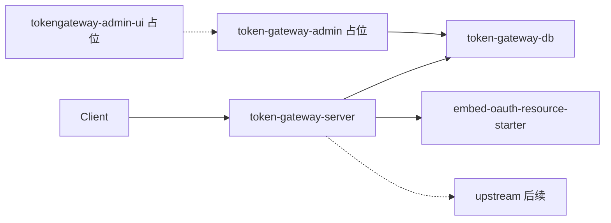

# US-G0-01 工程骨架设计

> **用户故事**：[../02-用户故事.md](../02-用户故事.md) · US-G0-01  
> **状态**：骨架已落地（**与设计冲突时以仓库多模块骨架为准**）  
> **范围**：可启动空壳 + 架构约定；不含代理 / 计费 / 建表业务  
> **文档位置**：`token-gateway/docs/design/`

---

## 1. 已确认选型

| 项 | 决定 |
|----|------|
| 语言 / 框架 | Java 21 + Spring Boot 3.4.x |
| Web 栈 | **Spring WebMVC（Servlet）**；流式用 `SseEmitter` |
| 构建 | Maven **多模块**（父 POM + server / db / admin） |
| 身份对接 | `embed-oauth-resource-starter`（`-Puc-rs`；业务验签 → G0-05） |
| 数据库 | MySQL 8.x；表结构与访问在 **`token-gateway-db`**（MyBatis-Plus）；Flyway 目录预留 |
| 包名 | **`com.mfs.tokengateway`**（server / db / admin 分子包） |
| 默认端口 | `8088`（server） |
| 管理端 | **模块占位**，本期不实现；运维直改库 |

> 说明：父工程下**不应**再保留旧单模块源码（`com.ftcs.tokengateway` 或嵌套 `token-gateway/token-gateway`）。若仓库中仍有残留，删除之。

---

## 2. 模块与分层



### 2.1 `token-gateway-server`

| 包 | 职责 | G0-01 |
|----|------|-------|
| `…server.api` | HTTP 入站 | `HealthController`（`GET /health`） |
| `…server.application` | 用例编排 | 空包 |
| `…server.domain` | 领域模型 | 空包 |
| `…server.config` | Security、Properties | `SecurityConfig`、`TokenGatewayProperties` |
| `…server.utils` | 工具 | 空包 |

### 2.2 `token-gateway-db`

| 包 | 职责 |
|----|------|
| `…db.po` / `mapper` / `dbservice` | 共享持久化（G0-02 起） |
| `resources/db/migration` | Flyway 脚本目录预留 |

### 2.3 管理端占位规划（本期不实现）

本期只占模块与包结构，**不**启用可执行 Boot 打包、**不**实现页面/API。运营阶段再补。

#### `token-gateway-admin`（后端）

| 包 | 规划职责 | 本期 |
|----|----------|------|
| `…admin.api` | 管理 HTTP（充值、禁用 Key、调价、流水查询等） | 空包 |
| `…admin.application` | 用例编排；改余额/状态**必须写流水** | 空包 |
| `…admin.domain` | 管理侧领域对象 | 空包 |
| `…admin.config` | 管理端安全（独立鉴权，勿与消费方 `sk-` 混用） | 空包 |
| `…admin.utils` | 工具 | 空包 |

依赖：`token-gateway-db`（读写同一套表）。与 server **进程分离**（后续可独立端口部署）。

建议后续故事（运营阶段，非正式 G0）：

| 能力 | 说明 |
|------|------|
| 账户/余额调整 | 充值、扣减；必写 ledger |
| Key 运维 | 按 `name` 禁用/启用、轮换 |
| 价目 | 两档单价（CNY 厘）调整与生效时间 |
| 流水只读 | 按用户 / Key / 时间查询 |
| 鉴权 | 管理身份（非消费方 JWT / sk-） |

在管理端上线前：运维 **直接改库**，且 **必须写流水**（见需求 §6.2）。

#### `tokengateway-admin-ui`（前端）

| 项 | 规划 |
|----|------|
| 技术 | Vue3 + Vite（落地时再脚手架） |
| 对接 | 仅调 `token-gateway-admin` |
| 本期 | 仅 README 占位，无 `package.json` / 页面 |

---

## 3. 依赖要点（server）

- `spring-boot-starter-web` + `actuator` + `security` + `validation` + `log4j2`（已排除默认 logging）
- `token-gateway-db`（传递 JDBC / MyBatis-Plus / MySQL 驱动）
- `embed-oauth-resource-starter`：**默认不引入**；`-Puc-rs` 开启（G0-05；需 Aliyun RDC）
- Security：探活 permitAll；其余 authenticated；骨架期关闭 httpBasic/formLogin（避免默认用户噪声）

默认启动 **排除** `DataSourceAutoConfiguration` / `MybatisPlusAutoConfiguration`，保证无库可起。

---

## 4. 安全路径约定

| 路径 | 鉴权 | 故事 |
|------|------|------|
| `GET /health`、`GET /actuator/health` | permitAll | G0-01 |
| `POST /v1/keys/**` | UC JWT | G0-05 / 06 |
| `POST /v1/chat/completions`、`GET /v1/usage/me` | 网关 `sk-` | G0-08 / 16 |
| 管理 API（admin 模块） | 管理身份；占位 | 运营阶段 |

Chat 路径 **禁止** 误配成仅 UC JWT。

---

## 5. 配置（可启动）

| 文件 | 说明 |
|------|------|
| `token-gateway-server/src/main/resources/application.yml` | 默认（端口 8088、探活、上游/UC 占位键） |
| `application-local.yml.example` | 本地示例 → 复制为 `application-local.yml` |
| `token-gateway-server/.env.example` | 环境变量清单 |

| 键 / 环境变量 | 说明 |
|---------------|------|
| `SERVER_PORT` | 默认 8088 |
| `MYSQL_*` | DataSource（联库后） |
| `UC_ISSUER_URI` | 用户中心 Issuer |
| `DEEPSEEK_API_KEY` / `DEEPSEEK_BASE_URL` | 上游 |

本地 profile：

```bash
# 复制示例后
# spring.profiles.active=local
mvn -pl token-gateway-server spring-boot:run
```

---

## 6. 启动验收

```bash
cd token-gateway
mvn -q -DskipTests package
java -jar token-gateway-server/target/token-gateway-server-1.0.0-SNAPSHOT.jar
curl.exe -s http://127.0.0.1:8088/health
# {"status":"UP"}
```

PowerShell：`-D` 用 `mvn --% …`；探活用 `curl.exe`。父 POM 已加 `flatten-maven-plugin`，`install` 后再 `-pl token-gateway-server spring-boot:run` 也可。

---

## 7. 本故事不做 / 后续

| 不做 | 后续 |
|------|------|
| Flyway 建表 | US-G0-02 |
| UC JWT 业务接口 | US-G0-05 / 06 |
| DeepSeek 代理 / 流式 | US-G0-03 / 04 |
| `sk-` 鉴权与扣费 | US-G0-08 / 10 |
| 管理端业务与 UI | 运营阶段（模块与包已规划占位） |
