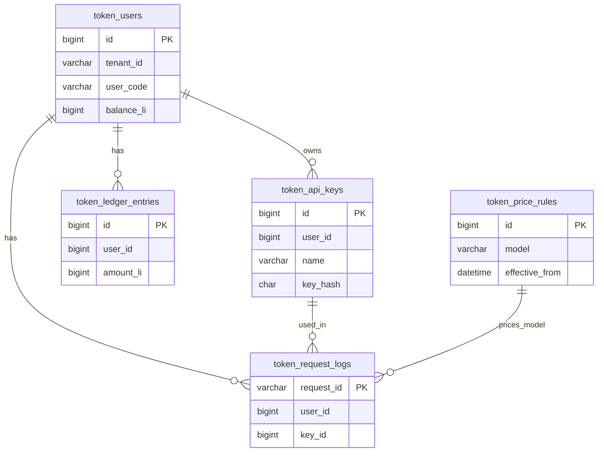

# US-G0-02 计费库表与厘单位设计

> **用户故事**：[../02-用户故事.md](../02-用户故事.md) · US-G0-02  
> **状态**：编码已落地（Flyway `V1_0_0` + PO/Mapper + local 配置约定）  
> **范围**：计费最小表集 + 厘单位约定 + Flyway / 共库与历史表策略；不含代理 / 鉴权业务逻辑  
> **需求映射**：[../01-需求.md](../01-需求.md) §7.0、§8.1、§8.3；FR-BILL-01；OQ-06；AT-13  
> **文档位置**：`token-gateway/docs/design/`

---

## 1. 已确认选型

| 项 | 决定 |
|----|------|
| 库 | MySQL 8.x（逻辑库名常用 `token_gateway`）；字符集 `utf8mb4` / **`utf8mb4_bin`（禁止默认用 `utf8mb4_unicode_ci`）** |
| **共库策略** | **允许与其它应用共库**；业务表一律 **`token_` 前缀**（见 §1.1） |
| 迁移 | **Flyway**；脚本在 **`token-gateway-db`**，由 **`token-gateway-server`** 启动时执行 |
| **版本对齐** | 与 **Maven 发布版本**对齐（不含 SNAPSHOT 后缀）；见 §6.4 |
| 访问 | MyBatis-Plus；PO / Mapper 在 `token-gateway-db`；表名显式 `@TableName("token_…")` |
| 金额 | **CNY 厘**；约定 **1 元 = 1000 厘**；库内不存小数 / 浮点金额 |
| 时间 | `DATETIME(3)`；语义按 **UTC**（NFR-08） |
| 外键约束 | MVP **不建**物理外键；应用层保证引用完整 |
| 管理端 | **本期不实现**；运维直改库见 US-G0-09 / US-G0-15 |

包名与持久化类型落在 `com.mfs.tokengateway.db.*`。

### 1.1 逻辑实体 → 物理表名

对齐需求 §8.1 逻辑实体；物理表 **一律加前缀** `token_`：

| 需求逻辑实体 | 物理表名 |
|------------------|----------|
| users | `token_users` |
| api_keys | `token_api_keys` |
| price_rules | `token_price_rules` |
| ledger_entries | `token_ledger_entries` |
| request_logs | `token_request_logs` |

与其它业务共库时，靠 `token_` 前缀隔离命名空间，避免表名冲突。

---

## 2. 实体关系



要点：

- 余额在 **`token_users.balance_li`（账户级）**，与 Key 无关共享。
- Key **单独**表 `token_api_keys`，不落在 `token_users`。
- `token_request_logs.key_name` 冗余存客户端名，便于按名查询（需求 §8.2）。

---

## 3. 厘单位约定（对齐 AT-13）

| 约定 | 说明 |
|------|------|
| 货币 | CNY |
| 字段 | 金额类字段名 `*_li` 或 `*_li_per_mTok`；类型 **`BIGINT`** |
| 换算 | `1 元 = 1000 厘`；展示层可 `/ 1000`；库与 API 主字段用厘 |
| 符号 | `token_ledger_entries.amount_li`：**充正扣负**；`balance_li` / `balance_after_li` ≥ 0（应用保证，MVP 不强制 CHECK） |
| 价目 | `*_li_per_mTok` = 厘 / 百万 Token（整数） |
| 禁止 | `DECIMAL` / `NUMERIC` / `FLOAT` / `DOUBLE` / `REAL` 存金额 |

Java 侧：PO 用 `Long` 映射 `*_li`；禁止用 `BigDecimal`/`Double` 持久化余额/流水/价目金额。

---
## 4. 物理表 DDL（对齐迁移脚本）

下列 DDL 与仓库首版迁移一致；应用版本 `1.0.0`（见 §6.4）。

脚本路径：

`token-gateway-db/src/main/resources/db/migration/V1_0_0__init_billing_schema.sql`

引擎：`InnoDB`。每张表 SQL 末尾显式指定字符集与排序规则（共库时也不继承错误库级 collation）：`DEFAULT CHARSET=utf8mb4 COLLATE=utf8mb4_bin`。

### 4.1 `token_users`

```sql
CREATE TABLE token_users (
  id              BIGINT       NOT NULL AUTO_INCREMENT,
  tenant_id       VARCHAR(64)  NOT NULL COMMENT 'UC 租户',
  user_code       VARCHAR(128) NOT NULL COMMENT 'UC 用户编码',
  balance_li      BIGINT       NOT NULL DEFAULT 0 COMMENT '余额（厘）',
  status          VARCHAR(32)  NOT NULL DEFAULT 'active' COMMENT 'active|disabled',
  rpm_limit       INT          NULL COMMENT '账户 RPM；NULL=用默认',
  tpm_limit       INT          NULL COMMENT '账户 TPM',
  daily_limit_li  BIGINT       NULL COMMENT '日消费限额（厘）',
  created_at      DATETIME(3)  NOT NULL DEFAULT CURRENT_TIMESTAMP(3),
  updated_at      DATETIME(3)  NOT NULL DEFAULT CURRENT_TIMESTAMP(3) ON UPDATE CURRENT_TIMESTAMP(3),
  PRIMARY KEY (id),
  UNIQUE KEY uk_token_users_tenant_user (tenant_id, user_code),
  KEY idx_token_users_status (status)
) ENGINE=InnoDB DEFAULT CHARSET=utf8mb4 COLLATE=utf8mb4_bin
  COMMENT='计费账户；余额跨 Key 共享';
```

### 4.2 `token_api_keys`

```sql
CREATE TABLE token_api_keys (
  id           BIGINT       NOT NULL AUTO_INCREMENT,
  user_id      BIGINT       NOT NULL COMMENT '逻辑引用 token_users.id',
  name         VARCHAR(64)  NOT NULL COMMENT '客户端名，如 ftcs-desktop',
  key_hash     CHAR(64)     NOT NULL COMMENT 'SHA-256 hex；见 §5',
  key_prefix   VARCHAR(32)  NOT NULL COMMENT '展示前缀，如 sk-ab12',
  status       VARCHAR(32)  NOT NULL DEFAULT 'active' COMMENT 'active|disabled',
  created_at   DATETIME(3)  NOT NULL DEFAULT CURRENT_TIMESTAMP(3),
  updated_at   DATETIME(3)  NOT NULL DEFAULT CURRENT_TIMESTAMP(3) ON UPDATE CURRENT_TIMESTAMP(3),
  last_used_at DATETIME(3)  NULL,
  PRIMARY KEY (id),
  UNIQUE KEY uk_token_api_keys_user_name (user_id, name),
  UNIQUE KEY uk_token_api_keys_hash (key_hash),
  KEY idx_token_api_keys_user_status (user_id, status)
) ENGINE=InnoDB DEFAULT CHARSET=utf8mb4 COLLATE=utf8mb4_bin
  COMMENT='按名管理的 API Key；明文仅返回一次';
```

> Chat 鉴权链路（G0-08）：`sk-` → `key_hash` → `user_id` + `name`。

### 4.3 `token_price_rules`

```sql
CREATE TABLE token_price_rules (
  id                                  BIGINT       NOT NULL AUTO_INCREMENT,
  model                               VARCHAR(128) NOT NULL COMMENT '请求 model 标识',
  input_price_li_per_mTok             BIGINT       NOT NULL COMMENT '对用户输入单价（厘/MTok）',
  output_price_li_per_mTok            BIGINT       NOT NULL COMMENT '对用户输出单价（厘/MTok）',
  upstream_input_cost_li_per_mTok     BIGINT       NOT NULL COMMENT '上游未缓存输入成本',
  upstream_cache_cost_li_per_mTok     BIGINT       NOT NULL COMMENT '上游缓存输入成本',
  upstream_output_cost_li_per_mTok    BIGINT       NOT NULL COMMENT '上游输出成本',
  effective_from                      DATETIME(3)  NOT NULL COMMENT '生效时间（UTC）',
  created_at                          DATETIME(3)  NOT NULL DEFAULT CURRENT_TIMESTAMP(3),
  PRIMARY KEY (id),
  UNIQUE KEY uk_token_price_model_from (model, effective_from),
  KEY idx_token_price_model_from (model, effective_from)
) ENGINE=InnoDB DEFAULT CHARSET=utf8mb4 COLLATE=utf8mb4_bin
  COMMENT='价目版本；调价插入新行，勿覆盖历史';
```

调价约定（G0-09）：插入新行；取价按 `model` 且 `effective_from <= 请求时刻` 中 `effective_from` 最大的一条。

### 4.4 `token_ledger_entries`

```sql
CREATE TABLE token_ledger_entries (
  id               BIGINT       NOT NULL AUTO_INCREMENT,
  user_id          BIGINT       NOT NULL,
  type             VARCHAR(32)  NOT NULL COMMENT 'topup|charge|adjust',
  amount_li        BIGINT       NOT NULL COMMENT '变动金额（厘）',
  balance_after_li BIGINT       NOT NULL COMMENT '变动后余额（厘）',
  request_id       VARCHAR(64)  NULL COMMENT '关联 token_request_logs.request_id',
  note             VARCHAR(512) NULL COMMENT '人工 topup/adjust 备注',
  operator         VARCHAR(128) NULL COMMENT '人工操作者（topup/adjust 必填）',
  created_at       DATETIME(3)  NOT NULL DEFAULT CURRENT_TIMESTAMP(3),
  PRIMARY KEY (id),
  KEY idx_token_ledger_user_time (user_id, created_at),
  KEY idx_token_ledger_request (request_id),
  KEY idx_token_ledger_type_time (type, created_at)
) ENGINE=InnoDB DEFAULT CHARSET=utf8mb4 COLLATE=utf8mb4_bin
  COMMENT='账本流水；改余额必须同事务写流水';
```

运维与扣费（G0-10）约束：

- `type=topup|adjust`：`operator`、`note` **必填**。
- `type=charge`：`request_id` **必填**；同一 `(type, request_id)` 的 charge 不得重复扣费（幂等由应用保证，MVP 可不建唯一索引）。

### 4.5 `token_request_logs`

```sql
CREATE TABLE token_request_logs (
  request_id         VARCHAR(64)  NOT NULL COMMENT '网关请求 ID',
  user_id            BIGINT       NOT NULL,
  key_id             BIGINT       NOT NULL,
  key_name           VARCHAR(64)  NOT NULL COMMENT '冗余 token_api_keys.name',
  model              VARCHAR(128) NOT NULL,
  status             VARCHAR(32)  NOT NULL COMMENT 'success|error|interrupted',
  prompt_tokens      INT          NULL,
  completion_tokens  INT          NULL,
  cached_tokens      INT          NULL,
  uncached_tokens    INT          NULL,
  revenue_li         BIGINT       NULL COMMENT '收入（厘）',
  cogs_li            BIGINT       NULL COMMENT '成本（厘）',
  margin_li          BIGINT       NULL COMMENT '毛利（厘）',
  latency_ms         INT          NULL,
  upstream_status    INT          NULL,
  error_summary      VARCHAR(512) NULL COMMENT '摘要；禁止存 prompt/completion 正文',
  billing_status     VARCHAR(32)  NOT NULL DEFAULT 'pending'
                       COMMENT 'charged|skipped_no_usage|pending',
  created_at         DATETIME(3)  NOT NULL DEFAULT CURRENT_TIMESTAMP(3),
  PRIMARY KEY (request_id),
  KEY idx_token_req_user_time (user_id, created_at),
  KEY idx_token_req_key_name_time (key_name, created_at),
  KEY idx_token_req_billing_time (billing_status, created_at),
  KEY idx_token_req_model_time (model, created_at)
) ENGINE=InnoDB DEFAULT CHARSET=utf8mb4 COLLATE=utf8mb4_bin
  COMMENT='请求计量；不存 prompts/completions 正文';
```

对齐需求 §8.2：计量与对账字段保留；**禁止**持久化完整 prompt / completion。

---

## 5. Key 哈希与存储约定

明文仅在 `keys/rotate`（创建或重置）时返回一次；持久化与鉴权（US-G0-06 / US-G0-08）约定：

| 项 | 约定 |
|----|------|
| 算法 | SHA-256；输出 **小写 hex**；定长 64 字符 → `CHAR(64)` |
| 输入 | `pepper || raw_api_key`（字节拼接；pepper 与 raw 均按 UTF-8 编码后再拼接） |
| Pepper | 环境变量 `GATEWAY_KEY_PEPPER`；生产必填；禁止入库 |
| 写入 | 在 `keys/rotate`（创建或重置）时同时写入新的 `key_hash` + `key_prefix` |
| 运维定位 | 按 `(user_id, name)` 定位 **`token_api_keys`** 行；勿手改 hash/prefix 除非已知明文 |

细节见仓库 [`token-gateway/README.md`](../../README.md)「API Key 哈希」一节。

---
## 6. Flyway 与模块职责

### 6.1 模块分工

| 模块 | 职责 |
|------|------|
| `token-gateway-db` | `db/migration/*.sql`、共享 PO / Mapper / dbservice |
| `token-gateway-server` | 启用 Flyway + DataSource；启动时执行迁移 |

### 6.2 共库、历史表与本地凭证（已落地）

- **允许与其它应用共库**（例如与 oauth 同实例同 schema）。业务表靠 `token_*` 前缀隔离；**勿**要求独占空库。
- Flyway 历史表名配置为 **`spring.flyway.table: token_flyway_schema_history`**，与共库方默认的 `flyway_schema_history` 隔离。
- **`baseline-on-migrate: false`**：不使用 Flyway 自带 baseline（其实现含 `CREATE TABLE ... SELECT`，**TiDB 不支持**）。
- **`TokenFlywayHistoryBootstrap`**：在 Flyway migrate 前用普通 DDL **预建** `token_flyway_schema_history`；若表为空则写入 baseline 版本 `0`，再交给 Flyway 执行 `V1_0_0__…`。适用于 TiDB / 非空 schema / 共库场景。
- `application.yml` 可提交 DataSource URL 模板与 Flyway 开关；**账号密码等凭证放 `application-local.yml`（或 `MYSQL_*`），勿把真实密钥写进已提交的 `application.yml`**。
- 表与历史表均使用 **`utf8mb4_bin`**。
- 首版脚本：**`V1_0_0__init_billing_schema.sql`**。

提交仓库中的 Flyway 相关片段（示意）：

```yaml
spring:
  datasource:
    # 可与其它业务共库（表均为 token_*）。账号请用 application-local.yml 或 MYSQL_*。
    url: jdbc:mysql://${MYSQL_HOST:127.0.0.1}:${MYSQL_PORT:3306}/${MYSQL_DATABASE:token_gateway}?useUnicode=true&characterEncoding=utf8&connectionTimeZone=UTC&serverTimezone=UTC
    username: ${MYSQL_USER:root}
    password: ${MYSQL_PASSWORD:}
  flyway:
    enabled: true
    encoding: UTF-8
    locations: classpath:db/migration
    table: token_flyway_schema_history
    # 关闭自带 baseline；TiDB / 非空库由 TokenFlywayHistoryBootstrap 预建历史表
    baseline-on-migrate: false
```

本地覆盖示例见 `application-local.yml.example`（复制为 `application-local.yml` 后填真实账号，**勿提交**）。

环境变量清单：`MYSQL_HOST` / `MYSQL_PORT` / `MYSQL_DATABASE` / `MYSQL_USER` / `MYSQL_PASSWORD`（及 `.env.example`）。

### 6.3 迁移执行与变更纪律

- 脚本须可重复部署：已成功 migrate 的环境不应因重复启动失败。
- 已发布脚本的 checksum 禁止直接改写历史文件。
- **禁止**在已上线环境手工改已应用脚本内容后指望 Flyway 自动修复；需要变更时按 **追加新版本** 处理（见 §6.4）。

### 6.4 版本号 ↔ 迁移文件命名

发布版本与 schema 演进对齐；开发期 SNAPSHOT **不**单独占 Flyway 版本号。

| 约定 | 说明 |
|------|------|
| 文件名 | `V{major}_{minor}_{patch}__{desc}.sql` |
| 与 pom | 正式 **prod / 发版** 用 `major.minor.patch`（如 `1.0.0`）；开发可用 `1.0.0-SNAPSHOT` |
| Flyway 版本 | 文件名 `1_0_0` 对应版本 `1.0.0`（点号分隔） |
| 已发布脚本 | **不可改写**原文 |
| 线上热修 / 增量 | 追加 **新版本号** `V{新版本}__描述.sql`；勿在已发布文件上叠 `V1_0_0_1` 这类旁路命名 |
| SNAPSHOT 开发期 | 仅本地可重建库时允许 wipe；一旦脚本随发版出去，后续只追加 |
| 发版节奏 | 例如 `1.0.1` 含 schema 变更 → 发 `1.0.2` 时带 `V1_0_2__….sql`；勿回头改 `V1_0_1` |

示例：

```text
V1_0_0__init_billing_schema.sql    # 对齐 1.0.0 首版建表
V1_0_1__add_xxx.sql                # 对齐 1.0.1 增量
V1_1_0__….sql                      # 对齐 1.1.0
```

`pom` 的 `dev` profile 可用 `1.0.0-SNAPSHOT` 做日常构建；**正式 prod / 打 tag 为 `1.0.0` 时与 Flyway `V1_0_0` 对齐**。切勿把 SNAPSHOT 字符串塞进 Flyway 版本；也**不要**为每个 SNAPSHOT 迭代新建迁移文件。

---

## 7. 改库运维约定（对齐 §8.3）

1. **充值**：同一事务内 `UPDATE token_users.balance_li` + `INSERT token_ledger_entries (type=topup, …)`；`operator`/`note` 必填。例：入账 10 元 → `10000` 厘。
2. **调账**：同事务写流水（`adjust`）。
3. **禁用 Key**：`UPDATE token_api_keys SET status='disabled' WHERE user_id=? AND name=?`。
4. **调价**：`INSERT` 新 `token_price_rules` 行并设 `effective_from`；勿 UPDATE 覆盖历史价。
5. 示例 SQL（非阻塞 G0-15）：`token-gateway/ops/*.sql` 仓库内可维护。

充值示例 SQL：

```sql
START TRANSACTION;
UPDATE token_users
   SET balance_li = balance_li + 10000, updated_at = UTC_TIMESTAMP(3)
 WHERE id = ?;
INSERT INTO token_ledger_entries (user_id, type, amount_li, balance_after_li, note, operator, created_at)
SELECT id, 'topup', 10000, balance_li, 'manual topup 10 CNY', 'ops:alice', UTC_TIMESTAMP(3)
  FROM token_users WHERE id = ?;
COMMIT;
```

---
## 8. 本故事交付物

| 交付物 | 说明 |
|------|------|
| `V1_0_0__init_billing_schema.sql` | §4 五张 `token_*` 表；对齐版本 `1.0.0` |
| PO × 5 | `…db.po` + `@TableName("token_…")`；金额字段 `Long` |
| Mapper × 5 | `…db.mapper`；继承 BaseMapper + `@Mapper` |
| server：`flyway-core` + 常开 DataSource | 启动即迁移 |
| `TokenFlywayHistoryBootstrap` | 预建 `token_flyway_schema_history`（共库 / TiDB） |
| README：Key 哈希与共库说明 | 对齐 §5、§6.2 |
| 示例 `ops/topup_example.sql` 等 | 对齐 §7 |

---

## 9. 验收要点

| 验收项 | 判定依据 |
|----------|----------------|
| 迁移可重复执行 | Flyway + 预建历史表；二次启动不因已应用脚本失败 |
| `(tenant_id, user_code)` 唯一 | `uk_token_users_tenant_user` |
| `(user_id, name)` 唯一 | `uk_token_api_keys_user_name` |
| 无浮点金额字段 | 仅 `BIGINT` `*_li`；§3 约定 |
| AT-13 | 1 元 = 1000 厘；读写均为整数厘 |
| 表名前缀 | 五表均为 `token_*`（§1.1） |
| 版本与脚本对齐 | `V1_0_0` ↔ 发布 `1.0.0`（§6.4；不含 SNAPSHOT） |
| 排序规则 | 表级 `utf8mb4_bin`；共库亦可 |
| 共库 / 历史表 | `token_flyway_schema_history`；`baseline-on-migrate: false`；Bootstrap 预建 |
| 凭证不入库 | 真实账号在 local / 环境变量，非已提交 `application.yml` |

建议手工验收步骤：

1. 配置可达 MySQL/TiDB，启动 server；确认 `token_flyway_schema_history` 有 baseline `0` 与成功记录 `1.0.0`（脚本 `V1_0_0__…`）。  
2. `SHOW TABLES LIKE 'token_%'` 见五表；`SHOW CREATE TABLE` 无 `decimal`/`double`/`float` 金额列，且 `COLLATE=utf8mb4_bin`。  
3. 插入冲突数据验证 UNIQUE。  
4. 按 §7 充值 10000 厘，核对 `balance_li` 与流水。  
5. 二次启动无迁移报错；G0-02 本故事验收通过。

---

## 10. 本故事不做 / 后续

| 不做 | 后续故事 |
|------|----------|
| UC JWT / provision | US-G0-05 / 06 |
| `sk-` 鉴权 | US-G0-08 |
| 价目读取与计价公式实现 | US-G0-09 |
| 扣费与账本写路径 | US-G0-10 / 12 |
| 余额预检 | US-G0-11 |
| 完整 ops 文档化 | US-G0-15 |

---

## 11. 枚举取值（应用约定）

| 字段 | 取值集 |
|----|--------|
| `token_users.status` / `token_api_keys.status` | `active`, `disabled` |
| `token_ledger_entries.type` | `topup`, `charge`, `adjust` |
| `token_request_logs.status` | `success`, `error`, `interrupted` |
| `token_request_logs.billing_status` | `pending`, `charged`, `skipped_no_usage` |

MVP 可用应用层校验枚举；不必强制 MySQL ENUM 类型。