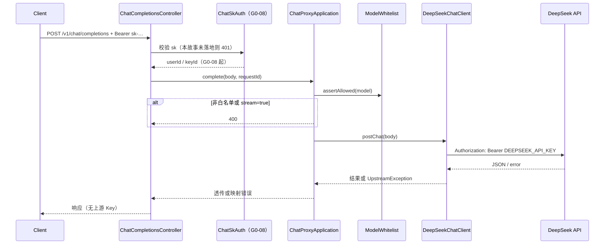

# US-G0-03 DeepSeek 非流式白名单代理设计

> **用户故事**：[../02-用户故事.md](../02-用户故事.md) · US-G0-03  
> **状态**：编码已落地（单测 Mock 上游；HTTP 鉴权占位 401；真上游联调随 G0-08）  
> **范围**：`POST /v1/chat/completions`（仅 `stream=false`）→ 白名单校验 → 转发 DeepSeek → 透传/映射响应；**不含**流式、sk 鉴权、扣费、价目、`GET /v1/models`  
> **需求映射**：[../01-需求.md](../01-需求.md) FR-PROXY-01/05/06/07；AT-04（模型部分）  
> **依赖**：US-G0-01（骨架、上游配置占位）  
> **后续衔接**：US-G0-04（SSE）；US-G0-08（sk 鉴权）；US-G0-09/10（计价扣费）  
> **文档位置**：`token-gateway/docs/design/`

---

## 0. 相对故事原文的澄清

| 故事原文 / 旧习惯 | 本设计约定 |
|-------------------|------------|
| 「可先用临时测试 Key 或跳过鉴权开关联调」 | **取消**。不设计测试 Key、不提供 `allow-unauthenticated` / skip-auth 开关 |
| 本故事验收含「能对真上游联调通」 | **改为**：编码期以 **单测（Mock 上游）** 验收代理与白名单；**与 US-G0-08（及计费相关故事）就绪后统一联调** |
| 鉴权 | 正式契约为网关 `sk-`（需求 §6.1）；**实现归属 US-G0-08**，本故事不实现、不绕过 |

---

## 1. 已确认选型

| 项 | 决定 |
|----|------|
| 接口 | `POST /v1/chat/completions`（OpenAI Chat Completions 语义） |
| 本故事仅 | `stream=false`（缺省或显式 false）；`stream=true` → **400** `stream_not_supported`（留给 G0-04） |
| 上游 | 固定 DeepSeek；`baseUrl` + `apiKey` 仅服务端（已有 `token-gateway.upstream.deepseek.*` / `DEEPSEEK_*`） |
| 上游路径 | `{baseUrl}/chat/completions`（兼容官方；`baseUrl` 默认可为 `https://api.deepseek.com`，**不要**再拼多余 `/v1` 除非配置里已含） |
| 白名单 | **配置列表**（本故事）；默认含当前官方模型 ID（见 §5）；非白名单 → **400** `model_not_allowed` |
| 请求体 | JSON 透传（校验 `model` 必填 + 白名单 + stream 规则）；**不改写** messages 等内容 |
| 成功响应 | 透传上游 JSON 与合理 HTTP 状态（通常 200） |
| 上游错误 | 映射为对客户端可理解的状态/摘要；**禁止**回传上游 Key、内部 URL 密钥查询串 |
| 鉴权 | 本故事 **不实现**；入口在 G0-08 前对未鉴权调用 **统一 401**（见 §4.4），无绕过配置 |
| 计费 / 流水 | **不做**（G0-09/10） |
| HTTP 客户端 | Spring **`RestClient`**（同步；非流式足够） |
| 可观测 | 复用已有 `requestId` / AccessLog；**禁止**打 prompt/completion 正文、上游 Key |

---

## 2. 目标与非目标

### 2.1 目标

1. 客户端（最终以 sk 调用）可用 OpenAI 兼容非流式 Chat 打到白名单内 DeepSeek 模型。  
2. 非白名单 / 非约定模型 ID → 4xx，不访问上游。  
3. 上游 Key 仅出站 Authorization 使用，永不进入对客户端响应或日志。  
4. 为 G0-04/08/10 留出清晰挂载点（鉴权过滤器、流式分支、扣费钩子）。

### 2.2 非目标

| 不做 | 归属 |
|------|------|
| `stream=true` / SSE | US-G0-04 |
| 网关 `sk-` 校验、禁用账户/Key | US-G0-08 |
| 临时测试 Key / 跳过鉴权开关 | **明确不做** |
| 余额预检、扣费、`token_request_logs` 落库 | US-G0-10 / 11 |
| 从 `token_price_rules` 动态白名单 | US-G0-09 后；列表 API 为 US-G0-17 |
| `GET /v1/models` | US-G0-17 |
| 多上游、Anthropic 兼容入口 | Out of Scope |
| RPM/TPM 限流 | US-G0-13（若编号有）/ FR-RISK |

---

## 3. 流程



本故事编码时：`Auth` 为 **拒绝未实现鉴权** 的占位（401）；`App`/`DS`/`WL` 用单测覆盖。

---

## 4. API 契约

### 4.1 请求

```http
POST /v1/chat/completions HTTP/1.1
Authorization: Bearer sk-xxxxxxxx
Content-Type: application/json

{
  "model": "deepseek-v4-flash",
  "messages": [
    {"role": "user", "content": "Hello"}
  ],
  "stream": false
}
```

| 字段 | 本故事规则 |
|------|------------|
| `model` | 必填；必须落在白名单 |
| `stream` | 缺省视为 `false`；为 `true` → 400 `stream_not_supported` |
| 其他 | 透传上游（temperature、tools、thinking 等由上游解释） |
| `Authorization` | 契约为网关 sk；**G0-08 前占位：无有效鉴权实现 → 401**（见 §4.4） |

### 4.2 成功响应

- HTTP 状态与上游成功响应一致（一般为 200）。  
- Body：上游 Chat Completions JSON **原样透传**（含 `usage`、`choices`、`reasoning_content` 等若存在）。  
- 网关可增加/保留响应头 `X-Request-Id`（与现网一致）。

### 4.3 本故事错误

| HTTP | 码 / 场景 |
|------|-----------|
| 401 | 鉴权未通过（G0-08 前：一律视为未授权，见 §4.4） |
| 400 | `model` 缺失 → `model_required` |
| 400 | model 非白名单 → `model_not_allowed` |
| 400 | `stream=true` → `stream_not_supported` |
| 400 | Body 非 JSON / 无法解析 |
| 502 / 504 | 上游失败 / 超时（映射后，见 §6） |
| 503 | 未配置 `DEEPSEEK_API_KEY` → `upstream_not_configured` |

错误体建议与现有短码风格一致（Spring 默认或统一 `{ "error": { "code", "message" } }`——编码时与 whoami/rotate 错误风格对齐，优先短 `message` 码）。

### 4.4 鉴权占位（无绕过）

| 项 | 约定 |
|----|------|
| 目的 | 避免「代理已合并、sk 未上」时匿名消耗上游额度 |
| 行为 | G0-08 落地前，Chat 入口 **固定 401**（如 `sk_auth_pending` 或 `unauthorized`） |
| 禁止 | 环境变量/配置打开「免鉴权」「测试 Key 直通」 |
| 开发验证 | **Mock 上游的单测** 覆盖代理链路；真上游 + 真 sk **统一联调**（G0-08+） |
| G0-08 | 替换占位为：hash 查 Key → 校验 status → 注入用户上下文后再调 `ChatProxyApplication` |

`/v1/chat/completions` **不要**加入 UC JWT `protected-patterns`（需求：Chat 用 sk，不是 UC token）。

---

## 5. 模型白名单

### 5.1 配置

```yaml
token-gateway:
  upstream:
    deepseek:
      api-key: ${DEEPSEEK_API_KEY:}
      base-url: ${DEEPSEEK_BASE_URL:https://api.deepseek.com}
      allowed-models:
        - deepseek-v4-flash
        - deepseek-v4-pro
      connect-timeout: 5s
      read-timeout: 120s
```

| 说明 | |
|------|--|
| 默认模型 | 对齐 DeepSeek 当前官方 Chat 模型 ID（`deepseek-v4-flash` / `deepseek-v4-pro`）。历史名 `deepseek-chat` / `deepseek-reasoner` **默认不放行**（已退役风险）；若业务短期需要，仅允许通过配置显式追加，不写死兼容 |
| 与价目关系 | G0-09 起价目表应以白名单模型为准；G0-17 列表可改为「有有效价目的 model」。本故事 **不读库**，避免依赖 G0-09 |
| 大小写 | `model` **区分大小写**，与上游一致；不做自动 lower-case |

### 5.2 校验时机

解析 JSON 取出 `model` → 白名单判断 → **通过后再**出站，避免无效流量打上游。

---

## 6. 上游调用与错误映射

### 6.1 出站

| 项 | 约定 |
|----|------|
| Method / URL | `POST {baseUrl}/chat/completions`（`baseUrl` 去尾 `/` 后拼接） |
| Header | `Authorization: Bearer {DEEPSEEK_API_KEY}`；`Content-Type: application/json` |
| Body | 客户端 JSON（可规范化：确保 `stream: false`） |
| 超时 | connect / read 可配；读超时宜偏长（推理模型） |
| 缺 Key | 不出站，503 `upstream_not_configured` |

### 6.2 错误映射

| 上游情况 | 对客户端 |
|----------|----------|
| 4xx（如 400/401/429） | 映射相近状态；body **重写**为网关错误摘要，去掉上游原始中可能含敏感信息的字段；上游 401（Key 无效）→ 对客户端 **502** `upstream_error`（避免与网关 sk 401 混淆） |
| 5xx | 502 `upstream_error` |
| 超时 / 连接失败 | 504 `upstream_timeout` / 502 `upstream_unreachable` |
| 响应非 JSON | 502 `upstream_invalid_response` |

**绝对禁止**：把 `DEEPSEEK_API_KEY`、完整上游请求头写进响应或 INFO 日志。

---

## 7. 包与类清单（编码）

| 类 | 包 | 职责 |
|----|----|------|
| `ChatCompletionsController` | `…server.api` | `POST /v1/chat/completions` |
| `ChatProxyApplication` | `…server.application` | 校验 stream/model → 调客户端 → 映射错误 |
| `DeepSeekChatClient` | `…server.upstream` | RestClient 出站 |
| `ModelWhitelist` | `…server.upstream` 或 `…application` | 读配置、`isAllowed` |
| `ChatAuthFacade`（占位） | `…server.security` | G0-03：恒 401；G0-08：sk 解析 |
| （可选）`UpstreamException` | `…server.upstream` | 带映射码的运行时异常 |

配置：扩展 `TokenGatewayProperties.Upstream.DeepSeek`：`allowedModels`、`connectTimeout`、`readTimeout`。

单测：

- 白名单通过 / 拒绝  
- `stream=true` → 400  
- Mock WebServer：成功透传；上游 401 → 客户端 502；响应/日志不含 apiKey  
- 缺上游 Key → 503  

---

## 8. 安全与隐私

| 项 | 约定 |
|----|------|
| 上游 Key | 仅内存配置；出站头；不落库 |
| Prompt | 不写 AccessLog message、不写应用 INFO |
| 对客户端 | 不暴露 DeepSeek 账户级错误细节中的密钥线索 |
| 发布 | **不单独对公网发布「无 G0-08 的 Chat」**；占位 401 为代码层双保险 |

---

## 9. 与前后故事衔接

| 故事 | 关系 |
|------|------|
| G0-01 | 已有 upstream 配置占位、端口、工程结构 |
| G0-04 | 同入口增加 stream 分支与 SSE；复用 Client 或并行流式客户端 |
| G0-08 | 替换 `ChatAuthFacade`；合法 sk 才进入 `ChatProxyApplication` |
| G0-09 | 价目；白名单长期可与价目对齐 |
| G0-10 | 在成功且取得 usage 后扣费；本故事不写账 |
| G0-14 | requestId / 访问日志已具备 |
| G0-17 | `GET /v1/models` 暴露白名单 |
| 桌面 / OpenCode | baseURL 指网关 `/v1`，Key 为 rotate 所得 sk；**统一联调**时再打通 |

**客户端注意**：统一联调前不要依赖 Chat 公网可用性；先完成 rotate（G0-06）拿 sk，再与 G0-08 一并验收。

---

## 10. 验收用例

| # | Given | When | Then |
|---|--------|------|------|
| P1 | 单测 Mock 上游；鉴权 Facade 在测试中可注入「已通过」替身 **仅用于单测** | `model` 白名单内、`stream=false` | 200；body 与 Mock 一致 |
| P2 | 同上 | `model=gpt-4o` 等非白名单 | 400 `model_not_allowed`；Mock **零请求** |
| P3 | 同上 | `stream=true` | 400 `stream_not_supported`；不上游 |
| P4 | 同上 | 上游返回 401 | 对调用方 502；body/日志无 `DEEPSEEK_API_KEY` |
| P5 | 未配上游 Key | 已通过鉴权替身的单测调用 | 503 `upstream_not_configured` |
| P6 | 真实 HTTP、无 G0-08 | 任意 Chat 请求 | **401**（占位）；无测试 Key 旁路 |
| P7 | （统一联调，G0-08+）合法 sk + 白名单模型 | 真上游 | 200；AT-04 非法模型仍 400 |

说明：P1 单测可用 `@TestConfiguration` 提供「鉴权通过」豆，**生产配置不得等同该替身**。

---

## 11. 编码任务清单（确认后）

1. ~~扩展 `TokenGatewayProperties`：`allowed-models`、超时。~~  
2. ~~`ModelWhitelist` + `DeepSeekChatClient`（RestClient）+ 单测（MockWebServer）。~~  
3. ~~`ChatProxyApplication` + 错误映射。~~  
4. ~~`ChatAuthFacade` 占位（生产 401）+ `ChatCompletionsController`。~~  
5. ~~更新 `home.html` / README。~~  
6. **不**做临时 Key；真上游联调列入 G0-08 后统一计划。

---

## 12. 本故事不做 / 后续

| 后续 | 说明 |
|------|------|
| US-G0-04 | SSE、`stream=true` |
| US-G0-08 | sk 鉴权替换占位 |
| US-G0-10 | usage 扣费与请求日志 |
| US-G0-17 | models 列表 |
| 白名单改读价目表 | G0-09 后可选重构 |
